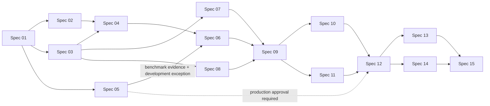

# Mistaken Spec and Parallel Delivery Plan

## Purpose

This document defines the complete implementation-spec set for Mistaken, the dependency graph between specs, safe parallel-terminal scenarios, model assignment, Git isolation, integration gates, and the required structure of every future spec.

It is a planning document, not an implementation spec. Before the application repository exists, high-model authors stage the 15 spec files under `/Users/berat/mistaken-context/specs/`. Spec 01 then imports the context bundle into `docs/context/`, this plan into `docs/context/spec-plan.md`, and the staged specs into `docs/specs/` in the dedicated Mistaken repository. Those repository paths become canonical after the baseline commit.

## Verified Baseline

- The current source is documentation-only: `project-overview.md`, `architecture.md`, `ui-context.md`, `code-standards.md`, `ai-workflow-rules.md`, and `progress-tracker.md`.
- `/Users/berat/mistaken-context` is not a Git repository and contains no Tauri, React, TypeScript, Rust, test, package, or platform source yet.
- The first implementation spec must therefore create a dedicated Mistaken repository and a reproducible build baseline.
- Parallel implementation cannot start from the documentation directory. It starts only after Spec 01 has produced a Git repository with a committed base SHA.
- Until that import commit exists, `/Users/berat/mistaken-context` is the authoring source of truth. Afterward, only the committed copies in the dedicated repository are edited.
- Product invariants are already fixed: local/offline operation, no account/backend/transcript database, no paid or cloud ASR fallback, two independent audio sources, source-based speaker identity, no grammar correction, bounded audio buffers, and in-memory transcript state.

## Total Spec Count

**15 implementation specs** will be produced.

This count is deliberate:

- Native platform work is split between macOS and Windows so it can run concurrently.
- ASR benchmarking is separated from ASR integration so model choice and redistribution rights are evidence-based.
- Microphone capture is proven before ASR is introduced.
- Full dual-stream integration waits for both platform adapters and microphone ASR.
- Packaging is split by operating system and followed by one cross-platform release gate.
- UI-only work is isolated from real-time native work where file ownership allows safe concurrency.

Combining these units would make failures harder to localize and would reduce parallelism. Splitting them further would create integration-only specs with no independently verifiable outcome.

## Spec Inventory

| ID | Spec file | Visible or measurable outcome | Primary ownership | Depends on | Preferred implementer |
| --- | --- | --- | --- | --- | --- |
| 01 | `spec-01-repository-desktop-bootstrap.md` | A dedicated Tauri 2 application repository launches a dark Mistaken window on the development host; context/spec documents and baseline checks are committed. | Repository root, documentation import, package/build configs, initial `src/`, initial `src-tauri/` | None | Medium, high review |
| 02 | `spec-02-transcript-domain-workspace.md` | The single-window transcript workspace renders deterministic microphone/system partial and final segments; Clear and Copy All work against in-memory state. | `src/features/transcript/**`, visual tokens, transcript UI tests | 01 | Medium |
| 03 | `spec-03-typed-ipc-runtime-spine.md` | React reads native model/capture status through typed commands and receives typed native events; subscriptions clean up. | `src/lib/tauri/**`, command/event types, Rust command/state spine | 01 | High |
| 04 | `spec-04-microphone-device-pcm-capture.md` | The user selects a microphone, starts/stops capture, and sees valid local PCM activity without ASR; Start → Stop → Start releases resources. | Common microphone adapter, `src/features/audio/**`, microphone permissions | 02, 03 | High |
| 05 | `spec-05-asr-benchmark-license-gate.md` | A reproducible incorrect-English benchmark corpus and harness compare local candidates; runtime/model licenses and redistribution status are recorded; production approval remains explicitly blocked until one candidate passes every gate. | `benchmarks/**`, local fixtures, benchmark tooling and evidence | 01 | High |
| 06 | `spec-06-local-asr-microphone-transcription.md` | A clearly labeled temporary local development adapter produces real microphone partial/final segments without correction, network, or unbounded buffering; it is replaceable and confers no production approval. | `src-tauri/src/asr/**`, model lifecycle, mic recognizer bridge | 04, 05 development decision | High |
| 07 | `spec-07-macos-system-audio-adapter.md` | On the approved macOS minimum version, ScreenCaptureKit yields bounded system-audio PCM with actionable permission/error states. | `src-tauri/src/audio/macos/**`, macOS entitlements/capabilities, macOS adapter checks | 03 | High |
| 08 | `spec-08-windows-system-audio-adapter.md` | On the approved Windows minimum version, WASAPI loopback yields bounded system-audio PCM without a virtual cable. | `src-tauri/src/audio/windows/**`, Windows capabilities/config, Windows adapter checks | 03 | High |
| 09 | `spec-09-dual-source-transcription-aggregation.md` | Microphone and system audio run through independent recognizers simultaneously; final transcript order is stable and only system lines receive `- `. Temporary-adapter transcript quality is development evidence only. | Shared audio/ASR orchestration, transcript aggregator, event integration | 06 development completion, 07, 08 | High |
| 10 | `spec-10-capture-lifecycle-resilience.md` | Permission denial, disconnect, missing model, slow inference, queue overflow, stop, restart, and shutdown produce bounded, recoverable behavior without leaks or cloud fallback. | Native lifecycle/error paths, bounded queues, audio status adapter | 09 development completion | High |
| 11 | `spec-11-desktop-interaction-accessibility.md` | Keyboard shortcuts, near-bottom auto-follow, Jump to latest, Clear confirmation, Copy feedback, focus states, resize behavior, and reduced motion satisfy the UI contract. | Transcript/application UI and accessibility tests; no native audio implementation | 09 development completion | Medium, high review |
| 12 | `spec-12-offline-privacy-performance-acceptance.md` | The complete core flow works with network disabled; no transcript/audio persistence or upload occurs; release acceptance and successor authorization require a production-approved Spec 05 candidate. | Acceptance harness, privacy inspection, performance evidence, cross-cutting fixes | 10, 11, and production-approved 05 for `PASS` | High |
| 13 | `spec-13-macos-packaging-distribution.md` | A reproducible macOS application bundle/install artifact contains the production-approved local runtime/model and declares only required permissions; no distributable `PASS` artifact may use the development adapter. | macOS bundle/resource/update configuration and packaging checks | Spec 12 `PASS` | Medium, high review |
| 14 | `spec-14-windows-packaging-distribution.md` | A reproducible Windows installer contains the production-approved local runtime/model, launches offline, and requests no unrelated capability; no distributable `PASS` artifact may use the development adapter. | Windows bundle/resource/installer configuration and packaging checks | Spec 12 `PASS` | Medium, high review |
| 15 | `spec-15-cross-platform-release-acceptance.md` | The same release candidate passes the full macOS and Windows user flow, source-separation corpus, unchanged Spec 05 production gates, offline/privacy checks, artifact manifest, and rollback checklist. | Release evidence, final cross-platform integration fixes, context/tracker reconciliation | 13, 14, and production-approved 05 | High |

## Dependency Graph



Normative dependency list:

- `01 → {02, 03, 05}`
- `{02, 03} → 04`
- `{04, 05 development decision} → 06`
- `03 → {07, 08}`
- `{06 development completion, 07, 08} → 09`
- `09 development completion → {10, 11}`
- `{10, 11, 05 production approval} → 12 PASS`
- `12 PASS → {13, 14}`
- `{13, 14, 05 production approval} → 15`

A dependency is satisfied only after the upstream branch has passed its spec checks, been reviewed, and been merged into the integration branch. “The code exists in another worktree” is not a satisfied dependency.

### ASR maturity and dependency semantics

The Spec 05 dependency has two distinct meanings:

1. **Development dependency satisfied:** Spec 05's current benchmark corpus, candidate identities, license/provenance records, measured failures, and explicit `BLOCKED — no candidate approved` verdict are merged, and the product owner has authorized one named **DEVELOPMENT ASR ADAPTER**. This allows Spec 06 and, after its development acceptance, Specs 09–11 to implement and verify architecture. The temporary adapter is `sherpa-zipformer-en-20M-2023-02-17-int8` with `sherpa-onnx` `v1.13.8`; it is local, native-streaming, license-recorded as `permitted-with-attribution`, and replaceable behind the existing recognizer abstraction. Its measured MPR 0.3241 fails the unchanged ≥ 0.90 gate. It is not a default, recommendation, production candidate, or release input.
2. **Production dependency unsatisfied:** Spec 05 has not named a production-approved ASR candidate. Spec 12 cannot return `PASS` or authorize Specs 13–14, packaging specs cannot produce distributable `PASS` artifacts, and Spec 15 cannot return `RELEASE-READY`. Only a later Spec 05 approval that passes every unchanged fidelity, accuracy, hallucination, latency, throughput, resource, license, provenance, redistribution, and required-platform gate satisfies this dependency.

Any downstream run using the development adapter must label the adapter maturity and all transcript-quality measurements `NON-RELEASE EVIDENCE`. Architecture checks may validate real capture, IPC, lifecycle, buffering, source separation, ordering, privacy, and replaceability; they may not be cited as ASR fidelity approval.

## Fastest Safe Implementation Schedule

### Wave 0 — High-model spec authoring

A high-reasoning model writes all 15 spec files from this plan under `/Users/berat/mistaken-context/specs/`. Multiple spec authors may work concurrently only because every spec has its own file. One high-model integration owner then checks all specs together for dependency, IPC, event, path-ownership, acceptance-test, and terminology consistency before implementation starts.

Recommended authoring split:

- Terminal A: Specs 01–05
- Terminal B: Specs 06–10
- Terminal C: Specs 11–15
- Integration owner: cross-spec review and `progress-tracker.md` update

Authors must not independently edit shared context files. They return their spec files to the integration owner, who performs the single context/tracker update.

### Wave 1 — Foundation

One terminal only:

- Terminal 1: Spec 01

Result: dedicated Git repository containing canonical `docs/context/` and `docs/specs/`, committed baseline SHA, build/check commands, and a worktree-capable integration branch.

### Wave 2 — Three terminals

After Spec 01 merges:

- Terminal 1: Spec 02 — transcript domain/workspace
- Terminal 2: Spec 03 — typed IPC/runtime spine
- Terminal 3: Spec 05 — benchmark/license gate

These units have disjoint primary ownership. Spec 05 must not edit application runtime or lockfiles unless its spec explicitly assigns a benchmark-only dependency and the integration owner serializes the lockfile change.

### Wave 3 — Three platform/capture terminals

After Specs 02 and 03 merge:

- Terminal 1: Spec 04 — microphone PCM capture
- Terminal 2: Spec 07 — macOS system audio
- Terminal 3: Spec 08 — Windows system audio

Spec 05 may remain active in a fourth terminal if benchmarking is still running. Specs 07 and 08 implement only their platform adapters and platform-owned configuration. They do not both edit a shared Rust registry, `lib.rs`, common trait, event union, or root manifest. Those contracts are frozen by Spec 03 and final wiring belongs to Spec 09.

### Wave 4 — ASR

After Spec 04 and the merged Spec 05 development-exception decision:

- Terminal 1: Spec 06 — local ASR microphone transcription in **DEVELOPMENT** mode with the named temporary local adapter

Spec 06 remains prohibited from describing the adapter/model as production-approved. It may run while Spec 07 or 08 is still being validated because it does not consume either system-audio adapter.

### Wave 5 — Core integration

After Spec 06 reaches **DEVELOPMENT COMPLETE** and Specs 07 and 08 merge:

- Terminal 1: Spec 09 — dual-source transcription and aggregation in **DEVELOPMENT** mode

One writer only. This is the highest shared-file integration boundary. Specs 09–11 may verify architecture with the temporary adapter, but their transcript-quality measurements remain non-release evidence and do not satisfy Spec 05.

### Wave 6 — Two terminals

After Spec 09 merges:

- Terminal 1: Spec 10 — native capture lifecycle and resilience
- Terminal 2: Spec 11 — desktop interaction and accessibility

This parallel pair is allowed only if Spec 09 freezes the complete capture-status/error event contract. Spec 10 owns native lifecycle plus `src/features/audio/**`; Spec 11 owns transcript/application presentation. If either spec needs to change the frozen event union, top-level application composition, or the other spec’s files, pause that spec and serialize it after the first merge.

### Wave 7 — Acceptance integration

After Specs 10 and 11 merge:

- Terminal 1: Spec 12 — offline/privacy/performance acceptance harness and final product acceptance

One writer only because acceptance may require fixes across the whole application. Reachable harness and architecture/privacy work may be performed with the temporary adapter only under an overall `BLOCKED` development record. Spec 12 cannot return `PASS`, freeze release model inputs, or authorize Specs 13/14 until Spec 05 names a production-approved candidate and the complete Spec 12 run is repeated with it.

### Wave 8 — Two operating-system terminals

After Spec 12 returns `PASS` with a production-approved ASR model:

- Terminal 1 on macOS: Spec 13
- Terminal 2 on Windows: Spec 14

Both start from the same production-approved post-Spec-12 SHA. Neither may package the temporary adapter. Each owns only platform packaging paths. Version, shared model-delivery manifest/layout, notices, and lockfiles are frozen by Spec 12; shared changes are queued for the integration owner.

### Wave 9 — Release gate

After Specs 13 and 14 merge from the same production-approved Spec 12 base:

- Terminal 1: Spec 15

Spec 15 is the only final release/integration owner. It must fail closed on ASR maturity/approval mismatch and does not accept platform-specific success without commands, checksums, hardware/OS identity, and exercised user flow.

## Example Parallel Terminal Sets

The following sets are valid after their prerequisites merge:

```text
3 terminals: Spec 02 + Spec 03 + Spec 05
3 terminals: Spec 04 + Spec 07 + Spec 08
4 terminals: Spec 04 + Spec 05 + Spec 07 + Spec 08
2 terminals: Spec 10 + Spec 11
2 terminals: Spec 13 + Spec 14
```

The following sets are invalid:

```text
Spec 04 + Spec 06   # Spec 06 consumes Spec 04
Spec 06 + Spec 09   # Spec 09 consumes Spec 06
Spec 07 + Spec 09   # Spec 09 consumes Spec 07
Spec 09 + Spec 10   # Spec 10 consumes Spec 09
Spec 12 + Spec 13   # Spec 13 consumes Spec 12
Spec 13 + Spec 15   # Spec 15 consumes Spec 13 and Spec 14
```

Spec numbers alone never prove safety. The integration owner must compare the exact “Owned Files” and “Forbidden Concurrent Files” tables in the generated specs before opening terminals.

## Git and Worktree Protocol

Concurrent writers must never share one physical checkout.

1. Spec 01 creates the dedicated repository, imports the staged context/spec documents into their canonical `docs/context/` and `docs/specs/` paths, and commits the baseline.
2. The integration owner records the common base SHA for the wave.
3. Each spec receives its own branch and worktree from that SHA.
4. Each implementation changes only its owned paths.
5. Each implementation records verification evidence and commits locally; it does not push unless requested.
6. The integration owner reviews and merges completed branches in dependency order, one at a time.
7. After every merge, the integration owner runs the combined checks required by the merged specs.
8. A later wave starts only from the new committed integration SHA.
9. Worktrees are removed only after their commit is merged and evidence is preserved.

Illustrative commands after Spec 01 exists:

```bash
cd /path/to/mistaken
BASE_SHA=$(git rev-parse HEAD)

git worktree add ../mistaken-spec-02 -b spec/02-transcript-workspace "$BASE_SHA"
git worktree add ../mistaken-spec-03 -b spec/03-typed-ipc "$BASE_SHA"
git worktree add ../mistaken-spec-05 -b spec/05-asr-benchmark "$BASE_SHA"
```

Each terminal must report:

```text
Spec ID
Absolute worktree path
Branch
Base SHA
Final commit SHA
Changed paths
Commands run and exact outcomes
Hardware/OS used for native verification
External blocker, if any
```

## Shared-File Ownership Rules

The exact list is finalized by Spec 01 and repeated in every spec, but these categories are always single-writer within a wave:

- Root dependency manifests and lockfiles
- `src-tauri/Cargo.toml` and `Cargo.lock`
- Tauri application entry points and shared command registration
- Shared IPC command/event names and payload types
- Common audio traits, `AudioSource`, and `AudioChunk`
- Transcript segment types and aggregation ordering rules
- Root application composition and global style/token files
- Tauri shared capabilities/configuration
- Bundled model/resource manifest
- `progress-tracker.md` and other shared context files

A parallel spec that discovers a required shared-file change must not make it opportunistically. It records the requirement and asks the integration owner to assign a serialized ownership window.

## Model Assignment Strategy

### Required authoring model

All 15 specs should be authored or finalized by a high-reasoning model. The high model’s job is to remove implementation ambiguity: freeze interfaces, paths, platform assumptions, error states, acceptance evidence, rollback, and concurrent ownership.

### Recommended hybrid implementation

Use medium models where the spec is deterministic and bounded; use high models for native real-time, FFI, model selection, licensing, and cross-platform integration.

- Medium implementation: Specs 01, 02, 11, 13, 14.
- High implementation: Specs 03–10, 12, 15.
- Mandatory high-model review before merge: Specs 04–10 and 12–15.

Reason: microphone/system capture, backpressure, ASR lifecycle, native permissions, model licenses, and dual-stream ordering contain failure modes that a detailed spec cannot fully reduce to mechanical edits.

### All-high implementation option

All 15 specs may be implemented by high models. The dependency graph, worktree isolation, ownership rules, and verification gates remain unchanged. This minimizes interpretation risk but does not permit more concurrency than the file/dependency graph allows.

### All-medium implementation option

Possible only with a high-model gate at the end of every wave:

1. Medium model implements the spec in its own worktree.
2. High model reviews the diff against every acceptance criterion, concurrency contract, native resource invariant, and security/privacy constraint.
3. Medium model fixes findings in the same worktree.
4. Integration owner merges only after High/Medium findings are closed.

This option has the highest expected rework on Specs 04–10 and is not recommended for the first native-audio implementation.

## High-Model Review Gates

A high-model review is mandatory at these points even when implementation uses high models:

- After spec authoring: cross-spec contracts and file ownership.
- After Spec 03: IPC/event/common native contracts are frozen.
- After Spec 05: model/runtime license and benchmark recommendation.
- After Spec 05 development exception: temporary-adapter identity, explicit non-production labeling, replaceability, and unchanged release gates.
- After Spec 09: source isolation, ordering, backpressure, final-segment immutability, and shutdown.
- After Spec 12: offline/privacy/performance evidence.
- After Specs 13 and 14: bundle contents, capabilities, signing blockers, and offline launch.
- During Spec 15: full release acceptance and context reconciliation.

## Required Structure of Every Future Spec

Before Spec 01, every staged `/Users/berat/mistaken-context/specs/spec-XX-<name>.md`; after Spec 01, every canonical `docs/specs/spec-XX-<name>.md` must contain these sections:

1. **Status, owner, base SHA, and allowed predecessors**
2. **Goal and user-visible/measurable result**
3. **Verified current behavior**
4. **In scope / out of scope**
5. **Owned files and forbidden concurrent files**
6. **Contracts consumed and contracts produced**
7. **User flow and developer verification flow**
8. **UI behavior, states, tokens, and accessibility**
9. **Frontend → Tauri IPC → Rust/audio/ASR data flow**
10. **Platform behavior, permissions, offline/privacy, and fallback rules**
11. **Resource lifecycle, bounded buffering, error handling, and recovery**
12. **Numbered measurable acceptance criteria**
13. **Acceptance criterion → verification/test mapping**
14. **Ordered implementation plan**
15. **Risks, rollback, cleanup, and preservation rules**
16. **Definition of Done and evidence record**

Additional requirements:

- Each acceptance criterion must identify the exact observable result and target platform.
- Every native spec must define Start → Stop → Start and shutdown behavior.
- Every audio spec must state queue bounds and overflow behavior.
- Every ASR spec must prove no grammar-correction/rewrite stage exists in the exercised path.
- Every platform spec must name the hardware, OS version, permission state, and audio source used for verification.
- No spec may add transcript persistence, network upload, cloud fallback, account, backend, or database behavior.
- No implementation spec may edit another active spec’s owned paths.
- A passing build is not completion; the spec’s real user/native flow must be exercised.

## Decisions Frozen for Spec Writing

The existing context permits these conservative V1 choices, avoiding unnecessary blockers:

- Windows captures the selected/default render endpoint through WASAPI loopback; per-application capture is out of scope.
- macOS captures the approved ScreenCaptureKit system-audio stream; application-specific filtering is out of scope unless required to prevent Mistaken feedback.
- Transcript is read/copy-only in V1; manual editing is out of scope.
- Clear requires confirmation when finalized transcript content exists.
- No global Space shortcut; `Cmd/Ctrl + Enter` toggles Start/Stop and `Cmd/Ctrl + Shift + C` runs Copy All.
- Preferences may not include transcript/audio content. Persisting selected device remains optional and must be explicitly specified before implementation.
- Signing/notarization credentials are external prerequisites. Packaging specs must finish every reachable unsigned/local artifact and report only the credential-dependent step as blocked.

## Product Decisions Still Required

These choices materially affect platform support, model approval, and distribution and must be resolved in the named spec rather than guessed:

| Decision | Latest resolution point | Work that can proceed first |
| --- | --- | --- |
| Minimum macOS version | Before Spec 07 implementation | Specs 01–06, 08 |
| Minimum Windows version/edition | Before Spec 08 implementation | Specs 01–07 |
| Benchmark hardware profiles | Before Spec 05 acceptance | Specs 01–04 |
| Accuracy, incorrect-English preservation, and latency thresholds | During Spec 05, before model approval | Harness/corpus construction |
| Maximum bundled model and installer size | During production Spec 05 approval, before Spec 12 `PASS`/Specs 13–14 | Development adapter integration and architecture checks |
| Bundle model vs separately packaged local resource | Before Spec 12 production freeze | Development adapter integration; no release packaging |
| Distribution/signing identities | Before signed completion of Specs 13/14 | All core implementation and unsigned packaging |

If a decision is still absent at its latest resolution point, the owning spec records a real external/product blocker. It must not silently choose a paid/cloud fallback or claim completion.

## Merge and Completion Rules

- Only the integration owner updates shared context and tracker files during parallel waves.
- A spec is mergeable only when every acceptance criterion applicable to its declared maturity has evidence, relevant checks pass, temporary fixtures are removed or intentionally retained as benchmark assets, and no unrelated path changed.
- Specs 06 and 09–11 may merge as `DEVELOPMENT COMPLETE` under the ASR maturity contract when every architecture criterion passes and every failed production ASR metric is preserved as `NON-RELEASE EVIDENCE`. This does not satisfy Spec 05, authorize Spec 12 `PASS`, or make any artifact releasable.
- Cross-platform claims require evidence from the named platform; macOS success cannot stand in for Windows success or vice versa.
- No spec may be marked complete based only on compilation, unit tests, mocks, or source inspection when the real audio/UI surface can be exercised.
- After each merge, the integration owner checks that later specs’ contracts and ownership remain valid. If not, update the affected specs before starting their worktrees.
- Spec 15 is the only point at which Mistaken can be called release-ready, and it must reject `RELEASE-READY` unless Spec 05 records exactly one production-approved candidate and all unchanged production gates pass on the final artifacts.
