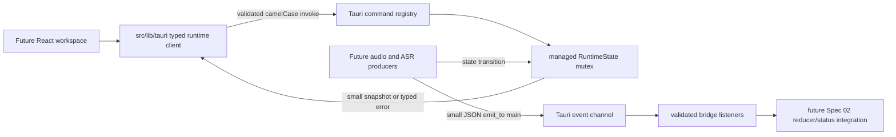

# Spec 03 — Typed IPC and Runtime Spine

## 1. Status, Ownership, Base, and Gates

- **Status:** Authored; ready for the mandatory high-capability IPC/event contract review. Not implemented.
- **Implementation owner:** One Spec 03 branch/worktree with one writer.
- **Required base:** The clean final SHA produced by Spec 01.
- **Allowed implementation predecessors:** Spec 01 only.
- **Parallel-safe peers:** Specs 02 and 05 may run concurrently only in separate worktrees from the same Spec 01 SHA and only within their declared ownership.
- **Successor gate:** Specs 04, 07, and 08 must not start until this spec is implemented, merged, and its command names, event names, payload shapes, runtime error codes, and native state boundary pass the high-capability review required by `spec-plan.md`.
- **Integration gate:** Spec 02 deliberately does not consume this bridge while the branches are parallel. The integration owner connects the merged bridge to the Spec 02 workspace only in a later dependent spec.
- **Review level:** High. This spec freezes the shared frontend/native boundary used by microphone, platform capture, model, and streaming-transcript work.

## 2. Goal and Visible Result

Create Mistaken’s minimal, truthful native runtime spine:

- React-side code can invoke exact typed Tauri commands for the current runtime snapshot, microphone inventory, capture start, and capture stop.
- React-side code can subscribe to exact typed native status, transcript, and error events.
- Rust owns one managed runtime state and returns structured serializable errors instead of panicking or fabricating success.
- Every event subscription has deterministic teardown, including an unmount that occurs while asynchronous Tauri listener registration is still resolving.
- A real Tauri smoke probe demonstrates native command round-trip and Rust-to-main-webview event delivery.

The committed product UI does not change in this spec. Spec 02 owns the workspace concurrently, and actual audio/model work belongs to later specs. The visible proof is the real running Mistaken window plus an owned, temporary developer probe that invokes the native runtime and observes a typed native error event; the probe is removed before commit.

## 3. Verified Current Behavior

Verified while authoring this spec:

- `/Users/berat/mistaken` does not yet exist. `/Users/berat/mistaken-context` contains documentation only and is not a Git repository.
- No Tauri application, TypeScript source, Rust source, tests, manifests, or generated capability schema currently exists to inspect or execute.
- Spec 01 defines the future baseline repository, Tauri 2 shell, `main` window, shared `TranscriptSource`, `TranscriptSegment`, and `CaptureStatus` types, test harness, CSP, and clipboard-write-only capability.
- Spec 01 removes the generated `greet` command. No custom application command or native event is allowed before this spec.
- Spec 02 owns `src/App.tsx`, `src/features/transcript/**`, and the committed transcript workspace. It intentionally does not name Tauri commands/events or edit native files.
- Tauri 2 commands are registered with `tauri::generate_handler!`, invoked from `@tauri-apps/api/core`, receive camel-cased JSON arguments, and may reject the frontend promise with a serializable Rust `Result` error.
- Tauri’s event API is intended for small JSON messages, not low-latency/high-throughput streaming such as PCM audio frames. `listen` is asynchronous and returns an `UnlistenFn`; an unremoved listener remains registered for the application lifetime.
- Tauri capabilities are scoped to named windows/webviews. Registered application commands can be placed behind application permissions, and the frontend needs listen permission but does not need emit permission for this design.
- Managed Tauri state does not require an additional `Arc`. A standard mutex is preferred when no lock crosses an `await`; poison and emission errors must be mapped instead of unwrapped.
- Tauri’s frontend mocks can cover bridge behavior and, in recent Tauri 2 releases, events, but mocks alone do not prove native command registration, serialization, capability enforcement, or webview-targeted delivery.

These findings establish contracts only. Exact dependency versions and generated permission-schema syntax must be read from the implemented Spec 01 baseline before editing.

## 4. Scope

### In scope

- The TypeScript command/event contract and runtime-validation boundary under `src/lib/tauri/**`.
- One React hook under `src/lib/tauri/**` that obtains an initial native snapshot, receives typed native events, reports bridge failures, and cleans every subscription.
- Rust serializable DTOs, structured errors, managed state, command handlers, event names, and main-webview-targeted emission helpers.
- Exact application-command registration and a least-privilege application permission set for those commands.
- Adding only the core event-listen permission required by the frontend; frontend event emission remains denied.
- Truthful pre-backend behavior: snapshot reports no model/audio backend; device listing and capture attempts fail with typed recoverable errors and do not create resources.
- Contract tests for camelCase serialization, command rejection, event validation, revision ordering, and listener cleanup.
- Real Tauri smoke verification of command round-trip, native error-event delivery, unlisten behavior, close, and relaunch.
- Native-only common audio value types and lifecycle traits under `src-tauri/src/audio/mod.rs`; these are complete successor contracts and allocate/start no backend in this spec.

### Out of scope

- Any committed edit to `src/App.tsx`, Spec 02 transcript feature files, or visible workspace composition.
- Microphone enumeration/capture implementation, device switching, permission prompts, or live audio buffers. Spec 04 owns cross-platform microphone capture.
- WASAPI Loopback or ScreenCaptureKit implementations. Specs 07 and 08 own platform system-audio backends.
- ASR runtime integration, model loading/download, recognizer workers, inference, or transcript production. Spec 06 owns the first recognizer integration; Spec 05 owns benchmarking/licensing, Spec 09 owns dual-source orchestration, and Spec 10 owns resilience hardening.
- A transcript reducer, ordering policy, formatting, Copy All, or Clear. Spec 02 owns the frontend transcript domain.
- PCM, encoded audio, model tensors, or arbitrary binary data over Tauri events.
- Persistence, database, filesystem access, network calls, backend, account, authentication, telemetry, crash reporting, updater, or cloud API.
- New npm or Cargo dependencies. Spec 01 must provide the Tauri API and Serde foundation needed by this contract.
- Placeholder success, fake microphone devices, fake model identifiers, fake transcript events, or production-only test commands.

## 5. Owned Files and Forbidden Concurrent Files

### Owned during Spec 03 implementation

The implementation may create or replace only these feature paths, plus the listed serialized shared-native integration points:

- `src/lib/tauri/contracts.ts`
- `src/lib/tauri/runtime.ts`
- `src/lib/tauri/use-runtime-bridge.ts`
- `src/lib/tauri/index.ts`
- Tests colocated under `src/lib/tauri/**`
- `src-tauri/src/audio/mod.rs`
- `src-tauri/src/commands/mod.rs`
- `src-tauri/src/commands/runtime.rs`
- `src-tauri/src/state/mod.rs`
- `src-tauri/src/state/runtime.rs`
- `src-tauri/src/events.rs`
- Tests colocated in those Rust modules or an existing native test location
- `src-tauri/src/lib.rs`
- `src-tauri/build.rs`
- `src-tauri/permissions/runtime.toml`
- `src-tauri/capabilities/main.json`
- This spec’s implementation-evidence fields

The implementer may choose equivalent Rust filenames only when the Spec 01 repository already has a clearly established module convention. The ownership categories and public contracts remain unchanged.

### Explicitly forbidden during this parallel wave

- `src/App.tsx`, `src/App.test.tsx`, `src/features/transcript/**`, and Spec 02-owned evidence
- `src/types/transcript.ts` and `src/types/runtime.ts`; import them, never duplicate or mutate them
- Root CSS, Tailwind tokens, icons, or visual components
- `package.json`, `package-lock.json`, `Cargo.toml`, `Cargo.lock`, Node/Rust toolchain pins, Vite/Vitest/TypeScript/ESLint configuration
- Audio backend/queue/normalization implementations below the single common `src-tauri/src/audio/mod.rs` contract, plus ASR, benchmark, installer, release, or platform-backend directories
- Canonical context files and `progress-tracker.md` from a feature worktree; only the integration owner updates shared documentation after merge

`src-tauri/src/lib.rs`, `src-tauri/build.rs`, `src-tauri/capabilities/main.json`, and the application permission file are serialized single-writer points assigned to Spec 03 for this wave. Specs 02 and 05 must not edit them. If the actual Spec 01 baseline lacks a required dependency or cannot express the reviewed permission contract without a root-manifest change, stop and return that discrepancy to the integration owner; do not mutate a forbidden manifest opportunistically.

## 6. Contracts Consumed and Produced

### Contracts consumed from Spec 01

```ts
export type TranscriptSource = "microphone" | "system";

export interface TranscriptSegment {
  id: string;
  source: TranscriptSource;
  text: string;
  startedAtMs: number;
  endedAtMs?: number;
  isFinal: boolean;
}

export type CaptureStatus =
  | "idle"
  | "starting"
  | "listening"
  | "stopping"
  | "error";
```

The implementation imports these exact types from `src/types/**`. Rust mirrors their serialized representation; it does not create a second frontend declaration.

The Spec 01 baseline must also contain exact compatible versions of `@tauri-apps/api`, Tauri 2, Serde with derive support, and the existing frontend/native test foundations. This spec adds no package.

### Command names

The only custom application commands registered by this spec are:

```ts
export const RUNTIME_COMMANDS = {
  getSnapshot: "get_runtime_snapshot",
  listMicrophones: "list_microphones",
  startCapture: "start_capture",
  stopCapture: "stop_capture",
} as const;
```

No alias, generic `invokeNative`, stringly typed caller, generated `greet`, test-only command, or second command registry is permitted.

### Command request/response types

```ts
export interface StartCaptureRequest {
  microphoneDeviceId: string | null;
  systemAudioEnabled: boolean;
}

export interface MicrophoneDevice {
  id: string;
  label: string;
  isDefault: boolean;
}

export type RuntimeErrorCode =
  | "runtime_unavailable"
  | "unsupported_platform"
  | "invalid_request"
  | "model_missing"
  | "model_load_failed"
  | "model_unsupported"
  | "microphone_permission_denied"
  | "system_audio_permission_denied"
  | "microphone_unavailable"
  | "system_audio_unavailable"
  | "device_disconnected"
  | "capture_already_active"
  | "capture_not_active"
  | "capture_start_failed"
  | "capture_stop_failed"
  | "audio_queue_overflow"
  | "inference_lagging"
  | "internal";

export interface RuntimeError {
  code: RuntimeErrorCode;
  message: string;
  recoverable: boolean;
  source?: TranscriptSource;
}

export type ModelStatus =
  | { status: "missing" }
  | { status: "loading"; modelId?: string }
  | { status: "ready"; modelId: string }
  | { status: "failed"; error: RuntimeError }
  | { status: "unsupported"; error: RuntimeError };

export type AudioSourceStatus =
  | { status: "unavailable"; error: RuntimeError }
  | { status: "idle" }
  | { status: "starting"; deviceId?: string }
  | {
      status: "capturing";
      deviceId?: string;
      activity: "waiting" | "receiving";
    }
  | { status: "stopping"; deviceId?: string }
  | { status: "error"; error: RuntimeError };

export interface RuntimeSnapshot {
  revision: number;
  captureStatus: CaptureStatus;
  modelStatus: ModelStatus;
  microphone: AudioSourceStatus;
  systemAudio: AudioSourceStatus;
}
```

### Common native audio contract

`src-tauri/src/audio/mod.rs` freezes the native-only boundary consumed independently by Specs 04, 07, 08, and 09:

```rust
#[derive(Debug, Clone, Copy, PartialEq, Eq)]
pub enum AudioSource {
    Microphone,
    System,
}

#[derive(Debug, Clone, Copy, PartialEq, Eq)]
pub struct PcmFormat {
    pub sample_rate_hz: NonZeroU32,
    pub channels: NonZeroU16,
}

pub struct PcmBlock {
    pub source: AudioSource,
    pub sequence: u64,
    pub format: PcmFormat,
    pub valid_samples: usize,
    pub samples: Box<[f32]>,
}

pub trait PcmBlockSink: Send + 'static {
    fn try_acquire(&mut self) -> Option<Box<[f32]>>;
    fn try_submit(&mut self, block: PcmBlock) -> Result<(), PcmBlock>;
}

#[derive(Debug, Clone, Copy, PartialEq, Eq)]
pub enum AudioErrorKind {
    PermissionDenied,
    Unavailable,
    DeviceDisconnected,
    UnsupportedFormat,
    StartFailed,
    StopFailed,
    QueueOverflow,
    Internal,
}

#[derive(Debug, Clone, Copy, PartialEq, Eq)]
pub struct AudioError {
    pub source: AudioSource,
    pub kind: AudioErrorKind,
}

pub trait AudioCaptureSession: Send {
    fn source(&self) -> AudioSource;
    fn stop(&mut self) -> Result<(), AudioError>;
}
```

Invariants:

- `samples` is a preallocated, reusable buffer acquired from the sink; capture callbacks never allocate a block.
- `valid_samples <= samples.len()`; only that prefix is initialized/current PCM.
- Samples are finite interleaved `f32` in `[-1.0, 1.0]`; `format.channels` describes the interleaving and `valid_samples` is divisible by channel count.
- Sequence starts at `0` per capture session/source and increments without wrap for each submitted block.
- `try_acquire` and `try_submit` are non-blocking. No free buffer or a full sink is explicit overflow; producers never wait or grow memory.
- Neither type is serializable to the frontend. PCM never crosses Tauri IPC/events.
- Implementations may add private handles/configuration but may not redefine these public shapes in parallel branches.
- Audio adapters return `AudioError`; only the runtime command/state boundary maps it to the frozen serializable `RuntimeError`. Common audio code does not depend on Tauri DTOs or user-facing message text.

This contract is production code even though Spec 03 instantiates no backend: it is the reviewed compile-time boundary that makes the three Wave 3 audio worktrees disjoint. Unit tests prove field invariants with synthetic buffers; there is no fake capture implementation.

Command signatures:

```ts
getRuntimeSnapshot(): Promise<RuntimeSnapshot>
listMicrophones(): Promise<readonly MicrophoneDevice[]>
startCapture(request: StartCaptureRequest): Promise<CaptureStatus>
stopCapture(): Promise<CaptureStatus>
```

All wrappers validate successful values and rejected values at runtime before exposing them. TypeScript compile-time assertions are not runtime validation. Validation is hand-written, narrow, allocation-conscious code under `src/lib/tauri/**`; no schema package is added solely for these small closed payloads.

### Event names and payloads

```ts
export const NATIVE_EVENTS = {
  captureStatus: "capture:status",
  audioStatus: "audio:status",
  modelStatus: "asr:model-status",
  transcriptPartial: "transcript:partial",
  transcriptFinal: "transcript:final",
  captureError: "capture:error",
} as const;

export interface CaptureStatusEvent {
  snapshot: RuntimeSnapshot;
}

export interface AudioStatusEvent {
  source: TranscriptSource;
  snapshot: RuntimeSnapshot;
}

export interface ModelStatusEvent {
  snapshot: RuntimeSnapshot;
}
```

Payload map:

- `capture:status` → `CaptureStatusEvent`
- `audio:status` → `AudioStatusEvent`
- `asr:model-status` → `ModelStatusEvent`
- `transcript:partial` → `TranscriptSegment` with `isFinal === false`
- `transcript:final` → `TranscriptSegment` with `isFinal === true`
- `capture:error` → `RuntimeError`

All native events use these exact names and camelCase JSON fields. Rust emits only to the window label `main` with `emit_to`; it never broadcasts globally. The frontend is never granted an emit permission.

### Revision invariant

- `RuntimeState` owns one monotonically increasing `u64` revision for runtime status state, initialized to `0` on process launch.
- Every accepted mutation of `captureStatus`, `modelStatus`, `microphone`, or `systemAudio` increments revision exactly once while holding the mutex.
- A snapshot response and every status event carry a complete `RuntimeSnapshot`, not a partial state delta. `audio:status` additionally identifies the source whose status triggered emission.
- Frontend status handling ignores a snapshot/status event only when its embedded snapshot revision is strictly older than the latest applied runtime revision. Equal revisions are idempotent. Because each status event contains the complete state, cross-channel delivery order cannot cause an older capture/audio/model delta to be lost behind a newer event.
- `capture:error` and transcript events are not discarded by status revision comparisons. Transcript idempotency/order is governed by Spec 02’s segment identity contract and later Spec 09 integration.
- A transition clones only the small complete snapshot/event payload while locked, releases the mutex, then emits. No Tauri emission, await, audio operation, or ASR operation occurs while the state lock is held.
- The TypeScript validator accepts only non-negative safe integers for revision. A native revision overflow is mapped to `internal`; it is never silently wrapped.

### Runtime bridge state and callbacks

`useRuntimeBridge` exposes one stable shape suitable for later integration:

```ts
export interface RuntimeBridgeState {
  snapshot: RuntimeSnapshot | null;
  bridgeReady: boolean;
  bridgeError: RuntimeBridgeError | null;
}

export interface RuntimeBridgeHandlers {
  onCaptureStatus?(event: CaptureStatusEvent): void;
  onAudioStatus?(event: AudioStatusEvent): void;
  onModelStatus?(event: ModelStatusEvent): void;
  onTranscriptSegment?(segment: TranscriptSegment): void;
  onCaptureError?(error: RuntimeError): void;
}

export interface RuntimeBridgeError {
  code:
    | "listener_registration_failed"
    | "command_failed"
    | "invalid_command_response"
    | "invalid_command_error"
    | "invalid_event_payload";
  operation: string;
  message: string;
}
```

The hook does not own the Spec 02 reducer and does not persist transcript. It returns typed command actions or a stable `runtime` client alongside the state; it does not hide command failure in console-only logging.

## 7. User and Developer Flows

### Committed user flow

- The existing Mistaken window launches normally.
- No new control pretends that microphone capture, model loading, or transcription is available.
- No permission prompt, device prompt, network request, model download, transcript mutation, or clipboard action occurs at startup.
- Closing the window tears down the webview and native process state. Relaunch starts with revision `0` and the same truthful unavailable snapshot.

### Typed snapshot flow

1. A consumer mounts `useRuntimeBridge` or calls the typed runtime client.
2. The hook begins one asynchronous registration for each of the six exact event names.
3. Only after all registrations succeed does it invoke `get_runtime_snapshot`.
4. Rust locks managed state briefly, clones the small snapshot, unlocks, and returns it.
5. The frontend validates every field and applies it unless a newer status event was already applied.
6. `bridgeReady` becomes true only after listeners are active and a valid snapshot is available.

### Truthful command flow before audio/model backends exist

- `get_runtime_snapshot` resolves with revision `0`, `captureStatus: "idle"`, `modelStatus: { status: "missing" }`, and both source statuses as `unavailable` with `runtime_unavailable` errors.
- `list_microphones` rejects with a structured recoverable `runtime_unavailable` error and returns no fake device.
- A valid `start_capture` request rejects with structured recoverable `runtime_unavailable`; state remains idle, no revision changes, and Rust emits the same error payload through `capture:error` to `main`.
- An invalid `start_capture` request rejects with `invalid_request` without emitting an operational error or mutating state. A non-null microphone ID must contain at least one non-whitespace character.
- `stop_capture` while idle rejects with structured recoverable `capture_not_active`; state remains unchanged and Rust emits the same error through `capture:error`.
- Start → Stop → Start before backend implementation produces the deterministic errors above, allocates no native capture resource, leaves revision `0`, and remains safe to repeat.

### Real developer smoke flow

1. Run the actual Tauri application from the Spec 03 worktree.
2. From the main webview’s developer tools, dynamically import an owned temporary probe under `src/lib/tauri/**`.
3. The probe subscribes to typed `capture:error`, invokes the typed snapshot command, and records the validated unavailable snapshot.
4. The probe invokes a valid `start_capture`; the promise rejects with `runtime_unavailable`, and the listener observes the matching typed event from Rust.
5. The probe calls the returned unlisten function, invokes again, and confirms the removed callback is not called.
6. Close and relaunch the real application; repeat snapshot inspection and confirm revision `0` with no retained listener or state.
7. Remove the temporary probe and any captured payload from source before commit. Preserve only non-sensitive evidence in this spec.

No browser-only Vite session or mocked invoke result may be reported as native smoke evidence.

## 8. UI States, Tokens, and Accessibility

This spec commits no new visible component, styling, icon, animation, dialog, toast, or route. The current workspace/bootstrap visual ownership remains unchanged.

The bridge must nevertheless expose UI-usable distinctions without requiring string parsing:

- `bridgeReady: false`, no bridge error: subscription/snapshot setup is still pending.
- `bridgeReady: true`, unavailable runtime snapshot: bridge works, feature backend is not configured.
- `bridgeError.code`: the webview/native boundary itself failed or returned malformed data.
- `RuntimeError.code`: the native runtime handled a domain/operational failure.
- `recoverable` and `source`: later UI can choose source-specific guidance without inspecting message wording.

Later UI consumers must render status/error text in the live-region pattern and approved semantic tokens owned by Spec 02. This spec must not create a parallel notification system, focus-stealing alert, color-only status, or raw native payload view. Error `message` text is human-readable but is not a stable programmatic discriminator; code switches on `code`.

## 9. Frontend → IPC → Rust / Audio / ASR Data Flow



### Command boundary

- TypeScript calls only the four named wrappers. It never calls `invoke` from components.
- `start_capture` passes `{ request }`, whose nested fields serialize as `microphoneDeviceId` and `systemAudioEnabled`; Rust uses the corresponding Serde camelCase contract.
- Rust command handlers are thin: validate request, delegate to managed state/runtime services, and serialize a DTO or `RuntimeError`.
- `Result<T, RuntimeError>` is the only expected command failure channel. Panics, string-only errors, `{ ok: boolean }` envelopes, null sentinels, and error-code parsing from prose are forbidden.

### Event boundary

- Only small status DTOs, one transcript segment, or one structured runtime error crosses an event.
- PCM frames, audio chunks, model tensors, growing transcript arrays, logs, and arbitrary maps never cross the event API.
- Every event payload is treated as `unknown` in TypeScript, validated, and then forwarded. Malformed payloads produce one sanitized `RuntimeBridgeError` and never reach feature callbacks.
- Transcript validators preserve `text`, `source`, identity, and timestamps exactly. They do not trim, normalize, spell-correct, grammar-correct, prefix, or merge text.
- Partial and final event names must agree with `isFinal`; disagreement is `invalid_event_payload`, not an implicit conversion.

### Native state boundary

- `tauri::Builder::manage` owns one `Mutex<RuntimeState>`; handlers consume `State` rather than a global static or a second `Arc`.
- Runtime state contains only the revision and small statuses in this spec. It holds no webview handles, listeners, devices, streams, buffers, workers, model sessions, transcript history, or application secrets.
- Mutex poisoning and event-emission failures map to structured/internal errors. Production code contains no `unwrap`, `expect`, or panic on a user/runtime path.
- Event constants live once in Rust and once in the typed TypeScript boundary. Tests prove exact equality to the frozen strings; downstream code imports constants rather than repeating literals.

## 10. Platform, Permissions, Offline, Privacy, and Fallback

### Platform behavior

- The contract is platform-neutral and must compile on the Spec 01 supported Rust targets.
- On the current macOS authoring/implementation host, real native smoke verifies Tauri command and event transport only; it does not claim ScreenCaptureKit, microphone, model, or transcription support.
- Windows compilation/runtime proof is not fabricated on macOS. Later Windows verification exercises the same frozen runtime/audio contract through Specs 04, 06, and 08.
- `unsupported_platform` is reserved for a compiled platform/runtime path that cannot support a requested feature. Missing future backends in this spec use `runtime_unavailable` instead.

### Least-privilege command and event policy

- `src-tauri/build.rs` declares exactly the four application commands in Tauri’s application manifest so they can be permission-controlled.
- `src-tauri/permissions/runtime.toml` defines one application permission set for exactly those four commands.
- The `main` capability references that reviewed application permission set and adds only the core permission needed to listen to events.
- Frontend emit, global emit, command wildcard/default-all grants, remote URL capability, filesystem, shell, process, dialog, opener, HTTP, notification, clipboard read, and unrelated plugin permissions remain absent.
- Spec 01’s `clipboard-manager:allow-write-text` permission remains unchanged.
- The implemented permission identifiers and capability file must validate against the exact generated Tauri 2 schema in the repository; do not guess around a schema error or broaden permission scope to make it pass.
- The production CSP remains non-null and remote-free.

### Offline and privacy rules

- All command/event behavior works with networking disabled.
- No account, API key, backend, analytics, crash reporter, remote log sink, or telemetry is introduced.
- Runtime errors may identify a source or local operation but must not include transcript text, PCM, environment variables, filesystem paths, secrets, or a dump of arbitrary native errors.
- Bridge code must not log command/event payloads. Tests may hold synthetic transcript fixtures in process memory only.
- No runtime snapshot, device result, event, transcript, or error is persisted to browser storage, a file, or a database.

### Fallback behavior

- Missing runtime capabilities are explicit typed failures; there is no browser-media fallback, cloud-ASR fallback, silent no-op, or fabricated ready state.
- An invalid native payload is rejected at the boundary and reported as a bridge error. It is never trusted because it came from the local process.
- A failed listener registration prevents `bridgeReady`; partial registrations are torn down before error publication.

## 11. Resource Lifecycle, Bounded State, Errors, and Recovery

### Frontend subscription lifecycle

- One mounted hook instance registers at most six listeners, exactly one per frozen event name. There is no polling, retry timer, duplicate StrictMode registration, or listener per transcript segment.
- Registration occurs as one lifecycle operation. If any registration fails, all successfully acquired unlisten functions run exactly once.
- React cleanup marks the lifecycle cancelled immediately. If an asynchronous `listen` resolves after cancellation, its returned unlisten function executes immediately rather than being lost.
- Cleanup uses `Promise.allSettled` or equivalent so one unlisten failure cannot skip the others. Cleanup failure is reportable during development without logging event payloads and cannot update unmounted React state.
- Handler identity changes do not cause unbounded re-registration. Store the latest callbacks in refs or require stable callbacks and prove the chosen invariant with tests.
- Snapshot invocation begins only after all listeners are active. Completion after unmount is ignored.
- Repeated mount → unmount → mount, including React StrictMode development behavior, ends with exactly one active listener per event for the live instance and zero for the disposed instance.

### Native lifecycle

- This spec starts no worker, thread, stream, queue, channel, timer, capture session, model session, or background task.
- Command calls acquire the state mutex only for bounded synchronous state access.
- Emission occurs after lock release and targets `main`.
- App exit relies on ordinary destruction of small managed state; no hidden singleton survives process relaunch.
- Start → Stop → Start failures before backend availability are idempotent with respect to resources and state.

### Error and recovery rules

- Known domain failures use a specific `RuntimeErrorCode`; `internal` is last resort, not a catch-all for normal unavailable/permission/device states.
- `recoverable: true` means a retry after user action or later backend availability can succeed. It does not trigger automatic retry in this spec.
- A command rejection validates into `RuntimeError`. An unrecognizable rejection becomes `RuntimeBridgeError(code: "invalid_command_error")`; raw unknown values do not escape.
- A malformed success becomes `invalid_command_response`.
- A malformed event becomes `invalid_event_payload`, does not invoke the domain callback, and does not tear down other valid listeners.
- A bridge may recover only by an explicit consumer remount/retry in this spec. No automatic loop or backoff is introduced.

## 12. Numbered Measurable Acceptance Criteria

1. **Predecessor and isolation — all hosts:** Spec 03 starts from the recorded clean Spec 01 SHA in its own branch/worktree; baseline checks pass before editing; Specs 02/05 use separate physical worktrees; only declared paths change.
2. **Shared-contract and dependency reuse — platform-neutral:** All frontend payloads import Spec 01’s `TranscriptSource`, `TranscriptSegment`, and `CaptureStatus`; no duplicate declaration exists; Spec 03 adds no npm/Cargo dependency or root-manifest change.
3. **Exact command surface — platform-neutral:** Only `get_runtime_snapshot`, `list_microphones`, `start_capture`, and `stop_capture` are registered and callable through exact typed wrappers; `greet`, aliases, generic component-level invoke, and test-only production commands are absent.
4. **Truthful initial snapshot — real native macOS:** `get_runtime_snapshot` returns a runtime-validated camelCase snapshot with revision `0`, idle capture, missing model, and typed unavailable microphone/system-audio statuses; it performs no prompt, network, disk, audio, model, or transcript work.
5. **Structured pre-backend failures — real native macOS:** Device listing and valid Start reject with `runtime_unavailable`; Stop while idle rejects with `capture_not_active`; invalid Start input rejects with `invalid_request`; every rejection is a structured `RuntimeError`, not prose-only or panic output.
6. **Repeatability and resource safety — real native macOS:** Start → Stop → Start yields the defined deterministic failures, leaves snapshot revision/status unchanged, creates no worker/stream/buffer/listener leak, and remains usable for another snapshot command.
7. **Exact native event surface — platform-neutral:** The only bridge event names are `capture:status`, `audio:status`, `asr:model-status`, `transcript:partial`, `transcript:final`, and `capture:error`; native emission targets only `main`; no PCM/growing-array/global-broadcast path exists.
8. **Runtime payload validation — frontend tests:** Valid command/event payloads pass unchanged; malformed revisions, enum values, discriminants, nested errors, device records, timestamps, missing fields, and unknown rejection shapes produce the specified bridge errors and never invoke domain callbacks.
9. **Transcript event integrity — frontend tests:** Partial accepts only `isFinal: false`, final accepts only `isFinal: true`, and valid text/source/identity/timestamps are forwarded exactly without trimming, rewriting, prefixing, merging, or mutation.
10. **Revision race safety — frontend tests:** Listeners become active before snapshot invocation; a newer status event cannot be overwritten by an older snapshot/event; equal revision is idempotent; capture errors and transcript events are not lost because of status revision comparison.
11. **Subscription cleanup — frontend tests:** Normal unmount, partial registration failure, unmount-before-listen-resolution, callback changes, and StrictMode mount cycles each leave the exact expected listener count; every acquired unlisten runs once and no state callback runs after unmount.
12. **Native state, common audio contract, and serialization — Rust tests:** One managed mutex owns runtime revision/statuses; the exact native `AudioSource`/PCM/error/sink/session boundary compiles with synthetic invariants and no backend; state mutation increments safely; locks are released before emission; camelCase DTO/error/event serialization round-trips; poison/overflow/emission failures return errors; production paths contain no panic/unwrap/expect.
13. **Real command and event proof — native macOS:** In the actual Tauri `main` webview, the owned temporary probe validates the snapshot, observes Rust-emitted `capture:error` matching a failed Start, unlistens, and proves a second emitted error no longer calls that listener; the probe is removed before commit.
14. **Least privilege, offline, and privacy — all hosts/config plus native macOS:** The generated Tauri schema accepts a main-window capability that permits exactly the four application commands, core event listening, and preserved clipboard write; frontend emit, wildcard commands, remote URLs, unrelated permissions, network traffic, persistence, payload logging, and secret/transcript-bearing errors are absent.
15. **Build, launch, shutdown, and relaunch — current supported host:** Typecheck, lint, frontend tests, Rust format/check/clippy/tests, frontend production build, and Tauri build pass; real native launch/close/relaunch returns fresh revision `0` state and no retained listener/resource.
16. **Review freeze and evidence — integration:** A high-capability reviewer checks correctness, security, serialization, race handling, lifecycle, downstream Spec 04/07/08 compatibility, and path ownership; every High/Medium finding is fixed; exact root, branch, base SHA, implementation commit SHA, commands, output, and smoke observations are recorded without sensitive payloads.

## 13. Acceptance Criterion → Verification/Test Mapping

| AC | Verification or permanent test | Evidence to record |
|---|---|---|
| 1 | Inspect branch/worktree/base metadata, baseline results, changed-path list, and concurrent-worktree ownership | Root, branch, base SHA, baseline command results, owned-path report |
| 2 | TypeScript import inspection, duplicate-symbol search, direct dependency diff, Cargo metadata diff | Imported shared symbols, zero duplicates, zero new dependencies/manifests |
| 3 | Rust registration + TypeScript wrapper inspection; invoke each real command; search for forbidden names/direct invoke usage | Exact four-name registry and call results |
| 4 | Real `getRuntimeSnapshot` call in the Tauri main webview plus Rust/TypeScript snapshot contract tests | Sanitized snapshot and no-side-effect observations |
| 5 | Real list/start/stop/invalid-start calls plus Rust command tests and frontend rejected-value validation tests | Error codes, recoverability, unchanged state, zero panic |
| 6 | Real Start → Stop → Start smoke; snapshots before/after; process/resource observation appropriate to host | Stable revision/status and no created native resources |
| 7 | Exact event constant tests, Rust emitter tests, source review for `emit_to("main", ...)`, forbidden-payload search | Six names, target label, zero global/PCM event path |
| 8 | Vitest boundary table covering valid and structurally invalid command/event/rejection payloads | Accepted values and exact bridge-error outcomes |
| 9 | Vitest partial/final mismatch and preservation cases with mistake-bearing text | Unchanged segment fixture and mismatch rejections |
| 10 | Deterministic deferred-promise tests that interleave listener registration, snapshots, and revisions | Applied revision sequence and non-dropped error/transcript callbacks |
| 11 | React hook harness with mocked listener promises/unlisten spies under normal, failed, cancelled, changed-handler, and StrictMode lifecycles | Active-listener and exactly-once unlisten counts |
| 12 | `cargo test` for runtime state, native audio value/trait invariants, errors, and Serde plus focused inspection/lint for Tauri coupling, lock/emission boundary, allocation-free sink semantics, and forbidden panic APIs | Rust test names/results, successor compile probes, and inspection outcome |
| 13 | Actual `npm run tauri dev` developer-tools probe from `main`, then source check proving probe removal | Command result, observed typed error, callback count before/after unlisten, removal proof |
| 14 | Validate Tauri config/generated schemas; inspect effective permissions/CSP; run native smoke with networking disabled; inspect logging/persistence calls | Exact effective permissions and offline/privacy observations |
| 15 | `npx tsc --noEmit`; `npx eslint .`; targeted frontend tests; `cargo fmt --check`; `cargo check`; `cargo clippy --all-targets --all-features -- -D warnings`; `cargo test`; `npm run build`; `npm run tauri build`; native launch/close/relaunch | Exact commands, exit codes, native state after relaunch |
| 16 | High-capability review of finished diff and downstream contracts; fix/recheck High/Medium findings; inspect final Git state | Reviewer findings/dispositions, root, branch, SHAs, clean/expected status |

Permanent tests earn their place by protecting serialization, race, cleanup, or domain-boundary behavior. Tests that merely assert a constant exists, mock echoes an argument, source contains text, or an invoke does not throw are insufficient. The native smoke is required because frontend mocks cannot prove the registered Rust/capability/event path.

## 14. Ordered Implementation Plan

1. After Spec 01 merges, create the Spec 03 branch/worktree from its recorded final SHA; record root, branch, and base SHA. Confirm no second writer uses that checkout.
2. Re-read canonical context, Specs 01–04, 06–09, current Git state, actual source/tests/manifests, installed Tauri documentation, generated schemas, and dependency versions. Run baseline checks.
3. Confirm `@tauri-apps/api`, Serde derive support, and the test foundation already exist. If not, stop for integration-owner reconciliation rather than editing forbidden root manifests.
4. Add the complete native-only common audio source/PCM/error/sink/session contract with synthetic invariant/compile tests, then add Rust runtime DTOs, small managed state, checked revision logic, and focused serialization/state tests. Instantiate no audio backend or live buffer.
5. Add thin command handlers with exact pre-backend behavior, then register exactly four commands in the single Tauri library entrypoint.
6. Add exact Rust event constants and a small `emit_to("main", ...)` helper that emits after lock release and maps failures.
7. Declare the four application commands in the Tauri application manifest, define the exact application permission set, and update only the main capability with that set plus core event-listen permission. Validate against generated schemas before proceeding.
8. Add TypeScript contracts, closed runtime validators, structured command-error conversion, and exact typed command wrappers.
9. Add typed event subscriptions and `useRuntimeBridge` with listeners-before-snapshot ordering, revision reconciliation, latest-handler behavior, cancellation safety, partial-registration cleanup, and no post-unmount updates.
10. Add durable frontend/Rust tests only for observable payload, serialization, ordering, lifecycle, error, and state invariants described in the verification map.
11. Run focused frontend and Rust checks. Fix the source, not test expectations, when the frozen contract is violated.
12. Launch the actual Tauri app; create and dynamically load the owned temporary developer probe; execute snapshot, failed Start/error event, unlisten, repeated emission, Start → Stop → Start, close, and relaunch flows.
13. Remove the temporary probe and any captured/generated residue. Confirm there is no test-only command, payload log, new dependency, or ownership spill.
14. Run the complete AC 15 verification set and inspect effective capabilities/CSP with networking disabled for the smoke path.
15. Review the finished diff for correctness, security, privacy, serialization, mutex scope, listener races, bounded resources, no grammar rewriting, and downstream compatibility. Fix every High/Medium finding and rerun affected proof.
16. Record evidence in this spec, create the focused local commit unless the user directs otherwise, report exact root/branch/base/commit SHA, and hand the frozen contract to the integration owner. Do not push unless explicitly requested.

## 15. Risks, Rollback, Cleanup, and Preservation Rules

### Risks and mitigations

- **Listener leak during asynchronous setup:** cleanup may run before `listen` resolves. Use cancellation-aware acquisition and immediately unlisten late resolutions; prove it with deferred promises and StrictMode.
- **Snapshot/event race:** a snapshot can resolve after a newer native event. Register first, carry monotonic runtime revisions, and reject strictly older state updates.
- **False type safety:** Tauri payloads arrive at a trust boundary despite TypeScript generics. Treat values as unknown and validate every nested discriminant/field.
- **Permission overreach:** application commands are easy to leave broadly allowed. Generate an explicit four-command application permission, scope it to `main`, grant listen but not emit, and inspect the effective capability.
- **Premature backend simulation:** fake devices or successful capture would hide later integration work. Return deterministic typed unavailable/not-active failures and leave state/resource counts unchanged.
- **Event channel misuse:** high-rate PCM over JSON would allocate and stall the webview. Freeze events to small status/error/segment payloads; native audio uses bounded channels in later specs.
- **Mutex deadlock/reentrancy:** emitting or awaiting while locked can stall commands. Clone small payloads, unlock, then emit; use a synchronous standard mutex in this spec.
- **Error data disclosure:** forwarding arbitrary native error chains can expose paths or payloads. Map to reviewed codes and sanitized messages; never log transcript/event bodies.
- **Parallel merge conflict:** Spec 03 must touch shared Tauri entry/capability points while Spec 02/05 run. Those peers are forbidden from those paths; root manifests/types remain unchanged.
- **Contract churn downstream:** Specs 04/07/08 consume this spine. Mandatory high review freezes exact names and shapes before successors start; incompatible later changes require serialized integration and successor-spec updates.

### Rollback

- Before merge, abandon only the Spec 03 branch/worktree or revert its focused commit.
- After merge, revert the focused Spec 03 commit only if no successor has merged. Once a successor consumes the contract, perform a coordinated forward fix rather than partially removing commands/events.
- Rollback must restore the Spec 01 Tauri entrypoint/build/capability state and remove the application permission plus `src/lib/tauri/**`, command/state/event modules, and their tests.
- Never reset, clean, overwrite, or delete unrelated user work. Never mutate `/Users/berat/mistaken-context` during application rollback.

### Required cleanup

- Remove the temporary developer probe, captured payloads, debug logging, generated ad hoc files, and screenshots from application source.
- Remove unused imports, handlers, permission entries, event names, tests, and dead modules discovered during final review.
- Keep no placeholder audio/ASR code, fake success path, production test command, timer, retry loop, or dormant listener.
- Preserve durable contract/lifecycle tests because they guard plausible cross-language regressions.

### Preservation rules

- Preserve offline-only, no-account, no-database, in-memory transcript, dual-source, no-grammar-rewrite, and bounded-resource invariants.
- Preserve Spec 01 shared types, semantic tokens, CSP, clipboard-write-only permission, toolchains, and dependency versions.
- Preserve Spec 02 ownership and transcript semantics; this bridge forwards segments but does not reorder, rewrite, prefix, merge, or persist them.
- Preserve exact command/event contracts after the mandatory review. A later change requires all affected specs, implementations, permissions, tests, and evidence to move together.

## 16. Definition of Done and Evidence Record

Spec 03 is done only when the real native Tauri application can return the truthful validated runtime snapshot, reject unavailable operations with structured errors, deliver a Rust-emitted typed error to the `main` webview, remove that listener deterministically, relaunch with fresh state, and pass every acceptance criterion without introducing audio/model implementation or changing the product UI.

### Required implementation evidence

Fill during implementation; do not predeclare success:

- **Implementation status:** Not implemented
- **Canonical repository root:** Pending Spec 01
- **Worktree root:** Pending
- **Branch:** Pending
- **Base SHA:** Pending
- **Implementation commit SHA:** Pending
- **Installed Node/npm/Rust/Tauri versions:** Pending
- **Changed paths:** Pending
- **Command registry and effective permission set:** Pending
- **Frontend targeted test command/result:** Pending
- **Rust targeted test command/result:** Pending
- **Typecheck/lint command/results:** Pending
- **Cargo format/check/clippy/test results:** Pending
- **Frontend and Tauri production build results:** Pending
- **Real native command snapshot observation:** Pending
- **Real native error-event and unlisten observation:** Pending
- **Start → Stop → Start resource/state observation:** Pending
- **Offline/privacy/capability inspection:** Pending
- **Close/relaunch observation:** Pending
- **Temporary probe removal proof:** Pending
- **High-capability review findings and dispositions:** Pending
- **Final Git status:** Pending

### Authoring evidence and sources

- Reviewed `/Users/berat/mistaken-context/project-overview.md`, `architecture.md`, `ui-context.md`, `code-standards.md`, `ai-workflow-rules.md`, `progress-tracker.md`, `spec-plan.md`, and Specs 01–02.
- Verified the target application repository is absent and the context bundle remains documentation-only.
- Official Tauri references used to fix the contract:
  - [Calling Rust from the frontend](https://v2.tauri.app/develop/calling-rust/)
  - [Calling the frontend from Rust](https://v2.tauri.app/develop/calling-frontend/)
  - [JavaScript event API](https://v2.tauri.app/reference/javascript/api/namespaceevent/)
  - [State management](https://v2.tauri.app/develop/state-management/)
  - [Mocking Tauri APIs](https://v2.tauri.app/develop/tests/mocking/)
  - [Capabilities](https://v2.tauri.app/security/capabilities/)
  - [Permissions](https://v2.tauri.app/security/permissions/)

Authoring this file is not implementation evidence. All pending fields remain pending until Spec 03 is applied in the real repository and observed through the real native application.
