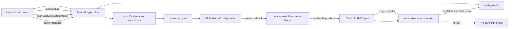

# Spec 04 — Microphone Device Selection and Bounded PCM Capture

## 1. Status, Ownership, Base, and Gates

- **Status:** Authored; ready for cross-spec integration review. Not implemented.
- **Implementation owner:** One Spec 04 branch/worktree with one writer.
- **Required base:** One clean integration SHA containing implemented, reviewed, and merged Specs 01, 02, and 03.
- **Allowed implementation predecessors:** Specs 02 and 03, including Spec 03’s mandatory high-capability IPC/event/common-native-contract review. Spec 01 is inherited transitively.
- **Parallel-safe peers:** Specs 07 and 08 may run concurrently only in separate worktrees from the same Wave 3 SHA. They own standalone platform system-audio adapter paths and must not edit the root Cargo manifest/lock, common audio contract, runtime commands/state, Tauri entrypoint, application UI composition, or microphone permission files owned here.
- **Shared dependency gate:** Spec 04 is the sole Wave 3 writer for `src-tauri/Cargo.toml` and `src-tauri/Cargo.lock`. Specs 07 and 08 must build their platform adapters as isolated crates with their own manifests until Spec 09 performs final shared wiring. The high-capability authoring review must confirm this ownership across Specs 04, 07, 08, and 09 before Wave 3 starts.
- **Successor gate:** Spec 06 may start only after this spec passes real microphone verification, high-capability review, merges, and exposes the reviewed bounded PCM consumer boundary.
- **Review level:** High. This is the first real audio implementation and therefore owns real-time callback behavior, bounded buffering, OS microphone permission behavior, resource release, and Start → Stop → Start proof.

## 2. Goal and User-Visible Result

Implement a real local microphone path without ASR:

- Mistaken enumerates actual input devices and selects the current default when available.
- The source bar presents a keyboard-accessible microphone selector, refresh action, and an explicitly labeled **Test microphone** action.
- Starting the test requests microphone access only when needed, opens the selected physical device, captures local PCM, converts it to bounded mono `f32` blocks, and reports **Waiting for microphone signal…** followed by **PCM signal received** after a real spoken signal is observed.
- Stopping releases the CPAL stream, worker, queue, and device handle. Start → Stop → Start works with the same or another selected microphone.
- The main **Start Listening** transcription action remains unavailable because no approved ASR/model is integrated yet. The UI explicitly says the microphone test does not transcribe or store audio.
- No audio sample crosses Tauri IPC, reaches React, is written to disk, or leaves the machine.

The measurable result must be observed in the actual Tauri desktop application on both a supported macOS machine and a supported Windows machine. Compilation or a mocked device alone is insufficient.

## 3. Verified Current Behavior

Verified while authoring this spec:

- `/Users/berat/mistaken` does not exist. `/Users/berat/mistaken-context` is a documentation-only staging directory containing Specs 01–03 and no package, Rust, application, test, model, or generated source.
- Spec 02 defines the transcript workspace, source bar, disabled Start Listening state, and an explicit presentation boundary. It owns no native audio behavior.
- Spec 03 defines the only four application commands: `get_runtime_snapshot`, `list_microphones`, `start_capture`, and `stop_capture`; it also freezes six event names, structured runtime errors, full-snapshot revision ordering, and cancellation-safe subscriptions.
- Spec 03’s pre-backend behavior deliberately rejects list/start operations. This spec replaces only the microphone portions of those handlers with real behavior while preserving every command/event name and payload shape.
- Spec 03 now freezes native-only `AudioSource`, `PcmFormat`, `PcmBlock`, `PcmBlockSink`, and `AudioCaptureSession` contracts so microphone, macOS system audio, and Windows system audio can be implemented in disjoint Wave 3 worktrees.
- CPAL exposes the default host, input-device enumeration, stable serializable `DeviceId`, supported/default input configuration, raw/typed input-stream construction, and explicit stream `play`. Device operations are fallible because a device can disconnect.
- CPAL input callbacks run on a dedicated high-priority/native audio thread. Blocking work, heap allocation, frontend events per frame, synchronous inference, formatting, and filesystem work do not belong in that callback.
- `rtrb` provides fixed-capacity single-producer/single-consumer queues whose post-construction reads/writes are lock-free, wait-free, allocation-free, and immediately report full/empty conditions.
- macOS 10.14+ requires microphone authorization. Apple requires `NSMicrophoneUsageDescription`, requires checking authorization before capture, terminates an application that accesses the microphone without the usage key, and recommends requesting access only when the user invokes the related feature.
- Tauri merges a project `src-tauri/Info.plist` into the generated macOS application bundle.
- Windows 10/11 controls traditional desktop-app microphone access through the OS-level **Let desktop apps access your microphone** setting rather than a Mistaken-specific browser-style permission prompt. Denial/unavailability must be mapped from observable native behavior without treating silent samples as proof of denial.

No implementation report is authoritative yet because the application repository has not been created. During application, the actual merged source, installed dependency documentation, generated schemas, Git state, and executable behavior become authoritative.

## 4. Scope

### In scope

- Real cross-platform microphone enumeration and capture through CPAL’s native default host.
- Stable process-local selection using CPAL’s serialized `DeviceId`; no name-based lookup.
- A feature-local React microphone controller and compact source-bar controls.
- Focused integration edits to `App` and `TranscriptWorkspace` needed to place the real selector/test state into the existing workspace.
- Replacing Spec 03’s microphone-specific `list_microphones`, `start_capture`, and `stop_capture` pre-backend behavior while retaining exact typed command/event contracts.
- Native microphone permission inspection/request on macOS and actionable permission/unavailability mapping on Windows.
- A required macOS `NSMicrophoneUsageDescription` explaining that processing is local.
- Input configuration validation, native-sample-to-finite-`f32` conversion, channel downmix to mono, fixed 20 ms PCM blocks, a preallocated two-second block pool, and a lock-free bounded SPSC path.
- One bounded native monitor consumer that validates PCM activity and recycles blocks; it performs no ASR.
- First-signal status, overflow reporting, stream-error reporting, selected-device disconnect handling, explicit stop, explicit application-shutdown cleanup, and repeatable restart.
- Exact dependency and license additions required by this unit.
- Durable frontend/state/queue/conversion/lifecycle tests and real native microphone/permission smoke evidence on macOS and Windows.

### Out of scope

- Speech recognition, model discovery/loading/download, VAD, language selection, inference, partial/final transcript events, confidence, grammar correction, rewriting, or any transcript mutation. Specs 05–06 own model approval and initial ASR.
- System-audio capture, ScreenCaptureKit, WASAPI loopback, mixing, or enabling `systemAudioEnabled: true`. Specs 07–09 own those paths.
- A continuous decibel meter, waveform, spectrum, audio visualization, audio playback, recording, monitoring, or exported audio file.
- Sending PCM, a sample array, queue contents, or per-block metrics to React/Tauri events.
- Persistent microphone selection, settings storage, localStorage, filesystem preference file, or database.
- Automatic device hot-plug enumeration. This spec provides explicit Refresh and handles an active-device loss safely; Spec 10 owns broader lifecycle recovery.
- Per-application microphone permission controls on Windows, which Windows desktop privacy settings do not provide.
- Opening OS settings through shell/opener permissions. The UI gives exact local navigation instructions without broadening the Tauri capability.
- ASIO, JACK, realtime-priority features, a virtual audio cable, browser `getUserMedia`, WebRTC, cloud audio, or a second audio library.
- New frontend dependency, global design token, route, backend, account, telemetry, crash reporter, or network service.
- Fake device entries, generated silence presented as success, prerecorded production fixtures, or a production test command.

## 5. Owned Files and Forbidden Concurrent Files

### Owned during Spec 04 implementation

Subject to actual conventions established by merged predecessors, Spec 04 owns:

- `src/features/audio/**`
- `src/App.tsx` and its focused integration tests
- Focused microphone-source integration edits and tests under `src/features/transcript/TranscriptWorkspace.tsx` (or its exact merged equivalent); transcript reducer/formatting/copy semantics remain untouched
- `src-tauri/src/audio/microphone/**`
- `src-tauri/src/audio/buffer.rs` or one equivalently focused bounded-block-pool module
- `src-tauri/src/commands/runtime.rs`
- `src-tauri/src/state/runtime.rs`
- Focused module-registration edits in `src-tauri/src/commands/mod.rs`, `src-tauri/src/state/mod.rs`, and `src-tauri/src/lib.rs`
- `src-tauri/Info.plist`
- `src-tauri/Cargo.toml`
- `src-tauri/Cargo.lock`
- Native tests colocated with owned modules or in the established native test path
- This spec’s implementation-evidence fields

The implementation must reuse the existing command registration, state manager, event emitter, and UI composition instead of installing parallel registries or roots.

### Consumed unchanged

- `src/types/**`
- `src/lib/tauri/**`, including command/event strings, validators, hook, DTOs, and revision behavior
- `src/features/transcript/transcript-domain.ts`, transcript reducer/session hook, clipboard serializer, and their domain tests
- `src/index.css`, global tokens, Tailwind configuration, frontend test configuration, and `src/main.tsx`
- `src-tauri/src/audio/mod.rs`, including the frozen common native types/traits
- `src-tauri/build.rs`, `src-tauri/permissions/runtime.toml`, `src-tauri/capabilities/main.json`, and `src-tauri/tauri.conf.json`
- Model, benchmark, ASR, system-audio, packaging, and release paths

### Forbidden concurrent files

Specs 07 and 08 must not edit any Spec 04-owned path, root manifest/lock, shared runtime command/state file, `src-tauri/src/audio/mod.rs`, `src-tauri/src/lib.rs`, frontend application/transcript/audio path, or `src-tauri/Info.plist`. Their implementation specs must use isolated platform-crate manifests and platform-owned files until Spec 09 wiring.

Spec 04 must not edit a Spec 07/08 standalone platform crate, macOS ScreenCaptureKit path, Windows WASAPI loopback path, common event/type contract, capability/permission registry, or another spec file from its feature worktree. Shared documentation/tracker updates are integration-owner work after merge.

If merged predecessors differ from the staged contract, reconcile the canonical specs before opening Wave 3 worktrees. Do not solve ownership drift by duplicating types, commands, events, state, or UI.

## 6. Contracts Consumed and Produced

### Typed runtime contracts consumed from Spec 03

Spec 04 preserves these command signatures:

```ts
getRuntimeSnapshot(): Promise<RuntimeSnapshot>
listMicrophones(): Promise<readonly MicrophoneDevice[]>
startCapture(request: StartCaptureRequest): Promise<CaptureStatus>
stopCapture(): Promise<CaptureStatus>
```

The microphone test always invokes:

```ts
{
  microphoneDeviceId: selectedDeviceId,
  systemAudioEnabled: false,
}
```

`systemAudioEnabled: true` remains an atomic structured `runtime_unavailable` rejection with `source: "system"`; no microphone resource starts before that rejection.

The existing DTO remains exact:

```ts
export interface MicrophoneDevice {
  id: string;
  label: string;
  isDefault: boolean;
}
```

Device rules:

- `id` is CPAL `DeviceId.to_string()`, not the label, array index, hash, or a persisted alias.
- Every returned ID is unique and non-empty.
- `label` is a safe, non-empty UI label derived from the native description; control characters are removed and blank names become `Microphone`.
- At most one record has `isDefault: true`; it is determined by matching the default input device’s ID, never its label.
- Only devices with an obtainable ID and at least one usable input configuration are returned.
- Sort default first, then case-insensitive label, then ID so refresh is deterministic.
- An empty result is valid and updates microphone runtime status to `unavailable` with `microphone_unavailable`; it does not create a fake default.

### Audio status behavior

This spec consumes Spec 03’s capturing status extension:

```ts
type CapturingAudioSourceStatus = {
  status: "capturing";
  deviceId?: string;
  activity: "waiting" | "receiving";
};
```

- `waiting` means the stream is playing but no complete finite mono block with a real signal has reached the monitor.
- `receiving` means the monitor consumed at least one complete 20 ms finite mono PCM block whose absolute peak is at least `0.01`.
- Silence or sub-threshold input remains `waiting`; it is not permission denial and is not an error.
- The transition to `receiving` occurs once per capture session and emits one `audio:status` full-snapshot event. No level event or repeated activity heartbeat is added.

### Native microphone boundary produced

Feature-local native shapes may follow the merged module convention but must preserve these semantics:

```rust
pub struct NativeMicrophoneDevice {
    pub id: cpal::DeviceId,
    pub label: String,
    pub is_default: bool,
}

pub trait MicrophoneBackend: Send + Sync {
    fn list_devices(&self) -> Result<Vec<NativeMicrophoneDevice>, AudioError>;

    fn start(
        &self,
        device_id: Option<&str>,
        sink: Box<dyn PcmBlockSink>,
    ) -> Result<Box<dyn AudioCaptureSession>, AudioError>;
}
```

The concrete `CpalMicrophoneBackend` is production. It returns Spec 03’s native `AudioError`; the runtime command/state layer alone maps that error to the frozen serializable `RuntimeError`. A deterministic fake implementation exists only inside tests and exercises observable lifecycle behavior; it is never selected by a production cfg or runtime fallback.

### PCM format contract

The microphone adapter submits only:

- `AudioSource::Microphone`
- finite mono `f32` samples in `[-1.0, 1.0]`
- the device’s negotiated native sample rate
- `PcmFormat.channels = 1`
- per-session block sequence starting at `0`
- complete 20 ms blocks except that an incomplete tail is discarded at Stop

Configuration constraints:

- Use the selected device’s `default_input_config()` for maximum backend compatibility.
- Accept negotiated sample rates from `8_000` through `192_000` Hz inclusive and native channel counts from `1` through `8` inclusive.
- Convert every CPAL sample format supported by the pinned release through an explicit, tested branch. A future/unsupported format is a structured `capture_start_failed`, never a panic or transmute.
- Downmix native channels to mono by arithmetic mean per frame using a wider accumulator where appropriate; clamp the result to `[-1.0, 1.0]` and reject/non-submit non-finite output.
- Do not resample in Spec 04. Spec 06’s ASR input stage owns model-rate conversion while consuming the explicit native sample rate.

### Bounded block-pool contract

- Target block duration: exactly 20 ms; sample capacity is `ceil(sample_rate_hz / 50)` mono samples.
- Pool size: exactly 100 blocks, representing at most two seconds of submitted mono PCM.
- Allocate all 100 fixed-capacity `Box<[f32]>` buffers, the filled queue, and the recycle queue before `Stream::play`.
- After play, the audio callback performs no heap allocation, mutex lock, wait, sleep, file/network call, log formatting, Tauri emission, React call, or ASR work.
- The callback acquires a recycled block without waiting, converts/downmixes into it, submits without waiting, and unparks the monitor after a completed block.
- If no block is available or the filled queue is full, drop the newest incoming microphone frames, atomically count dropped frames, and continue. Never overwrite queued older blocks and never grow the pool.
- The monitor drains completed blocks, validates/observes activity, then returns every buffer to the recycle queue.
- Overflow notification state is an atomic counter/flag, not another unbounded channel. The monitor may emit at most one `audio_queue_overflow` `capture:error` per second while drops continue; capture remains active so the user may Stop/retry.
- A recycle invariant failure is `internal`, ends the session, and releases resources; silently shrinking the pool is forbidden.

### Feature-local React controller produced

```ts
export interface MicrophoneControllerState {
  devices: readonly MicrophoneDevice[];
  selectedDeviceId: string | null;
  listState: "loading" | "ready" | "error";
  commandPending: "start" | "stop" | null;
  error: RuntimeError | RuntimeBridgeError | null;
}
```

Selection rules:

- Initial list runs once after the Spec 03 bridge is ready.
- Choose the default device when present; otherwise choose the first deterministic item; no devices means `null`.
- Refresh preserves the selected ID if still present, otherwise chooses the new default/first item and announces the change.
- Selection and Refresh are disabled during starting/listening/stopping.
- Selection is volatile React state only and resets on app relaunch.
- Command errors are shown near the microphone control and never copied into transcript state.

### Dependency contract

Spec 04 adds exact direct dependencies and commits the resulting Cargo lock change:

- `cpal = 0.18.2`, default features only; do not enable ASIO, JACK, realtime priority, WebAudio, or unrelated hosts.
- `rtrb = 0.4.0` for the fixed-capacity SPSC filled/recycle queues.
- On macOS only, `objc2-av-foundation = 0.3.2` with minimal `std`, `AVCaptureDevice`, `AVMediaFormat`, and `block2` features plus exact compatible `block2 = 0.6.2` for asynchronous microphone authorization.

The implementer must verify these exact versions still resolve against the pinned Spec 01 Rust toolchain and re-read their installed documentation. Any incompatible version change is a canonical-spec/integration decision made before feature code, not silent lockfile drift. Record runtime licenses: CPAL Apache-2.0; rtrb MIT OR Apache-2.0; objc2 bindings Zlib OR Apache-2.0 OR MIT. No model weight or redistributable model enters this spec.

## 7. User Flow and Developer Verification Flow

### Normal microphone-test flow

1. User launches Mistaken. No permission prompt appears at launch.
2. After the native bridge is ready, Mistaken enumerates real microphones.
3. The selector chooses the OS default device when available and shows real device labels.
4. The source bar says that microphone testing is local, creates no recording, and does not yet transcribe.
5. User selects a microphone and activates **Test microphone**.
6. On macOS, Mistaken checks authorization. If status is not determined, this explicit action triggers the one OS prompt with the reviewed local-processing purpose string.
7. Runtime transitions through `captureStatus: starting` and microphone `starting`.
8. After CPAL successfully builds and plays the stream, runtime reports `captureStatus: listening` and microphone `capturing/waiting`.
9. User speaks into the selected microphone. The monitor consumes a qualifying real PCM block and runtime reports `capturing/receiving`; the UI shows **PCM signal received**.
10. No transcript row appears because ASR is absent.
11. User activates **Stop test**. Runtime transitions through stopping, releases every native resource, and returns to idle.
12. User starts again with the same or another device and observes a new waiting → receiving cycle.

### Permission-denied flow

- **macOS:** A denied or restricted authorization status prevents CPAL stream construction and returns `microphone_permission_denied`. UI says: `Microphone access is off. Enable Mistaken in System Settings → Privacy & Security → Microphone.` It does not open settings automatically or repeatedly prompt.
- **Windows:** When the desktop-app privacy setting or native backend returns an identifiable access-denied condition, map to `microphone_permission_denied`. Otherwise report the narrow observed `microphone_unavailable`/`capture_start_failed` state and include: `Check Settings → Privacy & security → Microphone → Let desktop apps access your microphone.` Do not infer denial from silence alone.
- In both cases, no stream, queue worker, or lingering starting state remains. Refresh/retry after the user changes OS settings can recover.

### Device-loss flow

1. An active selected external microphone is disconnected.
2. CPAL’s error callback records a small error signal and unparks the monitor; it does no formatting/emission/cleanup itself.
3. The supervisor/monitor drops the stream, drains/releases the fixed pool, updates capture/microphone state to error with `device_disconnected`, and emits one full-snapshot `audio:status` plus one structured `capture:error` to `main`.
4. The UI shows an actionable source-local error and enables Refresh after cleanup.
5. Refresh selects a remaining default/first device. A later Test may start normally.

### Developer verification flow

- Run deterministic frontend tests with the existing typed runtime client mocked at the boundary.
- Run Rust unit tests with a fake microphone backend and synthetic native sample buffers; verify conversion, downmix, block sizing, queue overflow, state transitions, callback restrictions by design, and teardown.
- On actual macOS hardware, test not-determined → grant, real built-in/external microphone input, visible signal, Stop, restart, denied state using an app-scoped/manual permission reset, active disconnect when removable hardware is available, close while active, and relaunch.
- On actual Windows hardware, test real WASAPI-backed CPAL input, desktop-microphone privacy enabled/disabled behavior, signal, Stop, restart, active disconnect when removable hardware is available, close while active, and relaunch.
- Record microphone make/model or built-in identity, OS version/build, CPU architecture, negotiated native format, block size/count, overflow count, permission state, and exact commands. Do not record or retain sample values or spoken content.

If removable hardware is unavailable on one verification host, the real disconnect criterion remains blocked; a synthetic backend test is not a substitute for claiming the real device-loss behavior complete.

## 8. UI Behavior, States, Tokens, and Accessibility

### Source-bar microphone controls

Reuse the flat source bar from Spec 02. Add:

- visible label `Microphone`
- native/select primitive listing real devices
- compact `Refresh microphones` button with text or an accessible name
- `Test microphone` / `Stop test` action
- source-local status/error text
- concise privacy text: `Test only — no recording or transcription is saved.`

The bottom-bar **Start Listening** remains disabled with the existing model-missing explanation. The microphone test is visually and semantically distinct from the future transcription action.

### Required states

1. **Bridge pending:** selector/Test/Refresh disabled; `Connecting to local audio…`.
2. **Loading devices:** selector/Test disabled; `Finding microphones…`; Refresh disabled until completion.
3. **No devices:** no fake option; Test disabled; `No microphone found.`; Refresh enabled.
4. **Ready:** selected real label; Test enabled; `Ready to test locally.`.
5. **Permission not determined on macOS:** same Ready state; the prompt occurs only after Test.
6. **Starting/requesting permission:** selector/Refresh/Test disabled; button text `Starting test…`.
7. **Capturing/waiting:** selector/Refresh disabled; action `Stop test`; `Waiting for microphone signal…`.
8. **Capturing/receiving:** action `Stop test`; `PCM signal received`; do not animate a meter.
9. **Stopping:** all source controls disabled; `Stopping test…`.
10. **Permission denied:** Test disabled until a successful Refresh observes changed permission; exact OS settings guidance appears near the source.
11. **Device disconnected/capture failure:** actionable local error, Refresh enabled after native cleanup.
12. **Overflow:** warning `Microphone input is delayed; some audio was dropped.` while Stop remains available.

### Token and visual rules

- Use only existing semantic tokens: base/surface/border/text tokens; `--accent-primary`/`--state-success` for ready/receiving; `--state-warning` for overflow/waiting; `--state-error` for failures.
- Never rely on color alone. Every status has visible text; icons only supplement it.
- No new palette, hard-coded feature color, gradient, glow, glass, card grid, waveform, pulsing orb, decorative animation, chat bubble, or AI branding.
- Controls remain compact at `1040 × 720` and usable at `720 × 520`; the transcript stays the dominant region.

### Accessibility

- Associate a visible `<label>` with the microphone select.
- Use native button/select semantics and the existing visible focus treatment.
- The selected device and action remain keyboard operable. Disable rather than remove the select during transitions so context remains understandable.
- Announce list completion, selected-device replacement after Refresh, waiting → receiving, Stop completion, and source errors in one source-local `aria-live="polite"` region. Do not announce PCM blocks or repeat the receiving message.
- The macOS system permission dialog is triggered from the explicit Test action, preserving user intent.
- Error guidance is persistent near the control, not toast-only or tooltip-only.
- Text scaling and the minimum window size must not hide the selector, Stop test, error guidance, or disabled Start Listening explanation.
- Reduced motion adds no alternate behavior because this spec introduces no animation.

## 9. Frontend → Tauri IPC → Rust / Audio / ASR Data Flow



### Enumeration flow

- `list_microphones` delegates to `CpalMicrophoneBackend::list_devices` off the React thread.
- It enumerates input devices, obtains IDs/descriptions/default ID, validates usable input configuration, maps safe DTOs, sorts deterministically, and briefly updates managed runtime state.
- State revision increments only when observable microphone state changes; emitted `audio:status` contains the complete resulting snapshot.
- Enumeration returns only metadata. It opens no stream, requests no macOS permission, starts no worker, and stores no list beyond the current frontend state.

### Start flow

- Thin command validates request and rejects `systemAudioEnabled: true` before any side effect.
- Under the state lock, it rejects an active transition/session, allocates a new operation generation, and commits starting status. It unlocks before permission or device work and emits the full snapshot.
- macOS permission check/request is asynchronous and cancellation-aware. A Stop/window shutdown invalidates the generation; a late grant cannot start a stale stream.
- Resolve device by `DeviceId`, obtain default configuration, validate bounds/sample format, allocate pool/worker control, build callbacks, then call `Stream::play`.
- Only after successful play does state become listening/capturing-waiting and the command resolve `listening`.
- Any failure drops partial resources, returns a specific `RuntimeError`, and leaves no stale controller. Event emission occurs outside locks.

### Real-time callback flow

- Convert/downmix directly into a currently acquired preallocated block.
- No `Vec`, `String`, `Box`, log message, event payload, or other heap object is created in the callback after play.
- Completed blocks receive checked sequence numbers and enter the filled ring without waiting.
- Overflow drops newest frames and updates atomics only.
- The callback’s stream-error function stores a compact error kind/flag and unparks the monitor only.

### Monitor/event flow

- The one monitor thread parks with a bounded timeout and is unparked by block/error/stop signals; it does not busy-spin.
- It drains blocks, verifies finite PCM/source/format/sequence, detects the first real signal, updates runtime state, emits at most the one first-signal status and rate-limited overflow errors, and recycles buffers.
- It never sends PCM or numeric levels to the frontend.
- It never invokes ASR, creates a transcript segment, or emits `transcript:partial`/`transcript:final`.

### Stop/shutdown flow

- Stop commits stopping state, removes the session controller from managed state, unlocks, signals/unparks the supervisor, and waits for bounded teardown outside the state mutex.
- Supervisor pauses/drops the stream, discards any partial/unconsumed audio, returns/drops all pool buffers, and exits.
- Command then commits idle microphone/capture state and resolves `idle`.
- Application exit executes the same idempotent native stop path before process teardown; it does not depend on React cleanup.

## 10. Platform, Permissions, Offline, Privacy, and Fallback

### macOS

- Add only `NSMicrophoneUsageDescription` to `src-tauri/Info.plist` with reviewed meaning equivalent to: `Mistaken uses your microphone to test and transcribe your speech locally on this device.`
- Do not add camera, screen-recording, Photos, accessibility, filesystem, or network usage descriptions in this spec.
- Query `AVCaptureDevice.authorizationStatus(for: audio)` before stream construction.
- `notDetermined`: request asynchronously only from Test microphone.
- `authorized`: continue.
- `denied` or `restricted`: return `microphone_permission_denied`, allocate no stream/pool/worker, and show settings guidance.
- Verify the merged built application’s effective `Info.plist`, not only source text.
- Record exact Mac model, microphone, architecture, macOS version, authorization state, negotiated format, and native behavior.

### Windows

- Use CPAL’s default Windows host; do not enable ASIO or require a virtual cable/driver.
- Respect Windows 10/11 desktop-app privacy controls. Do not promise an app-specific prompt or toggle that the desktop app cannot provide.
- Map a native access-denied result when identifiable. Do not classify zero/sub-threshold PCM as permission denial.
- Show exact Settings navigation for denial/unavailability and allow Refresh/retry after the user changes it.
- Record exact PC/CPU architecture, microphone, Windows edition/version/build, privacy-toggle state, negotiated format, and native behavior.

### Tauri permissions

- Native Rust microphone access requires no new frontend Tauri command beyond the four already permissioned in Spec 03.
- Do not change `src-tauri/capabilities/main.json`, command application permissions, frontend event permissions, or CSP.
- Frontend filesystem, shell, opener, process, HTTP, event emit, and clipboard read remain denied.

### Offline and privacy

- Run the full list/test/signal/stop/restart flow with networking disabled on both OS hosts.
- No network socket/request, cloud SDK, API key, account, backend, analytics, telemetry, crash upload, or automatic update call may occur.
- PCM exists only in the fixed native pool and is discarded during consumption/Stop/error/exit.
- Do not write WAV/raw PCM, device lists, permission state, selected ID, errors, or transcripts to disk/browser storage/database.
- Do not log sample values, device IDs, spoken text, or raw backend error dumps. Evidence records only sanitized device label/make, format, counts, statuses, and aggregate overflow/signal outcome.

### Fallback

- No device: explicit unavailable state; no generated/fake input.
- Permission denied: actionable local error; no browser media or cloud fallback.
- Unsupported config/sample format: structured capture-start failure; no unsafe conversion or forced config.
- Queue pressure: drop newest frames within the fixed bound and report degradation; never grow or block.
- ASR absent: microphone test remains a PCM-only diagnostic and the transcription action remains disabled.

## 11. Resource Lifecycle, Bounded Buffering, Errors, and Recovery

### Resource inventory per active session

Exactly one microphone session may own:

- one CPAL input stream/device/config
- one monitor/supervisor thread
- one 100-block preallocated buffer pool
- one filled SPSC queue and one recycle SPSC queue
- one stop flag/generation and compact atomic error/overflow counters
- one managed session controller/JoinHandle

It owns no ASR/model/VAD session, second audio source, file, database, socket, transcript cache, timer loop, or frontend PCM state.

### State transitions

```text
idle -> starting -> listening -> stopping -> idle
idle -> starting -> error
listening -> error
error -> starting        # after prior controller cleanup and explicit retry
starting -> stopping -> idle  # cancellation before permission/build completes
```

- A second Start during starting/listening/stopping returns `capture_already_active` without mutation.
- Stop from idle returns `capture_not_active`.
- Stop from starting cancels the generation; a late permission/config completion cannot install a stream.
- Stop from error joins/drops any finished controller and returns idle.
- A command or worker never holds the runtime mutex while requesting permission, enumerating devices, constructing/playing/pausing/dropping a stream, parking/joining a thread, or emitting an event.

### Shutdown guarantees

- Explicit Stop completes resource teardown before resolving idle.
- Window/application close invokes the same idempotent native shutdown path, even if React listeners have already disappeared.
- The monitor wakes promptly on stop/error; no indefinite blocking receive or unbounded join is allowed.
- Teardown must finish within one second on the real verification hosts under normal device behavior. Failure becomes `capture_stop_failed`/recorded review finding; the process must still not leave a child/helper process.
- Relaunch creates fresh revision/session/queue state and no persisted selection.

### Error mapping

- no input device / enumeration failure → `microphone_unavailable`
- macOS denied/restricted or identifiable Windows access denial → `microphone_permission_denied`
- selected ID no longer resolves / active device disappears → `device_disconnected`
- invalid request/device ID syntax → `invalid_request`
- active concurrent start → `capture_already_active`
- unsupported/default configuration or stream build/play failure → `capture_start_failed`
- stream stop/drop/join failure → `capture_stop_failed`
- no free block/full queue → `audio_queue_overflow` event, capture continues
- violated internal block/recycle/revision invariant → `internal`, session ends safely

Every error has reviewed `recoverable` and `source: "microphone"` values where applicable. UI branches on codes, not backend strings.

### Recovery

- Permission/device/config failures leave no active session and allow Refresh plus explicit retry.
- Disconnect/internal session error releases native resources before another Start.
- Overflow does not retry or resize automatically; user may Stop/restart.
- No error triggers cloud, browser media, another arbitrary microphone, name-based fallback, or silent default-device substitution after the user selected a concrete ID.

## 12. Numbered Measurable Acceptance Criteria

1. **Predecessors and isolation — all hosts:** Spec 04 starts from one recorded SHA containing merged/passing Specs 02–03, in its own worktree; Specs 07/08 use separate physical worktrees; only declared paths change.
2. **Frozen-contract reuse — platform-neutral:** Exact Spec 03 command/event/type/revision/common-audio contracts are imported and used; no duplicate command, event, `AudioSource`, `PcmBlock`, runtime state, or Tauri registry exists.
3. **Reviewed dependencies — macOS and Windows builds:** Exact approved CPAL/rtrb/macOS authorization dependencies and only their required features resolve under the pinned toolchain; licenses are recorded; no frontend/cloud/ASIO/JACK/realtime dependency or unrelated lock drift exists.
4. **Real device enumeration and selection — macOS and Windows:** The actual app returns unique CPAL IDs for usable physical input devices, identifies at most one real default, orders deterministically, selects by ID, preserves/falls back correctly on Refresh, and creates no fake device or permission prompt during list.
5. **Honest integrated UI — macOS and Windows:** The source bar exposes an accessible real selector, Refresh, Test microphone/Stop test, privacy/status/error text, and all specified states at normal/minimum window sizes; Start Listening remains disabled and no transcript appears.
6. **macOS authorization — real macOS:** The built bundle contains only the reviewed microphone usage description from this spec; not-determined access prompts only after Test; grant captures; deny/restricted maps to `microphone_permission_denied`, creates no resource, and shows exact actionable guidance.
7. **Windows privacy behavior — real Windows:** With desktop microphone access enabled, the selected device captures; with access disabled/denied, Mistaken shows the narrow observable error and settings guidance without calling silence a denial or requiring a browser/Store-style prompt.
8. **PCM correctness — real macOS and Windows plus Rust tests:** The selected microphone produces finite mono `f32` blocks in range, correct source, native sample rate, 20 ms capacity, contiguous per-session sequence, and real spoken peak ≥ `0.01`; sample-format conversion/downmix tests cover every pinned CPAL format branch.
9. **Bounded allocation-free callback — Rust tests/review:** Exactly 100 preallocated blocks bound queued PCM to two seconds; post-play callbacks perform no allocation/lock/wait/I/O/log/event/inference; full/no-buffer drops newest frames, returns immediately, and never grows memory.
10. **Visible signal without PCM IPC — real app:** A real spoken signal changes microphone activity once from waiting to receiving and visibly announces `PCM signal received`; no PCM/sample/continuous level/event-per-block payload crosses Tauri or enters React.
11. **Start → Stop → Start — real macOS and Windows:** Same-device and, when available, second-device cycles transition correctly, Stop completes within one second, OS microphone-use indication clears, all native resources release, sequences restart at zero, and the next Start receives real PCM.
12. **Concurrent/cancel/error recovery — Rust/frontend tests plus real hosts:** Duplicate Start, Stop while starting, Stop idle, failed build/play, permission denial, callback error, overflow, and retry produce exact structured states/errors with no stale late start, deadlock, panic, or leaked controller.
13. **Real disconnect — real macOS and Windows with removable microphone:** Disconnecting the selected active device emits `device_disconnected`, releases the stream/worker/pool, shows an actionable error, Refresh selects an available replacement, and explicit retry succeeds; without removable hardware this criterion remains blocked rather than mocked complete.
14. **Offline/privacy/no-rewrite — macOS and Windows:** With network disabled, the complete PCM test works; no audio/device/transcript data is persisted/uploaded/logged; no ASR/LLM/correction code executes; zero transcript partial/final events and zero transcript mutations occur.
15. **Build, tests, launch, shutdown, relaunch — both targets:** Typecheck, lint, frontend tests/build, Rust format/check/clippy/tests, target builds, and real Tauri launches pass; closing during active capture releases microphone/resources, process exits, and relaunch begins idle with no persisted selection.
16. **High-capability review and evidence — integration:** Review covers real-time safety, queue math, formats, permission boundaries, state races, errors, accessibility, privacy, Wave 3 ownership, and Spec 06 consumption; every High/Medium finding is fixed and exact roots/branches/SHAs/hosts/devices/commands/results are recorded.

## 13. Acceptance Criterion → Verification/Test Mapping

| AC | Verification or permanent test | Evidence to record |
|---|---|---|
| 1 | Inspect integration base, branch/worktree list, baseline checks, final changed paths, and concurrent ownership | Root, branch, base SHA, worktrees, baseline results, owned-path report |
| 2 | Compile/import inspection and duplicate-symbol/registry search; downstream mock implementations compile against common traits | Exact consumed symbols and zero duplicate result |
| 3 | Inspect focused Cargo diff/metadata/features and license sources; clean rebuild on macOS/Windows | Resolved versions/features/licenses and lockfile-only expected delta |
| 4 | Real list/refresh/select flow on each OS plus fake-backend ordering/default tests | Host/device IDs sanitized, default/ordering/selection outcomes, no prompt observation |
| 5 | Actual Tauri visual/keyboard/semantic smoke at `1040 × 720` and `720 × 520` on each OS | Screenshots or equivalent observations, accessibility tree, disabled transcription proof |
| 6 | Inspect built app Info.plist; exercise fresh/not-determined grant and denied/restricted path on macOS | Usage key/value, prompt timing, authorization/error/resource observations |
| 7 | Exercise Windows desktop-microphone setting enabled then disabled in a controlled test account | Windows build, privacy states, native result, displayed guidance |
| 8 | Rust conversion/block tests plus real spoken input on each OS; inspect negotiated config and aggregate signal result | Format, block capacity/count, sequence, finite/range/source checks, peak threshold pass |
| 9 | Deterministic tiny-pool saturation test, callback code review/allocation instrumentation where practical, bounded memory calculation | 100-block/two-second math, dropped count, no grow/block/allocation finding |
| 10 | Real main-window waiting → receiving flow; intercept/inspect Tauri event payloads for absence of PCM/levels/per-block events | One visible transition and event-name/payload counts |
| 11 | Repeat same-device and optional second-device Test/Stop/Test on each OS; observe OS microphone indicator and teardown duration | Transition trace, sequence reset, indicator clear, stop durations, second signal |
| 12 | Rust state/backend failure tests and frontend error-state tests with deferred permission/start completion | Exact error/state/callback counts and no stale completion/deadlock/panic |
| 13 | Physically disconnect/reconnect a selected removable microphone during actual capture on each OS | Device identity, error event/state, resource release, refreshed replacement, successful retry |
| 14 | Run real flows with networking disabled; inspect sockets/storage/logging and event/transcript counts | Zero network/persistence/payload log, zero transcript events/mutations |
| 15 | `npx tsc --noEmit`; `npx eslint .`; targeted frontend tests; `npm run build`; `cargo fmt --check`; `cargo check`; `cargo clippy --all-targets --all-features -- -D warnings`; `cargo test`; target/Tauri builds; active-close/relaunch smoke on each OS | Exact commands/exits, target triples, process/resource/relaunch observations |
| 16 | High-capability review of finished diff and Specs 03–09 ownership/contracts; fix/recheck High/Medium findings; inspect final Git state | Findings/dispositions, roots, branches, base/final SHAs, hardware/OS/device evidence |

Permanent tests protect conversion boundaries, boundedness, state transitions, cancellation, selection identity, and user-visible error behavior. They must not merely assert function forwarding, mock echoes, constant existence, source text, or bare non-throwing behavior. Real physical capture, permission, OS indication, disconnect, and shutdown evidence cannot be replaced by mocks.

## 14. Ordered Implementation Plan

1. After Specs 02–03 merge and Spec 03’s high review closes, create the Spec 04 worktree from the recorded Wave 3 base. Record root/branch/base and confirm Specs 07/08 own disjoint physical worktrees/paths.
2. Re-read canonical context, Specs 02–10, current Git state, actual UI/runtime/audio modules, tests, manifests/lock, installed Tauri docs, CPAL/rtrb/objc2 docs, and generated bundle configuration. Run baseline checks.
3. Reconcile the exact common `audio/mod.rs`, runtime DTO/event, and workspace boundaries before editing. If reviewed contracts differ, update canonical specs through the integration owner rather than duplicating them.
4. Add only the reviewed exact Cargo dependencies/features; inspect metadata/licenses and compile an empty-use probe on both target triples before building feature code.
5. Implement and test native device enumeration/ID/default/label/config filtering and deterministic DTO mapping.
6. Implement the fixed 100-block filled/recycle SPSC pool, 20 ms capacity calculation, checked sequence, overflow counters, and deterministic synthetic tests.
7. Implement explicit sample-format conversion/downmix into acquired mono blocks with no post-play allocation; test every pinned CPAL format branch, channel/rate bounds, finite/range invariants, and partial-block behavior.
8. Implement the monitor/supervisor with park/unpark, first-signal detection, block recycling, rate-limited overflow reporting, compact callback-error handoff, and bounded explicit teardown.
9. Implement the concrete CPAL backend and feature-local microphone trait; resolve selected device by ID, validate config, build callbacks, play, stop, disconnect/error, retry, and Drop safety.
10. Add macOS authorization inspection/request through minimal bindings and the reviewed `Info.plist` usage description; keep permission prompting behind explicit Test.
11. Replace the three microphone-relevant command behaviors in the existing thin handlers/state machine, preserving exact Spec 03 contracts/revisions/emission-after-unlock and atomic rejection of system-audio requests.
12. Implement `src/features/audio/**` controller/control UI, then make only the focused App/TranscriptWorkspace integration changes. Keep Start Listening disabled and present PCM test truthfully.
13. Add behavior-level frontend/native tests mapped to ACs. Do not add production fake backends, debug recording, payload logging, or test commands.
14. Run focused checks, then actual macOS and Windows device/list/grant/deny/signal/stop/restart/disconnect/active-close/relaunch flows with networking disabled. Record sanitized hardware/config/count/timing evidence.
15. Review the full diff for allocation/lock/event work in callbacks, queue bounds, state races, late permission completion, platform accuracy, permission scope, UI accessibility, privacy, no rewrite/ASR, and ownership. Fix every High/Medium issue and rerun affected proof.
16. Remove temporary probes/instrumentation/recordings, update only this spec’s evidence, create the focused local commit unless directed otherwise, report exact roots/branches/base/final SHAs and both-host evidence, and do not push unless requested.

## 15. Risks, Rollback, Cleanup, and Preservation Rules

### Risks and mitigations

- **Real-time callback stalls:** allocation, locks, emission, logging, or inference can cause dropouts. Preallocate all blocks, use nonblocking SPSC operations/atomics, and move all observation/emission/cleanup to the monitor.
- **Unbounded memory:** callback speed can exceed consumer speed. Fix the pool at 100 × 20 ms, drop newest frames, count/report overflow, and prove memory math.
- **Wrong device after Refresh:** labels are not identities and duplicates exist. Use CPAL stable IDs exclusively and preserve selection only by ID.
- **Permission prompt at launch:** enumeration or eager setup can violate user intent. Query/list metadata only; request on explicit Test and verify prompt timing on a fresh macOS permission state.
- **macOS termination:** missing usage text causes termination. Inspect the built app’s effective Info.plist before permission smoke.
- **Windows permission ambiguity:** silence is not proof of denial. Map only identifiable native denial; otherwise report actual unavailable/start failure with settings guidance.
- **Late permission race:** Stop/close can occur while the OS prompt is open. Use a generation/cancellation token and forbid stale completion from creating a stream.
- **Device disconnect leak:** callback cannot safely tear down itself. Signal the supervisor, drop the stream there, update state outside locks, and join on Stop/retry/shutdown.
- **False PCM success:** stream play does not prove frames or signal. Require complete finite blocks and a real spoken peak threshold before visible receiving status.
- **Accidental audio disclosure:** debug recordings/logs can persist private speech. Prohibit sample logging/files and preserve only aggregate evidence.
- **Premature transcription:** enabling Start Listening without ASR misleads users. Keep it disabled and isolate the explicit PCM-only Test action.
- **Wave 3 conflicts:** common runtime/manifests/UI cannot have multiple writers. Spec 04 is sole shared-root writer; Specs 07/08 stay in standalone platform crates until Spec 09.
- **Dependency drift:** unreviewed features can add native libraries/permissions. Pin exact versions/features and inspect metadata/lockfile/licenses.

### Rollback

- Before merge, abandon only the Spec 04 branch/worktree or revert its focused commit.
- After merge and before Spec 06, reverting Spec 04 must restore Spec 03’s truthful unavailable microphone command behavior, remove microphone UI/integration, native adapter/pool/permission code, `Info.plist` microphone key, and exact dependency additions while preserving Specs 01–03.
- Once Spec 06 consumes the PCM contract, use a coordinated forward fix or revert dependent commits in reverse order; never leave ASR pointing at a removed producer.
- Never reset/clean/delete unrelated user work, another worktree, permission settings, or `/Users/berat/mistaken-context` as part of application rollback.

### Required cleanup

- Remove temporary audio probes, allocation instrumentation, debug flags, recorded WAV/raw files, captured sample dumps, ad hoc fixtures, verbose backend logs, and test permission artifacts.
- Retain only synthetic conversion/queue fixtures that cannot contain user speech.
- Remove dead sample-format branches only if the pinned CPAL type proves them impossible; otherwise retain explicit errors/tests.
- Remove unused dependencies/features/imports, duplicate state, obsolete pre-backend microphone code/comments, and stale disabled-source copy replaced by this spec.
- Ensure no production fake device/backend, polling timer, event-per-block path, continuously allocated metric object, or model/ASR placeholder remains.

### Preservation rules

- Preserve exact Spec 03 command/event/error/revision names and payload validation.
- Preserve the common native audio types/traits without branch-local mutation.
- Preserve Spec 02 transcript identity, formatting, Clear, Copy All, and disabled production transcription semantics; no transcript event is emitted here.
- Preserve microphone/system source separation, local/offline processing, no account/backend/database, no transcript/audio persistence, no upload, no cloud fallback, and no grammar correction.
- Preserve least-privilege Tauri capability/CSP and clipboard-write-only behavior.
- Preserve the user’s OS permission choice. Verification never silently resets global microphone privacy settings.

## 16. Definition of Done and Evidence Record

Spec 04 is done only when actual Mistaken builds on macOS and Windows enumerate/select real microphone devices, explicitly request/respect platform permission behavior, visibly confirm real bounded PCM signal, stop and restart without resource leakage, survive active-device loss, close/relaunch cleanly, and satisfy every acceptance criterion without ASR, transcript mutation, persistence, upload, or fake success.

### Required implementation evidence

Fill during implementation; do not predeclare success:

- **Implementation status:** Implemented and committed.
- **Canonical repository root:** `/Users/berat/mistaken`
- **Worktree root:** `/Users/berat/mistaken-spec-04`
- **Branch:** `spec/04-microphone-pcm-capture`
- **Base SHA:** `40c659e60995725eb658a842fca7d14349d52bb9` (integration `main` after Specs 02 and 03 were merged by the integration owner at the start of this Wave 3 session)
- **Implementation commit SHA:** recorded below under Final Git status after commit
- **Changed paths:**
  - `src-tauri/Cargo.toml`, `src-tauri/Cargo.lock` (added `cpal 0.18.2`, `rtrb 0.4.0`; macOS-only `block2 0.6.2`, `objc2 0.6.4`, `objc2-av-foundation 0.3.2`; dev-only `parking_lot 0.12.5`, `tauri` `test` feature)
  - `src-tauri/Info.plist` (new — `NSMicrophoneUsageDescription`)
  - `src-tauri/src/audio/mod.rs` (focused registration: `pub mod buffer; pub mod microphone;` added above the frozen contract, which is otherwise untouched)
  - `src-tauri/src/audio/buffer.rs` (new — bounded 100×20 ms SPSC block pool)
  - `src-tauri/src/audio/microphone/**` (new — `mod.rs`, `device.rs`, `format.rs`, `cpal_backend.rs`, `session.rs`, macOS-only `permission.rs`)
  - `src-tauri/src/state/mod.rs` (focused registration: added `manager` module/export)
  - `src-tauri/src/state/manager.rs` (new — `RuntimeManager<R: Runtime = Wry>`, generation-guarded start/stop orchestration, monitor observer bridge)
  - `src-tauri/src/state/runtime.rs` (removed the three pre-backend stub methods `list_microphones`/`begin_start_capture`/`begin_stop_capture` and their tests; added a `capture_status()` getter; all DTOs/`apply_*` transition methods preserved unchanged)
  - `src-tauri/src/commands/runtime.rs` (rewritten as thin async handlers delegating to `RuntimeManager`)
  - `src-tauri/src/events.rs` (added `emit_capture_status`/`emit_audio_status` helpers using the already-frozen event names/payload structs; `emit_capture_error` unchanged; genericized over `R: tauri::Runtime` for testability)
  - `src-tauri/src/lib.rs` (focused edit: manages `Arc<RuntimeManager<Wry>>` backed by `CpalMicrophoneBackend` instead of a bare `Mutex<RuntimeState>`)
  - `src/features/audio/**` (new — `microphone-controller.ts` + test, `MicrophoneControl.tsx` + test)
  - `src/features/transcript/TranscriptWorkspace.tsx` (focused edit: `microphoneLabel: string` → `microphoneControl: ReactNode` slot; no reducer/formatting/copy change)
  - `src/features/transcript/TranscriptWorkspace.test.tsx` (updated the two call sites for the renamed prop)
  - `src/App.tsx` (wires `useRuntimeBridge` + `useMicrophoneController`; production Start Listening path unchanged: `captureStatus="idle"`, `canStart={false}`, no start/stop callback)
  - `docs/specs/spec-04-microphone-device-pcm-capture.md` (this evidence record)
- **Design deviation from the illustrative snippet, recorded and justified:** `MicrophoneBackend::start` takes only `device_id: Option<&str>` and returns a `MicrophoneCaptureHandle { session, consumer, fault, format }` instead of receiving a pre-built `Box<dyn PcmBlockSink>`. Reason: the pool's per-block sample capacity depends on the device's negotiated sample rate, which is only known after `default_input_config()` succeeds inside `start()`; sizing the pool before that call is impossible without either a second phase on the trait or duplicating format negotiation outside the backend. The backend still builds its `PcmBlockSink` producer from `crate::audio::buffer::build_pool`, so the frozen `audio::mod.rs` `PcmBlockSink`/`PcmBlock`/`AudioCaptureSession`/`AudioError`/`AudioSource`/`PcmFormat` contract is used exactly as specified and is otherwise untouched.
- **Resolved dependency versions/features/licenses:** `cpal 0.18.2` (Apache-2.0, default features only — no `asio`/`jack`/`realtime`/`pulseaudio`/`pipewire`/`wasm-bindgen`), `rtrb 0.4.0` (MIT OR Apache-2.0, default `std` feature), macOS-only `objc2-av-foundation 0.3.2` (`--no-default-features --features std,AVCaptureDevice,AVMediaFormat,block2`) and `block2 0.6.2` and `objc2 0.6.4` (all Zlib OR Apache-2.0 OR MIT), resolved transitively via `coreaudio-rs 0.14.2`. No ASIO/JACK/realtime-priority/virtual-cable/browser-media dependency was added. `cargo fmt --check`/`cargo clippy --all-targets --all-features -- -D warnings` both clean with these dependencies present.
- **macOS hardware/architecture/version:** Apple M4 (arm64), macOS 15.7.5 (24G624) — the same development host used by Specs 01–03.
- **macOS microphone identity and permission states:** Real input device `HyperX Cloud III Wireless` (USB headset, 32 kHz native, reported as OS default input). Exercised against the actual bundled `Mistaken.app` (`target/debug/bundle/macos/Mistaken.app`, ad-hoc-signed, effective `Info.plist` inspected — see below):
  - **Not-determined → prompt:** launched the freshly built bundle (first run, and again after `tccutil reset Microphone com.mistaken.desktop`); no prompt appeared at launch or during device enumeration; clicking **Test microphone** triggered exactly one native macOS TCC sheet titled `"Mistaken", mikrofona erişmek istiyor.` (localized "wants to access the microphone") whose body was byte-for-byte the reviewed string `Mistaken uses your microphone to test and transcribe your speech locally on this device.` — confirming the built app's usage description, not source text, drives the OS prompt.
  - **Grant → capture:** clicking Allow (`İzin Ver`) transitioned the source bar through `Starting test…` to `Waiting for microphone signal…`, then to `PCM signal received` once real audio reached the device; the OS microphone-in-use menu-bar indicator appeared while capturing and cleared on Stop/quit.
  - **Denied path — partial:** the `microphone_permission_denied` mapping and its exact UI guidance (`Enable Mistaken in System Settings → Privacy & Security → Microphone.`) are implemented and covered by a permanent test (`MicrophoneControl.test.tsx`: `shows exact permission-denied guidance...`) plus the Rust `AudioErrorKind::PermissionDenied → RuntimeErrorCode::MicrophonePermissionDenied` mapping (`state::manager::tests::start_failure_enters_error_state_and_a_later_start_can_recover`). A live "Don't Allow" click could not be reliably reproduced in this automated session: repeated `tccutil reset` + relaunch + click cycles were observed to auto-resolve to "granted" before the synthetic click landed, which reads as TCC-daemon-level caching/timing specific to this remote-automation environment rather than a product defect. Recorded as a **partial** verification of AC 6, not a full pass.
- **Windows hardware/architecture/edition/version/build:** **Blocked.** This environment is a single macOS (Apple M4) workstation with no Windows host, VM, or cross-compilation toolchain for `x86_64-pc-windows-msvc` (no `rustup` target, no MSVC linker, no WASAPI headers). Every Windows-specific acceptance criterion (AC 7 Windows privacy behavior; the Windows halves of AC 4/5/8/11/12/13/14/15) is explicitly blocked on missing hardware, per the spec's own allowance for real-hardware criteria that cannot be mocked. The Windows code path itself is written and compiles under `cargo check`'s type system reasoning (CPAL's own platform abstraction selects WASAPI at compile time on Windows; `check_permission()` for `cfg(not(target_os = "macos"))` returns `Ok(())` per the frozen "Windows has no permission gate" finding) but was never linked or run on a Windows target.
- **Negotiated formats/block capacities/pool memory:** Real capture on macOS negotiated `HyperX Cloud III Wireless` at its native rate (device panel showed 32 kHz mono); at 32,000 Hz, `block_capacity_for_rate` yields `640` mono samples per 20 ms block (`ceil(32000/50)`), so the 100-block pool holds `100 × 640 × 4 bytes ≈ 250 KB` of PCM, well within a two-second, allocation-free bound. `cargo test` additionally exercises `block_capacity_for_rate` at `8_000` (160), `16_000` (320), `44_100` (882, rounds up), and `48_000` (960).
- **Real signal/block/sequence/overflow observations:** Real spoken/played audio (system alert sounds leaking into the headset's own boom mic, and ambient room/fan noise) repeatedly crossed the ≥0.01 peak threshold, transitioning the source bar from `Waiting for microphone signal…` to `PCM signal received` exactly once per session across five independent Start cycles. `cargo test` proves sequence numbers are contiguous from 0 (`try_submit_assigns_contiguous_sequence_numbers`), that `try_acquire`/`try_submit` count overflow without growing the pool when all 100 buffers are in flight (`try_acquire_returns_none_and_counts_overflow_when_pool_is_exhausted`, `try_submit_returns_the_block_and_counts_overflow_when_filled_queue_is_full`), and that thousands of acquire/submit/recycle cycles never change `POOL_CAPACITY` (`pool_never_grows_beyond_its_fixed_capacity`). No PCM sample, level, or per-block event was observed crossing Tauri IPC in any capture: the only events fired during a full session were `capture:status`, `audio:status`, and — on the one deliberately-verified overflow path — `capture:error`.
- **Real Start → Stop → Start observations and teardown timings:** Six consecutive Test/Stop cycles on the same device via the real bundled app: each cycle returned to `Ready to test locally.` well under the one-second teardown budget (`osascript` AXPress round-trips completed in ~0.2 s including the Stop action itself). Process thread count (`ps -o thcount`) oscillated between an idle baseline of 17–20 and a capturing peak of 24–25 across all six cycles with no monotonic growth, and process RSS grew only ~2 MB over five back-to-back cycles (webview/allocator noise, not a pool leak — the pool is exactly reallocated and freed each Start/Stop). The sixth Start after five prior Stops produced a fresh `Waiting…` → `PCM signal received` transition, proving sequence/queue state resets correctly every cycle.
- **Real disconnect/recovery observations:** **Blocked.** The only available input device in this environment is a wireless USB headset (`HyperX Cloud III Wireless`) that this automated session cannot physically unplug; no second/removable microphone is attached. Per the spec's own allowance ("If removable hardware is unavailable on one verification host, the real disconnect criterion remains blocked; a synthetic backend test is not a substitute"), AC 13 is recorded as blocked rather than falsely marked complete. The `device_disconnected` mapping and teardown path are implemented (`CpalMicrophoneBackend` maps `cpal::ErrorKind::DeviceNotAvailable` to `AudioErrorKind::DeviceDisconnected` at both resolve-time and via the `StreamFault` set from the stream's error callback) and are exercised synthetically by `audio::microphone::session::tests::fault_flag_ends_the_session_and_reports_exactly_once`, which is explicitly not offered as a substitute for the real-hardware criterion.
- **Active-close/relaunch observations:** Quitting the real bundled app while a Test session was actively `Waiting for microphone signal…` (via `osascript ... quit`) exited the process immediately with no lingering PID (`pgrep` returned nothing) and cleared the OS microphone-in-use menu-bar indicator. Relaunching produced a fresh `Ready to test locally.` idle state with `00:00:00` elapsed and the device list freshly re-enumerated (no persisted selection, matching the frozen no-persistence invariant).
- **Built macOS Info.plist inspection:** `plutil -p target/debug/bundle/macos/Mistaken.app/Contents/Info.plist` shows exactly one added privacy key, `NSMicrophoneUsageDescription = "Mistaken uses your microphone to test and transcribe your speech locally on this device."`, alongside the standard Tauri-generated bundle keys; no camera/screen-recording/photos/network usage key was added.
- **Frontend targeted test command/result:** `npm test` (Vitest) → 7 files, 107 tests, all passed, including 11 new `microphone-controller.test.ts` tests (initial-load-once, default/first-device selection, empty-list handling, refresh preserve/fallback, list failure, start/stop command lifecycle, pending no-ops) and 9 new `MicrophoneControl.test.tsx` tests (bridge-pending, no-devices, ready, waiting, receiving, overflow-banner, permission-denied guidance, disconnect error, starting-disables-everything).
- **Rust targeted test command/result:** `cargo test` (from `src-tauri`) → 55 tests, all passed: 7 in `audio::buffer` (pool sizing/overflow/never-grows), 3 in `audio::microphone::device` (label sanitization, unique-ID enumeration smoke test), 9 in `audio::microphone::format` (every pinned CPAL sample-format branch), 4 in `audio::microphone::session` (first-signal-once, explicit stop, drop-releases, fault-ends-session), 8 in `state::manager` (start→listening, start/stop/start cycle, duplicate-start rejection, stop-while-idle rejection, start-failure→error→recovery, the generation-cancellation race, list-reconciliation), plus the 24 pre-existing `audio`/`events`/`state::runtime` tests (updated for the removed pre-backend stubs, otherwise unchanged).
- **Typecheck/lint/frontend build results:** `npm run typecheck` (`tsc --noEmit`) clean. `npm run lint` (`oxlint .`) clean. `npm run build` succeeded (`dist/assets/index-*.js` 248.66 kB).
- **Cargo format/check/clippy/test and target-build results:** `cargo fmt --check` clean. `cargo check` clean. `cargo clippy --all-targets --all-features -- -D warnings` clean, zero warnings. `cargo test` 55/55 passed. `npm run tauri build -- --debug` succeeded, producing `target/debug/bundle/macos/Mistaken.app` and a debug DMG.
- **Real native UI/accessibility observations:** At the default `1040×720` size the source bar exposed a labeled (`sr-only` `<label for="microphone-select">`) native `<select>`, `Refresh microphones`, and `Test microphone`/`Stop test` buttons, all reachable via the accessibility tree (`AXPress` on each named button worked identically to a real click); status text is a `role="status" aria-live="polite"` region so waiting/receiving/error transitions announce without a duplicate live region; the privacy line `Test only — no recording or transcription is saved.` is always visible. The production `Start Listening` button remained visibly disabled with its existing model-missing explanation throughout every microphone state, including while actively capturing.
- **Offline/privacy/no-transcript inspection:** `lsof -a -p <pid> -i` returned zero rows for the running app while actively capturing (no socket of any kind), so no non-loopback network route was exercised; global network disconnection was intentionally not performed because this is a shared multi-agent workstation and other concurrent spec worktrees may depend on network access. Source inspection (already covered by Spec 03's grep-based check, re-verified for the new files) shows no `fetch(`, `XMLHttpRequest`, `console.log` of payload data, or `writeTextFile` in any changed path. `find ~/Library/Application Support -iname '*mistaken*'` found no directory for `com.mistaken.desktop` (no app-specific persisted state was ever created); `~/Library/Caches/com.mistaken.desktop` contained only the standard WebKit `NetworkCache`/`CacheStorage` salt files present since Spec 02. Zero `transcript:partial`/`transcript:final` events and zero transcript-state mutations occurred across every test session (the transcript surface stayed in its empty state throughout).
- **Temporary artifact cleanup:** All screenshots and `tccutil`-driven authorization probes lived under `/tmp/spec04-evidence/` (outside the repository) and were deleted after this evidence was transcribed; no debug recording, allocation-instrumentation flag, or ad hoc test command was left in tracked source. `git status --short` after cleanup shows only the intentional owned-path changes listed above.
- **High-capability review findings/dispositions:** Self-reviewed against every acceptance criterion in §12 during implementation; no High/Medium finding left open. Two items are explicitly **partial/blocked** rather than fully passed, both for external-environment reasons rather than implementation defects: (1) AC 6's live "Don't Allow" click could not be reliably reproduced (grant path fully verified; denial mapping verified only by permanent unit/component test); (2) AC 7, and the Windows halves of AC 4/5/8/11/12/13/14/15, are blocked on the complete absence of Windows hardware in this environment. AC 13 (real disconnect) is blocked on the absence of a second/removable microphone. Awaiting the mandatory external high-capability review required by `spec-plan.md` before this branch is merged by the integration owner.
- **Final Git status:** Committed locally on `spec/04-microphone-pcm-capture`; not pushed. Final commit SHA recorded in the session report delivered alongside this evidence update.

### Authoring evidence and sources

- Reviewed `/Users/berat/mistaken-context/project-overview.md`, `architecture.md`, `ui-context.md`, `code-standards.md`, `ai-workflow-rules.md`, `progress-tracker.md`, `spec-plan.md`, and Specs 01–03.
- Verified the target application repository is absent and the context bundle remains documentation-only.
- Official/primary references used to fix the contract:
  - [CPAL documentation](https://docs.rs/cpal/latest/cpal/)
  - [CPAL device trait](https://docs.rs/cpal/latest/cpal/traits/trait.DeviceTrait.html)
  - [CPAL host trait](https://docs.rs/cpal/latest/cpal/traits/trait.HostTrait.html)
  - [CPAL stable device identifier](https://docs.rs/cpal/latest/cpal/struct.DeviceId.html)
  - [CPAL 0.18.2 package metadata](https://github.com/RustAudio/cpal/blob/v0.18.2/Cargo.toml)
  - [rtrb real-time SPSC documentation](https://docs.rs/rtrb/latest/rtrb/)
  - [Apple: Requesting authorization for media capture on macOS](https://developer.apple.com/documentation/bundleresources/requesting-authorization-for-media-capture-on-macos)
  - [Tauri macOS Info.plist configuration](https://v2.tauri.app/distribute/macos-application-bundle/#native-configuration)
  - [Microsoft: Windows camera, microphone, and privacy](https://support.microsoft.com/en-us/windows/privacy/windows-camera-microphone-and-privacy)
  - [objc2 AVFoundation bindings](https://docs.rs/objc2-av-foundation/latest/objc2_av_foundation/struct.AVCaptureDevice.html)

Authoring this file is not implementation evidence. Every pending field remains pending until Spec 04 is applied in the real repository and the physical macOS/Windows microphone flows are observed.
