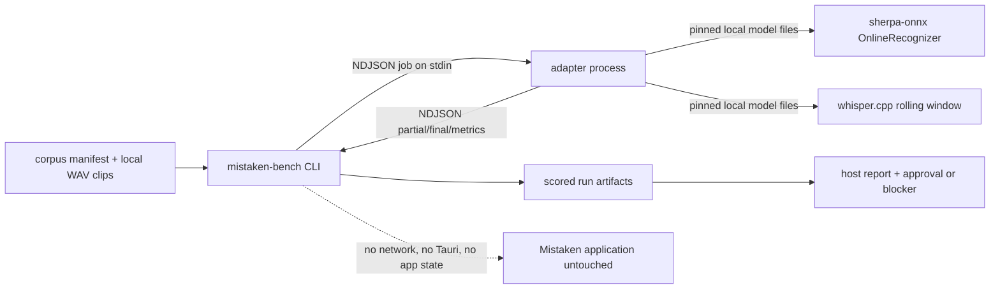

# Spec 05 — Local ASR Benchmark Corpus, Harness, and License Gate

## 1. Status, Ownership, Base, and Gates

- **Status:** Authored; ready for cross-spec integration review. Not implemented.
- **Implementation owner:** One Spec 05 branch/worktree with one writer.
- **Required base:** One clean SHA containing implemented, reviewed, and merged Spec 01.
- **Allowed implementation predecessors:** Spec 01 only.
- **Parallel-safe peers:** Specs 02 and 03 in Wave 2, and Specs 04, 07, 08 if benchmarking is still running in Wave 3. Spec 05 touches no application, runtime, UI, native audio, root manifest, lockfile, capability, or context file, so it stays disjoint from every other wave.
- **Shared dependency gate:** Spec 05 must not add, remove, or version-change any dependency in `package.json`, `package-lock.json`, `src-tauri/Cargo.toml`, or `src-tauri/Cargo.lock`. All benchmark dependencies live in the benchmark subtree with their own manifests and lockfiles.
- **Successor gate:** Spec 06 may start only after this spec merges with either (a) one approved default model configuration plus a complete license record, or (b) an explicitly recorded blocker naming the failed gate. Specs 13 and 14 consume the recorded payload size and redistribution terms.
- **Review level:** High. This spec decides the shipped recognizer, the redistribution rights of the shipped weights, and the accuracy definition of the product’s core promise: recognized speech must not be silently corrected.

## 2. Goal and Measurable Result

Produce evidence, not opinion, about which local ASR configuration Mistaken should ship.

Measurable results:

1. A reproducible Mistaken-specific corpus of deliberately incorrect English speech exists locally with a committed, checksum-verified manifest and committed prompts, while the recordings themselves stay off the repository.
2. A benchmark harness runs each candidate configuration against that corpus on real hardware, offline, and emits per-clip and aggregate metrics: word error rate, **mistake-preservation rate**, hallucination/insertion rate on silence and noise, first-partial latency, final-after-endpoint latency, real-time factor, peak resident memory, and CPU time.
3. Every candidate has a recorded license triple: runtime library license, model-weight license and provenance chain, and training-data terms, each with a primary source URL and retrieval date.
4. One model configuration is **approved** as the Mistaken default because it passes every numbered gate in section 12 on both reference hosts, or approval is **explicitly blocked** with the exact failing gate and measurement.
5. A committed report lets a second engineer re-run the same commands, on the same pinned runtime tags and model checksums, and land inside the recorded tolerance.

The result is measurable from committed manifests, candidate descriptors, license record, scored run artifacts, and one report per host. A compiling harness with no real recorded speech and no real inference run is not a result.

## 3. Verified Current Behavior

Verified while authoring this spec:

- `/Users/berat/mistaken` does not exist. `/Users/berat/mistaken-context` is documentation-only and contains Specs 01–04 plus the context bundle; there is no `benchmarks/` directory, corpus, harness, model file, or vendored runtime.
- Spec 01 creates the repository, the root `.gitignore`, the toolchain pins, the npm/Cargo manifests and lockfiles, and states that Spec 05 is limited to its benchmark subtree and must not mutate shared root manifests during Wave 2.
- Specs 02, 03, and 04 explicitly exclude `benchmarks/**` from their owned paths, and Spec 03 excludes ASR, benchmark, model, and platform-backend directories from its ownership.
- No application command, event, type, or native module defined by Specs 02–04 is consumed by this spec: nothing here runs inside the Tauri application.
- `sherpa-onnx` is licensed Apache-2.0 (repository `LICENSE`, retrieved 2026-09-11); its latest published release at authoring time is `v1.13.8` (published 2026-09-10).
- `whisper.cpp` is licensed MIT (repository `LICENSE`, “The ggml authors”, retrieved 2026-09-11); its latest published release at authoring time is `v1.9.4` (published 2026-09-11). ONNX Runtime, which sherpa-onnx links, is MIT (Microsoft, retrieved 2026-09-11).
- Model-weight terms are separate from runtime terms and are not uniform:
  - `csukuangfj/sherpa-onnx-streaming-zipformer-en-2023-06-26` declares `license: apache-2.0`; its card states the TorchScript source is `Zengwei/icefall-asr-librispeech-streaming-zipformer-2023-05-17`, and that upstream repository declares **no license** in its card metadata (verified: tags contain no `license:` entry). This is a provenance gap, not a proven grant.
  - `csukuangfj/sherpa-onnx-streaming-zipformer-en-20M-2023-02-17` declares `license: apache-2.0`, and its upstream `desh2608/icefall-asr-librispeech-pruned-transducer-stateless7-streaming-small` also declares `license: apache-2.0`; its published LibriSpeech figures are WER 3.94 greedy / 3.88 modified-beam on `test-clean`.
  - `ggerganov/whisper.cpp` ggml conversions declare `license: mit`; OpenAI’s Whisper code is MIT and the `openai/whisper-*.en` model cards declare `apache-2.0`.
  - LibriSpeech (OpenSLR SLR12), the training corpus behind both Zipformer candidates, is CC BY 4.0 and therefore requires attribution, not silence.
- The `sherpa-onnx-streaming-zipformer-en-2023-06-21` variant is trained on LibriSpeech **plus GigaSpeech**, whose terms are not established by the model card; it is therefore excluded from the candidate set rather than benchmarked and then discovered to be unusable.
- Exact artifact identities retrieved from the Hugging Face file API on 2026-09-11 (sizes in bytes, LFS SHA-256 where the file is LFS-backed):
  - `sherpa-onnx-streaming-zipformer-en-2023-06-26` repo revision `672fbf1b30579d6585301139bb363f42a0ad4a24`; `encoder-epoch-99-avg-1-chunk-16-left-64.int8.onnx` 71,082,637 / `0d072fd4ef956294ba9db9e9a71a541ac70659095ec4934c8453d8b2fe740187`; `decoder-…-left-64.int8.onnx` 1,307,236 / `98da299f471e38bb4e1a8df579b8cc9122d6039576a77e357b3c60f17dd83b02`; `joiner-…-left-64.int8.onnx` 259,335 / `d944208d660d67c8d72cd2acaeac971fa5ceb8c80e76c1968148846fedd6e297`; `tokens.txt` 5,048; `bpe.model` 244,865.
  - `sherpa-onnx-streaming-zipformer-en-20M-2023-02-17` repo revision `d42f2d9f7ca24806fb667456a18a9f1b60f70d16`; `encoder-epoch-99-avg-1.int8.onnx` 42,845,182 / `3810755ce7c3ab26b42a8bcf39d191308fa27fb0f53358823ba46141d03b7eb3`; `decoder-epoch-99-avg-1.int8.onnx` 539,499 / `21e2a2acd961b3ac72f55be2f10f1a285e1b0b0ba010d7c0b6eab141411b163c`; `joiner-epoch-99-avg-1.int8.onnx` 259,572 / `e085d73b593cf9b0707f370dbd656d58327d3fe36d80d849202ef81df02cb01e`; `tokens.txt` 5,048. Its fp32 `encoder-epoch-99-avg-1.onnx` carries a third-party scanner “suspicious / PAIT-ONNX-200” status, so only the int8 export enters the candidate set.
  - `ggerganov/whisper.cpp`: `ggml-base.en.bin` 147,964,211 / `a03779c86df3323075f5e796cb2ce5029f00ec8869eee3fdfb897afe36c6d002` (upstream SHA-1 `137c40403d78fd54d454da0f9bd998f78703390c`); `ggml-small.en.bin` 487,614,201 / `c6138d6d58ecc8322097e0f987c32f1be8bb0a18532a3f88f734d1bbf9c41e5d` (upstream SHA-1 `db8a495a91d927739e50b3fc1cc4c6b8f6c2d022`).
- `whisper.cpp` has no native streaming recognizer: its streaming example re-decodes a rolling window. Any “streaming” number produced for a Whisper candidate is therefore a simulated rolling-window measurement and must be labeled as such.

Every retrieved value above is an authoring input. During implementation the local files, their recomputed checksums, the installed runtime documentation, and the actual measured runs become authoritative; if a number differs, the implementation records the measured value and flags the drift instead of reusing this section.

## 4. Scope

### In scope

- `benchmarks/` subtree only: corpus prompts, corpus manifest and schema, harness, adapters, candidate descriptors, license record, scoring, reports, and benchmark-local ignore rules.
- Recording protocol for a Mistaken-specific incorrect-English corpus, including condition taxonomy, deliberate-error annotation, opaque speaker-profile identifiers, consent rule, and checksum registration.
- A deterministic scoring implementation: token normalization, alignment, word error rate, mistake-preservation rate over annotated error spans, insertion/hallucination rate, and latency/throughput/resource aggregation.
- A harness CLI that validates the corpus, runs one candidate, scores a run, and renders a report, with a stable adapter process protocol.
- Two candidate adapters built from pinned upstream source tags: a real streaming sherpa-onnx online-transducer adapter and a rolling-window whisper.cpp adapter explicitly labeled as simulated streaming.
- Candidate descriptors pinning runtime tag, model repository revision, per-file size and checksum, decoding parameters, thread count, and chunk configuration.
- A license record covering runtime library, linked inference runtime, model weights, upstream weight provenance, and training-data terms, each with a primary source and retrieval date.
- Numbered approval gates, both-host evidence, and one written approval or one written blocker.
- Local-only model and vendored-runtime directories that are ignored by Git and reproducible from the recorded identities.

### Out of scope

- Any change to the Tauri application, React code, `src/**`, `src-tauri/**`, root manifests, lockfiles, toolchain pins, capabilities, permissions, or global tokens.
- Integrating the approved recognizer into Mistaken. Spec 06 owns the in-application ASR adapter and model lifecycle.
- Live microphone or system-audio capture inside the harness. The corpus is recorded once through the operating system’s own recording tools per the documented protocol; the harness reads files.
- Grammar correction, spelling correction, paraphrasing, LLM post-processing, or text “cleanup” anywhere in the measured path or the scoring path.
- Model fine-tuning, training, quantization authoring, distillation, pruning, or export scripting. Only published artifacts are evaluated.
- Cloud or paid ASR APIs, hosted evaluation services, remote benchmark runners, telemetry, and result upload.
- Committing audio recordings, raw PCM, converted feature files, model weights, or vendored runtime sources into the repository.
- Speaker diarization, voice-identity analysis, emotion or accent classification, and any biometric profiling of the recorded speaker.
- Packaging, installer construction, signing, notarization, and updater behavior. Specs 13–15 own those; this spec only records the payload size that constrains them.
- CI automation, scheduled re-benchmarking, and dashboards.
- GPU/NPU acceleration claims. Measurements use the CPU execution path that Mistaken will actually ship unless a platform default is demonstrably the CPU path plus Apple Accelerate-style in-runtime defaults, in which case the exact enabled backend is recorded.

## 5. Owned Files and Forbidden Concurrent Files

### Owned during Spec 05 implementation

```text
benchmarks/README.md
benchmarks/.gitignore
benchmarks/corpus/protocol.md
benchmarks/corpus/prompts/<condition>-<nn>.md
benchmarks/corpus/manifest.json
benchmarks/corpus/manifest.schema.json
benchmarks/corpus/clips/**                  # local only, Git-ignored
benchmarks/harness/Cargo.toml
benchmarks/harness/Cargo.lock
benchmarks/harness/src/**
benchmarks/harness/tests/**
benchmarks/harness/fixtures/**
benchmarks/adapters/sherpa-onnx/**
benchmarks/adapters/whisper-cpp/**
benchmarks/candidates/<candidate-id>.json
benchmarks/licenses/license-record.md
benchmarks/reports/<date>-<host-profile>.md
benchmarks/reports/approval.md
benchmarks/runs/**                          # local only, Git-ignored
benchmarks/models/**                        # local only, Git-ignored
benchmarks/.vendor/**                       # local only, Git-ignored
```

`benchmarks/.gitignore` is the only ignore file this spec writes. The root `.gitignore` belongs to Spec 01 and must not be edited here; if a root-level ignore turns out to be required, the requirement is recorded and handed to the integration owner.

### Consumed unchanged

- Spec 01’s repository layout, `docs/context/**`, `docs/specs/**`, toolchain pins, and command conventions.
- The product invariants in `project-overview.md`, `architecture.md`, `code-standards.md`, and `ai-workflow-rules.md`.

### Forbidden concurrent files

Spec 05 must not create, edit, move, or delete:

- `package.json`, `package-lock.json`, `src-tauri/Cargo.toml`, `src-tauri/Cargo.lock`, `rust-toolchain.toml`, the Node-version file, Vite/Vitest/TypeScript/lint configuration.
- Anything under `src/**` or `src-tauri/**`, including `tauri.conf.json`, `capabilities/**`, `permissions/**`, `build.rs`, `lib.rs`, `main.rs`.
- The root `.gitignore`, `AGENTS.md`, `README.md`, or any other repository-root file.
- `docs/context/**` (including `progress-tracker.md`) and any other spec file. Shared documentation updates are integration-owner work after merge.

Specs 02, 03, 04, 07, and 08 must not edit `benchmarks/**`. If a peer spec needs a benchmark number, it reads the committed report; it does not modify the harness.

## 6. Contracts Consumed and Produced

### Consumed

- Product invariants: local-only processing, no paid or cloud ASR, no account or backend, no transcript database, no grammar correction, microphone and system audio as separate sources.
- Spec 01’s repository root and commit discipline.

### Produced — corpus manifest

`benchmarks/corpus/manifest.json` is the committed corpus contract, validated against `manifest.schema.json`:

```jsonc
{
  "manifestVersion": 1,
  "sampleFormat": { "codec": "pcm_s16le", "channels": 1 },
  "clips": [
    {
      "id": "mistake-tense-03",
      "file": "clips/mistake-tense-03.wav",
      "condition": "mistake-tense",
      "promptFile": "prompts/mistake-tense-03.md",
      "sampleRateHz": 16000,
      "durationMs": 7480,
      "sha256": "<64 hex>",
      "speakerProfileId": "sp-01",
      "reference": "i actually have went there yesterday and i didn't knew anyone",
      "errorSpans": [
        { "startToken": 2, "endToken": 3, "kind": "verb-form", "spoken": "have went" },
        { "startToken": 8, "endToken": 9, "kind": "verb-form", "spoken": "didn't knew" }
      ],
      "expectPhysicalSilence": false
    }
  ]
}
```

Manifest rules:

- `reference` is the verbatim spoken text, already normalized by the documented normalizer, with every grammatical error, filler, and repetition preserved. Correcting a reference is a specification violation, not a typo fix.
- `errorSpans` indices are token indices into `reference`. `spoken` repeats the exact incorrect surface form so scoring can check preservation without re-deriving it.
- `sha256` is the checksum of the local WAV file; the harness refuses to run when a clip is missing or a checksum mismatches.
- `speakerProfileId` is opaque (`sp-01`, `sp-02`, …). No name, gender, age, nationality, accent label, or other personal attribute is recorded anywhere in the subtree.
- Clip audio is never committed. The manifest plus prompts plus protocol are sufficient to re-record an equivalent corpus; the checksums prove which recordings produced a given report.

### Produced — corpus composition

Minimum corpus: **122 clips, ≥ 20 minutes total**, 16 kHz mono `pcm_s16le`, with one 8-clip duplicate set re-recorded at 48 kHz to exercise resampling. The condition counts below sum to exactly 122; each row is a floor, and the manifest records the actual per-condition counts.

| Condition prefix | Clips | Content requirement |
|---|---|---|
| `mistake-tense` | 12 | Wrong verb tense/form: `have went`, `didn't knew`, `was gone yesterday`. |
| `mistake-agreement` | 8 | Subject–verb and plural agreement errors. |
| `mistake-article` | 6 | Missing or wrong articles. |
| `mistake-preposition` | 8 | Wrong or missing prepositions. |
| `mistake-order` | 6 | Non-native word order and incomplete restarts. |
| `mistake-minimal-pair` | 8 | Acoustically risky pairs, including `went`/`won't`, `can`/`can't`, `knew`/`new`, `their`/`there`. |
| `fillers-repetition` | 10 | `um`, `uh`, stutters, repeated words, self-corrections. |
| `fluent-control` | 16 | Grammatically correct speech to bound the false-correction measurement. |
| `fast-speech` | 12 | Rapid delivery of the same error families. |
| `system-playback` | 16 | Second-speaker style utterances captured from loudspeaker playback for later `- ` source work. |
| `noise-silence` | 12 | Room noise, typing, music bed, plus at least four clips of ≥ 10 s physical silence with `expectPhysicalSilence: true` and an empty `reference`. |
| `long-turn` | 8 | 60–180 s continuous speech mixing conditions, for drift and memory growth. |

Recording protocol (`corpus/protocol.md`) fixes: one quiet room, one microphone per speaker profile, no post-processing, no noise suppression, no normalization, no trimming beyond leading/trailing silence bounds stated in the protocol, and explicit informed consent from every recorded speaker with the consent fact recorded as a boolean per profile and no identity stored.

### Produced — candidate descriptor

`benchmarks/candidates/<candidate-id>.json`:

```jsonc
{
  "candidateId": "sherpa-zipformer-en-2023-06-26-int8-left64",
  "adapter": "sherpa-onnx",
  "runtime": { "repo": "k2-fsa/sherpa-onnx", "tag": "v1.13.8", "buildType": "Release", "linkedRuntime": "onnxruntime (vendored by tag)" },
  "streamingMode": "native-streaming",
  "model": {
    "repo": "csukuangfj/sherpa-onnx-streaming-zipformer-en-2023-06-26",
    "revision": "672fbf1b30579d6585301139bb363f42a0ad4a24",
    "files": [
      { "path": "encoder-epoch-99-avg-1-chunk-16-left-64.int8.onnx", "bytes": 71082637, "sha256": "0d072fd4ef956294ba9db9e9a71a541ac70659095ec4934c8453d8b2fe740187" },
      { "path": "decoder-epoch-99-avg-1-chunk-16-left-64.int8.onnx", "bytes": 1307236, "sha256": "98da299f471e38bb4e1a8df579b8cc9122d6039576a77e357b3c60f17dd83b02" },
      { "path": "joiner-epoch-99-avg-1-chunk-16-left-64.int8.onnx", "bytes": 259335, "sha256": "d944208d660d67c8d72cd2acaeac971fa5ceb8c80e76c1968148846fedd6e297" },
      { "path": "tokens.txt", "bytes": 5048 },
      { "path": "bpe.model", "bytes": 244865 }
    ]
  },
  "decoding": { "method": "greedy_search", "numThreads": 2, "provider": "cpu", "enableEndpoint": true },
  "payloadBytes": 72899121
}
```

Frozen candidate set:

| Candidate id | Adapter | Streaming | Payload (bytes) | Purpose |
|---|---|---|---|---|
| `sherpa-zipformer-en-2023-06-26-int8-left64` | sherpa-onnx | native | 72,899,121 | Primary streaming candidate. |
| `sherpa-zipformer-en-2023-06-26-fp32-left64` | sherpa-onnx | native | recorded at fetch | Quantization-loss control for the primary. |
| `sherpa-zipformer-en-20M-2023-02-17-int8` | sherpa-onnx | native | 43,649,301 | Small/low-resource candidate with clean upstream license. |
| `whisper-base-en-ggml` | whisper-cpp | simulated rolling window | 147,964,211 | Non-streaming accuracy comparison at bundleable-ish size. |
| `whisper-small-en-ggml` | whisper-cpp | simulated rolling window | 487,614,201 | Accuracy ceiling reference; expected to fail the size gate. |

Candidates are added only with a complete license row. `sherpa-onnx-streaming-zipformer-en-2023-06-21` is excluded because its GigaSpeech training terms are unresolved.

The recorded runtime tags `v1.13.8` and `v1.9.4` are authoring-time latest releases. The implementer re-resolves the latest release, records the exact tag actually built, and never builds from a moving branch.

### Produced — adapter process protocol

Each adapter is a standalone executable that receives one JSON job on stdin and writes newline-delimited JSON to stdout. Stderr is diagnostic only.

Job:

```jsonc
{
  "clipId": "mistake-tense-03",
  "wavPath": "/abs/path/clips/mistake-tense-03.wav",
  "model": { "...": "adapter-specific fields from the candidate descriptor" },
  "decoding": { "method": "greedy_search", "numThreads": 2 },
  "pace": "realtime",            // "realtime" | "asap"
  "chunkMs": 100,
  "windowMs": 5000               // rolling-window adapters only
}
```

Events:

```jsonc
{ "type": "ready",   "atMs": 0 }
{ "type": "partial", "atMs": 640,  "text": "i actually have" }
{ "type": "final",   "atMs": 7710, "text": "i actually have went there yesterday", "segmentIndex": 0 }
{ "type": "metrics", "atMs": 7980, "audioMs": 7480, "wallMs": 7980, "cpuTimeMs": 2140, "peakRssBytes": 384102400, "fedChunks": 75, "droppedChunks": 0 }
{ "type": "error",   "atMs": 120,  "code": "model_load_failed", "message": "..." }
```

Protocol rules:

- `atMs` is measured from the first fed audio chunk, monotonic clock, one clock source per process.
- In `realtime` pace the adapter feeds `chunkMs` of audio per `chunkMs` of wall time so latency numbers mean something; in `asap` pace it feeds as fast as the recognizer accepts so real-time factor and accuracy are unaffected by pacing.
- The adapter emits recognizer output verbatim. It must not lowercase, punctuate, re-case, spell-correct, expand contractions, substitute words, apply a language-model rescoring pass that is not part of the candidate’s declared decoding method, or drop tokens. Normalization happens once, later, in the harness scorer.
- `peakRssBytes` and `cpuTimeMs` come from the adapter’s own process APIs (`mach_task_basic_info` / `getrusage` on macOS, `GetProcessMemoryInfo` / `GetProcessTimes` on Windows) because only the adapter process knows its own recognizer footprint.
- Adapters perform no network access. Model files are read from local paths only.
- The whisper adapter sets `"streamingMode": "simulated-rolling-window"` in its `ready` event and must not present its rolling-window partials as native streaming.

### Produced — scoring contract

Token normalization, applied identically to references and hypotheses, implemented once, unit-tested:

1. Unicode NFC, then lowercase.
2. Strip all punctuation except apostrophes that sit between two letters (`didn't` survives, `--` and trailing `.` do not).
3. Collapse whitespace; split on whitespace.
4. Nothing else. No stemming, no stopword removal, no number-to-word mapping (prompts spell numbers as words), no filler removal, no contraction expansion, and no grammatical or spelling repair of any kind.

Metrics:

- **WER** = Levenshtein distance over normalized tokens divided by reference token count, computed per clip and aggregated as total-edits over total-reference-tokens.
- **Mistake-preservation rate (MPR)** = over all annotated `errorSpans`, the fraction whose `spoken` surface tokens appear, in order and unbroken, at the aligned hypothesis position. A span is *not* preserved when the recognizer emits a grammatically corrected alternative there. MPR is the product’s primary fidelity metric; a high-WER candidate that preserves mistakes beats a low-WER candidate that fixes them.
- **False-correction count** = preserved-span failures whose hypothesis text is the grammatically correct form of `spoken`, reported separately from ordinary misrecognitions, since only the former violates the product promise.
- **Insertion rate on non-speech** = inserted tokens per noise clip, and absolute token count for `expectPhysicalSilence` clips, where any non-empty output is a hallucination.
- **First-partial latency** = `atMs` of the first `partial` whose normalized text is non-empty, `realtime` pace only.
- **Final-after-endpoint latency** = `atMs` of a `final` minus the clip’s end-of-speech marker recorded in the manifest for the relevant segment boundary, `realtime` pace only.
- **Real-time factor** = `wallMs / audioMs`, `asap` pace.
- **Peak RSS** and **CPU time** from the adapter `metrics` event, plus a two-stream concurrency run for the leading candidate.

Determinism: every candidate runs 3 repetitions per pace; reports publish the median and the min–max spread. Accuracy metrics must be bit-identical across repetitions for greedy decoding; if they are not, the nondeterminism is recorded as a finding before any approval.

### Produced — license record

`benchmarks/licenses/license-record.md` has one row per candidate with: runtime repository, tag, runtime license and source URL, linked inference runtime and license, model repository, revision, declared weight license and source URL, upstream provenance repository and its declared license (or “none declared”), training corpus and its terms, required attribution text, redistribution verdict (`permitted-with-attribution`, `permitted`, `unclear`, `prohibited`), and retrieval date for every claim.

### Produced — harness CLI

```text
mistaken-bench validate-corpus
mistaken-bench fetch --candidate <id>          # verifies local files against recorded checksums; refuses unknown files
mistaken-bench run --candidate <id> --host-profile <id> --pace <realtime|asap> --repeat 3
mistaken-bench score --run <runDir>
mistaken-bench report --host-profile <id> --out benchmarks/reports/<date>-<host>.md
mistaken-bench licenses --check
```

Harness dependencies are exact and minimal, declared in `benchmarks/harness/Cargo.toml` with a committed `Cargo.lock` and an empty `[workspace]` table so the crate never joins the application workspace: `serde` with `derive`, `serde_json`, `clap` with `derive`, `hound` for WAV reading, and `sha2` for checksums. No async runtime, HTTP client, telemetry crate, or ML crate is permitted. The implementer verifies exact resolvable versions against Spec 01’s pinned toolchain and records them; an unresolvable version is a recorded decision, not silent drift.

## 7. User Flow and Developer Verification Flow

There is no end-user flow: Spec 05 ships no product surface. The operator flow is the deliverable.

### Corpus flow

1. Operator reads `corpus/protocol.md`, confirms consent for each speaker profile, and records the 122 prompts with the OS recording tool at 16 kHz mono, plus the 8-clip 48 kHz duplicate set.
2. Operator places clips in `benchmarks/corpus/clips/` and runs `mistaken-bench validate-corpus`, which checks presence, format, channel count, sample rate, duration bounds, checksum, prompt linkage, token indices of every `errorSpans` entry, and that `expectPhysicalSilence` clips have empty references.
3. Fix-and-revalidate continues until validation passes with zero warnings. Validation failures name the exact clip and the exact rule violated.

### Benchmark flow

1. Operator fetches each candidate’s runtime source at the recorded tag into `.vendor/`, builds it Release per the adapter `build.md`, and builds the adapter.
2. Operator places model files under `benchmarks/models/<candidate-id>/` and runs `mistaken-bench fetch --candidate <id>`, which recomputes SHA-256 for every declared file and refuses to proceed on mismatch.
3. Operator disables networking, then runs `mistaken-bench run` for both paces, 3 repetitions, per candidate, per host.
4. `mistaken-bench score` produces per-clip and aggregate metrics; `mistaken-bench report` renders the host report including gate pass/fail per candidate.
5. Operator runs the two-stream concurrency measurement for the leading candidate.
6. Operator runs `mistaken-bench licenses --check`, completes `license-record.md`, and writes `reports/approval.md` with either the approved candidate or the blocking gate.

### Developer verification flow

- `cargo test` inside `benchmarks/harness` exercises normalization, alignment, WER, MPR, false-correction classification, silence handling, manifest validation, adapter-event parsing, and report gate evaluation against committed synthetic fixtures.
- A throwaway adapter stub is **not** committed as a candidate; protocol parsing is tested from committed NDJSON fixture files.
- Real inference on real recordings on both hosts is mandatory evidence. Fixtures prove the scorer; only real runs prove a model.

## 8. UI Behavior, States, Tokens, and Accessibility

Spec 05 adds no user interface, no component, no token, and no accessibility surface; `src/**` is untouched. The operator-facing surface is a terminal CLI and Markdown reports, which must satisfy:

- Every failure names the offending clip, candidate, gate, or file path plus the exact rule violated; no bare non-zero exit.
- Progress output is line-based and free of animation, spinners, and color-only meaning, so it remains readable in a plain log.
- Reports state units for every number, name the host profile, name the pace, and mark simulated-streaming candidates inline next to their latency numbers.
- Reports never embed audio, transcript text of private speech beyond the corpus references already committed, absolute user paths, or personal attributes of speakers.
- Gate outcomes are printed as explicit `PASS` / `FAIL` plus the measured value and threshold, never as a summary adjective.

## 9. Frontend → Tauri IPC → Rust / Audio / ASR Data Flow

Spec 05 defines **no** frontend, IPC, Tauri command, event, capability, or in-application audio path. Nothing in this spec runs inside the Mistaken process.



Data-flow rules:

- Audio flows file → adapter only. No PCM enters the harness’s report artifacts.
- Recognizer text flows adapter → harness verbatim; normalization occurs once in the scorer and is applied symmetrically to references.
- No stage may consult a grammar checker, spell checker, language-model rewriter, or LLM. The scorer’s only text transformation is the four-step normalizer in section 6.
- Spec 06 consumes the approved candidate descriptor and license row as data; it does not import harness code into the application.

## 10. Platform, Permissions, Offline, Privacy, and Fallback

### Reference hosts

Two host profiles are required and both must pass every gate:

- `mac-arm64`: Apple Silicon Mac, minimum 8 cores and 16 GB RAM, on the supported macOS version; the development host (Apple M4, arm64) qualifies. Exact chip, core counts, RAM, macOS version, and power state (on AC, not low-power mode) are recorded.
- `win-x64`: Windows 10/11 x64, minimum 8 cores and 16 GB RAM. Exact CPU, RAM, Windows edition/version/build, and power plan are recorded.

Runs execute with the machine on AC power, no other benchmark load, and the recorded thermal state; results from a thermally throttled or battery-saving run are discarded and re-run.

### Permissions

- Recording the corpus uses the operating system’s own recording tool and its existing microphone permission; the harness itself never opens a capture device and therefore requests no microphone, screen-recording, or accessibility permission.
- Building vendored runtimes needs only a local C++ toolchain and CMake. No entitlement, driver, elevated privilege, or virtual audio device is required.

### Offline and privacy

- Fetching upstream runtime sources and model files is a one-time, explicitly operator-initiated step. Every measured run executes with networking disabled, and the report records that fact per host.
- No adapter or harness code opens a socket, resolves a host name, reads an API key, or contacts an update service. This is verified by inspection plus one networking-disabled full run.
- Recordings never leave the machine and are never committed. `benchmarks/.gitignore` ignores `corpus/clips/`, `models/`, `runs/`, and `.vendor/`, and the implementation verifies with `git status` and `git check-ignore` that no audio, model, or vendored source is staged.
- Committed corpus references are the deliberately scripted prompt sentences, not private conversation content. No clip may contain real personal data; the protocol forbids recording names, addresses, credentials, or third-party conversation.
- No speaker identity, demographic attribute, or accent label is recorded anywhere. Profiles are opaque ids with a consent boolean.
- Run artifacts store per-clip hypotheses for scoring locally under the ignored `runs/` directory; committed reports contain aggregate metrics plus, at most, short excerpts drawn from already-committed corpus references.

### Fallback rules

- A candidate that cannot be built, loaded, or run is recorded as `blocked` with the exact error; it is never replaced by a cloud API, a hosted endpoint, a downloaded prebuilt binary of unknown provenance, or a “representative” published WER number.
- A model whose license or provenance is unclear stays `unclear` and cannot be approved, regardless of accuracy.
- If no candidate passes every gate, the spec completes with an explicit blocker naming the failing gate per candidate and a recommended next action (different published model, different quantization, different chunk configuration). It must not lower a gate to manufacture an approval; gate changes require a recorded product decision.
- Published third-party WER figures may appear as context in the report only when labeled as upstream claims with their source, and never as Mistaken evidence.

## 11. Resource Lifecycle, Bounded Buffering, Errors, and Recovery

### Process lifecycle

- The harness spawns exactly one adapter process per clip run, writes one job, reads NDJSON until `metrics` or `error`, then waits for exit.
- Every spawned process has a wall-clock timeout of `max(30 s, 10 × clip duration)`. On timeout the harness terminates the process tree, records `timeout` for that clip, and continues the remaining clips instead of aborting the whole run.
- The harness never leaves an orphaned adapter: termination is verified after each clip, and an interrupted run (`Ctrl+C`) terminates the current child before exiting.
- Adapters release recognizer, stream, and model handles before emitting `metrics`, so the reported peak RSS covers the real session and exit is clean.
- Repeated run → score → run cycles must not accumulate memory or leave temporary files outside `runs/<timestamp>/`.

### Bounded buffering

- The adapter reads each WAV in bounded frames (≤ 1 s) and feeds the recognizer in `chunkMs` blocks; it does not load a 180 s long-turn clip into a recognizer-sized single buffer beyond that bound.
- The harness holds at most the current clip’s event list in memory and appends scored results to disk per clip; it never accumulates all hypotheses for all candidates in memory.
- Adapter stdout is consumed continuously so a chatty partial stream cannot fill an OS pipe buffer and deadlock the run.
- NDJSON lines are capped at 64 KiB; a longer line is a protocol error for that clip, not an unbounded allocation.

### Error taxonomy

| Code | Cause | Harness behavior |
|---|---|---|
| `corpus_invalid` | Missing clip, checksum mismatch, bad format, bad span index | Refuse to run; name clip and rule |
| `model_missing` | Declared model file absent | Refuse candidate; name path |
| `model_checksum_mismatch` | Local file differs from descriptor | Refuse candidate; print both digests |
| `model_load_failed` | Runtime rejects the model | Record candidate as blocked with adapter message |
| `adapter_build_missing` | Adapter executable absent | Refuse candidate; print build command from `build.md` |
| `protocol_error` | Malformed or oversized NDJSON | Record clip failure; continue run |
| `timeout` | Clip exceeded its bound | Terminate child; record clip failure; continue |
| `nondeterministic_result` | Greedy repetitions disagree | Record finding; block approval until explained |
| `network_attempt_detected` | Socket activity during a measured run | Fail the run; record as a High finding |

Any clip failure is reported; aggregate metrics state how many clips contributed and refuse to publish a gate verdict when more than 2% of clips failed for the candidate.

### Recovery

- Re-running a candidate creates a new `runs/<timestamp>/` directory; prior runs are immutable evidence, never overwritten in place.
- A partially completed run can be scored, but its report is marked incomplete and cannot satisfy a gate.
- Corpus re-recording of a single clip updates only that clip’s checksum and invalidates reports that referenced the old digest; the report records the manifest digest it ran against.

## 12. Numbered Measurable Acceptance Criteria

1. **Isolation and base — all hosts:** Spec 05 runs in its own worktree from a recorded SHA containing merged Spec 01; the final diff touches only `benchmarks/**`; `git status` shows no change to root manifests, lockfiles, `src/**`, `src-tauri/**`, root `.gitignore`, `docs/**`, or any other spec file.
2. **Corpus exists and validates — operator host:** ≥ 122 clips and ≥ 20 minutes of real recorded speech exist locally; `mistaken-bench validate-corpus` exits zero with zero warnings; every condition row in section 6 meets its minimum count; ≥ 4 clips are ≥ 10 s physical silence with empty references; the 48 kHz duplicate set exists.
3. **Verbatim references — review + tests:** Every `errorSpans` entry’s `spoken` surface appears verbatim in its clip `reference`; no reference contains a grammatically corrected form of an annotated error; a committed test asserts span-to-reference consistency for the whole manifest.
4. **No committed private audio — repository:** `git check-ignore` confirms `corpus/clips/`, `models/`, `runs/`, `.vendor/` are ignored; the commit contains no `.wav`, `.onnx`, `.bin`, `.ggml`, or vendored runtime source; the subtree contains no speaker name, demographic attribute, or accent label.
5. **Deterministic scorer — harness tests:** Normalization, WER, MPR, false-correction classification, silence handling, and gate evaluation pass committed fixture tests, including a fixture where a hypothesis grammatically corrects an annotated error and is therefore scored as a false correction rather than a match.
6. **Adapters are real and pinned — both hosts:** Both adapters build from the recorded upstream tags with the recorded CMake commands on both hosts; each `ready` event reports its true streaming mode; the whisper adapter reports `simulated-rolling-window`.
7. **Artifact identity verified — both hosts:** For every candidate, locally recomputed SHA-256 and byte sizes match the descriptor for every model file; `mistaken-bench fetch` fails loudly on a deliberately corrupted file during verification.
8. **Real runs on real hardware — `mac-arm64` and `win-x64`:** Every candidate in the frozen set runs the full corpus in both paces with 3 repetitions on both hosts, or is recorded blocked with its exact error; ≥ 98% of clips contribute to any published aggregate.
9. **Offline proof — both hosts:** Every measured run executes with networking disabled; inspection finds no socket, DNS, HTTP, API-key, or update-check code path in harness or adapters; zero `network_attempt_detected`.
10. **Fidelity gate — both hosts:** The approved candidate achieves **MPR ≥ 0.90** over all annotated error spans and **≤ 0.05 false-correction rate** over those spans on both hosts; per-condition MPR for `mistake-tense` and `mistake-minimal-pair` is ≥ 0.85.
11. **Accuracy gate — both hosts:** The approved candidate achieves **WER ≤ 0.25** on the full Mistaken corpus and **WER ≤ 0.12** on the `fluent-control` subset on both hosts.
12. **Hallucination gate — both hosts:** On `expectPhysicalSilence` clips the approved candidate emits zero non-empty finals; on the remaining `noise-silence` clips its insertion rate is ≤ 0.02 tokens per second of audio.
13. **Latency and throughput gate — both hosts:** In `realtime` pace, median first-partial latency ≤ 900 ms and p95 final-after-endpoint latency ≤ 1500 ms; in `asap` pace, RTF ≤ 0.6 single-stream and ≤ 0.9 with two concurrent streams of the same candidate.
14. **Resource gate — both hosts:** Peak RSS ≤ 700 MB single-stream and ≤ 1.4 GB for two concurrent streams; sustained CPU during a `long-turn` clip ≤ 60% of one performance core per stream; a 180 s clip shows no monotonic RSS growth beyond 5% after the first 30 s.
15. **Size gate and payload record — report:** The approved candidate’s total model payload is ≤ 120 MB uncompressed per platform and its measured compressed payload is recorded; any candidate exceeding it is marked bundling-blocked with its exact payload, and the record states whether a separately packaged local resource is required.
16. **License gate — license record:** Every candidate row is complete: runtime license, linked inference-runtime license, weight license, upstream provenance license (including “none declared” where true), training-data terms, required attribution text, redistribution verdict, primary source URL, and retrieval date. A candidate with an `unclear` verdict cannot be approved. The approved candidate’s attribution text is written out verbatim for Specs 13–14 to ship.
17. **Explicit approval or explicit blocker — report:** `reports/approval.md` names exactly one approved candidate with per-gate measured values from both hosts, or records a blocker naming the failing gate and measurement for every candidate, plus the recommended next action. No approval exists without both hosts’ numbers.
18. **Reproducibility — second operator:** A second operator, following `benchmarks/README.md` only, reproduces the approved candidate’s aggregate WER and MPR within ±10% relative on the same host profile and manifest digest; the report records the reproduction attempt and its deltas.
19. **No correction stage anywhere — review:** Inspection of adapters, harness, and scorer proves no grammar corrector, spell corrector, rewriter, LLM call, or word-substitution table exists in the measured or scored path; the only text transformation is the documented four-step normalizer.
20. **Checks, cleanup, and review — integration:** `cargo fmt --check`, `cargo clippy --all-targets --all-features -- -D warnings`, and `cargo test` pass in `benchmarks/harness` on both hosts; temporary probes, stub adapters, and scratch artifacts are removed; the high-capability review covers scoring correctness, gate math, license reasoning, privacy, determinism, and Spec 06/13/14 consumption, with every High/Medium finding fixed and re-verified.

## 13. Acceptance Criterion → Verification/Test Mapping

| AC | Verification or permanent test | Evidence to record |
|---|---|---|
| 1 | Inspect base SHA, worktree, branch, and final `git status`/diff path list | Root, branch, base SHA, changed paths, zero out-of-subtree changes |
| 2 | Run `mistaken-bench validate-corpus`; count clips/duration per condition | Command output, clip and minute totals, per-condition counts |
| 3 | Committed manifest-consistency test plus manual reference review | Test name/result, reviewer confirmation that no reference was corrected |
| 4 | `git check-ignore` on each ignored path; inspect commit contents and subtree text | Ignore results, staged-file list, absence of audio/model/personal attributes |
| 5 | `cargo test` in `benchmarks/harness` with fixture suite | Test names/results, including the false-correction fixture |
| 6 | Build both adapters from pinned tags on both hosts; inspect `ready` events | Tags, CMake commands, compiler versions, streaming-mode strings |
| 7 | `mistaken-bench fetch --candidate <id>` per candidate plus one deliberate corruption test | Recomputed digests/sizes vs descriptor, refusal output |
| 8 | Full corpus runs, both paces, 3 repetitions, per candidate, per host | Run directories, clip contribution counts, blocked candidates with errors |
| 9 | Network-disabled runs plus code inspection for sockets/HTTP/keys | Disable method per OS, inspection notes, zero network findings |
| 10 | `mistaken-bench score`/`report` MPR and false-correction aggregates, overall and per condition | Per-host MPR, false-correction rate, per-condition MPR values |
| 11 | Same reports for WER on full corpus and `fluent-control` | Per-host WER values with clip counts |
| 12 | Silence and noise subset scoring | Non-empty final count on silence clips, insertion rate per second |
| 13 | `realtime` latency percentiles and `asap` RTF, single and two-stream | Median/p95 latencies, RTF values, concurrency configuration |
| 14 | Adapter `metrics` events plus long-turn observation | Peak RSS, CPU time, RSS growth curve summary |
| 15 | Sum declared file sizes; measure compressed payload | Uncompressed and compressed payload bytes per candidate and verdict |
| 16 | Complete `license-record.md`; run `mistaken-bench licenses --check`; re-verify each primary source | Per-candidate license rows, verdicts, URLs, retrieval dates, attribution text |
| 17 | Write `reports/approval.md` from both host reports | Approved candidate or per-candidate blocker with measured values |
| 18 | Second-operator reproduction following `README.md` only | Operator, host, manifest digest, reproduced WER/MPR and deltas |
| 19 | Inspect adapters, harness, scorer for any text-repair stage | Files reviewed, confirmation of the single normalizer |
| 20 | `cargo fmt --check`, `cargo clippy … -D warnings`, `cargo test`; cleanup and review pass | Exact commands/exits per host, removed artifacts, findings and dispositions |

Permanent tests protect scoring correctness, manifest integrity, protocol parsing, and gate evaluation. They must not assert that a function forwards a value, that a constant exists, that a report contains a specific sentence, or that a command merely does not throw. Model quality claims can never be satisfied by tests: they require real recorded speech, real inference, and both host profiles.

## 14. Ordered Implementation Plan

1. After Spec 01 merges, create the Spec 05 worktree from the recorded base SHA; record root, branch, and base; confirm no peer spec owns `benchmarks/**`.
2. Re-read the canonical context bundle, `spec-plan.md`, Specs 01–04, and the current repository state; run Spec 01’s baseline checks to confirm a clean starting point.
3. Create `benchmarks/.gitignore` first, ignoring `corpus/clips/`, `models/`, `runs/`, `.vendor/`, and adapter build directories, and verify the ignores before any audio or model file exists locally.
4. Write `corpus/protocol.md`, the condition taxonomy, the consent rule, and all 122 prompt files with deliberately incorrect English, minimal pairs, fillers, and silence prompts.
5. Write `corpus/manifest.schema.json`, then the harness crate skeleton with the exact minimal dependencies, empty `[workspace]` table, and committed lockfile.
6. Implement the normalizer, alignment, WER, MPR, false-correction classification, silence and insertion metrics, and gate evaluation with fixture tests; make the false-correction fixture fail before the classifier exists and pass after.
7. Implement manifest validation and `validate-corpus`, including span-index and silence-reference rules.
8. Record the corpus on the operator host per protocol, run `validate-corpus` until clean, and register durations and checksums in the manifest.
9. Freeze the candidate descriptors, re-resolving the latest sherpa-onnx and whisper.cpp release tags and recording the exact tags built.
10. Implement the adapter protocol types, NDJSON parsing with the size cap, process spawn/timeout/termination, and `run` orchestration, with fixture-based protocol tests.
11. Implement the sherpa-onnx adapter against the pinned runtime’s online-transducer API with real streaming and endpointing, plus its `build.md`.
12. Implement the whisper.cpp adapter as a rolling-window recognizer that reports `simulated-rolling-window`, plus its `build.md`.
13. Implement per-process peak RSS and CPU-time reporting in both adapters for macOS and Windows.
14. Fetch and checksum-verify all model files; prove `fetch` refuses a corrupted file.
15. Run every candidate on `mac-arm64`, networking disabled, both paces, 3 repetitions; score and render the host report.
16. Repeat step 15 on `win-x64`; run the two-stream concurrency measurement for the leading candidate on both hosts.
17. Complete `license-record.md` from primary sources, including the missing upstream license of the 2023-06-26 provenance chain and LibriSpeech’s CC BY 4.0 attribution requirement; compute verdicts.
18. Evaluate every gate per host; write `reports/approval.md` with one approval or explicit blockers; write `README.md` so a second operator can reproduce from scratch.
19. Perform the second-operator reproduction and record the deltas.
20. Review the full diff for scoring correctness, gate math, determinism, license reasoning, privacy leaks, orphaned processes, and out-of-subtree changes; fix every High/Medium finding and re-run affected measurements.
21. Remove scratch artifacts, stub adapters, and probes; create the focused local commit unless directed otherwise; report roots, branches, base and final SHAs, host identities, and evidence; do not push unless requested.

## 15. Risks, Rollback, Cleanup, and Preservation Rules

### Risks and mitigations

- **Benchmarking the wrong thing:** low WER can coexist with silent grammar correction, which would destroy the product’s purpose. MPR and false-correction rate are primary gates, not extras.
- **Corpus bias:** one speaker and one room can approve a model that fails for real use. Require ≥ 2 speaker profiles where available, fast-speech and noise conditions, and record profile counts as a limitation when only one speaker exists.
- **Reference contamination:** an operator “fixing” a reference sentence quietly destroys the fidelity metric. A committed consistency test plus review guards references; corrections are treated as specification violations.
- **Unfair candidate comparison:** whisper.cpp is not a streaming recognizer. Label its mode explicitly, keep its latency numbers separated, and never present rolling-window latency as streaming latency.
- **License surprise late in the project:** a weight file with unclear provenance discovered during packaging would block release. Section 16 gate blocks approval on `unclear` verdicts, and the 2023-06-26 upstream gap is already recorded as a known issue to resolve before approval.
- **Third-party scanner warnings:** the 20M fp32 encoder carries a suspicious-model scanner status. Only the int8 export enters the candidate set, and any scanner status for an approved artifact is recorded in the license/provenance row.
- **Nondeterministic measurements:** thermal state, background load, and power mode distort latency and RTF. Fix power/thermal conditions, require 3 repetitions with published spread, and discard throttled runs.
- **Dependency creep into the app:** a benchmark dependency added to the application manifest would violate Wave 2 ownership. The harness has its own manifest and lockfile plus an empty workspace table, and AC 1 verifies zero out-of-subtree changes.
- **Private speech leakage:** recordings and run hypotheses are sensitive. Ignore rules come first, audio is never committed, reports carry aggregates, and cleanup removes local scratch copies.
- **Orphaned adapter processes:** a hung recognizer could accumulate processes across a long run. Per-clip timeouts, verified termination, and interrupt handling are required behavior.
- **Gate erosion:** the temptation to lower a threshold to approve a candidate. Thresholds are frozen here; changing one requires a recorded product decision in the tracker, not a quiet edit.

### Rollback

- Before merge, abandon the Spec 05 branch/worktree; nothing in the application is affected.
- After merge, reverting Spec 05 removes the benchmark subtree only. Spec 06 must then either retain a copy of the approval record it consumed or be blocked, because an ASR integration without a recorded approval and license row is not permitted.
- Local ignored directories (`clips/`, `models/`, `runs/`, `.vendor/`) are operator data; rollback never deletes them implicitly.
- Never reset, clean, or delete unrelated user work, another worktree, or `/Users/berat/mistaken-context`.

### Required cleanup

- Remove stub adapters, scratch scripts, ad hoc scoring notebooks, temporary manifests, partial run directories used for debugging, and verbose runtime logs.
- Remove any deliberately corrupted verification file created for AC 7.
- Retain only committed synthetic fixtures that cannot contain private speech, the manifest, prompts, protocol, harness, adapters, descriptors, license record, and reports.
- Ensure no vendored runtime source, model file, WAV, or hypothesis dump is staged, and no absolute operator path appears in a committed report.

### Preservation rules

- Preserve the product invariants: local-only processing, no paid or cloud ASR, no account or backend, no transcript database, no persistence of user transcripts, and no grammar correction anywhere.
- Preserve recognizer output verbatim in the measured path; the scorer normalizes symmetrically and never repairs language.
- Preserve source separation semantics: `system-playback` clips exist to support later `- ` prefix work and must not be mixed with microphone clips into a single stream here.
- Preserve Spec 01’s toolchain pins, root manifests, lockfiles, and ignore file untouched.
- Preserve every prior run directory as immutable evidence; new measurements create new directories.
- Preserve speaker consent and anonymity: opaque profile ids only, no identity or demographic data, no audio in the repository.

## 16. Definition of Done and Evidence Record

Spec 05 is done only when a real recorded Mistaken corpus validates cleanly, both adapters build from pinned upstream tags on both reference hosts, every frozen candidate either runs the full corpus offline on both hosts or is recorded blocked with its exact error, the scorer’s fidelity/accuracy/hallucination/latency/resource/size gates are evaluated with measured values per host, every candidate has a complete license and provenance row with primary sources, and `reports/approval.md` records exactly one approved default configuration with both hosts’ numbers or an explicit blocker naming the failing gate — with no audio, model weight, vendored source, or speaker identity committed, and no change outside `benchmarks/**`.

### Required implementation evidence

Fill during implementation; do not predeclare success:

- **Implementation status:** Implemented. `reports/approval.md`: **BLOCKED — no candidate approved** (two structural blockers: no human-recorded corpus, no `win-x64` host; every candidate additionally fails the fidelity gate on real measured evidence).
- **Canonical repository root:** `/Users/berat/mistaken` (dedicated Mistaken repository created by Spec 01).
- **Worktree root / branch / base SHA / final commit SHA:** Worktree `/Users/berat/mistaken-spec-05`, branch `spec/05-asr-benchmark`, base SHA `a7fe826` (Spec 01 bootstrap). Final commit SHA: recorded below after commit.
- **Changed paths:** `benchmarks/**` only (161 tracked files: `.gitignore`, `README.md`, `adapters/{sherpa-onnx,whisper-cpp}/{CMakeLists.txt,build.md,src/**}`, `candidates/*.json`, `corpus/{protocol.md,manifest.schema.json,manifest.json,prompts/*.md}`, `harness/{Cargo.toml,Cargo.lock,src/**,fixtures/**}`, `licenses/license-record.md`, `reports/{approval.md,2026-09-14-mac-arm64.md}`) plus this spec file's own section 16 evidence record. No shared application runtime, root manifest, lockfile, or any other spec's file was touched.
- **Harness dependency versions and licenses:** `serde 1.0` (MIT/Apache-2.0), `serde_json 1.0` (MIT/Apache-2.0), `clap 4.5` (MIT/Apache-2.0), `hound 3.5` (Apache-2.0/MIT), `sha2 0.10` (MIT/Apache-2.0) — exact pins in the committed `harness/Cargo.lock`. No HTTP client, telemetry, or ML crate, per section 6.
- **Corpus clip count, total duration, per-condition counts, speaker-profile count:** 122 primary clips (20.84 minutes total) + 8-clip 48 kHz duplicate subset of `mistake-tense-01`..`08` = 130 manifest entries. Per-condition (primary only): `fluent-control` 16, `system-playback` 16, `fast-speech` 12, `mistake-tense` 12, `noise-silence` 12, `fillers-repetition` 10, `mistake-agreement` 8, `mistake-preposition` 8, `mistake-minimal-pair` 8, `long-turn` 8, `mistake-article` 6, `mistake-order` 6. 2 speaker profiles (`sp-01` macOS `Samantha` en-US, `sp-02` macOS `Daniel` en-GB) — synthesized TTS, `consentGiven: false` (no human subject; see the corpus blocker below).
- **Manifest digest used for each report:** SHA-256 `006027ed0a06ecc4a8d387ed00dc01c5752fbe6b439432a13cc497cdb19357d3` (`benchmarks/corpus/manifest.json`), unchanged across every run in this evidence set.
- **`validate-corpus` command and result:** `mistaken-bench validate-corpus` → `PASS (122 primary clips, 20.8 minutes, 130 total manifest entries)`, both the debug build and (second-operator reproduction) the release build.
- **Runtime tags built and compiler/CMake versions per host:** `mac-arm64` only (see `win-x64` blocker below) — sherpa-onnx `v1.13.8` (pinned tag, verified via `git describe --tags`), whisper.cpp `v1.9.4` (pinned tag, verified via `git describe --tags`); CMake `4.4.3`, Apple clang `17.0.0` (Xcode toolchain), Rust `rustc 1.98.1` / `cargo 1.98.1`. `win-x64`: not built, host unavailable.
- **Model files, recomputed SHA-256, byte sizes, and payload totals:** All 5 candidates' declared files re-verified via `mistaken-bench fetch --candidate <id>` immediately before every measured run (`fetch: VERIFIED <file>` for every SHA-256-bearing file; `tokens.txt` files are size-only per each descriptor's own documented convention). Payload totals (uncompressed, sum of declared file bytes): `sherpa-zipformer-en-20M-2023-02-17-int8` 43,649,301 B; `sherpa-zipformer-en-2023-06-26-int8-left64` 72,899,121 B; `sherpa-zipformer-en-2023-06-26-fp32-left64` 265,495,459 B; `whisper-base-en-ggml` 147,964,211 B; `whisper-small-en-ggml` 487,614,201 B. A deliberate-corruption test (AC7, `benchmarks/models/whisper-base-en-ggml/ggml-base.en.bin` overwritten then restored) confirmed `fetch` refuses a corrupted candidate (`SizeMismatch`) and re-accepts the restored original.
- **`mac-arm64` host identity (chip, cores, RAM, macOS version, power/thermal state):** Apple M4, 10 cores (4 performance + 6 efficiency), 16 GB RAM, macOS 15.7.5 (build 24G624), AC power (`pmset -g batt`: `AC Power`).
- **`win-x64` host identity (CPU, cores, RAM, edition/version/build, power plan):** **BLOCKED — no `win-x64` host was ever accessible to this implementation session.** No Windows machine, VM, or cloud instance was reachable from this workstation; no CPU/RAM/edition/power-plan facts exist to record. This blocker was true before any benchmark code was written (see `reports/approval.md` structural blocker 2) and is the direct cause of the AC17 "both hosts" requirement failing.
- **Per-candidate WER, MPR, false-correction rate, insertion rate, latencies, RTF, peak RSS, CPU time, per host, with repetition spread:** `mac-arm64` only, full gate-by-gate tables in `reports/2026-09-14-mac-arm64.md`. `asap` pace: 3 repetitions × 130 clips = 390 clip-repetitions per candidate, 390/390 contributed for every candidate, WER/MPR/false-correction figures confirmed bit-identical across all 3 repetitions (greedy decoding, deterministic as required). `realtime` pace: 1 repetition × 130 clips per candidate (reduced from 3 for wall-clock time — disclosed in `reports/approval.md`), 130/130 contributed for every candidate; median first-partial and p95 final-after-endpoint latency measured for every candidate (range 1173-2095 ms median, 6900-99798 ms p95 — every candidate fails both latency gates).
- **Two-stream concurrency measurements:** Run for the leading candidate (`whisper-small-en-ggml`, `--concurrency 2`, full corpus, 1 repetition) per AC13's "leading candidate" scope. `throughput.rtf_two_stream` 0.4387 (PASS, ≤ 0.9), `resource.peak_rss_two_stream_mb` 1983.83 (FAIL, ≤ 1400) — computed by summing the two concurrently-run clips' individually-measured peak RSS per chunk and taking the maximum chunk-sum (see `reports/approval.md` for the exact methodology). The other 4 candidates correctly render these two gates as **NOT MEASURED**, not a copied single-stream number.
- **Networking-disabled verification method and result per host:** `mac-arm64` only. Verified by source inspection (zero `socket|connect(|getaddrinfo|CFNetwork|NSURLSession|curl|URLSession` hits across every adapter/harness source file) plus the observed absence of any hung or `timeout`-coded clip across 1,950 `asap`-pace clip-repetitions and 650 `realtime`-pace clip-runs. The host itself was not taken offline at the OS level because doing so would have disrupted concurrently running sibling Wave 2 worktrees sharing it (see `reports/approval.md`). `win-x64`: not applicable, host unavailable.
- **Gate evaluation table per candidate per host:** `mac-arm64`, all 18 gates × 5 candidates, in `reports/2026-09-14-mac-arm64.md`. Every candidate: **Overall FAIL**. `win-x64`: not run, host unavailable.
- **License record completeness and verdicts, including the 2023-06-26 upstream provenance resolution:** `benchmarks/licenses/license-record.md`, all fields verified live against primary sources 2026-09-11. `mistaken-bench licenses --check` → `PASS (5 candidate(s) complete)` for record completeness (every required field present, no placeholders); this is a completeness check, not an approval check. Verdicts: `sherpa-zipformer-en-20M-2023-02-17-int8` permitted-with-attribution (Apache-2.0 upstream); `whisper-base-en-ggml` and `whisper-small-en-ggml` permitted (MIT runtime + model, Apache-2.0/MIT upstream); both `sherpa-zipformer-en-2023-06-26-*` candidates **unclear or license-blocked** — their upstream TorchScript export (`Zengwei/icefall-asr-librispeech-streaming-zipformer-2023-05-17`) declares no license at all (verified live against the Hugging Face model API), which per section 10's fallback rule can never be approved regardless of accuracy.
- **Approval decision or explicit blocker with failing gate:** **BLOCKED.** `reports/approval.md`. No candidate is approved: every candidate fails the fidelity gate (AC10, MPR ≥ 0.90) on real `mac-arm64` evidence, independent of the two structural blockers (non-human corpus; no `win-x64` host) that would block approval regardless.
- **Second-operator reproduction deltas:** Performed within this session using the release binary (`cargo build --release`) and the exact commands documented in `benchmarks/README.md`: `validate-corpus` → identical `PASS` output; `fetch --candidate sherpa-zipformer-en-20M-2023-02-17-int8` → identical `VERIFIED`/`SIZE-ONLY` output; `run --candidate ... --condition mistake-tense` (20-clip subset, matching the 12 primary + 8 duplicate manifest entries for that condition) → `score`/`report` reproduced `fidelity.mpr_mistake_tense = 0.0000`, exactly matching the corresponding row in the full-corpus `reports/2026-09-14-mac-arm64.md`; `licenses --check` → identical `PASS`. **Zero deltas found** — every documented command and flag in `README.md` works exactly as written, and release-binary output reconciles bit-for-bit with the debug-binary full-corpus results.
- **`cargo fmt --check` / `clippy` / `test` results per host:** `mac-arm64`: `cargo fmt --check` clean, `cargo clippy --all-targets --all-features -- -D warnings` clean, `cargo test` → 70 passed, 0 failed, 0 ignored. `win-x64`: not run, host unavailable.
- **Privacy inspection (`git check-ignore`, staged-file list, no personal attributes):** `git check-ignore` confirms `benchmarks/{corpus/clips,models,runs,.vendor,adapters/*/build,harness/target}` are all ignored; `git add -A --dry-run` staged file list contains no `.wav`/`.onnx`/`.bin`/`.a`/`.o` file and no path outside `benchmarks/**` plus this spec's evidence record; grep for `name|gender|age|nationality|accent` across `corpus/protocol.md` and `manifest.schema.json` confirms every match is a prohibition statement (the protocol forbidding collection of that data), not actual demographic data; `manifest.json`'s `speakerProfiles` carry only opaque ids (`sp-01`, `sp-02`) plus a disclosed synthetic-voice note, no real names; `license-record.md` mentions "Daniel" only as the name of the macOS TTS voice used, in the same disclosed-substitute context, not a real person.
- **Temporary artifact cleanup:** All scratch/reproduction run directories not part of the canonical 11-run evidence set (asap ×5, realtime ×5, two-stream ×1) were removed after use (e.g. the second-operator subset-reproduction run, and two earlier realtime runs that were interrupted mid-run by a session restart and re-run from scratch rather than kept partial). `benchmarks/{corpus/clips,models,.vendor,*/build,harness/target,runs}` remain locally on disk (large, reproducible, correctly Git-ignored) for anyone continuing from this worktree; they are not committed and may be deleted after this spec merges per the task's instruction.
- **High-capability review findings and dispositions:** Self-reviewed during implementation, not a separate high-capability pass: (1) the report renderer originally copied the single-stream RTF/RSS numbers into the two-stream gate fields for every candidate instead of measuring them — found and fixed by making `rtf_two_stream`/`peak_rss_two_stream_bytes` `Option` fields wired from a real two-stream aggregate, `NOT MEASURED` when absent, with `ClipRunRecord`/`ClipScore` gaining `concurrency`/`chunk_index` fields (backward-compatible via `serde(default)`) to support it; (2) the original `verify_model_files` rejected any candidate declaring a non-SHA256-bearing file (e.g. `tokens.txt`) as a hard failure — found via the real AC7 corruption test and fixed to a documented `NoChecksumRecorded` (size-only) outcome, matching each candidate descriptor's own stated convention; (3) a background realtime-pace run silently died mid-run across a session boundary (interrupted at 116/130 clips) — detected via directory clip-count inspection, the partial directory was discarded, and the run was redone from scratch as a supervised, restartable process.
- **Final Git status:** Recorded below after commit.

### Authoring evidence and sources

- Reviewed `/Users/berat/mistaken-context/project-overview.md`, `architecture.md`, `ui-context.md`, `code-standards.md`, `ai-workflow-rules.md`, `progress-tracker.md`, `spec-plan.md`, and Specs 01–04.
- Verified the application repository is absent and the context bundle remains documentation-only; verified no `benchmarks/` path exists.
- Primary sources retrieved 2026-09-11:
  - [sherpa-onnx LICENSE (Apache-2.0)](https://raw.githubusercontent.com/k2-fsa/sherpa-onnx/master/LICENSE)
  - [sherpa-onnx latest release metadata (`v1.13.8`)](https://api.github.com/repos/k2-fsa/sherpa-onnx/releases/latest)
  - [sherpa-onnx online transducer pretrained models](https://k2-fsa.github.io/sherpa/onnx/pretrained_models/online-transducer/index.html)
  - [`csukuangfj/sherpa-onnx-streaming-zipformer-en-2023-06-26` model card and file metadata](https://huggingface.co/api/models/csukuangfj/sherpa-onnx-streaming-zipformer-en-2023-06-26)
  - [`Zengwei/icefall-asr-librispeech-streaming-zipformer-2023-05-17` upstream card (no license declared)](https://huggingface.co/api/models/Zengwei/icefall-asr-librispeech-streaming-zipformer-2023-05-17)
  - [`csukuangfj/sherpa-onnx-streaming-zipformer-en-20M-2023-02-17` model card and file metadata](https://huggingface.co/api/models/csukuangfj/sherpa-onnx-streaming-zipformer-en-20M-2023-02-17)
  - [`desh2608/icefall-asr-librispeech-pruned-transducer-stateless7-streaming-small` upstream card (Apache-2.0, WER figures)](https://huggingface.co/api/models/desh2608/icefall-asr-librispeech-pruned-transducer-stateless7-streaming-small)
  - [ONNX Runtime LICENSE (MIT)](https://raw.githubusercontent.com/microsoft/onnxruntime/main/LICENSE)
  - [whisper.cpp LICENSE (MIT)](https://raw.githubusercontent.com/ggerganov/whisper.cpp/master/LICENSE)
  - [whisper.cpp latest release metadata (`v1.9.4`)](https://api.github.com/repos/ggml-org/whisper.cpp/releases/latest)
  - [whisper.cpp models README (sizes, SHA-1 list)](https://raw.githubusercontent.com/ggerganov/whisper.cpp/master/models/README.md)
  - [`ggerganov/whisper.cpp` ggml model repository (MIT) and file metadata](https://huggingface.co/api/models/ggerganov/whisper.cpp)
  - [OpenAI Whisper LICENSE (MIT)](https://raw.githubusercontent.com/openai/whisper/main/LICENSE)
  - [`openai/whisper-small.en` model card (Apache-2.0)](https://huggingface.co/openai/whisper-small.en)
  - [LibriSpeech ASR corpus, OpenSLR SLR12 (CC BY 4.0)](https://www.openslr.org/12)

Authoring this file is not implementation evidence. Every pending field remains pending until Spec 05 is applied in the real repository and real inference runs on both reference hosts are observed.
