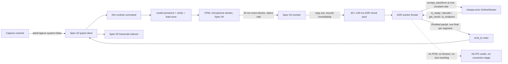

# Spec 06 — Local ASR Microphone Transcription

## 1. Status, Ownership, Base, and Gates

- **Status:** Authored; ready for cross-spec integration review. Not implemented.
- **Implementation owner:** One Spec 06 branch/worktree with one writer.
- **Required base:** One clean integration SHA containing implemented, reviewed, and merged Specs 01, 02, 03, 04, and 05.
- **Allowed implementation predecessors:** Specs 04 and 05, including Spec 04’s real two-platform microphone evidence and Spec 05’s high-capability model/license review. Specs 01–03 are inherited transitively.
- **Blocking precondition:** Spec 05 must have produced an **approved** candidate in `benchmarks/reports/approval.md` with a complete license row. If Spec 05 recorded a blocker instead, Spec 06 does not start; the missing product decision is reported and no model is chosen here.
- **Parallel-safe peers:** Specs 07 and 08 may still be validating in separate worktrees. They own only their platform system-audio directories and their own isolated platform-crate manifests. Spec 06 is the sole Wave 4 writer for the root Cargo manifest/lock, `src-tauri/tauri.conf.json`, runtime command/state files, the shared audio monitor handoff, and the application UI.
- **Successor gate:** Spec 09 may start only after this spec passes real microphone transcription verification on macOS and Windows, merges, and exposes the reviewed recognizer/segment-emission boundary that the second source will reuse.
- **Review level:** High. This spec introduces FFI to a C++ inference runtime, a second bounded audio stage, model lifecycle, and the first transcript text that reaches the user. It owns the product’s central promise: recognized speech is not corrected.

## 2. Goal and User-Visible Result

Make Mistaken transcribe the user’s microphone speech locally, in real time, without correcting it.

- The top bar reports honest model state: `Model missing`, `Loading model…`, `Local • Ready`, or a specific failure.
- **Start Listening** becomes a real action for the microphone source. Activating it opens the selected device, loads the approved local model on first use, and begins recognition.
- While the user speaks, interim text appears in the transcript surface in muted styling and is replaced in place as the recognizer revises its hypothesis.
- When the user stops speaking, the recognizer’s endpoint detection finalizes that utterance: the interim row becomes one immutable final microphone line with no `- ` prefix.
- Deliberately incorrect English stays incorrect. Saying the equivalent of `I actually have went there` must not produce `I actually have gone there` because of anything Mistaken does.
- **Stop** ends capture, drains the recognizer once with a bounded budget, emits at most one closing final, and releases the stream. Start → Stop → Start works repeatedly, and a new session never inherits the previous session’s text.
- `Clear` and `Copy All` keep working against the in-memory transcript exactly as Spec 02 defined.
- System audio remains unavailable and is still rejected; the source bar says so plainly.
- No audio sample, PCM buffer, or model tensor crosses Tauri IPC; no transcript or audio is written to disk or uploaded.

The result must be observed in the actual Tauri desktop application on a supported macOS machine and a supported Windows machine, with networking disabled. A compiling build, a unit-test-only recognizer, or a file-fed transcript is not the result.

## 3. Verified Current Behavior

Verified while authoring this spec:

- `/Users/berat/mistaken` does not exist. `/Users/berat/mistaken-context` is documentation-only and contains Specs 01–05.
- Spec 03 freezes the only four commands (`get_runtime_snapshot`, `list_microphones`, `start_capture`, `stop_capture`), the six event names including `transcript:partial` and `transcript:final`, the `RuntimeError` code set including `model_missing`, `model_load_failed`, `model_unsupported`, and `inference_lagging`, the `ModelStatus` union, monotonic snapshot revisions, and emission only to the `main` window.
- Spec 03 freezes the native audio contract: `AudioSource`, `PcmFormat`, `PcmBlock` with `valid_samples` and a reusable `Box<[f32]>`, `PcmBlockSink` with non-blocking `try_acquire`/`try_submit`, `AudioError`, and `AudioCaptureSession`. PCM is not serializable and never crosses IPC.
- Spec 04 delivers real CPAL microphone capture producing finite mono `f32` 20 ms blocks at the device’s **native** sample rate, a fixed pool of exactly 100 blocks bounding queued PCM to two seconds, an allocation-free callback, and a single monitor thread that validates blocks, detects first signal, and recycles buffers. Spec 04 explicitly defers model-rate conversion to Spec 06 and keeps production **Start Listening** disabled behind a temporary local **Test microphone** action.
- Spec 05 freezes the benchmark, gate, and license discipline that selects the model: fidelity (mistake-preservation ≥ 0.90, false-correction ≤ 0.05) outranks WER; latency, resource, size, and license gates must pass on both reference hosts; the approved runtime tag and every model file’s byte size and SHA-256 are recorded.
- The official Rust binding is the `sherpa-onnx` crate published in lockstep with the C++ project (`sherpa-onnx = "1.13.8"` in the upstream `rust-api-examples/Cargo.toml`, crate source at `sherpa-onnx/rust/sherpa-onnx`). Its documented streaming surface is `OnlineRecognizerConfig` → `OnlineRecognizer::create` → `recognizer.create_stream()` → `stream.accept_waveform(sample_rate, &samples)` → `recognizer.is_ready/decode/get_result/is_endpoint/reset`, with RAII cleanup on drop.
- `OnlineRecognizerConfig` exposes exactly the fields that matter here: `feat_config`, `model_config` (including `transducer.encoder/decoder/joiner`, `tokens`, `provider`, `debug`), `decoding_method`, `max_active_paths`, `enable_endpoint`, `rule1_min_trailing_silence`, `rule2_min_trailing_silence`, `rule3_min_utterance_length`, `hotwords_file`, `hotwords_score`, `ctc_fst_decoder_config`, `rule_fsts`, `rule_fars`, `blank_penalty`, `hotwords_buf`, and `hr` (homophone replacer).
- **The runtime resamples internally.** In `sherpa-onnx/csrc/features.cc` at tag `v1.13.8`, `AcceptWaveform` creates a `LinearResample` when the incoming `sampling_rate` differs from `config_.sampling_rate` and resamples before feature extraction. Spec 06 therefore needs no resampling crate for the microphone path.
- **Changing the input rate mid-stream is fatal.** The same code logs `You changed the input sampling rate!!` and calls `SHERPA_ONNX_EXIT(-1)` when a later `AcceptWaveform` presents a different rate to an existing resampler. A single stream must be fed exactly one constant sample rate for its entire life; a rate change requires a new stream.
- The `sherpa-onnx` crate links statically by default and, when neither `SHERPA_ONNX_LIB_DIR` nor `SHERPA_ONNX_ARCHIVE_DIR` is set, its build script **downloads** a matching prebuilt `-lib` archive from GitHub releases during the build. Published `v1.13.8` archives relevant here, with identities retrieved from the GitHub release API on 2026-09-11:
  - `sherpa-onnx-v1.13.8-osx-arm64-static-lib.tar.bz2` — 20,965,936 bytes, `sha256:9091bf160dc7fdacedbc906b212badf53c2993f4e5277a0e03998e96c31d60da`
  - `sherpa-onnx-v1.13.8-win-x64-static-MT-Release-lib.tar.bz2` — 123,206,268 bytes, `sha256:56ffcf3c454c1f14f7bc9887286cc8143e7e542dc632804e1c447d5f8d534eaf`
- The third-party `sherpa-rs` binding crate is **archived** on GitHub (archived flag set, last push 2026-03-08). It is not a candidate for the shipped recognizer boundary.
- sherpa-onnx is Apache-2.0 and the ONNX Runtime it links is MIT, as recorded by Spec 05.

No implementation report is authoritative. During implementation the merged source, the installed crate documentation for the exact pinned version, the Spec 05 approval record, and real executable behavior become authoritative; any difference from this section is recorded, not assumed away.

## 4. Scope

### In scope

- One local streaming ASR adapter behind an internal recognizer trait, implemented with the official `sherpa-onnx` Rust crate at the exact runtime tag Spec 05 benchmarked and approved.
- Reproducible, offline-capable linking of that runtime through a locally staged, checksum-verified prebuilt archive; no build-time download of an unverified binary.
- Model discovery from an explicit local path, launch-time presence reporting, lazy load on first Start, size and SHA-256 verification against a compiled-in manifest derived from Spec 05’s approval, cached load for the process lifetime, and truthful `ModelStatus` transitions.
- A second bounded stage between Spec 04’s monitor and inference: preallocated fixed-capacity 100 ms native-rate mono chunks, a fixed-size lock-free filled/recycle pair, drop-newest overflow with rate-limited `inference_lagging`, and no growth.
- One dedicated ASR worker thread per active source that owns its `OnlineStream`, feeds the recognizer one constant sample rate, decodes, reads results, detects endpoints, and emits transcript events.
- Stable segment identity and verbatim text emission: partial updates replace in place, endpoint produces exactly one immutable final, and no application-side text transformation beyond whitespace trimming.
- Recognizer configuration that provably disables every text-rewriting feature the runtime offers.
- Enabling production **Start Listening**/**Stop** for the microphone source, removing Spec 04’s temporary **Test microphone** action, and wiring the existing Spec 03 transcript listeners into Spec 02’s reducer.
- Bounded stop and shutdown: `input_finished`, a bounded final drain, one closing final at most, stream destruction, worker join, and repeatable restart with no text carryover.
- Model and inference error mapping onto the frozen `RuntimeError` codes, with actionable UI text.
- Rust and frontend behavior tests, plus real recorded-speech verification on macOS and Windows with networking disabled.

### Out of scope

- System-audio capture, ScreenCaptureKit, WASAPI loopback, a second recognizer session, dual-source ordering, or accepting `systemAudioEnabled: true`. Specs 07–09 own those.
- Re-benchmarking, changing the approved model, evaluating a second model at runtime, model switching UI, or any automatic fallback to a different recognizer or model.
- Model download, updater, remote resource fetch, license acceptance flow, or a model manager screen.
- Voice activity detection, speaker diarization, punctuation models, inverse text normalization, hotwords, homophone replacement, FST rewriting, and any grammar, spelling, casing, or style post-processing.
- Transcript persistence, history, autosave, database, export file, or clipboard changes beyond Spec 02’s write-only Copy All.
- Keyboard shortcuts, auto-follow scrolling, jump-to-latest, Clear confirmation redesign, and accessibility polish beyond keeping the existing contract intact. Spec 11 owns those.
- Broad lifecycle hardening such as slow-inference recovery policy tuning, device hot-plug enumeration, and crash resilience. Spec 10 owns those.
- Packaging, signing, installer size optimization, bundled-resource layout decisions beyond what a development build needs, and release artifacts. Specs 13–15 own those.
- GPU/NPU providers, thread-count auto-tuning, model quantization work, and any per-machine performance heuristic.
- Committing model weights, prebuilt runtime archives, audio fixtures containing user speech, or recognized text into the repository.

## 5. Owned Files and Forbidden Concurrent Files

### Owned during Spec 06 implementation

Subject to the conventions established by merged predecessors, Spec 06 owns:

- `src-tauri/src/asr/**` — recognizer trait, sherpa adapter, model manifest/discovery/verification, chunk stage, ASR worker, segment identity
- `src-tauri/src/audio/microphone/**` — focused edits to the monitor so validated blocks are handed to the ASR stage before recycling; capture, pool, permission, and device logic stay as Spec 04 built them
- `src-tauri/src/commands/runtime.rs` and `src-tauri/src/state/runtime.rs` — model status, recognizer handle, session wiring
- Focused registration edits in `src-tauri/src/lib.rs`, `src-tauri/src/asr/mod.rs`, `src-tauri/src/commands/mod.rs`, `src-tauri/src/state/mod.rs`
- `src-tauri/Cargo.toml`, `src-tauri/Cargo.lock`
- `src-tauri/tauri.conf.json` — only the development resource entry required to locate the model directory
- `src-tauri/resources/models/README.md` and `src-tauri/resources/models/.gitignore`
- `src-tauri/build-notes-asr.md` — the exact local runtime-archive staging and environment-variable procedure for both hosts
- `src/features/audio/**` — replacing the temporary microphone-test control with production capture control
- `src/App.tsx` and focused integration edits in `src/features/transcript/TranscriptWorkspace.tsx`
- Native and frontend tests colocated with the owned modules
- This spec’s implementation-evidence fields

### Consumed unchanged

- `src/types/**`, `src/lib/tauri/**` command and event names, validators, hook, DTOs, revision behavior
- `src/features/transcript/transcript-domain.ts`, the transcript reducer/session hook, the clipboard serializer, and their tests
- `src/index.css`, global tokens, Tailwind and test configuration, `src/main.tsx`
- `src-tauri/src/audio/mod.rs` common native audio contract
- `src-tauri/build.rs`, `src-tauri/permissions/runtime.toml`, `src-tauri/capabilities/main.json`, `src-tauri/Info.plist`
- `benchmarks/**` — read-only. The approval record and license row are inputs; the harness is not modified and is not linked into the application.

### Forbidden concurrent files

- Specs 07 and 08 must not edit any Spec 06-owned path, the root Cargo manifest or lock, `tauri.conf.json`, the shared runtime command/state files, `src-tauri/src/audio/mod.rs`, `src-tauri/src/lib.rs`, or any frontend path. They stay in their platform directories and isolated platform-crate manifests until Spec 09 wiring.
- Spec 06 must not edit `benchmarks/**`, a platform system-audio adapter, `src-tauri/capabilities/**`, `src-tauri/permissions/**`, the frozen common audio contract, the Spec 02 transcript domain, `docs/context/**`, or another spec file from its feature worktree.

If merged predecessors differ from this staged contract, reconcile the canonical specs through the integration owner before editing. Ownership drift is never solved by duplicating a type, command, event, queue, recognizer, or state container.

## 6. Contracts Consumed and Produced

### Consumed from Spec 05

```jsonc
// benchmarks/reports/approval.md → the approved candidate descriptor
{
  "candidateId": "<approved id>",
  "runtime": { "repo": "k2-fsa/sherpa-onnx", "tag": "<approved tag>" },
  "model": { "repo": "...", "revision": "...", "files": [{ "path": "...", "bytes": 0, "sha256": "..." }] },
  "decoding": { "method": "greedy_search", "numThreads": 2, "provider": "cpu" }
}
```

Rules:

- The runtime tag linked by Spec 06 must be **identical** to the approved tag. A different tag invalidates the benchmark and requires a recorded re-benchmark decision before implementation continues.
- The model id, file set, byte sizes, and SHA-256 values are copied verbatim into the compiled-in manifest. Spec 06 selects nothing.
- `decoding.method`, `numThreads`, and `provider` are copied verbatim. Spec 06 does not “improve” them.

### Consumed from Spec 03 and Spec 04

- The four commands, six events, `RuntimeSnapshot`/`ModelStatus`/`AudioSourceStatus` shapes, `RuntimeError` codes, revision monotonicity, and `emit_to("main", …)` behavior.
- `PcmBlock`, `PcmFormat`, `PcmBlockSink`, `AudioCaptureSession`, `AudioError`.
- Spec 04’s microphone backend, 100-block two-second pool, allocation-free callback, monitor thread, `waiting`/`receiving` activity, and error mapping.

### Produced — model manifest and discovery

```rust
pub struct ModelFileSpec {
    pub relative_path: &'static str,
    pub bytes: u64,
    pub sha256_hex: &'static str,
}

pub struct ApprovedModel {
    pub model_id: &'static str,          // matches Spec 05 candidateId
    pub runtime_tag: &'static str,       // matches Spec 05 runtime tag
    pub files: &'static [ModelFileSpec], // encoder, decoder, joiner, tokens, and any declared extras
    pub decoding_method: &'static str,
    pub num_threads: i32,
    pub provider: &'static str,
}
```

Discovery order, evaluated once per process and recorded in the snapshot:

1. `MISTAKEN_MODEL_DIR` when set — development override, must contain the model id directory.
2. The Tauri resource directory entry `resources/models/<model_id>/`.

Rules:

- There is no third location, no user-configurable path, no home-directory search, and no download. A missing directory or file is `model_missing`, and the UI states the exact expected path.
- Presence checking at launch reads metadata only: existence and byte size. It loads nothing, hashes nothing, and allocates no recognizer.
- SHA-256 verification of every declared file happens exactly once, at first load, before `OnlineRecognizer::create`. A mismatch is `model_unsupported`, because the artifact is not the approved one; it is never loaded anyway.
- Model weights are never committed. `src-tauri/resources/models/.gitignore` ignores everything except `README.md` and `.gitignore`; the README records the approved file list, sizes, checksums, source repository/revision, and the required attribution text from Spec 05’s license row.

### Produced — recognizer boundary

```rust
pub struct RecognizedSegment {
    pub text: String,      // verbatim recognizer output, whitespace-trimmed only
    pub is_final: bool,
}

pub trait StreamingRecognizer: Send {
    /// Feed exactly `format.sample_rate_hz`-rate mono samples. The rate must
    /// never change for the life of this recognizer stream.
    fn accept(&mut self, samples: &[f32]) -> Result<(), AsrError>;

    /// Decode all currently available frames and return the latest hypothesis
    /// plus any endpoint-finalized segment, in emission order.
    fn poll(&mut self, out: &mut Vec<RecognizedSegment>) -> Result<(), AsrError>;

    /// Signal end of input and drain within the caller's bounded budget.
    fn finish(&mut self, out: &mut Vec<RecognizedSegment>) -> Result<(), AsrError>;
}

pub trait RecognizerFactory: Send + Sync {
    fn open_stream(&self, format: PcmFormat) -> Result<Box<dyn StreamingRecognizer>, AsrError>;
}

#[derive(Debug, Clone, Copy, PartialEq, Eq)]
pub enum AsrErrorKind {
    ModelMissing,
    ModelUnsupported,
    ModelLoadFailed,
    StreamCreateFailed,
    DecodeFailed,
    Internal,
}
```

Rules:

- `AsrError` is a native error; only the runtime command/state boundary maps it to the frozen serializable `RuntimeError`. The ASR modules never depend on Tauri DTOs or user-facing message text.
- The sherpa adapter is the only production implementation. A deterministic fake implementation exists **only** in tests and can never be selected by a `cfg`, environment variable, or runtime fallback.
- `poll` must not block on the audio thread, allocate per sample, or emit Tauri events; it returns data to its caller.
- Mono is required. `PcmFormat.channels` must be 1; anything else is `Internal`, because Spec 04 already downmixes.

### Produced — frozen recognizer configuration

For a transducer candidate the adapter sets exactly:

```rust
let mut config = OnlineRecognizerConfig::default();
config.model_config.transducer.encoder = Some(encoder_path);
config.model_config.transducer.decoder = Some(decoder_path);
config.model_config.transducer.joiner = Some(joiner_path);
config.model_config.tokens = Some(tokens_path);
config.model_config.provider = Some(approved.provider.to_string());   // "cpu"
config.model_config.num_threads = approved.num_threads;                // 2
config.model_config.debug = false;
config.decoding_method = Some(approved.decoding_method.to_string());   // "greedy_search"
config.enable_endpoint = true;
config.rule1_min_trailing_silence = 2.4;
config.rule2_min_trailing_silence = 1.0;
config.rule3_min_utterance_length = 15.0;
```

And explicitly leaves every rewriting feature off: `hotwords_file: None`, `hotwords_buf: None`, `hotwords_score` unused, `rule_fsts: None`, `rule_fars: None`, `ctc_fst_decoder_config` default/empty, `hr` (homophone replacer) default/empty, `blank_penalty: 0.0`, and `max_active_paths` untouched because greedy decoding ignores it.

Endpoint rationale, and the numbers that must be re-verified rather than assumed:

- `rule2_min_trailing_silence = 1.0` finalizes an utterance about one second after speech stops, which keeps final-after-endpoint latency inside Spec 05’s ≤ 1500 ms p95 gate while avoiding mid-sentence splits.
- `rule3_min_utterance_length = 15.0` forces finalization of a long monologue so a single interim segment cannot grow without bound.
- `config.model_config.num_threads` and the field path for it must be confirmed against the installed crate documentation for the pinned version; if the published field differs, the implementation uses the real field and records it. No guessed field name ships.
- If the approved candidate is not a transducer, the adapter fills exactly that model family’s config fields and records the substitution; it never fills two families.

### Produced — bounded ASR chunk stage

- Chunk duration: exactly **100 ms** of mono samples at the device’s native rate; capacity `ceil(sample_rate_hz / 10)` samples per chunk.
- Pool size: exactly **30** preallocated fixed-capacity `Box<[f32]>` chunks, bounding audio queued for inference to **3 seconds**, independent of Spec 04’s separate 2-second capture pool.
- Both the filled and recycle queues are fixed-capacity lock-free SPSC queues built with the `rtrb` dependency Spec 04 already introduced. No new queue crate is added.
- Everything is allocated before capture starts. After start, the monitor path performs no allocation, no lock, no wait, and no event emission while copying a validated 20 ms block into the current partially filled chunk.
- The monitor copies samples out and **returns the Spec 04 pool buffer immediately**, so inference latency can never stall capture recycling.
- When no recycled chunk is available or the filled queue is full, the newest samples are dropped, an atomic counter increments, and capture continues. Queued audio never grows and older queued audio is never overwritten.
- While drops continue, the ASR worker emits at most one `capture:error` with `inference_lagging` per second, `recoverable: true`, `source: "microphone"`. Capture and transcription keep running so the user can Stop or keep talking.
- A partially filled chunk is submitted at Stop only through the bounded finish path; it is otherwise discarded. Incomplete tails are never zero-padded into the recognizer.

### Produced — segment identity and emission

```ts
// Spec 02 / Spec 03 shape, unchanged
interface TranscriptSegment {
  id: string;
  source: TranscriptSource;   // "microphone" in this spec
  text: string;
  startedAtMs: number;
  endedAtMs?: number;
  isFinal: boolean;
}
```

Rules:

- `id` is `` `mic-${sessionId}-${segmentIndex}` ``: `sessionId` is a per-capture-session counter, `segmentIndex` starts at `0` and increments only after a final is emitted. The same `id` carries every partial of an utterance and its final, so Spec 02 replaces in place instead of appending duplicates.
- Time is **audio time**, not wall clock: `startedAtMs` is the fed-sample count at the utterance’s first non-empty hypothesis divided by the sample rate; `endedAtMs` is the fed-sample count at endpoint. This keeps ordering deterministic under scheduling jitter and is comparable across sources for Spec 09.
- `text` is the recognizer’s text with leading and trailing whitespace removed and internal whitespace collapsed to single spaces. Nothing else: no casing change, no punctuation insertion, no word substitution, no dictionary, no spell or grammar pass, no filler removal, no deduplication of repeated words.
- A partial is emitted only when its trimmed text is non-empty **and** differs from the last emitted partial for that segment, and at most once per **150 ms** per source. Partial storms and empty partials are forbidden.
- Exactly one `transcript:final` per segment id, emitted at endpoint or once during the bounded finish drain, and only when the trimmed text is non-empty. An endpoint with empty text emits nothing and simply resets the recognizer.
- After a final for a segment id, no further event for that id is ever emitted. No partial is emitted once capture status has left `listening`.
- Transcript events carry no confidence, token, timestamp array, model id, device id, or debug field.

## 7. User Flow and Developer Verification Flow

### Normal transcription flow

1. User launches Mistaken. The runtime reports model presence from metadata only: `Local • Ready` when the approved files exist, `Model missing` with the exact expected path otherwise. No model loads, and no microphone permission prompt appears.
2. User selects a microphone, exactly as Spec 04 established.
3. User activates **Start Listening**. Capture status goes `starting`; model status goes `loading` on first use only.
4. The model is verified and loaded once. On success, model status becomes `ready` with the approved model id; the recognizer handle is cached for the process lifetime.
5. The microphone stream starts, a fresh `OnlineStream` opens for the device’s native rate, and status becomes `listening` with microphone `capturing/waiting`.
6. User speaks. Activity becomes `receiving`, then interim text appears in muted styling and is revised in place.
7. User pauses. The endpoint rule fires and the interim row becomes one immutable final microphone line with no prefix.
8. User continues speaking; a new segment id begins at the next index.
9. Deliberately wrong grammar appears exactly as recognized.
10. User activates **Stop**. Status goes `stopping`; input is finished; the drain runs within its bounded budget; at most one closing final is emitted; the stream, worker, and chunk pool are released; status returns to `idle`.
11. User activates **Start Listening** again. The cached model is reused without reloading, a new session id begins, segment indices restart at `0`, and no previous text reappears.
12. `Clear` empties the transcript; `Copy All` copies finals in first-seen order with Spec 02’s formatting.

### Failure flows

- **Model missing:** Start is rejected atomically with `model_missing` before any device, permission, or thread work. The message names the expected directory. No prompt, no partial state, no retry loop.
- **Wrong artifact:** a size or SHA-256 mismatch is `model_unsupported`; the failing file and both digests are shown in the log-free UI message as “model files do not match the approved model”. Nothing loads.
- **Load failure:** a runtime creation error is `model_load_failed` with model status `failed`; capture does not start and no stream, worker, or chunk pool is allocated.
- **Inference lagging:** drops produce the rate-limited `inference_lagging` error while capture continues; the UI shows a non-destructive degradation note near the capture controls.
- **Decode failure:** a recognizer error ends the session with `internal`, releases every resource, and leaves the transcript intact; already-final lines are never deleted by an error.
- **Microphone failures:** permission denial, device loss, unavailability, and overflow keep exactly Spec 04’s behavior and codes.
- **System audio:** `systemAudioEnabled: true` is still rejected with `runtime_unavailable` and `source: "system"` before any side effect.

### Developer verification flow

- Rust tests cover model discovery and verification, chunking math and boundedness, overflow behavior, segment identity and throttling, verbatim text passthrough with a fake recognizer, endpoint-to-final mapping, bounded finish, and session isolation.
- Frontend tests cover model-state presentation, Start/Stop enablement, in-place interim replacement, and that no transcript mutation happens outside the reducer contract.
- A local, ignored WAV fixture path lets the implementer drive the sherpa adapter directly for a one-off adapter smoke check; it is not a committed fixture and not a production code path.
- Real verification is spoken input on real hardware, on both operating systems, with networking disabled, including at least one deliberately ungrammatical sentence per host.

## 8. UI Behavior, States, Tokens, and Accessibility

### Model state, top bar

| State | Text | Token guidance |
|---|---|---|
| `ready` before first load, or loaded | `Local • Ready` | `--text-secondary`, `Cpu` icon |
| `loading` | `Loading model…` | `--text-secondary`, no spinner animation beyond what already exists |
| `listening` | `Local • Listening` | `--state-success` dot plus text label |
| `missing` | `Model missing` | `--state-warning`, actionable detail below |
| `failed` / `unsupported` | `Model failed to load` / `Model not supported` | `--state-error`, `TriangleAlert` |

### Capture controls, bottom bar

- Idle with a usable model: **Start Listening** is enabled and uses `--accent-primary`.
- Idle without a usable model or without a device: **Start Listening** is disabled and the adjacent text states why in one sentence.
- `starting` / `stopping`: the primary action shows a disabled transitional label and no second command can be issued.
- `listening`: the action becomes **Stop**, visually strong but not styled like the destructive `Clear`.
- `Clear` and `Copy All` keep Spec 02’s behavior, including confirmation when finalized content exists.

### Transcript surface

- Interim segment text uses `--text-interim`; finalized text uses `--text-primary`. Microphone lines carry no prefix.
- The interim row is replaced in place, keeping its segment identity, so the view does not append a new row per revision.
- Paragraph spacing between finals stays as Spec 02 defined; no bubble, avatar, gradient, or per-source color is introduced.

### Source bar

- The microphone selector and refresh stay as Spec 04 built them. The temporary **Test microphone** action is removed, and its explanatory copy is replaced by honest text stating that speech is transcribed locally on this device and nothing is uploaded or recorded to disk.
- System audio still shows an unavailable state.

### Accessibility

- Model and capture state are conveyed by text plus icon, never by color alone.
- Interim text must remain readable at `--text-interim` against `--bg-base`; the implementation verifies the contrast rather than assuming it.
- Interim updates are announced politely at most once per throttle window, or not announced at all if a polite live region would flood a screen reader; the chosen behavior is recorded, and finals are announced.
- The primary action keeps an accessible name reflecting its current function (`Start Listening` / `Stop`), keyboard focus stays visible, and disabled reasons are programmatically associated with the control.
- No new animation is introduced, so reduced-motion behavior is unchanged.

## 9. Frontend → Tauri IPC → Rust / Audio / ASR Data Flow



### Start flow

1. The thin command validates the request and rejects system audio before any side effect.
2. Under the state lock it rejects an active transition/session, allocates a new operation generation and session id, commits `starting`, releases the lock, and emits the full snapshot.
3. Model presence and verification run off the lock. First use also performs the single load; model status transitions emit `asr:model-status` with the complete snapshot.
4. Microphone permission and device work follow exactly Spec 04’s sequence.
5. The chunk pool and ASR worker are created, then the recognizer stream is opened for the negotiated native rate, and only then does the capture stream play.
6. `listening` is committed only after the stream plays with a live recognizer behind it. Any failure tears down everything allocated so far and returns one specific `RuntimeError`.

### Steady-state flow

- The audio callback behavior is unchanged from Spec 04: allocation-free, non-blocking, drop-newest.
- The monitor validates a block, copies its valid prefix into the current ASR chunk, recycles the pool buffer, and submits a full chunk without waiting.
- The ASR worker parks with a bounded timeout, is unparked on chunk arrival, stop, or error, and never busy-spins. It feeds `accept_waveform` with the one constant session rate, decodes while ready, reads the hypothesis, and detects endpoints.
- Event emission happens on the worker, outside any state lock, and is limited to throttled partials, one final per segment, rate-limited `inference_lagging`, and terminal `capture:error`.
- No state mutation holds the runtime mutex while decoding, feeding audio, opening or dropping a stream, joining a thread, hashing a file, or emitting an event.

### Stop and shutdown flow

1. Stop commits `stopping`, removes the session controller from managed state, releases the lock, and signals the worker.
2. The worker submits any partially filled chunk, calls `finish`, and drains decoding within a bounded budget of **300 ms**; it emits at most one closing non-empty final.
3. The recognizer stream is dropped, the chunk pool is released, the worker exits, and the capture stream is torn down by Spec 04’s path.
4. The command commits `idle` and resolves. Total teardown stays within the one-second budget Spec 04 established.
5. Application exit runs the same idempotent native path, including stream and worker release, without depending on React cleanup. The loaded model is dropped exactly once at process teardown.

## 10. Platform, Permissions, Offline, Privacy, and Fallback

### Build and linking

- The `sherpa-onnx` crate is pinned to the approved exact version with `default-features = false` and the `static` feature, so the shipped binary carries no separate recognizer shared library to install.
- Because the crate’s build script downloads a prebuilt archive when no override is set, Mistaken builds **must** set `SHERPA_ONNX_ARCHIVE_DIR` (or `SHERPA_ONNX_LIB_DIR`) to a locally staged directory whose archive was verified against the recorded size and SHA-256. `src-tauri/build-notes-asr.md` records the exact archive name, size, digest, staging path, and command per host.
- An unverified build-time download of an inference binary is treated as a supply-chain defect, not a convenience.
- Both hosts must build from a clean target directory at least once with the staged archive and with networking disabled, proving the build needs no network.

### macOS

- No new usage description, entitlement, or capability. Microphone authorization stays exactly as Spec 04 implemented it, requested only when the user starts capture.
- Record chip, core count, RAM, macOS version, negotiated device rate, model load time, peak RSS, and observed transcription behavior.

### Windows

- No new capability or driver. Desktop microphone privacy behavior stays as Spec 04 implemented it.
- Record CPU, RAM, Windows edition/version/build, negotiated device rate, model load time, peak RSS, and observed transcription behavior.

### Tauri permissions

- No new command, no new event, no capability change, no CSP change. The frontend still cannot emit events, read the clipboard, touch the filesystem, open a shell, or make HTTP requests.
- Model files are read by Rust only. No model path, file handle, or byte ever crosses IPC.

### Offline and privacy

- The complete flow — launch, model presence, start, speak, interim, final, stop, restart, clear, copy — runs with networking disabled on both hosts.
- No socket, DNS lookup, HTTP request, API key, account, backend, analytics, telemetry, crash upload, or update check exists at runtime. `model_config.debug` is `false` in production.
- PCM lives only in the two fixed native pools and is discarded on consumption, stop, error, or exit. No WAV, raw PCM, feature file, or model cache is written.
- Recognized text lives only in the process and in Spec 02’s in-memory transcript. **No recognized text, partial hypothesis, device id, or model path is ever logged**, at any level, including debug builds. Evidence records counts, durations, and statuses, never transcript content.
- Verification evidence uses scripted sentences chosen for the purpose, not private conversation, and stores no audio.

### Fallback rules

- Missing, mismatched, or unloadable model: an explicit error state. Never a different model, a cloud API, a browser speech API, a silent downgrade to “no transcription while capture appears to work”, or a fake success.
- Inference too slow: bounded drop plus honest degradation notice. Never unbounded buffering, never automatic thread or quality changes, never silently skipping finals.
- Recognizer error: end the session cleanly and say so. Never restart inference in a loop.
- Unsupported device format: Spec 04’s structured capture failure. Never force a rate onto an existing stream, because a mid-stream rate change terminates the process inside the runtime.

## 11. Resource Lifecycle, Bounded Buffering, Errors, and Recovery

### Resource inventory

Process-wide, at most one loaded `OnlineRecognizer` (the approved model), created lazily and dropped at process exit.

Per active session, at most:

- one CPAL stream, device, and Spec 04 100-block pool
- one Spec 04 monitor thread
- one 30-chunk ASR pool with one filled and one recycle SPSC queue
- one ASR worker thread with one `OnlineStream`
- one stop flag/generation, atomic drop counters, and a managed session controller with join handles

It owns no second recognizer, no VAD session, no model cache file, no transcript store, no timer loop, no file handle, and no socket.

### Bounded buffering summary

| Stage | Bound | Overflow behavior |
|---|---|---|
| Capture pool (Spec 04) | 100 × 20 ms = 2 s | drop newest frames, count, `audio_queue_overflow` |
| ASR chunk pool (Spec 06) | 30 × 100 ms = 3 s | drop newest samples, count, rate-limited `inference_lagging` |
| Recognizer internal state | one stream, reset at each endpoint | forced finalization by `rule3_min_utterance_length` |
| Transcript | in-memory, immutable finals | Spec 02 `Clear` only |

Total audio retained in memory never exceeds 5 seconds across both stages, and neither pool can grow.

### State transitions

```text
model: unknown -> missing
model: unknown -> ready(presence) -> loading -> ready(loaded)
model: loading -> failed | unsupported
capture: idle -> starting -> listening -> stopping -> idle
capture: idle -> starting -> error        # model or device failure
capture: listening -> error               # decode or device failure
capture: error -> starting                # after cleanup and explicit retry
capture: starting -> stopping -> idle     # cancellation before play
```

- A second Start during any transition returns `capture_already_active` with no mutation. Stop from idle returns `capture_not_active`.
- Stop during `starting` cancels the generation; a late model load or permission grant can never install a stream or a worker afterwards.
- A failed load does not poison the process: after the user fixes the files, an explicit retry re-verifies and re-loads.

### Error mapping

- model directory or file absent → `model_missing`
- size or SHA-256 mismatch against the approved manifest → `model_unsupported`
- recognizer creation failure → `model_load_failed`
- stream creation failure for a valid model → `capture_start_failed`
- ASR chunk pool saturation → `inference_lagging` (capture continues)
- decode error, non-mono format, sample-rate invariant violation, or broken segment/index invariant → `internal`, session ends and resources release
- every microphone, device, permission, and capture error keeps Spec 04’s exact code

Each error carries reviewed `recoverable` and, where applicable, `source: "microphone"`. The UI branches on codes, never on message text.

### Recovery

- Model errors leave no session and allow explicit retry after the user fixes the files.
- Decode or device errors release everything before the next Start; the existing transcript is preserved.
- Lagging does not auto-resize, auto-retune, or auto-restart; the user may keep going or Stop.
- Restart always creates a fresh session id, segment index `0`, a fresh `OnlineStream`, and fresh pools, and reuses only the loaded model.

## 12. Numbered Measurable Acceptance Criteria

1. **Predecessors, approval, and isolation — all hosts:** Spec 06 starts from one recorded SHA containing merged Specs 01–05, in its own worktree, with Spec 05’s approval record present; only declared paths change; Specs 07/08 remain in separate worktrees.
2. **Approved artifacts only — both hosts:** The linked runtime tag equals Spec 05’s approved tag, and the compiled-in manifest’s model id, file list, byte sizes, and SHA-256 values equal the approval record exactly; no second model, candidate list, or selection switch exists in the application.
3. **Reproducible offline linking — both hosts:** With `SHERPA_ONNX_ARCHIVE_DIR` pointing at the locally staged, checksum-verified archive, a clean build succeeds with networking disabled on macOS arm64 and Windows x64; the recorded archive name, size, and digest match the staged files.
4. **Frozen contract reuse — platform-neutral:** No command, event name, payload field, `AudioSource`, `PcmBlock`, transcript type, runtime state container, or Tauri registry is duplicated or altered; the transcript payloads remain exactly Spec 03’s shapes.
5. **Honest model presence — both hosts:** With the model absent, launch reports `Model missing` with the exact expected path, Start is rejected with `model_missing` before any device or permission work, and nothing loads; with the model present, launch reports a ready state and still loads nothing until first Start.
6. **Verification before load — both hosts plus Rust tests:** A deliberately truncated or altered model file produces `model_unsupported` naming the file, with no recognizer created; the unmodified set loads exactly once per process and the second Start performs no reload.
7. **Real streaming transcription — real macOS and Windows:** Speaking into the selected microphone produces interim text within the measured latency budget and one immutable final per utterance, with no prefix on microphone lines and no duplicate final for the same utterance.
8. **Mistake preservation in the app — real macOS and Windows:** For at least five scripted ungrammatical sentences per host, including `have went` and `didn't knew` forms, the finalized transcript preserves the ungrammatical wording; no application code path rewrites it.
9. **No correction stage exists — review plus Rust tests:** Inspection proves hotwords, homophone replacement, FST rules, ITN, punctuation models, spell/grammar libraries, and word-substitution tables are absent or explicitly disabled in the shipped config; a fake-recognizer test proves emitted text equals recognizer text except whitespace trimming and collapsing.
10. **Segment identity and in-place replacement — Rust and frontend tests plus real app:** Every partial of an utterance carries the same id as its final, partials are throttled to at most one per 150 ms and never empty, exactly one final per id is emitted, no event follows a final for that id, and the UI replaces the interim row instead of appending.
11. **Audio-time correctness — Rust tests:** `startedAtMs` and `endedAtMs` derive from fed-sample counts at the session rate, are monotonically non-decreasing within a session, and are independent of wall-clock jitter.
12. **Constant sample rate per stream — Rust tests plus review:** A stream is fed exactly one sample rate for its entire life; a device-rate change forces a new stream; a test proves the adapter rejects a differing rate at its own boundary rather than letting the runtime terminate the process.
13. **Bounded ASR stage — Rust tests plus review:** Exactly 30 preallocated 100 ms chunks bound queued inference audio to 3 seconds; the monitor copies out and recycles the capture buffer immediately; saturation drops newest samples, counts them, emits at most one `inference_lagging` per second, keeps capture alive, and never allocates or grows.
14. **No PCM or tensor over IPC — real app:** Event interception during a real session finds only the six frozen event names with their frozen payloads; no sample array, level series, per-chunk event, model path, or device id appears in any payload.
15. **Start → Stop → Start — real macOS and Windows:** Stop finishes input, drains within 300 ms, emits at most one closing final, releases stream/worker/pools within the one-second teardown budget, clears the OS microphone indicator, and the next Start reuses the loaded model with session-isolated text and segment index `0`.
16. **Failure and cancellation behavior — Rust/frontend tests plus real hosts:** Duplicate Start, Stop during starting, Stop while idle, missing model, mismatched model, load failure, decode failure, lagging, permission denial, and device loss produce the exact mapped codes and states, with no stale late start, deadlock, panic, leaked thread, or deleted final line.
17. **Performance on both reference hosts:** Measured single-stream real-time factor, first-partial latency, final-after-endpoint latency, peak RSS, and CPU stay inside Spec 05’s approved gates with this spec’s endpoint configuration; deviations are recorded and resolved before merge rather than explained away.
18. **Offline, privacy, and no persistence — both hosts:** The complete flow works with networking disabled; inspection finds zero network code paths, zero audio or transcript writes to disk or browser storage, and zero logging of recognized text, device ids, or model paths.
19. **Cutover completeness — both hosts:** Spec 04’s temporary **Test microphone** action, its copy, and its dead code paths are gone; production Start/Stop is the single capture action; no duplicate capture control, no orphaned PCM-only diagnostic, and no disabled-transcription copy remains.
20. **Build, tests, launch, shutdown, relaunch — both targets:** Typecheck, lint, frontend tests and build, `cargo fmt --check`, `cargo check`, `cargo clippy --all-targets --all-features -- -D warnings`, `cargo test`, and real Tauri launches pass on both hosts; closing during active transcription releases microphone, worker, stream, and model, the process exits, and relaunch starts idle with an empty transcript.
21. **High-capability review and evidence — integration:** Review covers FFI safety and lifetimes, the fatal mid-stream rate-change hazard, real-time safety of the monitor handoff, queue math, model verification, state races, cancellation, privacy, accessibility, absence of any correction stage, and Spec 09 consumption; every High/Medium finding is fixed and re-verified, and exact roots, branches, SHAs, hosts, devices, commands, and measurements are recorded.

## 13. Acceptance Criterion → Verification/Test Mapping

| AC | Verification or permanent test | Evidence to record |
|---|---|---|
| 1 | Inspect base SHA, worktree list, approval record, and final changed-path report | Root, branch, base SHA, approval id, owned-path diff |
| 2 | Diff compiled-in manifest against `approval.md`; search for a second model or selector | Model id, tag, per-file bytes/digests, zero-alternative result |
| 3 | Clean build on each host with staged archive and networking disabled | Archive name/size/digest, env var used, build commands and exit codes |
| 4 | Compile/import inspection plus duplicate-symbol and event-name search | Consumed symbols, zero duplicate result |
| 5 | Launch and Start with the model directory absent, then present | Displayed text, expected path, rejection code, zero-load proof |
| 6 | Alter one model file, then restore; run two Starts in one process | Error code and named file, single-load observation |
| 7 | Speak scripted sentences on each host; observe interim and final rows | Utterance count, interim/final observations, duplicate check |
| 8 | Speak at least five scripted ungrammatical sentences per host | The preserved wordings, per host, and reviewer confirmation |
| 9 | Inspect shipped config and dependency tree; run fake-recognizer passthrough test | Config field values, dependency scan result, test name/result |
| 10 | Rust emission tests plus frontend in-place replacement test plus real session | Id patterns, throttle interval, one-final assertion, UI observation |
| 11 | Rust audio-time tests with synthetic fed-sample sequences | Computed values and monotonicity assertions |
| 12 | Rust adapter boundary test with a changed rate; code review of stream creation | Rejection behavior, new-stream path, no process-exit path reachable |
| 13 | Deterministic saturation test with a tiny pool; review of the monitor handoff; memory math | 30 × 100 ms math, dropped counts, one-error-per-second observation, no-allocation finding |
| 14 | Intercept and inspect all Tauri event payloads during a real session | Event names, payload field lists, absence of PCM/ids |
| 15 | Repeat Start/Stop cycles on each host; time teardown; inspect next session | Transition trace, drain duration, teardown time, index reset, indicator clear |
| 16 | Rust state/error tests and frontend error-state tests with deferred completions | Exact codes/states/counts, no stale completion, no leak |
| 17 | Measure RTF, latencies, RSS, and CPU on both hosts during real sessions | Measured values against each Spec 05 gate, per host |
| 18 | Run full flow with networking disabled; inspect sockets, storage, and all log output | Disable method, zero-network/zero-write/zero-text-log findings |
| 19 | Search for the removed test action and its copy; exercise the single capture control | Removed symbols/strings, UI observation |
| 20 | Run the full check set and launch/close/relaunch smoke on each host | Exact commands, exits, target triples, process and relaunch observations |
| 21 | High-capability review of the finished diff against Specs 03–09 contracts | Findings, dispositions, and complete evidence record |

Permanent tests protect model verification, chunk boundedness, segment identity and throttling, verbatim passthrough, endpoint-to-final mapping, session isolation, sample-rate invariants, and mapped error behavior. They must not assert function forwarding, mock echoes, constant existence, source text, or bare non-throwing behavior. Real spoken transcription, mistake preservation, performance, teardown, and offline evidence cannot be replaced by mocks.

## 14. Ordered Implementation Plan

1. After Specs 04 and 05 merge and their reviews close, create the Spec 06 worktree from the recorded Wave 4 base. Record root, branch, and base; confirm Specs 07/08 own disjoint worktrees and paths.
2. Re-read the canonical context, Specs 01–10, Spec 05’s approval and license record, the current source, and the installed documentation for the exact pinned `sherpa-onnx` crate version. Run baseline checks.
3. Stage and verify the pinned runtime archive on both hosts, write `build-notes-asr.md`, and prove a trivial link-only build works offline with `SHERPA_ONNX_ARCHIVE_DIR` before writing feature code.
4. Add the exact Cargo dependency and feature set, commit the lock change, and record resolved versions and licenses.
5. Implement the model manifest, discovery, presence check, and size plus SHA-256 verification, with tests including a corrupted-file case.
6. Implement the recognizer trait, error type, and the sherpa adapter: config construction with every rewriting feature explicitly off, stream creation for one fixed rate, feed, decode, hypothesis read, endpoint detection, reset, and bounded finish.
7. Implement the bounded 30-chunk 100 ms stage with `rtrb` filled/recycle queues, drop-newest overflow counters, and deterministic saturation tests.
8. Implement the ASR worker: park/unpark, chunk draining, segment identity, audio-time accounting, partial throttling, single-final emission, rate-limited lagging errors, terminal error handling, and bounded teardown.
9. Make the focused Spec 04 monitor change: copy the validated block into the current ASR chunk and recycle the capture buffer immediately, with no allocation, lock, wait, or emission added to that path.
10. Wire model status and the recognizer handle into runtime state and the thin commands, preserving Spec 03’s revisions, emission-after-unlock discipline, and atomic system-audio rejection.
11. Enable production Start Listening/Stop for the microphone, remove Spec 04’s temporary test action and its copy, and wire the existing transcript listeners into Spec 02’s reducer without touching reducer semantics.
12. Add the Rust and frontend behavior tests mapped to the acceptance criteria. Do not add a production fake recognizer, a debug recording path, a text-logging path, or a test-only command.
13. Run focused checks, then the real macOS flow: presence, missing-model, mismatch, load, speak, interim, final, ungrammatical preservation, lagging, stop, restart, active-close, relaunch — with networking disabled. Record sanitized evidence.
14. Repeat step 13 on Windows and record its own evidence; no host’s result substitutes for the other’s.
15. Measure RTF, latencies, peak RSS, and CPU on both hosts and compare against Spec 05’s gates. Fix real regressions; never re-tune a gate here.
16. Review the whole diff for FFI lifetimes and drop order, the fatal rate-change hazard, real-time safety, queue bounds, state races, late-completion cancellation, privacy and logging, accessibility, cutover completeness, and absence of any correction stage. Fix every High/Medium finding and re-run the affected proof.
17. Remove temporary probes, local WAV smoke fixtures, instrumentation, and staged scratch files; verify no model weight, archive, or audio file is staged for commit.
18. Update only this spec’s evidence fields, create the focused local commit unless directed otherwise, report exact roots, branches, base and final SHAs, hosts, and both-platform evidence, and do not push unless requested.

## 15. Risks, Rollback, Cleanup, and Preservation Rules

### Risks and mitigations

- **Process termination on rate change:** the runtime calls `SHERPA_ONNX_EXIT(-1)` if a stream sees a new input sample rate. Fix one rate per stream at creation, assert it on every feed at the adapter boundary, and create a new stream whenever the device format changes.
- **Silent correction:** hotwords, homophone replacement, FST rules, ITN, or a well-meaning “tidy the text” helper would destroy the product’s purpose. Disable every such feature explicitly, forbid text transformation beyond whitespace handling, and test passthrough byte-for-byte.
- **Capture starvation by inference:** decoding inside the monitor would delay buffer recycling and cause audio drops. Copy out and recycle immediately, then decode on a separate bounded stage.
- **Unbounded memory under load:** slow inference could queue audio forever. Fix the ASR stage at 30 × 100 ms, drop newest, count, and report.
- **FFI lifetime and drop-order bugs:** a stream outliving its recognizer, or double drop, would crash. Keep the model in process state, keep the stream owned by exactly one worker, and prove drop order in review and in Start/Stop/close tests.
- **Thread-safety assumptions about the binding:** whether the recognizer type is `Sync` must be read from the installed documentation, not assumed. Until proven, the worker owns its stream exclusively and shared access is avoided.
- **Supply-chain risk from build-time download:** the default build fetches a prebuilt inference archive. Always stage locally and verify size plus SHA-256; treat an unverified download as a defect.
- **Wrong or tampered model files:** loading whatever is on disk would break the approved-artifact invariant. Verify every file’s size and digest before load and refuse on mismatch.
- **Transcript text leaking into logs:** a debug log line would persist private speech. Forbid logging recognized text, device ids, and model paths at every level, and grep the diff for it.
- **Endpoint tuning drift:** overly aggressive finalization splits sentences; overly lax finalization delays finals and grows interim state. Freeze the three rule values here, verify against Spec 05’s latency gates, and change them only with recorded measurements.
- **Benchmark invalidation:** linking a different runtime tag than the benchmarked one would make the approval meaningless. Require tag equality and record a re-benchmark decision otherwise.
- **Half cutover:** leaving Spec 04’s test action beside real transcription would confuse users and duplicate capture paths. Remove it as part of this spec.
- **Wave 4 file conflicts:** root manifests, `tauri.conf.json`, runtime state, and the UI cannot have two writers. Spec 06 is the sole Wave 4 writer for those; Specs 07/08 stay in platform paths.

### Rollback

- Before merge, abandon the Spec 06 branch/worktree or revert its focused commit.
- After merge and before Spec 09, reverting Spec 06 must restore Spec 04’s PCM-only microphone behavior, including its test action and disabled production transcription, and must remove the ASR modules, model manifest, resource entry, and dependency additions while preserving Specs 01–05.
- Once Spec 09 consumes the recognizer and emission boundary, use a coordinated forward fix or revert dependent commits in reverse order; never leave the dual-source orchestrator pointing at a removed recognizer.
- Never reset, clean, or delete unrelated user work, another worktree, the staged model directory, the staged runtime archive, or `/Users/berat/mistaken-context`.

### Required cleanup

- Remove local WAV smoke fixtures, adapter scratch binaries, allocation or timing instrumentation, debug flags, verbose runtime logging, and any temporary text dump.
- Remove Spec 04’s temporary test action, its strings, its dead state, and the copy that said transcription was unavailable.
- Remove unused dependencies, features, imports, and any leftover placeholder for a second source or second model.
- Verify no model weight, runtime archive, audio file, or recognized-text artifact is staged; verify the models directory ignore rules actually apply.

### Preservation rules

- Preserve Spec 03’s command, event, error, revision, and payload contracts, and Spec 04’s microphone capture, pool, permission, activity, teardown, and error behavior.
- Preserve Spec 02’s segment identity semantics, immutable finals, source formatting, Clear, and write-only Copy All.
- Preserve microphone/system separation: this spec transcribes one source and still rejects the other.
- Preserve local-only processing, no account, no backend, no database, no transcript or audio persistence, no upload, no cloud fallback, and no grammar correction.
- Preserve least-privilege Tauri capabilities, the CSP, and clipboard-write-only behavior.
- Preserve the user’s OS permission choices and the approved model artifacts; verification never rewrites either.

## 16. Definition of Done and Evidence Record

Spec 06 is done only when real Mistaken builds on macOS and Windows link the approved runtime from a locally verified archive, report model state honestly, load the approved model once after verification, transcribe real microphone speech into throttled interim text and immutable finals with stable segment identity, preserve deliberately incorrect English exactly as recognized, keep queued audio bounded at 2 + 3 seconds with honest degradation under load, stop and restart without leaks or text carryover, satisfy Spec 05’s performance gates, and pass every acceptance criterion with networking disabled — without a second model, a correction stage, transcript persistence, PCM over IPC, logged speech, or fake success.

### Required implementation evidence

Fill during implementation; do not predeclare success:

- **Implementation status:** Not implemented
- **Canonical repository root:** Pending Spec 01
- **Worktree root / branch / base SHA / implementation commit SHA:** Pending
- **Changed paths:** Pending
- **Spec 05 approval id, approved model id, and runtime tag used:** Pending
- **Staged runtime archive name, size, SHA-256, and staging path per host:** Pending
- **Resolved dependency versions, features, and licenses:** Pending
- **Model file list with recomputed sizes and SHA-256:** Pending
- **macOS hardware/architecture/version and microphone identity:** Pending
- **Windows hardware/architecture/edition/version/build and microphone identity:** Pending
- **Negotiated device rates, chunk capacities, and pool memory per host:** Pending
- **Model load time and single-load proof per host:** Pending
- **Interim/final observations and scripted ungrammatical sentences preserved, per host:** Pending
- **Measured RTF, first-partial latency, final-after-endpoint latency, peak RSS, CPU vs Spec 05 gates:** Pending
- **Lagging/overflow observations and emitted error counts:** Pending
- **Start → Stop → Start observations, drain and teardown durations, session isolation proof:** Pending
- **Active-close and relaunch observations:** Pending
- **Event payload inspection result:** Pending
- **Offline build and offline runtime verification method and result per host:** Pending
- **Privacy inspection (no disk writes, no text logging, nothing staged):** Pending
- **Cutover verification (test action removed, single capture control):** Pending
- **Frontend targeted test command/result:** Pending
- **Rust targeted test command/result:** Pending
- **Typecheck/lint/frontend build results:** Pending
- **Cargo format/check/clippy/test and target-build results:** Pending
- **High-capability review findings and dispositions:** Pending
- **Final Git status:** Pending

### Authoring evidence and sources

- Reviewed `/Users/berat/mistaken-context/project-overview.md`, `architecture.md`, `ui-context.md`, `code-standards.md`, `ai-workflow-rules.md`, `progress-tracker.md`, `spec-plan.md`, and Specs 01–05.
- Verified the application repository is absent and the context bundle remains documentation-only.
- Primary sources retrieved 2026-09-11:
  - [Official `sherpa-onnx` Rust crate documentation (1.13.8): setup, `OnlineRecognizer` streaming flow, static-vs-shared linking, `SHERPA_ONNX_LIB_DIR` / `SHERPA_ONNX_ARCHIVE_DIR`](https://docs.rs/sherpa-onnx/latest/sherpa_onnx/)
  - [`OnlineRecognizerConfig` field list, including endpoint rules, hotwords, `rule_fsts`, `blank_penalty`, and `hr`](https://docs.rs/sherpa-onnx/latest/sherpa_onnx/struct.OnlineRecognizerConfig.html)
  - [Upstream `rust-api-examples/Cargo.toml` at `v1.13.8` pinning `sherpa-onnx = "1.13.8"`](https://github.com/k2-fsa/sherpa-onnx/blob/v1.13.8/rust-api-examples/Cargo.toml)
  - [Upstream `streaming_zipformer_microphone.rs` example: feed native rate, `is_ready`/`decode`/`get_result`/`is_endpoint`/`reset` loop](https://github.com/k2-fsa/sherpa-onnx/blob/v1.13.8/rust-api-examples/examples/streaming_zipformer_microphone.rs)
  - [`sherpa-onnx/csrc/features.cc` at `v1.13.8`: internal `LinearResample` creation and the fatal `SHERPA_ONNX_EXIT(-1)` on a mid-stream sample-rate change](https://github.com/k2-fsa/sherpa-onnx/blob/v1.13.8/sherpa-onnx/csrc/features.cc)
  - [sherpa-onnx `v1.13.8` release assets: static `-lib` archive names, sizes, and SHA-256 digests](https://api.github.com/repos/k2-fsa/sherpa-onnx/releases/latest)
  - [sherpa-onnx LICENSE (Apache-2.0)](https://raw.githubusercontent.com/k2-fsa/sherpa-onnx/master/LICENSE)
  - [`thewh1teagle/sherpa-rs` repository metadata showing the crate is archived](https://api.github.com/repos/thewh1teagle/sherpa-rs)

Authoring this file is not implementation evidence. Every pending field remains pending until Spec 06 is applied in the real repository and real spoken transcription is observed on both hosts.
