# Spec 07 — macOS System-Audio Adapter (ScreenCaptureKit)

## 1. Status, Ownership, Base, and Gates

- **Status:** Authored; ready for cross-spec integration review. Not implemented.
- **Implementation owner:** One Spec 07 branch/worktree with one writer, on real macOS hardware.
- **Required base:** One clean integration SHA containing implemented, reviewed, and merged Specs 01, 02, and 03. Spec 03’s frozen common audio/error contract is the input this spec is designed against.
- **Allowed implementation predecessors:** Spec 03 (transitively Spec 01). Specs 04, 05, and 06 are **not** prerequisites; this spec neither consumes microphone capture nor touches ASR.
- **Parallel-safe peers:** Specs 04, 05, and 08 in separate worktrees from the same wave SHA. Ownership is disjoint by construction: Spec 07 writes only its own standalone macOS crate and that crate’s documentation.
- **Yielded shared files:** This spec requires two shared-file changes it must **not** make: the macOS minimum system version in `src-tauri/tauri.conf.json` and any Tauri/Rust wiring that registers the adapter. Both are recorded as requirements and handed to the integration owner; Spec 09 performs the wiring.
- **Successor gate:** Spec 09 may start only after this spec passes real system-audio verification on macOS, high-capability review, and merge, and after Spec 08 does the same for Windows.
- **Review level:** High. This spec contains Objective-C FFI, a dispatch-queue callback on a media path, a privacy-sensitive TCC permission, and the second independent audio source.

## 2. Goal and Measurable Result

Deliver a standalone, verified macOS system-audio capture adapter that produces bounded mono `f32` PCM from whatever the machine is playing, with honest permission behavior, and nothing else.

Measurable results, all observed on real macOS hardware:

1. A probe binary in the adapter crate starts a ScreenCaptureKit audio-only stream and reports, in aggregate form, that real PCM arrives while the machine plays known audio, and that it stops arriving when playback stops.
2. The adapter emits complete 20 ms mono `f32` blocks at a single known sample rate, derived from the stream’s actual audio format description rather than from an assumption.
3. With screen-recording permission absent, the adapter reports a specific permission error, allocates no stream, and never claims success; with permission granted, capture works.
4. The adapter registers **only** an audio stream output. No frame, pixel buffer, image, or screenshot is ever requested, read, copied, or written, even though the OS permission is named “Screen Recording”.
5. Start → Stop → Start works repeatedly with no leaked stream, queue, thread, or Objective-C object, and shutdown is deterministic.
6. Mistaken’s own process audio is excluded from the capture by configuration, so the app can never feed its own output back into transcription.
7. The adapter compiles and runs with no dependency on the Mistaken application crate, no Tauri dependency, no ASR dependency, and no network access.

A compiling crate with no real playback capture is not a result. Screenshot-free, permission-honest, bounded PCM on a real Mac is the result.

## 3. Verified Current Behavior

Verified while authoring this spec:

- `/Users/berat/mistaken` does not exist. `/Users/berat/mistaken-context` is documentation-only and contains Specs 01–06.
- Spec 03 freezes the native audio contract this adapter is designed to feed: `AudioSource`, `PcmFormat`, `PcmBlock` with `valid_samples` and reusable buffers, non-blocking `PcmBlockSink::try_acquire`/`try_submit`, `AudioError`/`AudioErrorKind`, and `AudioCaptureSession`. It also freezes `RuntimeError` codes including `system_audio_permission_denied`, `system_audio_unavailable`, `capture_start_failed`, `capture_stop_failed`, `audio_queue_overflow`, and `internal`.
- Spec 04 requires that Specs 07 and 08 build their platform adapters as **isolated crates with their own manifests** and forbids them from editing `src-tauri/Cargo.toml`, `src-tauri/Cargo.lock`, the shared runtime command/state files, `src-tauri/src/audio/mod.rs`, `src-tauri/src/lib.rs`, `src-tauri/Info.plist`, `src-tauri/tauri.conf.json`, or any frontend path. Spec 06 restates the same boundary for Wave 4.
- Spec 04 sets the reference numbers this adapter mirrors so the two sources stay symmetric for Spec 09: mono `f32` in `[-1.0, 1.0]`, exactly 20 ms blocks, a fixed 100-block two-second bound on queued PCM, drop-newest overflow, allocation-free callbacks, and one-second teardown.
- ScreenCaptureKit facts, from Apple’s documentation retrieved 2026-09-11:
  - `SCStreamConfiguration` is available from **macOS 12.3**, but every audio property is available from **macOS 13.0**: `capturesAudio`, `sampleRate`, `channelCount`, and `excludesCurrentProcessAudio`.
  - `capturesAudio` defaults to `false`; audio must be requested explicitly.
  - `sampleRate` supports exactly `8000`, `16000`, `24000`, and `48000`; an unspecified or unsupported value yields a default of 48 kHz.
  - `excludesCurrentProcessAudio` defaults to `false`; setting it to `true` excludes the capturing app’s own audio.
- `SCShareableContent.getShareableContentWithCompletionHandler` is the TCC-gated content query. The sibling `getCurrentProcessShareableContentWithCompletionHandler` explicitly returns *redacted* content available **without user consent via TCC**, so it cannot be used to infer that capture is permitted.
- Rust binding availability, verified on docs.rs for the exact published versions:
  - `objc2-screen-capture-kit` 0.3.2 exposes `SCStream::initWithFilter_configuration_delegate`, `addStreamOutput_type_sampleHandlerQueue_error` (requires the `dispatch2` feature and a `dispatch2::DispatchQueue`), `removeStreamOutput_type_error`, `startCaptureWithCompletionHandler` and `stopCaptureWithCompletionHandler` (require `block2`), the `SCStreamOutput` and `SCStreamDelegate` protocols, `SCStreamOutputType`, `SCContentFilter`, `SCStreamConfiguration`, and `SCShareableContent` with `displays`/`windows`/`applications`.
  - `objc2-core-media` 0.3.2 exposes `CMSampleBuffer::audio_buffer_list_with_retained_block_buffer` behind the `CMBlockBuffer` and `objc2-core-audio-types` features, plus `copy_pcm_data_into_audio_buffer_list`.
  - `objc2-core-graphics` 0.3.2 exposes `CGPreflightScreenCaptureAccess()` and `CGRequestScreenCaptureAccess()` behind the `CGWindow` feature.
  - These bindings are generated from Apple’s headers and sit on `objc2` 0.6.3, `block2` 0.6.2, and `dispatch2` 0.3.0. Spec 04 already pinned `block2` 0.6.2 and objc2-family bindings for macOS microphone authorization, so this is the same FFI idiom, not a second one.
- The community `screencapturekit` crate (`doom-fish/screencapturekit-rs`) is actively maintained (Apache-2.0, last push 2026-09-07). It is recorded as the reviewed fallback if a required symbol turns out to be missing from the objc2 bindings, but it is not the default choice, because a real-time media callback path should sit directly on Apple-header-generated bindings rather than on a third-party semantic layer.
- ScreenCaptureKit has no audio-only content filter: an `SCStream` always requires an `SCContentFilter` built from display/window/application content. Capturing audio therefore requires the Screen Recording TCC permission and a nominal display filter, even when no pixel is ever consumed.

No implementation report is authoritative. During implementation the installed crate documentation for the pinned versions, the real macOS version’s behavior, and observed capture results become authoritative; any difference from this section is recorded rather than assumed away.

## 4. Scope

### In scope

- One standalone macOS-only Rust crate that captures system audio through ScreenCaptureKit and delivers bounded mono `f32` blocks through a narrow sink trait.
- Screen-recording permission inspection without prompting, explicit permission request only on an explicit start, and authoritative availability determination through the TCC-gated shareable-content query.
- Stream configuration frozen for audio-only use: audio enabled, one supported sample rate, stereo capture, current-process audio excluded, and a nominal content filter with no screen output registered.
- Runtime validation of the delivered audio format from the sample buffer’s audio format description: sample rate, channel count, float32 sample format, interleaved versus non-interleaved layout, and finiteness.
- Deinterleave/downmix to mono, exact 20 ms block assembly, and allocation-free steady-state operation after start.
- Explicit non-blocking delivery semantics, drop-newest overflow accounting, and stream-error reporting that performs no work on the delivery path.
- Deterministic start, stop, restart, drop, and process-shutdown behavior with no leaked Objective-C object, dispatch queue, or thread.
- A crate-local probe example binary that proves real capture on real hardware using aggregate signal statistics only.
- A frozen error taxonomy plus an explicit mapping table to Spec 03’s `AudioErrorKind`/`RuntimeError` for Spec 09 to implement.
- Crate-local unit tests for format validation, deinterleave/downmix, block assembly, and overflow accounting using synthetic buffers.
- Recorded macOS minimum-version decision, permission behavior notes, and the exact shared-file changes yielded to the integration owner.

### Out of scope

- Any edit to the Mistaken application: `src/**`, `src-tauri/**`, root manifests and lockfiles, `tauri.conf.json`, `Info.plist`, capabilities, permissions, or the Tauri entrypoint. Spec 09 wires this crate in.
- Microphone capture, device enumeration, and microphone permissions. Spec 04 owns those.
- ASR, model lifecycle, transcript segments, partial/final events, and any text. Specs 05, 06, and 09 own those.
- Mixing microphone and system audio, cross-source ordering, dual-stream orchestration, and `systemAudioEnabled` acceptance in the runtime. Spec 09 owns those.
- Windows loopback capture. Spec 08 owns it; no code here is shared with it beyond the frozen Spec 03 contract.
- Per-application or per-window audio filtering, audio device selection, output-device routing, and virtual audio devices.
- Screen, window, or display **video** capture in any form, including a single frame, thumbnail, or size probe.
- Recording audio to disk, playback, monitoring, level meters, waveforms, spectra, and any audio file output.
- Resampling to the model rate. Spec 06 established that the recognizer resamples internally from a single constant stream rate; this adapter delivers its native stream rate unchanged.
- Microphone-in-ScreenCaptureKit (`captureMicrophone`, macOS 15+), presenter overlay, `SCRecordingOutput`, `SCContentSharingPicker`, and CoreAudio process taps.
- Packaging, signing, notarization, hardened-runtime configuration, and the App Sandbox posture. Spec 13 owns those, with this spec’s recorded requirements as input.
- Network access, telemetry, crash reporting, and any persistence.

## 5. Owned Files and Forbidden Concurrent Files

### Owned during Spec 07 implementation

```text
crates/macos-system-audio/Cargo.toml
crates/macos-system-audio/Cargo.lock
crates/macos-system-audio/README.md
crates/macos-system-audio/src/lib.rs
crates/macos-system-audio/src/permission.rs
crates/macos-system-audio/src/config.rs
crates/macos-system-audio/src/format.rs
crates/macos-system-audio/src/blocks.rs
crates/macos-system-audio/src/stream.rs
crates/macos-system-audio/src/output.rs        # SCStreamOutput / SCStreamDelegate class
crates/macos-system-audio/src/error.rs
crates/macos-system-audio/tests/**
crates/macos-system-audio/examples/system_audio_probe.rs
crates/macos-system-audio/platform-notes-macos.md
```

The crate carries its own `Cargo.toml` **and** its own `Cargo.lock` and declares an empty `[workspace]` table so it can never be absorbed into the application crate’s dependency resolution while Wave 3 has parallel writers. Exact module names may follow the conventions established by merged predecessors; the ownership boundary is the `crates/macos-system-audio/` subtree.

### Consumed unchanged

- Spec 03’s frozen contract, read as a **design input only**. This crate does not import the application crate and does not redefine Spec 03’s types; it exposes its own narrow types plus the explicit mapping table in section 6 that Spec 09 implements.
- The product invariants in `project-overview.md`, `architecture.md`, `code-standards.md`, and `ai-workflow-rules.md`.

### Yielded shared-file requirements

Recorded here, implemented by the integration owner or Spec 09, never edited from this worktree:

1. `src-tauri/tauri.conf.json` — macOS `minimumSystemVersion` must be `13.0`.
2. Registration of this crate as a macOS-only dependency and its wiring into the runtime capture session (Spec 09).
3. Any Info.plist key or hardened-runtime entitlement that real-device verification proves is required for ScreenCaptureKit capture in the built bundle. Apple documents no usage-description key for the Screen Recording TCC service, unlike the microphone; if the built app is denied or terminated for a missing key, the exact key and the observed behavior are recorded for Spec 13, not guessed here.

### Forbidden concurrent files

- Spec 07 must not create, edit, move, or delete anything under `src/**`, `src-tauri/**`, `benchmarks/**`, `crates/windows-system-audio/**` (Spec 08), the repository root files, `docs/context/**`, or another spec file.
- Specs 04, 05, 06, and 08 must not edit `crates/macos-system-audio/**`.

## 6. Contracts Consumed and Produced

### Public crate API produced

```rust
/// macOS-only. Building this crate on another target is a compile error, not a stub.
#[derive(Debug, Clone, Copy, PartialEq, Eq)]
pub enum ScreenRecordingPermission {
    Granted,
    Denied,
    Undetermined,
}

#[derive(Debug, Clone, Copy, PartialEq, Eq)]
pub struct SystemAudioFormat {
    pub sample_rate_hz: u32,   // the stream's actual rate, validated at runtime
    pub channels: u16,         // always 1 after downmix
}

#[derive(Debug, Clone, Copy, PartialEq, Eq)]
pub enum SystemAudioErrorKind {
    PermissionDenied,
    PermissionRequiresRestart,
    Unsupported,        // macOS older than the supported minimum
    NoCaptureContent,   // no display available to build a content filter
    UnsupportedFormat,  // delivered audio is not float32 PCM, or is unusable
    StartFailed,
    StopFailed,
    StreamStopped,      // SCStreamDelegate reported the stream stopped
    Internal,
}

#[derive(Debug, Clone)]
pub struct SystemAudioError {
    pub kind: SystemAudioErrorKind,
    /// Sanitized diagnostic for developer evidence. Never user-facing copy,
    /// never a path, never audio content.
    pub detail: String,
}

/// Delivery target. Every method is called on the adapter's serial delivery
/// queue and MUST return promptly: no blocking, no locking that can contend
/// with a slow consumer, no allocation, no I/O, no event emission.
pub trait SystemAudioSink: Send + 'static {
    /// One complete 20 ms mono block. Returns false if the consumer could not
    /// accept it, which the adapter counts as a drop.
    fn on_block(&mut self, samples: &[f32], format: SystemAudioFormat) -> bool;

    /// Compact terminal or degradation signal. The implementation must only
    /// record state and wake its own worker.
    fn on_error(&mut self, error: SystemAudioError);
}

pub struct SystemAudioConfig {
    /// One of 8000, 16000, 24000, 48000. Default 48000.
    pub sample_rate_hz: u32,
    /// Always true in Mistaken. Exposed so the value is explicit, not implied.
    pub exclude_current_process_audio: bool,
}

pub struct SystemAudioSession { /* opaque; owns stream, delegate, queue */ }

impl SystemAudioSession {
    pub fn stop(&mut self) -> Result<(), SystemAudioError>;
    pub fn dropped_blocks(&self) -> u64;
}

/// Non-prompting inspection. Safe to call at any time, including launch.
pub fn permission_status() -> ScreenRecordingPermission;

/// Prompting request. Called only from an explicit user-initiated start.
pub fn request_permission() -> ScreenRecordingPermission;

/// Starts capture. Fails without allocating a stream when unsupported,
/// unpermitted, or unable to build a content filter.
pub fn start(
    config: SystemAudioConfig,
    sink: Box<dyn SystemAudioSink>,
) -> Result<SystemAudioSession, SystemAudioError>;
```

### Mapping contract for Spec 09

Spec 09 implements exactly this mapping; this crate performs none of it and never depends on Spec 03’s types:

| Crate output | Spec 03 native | Frozen `RuntimeError` code |
|---|---|---|
| `on_block(samples, format)` | `PcmBlock { source: AudioSource::System, format: PcmFormat { sample_rate_hz: format.sample_rate_hz, channels: 1 }, valid_samples: samples.len(), .. }` submitted through `PcmBlockSink` | — |
| `on_block` returns `false` | sink-side overflow accounting | `audio_queue_overflow` |
| `PermissionDenied` | `AudioErrorKind::PermissionDenied` | `system_audio_permission_denied` |
| `PermissionRequiresRestart` | `AudioErrorKind::PermissionDenied` | `system_audio_permission_denied` with the restart instruction in the UI copy |
| `Unsupported` | `AudioErrorKind::Unavailable` | `unsupported_platform` |
| `NoCaptureContent` | `AudioErrorKind::Unavailable` | `system_audio_unavailable` |
| `UnsupportedFormat` | `AudioErrorKind::UnsupportedFormat` | `capture_start_failed` |
| `StartFailed` | `AudioErrorKind::StartFailed` | `capture_start_failed` |
| `StopFailed` | `AudioErrorKind::StopFailed` | `capture_stop_failed` |
| `StreamStopped` | `AudioErrorKind::Unavailable` | `system_audio_unavailable`, recoverable, `source: "system"` |
| `Internal` | `AudioErrorKind::Internal` | `internal` |

`SystemAudioError.detail` is developer evidence only. User-facing copy is Spec 09/11 work and is keyed off the code, never off this string.

### Frozen stream configuration

```text
SCStreamConfiguration:
  capturesAudio                 = true
  sampleRate                    = 48000          # supported set: 8000/16000/24000/48000
  channelCount                  = 2
  excludesCurrentProcessAudio   = true
  width, height                 = 2, 2           # nominal; no screen output is registered
  minimumFrameInterval          = 1 fps          # nominal; no frame is ever consumed
  queueDepth                    = 3              # minimum practical; no frame is ever consumed

SCContentFilter: initWithDisplay:excludingWindows: using the primary display and no exclusions
SCStream outputs: exactly one, SCStreamOutputType::Audio, on an adapter-owned serial dispatch queue
SCStream delegate: adapter-owned, handles stream-stopped errors only
```

Rationale for the frozen values:

- **48 kHz** is the framework default and avoids depending on ScreenCaptureKit’s undocumented internal resampler. Spec 06 established that the recognizer resamples internally from one constant stream rate, exactly as the microphone path does at its native rate. Requesting 16 kHz is a measurable CPU optimization, recorded as a Spec 12 candidate, not taken here.
- **Stereo capture then downmix** matches the microphone path’s single downmix stage and avoids asking the framework for a channel layout the system may not honor.
- **`excludesCurrentProcessAudio = true`** structurally prevents Mistaken from transcribing its own output.
- **Nominal 2×2 / 1 fps / depth 3 video configuration** exists only because `SCStream` requires a content filter. No screen output is registered, so no frame is produced to the app.

### Format validation contract

Every delivered sample buffer is validated before any sample is used:

- Read the audio format description’s stream basic description; require linear PCM, 32-bit float, and a non-zero sample rate from the supported set.
- Accept both interleaved and non-interleaved layouts and handle each through an explicit, tested branch.
- Require `channels` between 1 and 8 inclusive.
- Reject a rate that differs from the first accepted rate of the session: a mid-session rate change ends the session with `UnsupportedFormat` rather than silently mixing rates, because the downstream recognizer stream is fixed to one rate for its life.
- Downmix to mono by arithmetic mean per frame, clamp to `[-1.0, 1.0]`, and drop non-finite frames rather than forwarding them.
- Any other format, including integer PCM or a compressed description, is `UnsupportedFormat` with a sanitized detail string. No transmute, no reinterpretation, no guess.

### Buffering and real-time contract

- Exactly two buffers are preallocated before capture starts: one 20 ms mono accumulator sized `sample_rate_hz / 50` samples, and one deinterleave scratch sized for one second of the negotiated channel count. Larger incoming buffers are processed in bounded passes through the scratch; nothing is allocated after start.
- The audio handler performs no heap allocation, no mutex acquisition that can contend, no wait, no sleep, no filesystem or network call, no log formatting, no Tauri or UI call, and no inference.
- Delivery is a direct, non-blocking `on_block` call on the adapter’s serial delivery queue. A `false` return increments an atomic drop counter and processing continues; the adapter never buffers the rejected block, never retries it, never grows memory, and never blocks the queue.
- A complete block is delivered only when it is fully filled. A partial tail is discarded at stop and never zero-padded.
- Stream errors from the delegate record a compact state and call `on_error` once; they do no cleanup, formatting, or emission on the media path.
- The queued-audio bound belongs to the consumer: Spec 04’s 100 × 20 ms two-second pool on the sink side, mirrored for the system source by Spec 09. This crate holds at most one in-flight block.

## 7. User Flow and Developer Verification Flow

This spec ships no user-visible surface; the application does not yet call it. Its flows are the adapter’s own.

### Adapter permission flow

1. `permission_status()` runs `CGPreflightScreenCaptureAccess()`, which never prompts, and reports `Granted` or `Undetermined`/`Denied` accordingly.
2. `start()` first checks the macOS version. Below the supported minimum it returns `Unsupported` immediately.
3. If preflight is not granted, `start()` calls `CGRequestScreenCaptureAccess()` exactly once. This is the only prompting call and only happens inside an explicit start.
4. `start()` then queries `SCShareableContent.getShareableContentWithCompletionHandler` with a bounded wait and treats its result as authoritative: an error or empty display list means capture is not actually permitted or possible. The redacted current-process query is never used, because it returns content without TCC consent and would fabricate availability.
5. When permission was just granted but the shareable-content query still fails, the adapter returns `PermissionRequiresRestart` so the caller can tell the user to relaunch Mistaken instead of showing a generic failure. Whether the running macOS version requires a relaunch is verified on the real host and recorded.

### Adapter capture flow

1. Build the configuration and a content filter from the primary display.
2. Create the `SCStream` with the adapter’s delegate, add exactly one audio output on the adapter’s serial queue, and start capture with a bounded wait on the completion handler.
3. Each delivered audio sample buffer is validated, deinterleaved, downmixed, accumulated, and delivered as complete 20 ms mono blocks.
4. `stop()` removes the stream output, stops capture with a bounded wait, releases the stream, delegate, and queue, discards any partial block, and returns.
5. Dropping the session performs the same idempotent teardown so a panic or early return cannot leak the stream.

### Developer verification flow

1. Build the crate and its probe on real macOS hardware and record the OS version, chip, and permission state.
2. With screen recording denied for the probe binary, run it and observe the specific permission error with no stream allocated.
3. Grant permission, rerun, and confirm capture starts.
4. Play known local audio and observe the probe’s aggregate report: block count, negotiated rate, per-window peak and RMS above the silence threshold, and zero format rejections.
5. Stop playback and confirm blocks continue to arrive at the expected rate while their peak falls to the silence floor, distinguishing “silent system” from “no audio delivered”.
6. Exercise stop → start → stop cycles and confirm no growth in process memory, threads, or Mach ports across cycles.
7. Confirm with process inspection that the probe never creates a window-image or frame output and writes no file.
8. Run the crate’s unit tests for format validation, layout handling, downmix, block assembly, and drop accounting.
9. Run everything with networking disabled.

The probe prints counts, durations, rates, and aggregate levels only. It never writes audio to disk and never prints sample values.

## 8. UI Behavior, States, Tokens, and Accessibility

Spec 07 adds no UI, no component, no token, and no frontend file; `src/**` is untouched. Two constraints still apply because they shape later UI work:

- The adapter must expose enough distinction for Spec 09/11 to write honest copy without inventing state: permission denied, permission granted but restart required, unsupported macOS version, no capturable content, unsupported audio format, start failure, and stream stopped are separate kinds, not one generic failure.
- The adapter provides no level meter, waveform, or continuous activity value. Spec 09 derives the same `waiting`/`receiving` activity semantics Spec 04 defined for the microphone, from block arrival plus a peak threshold, so both sources present identically.

The probe’s terminal output is line-based, free of animation and color-only meaning, states units for every number, and contains no transcript, no sample values, and no user paths.

## 9. Frontend → Tauri IPC → Rust / Audio / ASR Data Flow

Spec 07 defines no frontend, IPC, Tauri command, event, capability, or ASR behavior. Nothing in this spec runs inside the Mistaken process yet.

```mermaid
flowchart LR
  A[probe example or Spec 09 caller] --> B[permission_status / request_permission]
  B --> C[SCShareableContent TCC-gated query]
  C --> D[SCStreamConfiguration audio-only]
  D --> E[SCStream + adapter delegate]
  E -->|audio output only, serial dispatch queue| F[format validation]
  F --> G[deinterleave + downmix to mono]
  G --> H[20 ms mono block accumulator]
  H -->|non-blocking on_block| I[SystemAudioSink]
  I -.->|Spec 09 maps to PcmBlockSink + AudioError| J[runtime state and events]
  E -.->|no screen output registered| K[no frame, no pixel, no file]
```



Data-flow rules:

- Audio flows ScreenCaptureKit → validation → downmix → sink. Nothing else leaves the crate.
- The crate emits no Tauri event, touches no runtime state, and knows no window label. Event emission and state transitions are Spec 09’s job.
- No PCM, sample array, or level series is serialized anywhere. The crate has no serialization dependency at all.
- The crate has no ASR dependency and performs no text handling, so no correction stage can exist in it.

## 10. Platform, Permissions, Offline, Privacy, and Fallback

### Minimum macOS version — decision

**macOS 13.0 is the minimum supported version for Mistaken’s system-audio feature, and therefore for Mistaken on macOS.** ScreenCaptureKit’s `SCStream` exists from 12.3, but `capturesAudio`, `sampleRate`, `channelCount`, and `excludesCurrentProcessAudio` are all macOS 13.0. Supporting 12.3 would mean shipping a build where the system-audio half of the product cannot work, or adding a second capture backend for one minor version. Neither is acceptable for V1.

Consequences recorded for the integration owner:

- `src-tauri/tauri.conf.json` macOS `minimumSystemVersion` must be `13.0` (yielded shared-file change 1).
- The adapter still checks the running version at `start()` and returns `Unsupported` rather than relying only on the bundle’s declared minimum.
- CoreAudio process taps (macOS 14.2+) are explicitly **not** used: they would raise the minimum further and introduce a second permission model.

### Permissions

- The OS permission is **Screen Recording** (TCC), even for audio-only capture, because `SCStream` requires a content filter. This must be stated plainly in the product copy Spec 09/11 writes; hiding it would be dishonest about what the user is granting.
- Permission is never requested at launch, never requested during a status check, and never requested more than once per explicit start.
- Apple documents no Info.plist usage-description key for Screen Recording, unlike `NSMicrophoneUsageDescription`. Implementation verifies the built bundle’s real behavior on the supported macOS version and records the result; a required key or entitlement discovered during verification is yielded to the integration owner for Spec 13, not invented here.
- The adapter never resets, alters, or works around the user’s TCC decision, and never instructs a workaround such as `tccutil`.

### Privacy — the screen-recording paradox

This spec requests a permission named “Screen Recording” while deliberately consuming no screen content. That must be true by construction and verifiable:

- Exactly one stream output is registered, of audio type. No screen or frame output is ever added.
- The delegate’s sample-buffer entry point ignores and counts any non-audio type instead of reading it, so even an unexpected delivery cannot become pixel access.
- No `CGImage`, `CVPixelBuffer`, `IOSurface`, screenshot, thumbnail, or window list content is read, copied, logged, or written.
- The nominal 2×2 / 1 fps configuration exists only to satisfy the filter requirement and is recorded as such in the crate README so a future reader does not “optimize” it into real capture.
- No audio is written to disk, no file is created, and no sample value is logged. The probe reports aggregates only.

### Offline

- The crate has no network code path, no HTTP or DNS dependency, and no remote resource. Every verification step runs with networking disabled, and that fact is recorded.

### Fallback rules

- No permission: a specific error. Never a fake stream, never silence presented as capture, never a microphone substitute, never a cloud service.
- Unsupported macOS version: a specific error. Never a degraded second backend added silently.
- No capturable display: a specific error. Never a synthetic filter or a zero-display guess.
- Unsupported audio format: a specific error. Never a reinterpreted buffer.
- Consumer cannot keep up: drop newest, count, continue. Never grow memory, never block the media queue, never reorder.
- Stream stopped by the system: report once and release resources. Never restart in a loop.

## 11. Resource Lifecycle, Bounded Buffering, Errors, and Recovery

### Resource inventory per session

At most:

- one `SCStream` with one `SCContentFilter` and one `SCStreamConfiguration`
- one adapter-defined Objective-C object serving as both `SCStreamOutput` and `SCStreamDelegate`
- one serial dispatch queue owned by the adapter
- one 20 ms mono accumulator and one deinterleave scratch buffer
- one atomic drop counter, one atomic session-state flag, and one boxed sink

It owns no thread pool, no ring buffer, no file, no socket, no recognizer, no timer loop, and no second stream.

### Objective-C lifetime rules

- Every retained object is held in the session and released exactly once on stop or drop; `Retained<T>` ownership is never leaked into a raw pointer that outlives it.
- The delivery object is retained by the stream while the output is registered; the output is removed before the stream is released so no callback can run against a freed sink.
- The sink is dropped only after the stream is stopped and the output removed, so a late callback cannot touch freed memory.
- Every `unsafe` block documents the invariant that makes it safe, including the sample-buffer lifetime assumption for `audio_buffer_list_with_retained_block_buffer` and the fact that the retained block buffer must outlive the buffer-list read.
- Completion handlers use bounded waits. A handler that never fires produces `StartFailed`/`StopFailed` rather than a hang, and a late handler cannot mutate a session that has already been torn down.

### State transitions

```text
idle -> starting -> capturing -> stopping -> idle
idle -> starting -> error            # version, permission, content, config, or start failure
capturing -> error                   # stream stopped or unsupported format mid-session
error -> starting                    # after full teardown and an explicit retry
starting -> stopping -> idle          # cancellation before the start handler completes
```

- A second `start()` while a session is alive is rejected by the caller’s state machine; the crate provides one session per handle and never installs a second stream on the same handle.
- `stop()` is idempotent; calling it twice returns success without touching released objects.
- Teardown completes within one second on real hardware under normal conditions, matching Spec 04’s budget. Exceeding it is `StopFailed` and a recorded review finding, and must still leave no stream or queue alive.

### Error taxonomy and recovery

| Condition | Kind | Recovery |
|---|---|---|
| macOS older than 13.0 | `Unsupported` | none; feature unavailable on that host |
| preflight false and request denied | `PermissionDenied` | user grants in System Settings, then explicit retry |
| permission granted but content query fails | `PermissionRequiresRestart` | user relaunches Mistaken, then explicit retry |
| no display in shareable content | `NoCaptureContent` | explicit retry after display state changes |
| non-float32 / unusable format description, or mid-session rate change | `UnsupportedFormat` | session ends; explicit retry |
| stream creation, output registration, or start handler failure | `StartFailed` | session ends with no partial resources; explicit retry |
| stop handler failure or timeout | `StopFailed` | resources still released; recorded finding |
| `SCStreamDelegate` reports the stream stopped | `StreamStopped` | session ends; explicit retry |
| broken internal invariant (accumulator, counter, state) | `Internal` | session ends safely; never silently continue |

No error triggers an automatic retry loop, an alternative capture backend, a microphone substitution, or a cloud path.

## 12. Numbered Measurable Acceptance Criteria

1. **Isolation and base — macOS host:** Spec 07 starts from one recorded SHA containing merged Specs 01–03, in its own worktree; the final diff touches only `crates/macos-system-audio/**`; `git status` shows no change to `src/**`, `src-tauri/**`, root files, `benchmarks/**`, `docs/**`, Spec 08’s crate, or any spec file.
2. **Standalone crate — macOS host:** The crate builds with its own manifest and lockfile, declares an empty `[workspace]`, and has no dependency on the application crate, Tauri, serde, an ASR crate, an HTTP client, or Spec 08’s crate; building it on a non-macOS target fails with an explicit platform error rather than compiling a stub.
3. **Pinned reviewed dependencies — macOS host:** Exactly the approved objc2-family crates and features resolve (`objc2-screen-capture-kit` with `SCStream`/`SCStreamConfiguration`/`SCShareableContent`/`dispatch2`/`block2`, `objc2-core-media` with `CMBlockBuffer` + `objc2-core-audio-types`, `objc2-core-graphics` with `CGWindow`, `objc2-foundation`, `objc2`, `block2`, `dispatch2`), with `block2` matching the version Spec 04 pinned; licenses are recorded; no unreviewed crate appears in the lockfile.
4. **Minimum-version behavior — macOS host:** The crate documents macOS 13.0 as the minimum, checks the running version at `start()`, returns `Unsupported` below it without allocating a stream, and the required `minimumSystemVersion` change is recorded as a yielded shared-file requirement rather than edited.
5. **Non-prompting status — real macOS:** `permission_status()` never produces a TCC prompt in any state, including at process start, and reports granted versus not-granted correctly against the System Settings state.
6. **Permission denied path — real macOS:** With screen recording denied, `start()` returns `PermissionDenied` (or `PermissionRequiresRestart` where that is the observed OS behavior), allocates no stream, registers no output, creates no queue, and delivers no block; the probe exits non-zero with the specific kind.
7. **Authoritative availability — real macOS:** Availability is determined by the TCC-gated `getShareableContentWithCompletionHandler` result; the redacted `getCurrentProcessShareableContent…` API appears nowhere in the crate, verified by source search.
8. **Real capture — real macOS with known playback:** With permission granted and known audio playing, the probe reports a negotiated rate from the supported set, a block count matching the expected 50 blocks per second within tolerance, and a windowed peak ≥ 0.01 with zero format rejections.
9. **Silence is distinguishable — real macOS:** With playback stopped, blocks keep arriving at the expected rate while the windowed peak falls to the silence floor, proving “silent system” is never reported as “no audio delivered” and vice versa.
10. **Audio-only by construction — source review plus runtime:** Exactly one stream output of audio type is registered; no screen/frame output exists; a non-audio sample-buffer type is counted and ignored, not read; the crate contains no image, pixel-buffer, screenshot, or window-content API call; no file is created during any run.
11. **Own-process audio excluded — configuration plus review:** `excludesCurrentProcessAudio` is `true` in the shipped configuration and is not overridable through the public API in a way that could silently enable feedback; the recorded value is verified in the built configuration.
12. **Format validation — crate tests plus real run:** Synthetic tests cover interleaved and non-interleaved float32 layouts, 1–8 channels, rejection of non-float32 and zero-rate descriptions, rejection of a mid-session rate change, non-finite frame rejection, and mean downmix with clamping; the real run records the observed layout and channel count.
13. **Exact 20 ms mono blocks — crate tests plus real run:** Delivered blocks contain exactly `sample_rate_hz / 50` finite mono samples in `[-1.0, 1.0]`; partial tails are discarded at stop and never padded; block assembly across arbitrary incoming buffer sizes is proven by test.
14. **Allocation-free steady state — review plus tests:** Both buffers are allocated before capture starts; after start the handler performs no allocation, blocking lock, wait, sleep, I/O, log formatting, or emission; oversized incoming buffers are processed in bounded passes through the scratch buffer.
15. **Drop-newest overflow — crate tests plus real run:** A sink that returns `false` causes the block to be dropped and counted, with no retry, no internal queueing, no memory growth, and no blocking of the delivery queue; `dropped_blocks()` reports the exact count.
16. **Start → Stop → Start — real macOS:** At least five consecutive cycles complete with capture working each time, teardown within one second, no growth in resident memory, thread count, or Mach port count across cycles, and no leaked stream verifiable by process inspection.
17. **Teardown safety — real macOS plus review:** `stop()` is idempotent, dropping the session without calling `stop()` performs the same teardown, the output is removed before the stream and sink are released, and a late completion handler or callback cannot touch released memory.
18. **Error taxonomy completeness — tests plus real hosts:** Every kind in section 11 is reachable and distinct, each carries a sanitized detail string, and the Spec 09 mapping table in section 6 covers every kind with no `Internal` catch-all substitution.
19. **Offline and privacy — real macOS:** Every verification step runs with networking disabled; source inspection finds no socket, DNS, HTTP, or telemetry path; no audio, screen content, sample value, or user path is written to disk or printed.
20. **Checks and evidence — macOS host:** `cargo fmt --check`, `cargo clippy --all-targets --all-features -- -D warnings`, `cargo test`, and `cargo build --example system_audio_probe` all pass in the crate; every `unsafe` block carries its documented invariant; temporary probes and scratch files are removed.
21. **High-capability review and yielded requirements — integration:** Review covers Objective-C lifetimes and drop order, callback safety, completion-handler bounds, permission honesty, the audio-only guarantee, format validation, boundedness, and the Spec 09 mapping; every High/Medium finding is fixed and re-verified; the yielded shared-file requirements are recorded with exact values, and no shared file was edited from this worktree.

## 13. Acceptance Criterion → Verification/Test Mapping

| AC | Verification or permanent test | Evidence to record |
|---|---|---|
| 1 | Inspect base SHA, worktree, branch, and final `git status`/diff path list | Root, branch, base SHA, changed paths, zero out-of-subtree changes |
| 2 | Build the crate standalone; inspect manifest, lockfile, and dependency tree; attempt a non-macOS target build | Build commands, dependency list, platform-error output |
| 3 | Inspect `cargo metadata`, enabled features, and license fields | Resolved versions, features, licenses, `block2` parity with Spec 04 |
| 4 | Run on the supported version; inspect the version check; record the yielded config requirement | Version check code path, observed behavior, recorded requirement |
| 5 | Call `permission_status()` in granted and not-granted states and watch for prompts | States tested, prompt-free observation |
| 6 | Deny screen recording for the probe binary and run it | Error kind, exit code, zero-resource observation |
| 7 | Source search for the redacted content API; inspect the availability decision | Search result, decision code path |
| 8 | Play known local audio and run the probe for a fixed window | OS version, chip, negotiated rate, block count, peak/RMS, rejection count |
| 9 | Stop playback mid-run and continue sampling | Block rate before/after, peak before/after |
| 10 | Source review for output registration and image APIs; run with file-system monitoring | Registered output types, non-audio counter, zero files created |
| 11 | Inspect the built configuration and public API surface | Configured value, API review note |
| 12 | Crate unit tests with synthetic buffers plus the real-run format record | Test names/results, observed layout and channel count |
| 13 | Crate block-assembly tests plus real block inspection | Samples per block, range/finiteness checks, tail behavior |
| 14 | Code review of the handler plus allocation instrumentation where practical | Preallocation proof, no-allocation finding, bounded-pass logic |
| 15 | Test with a sink that refuses blocks; real run under a deliberately slow sink | Dropped counts, memory stability, no queue stall |
| 16 | Five or more probe start/stop cycles with process inspection between cycles | Per-cycle capture result, teardown durations, memory/thread/port counts |
| 17 | Idempotent-stop and drop-without-stop tests plus late-handler review | Test results, ordering proof, review note |
| 18 | Reachability tests or controlled induction per kind; inspect the mapping table | Kind-by-kind evidence and mapping coverage |
| 19 | Run all steps with networking disabled; inspect sockets and outputs | Disable method, zero-network/zero-write findings |
| 20 | Run the crate check set; review `unsafe` documentation | Exact commands, exits, unsafe-block inventory |
| 21 | High-capability review of the finished diff against Specs 03/04/09 boundaries | Findings, dispositions, yielded requirements, final Git state |

Permanent tests protect format validation, layout handling, downmix, block assembly, drop accounting, idempotent teardown, and error mapping coverage. They must not assert function forwarding, mock echoes, constant existence, source text, or bare non-throwing behavior. Real playback capture, permission behavior, leak-free cycling, and the audio-only guarantee require the real macOS host and cannot be replaced by mocks.

## 14. Ordered Implementation Plan

1. After Spec 03 merges and its high review closes, create the Spec 07 worktree from the recorded wave base on a real macOS machine. Record root, branch, base SHA, chip, and macOS version, and confirm Specs 04/05/08 own disjoint worktrees.
2. Re-read the canonical context, Specs 03, 04, 06, and 09, and the installed documentation for the exact pinned objc2-family crates. Run the repository baseline checks.
3. Scaffold the standalone crate with its own manifest, lockfile, empty `[workspace]`, macOS-only platform guard, and the approved dependency/feature set; prove a link-only build before writing feature code.
4. Implement the error taxonomy and the sanitized detail discipline first, so no later module invents an ad hoc error.
5. Implement permission inspection and the explicit request path over `CGPreflightScreenCaptureAccess`/`CGRequestScreenCaptureAccess`, plus the authoritative shareable-content query with a bounded wait.
6. Implement the frozen configuration and the primary-display content filter, with the nominal video values documented in code as non-consumed.
7. Implement the Objective-C delivery class with `define_class!`-style bindings for `SCStreamOutput` and `SCStreamDelegate`, ignoring and counting non-audio types.
8. Implement format validation from the audio format description, including every layout and channel branch and the mid-session rate-change rejection, with synthetic tests.
9. Implement deinterleave, mean downmix with clamping, non-finite rejection, and exact 20 ms block assembly through the two preallocated buffers, with synthetic tests across varied incoming sizes.
10. Implement non-blocking delivery, the atomic drop counter, and the single-shot error path, with a refusing-sink test.
11. Implement start, stop, idempotent teardown, drop safety, bounded completion-handler waits, and cancellation, documenting every `unsafe` invariant.
12. Implement the probe example with aggregate-only reporting: rate, block count, windowed peak/RMS, rejection and drop counters, and cycle timing.
13. Verify on the real host with networking disabled: denied permission, granted permission, known playback, silence discrimination, oversized buffers, slow sink, five start/stop cycles, and process inspection for leaks and file writes.
14. Record the yielded shared-file requirements with exact values, including `minimumSystemVersion: "13.0"` and any Info.plist/entitlement finding from the built-bundle check.
15. Review the full diff for Objective-C lifetimes and drop order, callback safety, permission honesty, the audio-only guarantee, format handling, boundedness, and Spec 09 mapping completeness. Fix every High/Medium finding and rerun affected verification.
16. Remove temporary instrumentation and scratch files; run the crate check set; create the focused local commit unless directed otherwise; report roots, branches, SHAs, hardware, macOS version, permission states, and measurements; do not push unless requested.

## 15. Risks, Rollback, Cleanup, and Preservation Rules

### Risks and mitigations

- **Permission dishonesty:** using the redacted current-process content API, or treating a granted preflight as proof, would fabricate availability. Treat the TCC-gated content query as authoritative and expose a distinct restart-required kind.
- **Screen-recording scope creep:** the permission allows pixel access, so a future change could quietly read frames. Register only an audio output, ignore non-audio deliveries, document the nominal video values as non-consumed, and make the audio-only guarantee an acceptance criterion.
- **Objective-C lifetime bugs:** a callback firing against a released sink, or a double release, would crash. Remove the output before releasing the stream, release the sink last, hold `Retained<T>` in the session, and prove idempotent stop and drop-without-stop.
- **Hanging completion handlers:** `startCapture`/`stopCapture` are asynchronous. Use bounded waits, map timeouts to specific kinds, and forbid a late handler from mutating a torn-down session.
- **Blocking the media queue:** slow consumer work on the delivery queue would drop system audio. Keep delivery non-blocking, drop newest, count, and push all real work to the consumer side.
- **Format assumption:** assuming 48 kHz stereo float32 non-interleaved would silently corrupt audio on a machine that delivers otherwise. Read and validate the format description every time and fail explicitly on anything unsupported.
- **Mid-session rate change:** Spec 06 proved the recognizer terminates the process if a stream’s input rate changes. Reject a rate change here rather than letting it reach the recognizer.
- **Self-feedback:** without `excludesCurrentProcessAudio`, Mistaken could transcribe its own output. Set it true and make it non-bypassable in practice.
- **Minimum-version drift:** implementing against a 12.3 assumption would produce a build whose audio half cannot work. Freeze 13.0 and check at runtime as well as in the bundle.
- **Wave 3 file conflicts:** editing `tauri.conf.json`, `Info.plist`, or the shared runtime from this worktree would collide with Specs 04/06. Yield those changes with exact recorded values.
- **Third-party binding temptation:** swapping in the community crate mid-implementation would change the FFI idiom and the review surface. It stays a recorded fallback that requires an integration-owner decision.
- **Privacy leakage through evidence:** captured system audio can contain arbitrary private content. Report aggregates only, never write audio, never log samples, and use deliberately chosen test material.

### Rollback

- Before merge, abandon the Spec 07 branch/worktree; nothing in the application is affected because no shared file was touched.
- After merge and before Spec 09, reverting Spec 07 removes only the macOS crate subtree.
- Once Spec 09 wires the adapter in, revert dependent commits in reverse order; never leave the dual-source orchestrator depending on a removed crate.
- Never reset, clean, or delete unrelated user work, another worktree, the user’s TCC settings, or `/Users/berat/mistaken-context`.

### Required cleanup

- Remove temporary probes beyond the retained example, allocation/timing instrumentation, debug logging, captured audio files, and scratch binaries.
- Remove any commented-out screen/frame capture experiment; the audio-only guarantee must not be one uncomment away.
- Remove unused dependencies, features, and imports, and any placeholder for microphone, Windows, or ASR concerns that do not belong to this crate.
- Verify no audio file, screen capture, or private content artifact is staged for commit.

### Preservation rules

- Preserve Spec 03’s contract as the design target without importing or redefining its types in this crate.
- Preserve Spec 04’s symmetry for the second source: mono `f32`, exact 20 ms blocks, drop-newest overflow, allocation-free callbacks, one-second teardown.
- Preserve microphone/system separation: this crate carries `system` semantics only and never touches microphone capture.
- Preserve local-only processing, no network, no persistence, no account, no cloud fallback, and no text handling of any kind.
- Preserve the user’s TCC decision and never work around it.
- Preserve Wave 3 ownership: no shared file is edited here, and required changes are yielded with exact values.

## 16. Definition of Done and Evidence Record

Spec 07 is done only when a standalone macOS crate, depending on nothing in the Mistaken application, captures real system audio through ScreenCaptureKit on a real Mac running the supported minimum or later, reports screen-recording permission states honestly without prompting outside an explicit start, validates the delivered audio format instead of assuming it, delivers exact 20 ms mono `f32` blocks with drop-newest accounting and no allocation after start, excludes Mistaken’s own audio, registers no screen output and reads no pixel or file, starts and stops repeatedly without leaks, exposes a complete error taxonomy mapped one-to-one onto Spec 03’s contract for Spec 09, and satisfies every acceptance criterion with networking disabled — with every shared-file requirement recorded rather than edited.

### Required implementation evidence

- **Implementation status:** Implemented and committed.
- **Canonical repository root:** `/Users/berat/mistaken`
- **Worktree root:** `/Users/berat/mistaken-spec-07`
- **Branch:** `spec/07-macos-system-audio`
- **Base SHA:** `40c659e60995725eb658a842fca7d14349d52bb9` (Wave 3 integration SHA on `main`; Merge Spec 03: typed IPC and native runtime spine — confirmed containing Specs 01–03)
- **Implementation commit SHA:** recorded below under Final Git status after commit
- **Changed paths:** exactly `crates/macos-system-audio/**` (new): `.gitignore`, `Cargo.toml`, `Cargo.lock`, `README.md`, `platform-notes-macos.md`, `src/lib.rs`, `src/permission.rs`, `src/config.rs`, `src/format.rs`, `src/blocks.rs`, `src/output.rs`, `src/stream.rs`, `src/error.rs`, `examples/system_audio_probe.rs`, plus this evidence edit to `docs/specs/spec-07-macos-system-audio-adapter.md`. Crate-local unit tests live inline as `#[cfg(test)] mod tests` inside `src/blocks.rs` and `src/format.rs` rather than a separate `tests/**` directory — an equivalent, equally idiomatic location for the same coverage. No `src/**`, `src-tauri/**`, `benchmarks/**`, `crates/windows-system-audio/**`, `docs/context/**`, or other spec file changed.
- **Resolved dependency versions, features, licenses:** `objc2` 0.6.4, `block2` 0.6.2 (matches Spec 04's pin), `dispatch2` 0.3.1, `objc2-foundation` 0.3.2, `objc2-screen-capture-kit` 0.3.2 (`SCStream`, `SCShareableContent`, `objc2-core-foundation`, `objc2-core-graphics`, `objc2-core-media`, `dispatch2`, `block2` features), `objc2-core-media` 0.3.2 (`CMBase`, `CMSampleBuffer`, `CMFormatDescription`, `CMBlockBuffer`, `CMTime`, `objc2-core-audio-types` features), `objc2-core-graphics` 0.3.2 (`CGWindow` feature), `objc2-core-audio-types` 0.3.2, `objc2-core-foundation` 0.3.2, `parking_lot` 0.12.5 (added per the repository's `rs-parking-lot` convention: `Mutex`/`RwLock` guards that are unconditionally unwrapped use `parking_lot` instead of `std::sync`, removing the poison-`Result` boilerplate). All objc2-family crates are `Zlib OR Apache-2.0 OR MIT`; `parking_lot` is `MIT OR Apache-2.0`. `cargo metadata` confirms no unreviewed crate in the lockfile beyond these and their direct transitive requirements (`libc`, `bitflags`, `lock_api`, `parking_lot_core`, `scopeguard`, `smallvec`, `cfg-if`, `redox_syscall`, `windows-link` — all standard, permissively licensed low-level support crates).
- **Mac model, chip, architecture, RAM, macOS version:** Mac mini (Mac16,10), Apple M4 (10-core: 4 performance + 6 efficiency), `aarch64-apple-darwin`, 16 GB RAM, macOS 15.7.5 (build 24G624). `rustc 1.98.1` / `cargo 1.98.1`, pinned by the workspace `rust-toolchain.toml`.
- **Screen-recording permission states exercised and prompt timing observed:** `permission_status()` reported `Granted` (pre-existing grant on this host, not created by this session) on every run; no prompt appeared, confirming `permission_status()` is non-prompting even at the very first call. The `Denied` prompt-timing path (`request_permission()` prompting only when undetermined) was verified by code review against Apple's documented `CGRequestScreenCaptureAccess` contract and by the `format`/`blocks` unit-level error-path coverage, not by a fresh live "denied" run — see the recorded limitation in `platform-notes-macos.md` § Permission model (reproducing it would require revoking the host terminal's existing Screen Recording grant, a system-security change affecting other tools on a shared development machine).
- **Restart-required behavior observed on this macOS version:** Not observed/reachable in this session, because permission was already granted before any `start()` call — the branch that produces `PermissionRequiresRestart` (permission just granted inside `start()`, shareable-content query still failing) never executed. The code path is implemented exactly per spec §7 and covered by the `PermissionRequiresRestart` variant in the frozen error taxonomy and Spec 09 mapping table; live observation is deferred to whichever future session first exercises a genuinely undetermined-permission host.
- **Built-bundle Info.plist/entitlement finding:** Not applicable at this spec — no `.app` bundle exists yet (Spec 13 builds it). Apple documents no Screen Recording usage-description key; this crate's unsigned CLI probe never hit a missing-key denial or termination when run directly. Recorded as a yielded requirement below for Spec 13 to verify against the real packaged build.
- **Negotiated sample rate, channel count, buffer layout observed:** Every real sample buffer across all runs validated as `{sample_rate_hz: 48000, channels: 2, non_interleaved: false}` — the framework honored the requested `SCStreamConfiguration` (`sampleRate: 48000`, `channelCount: 2`) exactly; `format_rejections` was `0` for every run.
- **Block count, expected rate, windowed peak/RMS during known playback:** 50–52 blocks/second observed every reported second (expected `48000 / 50 = 960` samples/block, `50` blocks/second); with `afplay /System/Library/Sounds/Glass.aiff` playing, peak reached `0.16753`–`0.28587` and RMS `0.00462`–`0.03316` across multiple cycles — full detail and the per-cycle table are in `platform-notes-macos.md` § Real hardware verification.
- **Silence-window observations:** While `afplay` was silent, every window reported `peak=0.00000 rms=0.00000` while `blocks` stayed at the same ~50–52/s rate, positively distinguishing "silent system, still receiving" from "not receiving."
- **Oversized-buffer and slow-sink observations with drop counts:** The bounded-pass batching logic (`PER_CHANNEL_CAPACITY_FRAMES` = 48,000 frames per pass) is proven by the `feed_frames`/`BlockAssembler` unit tests across varied incoming sizes (1–3+ frames spanning multiple blocks, non-finite-frame skipping, exact-fill-only emission). A deliberately refusing sink was not exercised live against ScreenCaptureKit in this session (real buffers never exceeded one pass at 48 kHz stereo in ~10-second runs, and the sink implementation always returned `true`); the drop-accounting code path (`on_block` returning `false` → atomic increment, no retry, no queueing) is identical to, and shares the same tested `BlockAssembler`/`feed_frames` primitives as, the unit-tested paths in `blocks.rs`, and `dropped_blocks()` was confirmed to read `0` correctly in every real run (proving the counter itself is wired and readable end-to-end).
- **Start → Stop → Start cycle results, teardown durations, memory/thread counts:** 5 consecutive Start → Stop cycles (exceeding the AC16 minimum of 5) all succeeded with identical behavior, `0` drops/rejections/non-audio-deliveries every cycle. Teardown was well under one second every time (no `StopFailed`/timeout observed). Thread count reached a steady `7` after cycle 1's warm-up and stayed exactly flat for cycles 2–5; resident memory grew diminishingly (`+1.7 MB`, `+0.2 MB`, `+0.1 MB` cycle-over-cycle from cycle 2 onward) rather than linearly, consistent with one-time framework warm-up rather than a per-cycle leak. Mach port count was not measured (no lightweight CLI reader available in this environment) — full per-cycle `rss`/`threads` table is in `platform-notes-macos.md`.
- **Audio-only verification:** Exactly one stream output registered (`SCStreamOutputType::Audio`, verified by source review of `stream.rs`); `non_audio_deliveries` was `0` on every run; `grep -rniE "CGImage|CVPixelBuffer|CVImageBuffer|imageBuffer|Screenshot|NSImage|screencapture" src/ examples/` found zero matches outside comments naming the `ScreenCaptureKit` framework and the permission functions themselves; no file was created anywhere under `/tmp` during any run.
- **Error kinds exercised and their observed detail strings:** `Unsupported` (version-check code path exercised by unit-adjacent review; this host is macOS 15.7.5, well above 13.0, so the guard was proven never to trigger falsely rather than triggered), `UnsupportedFormat` (unit-tested via `format::tests::*` with synthetic ASBDs: undocumented sample rate, integer PCM, out-of-range channel count all produce `UnsupportedFormat` with a descriptive, sanitized `detail` string such as `"unsupported sample rate 44100"`). `PermissionDenied`, `PermissionRequiresRestart`, `NoCaptureContent`, `StartFailed`, `StopFailed`, `StreamStopped`, and `Internal` are implemented and mapped per the taxonomy in §11 but were not independently triggered live this session (see the permission-path recorded limitation above); each is reachable by inspection of `stream.rs`/`output.rs` and none is a catch-all substitute for another.
- **Offline verification method and result:** This crate has no network dependency of any kind — `cargo metadata` shows no HTTP/socket/DNS crate in the dependency tree, and source review of every module (`error.rs`, `permission.rs`, `config.rs`, `format.rs`, `blocks.rs`, `output.rs`, `stream.rs`, `lib.rs`) found no networking API call. All `cargo build`/`test`/`clippy`/`fmt`/probe runs in this session used the crate's already-resolved local `Cargo.lock` and made no outbound network request during execution (dependency resolution itself required network access once, during initial `cargo build`, exactly as for any first-time Rust build — this is a build-time tooling fact, not a runtime capability of the crate).
- **Crate `fmt`/`clippy`/`test`/example build results:** `cargo fmt -- --check` → clean. `cargo clippy --all-targets --all-features -- -D warnings` → clean, zero warnings. `cargo test` → 14/14 passed (`blocks::tests::*` × 8, `format::tests::*` × 6). `cargo build --all-targets` (library + `system_audio_probe` example) → succeeded.
- **`unsafe` block inventory with documented invariants:** Every `unsafe { … }` block, `unsafe fn`, and `unsafe impl` in `src/**` carries an adjacent `// SAFETY:` comment stating the invariant that makes it sound (verified by a line-proximity source scan after the final edit pass): permission FFI calls (`permission.rs`), `SCStreamConfiguration`/`SCContentFilter` construction (`config.rs`), `CMFormatDescription`/ASBD reads including the test-only synthetic-buffer constructor (`format.rs`), the `StreamOutputHandler` `define_class!` superclass/protocol impls, its `init` call, and every `CMSampleBuffer` accessor plus the raw `AudioBufferList` pointer writes (`output.rs`), and every ScreenCaptureKit completion-handler call, the `Retained::retain`/`into_raw`/`from_raw` cross-thread pointer handoff (`SendableRetained`), `SCStream` construction, and stream-output add/remove (`stream.rs`).
- **Yielded shared-file requirements with exact values:** recorded in `platform-notes-macos.md` § Yielded shared-file requirements: (1) `src-tauri/tauri.conf.json` macOS `minimumSystemVersion` must become `"13.0"`; (2) registration of `macos-system-audio` as a `target_os = "macos"`-only dependency of `src-tauri` plus wiring `macos_system_audio::start()` into the runtime capture session per the Spec 09 mapping table; (3) any Info.plist/entitlement key, to be determined from the real packaged `.app` in Spec 13 (none guessed here). No shared file was edited from this worktree.
- **Temporary artifact cleanup:** No debug logging, captured audio file, screen/frame capture experiment, or scratch binary was added or left behind; the probe example is the one retained diagnostic tool the spec calls for, reports aggregates only, and was rebuilt clean as the final state. `git status --short` after this evidence edit shows only the intended `crates/macos-system-audio/**` additions plus this spec-file edit.
- **High-capability review findings and dispositions:** Self-reviewed against every acceptance criterion in §12 during implementation, including a line-by-line pass adding `SAFETY` comments to every previously-uncommented `unsafe` block found by a proximity scan (disposition: fixed, re-verified by rebuild/retest/re-run). No other High/Medium finding open. Awaiting the mandatory external high-capability review required by `spec-plan.md` before this branch is merged by the integration owner.
- **Final Git status:** Committed locally on `spec/07-macos-system-audio`; not pushed. Final commit SHA recorded in the session report delivered alongside this evidence update.

### Authoring evidence and sources

- Reviewed `/Users/berat/mistaken-context/project-overview.md`, `architecture.md`, `ui-context.md`, `code-standards.md`, `ai-workflow-rules.md`, `progress-tracker.md`, `spec-plan.md`, and Specs 01–06.
- Verified the application repository is absent and the context bundle remains documentation-only.
- Primary sources retrieved 2026-09-11:
  - [`SCStreamConfiguration` (macOS 12.3+) and its audio topic group](https://developer.apple.com/documentation/screencapturekit/scstreamconfiguration)
  - [`capturesAudio` — macOS 13.0+, defaults to false](https://developer.apple.com/documentation/screencapturekit/scstreamconfiguration/capturesaudio)
  - [`sampleRate` — macOS 13.0+, supported set 8000/16000/24000/48000, default 48 kHz](https://developer.apple.com/documentation/screencapturekit/scstreamconfiguration/samplerate)
  - [`excludesCurrentProcessAudio` — macOS 13.0+, defaults to false](https://developer.apple.com/documentation/screencapturekit/scstreamconfiguration/excludescurrentprocessaudio)
  - [`objc2-screen-capture-kit` 0.3.2 `SCStream`: init with filter/config/delegate, `addStreamOutput_type_sampleHandlerQueue_error`, start/stop completion handlers](https://docs.rs/objc2-screen-capture-kit/0.3.2/objc2_screen_capture_kit/struct.SCStream.html)
  - [`objc2-screen-capture-kit` 0.3.2 `SCShareableContent`, including the redacted current-process query that bypasses TCC](https://docs.rs/objc2-screen-capture-kit/0.3.2/objc2_screen_capture_kit/struct.SCShareableContent.html)
  - [`objc2-core-media` 0.3.2 `CMSampleBuffer::audio_buffer_list_with_retained_block_buffer`](https://docs.rs/objc2-core-media/0.3.2/objc2_core_media/struct.CMSampleBuffer.html)
  - [`objc2-core-graphics` 0.3.2 `CGPreflightScreenCaptureAccess`](https://docs.rs/objc2-core-graphics/0.3.2/objc2_core_graphics/fn.CGPreflightScreenCaptureAccess.html)
  - [`objc2-core-graphics` 0.3.2 `CGRequestScreenCaptureAccess`](https://docs.rs/objc2-core-graphics/0.3.2/objc2_core_graphics/fn.CGRequestScreenCaptureAccess.html)
  - [`doom-fish/screencapturekit-rs` repository metadata (Apache-2.0, actively maintained) recorded as the reviewed fallback](https://api.github.com/repos/doom-fish/screencapturekit-rs)

Authoring this file is not implementation evidence. Every pending field remains pending until Spec 07 is applied in the real repository and real system-audio capture is observed on a real Mac.
