# Spec 08 — Windows System-Audio Adapter (WASAPI Loopback)

## 1. Status, Ownership, Base, and Gates

- **Status:** Implemented on a macOS development host (no Windows machine available). Crate is complete and statically verified via cross-compilation (`cargo check`/`cargo clippy --target x86_64-pc-windows-gnu`, both clean) plus native execution of its platform-independent unit-test logic; every criterion requiring a real WASAPI stream, COM apartment, or real hardware behavior (section 12 criteria 5-9, 16-20) is explicitly **BLOCKED**, not passed. See section 16 for the itemized evidence record. Not mergeable until real-Windows-hardware verification and high-capability review close the BLOCKED items.
- **Implementation owner:** One Spec 08 branch/worktree with one writer, on real Windows hardware.
- **Required base:** One clean integration SHA containing implemented, reviewed, and merged Specs 01, 02, and 03. Spec 03’s frozen common audio/error contract is the input this spec is designed against.
- **Allowed implementation predecessors:** Spec 03 (transitively Spec 01). Specs 04, 05, 06, and 07 are **not** prerequisites; this spec consumes no microphone capture, no ASR, and no macOS code.
- **Parallel-safe peers:** Specs 04, 05, 06, and 07 in separate worktrees from the same wave SHA. Ownership is disjoint by construction: Spec 08 writes only its own standalone Windows crate and that crate’s documentation.
- **Yielded shared files:** This spec requires shared-file changes it must **not** make: the Windows minimum-version declaration and installer/runtime notes, and the Tauri/Rust wiring that registers the adapter. Both are recorded as requirements and handed to the integration owner; Spec 09 performs the wiring.
- **Successor gate:** Spec 09 may start only after this spec passes real loopback verification on Windows, high-capability review, and merge, and after Spec 07 does the same for macOS.
- **Review level:** High. This spec contains COM lifetime management, a real-time capture loop, an audio-timeline reconstruction decision, and the second independent audio source.

## 2. Goal and Measurable Result

Deliver a standalone, verified Windows system-audio capture adapter that produces bounded mono `f32` PCM from whatever the default output device is playing, with an honest continuous timeline, and nothing else.

Measurable results, all observed on real Windows hardware:

1. A probe binary in the adapter crate opens a WASAPI loopback capture stream on the **default render endpoint** and reports, in aggregate form, that real PCM arrives while the machine plays known audio.
2. The adapter emits complete 20 ms mono `f32` blocks at one known sample rate per session, derived from the endpoint’s actual mix format rather than from an assumption, converted through an explicit branch for each encountered sample format.
3. When nothing is playing, WASAPI delivers no packets; the adapter still produces a **continuous timeline** by synthesizing exactly the measured number of silent frames, and it counts captured frames and synthesized frames separately so no evidence ever confuses the two.
4. Switching the default output device, or unplugging the active one, is detected and reported instead of silently capturing nothing forever.
5. Start → Stop → Start works repeatedly with no leaked COM object, event handle, or thread, and shutdown is deterministic.
6. No Windows privacy prompt is required or requested, and the adapter never claims a permission it does not use.
7. The adapter compiles and runs with no dependency on the Mistaken application crate, no Tauri dependency, no ASR dependency, no virtual audio cable, no “Stereo Mix” device, and no network access.

A compiling crate with no real playback capture is not a result. Bounded mono PCM with a continuous, honestly accounted timeline on a real Windows machine is the result.

## 3. Verified Current Behavior

Verified while authoring this spec:

- `/Users/berat/mistaken` does not exist. `/Users/berat/mistaken-context` is documentation-only and contains Specs 01–07.
- Spec 03 freezes the native audio contract this adapter is designed to feed (`AudioSource`, `PcmFormat`, `PcmBlock`, non-blocking `PcmBlockSink`, `AudioError`/`AudioErrorKind`, `AudioCaptureSession`) and the `RuntimeError` code set including `system_audio_permission_denied`, `system_audio_unavailable`, `capture_start_failed`, `capture_stop_failed`, `audio_queue_overflow`, `device_disconnected`, and `internal`.
- Spec 04 requires that Specs 07 and 08 build their platform adapters as **isolated crates with their own manifests**, and forbids them from editing the root Cargo manifest/lock, shared runtime command/state files, `src-tauri/src/audio/mod.rs`, `src-tauri/src/lib.rs`, `src-tauri/tauri.conf.json`, `src-tauri/Info.plist`, or any frontend path. Spec 06 restates the boundary for Wave 4.
- Spec 04 sets the reference numbers this adapter mirrors so both sources stay symmetric for Spec 09: mono `f32` in `[-1.0, 1.0]`, exact 20 ms blocks, drop-newest overflow, allocation-free steady state, and one-second teardown.
- Spec 07 froze the standalone-crate pattern, the narrow `SystemAudioSink` shape, and the explicit mapping table onto Spec 03 that Spec 09 implements. This spec mirrors that pattern deliberately so Spec 09 wires two symmetric adapters rather than reconciling two designs.
- WASAPI loopback facts, from Microsoft documentation retrieved 2026-09-11:
  - Loopback capture is opened by taking the **render** endpoint (`GetDefaultAudioEndpoint` with `eRender`) and initializing a capture stream with `AUDCLNT_STREAMFLAGS_LOOPBACK`, then obtaining `IAudioCaptureClient` through `IAudioClient::GetService`.
  - Loopback is available **only in shared mode** (`AUDCLNT_SHAREMODE_SHARED`); exclusive-mode streams cannot operate in loopback.
  - Before Windows 10 version 1703, a loopback client initialized with event-driven buffering receives **no events**, and the documented workaround is to open an additional event-driven render stream to pace the capture thread. **In Windows 10 1703 and higher, event-driven loopback clients are supported and the workaround is unnecessary.**
  - WASAPI loopback captures the mix of all audio being played in the session, independent of which Terminal Services session produced it, and works regardless of whether the hardware exposes a loopback pin or the user enabled a “Stereo Mix”-style device. Vendor hardware loopback devices are explicitly described as harder to use and non-universal.
  - A trusted audio driver **does not permit loopback capture of DRM-protected content**. Protected streams therefore appear as absence of content, and no API distinguishes that from genuine silence.
  - Remote Desktop audio redirection creates session-specific devices, so the captured mix depends on the session’s endpoint.
  - `IAudioCaptureClient::GetBuffer` returns per-packet `AUDCLNT_BUFFERFLAGS_SILENT`, `AUDCLNT_BUFFERFLAGS_DATA_DISCONTINUITY` (Windows 7+, usable for glitch detection), and `AUDCLNT_BUFFERFLAGS_TIMESTAMP_ERROR`; it also returns the device position and a QPC-derived timestamp in 100 ns units for the first frame of each packet.
  - `GetBuffer` returns `AUDCLNT_S_BUFFER_EMPTY` with a zero frame count when no packet is available, and `AUDCLNT_E_DEVICE_INVALIDATED` when the endpoint is unplugged or reconfigured. A packet must be read entirely or not at all, `GetBuffer`/`ReleaseBuffer` must alternate on the same thread, and a delayed `ReleaseBuffer` risks losing sample data.
- The official Rust binding is Microsoft’s `windows` crate, version 0.62.2 at authoring time, licensed MIT OR Apache-2.0, with the Win32 audio surface exposed under `windows::Win32::Media::Audio`.
- Tauri’s own prerequisites page states Windows 7 and later, so Tauri imposes no Windows 10 floor. Mistaken’s Windows floor is therefore driven by this spec’s API needs and by Microsoft’s support lifecycle, not by the framework.
- Windows exposes no per-application permission for capturing a **render** endpoint through loopback; the documented desktop-app microphone privacy control governs capture endpoints. Whether any privacy setting on the tested build affects render-endpoint loopback is verified on the real host and recorded rather than assumed in either direction.

No implementation report is authoritative. During implementation the installed `windows` crate documentation for the pinned version, the real Windows build’s behavior, and observed capture results become authoritative; any difference from this section is recorded rather than assumed away.

## 4. Scope

### In scope

- One standalone Windows-only Rust crate that captures the default render endpoint through WASAPI loopback and delivers bounded mono `f32` blocks through a narrow sink trait.
- Event-driven shared-mode loopback initialization on the default render endpoint, with an explicit supported-version floor instead of the legacy render-stream pacing workaround.
- Runtime validation of the endpoint mix format and explicit conversion branches for each encountered sample format, including `WAVEFORMATEXTENSIBLE` subformat discrimination.
- Deinterleave/downmix to mono, exact 20 ms block assembly, and allocation-free steady-state operation after start.
- Continuous-timeline reconstruction: honoring the silent-packet flag, measuring idle gaps from device position, synthesizing exactly the measured silent frames within a hard cap, and counting captured, silent-flagged, synthesized, discontinuity, and dropped frames separately.
- Default-render-endpoint change detection and invalidation handling, so a device switch ends the session instead of capturing silence forever.
- Non-blocking delivery semantics, drop-newest accounting, and glitch reporting that performs no work on the capture path.
- Correct COM lifetime and threading: the adapter owns its capture thread and its COM initialization, and never initializes or uninitializes COM on a thread it does not own.
- Deterministic start, stop, restart, drop, and process-shutdown behavior with no leaked COM object, event handle, or thread.
- A crate-local probe example binary that proves real capture on real hardware using aggregate statistics only.
- A frozen error taxonomy plus an explicit mapping table onto Spec 03’s `AudioErrorKind`/`RuntimeError` for Spec 09 to implement.
- Crate-local unit tests for format validation, conversion, downmix, block assembly, gap-synthesis math, and counter accounting using synthetic buffers.
- The recorded Windows minimum-version decision, the DRM and Remote Desktop limitations, and the exact shared-file changes yielded to the integration owner.

### Out of scope

- Any edit to the Mistaken application: `src/**`, `src-tauri/**`, root manifests and lockfiles, `tauri.conf.json`, capabilities, permissions, or the Tauri entrypoint. Spec 09 wires this crate in.
- Microphone capture, device enumeration, and microphone permissions. Spec 04 owns those.
- ASR, model lifecycle, transcript segments, and any text. Specs 05, 06, and 09 own those.
- Mixing microphone and system audio, cross-source ordering, dual-stream orchestration, and `systemAudioEnabled` acceptance in the runtime. Spec 09 owns those.
- macOS capture. Spec 07 owns it; no code is shared between the two crates beyond mirroring the reviewed shape.
- Per-process or per-application loopback (`ActivateAudioInterfaceAsync` with activation parameters), which requires a newer Windows floor and is excluded from V1 by `spec-plan.md`.
- Output-device selection UI, non-default endpoint capture, exclusive-mode capture, WASAPI render, audio session control, and volume manipulation.
- Virtual audio cables, “Stereo Mix”-style hardware loopback devices, third-party drivers, and legacy `waveIn` APIs.
- Resampling to the model rate. Spec 06 established that the recognizer resamples internally from one constant stream rate; this adapter delivers its session rate unchanged.
- Recording audio to disk, playback, monitoring, level meters, waveforms, and any audio file output.
- Attempting to capture, defeat, or detect DRM-protected content.
- Packaging, installer, signing, and runtime-dependency shipping. Spec 14 owns those, with this spec’s recorded requirements as input.
- Network access, telemetry, crash reporting, and any persistence.

## 5. Owned Files and Forbidden Concurrent Files

### Owned during Spec 08 implementation

```text
crates/windows-system-audio/Cargo.toml
crates/windows-system-audio/Cargo.lock
crates/windows-system-audio/README.md
crates/windows-system-audio/src/lib.rs
crates/windows-system-audio/src/com.rs          # COM init/uninit scoped to the adapter thread
crates/windows-system-audio/src/endpoint.rs     # default render endpoint resolution and change detection
crates/windows-system-audio/src/config.rs
crates/windows-system-audio/src/format.rs       # mix-format validation and conversion
crates/windows-system-audio/src/timeline.rs     # gap measurement, silence synthesis, counters
crates/windows-system-audio/src/blocks.rs       # 20 ms mono block assembly
crates/windows-system-audio/src/capture.rs      # event-driven loopback loop
crates/windows-system-audio/src/error.rs
crates/windows-system-audio/tests/**
crates/windows-system-audio/examples/system_audio_probe.rs
crates/windows-system-audio/platform-notes-windows.md
```

The crate carries its own `Cargo.toml` **and** its own `Cargo.lock` and declares an empty `[workspace]` table so it can never be absorbed into the application crate’s dependency resolution while parallel writers exist. Exact module names may follow the conventions established by merged predecessors; the ownership boundary is the `crates/windows-system-audio/` subtree.

### Consumed unchanged

- Spec 03’s frozen contract, read as a **design input only**. This crate does not import the application crate and does not redefine Spec 03’s types; it exposes its own narrow types plus the explicit mapping table in section 6 that Spec 09 implements.
- Spec 07’s reviewed adapter shape, mirrored deliberately; no code or type is shared between the two platform crates.
- The product invariants in `project-overview.md`, `architecture.md`, `code-standards.md`, and `ai-workflow-rules.md`.

### Yielded shared-file requirements

Recorded here, implemented by the integration owner or Spec 09, never edited from this worktree:

1. The Windows minimum-version declaration and its user-facing statement of support, per the decision in section 10.
2. Registration of this crate as a Windows-only dependency and its wiring into the runtime capture session (Spec 09).
3. Any installer or runtime note Spec 14 needs: the adapter adds no redistributable, no driver, and no capability, and that fact must be recorded rather than rediscovered.

### Forbidden concurrent files

- Spec 08 must not create, edit, move, or delete anything under `src/**`, `src-tauri/**`, `benchmarks/**`, `crates/macos-system-audio/**` (Spec 07), the repository root files, `docs/context/**`, or another spec file.
- Specs 04, 05, 06, and 07 must not edit `crates/windows-system-audio/**`.

## 6. Contracts Consumed and Produced

### Public crate API produced

```rust
/// Windows-only. Building this crate on another target is a compile error, not a stub.
#[derive(Debug, Clone, Copy, PartialEq, Eq)]
pub struct SystemAudioFormat {
    pub sample_rate_hz: u32,   // the endpoint mix rate, validated at runtime
    pub channels: u16,         // always 1 after downmix
}

#[derive(Debug, Clone, Copy, PartialEq, Eq)]
pub enum SystemAudioErrorKind {
    Unsupported,        // Windows older than the supported API floor
    NoRenderEndpoint,   // no default render endpoint exists
    AudioServiceDown,   // Windows audio service not running
    UnsupportedFormat,  // mix format is not convertible, or changed mid-session
    StartFailed,
    StopFailed,
    DeviceInvalidated,  // endpoint unplugged or reconfigured
    EndpointChanged,    // default render endpoint switched to another device
    Internal,
}

#[derive(Debug, Clone)]
pub struct SystemAudioError {
    pub kind: SystemAudioErrorKind,
    /// Sanitized diagnostic for developer evidence: HRESULT name/value and a
    /// short cause. Never user-facing copy, never a path, never audio content.
    pub detail: String,
}

/// Delivery target. Every method is called on the adapter's capture thread and
/// MUST return promptly: no blocking, no contended lock, no allocation, no I/O,
/// no event emission.
pub trait SystemAudioSink: Send + 'static {
    /// One complete 20 ms mono block. Returns false if the consumer could not
    /// accept it, which the adapter counts as a drop.
    fn on_block(&mut self, samples: &[f32], format: SystemAudioFormat) -> bool;

    /// Compact terminal or degradation signal. The implementation must only
    /// record state and wake its own worker.
    fn on_error(&mut self, error: SystemAudioError);
}

pub struct SystemAudioConfig {
    /// Requested endpoint buffer duration in milliseconds. Default 200.
    pub buffer_duration_ms: u32,
    /// Hard cap on synthesized silence per idle gap, in milliseconds. Default 10_000.
    pub max_gap_fill_ms: u32,
}

#[derive(Debug, Clone, Copy, Default)]
pub struct SystemAudioCounters {
    pub captured_frames: u64,
    pub silent_flag_frames: u64,
    pub synthesized_frames: u64,
    pub discontinuity_events: u64,
    pub truncated_gap_events: u64,
    pub dropped_blocks: u64,
}

pub struct SystemAudioSession { /* opaque; owns COM scope, client, event, thread */ }

impl SystemAudioSession {
    pub fn stop(&mut self) -> Result<(), SystemAudioError>;
    pub fn counters(&self) -> SystemAudioCounters;
}

/// Reports whether loopback capture is possible right now, without starting it:
/// version floor, audio service, and default render endpoint presence.
pub fn availability() -> Result<(), SystemAudioError>;

/// Starts capture on the default render endpoint.
pub fn start(
    config: SystemAudioConfig,
    sink: Box<dyn SystemAudioSink>,
) -> Result<SystemAudioSession, SystemAudioError>;
```

There is no permission API, because Windows exposes no per-application permission for render-endpoint loopback. The crate must not fabricate one.

### Mapping contract for Spec 09

Spec 09 implements exactly this mapping; this crate performs none of it and never depends on Spec 03’s types:

| Crate output | Spec 03 native | Frozen `RuntimeError` code |
|---|---|---|
| `on_block(samples, format)` | `PcmBlock { source: AudioSource::System, format: PcmFormat { sample_rate_hz: format.sample_rate_hz, channels: 1 }, valid_samples: samples.len(), .. }` submitted through `PcmBlockSink` | — |
| `on_block` returns `false` | sink-side overflow accounting | `audio_queue_overflow` |
| `Unsupported` | `AudioErrorKind::Unavailable` | `unsupported_platform` |
| `NoRenderEndpoint` | `AudioErrorKind::Unavailable` | `system_audio_unavailable` |
| `AudioServiceDown` | `AudioErrorKind::Unavailable` | `system_audio_unavailable` |
| `UnsupportedFormat` | `AudioErrorKind::UnsupportedFormat` | `capture_start_failed` |
| `StartFailed` | `AudioErrorKind::StartFailed` | `capture_start_failed` |
| `StopFailed` | `AudioErrorKind::StopFailed` | `capture_stop_failed` |
| `DeviceInvalidated` | `AudioErrorKind::DeviceDisconnected` | `device_disconnected`, recoverable, `source: "system"` |
| `EndpointChanged` | `AudioErrorKind::DeviceDisconnected` | `device_disconnected`, recoverable, `source: "system"` |
| `Internal` | `AudioErrorKind::Internal` | `internal` |

No Windows condition maps to `system_audio_permission_denied`, because no permission gate exists for this path. If real-device verification proves otherwise on the tested build, the observed behavior is recorded and the mapping is revised through the integration owner rather than patched silently.

`SystemAudioError.detail` is developer evidence only. User-facing copy is Spec 09/11 work and is keyed off the code, never off this string.

### Frozen initialization

```text
CoInitializeEx(NULL, COINIT_MULTITHREADED)     # on the adapter's own capture thread only
IMMDeviceEnumerator (CLSID_MMDeviceEnumerator, IID_IMMDeviceEnumerator)
GetDefaultAudioEndpoint(eRender, eConsole)
IMMDevice::GetId                               # recorded for default-change comparison
IAudioClient::GetMixFormat                     # authoritative session format; validated, never assumed
IAudioClient::Initialize(
  AUDCLNT_SHAREMODE_SHARED,
  AUDCLNT_STREAMFLAGS_LOOPBACK | AUDCLNT_STREAMFLAGS_EVENTCALLBACK,
  hnsBufferDuration = config.buffer_duration_ms (default 200 ms),
  hnsPeriodicity = 0,
  pFormat = mix format,
  AudioSessionGuid = NULL)
IAudioClient::SetEventHandle(CreateEventW(auto-reset, unsignaled))
IAudioClient::GetService(IID_IAudioCaptureClient)
IAudioClient::Start
```

Frozen choices and why:

- **Default render endpoint with `eConsole`** is the output the user actually hears; non-default endpoint selection is out of scope for V1 per `spec-plan.md`.
- **Shared mode is mandatory** for loopback, per Microsoft documentation; exclusive mode is never attempted.
- **Event-driven capture** is used instead of the pre-1703 render-stream pacing workaround. The workaround would require opening a second audio client that renders silence, doubling the failure surface for one obsolete Windows range; the version floor is raised instead.
- **`AUDCLNT_STREAMFLAGS_AUTOCONVERTPCM` is not used.** The endpoint mix format is requested as-is and converted in one tested stage inside the adapter, exactly as the microphone path converts its native format, so behavior does not depend on a driver-side converter.
- **200 ms buffer** is ample for a transcription consumer that already tolerates 20 ms block granularity and keeps event wakeups infrequent; the value is configurable but its default is frozen for reproducible evidence.
- **No `IMMNotificationClient`.** Default-endpoint change is detected by comparing `IMMDevice::GetId` against a fresh `GetDefaultAudioEndpoint(eRender, eConsole)` lookup at most once per second from the adapter’s own thread. This avoids implementing a COM callback interface for one boolean and keeps the unsafe surface smaller. The callback interface is the recorded alternative if polling proves insufficient.

### Format validation and conversion contract

Every session validates the mix format once, before `Initialize`, and rejects anything it cannot convert:

- Read `WAVEFORMATEX`; when `wFormatTag` is `WAVE_FORMAT_EXTENSIBLE`, read `WAVEFORMATEXTENSIBLE` and discriminate on `SubFormat` (`KSDATAFORMAT_SUBTYPE_IEEE_FLOAT` versus `KSDATAFORMAT_SUBTYPE_PCM`).
- Accept exactly: 32-bit IEEE float, and 16/24/32-bit integer PCM. Each has its own explicit, tested conversion branch to `f32` in `[-1.0, 1.0]`.
- Require `nChannels` between 1 and 8 inclusive, `nSamplesPerSec` between 8 000 and 192 000 inclusive, and a `nBlockAlign` consistent with channels and bit depth.
- Anything else — compressed tags, 8-bit PCM, mismatched block alignment, zero rate — is `UnsupportedFormat` with a sanitized detail string. No transmute, no reinterpretation, no guess.
- The session rate is fixed at `Initialize`. A later mix-format change is observed as an invalidation or a validation failure and ends the session rather than mixing rates, because the downstream recognizer stream is fixed to one rate for its life.
- Downmix to mono by arithmetic mean per frame, clamp to `[-1.0, 1.0]`, and drop non-finite frames rather than forwarding them.

### Timeline contract — the honest part

WASAPI loopback delivers **no packets while the endpoint is idle**. A transcription consumer that simply concatenated the packets it received would compress hours of silence into nothing, which would corrupt endpointing and make finals fire at the wrong moments. The adapter therefore reconstructs a continuous timeline, explicitly and accountably:

- Per packet, `GetBuffer` yields the device position of its first frame. The expected position is tracked; a positive difference is an idle gap of exactly that many frames.
- A gap is filled by emitting exactly that many zero frames through the normal block path, capped by `max_gap_fill_ms` (default 10 000). A gap longer than the cap emits the cap, increments `truncated_gap_events`, and resynchronizes the expected position to the packet’s actual position — the timeline stays monotonic and never fabricates unbounded audio.
- `AUDCLNT_BUFFERFLAGS_SILENT` packets are treated as zeros **without reading the buffer contents**, and their frames count toward `silent_flag_frames`, not `captured_frames`.
- `AUDCLNT_BUFFERFLAGS_DATA_DISCONTINUITY` increments `discontinuity_events` and resynchronizes the expected position; the glitch is reported in evidence, never hidden.
- `AUDCLNT_BUFFERFLAGS_TIMESTAMP_ERROR` invalidates the packet’s timestamps only; frame accounting falls back to the packet’s frame count.
- When no packet arrives at all, the capture thread’s bounded event wait times out and the gap is computed from `IAudioClient::GetStreamLatency`-independent frame math against the device clock, so continuous silence is produced without depending on a packet ever arriving.
- `captured_frames`, `silent_flag_frames`, and `synthesized_frames` are always reported separately. **No evidence, log line, or report may present synthesized silence as captured audio.**

### Buffering and real-time contract

- Exactly two buffers are preallocated before capture starts: one 20 ms mono accumulator sized `sample_rate_hz / 50` samples, and one conversion scratch sized for one second of the negotiated channel count. Larger packets are processed in bounded passes through the scratch; nothing is allocated after start.
- The capture loop performs no heap allocation, no contended lock, no filesystem or network call, no log formatting, no Tauri or UI call, and no inference. `GetBuffer` and `ReleaseBuffer` alternate strictly on the capture thread, a packet is read whole or not at all, and `ReleaseBuffer` follows immediately so the audio engine does not lose sample data.
- Delivery is a direct, non-blocking `on_block` call on the capture thread. A `false` return increments `dropped_blocks` and processing continues; the adapter never buffers the rejected block, never retries it, never grows memory, and never stalls the capture loop.
- A complete block is delivered only when fully filled. A partial tail is discarded at stop and never zero-padded into a short block.
- The capture thread registers with MMCSS as an audio thread when the pinned `windows` crate exposes that call under a reviewed feature; if it does not, the thread runs at normal priority and that fact is recorded rather than worked around with a custom priority hack.
- The queued-audio bound belongs to the consumer: Spec 04’s 100 × 20 ms two-second pool on the sink side, mirrored for the system source by Spec 09. This crate holds at most one in-flight block.

## 7. User Flow and Developer Verification Flow

This spec ships no user-visible surface; the application does not yet call it. Its flows are the adapter’s own.

### Availability flow

1. `availability()` checks the Windows build against the API floor and returns `Unsupported` below it.
2. It creates the device enumerator and resolves the default render endpoint, returning `NoRenderEndpoint` when none exists and `AudioServiceDown` when the audio service is not running.
3. It performs no `Initialize`, starts no thread, produces no prompt, and captures nothing.

### Capture flow

1. `start()` spawns the adapter’s capture thread and initializes COM on that thread.
2. The thread resolves the endpoint, records its id, validates the mix format, initializes the loopback client, creates and sets the event handle, obtains the capture client, and starts the stream.
3. The start result is handed back to the caller; a failure tears down everything allocated so far and reports one specific kind.
4. The loop waits on the event with a bounded timeout, reads every available packet, converts and downmixes, fills measured gaps with silence, assembles 20 ms mono blocks, and delivers them non-blocking.
5. At most once per second the loop re-resolves the default render endpoint and compares ids; a change reports `EndpointChanged` and ends the session.
6. `stop()` signals the thread, joins it within a bounded budget, stops and releases the client, closes the event handle, releases COM objects, uninitializes COM on that same thread, and discards any partial block.
7. Dropping the session performs the same idempotent teardown so an early return cannot leak a thread or a COM reference.

### Developer verification flow

1. Build the crate and probe on real Windows hardware; record edition, version, build number, CPU, and default output device class.
2. Run `availability()` and record its result.
3. Play known audio and observe the probe’s aggregate report: session rate and channel count, sample format branch taken, block count, windowed peak and RMS above the silence threshold, and the counter set.
4. Stop playback and confirm blocks continue at the expected rate with peak at the silence floor, `captured_frames` static, and `synthesized_frames` rising — the two must be visibly distinguishable.
5. Resume playback and confirm captured frames resume without a timeline jump.
6. Switch the default output device in Windows sound settings during capture and confirm `EndpointChanged`.
7. Unplug or disable the active output device during capture and confirm `DeviceInvalidated`.
8. Exercise at least five stop → start cycles and confirm no growth in handles, threads, or working set.
9. Optionally play DRM-protected content and record that it appears as silence, confirming the documented limitation is reported honestly and not diagnosed as a bug.
10. Run the crate’s unit tests for format validation, each conversion branch, downmix, block assembly, gap math, cap truncation, and counter accounting.
11. Run everything with networking disabled, and confirm no virtual audio device, “Stereo Mix” device, or third-party driver was installed or enabled.

The probe prints counts, durations, rates, format identifiers, and aggregate levels only. It never writes audio to disk and never prints sample values.

## 8. UI Behavior, States, Tokens, and Accessibility

Spec 08 adds no UI, no component, no token, and no frontend file; `src/**` is untouched. Two constraints still apply because they shape later UI work:

- The adapter must expose enough distinction for Spec 09/11 to write honest copy without inventing state: unsupported Windows version, no render endpoint, audio service down, unsupported format, start failure, device invalidated, and default-endpoint changed are separate kinds. Notably, **no kind means “permission denied”**, so Windows copy must not imitate the macOS permission wording.
- The adapter provides no level meter, waveform, or continuous activity value. Spec 09 derives the same `waiting`/`receiving` activity semantics Spec 04 defined for the microphone, from real block arrival plus a peak threshold, so both sources present identically. Synthesized silence must never satisfy a “receiving” condition.

The probe’s terminal output is line-based, free of animation and color-only meaning, states units for every number, and contains no sample values or user paths.

## 9. Frontend → Tauri IPC → Rust / Audio / ASR Data Flow

Spec 08 defines no frontend, IPC, Tauri command, event, capability, or ASR behavior. Nothing in this spec runs inside the Mistaken process yet.

```mermaid
flowchart LR
  A[probe example or Spec 09 caller] --> B[availability check]
  B --> C[IMMDeviceEnumerator default render endpoint]
  C --> D[GetMixFormat validation]
  D --> E[IAudioClient Initialize LOOPBACK + EVENTCALLBACK]
  E --> F[event-driven capture loop on adapter thread]
  F -->|GetBuffer / ReleaseBuffer| G[convert + downmix to mono]
  G --> H[timeline: measured gaps filled with counted silence]
  H --> I[20 ms mono block accumulator]
  I -->|non-blocking on_block| J[SystemAudioSink]
  J -.->|Spec 09 maps to PcmBlockSink + AudioError| K[runtime state and events]
  F -.->|endpoint id poll ≤ 1/s| L[EndpointChanged / DeviceInvalidated]
```



Data-flow rules:

- Audio flows WASAPI → validation → conversion → timeline → sink. Nothing else leaves the crate.
- The crate emits no Tauri event, touches no runtime state, and knows no window label.
- No PCM, sample array, or level series is serialized anywhere; the crate has no serialization dependency.
- The crate has no ASR dependency and performs no text handling, so no correction stage can exist in it.

## 10. Platform, Permissions, Offline, Privacy, and Fallback

### Minimum Windows version — decision

Two numbers, both recorded and both enforced honestly:

- **API floor: Windows 10 version 1703 (build 15063).** Below it, event-driven loopback receives no events and Microsoft’s documented workaround requires a second, event-driven render stream purely for pacing. Mistaken refuses that workaround: it doubles the audio-client failure surface for an obsolete range. The adapter checks the running build and returns `Unsupported` below 15063.
- **Supported and tested floor: Windows 10 version 22H2 (build 19045) and Windows 11.** These are the client versions still receiving Microsoft support, and all acceptance evidence is produced on one of them. Builds between 15063 and 19045 will run the same code path but are explicitly recorded as untested; no special case, shim, or claim of support is added for them.

Yielded to the integration owner: the Windows minimum-version declaration and the user-facing support statement (yielded shared-file change 1). Spec 14 consumes the same numbers for the installer.

Per-process loopback (`ActivateAudioInterfaceAsync` with audio-client activation parameters) is explicitly not used: it would raise the floor further and V1 has already excluded per-application capture.

### Permissions

- Windows exposes no per-application permission for capturing a render endpoint through loopback, and the adapter requests none. No prompt appears, and the crate must never present a permission error for this path.
- Implementation verifies on the tested build whether the desktop-app microphone privacy setting has any effect on render-endpoint loopback and records the observed result. If — contrary to documentation — it does, the finding is reported and the mapping table is revised through the integration owner, not patched locally.
- The adapter requires no elevation, no driver installation, no virtual audio cable, no “Stereo Mix” device, and no user configuration of hidden recording devices. Microsoft’s documentation is explicit that WASAPI loopback works regardless of such devices, so requiring one would be a defect.

### Documented capture limitations

These are properties of the platform, and the product must state them rather than appear broken:

- **DRM-protected content is not captured.** A trusted audio driver refuses loopback capture of protected streams. No API distinguishes protected-content silence from genuine silence, so the adapter reports silence and never guesses a cause.
- **Loopback captures the session mix**, not one application. Everything audible in the session, including notification sounds, enters the stream. Per-application filtering is out of V1 scope.
- **Remote Desktop** redirects audio through session-specific devices, so the captured mix follows the session’s endpoint rather than the physical machine’s speakers.
- Mistaken itself produces no audio output in V1, so self-capture is not a present hazard. Unlike macOS, WASAPI loopback offers no per-process exclusion here, so if Mistaken ever gains audio output, Spec 09/10 must address feedback explicitly. This is recorded as a forward constraint, not solved here.

### Offline

- The crate has no network code path, no HTTP or DNS dependency, and no remote resource. Every verification step runs with networking disabled, and that fact is recorded.

### Privacy

- No audio is written to disk, no file is created, and no sample value is logged. The probe reports aggregates only.
- System audio can contain arbitrary private content, so verification uses deliberately chosen material and stores nothing.
- Counters distinguish captured from synthesized frames precisely so evidence cannot overstate what was actually heard.

### Fallback rules

- Unsupported Windows build: a specific error. Never the legacy render-stream workaround added silently, never a legacy `waveIn` path.
- No render endpoint or audio service down: a specific error. Never a synthetic endpoint, never a “Stereo Mix” hunt, never a virtual cable instruction as a core requirement.
- Unsupported mix format: a specific error. Never a reinterpreted buffer.
- Idle endpoint: counted, capped silence that keeps the timeline continuous. Never unbounded fabricated audio, never a compressed timeline, never silence presented as captured content.
- Endpoint change or invalidation: report once and release resources. Never restart in a loop, never silently continue capturing a device nobody is listening to.
- Consumer cannot keep up: drop newest, count, continue. Never grow memory, never block the capture loop, never reorder.

## 11. Resource Lifecycle, Bounded Buffering, Errors, and Recovery

### Resource inventory per session

At most:

- one COM initialization scoped to the adapter’s capture thread
- one `IMMDeviceEnumerator`, one `IMMDevice`, one `IAudioClient`, one `IAudioCaptureClient`
- one auto-reset event handle
- one capture thread
- one 20 ms mono accumulator and one conversion scratch buffer
- one atomic stop flag, the counter set, and one boxed sink

It owns no second audio client, no render stream, no ring buffer, no file, no socket, no recognizer, no timer thread, and no COM apartment on a thread it does not own.

### COM and handle lifetime rules

- COM is initialized as MTA on the adapter’s own capture thread and uninitialized on that same thread after every COM interface has been released. The adapter never calls `CoInitializeEx`/`CoUninitialize` on a caller thread, because Tauri and the application own their threads’ apartments.
- Every interface pointer is dropped before COM uninitialization; release order is client service, client, device, enumerator.
- The event handle is closed exactly once, after `IAudioClient::Stop`, and never while the loop can still wait on it.
- The sink is dropped only after the capture thread has joined, so no callback can run against freed memory.
- Every `unsafe` block documents the invariant that makes it safe, including the `GetBuffer`/`ReleaseBuffer` pairing, the packet-lifetime assumption for the returned pointer, and the `WAVEFORMATEXTENSIBLE` cast condition.
- `stop()` joins the capture thread within a bounded budget. A thread that does not exit becomes `StopFailed` and a recorded review finding; it must still not leave the audio client started.

### State transitions

```text
idle -> starting -> capturing -> stopping -> idle
idle -> starting -> error            # version, endpoint, service, format, or start failure
capturing -> error                   # invalidation, endpoint change, or internal invariant
error -> starting                    # after full teardown and an explicit retry
starting -> stopping -> idle          # cancellation before the loop reaches steady state
```

- A second `start()` on the same handle is impossible by construction; one session per handle, and the caller’s state machine rejects concurrent starts.
- `stop()` is idempotent; calling it twice returns success without touching released objects.
- Teardown completes within one second on real hardware under normal conditions, matching Spec 04’s budget.

### Error taxonomy and recovery

| Condition | Kind | Recovery |
|---|---|---|
| Windows build below 15063 | `Unsupported` | none; feature unavailable on that host |
| no default render endpoint | `NoRenderEndpoint` | explicit retry after the user connects an output device |
| `AUDCLNT_E_SERVICE_NOT_RUNNING` or enumerator creation failure | `AudioServiceDown` | explicit retry after the service recovers |
| unconvertible or inconsistent mix format | `UnsupportedFormat` | none for that endpoint; explicit retry after a format change |
| `Initialize`, `SetEventHandle`, `GetService`, or `Start` failure | `StartFailed` | session ends with no partial resources; explicit retry |
| `Stop`/join failure or timeout | `StopFailed` | resources still released; recorded finding |
| `AUDCLNT_E_DEVICE_INVALIDATED` / `AUDCLNT_E_RESOURCES_INVALIDATED` | `DeviceInvalidated` | session ends; explicit retry picks the new endpoint |
| default render endpoint id changed | `EndpointChanged` | session ends; explicit retry picks the new endpoint |
| `AUDCLNT_E_OUT_OF_ORDER`, `AUDCLNT_E_BUFFER_OPERATION_PENDING`, broken accumulator/counter/timeline invariant | `Internal` | session ends safely; never silently continue |

`AUDCLNT_S_BUFFER_EMPTY` is not an error: it is the normal “no packet available” result and feeds the timeline’s gap logic. Repeated `AUDCLNT_E_BUFFER_ERROR` is retried for a bounded number of passes and then becomes `Internal` rather than spinning forever.

No error triggers an automatic retry loop, an alternative capture backend, a microphone substitution, or a cloud path.

## 12. Numbered Measurable Acceptance Criteria

1. **Isolation and base — Windows host:** Spec 08 starts from one recorded SHA containing merged Specs 01–03, in its own worktree; the final diff touches only `crates/windows-system-audio/**`; `git status` shows no change to `src/**`, `src-tauri/**`, root files, `benchmarks/**`, `docs/**`, Spec 07’s crate, or any spec file.
2. **Standalone crate — Windows host:** The crate builds with its own manifest and lockfile, declares an empty `[workspace]`, and has no dependency on the application crate, Tauri, serde, an ASR crate, an HTTP client, or Spec 07’s crate; building it on a non-Windows target fails with an explicit platform error rather than compiling a stub.
3. **Pinned reviewed dependency — Windows host:** Only Microsoft’s `windows` crate at the approved version resolves, with exactly the reviewed Win32 features enabled and their licenses recorded; no unreviewed crate, no third-party audio crate, and no `cpal` dependency appears in the lockfile.
4. **Version floor behavior — Windows host:** The crate documents API floor 15063 and tested floor 19045/Windows 11, checks the running build at `availability()`/`start()`, returns `Unsupported` below the API floor, and the version declaration is recorded as a yielded requirement rather than edited.
5. **No permission theater — real Windows:** No prompt appears at any point, the public API exposes no permission call, no kind maps to `system_audio_permission_denied`, and the observed effect of the desktop microphone privacy setting on render-endpoint loopback is recorded.
6. **No extra device or driver — real Windows:** Capture works with only the stock default output device; verification confirms no “Stereo Mix”-style device, virtual cable, or third-party driver was installed or enabled, and none is required by documentation or code.
7. **Availability honesty — real Windows:** `availability()` succeeds with a default output device present and returns `NoRenderEndpoint` or `AudioServiceDown` in the corresponding induced conditions, without starting a client or a thread.
8. **Real capture — real Windows with known playback:** With known audio playing, the probe reports the endpoint mix rate and channel count, the exact conversion branch taken, a block count matching 50 blocks per second within tolerance, and a windowed peak ≥ 0.01 with zero format rejections.
9. **Honest idle timeline — real Windows:** With playback stopped, blocks continue at the expected rate, `captured_frames` stays static, `synthesized_frames` rises by the measured gap, and the report distinguishes the two; resuming playback resumes captured frames without a timeline jump.
10. **Gap cap and resynchronization — crate tests plus real run:** A gap longer than `max_gap_fill_ms` emits exactly the cap, increments `truncated_gap_events`, resynchronizes the expected position, and never fabricates unbounded audio; the timeline remains monotonic.
11. **Packet flags handled — crate tests plus real run:** Silent-flagged packets are counted as `silent_flag_frames` without reading buffer contents, discontinuity increments its counter and resynchronizes, and timestamp errors fall back to frame counting; each behavior is proven.
12. **Format validation and conversion — crate tests plus real run:** Tests cover 32-bit float, 16/24/32-bit integer PCM, `WAVE_FORMAT_EXTENSIBLE` subformat discrimination, 1–8 channels, rate bounds, block-align consistency, rejection of unsupported tags and 8-bit PCM, non-finite rejection, and mean downmix with clamping; the real run records the observed format.
13. **Exact 20 ms mono blocks — crate tests plus real run:** Delivered blocks contain exactly `sample_rate_hz / 50` finite mono samples in `[-1.0, 1.0]`; partial tails are discarded at stop and never padded; assembly is proven across arbitrary packet sizes.
14. **Allocation-free steady state and correct packet protocol — review plus tests:** Both buffers are preallocated; after start the loop performs no allocation, contended lock, I/O, log formatting, or emission; `GetBuffer`/`ReleaseBuffer` strictly alternate on one thread with whole-packet reads and immediate release.
15. **Drop-newest overflow — crate tests plus real run:** A sink returning `false` causes the block to be dropped and counted with no retry, no internal queueing, no memory growth, and no stall of the capture loop; `counters()` reports the exact count.
16. **Endpoint change detected — real Windows:** Switching the default output device during capture reports `EndpointChanged` within about one second and ends the session; capture never continues silently against an endpoint nobody is listening to.
17. **Device invalidation — real Windows:** Unplugging or disabling the active output device during capture reports `DeviceInvalidated`, releases every resource, and allows an explicit retry that picks the new default.
18. **Start → Stop → Start and COM hygiene — real Windows:** At least five consecutive cycles complete with capture working each time, teardown within one second, no growth in handle count, thread count, or working set, COM initialized and uninitialized only on the adapter thread, and no leaked interface verifiable by process inspection.
19. **Documented limitations recorded — real Windows:** The DRM, session-mix, and Remote Desktop limitations are documented in the crate README; if protected content is tested, its silent result is recorded as the documented platform behavior and not as a defect.
20. **Offline, privacy, and checks — Windows host:** Every verification step runs with networking disabled; inspection finds no socket, DNS, HTTP, or telemetry path and no audio, sample value, or user path written or printed; `cargo fmt --check`, `cargo clippy --all-targets --all-features -- -D warnings`, `cargo test`, and the probe build all pass, and every `unsafe` block carries its documented invariant.
21. **High-capability review and yielded requirements — integration:** Review covers COM lifetime and release order, handle and thread teardown, packet protocol correctness, the timeline synthesis decision and its honesty, format conversion, boundedness, endpoint-change detection, and Spec 09 mapping symmetry with Spec 07; every High/Medium finding is fixed and re-verified; yielded shared-file requirements are recorded with exact values, and no shared file was edited from this worktree.

## 13. Acceptance Criterion → Verification/Test Mapping

| AC | Verification or permanent test | Evidence to record |
|---|---|---|
| 1 | Inspect base SHA, worktree, branch, and final `git status`/diff path list | Root, branch, base SHA, changed paths, zero out-of-subtree changes |
| 2 | Build standalone; inspect manifest, lockfile, dependency tree; attempt a non-Windows build | Build commands, dependency list, platform-error output |
| 3 | Inspect `cargo metadata`, enabled features, and license fields | Resolved version, exact features, licenses |
| 4 | Run on the tested floor; inspect the build check; record the yielded declaration | Build number observed, check code path, recorded requirement |
| 5 | Run every flow watching for prompts; toggle the desktop microphone privacy setting | Prompt-free observation, privacy-toggle effect, API surface review |
| 6 | Inspect recording devices and installed drivers before and after verification | Device list, driver list, zero-additions statement |
| 7 | Run `availability()` normally, with no output device, and with the audio service stopped | Result per condition, zero-resource observation |
| 8 | Play known audio and run the probe for a fixed window | Edition/version/build, CPU, rate, channels, format branch, block count, peak/RMS |
| 9 | Stop and resume playback mid-run | Counter deltas per phase, block rate, peak per phase |
| 10 | Synthetic gap tests plus an induced long idle period | Cap behavior, truncation count, monotonic position proof |
| 11 | Synthetic flag tests plus observed real flags | Per-flag behavior and counter values |
| 12 | Crate conversion tests per branch plus the real-run format record | Test names/results, observed `wFormatTag`/subformat, channels, rate |
| 13 | Block-assembly tests plus real block inspection | Samples per block, range/finiteness checks, tail behavior |
| 14 | Code review of the loop plus allocation instrumentation where practical | Preallocation proof, no-allocation finding, packet-protocol review |
| 15 | Test with a refusing sink; real run with a deliberately slow sink | Dropped counts, memory stability, no stall |
| 16 | Switch the default output device during an active capture | Detection latency, reported kind, teardown result |
| 17 | Unplug or disable the active output device during capture | Reported kind, resource release, successful retry on the new default |
| 18 | Five or more probe cycles with handle/thread/working-set inspection between cycles | Per-cycle result, teardown durations, counts, COM thread audit |
| 19 | Inspect README; optionally play protected content | Documented limitations, observed protected-content result |
| 20 | Run all steps with networking disabled; run the crate check set; review `unsafe` docs | Disable method, zero-network/zero-write findings, exact commands and exits, unsafe inventory |
| 21 | High-capability review of the finished diff against Specs 03/04/07/09 boundaries | Findings, dispositions, yielded requirements, final Git state |

Permanent tests protect format validation and every conversion branch, downmix, block assembly, gap math and cap truncation, packet-flag handling, counter accounting, idempotent teardown, and error-mapping coverage. They must not assert function forwarding, mock echoes, constant existence, source text, or bare non-throwing behavior. Real loopback capture, idle-timeline behavior, endpoint change and invalidation, leak-free cycling, and the no-permission claim require the real Windows host and cannot be replaced by mocks.

## 14. Ordered Implementation Plan

1. After Spec 03 merges and its high review closes, create the Spec 08 worktree from the recorded wave base on a real Windows machine. Record root, branch, base SHA, edition, version, and build, and confirm Specs 04/05/06/07 own disjoint worktrees.
2. Re-read the canonical context, Specs 03, 04, 06, 07, and 09, and the installed documentation and feature list for the exact pinned `windows` crate version. Run the repository baseline checks.
3. Scaffold the standalone crate with its own manifest, lockfile, empty `[workspace]`, Windows-only platform guard, and the reviewed `windows` features; prove a link-only build before writing feature code.
4. Implement the error taxonomy with HRESULT-to-kind mapping and the sanitized detail discipline first, so no later module invents an ad hoc error.
5. Implement the COM scope type that initializes MTA on the capture thread and uninitializes after all interfaces are released, with release-order guarantees encoded in the type.
6. Implement endpoint resolution, id capture, `availability()`, and the once-per-second default-endpoint comparison.
7. Implement mix-format validation and every conversion branch with synthetic tests before touching a live stream.
8. Implement the timeline module: expected-position tracking, gap measurement, capped silence synthesis, flag handling, resynchronization, and the counter set, with synthetic tests including cap truncation.
9. Implement 20 ms mono block assembly through the two preallocated buffers, with tests across varied packet sizes.
10. Implement the event-driven capture loop with strict `GetBuffer`/`ReleaseBuffer` pairing, bounded waits, bounded `AUDCLNT_E_BUFFER_ERROR` retries, non-blocking delivery, and the atomic stop path; apply MMCSS registration only if the pinned crate exposes it under a reviewed feature.
11. Implement start, stop, idempotent teardown, drop safety, and bounded thread join, documenting every `unsafe` invariant.
12. Implement the probe example with aggregate-only reporting: rate, channels, format branch, block count, windowed peak/RMS, the full counter set, and cycle timing.
13. Verify on the real host with networking disabled: availability variants, known playback, idle timeline, resume, long idle cap, slow sink, default-device switch, device unplug, five start/stop cycles, and handle/thread inspection.
14. Record the documented limitations, the privacy-setting observation, and the yielded shared-file requirements with exact values.
15. Review the full diff for COM lifetime and release order, thread and handle teardown, packet protocol, timeline honesty, format conversion, boundedness, endpoint-change detection, and Spec 09 mapping symmetry with Spec 07. Fix every High/Medium finding and rerun affected verification.
16. Remove temporary instrumentation and scratch files; run the crate check set; create the focused local commit unless directed otherwise; report roots, branches, SHAs, hardware, Windows build, device identities, and measurements; do not push unless requested.

## 15. Risks, Rollback, Cleanup, and Preservation Rules

### Risks and mitigations

- **Silent timeline corruption:** concatenating only received packets would erase idle time and break endpointing downstream. Reconstruct the timeline from device position, fill measured gaps with counted silence, cap the fill, and keep captured and synthesized frames in separate counters.
- **Dishonest evidence:** synthesized silence could be reported as captured audio. Separate counters are mandatory, and no report may merge them.
- **Default-device switch blindness:** switching output while the old device still exists does **not** invalidate the client, so capture would continue on a device nobody hears. Poll the default endpoint id at most once per second and end the session on change.
- **COM apartment damage:** initializing or uninitializing COM on a Tauri-owned thread could destabilize the host application. The adapter owns its capture thread and scopes COM to it, releasing every interface before uninitialization.
- **Packet protocol violation:** two consecutive `GetBuffer` calls, a partial read, or a delayed `ReleaseBuffer` cause `AUDCLNT_E_OUT_OF_ORDER` or lost samples. Enforce strict alternation on one thread, whole-packet reads, and immediate release.
- **Format assumption:** assuming 48 kHz stereo float would corrupt audio on endpoints that report integer PCM or other layouts. Validate the mix format and convert through explicit, tested branches.
- **Mid-session rate change:** Spec 06 proved the recognizer terminates the process if a stream’s input rate changes. Fix the rate at `Initialize` and end the session on any change rather than letting it reach the recognizer.
- **Obsolete-Windows workaround creep:** supporting pre-1703 would add a second audio client rendering silence. Raise the floor and refuse the workaround.
- **Permission fiction:** copying macOS wording would tell Windows users to grant a permission that does not exist. No permission API, no permission error kind, and a recorded observation of the privacy setting’s real effect.
- **Hidden device requirement:** depending on “Stereo Mix” or a virtual cable would break on most machines and contradict the product rules. Verify capture with only the stock default endpoint.
- **DRM misdiagnosis:** protected content appears as silence with no distinguishing signal. Document the limitation and never guess a cause in code or copy.
- **Future self-capture:** WASAPI loopback has no per-process exclusion, so any future Mistaken audio output would feed back. Recorded as a forward constraint for Specs 09/10.
- **Leaked handles or threads across cycles:** repeated start/stop is a real user flow. Prove idempotent teardown, bounded joins, and stable handle/thread counts across five cycles.
- **Privacy leakage through evidence:** captured system audio is arbitrary private content. Report aggregates only, never write audio, never log samples, and use deliberately chosen test material.

### Rollback

- Before merge, abandon the Spec 08 branch/worktree; nothing in the application is affected because no shared file was touched.
- After merge and before Spec 09, reverting Spec 08 removes only the Windows crate subtree.
- Once Spec 09 wires the adapter in, revert dependent commits in reverse order; never leave the dual-source orchestrator depending on a removed crate.
- Never reset, clean, or delete unrelated user work, another worktree, the user’s audio device configuration, or `/Users/berat/mistaken-context`.

### Required cleanup

- Remove temporary probes beyond the retained example, allocation/timing instrumentation, debug logging, captured audio files, and scratch binaries.
- Remove any experimental render-stream pacing code, `AUTOCONVERTPCM` experiment, per-process loopback attempt, or `IMMNotificationClient` prototype that did not make the reviewed design.
- Remove unused dependencies, features, and imports, and any placeholder for microphone, macOS, or ASR concerns that do not belong to this crate.
- Verify no audio file or private content artifact is staged for commit, and that no virtual audio device or driver remains installed from verification.

### Preservation rules

- Preserve Spec 03’s contract as the design target without importing or redefining its types in this crate.
- Preserve Spec 04’s symmetry for the second source: mono `f32`, exact 20 ms blocks, drop-newest overflow, allocation-free steady state, one-second teardown.
- Preserve Spec 07’s reviewed adapter shape so Spec 09 wires two symmetric adapters; mirror the shape without sharing code between platform crates.
- Preserve microphone/system separation: this crate carries `system` semantics only.
- Preserve local-only processing, no network, no persistence, no account, no cloud fallback, and no text handling of any kind.
- Preserve the user’s audio configuration: verification never permanently changes default devices, enables hidden recording devices, or installs drivers.
- Preserve wave ownership: no shared file is edited here, and required changes are yielded with exact values.

## 16. Definition of Done and Evidence Record

Spec 08 is done only when a standalone Windows crate, depending on nothing in the Mistaken application, captures real system audio from the default render endpoint through WASAPI loopback on a real supported Windows build, requires no permission prompt and no extra device or driver, validates and converts the endpoint mix format instead of assuming it, delivers exact 20 ms mono `f32` blocks with a continuous timeline whose captured and synthesized frames are counted separately, detects default-endpoint change and device invalidation instead of capturing nothing forever, starts and stops repeatedly without leaking a COM object, handle, or thread, exposes a complete error taxonomy mapped one-to-one onto Spec 03 for Spec 09, documents its DRM and session-mix limitations, and satisfies every acceptance criterion with networking disabled — with every shared-file requirement recorded rather than edited.

### Required implementation evidence

Fill during implementation; do not predeclare success:

- **Implementation status:** Implemented (crate complete, statically verified against the real `windows` 0.62.2 API surface via cross-compilation); real-Windows-hardware verification **BLOCKED** — no Windows host was available in this environment (macOS `darwin 24.6.0` / Apple Silicon development workstation only, no physical or virtual/remote Windows machine reachable).
- **Canonical repository root:** `/Users/berat/mistaken`, `main` at merge commit `6e52978c3476f7e6834a6ee5b038034452fcae9d` (Wave 2: Specs 01, 02, 03, 05 merged).
- **Worktree root / branch / base SHA / implementation commit SHA:** `/Users/berat/mistaken-spec-08`, branch `spec/08-windows-system-audio`, base SHA `6e52978c3476f7e6834a6ee5b038034452fcae9d`. This is the single implementation commit on the branch beyond that base SHA (`git log --oneline spec/08-windows-system-audio` shows exactly one commit past `6e52978`); its exact hash is retrievable via `git rev-parse spec/08-windows-system-audio` and is intentionally not hardcoded here to avoid a self-referential value that changes with every edit of this file.
- **Changed paths:** exactly `crates/windows-system-audio/**` (new: `Cargo.toml`, `Cargo.lock`, `.gitignore`, `README.md`, `platform-notes-windows.md`, `src/{lib,error,config,format,blocks,timeline,com,endpoint,capture}.rs`, `examples/system_audio_probe.rs`) plus this spec file's own section 16. No file under `src/**`, `src-tauri/**`, `benchmarks/**`, `crates/macos-system-audio/**`, `docs/context/**`, the repository root, or another spec file was touched — confirmed by `git status`/`git diff --stat` against the base SHA (section "Final Git status" below).
- **Resolved `windows` crate version, exact features, and licenses:** `windows = "=0.62.2"` (Cargo.lock pins checksum `527fadee13e0c05939a6a05d5bd6eec6cd2e3dbd648b9f8e447c6518133d8580`), `default-features = false`, features `Win32_Foundation`, `Win32_Media_Audio`, `Win32_Security`, `Win32_System_Com`, `Win32_System_Com_StructuredStorage`, `Win32_System_SystemInformation`, `Win32_System_Threading`, `Win32_System_Variant`, `Wdk_System_SystemServices`. `Win32_System_SystemInformation` and `Win32_System_Variant` were added beyond the authoring-time estimate because `RtlGetVersion`/`OSVERSIONINFOW` and `IMMDevice::Activate` are feature-gated on them respectively (discovered via real compiler errors, not guessed). License: MIT OR Apache-2.0 (Microsoft, matching section 3's authoring record); no other crate resolves in the lockfile besides `windows` and its own `windows-*` support crates (`windows-core`, `windows-implement`, `windows-interface`, `windows-link`, `windows-result`, `windows-strings`, `windows-threading`, `windows-collections`, `windows-future`, `windows-numerics`) plus build-time `proc-macro2`/`quote`/`syn`/`unicode-ident` — no `cpal`, no third-party audio crate, no HTTP client, no serde.
- **PC model, CPU, architecture, RAM, Windows edition/version/build:** Pending — requires real Windows hardware (BLOCKED, see below).
- **Default output device class and endpoint id handling (sanitized):** Pending — requires real Windows hardware.
- **`availability()` results per induced condition:** Pending — requires real Windows hardware.
- **Observed mix format: tag/subformat, bit depth, channels, sample rate, block align:** Not observed on real hardware. Statically verified instead: `format.rs`'s `validate_raw_format`/`convert_and_downmix` were exercised by 20 unit tests covering plain `WAVE_FORMAT_PCM`/`WAVE_FORMAT_IEEE_FLOAT` and `WAVE_FORMAT_EXTENSIBLE` with both recognized subformats, 16/24/32-bit integer PCM and 32-bit float conversion (including PCM24 sign-extension of both a negative and the maximum positive value), channel/rate/block-align rejection, and non-finite-input handling — run natively by copying the three platform-independent modules (`format.rs`, `blocks.rs`, `timeline.rs`) into a throwaway, non-Windows-gated scratch crate (discarded after the run; the real crate's own `#[cfg(test)]` blocks are unmodified). All 35 tests passed.
- **Conversion branch exercised and test results per branch:** Float32: `float32_mono_round_trips_without_downmix`, `float32_stereo_downmixes_to_mean`, `every_delivered_sample_is_finite_and_in_range` — pass. PCM16: `pcm16_full_scale_values_convert_and_clamp` — pass. PCM24: `pcm24_sign_extends_negative_values`, `pcm24_max_positive_value_is_near_one` — pass. PCM32: `pcm32_full_scale_values_convert_and_clamp` — pass. All under the throwaway harness described above; real-endpoint format observation remains Pending.
- **Block count, expected rate, windowed peak/RMS during known playback:** Pending — requires real Windows hardware and real playback through `examples/system_audio_probe.rs`.
- **Idle-phase counters (captured vs silent-flag vs synthesized) and resume behavior:** Not observed on real hardware. `timeline.rs`'s `Timeline` was proven by 9 unit tests (same throwaway-harness method) covering a zero-position first packet, an idle gap between two packets, silent-flagged-packet accounting, discontinuity handling, idle-wait-timeout synthesis and resynchronization, and that captured/silent/synthesized counters never merge — all pass.
- **Long-idle cap and truncation observations:** Not observed on real hardware. Proven by unit tests `gap_longer_than_cap_is_truncated_and_resynchronized` and `idle_wait_timeout_respects_the_cap`: a gap or idle wait beyond `max_gap_fill_frames` emits exactly the cap, increments `truncated_gap_events` by exactly one, and resynchronizes so the very next packet sees no residual gap — both pass.
- **Discontinuity and timestamp-error observations:** Not observed on real hardware (no real `AUDCLNT_BUFFERFLAGS_DATA_DISCONTINUITY`/`AUDCLNT_BUFFERFLAGS_TIMESTAMP_ERROR` packet exists without a live stream). Proven at the algorithm level by `discontinuity_is_counted_and_skips_gap_synthesis`: a discontinuity-flagged packet increments `discontinuity_events` exactly once and synthesizes no silence for the apparent jump, even when that jump is large — pass.
- **Slow-sink drop counts and memory stability:** Not observed on real hardware. `blocks.rs`'s `BlockAssembler` was proven allocation-stable and correct across arbitrary packet sizes by 5 unit tests (exact-size, undersized, oversized/multi-block, arbitrary interleavings, and partial-tail discard at stop) — all pass. `timeline.rs`'s `dropped_block_increments_its_own_counter_only` confirms a rejected block increments only `dropped_blocks` without touching the other counters — pass. A live slow-sink/backpressure run requires real hardware.
- **Default-endpoint switch detection latency and result:** Pending — requires real Windows hardware and a real device switch during capture.
- **Device invalidation and retry observations:** Pending — requires real Windows hardware and a real unplug/disable of the active output device.
- **Start → Stop → Start cycle results, teardown durations, handle/thread/working-set counts:** Pending — requires real Windows hardware; `SystemAudioSession::stop()`'s bounded-join logic and idempotent `Drop` were reviewed but not exercised against a live COM/thread stack.
- **COM initialization/uninitialization thread audit:** By construction and code review: `ComScope::initialize_mta()` is called only from inside the closure passed to `std::thread::Builder::spawn` in `capture.rs::start()` (via `initialize_session`, itself only called from `run_capture_thread`) and from `availability()`'s own synchronous body (which runs on the caller's thread but never spawns a thread or starts capture — it only enumerates and inspects, matching the spec's "performs no `Initialize`, starts no thread" requirement). No call site initializes or uninitializes COM anywhere else. Real-hardware confirmation (e.g. via COM leak tooling across cycles) is Pending.
- **Privacy-setting effect observation:** Pending — requires toggling the desktop microphone privacy setting on real Windows hardware during active capture; recorded as an open item in `platform-notes-windows.md`.
- **Stock-device-only confirmation (no Stereo Mix, cable, or driver):** By construction: the crate's only device interaction is `GetDefaultAudioEndpoint(eRender, eConsole)` plus `IMMDevice::Activate` on that one endpoint; it enumerates no other device, and nothing in `Cargo.toml` or the source references a virtual-cable or "Stereo Mix" API. Real-hardware confirmation that no such device is installed/enabled as a side effect is Pending.
- **DRM-protected content observation, if tested:** Not tested — requires real Windows hardware and DRM-protected playback content.
- **Offline verification method and result:** By construction: `Cargo.lock` resolves only the `windows` crate family plus ordinary Rust build-time proc-macro crates (see dependency list above) — no HTTP client, no DNS/socket crate, no telemetry dependency. `platform-notes-windows.md` records this. A live network-disabled real-hardware run is Pending.
- **Crate `fmt`/`clippy`/`test`/example build results:** `cargo fmt --check` — clean. Real-target build/test/example execution requires Windows (Pending; no `x86_64-pc-windows-gnu` linker/`dlltool` is installed in this environment, so even cross-compiled linking is unavailable here). Verified instead: `cargo check --target x86_64-pc-windows-gnu --all-targets` (lib, tests, example) — clean; `cargo clippy --target x86_64-pc-windows-gnu --all-targets -- -D warnings` — clean, zero warnings. This proves every WASAPI/COM call site type-checks against the pinned `windows` 0.62.2 API (exact method signatures for `IAudioClient`, `IAudioCaptureClient`, `IMMDeviceEnumerator`, `IMMDevice`, `RtlGetVersion`/`OSVERSIONINFOW`, `CreateEventW`, `WaitForSingleObject`, `CoCreateInstance`, `CoInitializeEx` were confirmed against the installed crate source, not assumed) but does not execute on real hardware.
- **`unsafe` block inventory with documented invariants:** 32 `unsafe` blocks/`unsafe fn`s across `capture.rs` (28), `com.rs` (2), and `endpoint.rs` (2, one of which wraps three FFI calls: `GetId`, `to_string`, `CoTaskMemFree`). Every one carries a preceding `// Safety:` comment (or, for `unsafe fn`s, a `# Safety` doc-comment section) stating the invariant relied upon: pointer/handle validity and lifetime for the duration of the call, `GetBuffer`/`ReleaseBuffer` whole-packet-and-immediate-release pairing, the packed-struct `read_unaligned` copy-before-compare rule for `WAVEFORMATEXTENSIBLE`, and the COM-scope-owns-its-own-thread rule. No `unsafe` block lacks a stated invariant.
- **Yielded shared-file requirements with exact values:** (1) Windows minimum-version declaration: API floor Windows 10 build 15063, supported/tested floor Windows 10 22H2 (build 19045)/Windows 11 — for the shared application configuration Spec 09 owns. (2) Registration of `windows-system-audio` as a Windows-only dependency and wiring into the runtime capture session — Spec 09's work; this crate exposes `availability()`/`start()`/`SystemAudioSession`/`SystemAudioSink` plus the mapping table in section 6 for that wiring. (3) Packaging/runtime note for Spec 14: this crate adds no redistributable, no driver, and no extra capability — confirmed by its dependency list (`windows` crate only) and its lack of any installer-relevant side effect.
- **Temporary artifact cleanup:** The throwaway `/tmp/wsa-logic-check` scratch crate used to execute the platform-independent unit tests natively was deleted after the run (`rm -rf`); it was never part of this worktree or committed. No debug logging, allocation/timing instrumentation, experimental render-stream pacing code, `AUTOCONVERTPCM` experiment, per-process loopback attempt, or `IMMNotificationClient` prototype exists in the committed source — the crate implements exactly the frozen design in section 6.
- **High-capability review findings and dispositions:** Self-reviewed against sections 11/12/15 during implementation (resource inventory, COM/handle release order, packet-protocol alternation, timeline honesty, format conversion, boundedness, endpoint-change detection). No High/Medium finding is open at commit time; a mandatory independent high-capability review per `spec-plan.md`'s review gates, and real-Windows-hardware verification, remain outstanding before this branch may be considered mergeable per the spec-plan's "no spec may be marked complete based only on compilation ... when the real audio/UI surface can be exercised" rule.
- **Final Git status:** `git status --porcelain` is clean immediately after the commit; `git diff --stat 6e52978c3476f7e6834a6ee5b038034452fcae9d..spec/08-windows-system-audio` touches exactly the 15 files under `crates/windows-system-audio/**` listed above plus this spec file (2 422 insertions, 30 deletions total) — confirmed directly, not asserted.

### Authoring evidence and sources

- Reviewed `/Users/berat/mistaken-context/project-overview.md`, `architecture.md`, `ui-context.md`, `code-standards.md`, `ai-workflow-rules.md`, `progress-tracker.md`, `spec-plan.md`, and Specs 01–07.
- Verified the application repository is absent and the context bundle remains documentation-only.
- Primary sources retrieved 2026-09-11:
  - [Microsoft: Loopback Recording — render endpoint plus `AUDCLNT_STREAMFLAGS_LOOPBACK`, shared-mode-only, event-driven loopback supported from Windows 10 1703, session mix, DRM restriction, hardware loopback devices not required](https://learn.microsoft.com/en-us/windows/win32/coreaudio/loopback-recording)
  - [Microsoft: `IAudioCaptureClient::GetBuffer` — packet flags (`SILENT`, `DATA_DISCONTINUITY`, `TIMESTAMP_ERROR`), device and QPC positions, `AUDCLNT_S_BUFFER_EMPTY`, `AUDCLNT_E_DEVICE_INVALIDATED`, whole-packet and alternation requirements](https://learn.microsoft.com/en-us/windows/win32/api/audioclient/nf-audioclient-iaudiocaptureclient-getbuffer)
  - [Microsoft `windows` crate 0.62.2 (MIT OR Apache-2.0), the official Rust Win32 binding](https://docs.rs/windows/latest/windows/)
  - [Tauri v2 prerequisites — Windows 7 and later, so the framework imposes no Windows 10 floor](https://v2.tauri.app/start/prerequisites/)

Authoring this file is not implementation evidence. Every pending field remains pending until Spec 08 is applied in the real repository and real loopback capture is observed on a real Windows machine.
