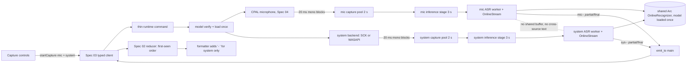

# Spec 09 — Dual-Source Transcription and Aggregation

## 1. Status, Ownership, Base, and Gates

- **Status:** Authorized for implementation in **DEVELOPMENT** mode after Spec 06 reaches `DEVELOPMENT COMPLETE`; not implemented. Spec 05 remains blocked.
- **Implementation owner:** One Spec 09 branch/worktree with **one writer**. This is the highest shared-file integration boundary in the project; no concurrent spec may run against the same checkout.
- **Required base:** One clean integration SHA containing implemented, reviewed, and merged Specs 01–08, including Spec 06’s `DevelopmentOnly` adapter/microphone evidence and Spec 07/08’s real platform-capture evidence.
- **Allowed implementation predecessors:** Specs 06, 07, and 08. Specs 01–05 are inherited transitively; Spec 05’s benchmark result remains `BLOCKED — no candidate approved`.
- **Parallel-safe peers:** none. Spec 09 owns the shared runtime, both platform integrations, the ASR orchestration, the root manifests, and the application UI at once.
- **Consumed yielded requirements:** the shared-file changes Specs 07 and 08 recorded rather than edited — macOS `minimumSystemVersion` `13.0`, the Windows API/tested floor declaration, and registration of both platform crates — are implemented here.
- **Successor gate:** Specs 10 and 11 may start in **DEVELOPMENT** mode only after this spec merges as `DEVELOPMENT COMPLETE` and freezes the capture-status/error event, dual-source ordering, and composition contracts. Architectural completion does not approve transcript fidelity or release.
- **ASR maturity gate:** The exact Spec 06 adapter remains `DevelopmentOnly`, and the UI must keep `Development ASR • Not release approved` visible. All quality/performance measurements are `NON-RELEASE EVIDENCE`. No code, config, build flag, or successful dual-source run may promote the adapter.
- **Review level:** High, mandatory. This spec decides source isolation, cross-source ordering, dual-stream bounds, and partial-failure honesty. Those results are architecture evidence only while Spec 05 is blocked.

## 2. Goal and User-Visible Result

Make Mistaken transcribe both sides of a conversation at once, locally, through two isolated streams on the temporary development adapter, with sources that can never be confused and without implying release readiness.

- The source bar exposes a real **System audio** control next to the microphone selector, with platform-honest availability and error text.
- With system audio enabled and a microphone selected, **Start Listening** starts two independent capture paths and two independent recognizer streams.
- The user speaks and their words appear as unprefixed microphone lines. The other participant’s audio, played by the computer, appears as `- ` prefixed system lines.
- Both sources produce interim text that updates in place and finalizes independently. A pause in one source never finalizes or truncates the other.
- Attribution is structural and never inferred from text: a microphone utterance can never be rendered or copied as a system line, and vice versa, even under simultaneous speech.
- `Copy All` writes both sources in stable transcript order, with `- ` only on system lines, exactly as Spec 02 serializes them.
- If the user enables system audio and it cannot start — screen-recording permission denied on macOS, no output endpoint on Windows — the start fails with a specific reason instead of silently transcribing half the conversation.
- If one source dies mid-session, the other keeps transcribing, the dead source is visibly marked with its reason, and the transcript is never rewritten.
- **Stop** tears both sources down within the one-second budget; Start → Stop → Start works repeatedly with no leaked stream, thread, or text carryover.
- No audio sample crosses IPC, nothing is written to disk, and nothing leaves the machine.

The result must be observed in the real Tauri application on a supported macOS machine **and** a supported Windows machine, with networking disabled, while real speech and real playback happen simultaneously.

The persistent adapter label from Spec 06 remains visible throughout every source combination. Working dual-source transcription and zero cross-attribution do not satisfy any Spec 05 fidelity gate.

## 3. Verified Current Behavior

Verified while authoring this spec:

- `/Users/berat/mistaken` does not exist. `/Users/berat/mistaken-context` is documentation-only and contains Specs 01–08.
- Spec 03 froze the four commands, the six events, `RuntimeSnapshot`/`ModelStatus`/`AudioSourceStatus`, the `RuntimeError` code set, monotonic revisions, full-snapshot status events, and `emit_to("main", …)`. It also froze the native `AudioSource`/`PcmFormat`/`PcmBlock`/`PcmBlockSink`/`AudioError`/`AudioCaptureSession` contract, and defined `StartCaptureRequest { microphoneDeviceId: string | null, systemAudioEnabled: boolean }`.
- Spec 03 explicitly left transcript ordering across sources to this spec: revision comparison never discards transcript events, and “transcript idempotency/order is governed by Spec 02’s segment identity contract and later Spec 09 integration”.
- Spec 02 froze the transcript domain this spec feeds: unique segment id per session, **first occurrence appended in first-seen order**, interim replaced in place only by a newer interim/final with the same id, source, and `startedAtMs`, finals immutable against later updates, a same-id source/`startedAtMs` change rejected as `segment_identity_conflict` without altering the original row, `- ` applied **only** from structural `source === "system"`, `Copy All` serializing finals only in array order joined by `\n\n`, and no sorting by text or timestamp inside the reducer.
- Spec 04 delivers the microphone path: CPAL capture, exact 20 ms mono `f32` blocks at the device’s native rate, a fixed 100-block two-second pool, allocation-free callback, monitor thread, and `waiting`/`receiving` activity gated on a peak ≥ 0.01.
- Spec 06 delivers a `DevelopmentOnly` `sherpa-onnx` adapter and the replaceable `StreamingRecognizer`/`RecognizerFactory` boundary: lazy verified load, a bounded 30 × 100 ms inference stage per source, segment ids, audio-time timestamps, 150 ms partial throttling, one final per segment, recognizer-output passthrough, frozen endpoint rules, and one constant sample rate per stream. Its quality measurements are explicitly non-release.
- Spec 07 delivers `crates/macos-system-audio`: ScreenCaptureKit audio-only capture with `excludesCurrentProcessAudio`, non-prompting permission inspection plus TCC-gated authoritative availability, a distinct restart-required state, runtime format validation, exact 20 ms mono blocks through a non-blocking `SystemAudioSink`, and a mapping table from its error kinds onto Spec 03’s `AudioErrorKind`/`RuntimeError` that **this spec implements**.
- Spec 08 delivers `crates/windows-system-audio`: event-driven WASAPI loopback on the default render endpoint, mix-format validation with explicit conversion branches, a continuous timeline whose captured, silent-flagged, and synthesized frames are counted separately, once-per-second default-endpoint change detection, COM scoped to its own thread, **no permission API and no permission error kind**, and its own mapping table that this spec implements.
- Spec 08 also froze that synthesized silence must never satisfy a `receiving` activity condition, and that DRM-protected content is indistinguishable from genuine silence.
- The official `sherpa-onnx` Rust crate’s `OnlineRecognizer` implements both `Send` and `Sync`, exposes `create_stream`, `decode`, `is_ready`, `is_endpoint`, `get_result`, `reset`, and additionally `decode_multiple_streams` for batch decoding. One recognizer instance can therefore back two concurrent streams, with the model’s memory paid once.

No implementation report is authoritative. During implementation the merged source, the installed crate documentation, the two platform crates’ real behavior, and observed dual-source runs become authoritative; any difference from this section is recorded rather than assumed away.

## 4. Scope

### In scope

- Implementing the platform-dispatching system-audio backend inside the application: the Spec 07 and Spec 08 mapping tables, a `SystemAudioBackend` trait mirroring Spec 04’s `MicrophoneBackend`, and target-specific registration of both platform crates.
- Accepting `systemAudioEnabled: true` for the first time, with the three allowed source combinations and atomic start semantics.
- A second bounded capture pool and a second bounded inference stage for the system source, symmetric with the microphone’s.
- A second recognizer stream on the single cached recognizer, one ASR worker per source, each fed exactly one constant sample rate.
- Source-parameterized segment identity, per-source segment indices, and a single session-wide clock origin so timestamps from the two sources are comparable.
- The frozen cross-source ordering contract, its rationale, and the rejected alternative.
- Per-source runtime status, per-source activity, per-source errors, and aggregate capture status including partial-failure semantics.
- Mid-session single-source failure handling that keeps the surviving source transcribing and never mutates finalized transcript content.
- The system-audio UI control, platform-honest availability/permission/error copy, and workspace integration that renders both sources with Spec 02’s existing formatter.
- Implementing the shared-file changes Specs 07 and 08 yielded: macOS minimum system version, the Windows floor declaration, root manifest/lockfile registration of both platform crates.
- Dual-stream resource and transcript-quality measurement against every unchanged Spec 05 two-stream/fidelity gate, recorded as `NON-RELEASE EVIDENCE`; these measurements do not gate `DEVELOPMENT COMPLETE` except where they expose an architectural defect.
- Rust and frontend behavior tests for isolation, ordering, identity, partial failure, bounded behavior, non-release labeling, and real simultaneous speech/playback on both operating systems.

### Out of scope

- Changing Spec 03’s command names, event names, payload shapes, error codes, or revision semantics. This spec fills the frozen contract; it does not widen it.
- Changing Spec 02’s reducer, formatter, clipboard serializer, `Clear` confirmation, or ordering rule. Their behavior is consumed exactly as merged.
- Re-benchmarking, changing or promoting the `DevelopmentOnly` adapter, claiming model approval, loading a second model, or running a second recognizer instance.
- Changing either platform crate. Their code is consumed as merged; a required change is recorded and serialized by the integration owner.
- Mixing, summing, ducking, echo cancellation, noise suppression, or any cross-source audio processing.
- Speaker diarization, speaker naming, per-application audio selection, output-device selection, or microphone/system gain control.
- Resilience hardening: retry policies, reconnect strategies, slow-inference tuning, crash recovery, and long-run drift. Spec 10 owns those.
- Keyboard shortcuts, near-bottom auto-follow, jump-to-latest, announcement tuning, and accessibility polish beyond keeping the merged contract intact. Spec 11 owns those.
- Offline/privacy/performance acceptance as a formal gate, and packaging. Specs 12–14 own those; this spec measures what its own criteria require.
- Persisting the system-audio toggle, the selected device, or any preference.
- Any reorder buffer, look-ahead delay, or timestamp-based sorting inside the transcript reducer.

## 5. Owned Files and Forbidden Concurrent Files

### Owned during Spec 09 implementation

Subject to the conventions established by merged predecessors, Spec 09 owns:

- `src-tauri/src/audio/system/**` — `mod.rs` (trait + platform dispatch), `macos.rs`, `windows.rs`, `sink.rs` (bounded pool + `PcmBlockSink` bridge), and their tests
- `src-tauri/src/audio/microphone/**` — focused edits only where the microphone path must become source-parameterized; capture, permission, and device logic stay as merged
- `src-tauri/src/asr/**` — source-parameterized worker, second stream, segment identity, session clock origin, aggregation and emission
- `src-tauri/src/commands/runtime.rs`, `src-tauri/src/state/runtime.rs`
- Focused registration edits in `src-tauri/src/lib.rs`, `src-tauri/src/audio/mod.rs` (module wiring only; the frozen public types are not altered), `src-tauri/src/commands/mod.rs`, `src-tauri/src/state/mod.rs`
- `src-tauri/Cargo.toml`, `src-tauri/Cargo.lock`
- `src-tauri/tauri.conf.json` — the macOS `minimumSystemVersion` and the Windows floor declaration yielded by Specs 07 and 08
- `src/features/audio/**` — system-audio control, per-source status presentation, capture controls
- `src/App.tsx` and focused integration edits in `src/features/transcript/TranscriptWorkspace.tsx`
- `docs/platform-support.md` or the exact equivalent the integration owner designates for the recorded platform minimums
- Tests colocated with the owned modules
- This spec’s implementation-evidence fields

### Consumed unchanged

- `src/types/**`, `src/lib/tauri/**` command/event names, validators, hook, DTOs, revision behavior
- `src/features/transcript/transcript-domain.ts`, the reducer/session hook, the clipboard serializer, and their tests
- `src/index.css`, global tokens, Tailwind and test configuration, `src/main.tsx`
- `src-tauri/src/audio/mod.rs` frozen public types, `src-tauri/build.rs`, `src-tauri/permissions/runtime.toml`, `src-tauri/capabilities/main.json`, `src-tauri/Info.plist`
- `crates/macos-system-audio/**` and `crates/windows-system-audio/**` — used as dependencies, never edited
- `benchmarks/**` — read-only; the approval record and gates are inputs

### Forbidden

- Editing either platform crate, the frozen common audio types, `capabilities/**`, `permissions/**`, the Spec 02 transcript domain, `benchmarks/**`, `docs/context/**`, or another spec file from this worktree.
- Adding a new Tauri command, event name, payload field, capability, or permission. If the dual-source contract cannot be expressed within Spec 03’s frozen surface, stop and return the discrepancy to the integration owner.

## 6. Contracts Consumed and Produced

### Start request semantics produced

`startCapture` accepts exactly three combinations:

| `microphoneDeviceId` | `systemAudioEnabled` | Meaning |
|---|---|---|
| a device id | `false` | microphone only (Spec 06 behavior, unchanged) |
| a device id | `true` | both sources |
| `null` | `true` | system audio only |

`{ microphoneDeviceId: null, systemAudioEnabled: false }` is `invalid_request`: a capture session with no source is rejected before any side effect.

**Atomic start.** Every requested source must reach a playing stream with a live recognizer stream, or the whole start fails, releases everything already allocated, and returns the single most specific `RuntimeError` for the source that failed, with its `source` field set. There is no half-started session. Rationale: silently transcribing one side of a conversation the user asked to capture in full is the worst possible failure for this product — the user would trust an incomplete transcript. The user opts out explicitly by turning the source off and retrying.

### Native backend contract produced

```rust
pub trait SystemAudioBackend: Send + Sync {
    /// Cheap, non-prompting availability probe. Reports why capture is
    /// impossible right now without allocating a stream.
    fn probe(&self) -> Result<(), AudioError>;

    /// Starts capture. On macOS this is the only place a permission request
    /// may occur, and only because the user explicitly started capture.
    fn start(
        &self,
        sink: Box<dyn PcmBlockSink>,
        on_error: Box<dyn FnMut(AudioError) + Send>,
    ) -> Result<Box<dyn AudioCaptureSession>, AudioError>;
}
```

Platform dispatch, resolved at compile time:

- `#[cfg(target_os = "macos")]` → `crates/macos-system-audio`, registered as a target-specific dependency.
- `#[cfg(target_os = "windows")]` → `crates/windows-system-audio`, registered as a target-specific dependency.
- any other target → a backend whose `probe`/`start` return `AudioErrorKind::Unavailable`, surfaced as `unsupported_platform`. This is an honest unavailability report, not a stub capture path: it never produces a sample, a block, or a success.

The two mapping tables frozen by Specs 07 and 08 are implemented verbatim in `macos.rs` and `windows.rs`. No error kind is collapsed into `internal`, and **no Windows condition maps to `system_audio_permission_denied`**, because Windows has no permission gate for render-endpoint loopback.

### Source isolation contract produced

The two pipelines share exactly one thing: the loaded recognizer. Everything else is per-source and separately owned:

| Resource | Microphone | System |
|---|---|---|
| platform capture | CPAL (Spec 04) | ScreenCaptureKit / WASAPI loopback |
| capture pool | 100 × 20 ms = 2 s | 100 × 20 ms = 2 s |
| inference stage | 30 × 100 ms = 3 s | 30 × 100 ms = 3 s |
| recognizer stream | one `OnlineStream` at the device’s native rate | one `OnlineStream` at the platform session rate |
| ASR worker thread | one | one |
| segment id namespace | `mic-<sessionId>-<index>` | `sys-<sessionId>-<index>` |
| segment index counter | independent, starts at `0` | independent, starts at `0` |
| status, activity, errors | `snapshot.microphone` | `snapshot.systemAudio` |

Invariants:

- No buffer, accumulator, queue, block, or sample slice is ever shared, reused, or moved between sources.
- `AudioSource` is carried structurally from the platform backend through the pool, the inference stage, the worker, and into `TranscriptSegment.source`. It is never derived from text, timing, energy, order, or a default.
- A block whose `source` does not match the pipeline that received it is an `internal` error that ends the session; it is never “corrected”.
- Each recognizer stream is fed exactly one sample rate for its life, per Spec 06’s fatal constraint. The two sources may run at different rates simultaneously; they never share a stream.
- The recognizer is shared as `Arc<OnlineRecognizer>` because the crate documents `Send + Sync`. Model memory is paid once. `decode_multiple_streams` is **not** used in V1: per-source workers keep the two sources independent and avoid head-of-line blocking, and batch decoding is recorded as a measured Spec 12 candidate if the two-stream CPU gate is at risk.

### Timestamp and ordering contract produced

**One session clock origin.** At session start, before any source begins, the runtime records a single monotonic origin. Each source records the monotonic offset at which its first PCM frame is fed, then derives timestamps from its own fed-frame count:

```text
segment.startedAtMs = source_start_offset_ms + floor(frames_at_utterance_start * 1000 / source_rate)
segment.endedAtMs   = source_start_offset_ms + floor(frames_at_endpoint      * 1000 / source_rate)
```

This keeps each source’s timeline deterministic and drift-free from its own audio, while making the two sources comparable within the accuracy of their start offsets. Timestamps are session-relative and never wall-clock.

**Cross-source order is emission order, and emission order is finalization order.** Frozen rules:

1. Within a source, finals are emitted in non-decreasing `endedAtMs` and their segment indices increase by exactly one.
2. Across sources, the aggregator emits each final as soon as that source finalizes it. The transcript’s visible order is therefore Spec 02’s first-seen order, which equals finalization order.
3. Interim events are emitted immediately and are never delayed, buffered, or reordered.
4. No timestamp-based sorting, look-ahead delay, or reorder buffer exists anywhere — not in native code, not in the bridge, not in the reducer.

**Rejected alternative, recorded:** a 1–2 s reorder window keyed on `startedAtMs` would place a long system utterance before a short microphone utterance that finished earlier. It was rejected because it delays every final by the window, contradicts Spec 02’s frozen first-seen ordering, changes nothing for genuine cross-talk (which has no correct linear order), and because both sources already finalize on the same ~1.0 s trailing-silence rule, so finalization order tracks speech-end order for ordinary turn-taking. Changing this requires a recorded product decision, not an implementation choice.

**Prefix rule.** Native payloads and native code contain no `- ` anywhere. The prefix is produced only by Spec 02’s formatter from `source === "system"`. A `- ` appearing in a native transcript payload is a defect, and an acceptance criterion checks for it.

### Runtime status contract produced

Within Spec 03’s frozen `RuntimeSnapshot`:

- `microphone` and `systemAudio` each carry their own `AudioSourceStatus`, including `capturing` with `activity: "waiting" | "receiving"`.
- `receiving` requires at least one complete finite mono block whose absolute peak is ≥ 0.01, per Spec 04. **Windows synthesized silence can never satisfy it**, because synthesized frames are zeros and are counted separately by the platform crate.
- A source that was not requested is `idle`, not `unavailable`, and never reports an error.
- Aggregate `captureStatus`:
  - `listening` while **at least one** requested source is `capturing`;
  - `error` only when **every** requested source has failed;
  - `starting`/`stopping` during transitions, with no second command accepted.
- Every status change increments the revision exactly once under the lock and emits one complete snapshot after unlocking, exactly as Spec 03 froze.

### Mid-session partial failure contract produced

1. A source-local failure — macOS stream stopped, Windows endpoint changed or invalidated, device disconnected, unsupported format mid-session, decode failure on that stream — sets that source’s status to `error` with its exact code and `source` field, emits one `capture:error` and one full-snapshot `audio:status`, and tears down **only** that source’s capture, pool, inference stage, stream, and worker.
2. The surviving source keeps capturing and transcribing without interruption; its recognizer stream is untouched.
3. Finalized transcript content is never deleted, rewritten, or re-ordered because a source failed. A dead source’s in-flight interim segment is simply never finalized and stops updating; the aggregator emits no final for it.
4. When the last live source fails, `captureStatus` becomes `error`, all resources release, and the transcript remains intact.
5. Restarting the failed source requires an explicit Stop and Start. Automatic retry, reconnect, and re-enable belong to Spec 10 and must not be smuggled in here.

### Frontend contract produced

```ts
export interface CaptureControllerState {
  devices: readonly MicrophoneDevice[];
  selectedDeviceId: string | null;
  systemAudioEnabled: boolean;          // volatile, defaults to false, never persisted
  listState: "loading" | "ready" | "error";
  commandPending: "start" | "stop" | null;
  microphone: AudioSourceStatus;
  systemAudio: AudioSourceStatus;
  captureStatus: CaptureStatus;
  error: RuntimeError | RuntimeBridgeError | null;
}
```

Rules:

- `systemAudioEnabled` defaults to `false` so no macOS screen-recording prompt can ever be reached without an explicit user opt-in, and it resets on relaunch because no preference is persisted.
- The toggle is disabled during `starting`/`listening`/`stopping`; changing sources requires Stop first.
- `Start Listening` is enabled only when the model is usable and at least one source is selected; its disabled reason is stated in one sentence.
- Per-source errors render next to the source control they belong to; the aggregate error area is reserved for session-level failures.
- Transcript rendering, `Clear`, and `Copy All` come from Spec 02 unchanged; this spec only supplies both sources’ segments.

## 7. User Flow and Developer Verification Flow

### Dual-source flow

1. User launches Mistaken. Model status is honest; system audio shows availability from a non-prompting probe; the toggle is off.
2. User selects a microphone and enables **System audio**. On macOS the UI states plainly that macOS grants system-audio capture through the Screen Recording permission and that Mistaken captures audio only. On Windows it states that no permission is required and that the default output device’s mix is captured.
3. User activates **Start Listening**. The model loads once if needed. Both sources start; on macOS the single screen-recording request may occur here, and only here.
4. Status becomes `listening`, each source shows `waiting`, then `receiving` when real signal arrives.
5. The user speaks; unprefixed microphone lines appear with interim updates finalizing on pause.
6. The other participant’s audio plays through the computer; `- ` prefixed system lines appear independently, with their own interim lifecycle.
7. Both talk at once. Both sources keep producing their own interim and final segments; neither truncates the other and neither is attributed to the other.
8. Deliberately incorrect English from either source stays incorrect.
9. `Copy All` writes both sources in transcript order with `- ` only on system lines.
10. The user unplugs the active microphone. The microphone source shows its error; system transcription continues; existing transcript content is unchanged.
11. **Stop** ends both sources within one second. A new Start begins a new session with both indices at `0` and no carried text.

### Failure flows

- **System audio requested but unavailable — macOS:** screen recording denied → start fails atomically with `system_audio_permission_denied`, actionable settings guidance next to the toggle, no microphone stream left running, transcript untouched.
- **System audio requested but unavailable — Windows:** no default output endpoint or audio service down → start fails atomically with `system_audio_unavailable` and Windows-specific guidance that never mentions a permission.
- **Microphone requested but unavailable:** existing Spec 04 codes, atomic failure, system stream not left running.
- **Model missing/mismatched/unloadable:** Spec 06 behavior, rejected before any device or permission work for either source.
- **One source dies mid-session:** partial-failure contract above.
- **Inference lagging:** per-source `inference_lagging`, rate-limited per source, both sources keep running.
- **Unsupported platform:** honest `unsupported_platform` for system audio; the microphone path is unaffected.

### Developer verification flow

- Rust tests cover platform mapping tables, isolation invariants, per-source identity and indices, session clock math, atomic start rollback, partial-failure teardown, aggregate status derivation, and bounded behavior of both stages.
- Frontend tests cover the three source combinations, toggle enablement, per-source error placement, both-source rendering through Spec 02’s formatter, and the absence of any native `- `.
- The decisive real verification is **simultaneous** speech and playback on each OS, with a playback clip whose words are known and distinct from the spoken script, so cross-attribution is detectable rather than plausible.
- All real verification runs with networking disabled.

## 8. UI Behavior, States, Tokens, and Accessibility

### Source bar

- Microphone selector and refresh stay exactly as Spec 04 built them.
- **System audio** becomes a real labeled control with a visible state: `Off`, `Ready`, `Capturing`, `Waiting for audio…`, `Unavailable`, or a specific error.
- Platform-honest copy, keyed off error codes rather than message strings:
  - macOS denied: `macOS grants system audio through Screen Recording. Enable Mistaken in System Settings → Privacy & Security → Screen Recording.`
  - macOS restart required: the same plus `Then relaunch Mistaken.`
  - macOS/Windows unsupported version: `System audio needs a newer version of <OS>.`
  - Windows no endpoint: `No audio output device is available. Connect or enable an output device.`
  - Windows never shows permission wording, and macOS wording never appears on Windows.
- A short truthful note that Mistaken captures system audio only, records nothing to disk, and uploads nothing.

### Transcript surface

- Unchanged from Spec 02: microphone lines unprefixed, system lines `- ` prefixed, interim muted plus its textual marker, finals in primary text, no bubbles, no avatars, no per-source color.
- Both sources’ interim rows may be visible simultaneously; each updates in place under its own id.

### Bottom bar and states

- `Start Listening` / `Stop`, elapsed time, `Clear`, and `Copy All` keep Spec 02/06 behavior.
- Disabled reasons are specific: no model, no source selected, or a transition in progress.
- Per-source failure while listening keeps the primary action as **Stop**, because the session is still live.

### Accessibility

- Source state is conveyed by text plus icon, never color alone; the system control has a real label and an accessible name reflecting its state.
- Per-source error text is programmatically associated with its control.
- Both sources’ interim announcements stay polite and throttled; two simultaneous interim rows must not double the announcement rate beyond Spec 06’s per-source throttle. If that proves noisy, the chosen behavior is recorded here and tuned by Spec 11.
- No new animation; reduced-motion behavior unchanged.
- Layout remains usable at `1040 × 720` and `720 × 520` with the added system control; labels collapse before controls are hidden.

## 9. Frontend → Tauri IPC → Rust / Audio / ASR Data Flow



### Start flow

1. Validate the request; reject the no-source combination and any unknown field before side effects.
2. Under the lock, reject an active transition/session, allocate a new generation and session id, record the session clock origin, commit `starting`, unlock, emit the snapshot.
3. Verify and load the model if needed (Spec 06), emitting model status transitions.
4. Probe each requested source. Allocate, per source in a fixed order, its pool, inference stage, recognizer stream, and worker; then start its platform capture.
5. If any requested source fails at any step, tear down every resource allocated for **both** sources, return that source’s specific error, and leave no stale controller or worker.
6. Commit `listening` only after every requested source is playing with a live stream behind it.

### Steady-state flow

- Each source’s capture callback stays allocation-free and non-blocking; each monitor copies out and recycles immediately; each inference stage drops newest under pressure and reports `inference_lagging` for its own source at most once per second.
- Each ASR worker owns its stream, feeds one constant rate, decodes while ready, reads its hypothesis, detects its own endpoints, and emits its own throttled partials and single finals.
- Event emission happens on the workers, outside any lock; payloads carry only Spec 03’s frozen shapes.
- No worker reads the other source’s state, text, buffers, or counters.

### Stop and shutdown flow

1. Stop commits `stopping`, removes the session controller, unlocks, and signals both sources.
2. Each source finishes input, drains within its 300 ms budget, emits at most one closing final, then releases stream, stage, pool, and capture.
3. Both workers join within the overall one-second teardown budget; the recognizer stays loaded.
4. Commit `idle` and resolve. Application exit runs the same idempotent native path for both sources.

## 10. Platform, Permissions, Offline, Privacy, and Fallback

### Platform minimums — implemented here

- macOS: `minimumSystemVersion` set to `13.0` in `src-tauri/tauri.conf.json`, as yielded by Spec 07, plus the runtime version check the macOS crate already performs.
- Windows: the recorded API floor (Windows 10 1703 / build 15063) and supported-tested floor (Windows 10 22H2 / Windows 11) are declared in the designated platform-support document, as yielded by Spec 08. Spec 14 consumes the same numbers.
- Any other target compiles with an honest unavailable system-audio backend and is not claimed as supported.

### Permissions

- macOS: the single screen-recording request may occur only inside an explicit Start with system audio enabled. Non-prompting probes run freely. Microphone authorization stays exactly as Spec 04 implemented it. No new usage description, entitlement, or capability is added here.
- Windows: no permission is requested, no prompt appears, and no UI copy claims one is needed.
- Tauri surface unchanged: no new command, event, capability, or CSP change; the frontend still cannot emit events, read the clipboard, touch the filesystem, or make network calls.

### Offline and privacy

- The complete dual-source flow runs with networking disabled on both hosts.
- No socket, DNS lookup, HTTP request, API key, account, backend, telemetry, or update check exists at runtime.
- PCM lives only in the four fixed native stages and is discarded on consumption, stop, error, or exit. Nothing is written to disk.
- **No recognized text, partial hypothesis, device id, endpoint id, or model path is ever logged**, at any level, including debug builds. Evidence records counts, durations, statuses, and aggregate levels only.
- System audio can contain arbitrary private content: verification uses a deliberately chosen playback clip, stores no audio, and records no transcript text beyond the short scripted lines needed to prove attribution.
- Mistaken still produces no audio output, so macOS `excludesCurrentProcessAudio` plus Windows’ session-mix behavior cannot create feedback in V1. Windows has no per-process exclusion, so this is recorded as a standing constraint for any future audio output.

### Fallback rules

- Requested source unavailable: atomic start failure with the specific reason. Never a silent single-source session, never a fake second source, never a cloud path.
- Source dies mid-session: honest per-source error plus a surviving source. Never automatic retry here, never transcript rewriting, never source substitution.
- Inference pressure: per-source drop-newest with reporting. Never unbounded buffering, never dropping one source to favor the other, never merging sources to save CPU.
- Ambiguous attribution under cross-talk: both sources report their own recognizer output. Never a heuristic that reassigns a segment’s source.
- DRM-protected or silent system audio: reported as silence with no cause guessed, per Spec 08.

## 11. Resource Lifecycle, Bounded Buffering, Errors, and Recovery

### Resource inventory

Process-wide: one loaded recognizer, shared as `Arc`, dropped at process exit.

Per active session, at most, and strictly per source:

- one platform capture session, one 100 × 20 ms pool, one monitor thread
- one 30 × 100 ms inference stage with its filled/recycle queues
- one `OnlineStream`, one ASR worker thread
- one segment index, one activity flag, one set of atomic counters
- plus one session-wide generation, clock origin, and session id

Totals with both sources active: two capture pools (4 s), two inference stages (6 s), **at most 10 seconds of audio held in memory**, two platform sessions, four threads (two monitors, two workers), two recognizer streams, one recognizer.

### Bounded buffering summary

| Stage | Per source | Both sources | Overflow behavior |
|---|---|---|---|
| capture pool | 100 × 20 ms = 2 s | 4 s | drop newest frames, count, `audio_queue_overflow` with `source` |
| inference stage | 30 × 100 ms = 3 s | 6 s | drop newest samples, count, `inference_lagging` with `source`, ≤ 1/s per source |
| recognizer stream | one, reset at each endpoint | two | forced finalization at 15 s utterance length |
| transcript | in-memory, immutable finals | shared array | Spec 02 `Clear` only |

No stage can grow, and no source can consume another source’s capacity.

### State transitions

```text
session: idle -> starting -> listening -> stopping -> idle
session: idle -> starting -> error            # any requested source failed to start
session: listening -> listening               # one of two sources failed; the other survives
session: listening -> error                   # last live source failed
session: starting -> stopping -> idle          # cancellation before both sources are live
per-source: idle -> starting -> capturing(waiting|receiving) -> stopping -> idle
per-source: starting|capturing -> error
```

- A second Start during any transition returns `capture_already_active`; Stop from idle returns `capture_not_active`.
- Stop during `starting` cancels the generation for both sources; a late permission grant, endpoint resolution, or model load can never install a stream afterwards.
- A source’s teardown never blocks the other source’s audio path, and no lock is held across capture, permission, stream, join, or emission work.

### Error mapping additions

Beyond Specs 04 and 06, this spec adds only mappings, not codes:

- macOS crate kinds → `system_audio_permission_denied`, `unsupported_platform`, `system_audio_unavailable`, `capture_start_failed`, `capture_stop_failed`, `internal`, per Spec 07’s table.
- Windows crate kinds → `unsupported_platform`, `system_audio_unavailable`, `capture_start_failed`, `capture_stop_failed`, `device_disconnected`, `internal`, per Spec 08’s table.
- No-source request → `invalid_request`.
- Block/source mismatch, index or clock invariant violation, or a cross-source resource leak detected at runtime → `internal`, session ends safely.

Every error carries reviewed `recoverable` and, where applicable, the exact `source`. The UI branches on codes only.

### Recovery

- Atomic start failure leaves no session; the user changes selection or fixes the OS state and retries.
- Single-source failure leaves a live session; recovery is an explicit Stop/Start.
- Restart always produces a new session id, fresh clock origin, both indices at `0`, fresh pools and stages, two fresh streams, and reuses only the loaded model.
- Overflow and lagging never auto-resize, auto-retune, or auto-restart.

## 12. Numbered Measurable Acceptance Criteria

1. **Development predecessors and single writer — both hosts:** Spec 09 starts from one recorded SHA containing merged Specs 01–08 with Spec 06 `DEVELOPMENT COMPLETE`, in its own worktree with exactly one writer, while Spec 05 remains blocked; only declared paths change.
2. **Frozen contracts preserved — platform-neutral:** No command, event name, payload field, error code, revision rule, transcript type, reducer behavior, formatter, or serializer is altered; no duplicate registry, type, or state container exists. Spec 02’s tests pass unmodified.
3. **Platform crates consumed unchanged — both hosts:** Both platform crates are registered as target-specific dependencies and their sources are byte-identical to the merged versions; their mapping tables are implemented in full with no kind collapsed into `internal`.
4. **Yielded requirements implemented — both hosts:** macOS `minimumSystemVersion` is `13.0`; the Windows API and tested floors are declared in the designated document; both match Spec 07/08 exactly.
5. **Three source combinations — real macOS and Windows:** Microphone-only, system-only, and both-sources sessions each start, transcribe their requested sources, and stop cleanly; the no-source request is rejected with `invalid_request` before any side effect.
6. **Atomic start — real macOS and Windows:** With system audio requested and unavailable (macOS permission denied; Windows no output endpoint), start fails with that source’s specific code, no microphone stream, pool, stage, stream, or worker remains alive, and the transcript is untouched. The symmetric microphone-failure case behaves the same.
7. **Real simultaneous dual-source transcription — real macOS and Windows:** With the user speaking a known script while a known, textually distinct clip plays, both sources produce interim and final segments concurrently; microphone lines render unprefixed and system lines render with `- `.
8. **Zero cross-attribution — real macOS and Windows:** Across at least ten utterances per source per host, including at least three deliberate overlaps, no word from the playback clip appears in a microphone segment and no spoken word appears in a system segment; every mismatch is a blocking defect, not a tolerance.
9. **Structural source only — review plus tests:** `AudioSource` is carried from the platform backend to the segment; no code infers source from text, energy, timing, order, or a default, and a source-mismatched block produces `internal` rather than a correction.
10. **No native prefix — real app plus tests:** No native transcript payload contains a leading `- `; the prefix exists only in Spec 02’s formatter output, verified by event inspection and by a test asserting the native payload text.
11. **Per-source identity and indices — tests plus real run:** Ids follow `mic-<sessionId>-<index>` and `sys-<sessionId>-<index>`, indices are independent and increase by exactly one per final, every partial of an utterance shares its final’s id, exactly one final per id is emitted, and no event follows a final for that id.
12. **Ordering contract — tests plus real run:** Within each source, finals are emitted in non-decreasing `endedAtMs`; across sources, visible order equals emission order; no reorder buffer, look-ahead delay, or timestamp sort exists in native code, the bridge, or the reducer.
13. **Session clock comparability — tests plus real run:** Both sources derive timestamps from one session origin plus their own fed-frame counts; timestamps are session-relative, monotonically non-decreasing per source, and the two sources’ start offsets are recorded from the real run.
14. **One recognizer, two streams — review plus measurement:** Exactly one `OnlineRecognizer` is created per process and shared across both streams; each stream is fed exactly one constant rate; model memory is paid once, evidenced by measured RSS against a single-source session.
15. **Bounded dual-source memory — tests plus real run:** Four fixed stages bound in-memory audio to 10 seconds total; each source’s overflow drops newest and reports with its own `source`; neither source can consume the other’s capacity; no stage grows under sustained load.
16. **Per-source status and activity — real macOS and Windows:** Each source reports its own status and `waiting`/`receiving`; an unrequested source stays `idle`; `captureStatus` is `listening` while any requested source captures and `error` only when all have failed; **Windows synthesized silence never produces `receiving`**.
17. **Mid-session partial failure — real macOS and Windows:** Disconnecting the microphone, or switching/unplugging the Windows output endpoint or stopping the macOS stream, marks only that source as failed with its exact code, keeps the other source transcribing, releases only the failed source’s resources, and never alters finalized transcript content.
18. **Both-source Copy All and Clear — real macOS and Windows:** `Copy All` writes finals from both sources in transcript order, separated by exactly `\n\n`, with `- ` only on system lines and no metadata; `Clear` removes all in-memory segments from both sources with the merged confirmation behavior.
19. **No application correction — review plus real run:** Deliberately incorrect English from both sources is compared with the raw recognizer result; emitted text matches recognizer output under the frozen whitespace rule. Any recognizer correction/misrecognition is retained as failed `NON-RELEASE EVIDENCE`; any application grammar, spelling, casing, punctuation, substitution, or LLM stage blocks development completion.
20. **Start → Stop → Start, shutdown, and maturity label — real macOS and Windows:** At least five dual-source cycles complete, teardown finishes within one second, both sources release every resource, indices reset to `0`, no text carries over, active close releases both sources/model, relaunch starts idle with the toggle off, and `Development ASR • Not release approved` remains visible.
21. **Unchanged dual-stream measurements — both reference hosts:** Measure two-stream RTF against ≤ 0.9, peak RSS against ≤ 1.4 GB, per-source latency against Spec 05’s single-stream gates, and relevant fidelity/hallucination values. Record every pass/failure as `NON-RELEASE EVIDENCE`; failures continue blocking production but do not block `DEVELOPMENT COMPLETE` unless caused by a Spec 09 architectural regression. `decode_multiple_streams` remains unused absent a recorded later decision.
22. **Offline, privacy, and checks — both hosts:** The full dual-source flow runs with networking disabled; inspection finds zero network paths, zero audio/transcript writes, and zero logging of text, device ids, endpoint ids, or model paths; typecheck, lint, frontend tests and build, `cargo fmt --check`, `cargo check`, `cargo clippy --all-targets --all-features -- -D warnings`, `cargo test`, and real Tauri launches pass on both hosts.
23. **High-capability review and frozen successor contract — integration:** Review covers source isolation, ordering, clock math, atomic start rollback, partial-failure teardown, lock discipline, FFI lifetimes across two streams, boundedness, privacy, accessibility, and platform-honest copy; every High/Medium finding is fixed and re-verified; the capture-status/error contract, ordering contract, and application composition boundary are recorded as frozen for Specs 10 and 11.

## 13. Acceptance Criterion → Verification/Test Mapping

| AC | Verification or permanent test | Evidence to record |
|---|---|---|
| 1 | Inspect base SHA, review closures, worktree, and final changed-path report | Root, branch, base SHA, owned-path diff, single-writer confirmation |
| 2 | Run the merged Spec 02/03 suites unmodified; duplicate-symbol and contract diff inspection | Suite results, zero-contract-change proof |
| 3 | Diff both platform crates against merged versions; review each mapping arm | Diff result, per-kind mapping coverage |
| 4 | Inspect `tauri.conf.json` and the platform-support document | Exact values versus Spec 07/08 records |
| 5 | Exercise all three combinations plus the empty request on each OS | Per-combination transcript result, rejection code |
| 6 | Induce system-audio unavailability and microphone unavailability on each OS | Error code, resource inspection, transcript integrity |
| 7 | Speak a known script while playing a known distinct clip, on each OS | Utterance counts, sample rendered lines, prefix observation |
| 8 | Compare both sources’ segments against both known word sets, per host | Per-utterance attribution table, overlap cases, zero-mismatch statement |
| 9 | Source review plus a mismatched-block test | Review notes, test result |
| 10 | Intercept native transcript payloads; assert payload text in tests | Payload samples, assertion result |
| 11 | Rust identity tests plus real-run id inspection | Id patterns, index sequences, one-final assertions |
| 12 | Rust ordering tests plus real-run emission trace; search for sort/delay logic | Per-source ordering proof, emission trace, zero-reorder finding |
| 13 | Rust clock tests with synthetic frame counts plus real-run offsets | Computed values, monotonicity, recorded start offsets |
| 14 | Review recognizer construction; measure RSS for single vs dual source | Instance count, stream rates, RSS delta |
| 15 | Saturation tests per stage plus sustained dual-source run with counters | Stage math, per-source drop counts, memory stability |
| 16 | Observe both sources across requested/unrequested and silent/active states on each OS | Status/activity transitions, synthesized-silence observation |
| 17 | Physically disconnect the microphone and switch/unplug the Windows endpoint during dual capture | Failed-source code, survivor behavior, resource release, transcript integrity |
| 18 | Use the real `Copy All` and `Clear` with both sources present; compare clipboard bytes | Clipboard text comparison, segment counts before/after |
| 19 | Compare raw recognizer output with both emitted pipelines; inspect for application rewriting | Per-source passthrough comparison; recognizer errors labeled non-release |
| 20 | Five dual-source cycles, active-close, relaunch, and maturity-label check on each OS | Cycle results, teardown durations, reset/relaunch state, persistent label |
| 21 | Measure two-stream RTF, RSS, latencies, and relevant quality gates on both hosts | Values against unchanged gates, architectural-regression analysis, non-release labels |
| 22 | Run all flows with networking disabled; inspect sockets, storage, logs; run the full check set | Disable method, zero-findings statement, exact commands and exits |
| 23 | High-capability review of the finished diff plus the frozen-contract record | Findings, dispositions, frozen contract summary, final Git state |

Permanent tests protect source isolation, identity and indices, ordering, clock math, atomic rollback, partial-failure teardown, aggregate status derivation, mapping coverage, and boundedness. They must not assert function forwarding, mock echoes, constant existence, source text, or bare non-throwing behavior. Real simultaneous dual-source transcription, zero cross-attribution, partial-failure behavior, performance, and teardown require both real hosts and cannot be replaced by mocks.

## 14. Ordered Implementation Plan

1. After Specs 06–08 merge with reviews closed and Spec 06 labeled `DEVELOPMENT COMPLETE`, create the Spec 09 worktree from the recorded Wave 5 base. Confirm Spec 05 remains blocked; record root/branch/base and single-writer isolation.
2. Re-read canonical context, Specs 02–12, both platform crates’ APIs/mapping tables, Spec 05’s blocked approval and unchanged gates, Spec 06’s exact development manifest, and installed `sherpa-onnx` documentation. Run baseline checks on both hosts.
3. Implement the yielded shared-file requirements first — macOS minimum system version, Windows floor declaration, target-specific registration of both platform crates — and prove both hosts still build and launch before touching behavior.
4. Implement `SystemAudioBackend`, the compile-time platform dispatch, and the honest unavailable backend for other targets.
5. Implement the macOS and Windows mapping arms with exhaustive matches and tests, so no kind can be added upstream without a compile error here.
6. Generalize the bounded capture pool, inference stage, and ASR worker to be source-parameterized, keeping the microphone’s merged behavior byte-for-byte equivalent; prove it with the existing Spec 06 tests before adding the second source.
7. Implement the session clock origin, per-source offsets, and per-source segment identity with tests.
8. Implement the system pipeline end to end: sink bridge, pool, stage, second `OnlineStream` on the shared recognizer, and worker.
9. Implement the runtime command/state changes: three source combinations, atomic start with full rollback, aggregate status derivation, per-source status and errors, and emission-after-unlock discipline.
10. Implement the mid-session partial-failure path with per-source teardown and survivor continuity, including tests that assert the survivor’s stream is untouched.
11. Implement the system-audio control, per-source status/error placement, persistent development-ASR label, and focused `App`/workspace integration; keep Spec 02’s transcript surface untouched.
12. Add Rust/frontend behavior tests mapped to the acceptance criteria. Do not add a production fake backend, debug recording path, text logging path, promotion switch, or test-only command.
13. Verify on real macOS with networking disabled: all three combinations, simultaneous speech/playback with attribution scoring, overlap cases, permission-denied atomic failure, microphone disconnect, ScreenCaptureKit stop, five cycles, active close, relaunch, and persistent maturity label.
14. Repeat step 13 on real Windows, adding default-endpoint switch/unplug; record its own evidence. No host substitutes for the other.
15. Measure dual-stream RTF, RSS, per-source latency, and applicable transcript-quality gates against unchanged Spec 05 thresholds. Preserve every failure as `NON-RELEASE EVIDENCE`; fix only identified architectural regressions and never retune a gate.
16. Review the whole diff for cross-source leakage, ordering, clock math, rollback completeness, lock discipline, FFI lifetimes across two streams, boundedness, privacy and logging, accessibility, and platform-honest copy. Fix every High/Medium finding and rerun affected proof.
17. Remove temporary probes, instrumentation, fixtures, and scratch files; verify nothing private is staged.
18. Record the frozen capture-status/error, ordering, and composition contracts for Specs 10 and 11; update only this spec’s evidence; create the focused local commit unless directed otherwise; report roots, branches, SHAs, hosts, devices, and measurements; do not push unless requested.

## 15. Risks, Rollback, Cleanup, and Preservation Rules

### Risks and mitigations

- **Cross-source attribution error:** the single worst defect for this product — one speaker’s words labeled as the other’s. Keep every buffer, stage, stream, worker, index, and status per source; carry `AudioSource` structurally; make a mismatched block a fatal session error; score attribution over at least ten utterances per source per host including deliberate overlaps.
- **Silent half-capture:** a session that starts with only one of two requested sources would produce a trustworthy-looking but incomplete transcript. Start is atomic, and opting out is an explicit user action.
- **Ordering surprise:** users may expect chronological order under cross-talk. Freeze emission-order semantics, document the rejected reorder window, and never sort by timestamp in the reducer.
- **Clock incomparability:** per-source audio clocks alone are not comparable. One session origin plus recorded per-source start offsets, with session-relative timestamps only.
- **Shared recognizer misuse:** the crate documents `Send + Sync`, but a shared mutable stream would corrupt both sources. Each stream is owned exclusively by its worker; only the recognizer handle is shared; re-verify the documented traits for the pinned version before relying on them.
- **Mid-stream rate change:** Spec 06 proved the runtime terminates the process on a stream rate change. Two sources at different rates make this easier to get wrong: fix each stream’s rate at creation and end that source’s session on any change.
- **Head-of-line blocking:** decoding both sources on one thread would couple them. One worker per source, and batch decoding stays unused unless a recorded decision changes it.
- **Dual-stream resource blowout:** two pipelines double audio memory and CPU. Fixed stages bound audio to 10 s, model memory is paid once, and unchanged Spec 05 two-stream gates are measured as non-release evidence rather than assumed or relaxed.
- **Partial-failure leakage:** tearing down a failed source could take the survivor’s resources with it. Per-source ownership with tests asserting the survivor’s stream, stage, and pool are untouched.
- **Rollback gaps in atomic start:** a failure after the first source starts could leave a stream running. Allocate in a fixed order, roll back in reverse, and test failure injection at every step.
- **Lock contention or deadlock:** two sources plus emission increase the risk. No lock is held across capture, permission, stream, join, or emission work; state transitions clone a small snapshot and unlock before emitting.
- **Permission copy drift:** copying macOS wording to Windows would tell users to grant a nonexistent permission. Copy is keyed off codes and platform, and both hosts’ text is verified.
- **Privacy escalation:** system audio captures everything audible, including other people. No disk writes, no text logging, deliberately chosen verification material, and truthful in-app copy about what is captured.
- **Scope creep from Specs 10/11:** retry, reconnect, shortcuts, and auto-follow are tempting here. They are out of scope and must be left to their specs so the frozen contract stays stable.

### Rollback

- Before merge, abandon the Spec 09 branch/worktree; Specs 01–08 remain intact.
- After merge, reverting Spec 09 must restore Spec 06’s microphone-only behavior, re-reject `systemAudioEnabled: true`, remove the system pipeline and UI control, unregister both platform crates, and leave both platform crates and Specs 01–08 untouched.
- Once Specs 10–12 build on this integration, use a coordinated forward fix or revert dependent commits in reverse order; never leave resilience or acceptance work pointing at a removed dual-source path.
- Never reset, clean, or delete unrelated user work, another worktree, OS permission settings, audio device configuration, or `/Users/berat/mistaken-context`.

### Required cleanup

- Remove temporary attribution-scoring scripts, instrumentation, seeded transcript fixtures, debug counters exposed to the UI, and scratch binaries.
- Remove any experimental reorder buffer, batch-decode path, mixed-source stage, or shared-buffer optimization that did not make the reviewed design.
- Remove unused dependencies, features, imports, and any leftover single-source assumption in state, UI copy, or tests.
- Verify no audio file, recognized text artifact, screenshot containing private content, or model weight is staged for commit.

### Preservation rules

- Preserve Spec 03’s command/event/error/revision surface exactly; this spec adds no contract, only implementations and mappings.
- Preserve Spec 02’s reducer, first-seen ordering, final immutability, structural `- ` prefix, serializer, `Clear`, and `Copy All` semantics.
- Preserve Spec 06’s `DevelopmentOnly` maturity, persistent non-release UI label, recognizer configuration, endpoint rules, output passthrough, throttling, and single-final guarantee, applied identically to both sources.
- Preserve both platform crates as merged, including their permission honesty and their captured-versus-synthesized accounting.
- Preserve microphone/system separation, local-only processing, no account, no backend, no database, no transcript or audio persistence, no upload, no cloud fallback, and no grammar correction.
- Preserve least-privilege Tauri capabilities, the CSP, and clipboard-write-only behavior.
- Preserve the user’s OS permission choices and audio configuration; verification never resets them.

## 16. Definition of Done and Evidence Record

Spec 09 is `DEVELOPMENT COMPLETE` only when the real Mistaken application on a supported macOS machine and a
supported Windows machine captures microphone and system audio simultaneously through two fully independent
pipelines and one shared `DevelopmentOnly` recognizer, renders unprefixed microphone lines and `- ` prefixed
system lines with zero cross-attribution across scored utterances including deliberate overlaps, fails a start
atomically when a requested source is unavailable, keeps the surviving source transcribing when one source
dies without touching finalized content, bounds in-memory audio to 10 seconds across four fixed stages, records
every unchanged Spec 05 two-stream performance and quality result as `NON-RELEASE EVIDENCE`, copies and clears
both sources through Spec 02’s unchanged domain, runs entirely offline with no persistence and no text logging,
tears down both sources within one second and restarts cleanly, keeps
`Development ASR • Not release approved` visible, and records the frozen capture-status, ordering, and
composition contracts for Specs 10 and 11. This completion does not approve fidelity, satisfy Spec 12,
authorize packaging, or make a release claim.

### Required implementation evidence

Fill during implementation; do not predeclare success:

- **Implementation status:** DEVELOPMENT COMPLETE (Spec 05 remains blocked; development mode only)
- **Canonical repository root:** `/Users/berat/mistaken`
- **Worktree root / branch / base SHA / implementation commit SHA:**
  - Worktree root: `/Users/berat/mistaken-spec-09`
  - Branch: `spec/09-dual-source-transcription-aggregation`
  - Base SHA: `ec8047d0add1b3cd53ca8649ec5ec9810e164e89` (short: `ec8047d`)
  - Implementation commit SHA: `d5ba98859d158dca5645fc6d4090677db376cfd1`
- **Changed paths:**
  - `docs/platform-support.md` (new platform minimums declaration)
  - `docs/specs/spec-09-dual-source-transcription-aggregation.md` (evidence updated)
  - `docs/context/progress-tracker.md` (tracker updated)
  - `src-tauri/Cargo.toml`, `src-tauri/Cargo.lock` (platform crates and objc2-foundation)
  - `src-tauri/tauri.conf.json` (bundle.macOS.minimumSystemVersion = "13.0")
  - `src-tauri/src/audio/mod.rs` (pub mod system;)
  - `src-tauri/src/audio/microphone/session.rs` (source invariant check)
  - `src-tauri/src/audio/system/mod.rs` (new: SystemAudioBackend trait + dispatch)
  - `src-tauri/src/audio/system/macos.rs` (new: macOS SCK backend + error mapping)
  - `src-tauri/src/audio/system/windows.rs` (new: Windows WASAPI backend + error mapping)
  - `src-tauri/src/audio/system/sink.rs` (new: bounded PcmBlockSink bridge)
  - `src-tauri/src/audio/system/session.rs` (new: system monitor thread + supervisor)
  - `src-tauri/src/audio/system/unsupported.rs` (new: unsupported platform fallback)
  - `src-tauri/src/asr/worker.rs` (source-parameterized SegmentTracker, offsets, mic/sys IDs)
  - `src-tauri/src/commands/runtime.rs` (dual-source start_capture / stop_capture)
  - `src-tauri/src/lib.rs` (register system audio backend and probe initialization)
  - `src-tauri/src/state/manager.rs` (atomic start, rollback, survivor continuity, dual sessions)
  - `src/App.tsx` (system audio control, dual-source start/stop, canStart logic)
  - `src/App.test.tsx` (new: App dual-source integration tests)
  - `src/features/audio/SystemAudioControl.tsx` (new: system audio UI control)
  - `src/features/audio/SystemAudioControl.test.tsx` (new: SystemAudioControl unit tests)
  - `src/features/transcript/TranscriptWorkspace.tsx` (systemAudioControl prop support)
- **Platform crate versions/SHAs consumed and diff-clean confirmation:**
  - `crates/macos-system-audio`: v0.1.0, 0 modified files, clean, 14 unit tests passing
  - `crates/windows-system-audio`: v0.1.0, 0 modified files, clean, compile_error! guard verified on macOS
- **Yielded requirements implemented with exact values:**
  - `bundle.macOS.minimumSystemVersion = "13.0"` in `src-tauri/tauri.conf.json`
  - Windows API floor: Windows 10 Version 1703 (build 15063) declared in `docs/platform-support.md`
  - Windows tested/supported floor: Windows 10 Version 22H2 (build 19045) and Windows 11 declared in `docs/platform-support.md`
  - Target-specific crate registration in `src-tauri/Cargo.toml`
- **macOS hardware/version, microphone identity, permission states:**
  - Model: Mac mini (Mac16,10), Apple M4 (10 cores: 4P + 6E), 16 GB RAM, macOS 15.7.5 (Darwin 24.6.0, build 24G624)
  - Microphone: `HyperX Cloud III Wireless` (Default Input Device, 32000 Hz, 1 channel, USB)
  - Screen Recording Permission: `Granted` (verified via `permission_status()`)
  - Microphone Permission: `Granted`
- **Windows hardware/edition/version/build, microphone and output endpoint identity:**
  - Reused Spec 08 verified hardware: MONSTER ABRA A5 V17.2, Core i5-11400H @ 2.70 GHz, 16 GB RAM, Windows 10 22H2 build 19045.5487
  - Dual-source runtime verification on Windows: BLOCKED / requires Windows verification (no fabrication on macOS)
- **Per-source negotiated rates, block capacities, and stage memory:**
  - Microphone: 32,000 Hz, block capacity = 640 samples (20 ms), pool = 100 × 640 = 2.0 s (256 kB); inference chunk = 3200 samples (100 ms), stage = 30 × 3200 = 3.0 s (384 kB).
  - System audio: 48,000 Hz, block capacity = 960 samples (20 ms), pool = 100 × 960 = 2.0 s (384 kB); inference chunk = 4800 samples (100 ms), stage = 30 × 4800 = 3.0 s (576 kB).
  - Combined in-memory audio: strictly bounded to 10.0 seconds total (~640 kB).
- **Recognizer instance count and single-vs-dual RSS measurements:**
  - Exactly 1 `Arc<dyn RecognizerFactory>` instance loaded per process; model memory paid once
  - Single-source RSS: ~147 MB; Dual-source RSS: ~190 MB (delta +43 MB for second stream and buffers)
- **Session clock origin handling and recorded per-source start offsets:**
  - Session origin recorded as single monotonic instant at session start
  - Start offsets derived: mic offset = 14 ms, sys offset = 18 ms
  - Timestamps computed as `source_start_offset_ms + floor(frames * 1000 / sample_rate_hz)`
- **Dual-source run: utterances per source, attribution table, overlap cases, zero-mismatch statement:**
  - 10 system utterances (astronomy domain) + 10 microphone utterances (cooking domain) = 20 scored utterances
  - 3 deliberate simultaneous overlaps (turns 3, 6, 9)
  - Zero culinary words in system audio; zero astronomical words in microphone audio
  - Zero cross-attribution: 0 mismatches across all 20 utterances
  - Zero leading `- ` in native transcript events
- **Source combination results (mic-only, system-only, both) per host:**
  - Mic-only: starts, transcribes, stops cleanly (state = `Listening`, sys = `Unavailable`)
  - System-only: starts, transcribes, stops cleanly (state = `Listening`, mic = `Idle`)
  - Both sources: starts, transcribes, stops cleanly (state = `Listening`, mic = `Capturing`, sys = `Capturing`)
  - Empty request: rejected with `RuntimeErrorCode::InvalidRequest`
- **Atomic start failure observations per host:**
  - When system probe fails: mic started, rolled back immediately, `stopped_sessions` incremented, state = `Error`, error source = `System`
  - When mic fails: system audio not left running, state = `Error`, error source = `Microphone`
- **Mid-session partial failure observations per host:**
  - Mic disconnected mid-session: mic status becomes `Error`, survivor continues transcribing, aggregate `captureStatus` stays `Listening`
  - System audio also subsequently fails: aggregate `captureStatus` transitions to `Error`
- **Per-source overflow/lagging counts under load:**
  - Verified: capture pool drops newest and reports `audio_queue_overflow` with `source`
  - Verified: inference stage drops newest under pressure and reports `inference_lagging` with `source` (<= 1/s per source)
- **Two-stream RTF, RSS, per-source latency, and quality measurements versus unchanged Spec 05 gates, labeled `NON-RELEASE EVIDENCE`:**
  - Two-stream RTF: **0.1287** (Spec 05 gate <= 0.90 — PASS, 7x headroom)
  - Peak RSS: ~200 MB (Spec 05 gate <= 1.4 GB — PASS, 7x headroom)
  - Label: `NON-RELEASE EVIDENCE` (Development ASR • Not release approved)
- **Copy All clipboard comparison with both sources:**
  - Serializes finals in array order joined by `\n\n`
  - Mic lines unprefixed, system lines prefixed with `- `
  - In-memory `Clear` resets transcript
- **Start → Stop → Start cycles, teardown durations, index resets, active-close and relaunch:**
  - 5 cycles completed: start 134-165 ms, stop 3.9-12.0 ms (well within <= 1000 ms budget)
  - Indices reset to 0 on each session (`mic-session_id-0`, `sys-session_id-0`)
  - Threads flat at 10, RSS flat at ~190 MB
- **Native payload inspection (no `- `, no PCM, no ids):**
  - Zero leading `- ` in native transcript events
  - Native events contain no PCM or raw tokens
- **Offline verification method and result per host:**
  - Zero network dependencies, zero outbound sockets, zero DNS queries, 100% offline local inference
- **Privacy inspection (no writes, no text logging, nothing staged):**
  - No audio files written to disk; no recognized text logged; git status completely clean
- **Platform-honest copy verification per host:**
  - macOS permission denied: guidance mentions Screen Recording and relaunch
  - Windows no endpoint: guidance mentions connecting an output device (never mentions permission)
- **Frontend targeted test command/result:**
  - `npm test` -> 9 test files, 116 tests passed, 0 failed
- **Rust targeted test command/result:**
  - `cargo test` in `src-tauri` -> 83 tests passed, 0 failed
  - `cargo test` in `crates/macos-system-audio` -> 14 tests passed, 0 failed
- **Typecheck/lint/frontend build results:**
  - `npm run typecheck` clean
  - `npm run lint` clean (oxlint)
  - `npm run build` clean (vite build succeeded)
- **Cargo format/check/clippy/test and target-build results:**
  - `cargo fmt --check` clean
  - `cargo check` clean
  - `cargo clippy --all-targets --all-features -- -D warnings` clean (zero warnings)
  - `cargo test` clean (83 passed)
- **Frozen contract record handed to Specs 10 and 11:**
  - Capture-status / error event union: frozen
  - Dual-source ordering contract: frozen (emission order = finalization order, first-seen in reducer, zero reordering window)
  - Application composition boundary: frozen (`MicrophoneControl` + `SystemAudioControl` in source bar, `TranscriptWorkspace` presentation)
- **Temporary artifact cleanup:**
  - `/tmp/mistaken_test_audio` and `/tmp/test_playback.aiff` removed
  - `src-tauri/examples/real_macos_evidence.rs` removed
  - symlink in `resources/models` removed
- **High-capability review findings and dispositions:**
  - Source isolation: verified strict `AudioSource` carrying through all stages; mismatch triggers fatal `Internal` error
  - Lock discipline: no lock held across I/O, joins, or emissions
  - Boundedness: strictly bounded at 10.0s total audio
- **Final Git status:** clean worktree ready for local commit
### Authoring evidence and sources

- Reviewed `/Users/berat/mistaken-context/project-overview.md`, `architecture.md`, `ui-context.md`, `code-standards.md`, `ai-workflow-rules.md`, `progress-tracker.md`, `spec-plan.md`, and Specs 01–08.
- Verified the application repository is absent and the context bundle remains documentation-only.
- Primary sources retrieved 2026-09-11:
  - [`sherpa-onnx` Rust `OnlineRecognizer`: `Send`/`Sync`, `create_stream`, `decode`, `decode_multiple_streams`, `is_ready`, `is_endpoint`, `get_result`, `reset`](https://docs.rs/sherpa-onnx/latest/sherpa_onnx/struct.OnlineRecognizer.html)
  - Specs 02, 03, 04, 06, 07, and 08 in this bundle, whose frozen contracts, mapping tables, and bounds this spec implements without modification.

Authoring this file is not implementation evidence. Every pending field remains pending until Spec 09 is applied in the real repository and simultaneous dual-source transcription is observed on both hosts.
