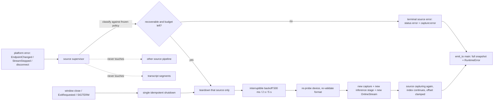

# Spec 10 — Capture Lifecycle and Resilience

## 1. Status, Ownership, Base, and Gates

- **Status:** Authorized for implementation in **DEVELOPMENT** mode after Spec 09 reaches `DEVELOPMENT COMPLETE`; not implemented.
- **Implementation owner:** One Spec 10 branch/worktree with one writer, with access to real macOS and Windows hardware.
- **Required base:** One clean integration SHA containing merged Specs 01–09, including Spec 09’s development-only capture/error, ordering, and composition contracts.
- **Allowed implementation predecessor:** Spec 09 `DEVELOPMENT COMPLETE`. Everything else is inherited transitively; Spec 05 remains blocked.
- **Parallel-safe peer:** Spec 11, in its own worktree from the same base SHA. The split is exact: **Spec 10 owns native lifecycle plus `src/features/audio/**`; Spec 11 owns transcript/application presentation including `src/App.tsx` and `src/features/transcript/**`.** Neither may edit the other’s paths.
- **Serialization rule:** if this spec needs a change to Spec 09’s frozen event union, `src/App.tsx`, or Spec 11’s presentation paths, it stops, records the requirement, and the integration owner serializes it after the first merge. Opportunistic edits to those paths are prohibited.
- **Successor gate:** Spec 12 may begin only its reachable development/acceptance-harness work after Specs 10 and 11 merge as `DEVELOPMENT COMPLETE`; Spec 12 remains `BLOCKED` and cannot return `PASS` or freeze packaging inputs without a production-approved ASR model.
- **ASR maturity gate:** Lifecycle success never promotes the `DevelopmentOnly` adapter. Recovery, soak, Start → Stop → Start, and shutdown evidence are architectural evidence; transcript-quality observations remain `NON-RELEASE EVIDENCE`.
- **Review level:** High. This spec owns recovery policy, shutdown determinism, panic/lock discipline, and long-run behavior.

## 2. Goal and Measurable Result

Make an already-working dual-source capture session survive the real world without lying to the user, leaking resources, or corrupting the transcript.

Measurable results, all observed on real macOS and Windows hardware:

1. Transient, source-local interruptions — a Windows default-output switch, an audio-service hiccup, a ScreenCaptureKit stream stop, a reconnected microphone — recover automatically within a **bounded, visible** retry budget, and transcription continues on that source without user action.
2. Permanent or user-owned conditions — permission denied, unsupported platform, model failure, internal invariant violation — never auto-retry. They land in a terminal source state with an actionable reason.
3. Sleep/wake and audio-device reconfiguration produce a defined outcome: either bounded recovery or a specific terminal error, never a session that looks alive while capturing nothing.
4. Sustained inference lag is detected, made visible as a distinct degraded state, and never silently mitigated by dropping a source, changing threads, or reducing quality.
5. A panic inside any native worker is contained: it becomes an `internal` source error with full resource release, not a poisoned lock, a hung UI, or a process abort.
6. No transition can hang the UI: `starting` and `stopping` are watchdog-bounded and always resolve to a real state.
7. Closing the window, quitting the app, and receiving a termination signal all run the same idempotent native shutdown before process teardown, with both sources released and the OS capture indicators cleared.
8. A **60-minute continuous dual-source session** holds flat resident memory, handle count, and thread count within recorded tolerances, with measured audio-time drift per source and no unbounded growth anywhere except the user’s transcript.
9. Recovery never rewrites, deletes, reorders, or duplicates finalized transcript content, and never changes a segment’s source.

A build that compiles and a single clean five-minute run are not results. Bounded recovery with recorded counters, contained panics, deterministic shutdown, and a flat one-hour soak are the results.

## 3. Verified Current Behavior

Verified while authoring this spec:

- `/Users/berat/mistaken` does not exist. `/Users/berat/mistaken-context` is documentation-only and contains Specs 01–09.
- Spec 03 froze the four commands, six events, `RuntimeSnapshot`/`ModelStatus`/`AudioSourceStatus`, the `RuntimeError` code set, monotonic revisions, full-snapshot status events, and `emit_to("main", …)`. It also froze that no Tauri emission, await, audio operation, or ASR operation happens while the state lock is held.
- Spec 04 froze the microphone path’s bounds and behavior: 100 × 20 ms pool, allocation-free callback, monitor thread, `waiting`/`receiving` activity at peak ≥ 0.01, one-second teardown budget, and error mapping including `device_disconnected` and `capture_stop_failed`.
- Spec 06 froze the recognizer boundary, the 30 × 100 ms inference stage per source, drop-newest overflow with `inference_lagging` rate-limited to one per second per source, a 300 ms bounded finish drain, segment ids, audio-time timestamps, and the fatal constraint that a recognizer stream must be fed exactly one sample rate for its life.
- Spec 07 froze macOS kinds including `StreamStopped` and `PermissionRequiresRestart`, and Spec 08 froze Windows kinds including `EndpointChanged`, `DeviceInvalidated`, and `AudioServiceDown`, each with its mapping onto `RuntimeError`.
- Spec 08 froze that WASAPI loopback produces no packets while idle, that the adapter synthesizes counted silence to keep the timeline continuous, and that synthesized silence never satisfies a `receiving` condition.
- **Spec 09 explicitly deferred recovery to this spec:** “Restarting the failed source requires an explicit Stop and Start. Automatic retry, reconnect, and re-enable belong to Spec 10 and must not be smuggled in here.” It also froze per-source ownership, the survivor-continuity rule, emission-order transcript ordering, structural source attribution, and the atomic-start rule.
- Spec 09 froze segment ids as `mic-<sessionId>-<index>` and `sys-<sessionId>-<index>`. This spec therefore cannot introduce an epoch component; id uniqueness across a recovery must come from continuing the per-source index, not from changing the format.
- Spec 02 froze the transcript reducer: ids are unique for the session, first occurrence is appended, an interim may be replaced only by a newer interim/final with the **same id, source, and `startedAtMs`**, finals are immutable, and a same-id source or start change is rejected as `segment_identity_conflict`.
- Tauri 2 exposes the application event loop through `RunEvent`, with `Ready`, `Resumed`, `WindowEvent`, `ExitRequested`, and `Exit` variants (verified against tauri 2.11.5 documentation), which is the hook surface available for deterministic shutdown.

No implementation report is authoritative. During implementation the merged source, the installed Tauri and platform-crate documentation, and observed real-hardware behavior become authoritative; any difference from this section is recorded rather than assumed away.

## 4. Scope

### In scope

- A single native **supervisor** that owns per-source lifecycle: start, watchdog-bounded transitions, bounded recovery, terminal failure, and teardown.
- The frozen recovery policy: which conditions are recoverable, the attempt budget, the backoff schedule, cancellation, and budget reset rules.
- Recovery-safe identity and timeline rules that satisfy Spec 02’s reducer and Spec 09’s ordering contract without changing either.
- Sleep/wake and device-reconfiguration handling on both platforms.
- Sustained-lag detection, a distinct visible degraded state, and the explicit prohibition on automatic mitigation.
- Panic containment at every native worker boundary, lock-poisoning strategy, and a lock-discipline audit.
- Deterministic shutdown for window close, app exit, and termination signals, sharing one idempotent native stop path.
- Per-source lifecycle counters exposed through existing status events only, and their presentation in `src/features/audio/**`.
- A 60-minute dual-source soak procedure with sampled resource and drift evidence on both hosts.
- Rust tests for policy, budget, cancellation, watchdog, panic containment, and counter accounting, plus frontend tests for recovering/degraded/terminal presentation.

### Out of scope

- Any change to Spec 03’s commands, events, payload shapes, error codes, or revision rules, and any change to Spec 09’s frozen ordering, attribution, atomic-start, or survivor-continuity contracts.
- Any change to Spec 02’s reducer, formatter, serializer, `Clear`, or `Copy All`, and any edit to `src/features/transcript/**` or `src/App.tsx`. Spec 11 owns those.
- Any edit to `crates/macos-system-audio/**`, `crates/windows-system-audio/**`, or `benchmarks/**`.
- Re-benchmarking, model changes, recognizer configuration changes, and endpoint-rule tuning.
- New capture features: device hot-plug enumeration UI, output-device selection, per-application capture, new sources, or audio processing.
- Keyboard shortcuts, auto-follow, jump-to-latest, announcement tuning, and accessibility polish outside `src/features/audio/**`. Spec 11 owns those.
- The formal offline/privacy/performance acceptance gate and packaging. Specs 12–14 own those.
- Persistence of any kind, including remembering a failed source, a retry count, or a device across launches.
- Crash reporting, telemetry, remote diagnostics, and log files.
- Automatic quality degradation: reducing threads, switching models, resampling differently, or disabling a source to save CPU.

## 5. Owned Files and Forbidden Concurrent Files

### Owned during Spec 10 implementation

- `src-tauri/src/audio/supervisor.rs` (or the exact equivalent module the merged layout dictates) — per-source lifecycle, recovery, watchdog
- `src-tauri/src/audio/microphone/**` and `src-tauri/src/audio/system/**` — focused lifecycle edits only: supervision hooks, error routing, teardown ordering. Capture, format, permission, and conversion logic stays as merged.
- `src-tauri/src/asr/**` — worker supervision, panic containment, bounded drain on recovery, lag detection
- `src-tauri/src/commands/runtime.rs`, `src-tauri/src/state/runtime.rs` — recovery-aware state machine, generation and cancellation handling, lock discipline
- `src-tauri/src/lib.rs` — application lifecycle hooks and the single idempotent shutdown path
- `src/features/audio/**` — recovering, degraded, and terminal source presentation
- Tests colocated with the owned modules
- `docs/lifecycle-policy.md` or the exact equivalent the integration owner designates — the frozen recovery policy table and soak procedure
- This spec’s implementation-evidence fields

### Consumed unchanged

- `src/types/**`, `src/lib/tauri/**`, `src/features/transcript/**`, `src/App.tsx`, `src/index.css`
- `src-tauri/src/audio/mod.rs` frozen public types, `src-tauri/Cargo.toml`, `src-tauri/Cargo.lock`, `src-tauri/tauri.conf.json`, `capabilities/**`, `permissions/**`, `Info.plist`, `build.rs`
- Both platform crates and `benchmarks/**`

This spec adds **no dependency**. If a lifecycle need seems to require one, it is recorded as a requirement for the integration owner, not added.

### Yielded requirements

Recorded here, implemented by Spec 11 or the integration owner:

1. Any new prop, slot, or layout change in `src/App.tsx` needed to render recovering/degraded states outside `src/features/audio/**`.
2. Any transcript-surface treatment of a gap caused by a source outage, if Spec 11 decides one is needed. This spec renders source state only; it never annotates the transcript.

### Forbidden concurrent files

- Spec 11 must not edit `src/features/audio/**`, `src-tauri/**`, or `docs/lifecycle-policy.md`.
- Spec 10 must not edit `src/App.tsx`, `src/features/transcript/**`, the platform crates, `benchmarks/**`, `docs/context/**`, or another spec file.

## 6. Contracts Consumed and Produced

### Recovery policy produced — frozen

Recovery is **per source**, **only while the session is otherwise live**, and **only for transient, source-local, non-user-owned causes**.

| Condition (crate kind → `RuntimeError`) | Recoverable | Rationale |
|---|---|---|
| Windows `EndpointChanged` → `device_disconnected` | **yes** | the user switched output; the new default is capturable immediately |
| Windows `DeviceInvalidated` → `device_disconnected` | **yes** | unplug/reconfigure; the new default may be capturable |
| Windows `AudioServiceDown` → `system_audio_unavailable` | **yes** | the audio service restarts on its own |
| macOS `StreamStopped` → `system_audio_unavailable` | **yes** | system-initiated stop, often after display/audio reconfiguration |
| microphone `device_disconnected` | **yes** | reconnecting the same device, or an available replacement default |
| `capture_start_failed` during a recovery attempt | **yes**, within budget | transient device or driver state |
| `audio_queue_overflow`, `inference_lagging` | **not applicable** | degradation, not failure; the source stays live |
| `microphone_permission_denied`, `system_audio_permission_denied`, macOS `PermissionRequiresRestart` | **no** | the user owns this decision; retrying is nagging |
| `unsupported_platform`, macOS/Windows version floor | **no** | permanent on this host |
| `model_missing`, `model_load_failed`, `model_unsupported` | **no** | requires a file fix, and it fails the whole session, not one source |
| `UnsupportedFormat` / mid-session rate change | **no** | the endpoint cannot feed this recognizer stream |
| `internal`, invariant violation, contained panic | **no** | state is untrusted; end the source cleanly |
| `capture_stop_failed` | **no** | already terminal for that source; resources are released regardless |

Budget and schedule, frozen:

- **3 attempts per source per session.** Backoff before attempts 1, 2, 3: **500 ms, 2 s, 5 s**.
- The budget **resets** after that source has been continuously `capturing` with at least one `receiving` observation for **60 s**, so an all-day session survives several unrelated device changes while a flapping device still terminates quickly.
- Attempts are visible: the source status carries the attempt number and the total, and the UI says `Reconnecting system audio… attempt 2 of 3`.
- Budget exhaustion is terminal for that source, with the last underlying `RuntimeError` preserved as the reason, plus a visible statement that automatic recovery stopped.
- Recovery never changes the requested source set: a source the user did not request is never started, and a terminal source is never silently re-enabled.
- Recovery is **cancellable**: Stop, window close, app exit, or a terminal session error cancels pending backoff immediately by generation, and a late attempt can never install a stream into a dead session.
- While one source recovers, the other source is untouched — no lock is shared across its audio path, and aggregate `captureStatus` stays `listening` because a recovering source is still part of a live session.
- If **all** requested sources are simultaneously in recovery, `captureStatus` remains `listening` with both sources `recovering`; it becomes `error` only when every requested source is terminal.

### Recovery-safe identity and timeline contract produced

Recovery must not violate Spec 02’s reducer or Spec 09’s ordering. Frozen rules:

1. **Session id and segment-id format are unchanged.** A recovery does not create a new session id and does not add an epoch component.
2. **The per-source segment index continues**; it is never reset by a recovery. Only a new session resets it to `0`. This keeps ids unique for the session, as Spec 02 requires.
3. **The in-flight interim segment of a failing source is abandoned**: no final is emitted for it, and no further partial is emitted for its id. Spec 02 leaves it as a stale interim row until `Clear`, which is truthful — that utterance genuinely never finalized.
4. **The recognizer stream is recreated**, not reused, on every recovery attempt, because the device’s sample rate may have changed. The new stream is fixed to the newly negotiated rate, satisfying Spec 06’s fatal constraint.
5. **Timestamps stay monotonic per source.** The recovered source records a new start offset against the unchanged session clock origin, and that offset is clamped to be **≥ the last emitted `endedAtMs` for that source**, so no post-recovery segment can appear to start before a pre-recovery segment ended.
6. **The audio gap is not fabricated.** Time lost to an outage is simply absent from that source’s fed frames; no silence is synthesized to cover it, and no transcript annotation is inserted. The outage is visible in source status, not in the transcript.
7. Nothing about recovery mutates, deletes, reorders, or duplicates a finalized segment, and no segment’s `source` ever changes.

### Sustained-lag contract produced

Per-source, over a sliding **10 s** window of audio time:

- `lagging` is entered when dropped inference blocks exceed **20 %** of blocks that should have been consumed in the window.
- `lagging` is left when the drop rate stays at **0 %** for a full window.
- Entering and leaving emit one status event each; the existing `inference_lagging` `capture:error` stays rate-limited to one per second per source, exactly as Spec 06 froze.
- The UI shows a distinct, non-destructive degraded state naming the affected source: `System audio is transcribing slower than real time. Some audio is being skipped.`
- **No automatic mitigation.** Thread counts, model configuration, sample rates, endpoint rules, and source enablement are never changed by the app in response to lag. The user may Stop, or disable a source and restart. This keeps the recognizer’s behavior identical to what Spec 05 benchmarked and Spec 12 will accept.

### Watchdog and shutdown contract produced

- **Transition watchdogs:** `starting` is bounded at **10 s** for all non-user-interactive work; a macOS permission prompt is user-driven and is explicitly excluded from that bound, with its own cancellation-on-Stop path. `stopping` is bounded at **3 s**. A watchdog expiry force-releases resources, commits a real state, and reports `capture_start_failed` or `capture_stop_failed`. The UI is never left in a transitional state.
- **One shutdown path.** A single idempotent native `shutdown()` releases both sources, joins both monitors and both workers within the one-second budget, drops both streams, and leaves the recognizer to normal process teardown. It is called from exactly three places: the window close event, the application `ExitRequested`/`Exit` handling, and the termination-signal handler.
- **Signals.** `SIGINT` and `SIGTERM` on macOS and `CTRL_C`/close events on Windows run `shutdown()` before exit. `SIGKILL` and forced termination cannot be handled; the spec states that plainly and relies on the OS releasing device handles.
- **No dependence on the frontend.** Shutdown never waits for a React listener, an IPC response, or a webview state; the window may already be gone.
- **Idempotency.** Repeated `shutdown()` calls are safe, and a shutdown during `starting`, recovery backoff, or `stopping` cancels the generation and releases whatever exists.

### Panic and lock contract produced

- Every native worker body — microphone monitor, system monitor, both ASR workers, the supervisor thread — runs inside a catch boundary. A panic is converted to `AudioErrorKind::Internal` for that source, triggers that source’s terminal teardown, and is reported once as `internal`. It never aborts the process, never leaves a stream started, and never propagates across sources.
- The panic payload is **not** logged verbatim; a sanitized location/kind summary is recorded, because a payload can contain arbitrary data.
- No `unwrap()`/`expect()` on a lock. A poisoned lock is treated as an untrusted-state condition: the session ends with `internal` and full release. Poison recovery that keeps using the state is prohibited.
- Lock discipline is audited and asserted: no lock is held across capture, permission, stream construction, `play`/`stop`, thread join, backoff sleep, recognizer work, or Tauri emission. A state transition clones the small snapshot, unlocks, then emits.
- Backoff waits happen on the supervisor thread with interruptible waits, never by blocking a command handler or an audio thread.

### Status presentation contract produced

Within Spec 03’s frozen `AudioSourceStatus`, this spec uses only existing variants plus the already-frozen fields, and expresses recovery and lag through them:

- recovering → `status: "starting"` for that source, with the attempt counter surfaced in `src/features/audio/**` from the accompanying `capture:error` sequence, so no new payload field is introduced;
- degraded → the source stays `capturing` with its `activity`, and the degraded flag is derived in the frontend from the throttled `inference_lagging` error stream;
- terminal → `status: "error"` with the preserved `RuntimeError`.

If this expression proves insufficient in implementation, the requirement to extend the frozen payload is **recorded and escalated**, never patched locally — extending the event union is a Spec 09-frozen contract change.

### Counter contract produced

Per source, per session, recorded in evidence and never persisted:

`recovery_attempts`, `recovery_successes`, `terminal_reason`, `lag_windows_entered`, `dropped_capture_blocks`, `dropped_inference_blocks`, `watchdog_expiries`, `contained_panics`, plus the Windows crate’s captured/silent/synthesized frame counters passed through unchanged.

## 7. User Flow and Developer Verification Flow

### Recovery flow

1. The user is in a live dual-source session.
2. They switch the Windows default output device. The system source reports `EndpointChanged`.
3. The supervisor tears down only that source, shows `Reconnecting system audio… attempt 1 of 3`, waits 500 ms, resolves the new default endpoint, validates its mix format, creates a fresh recognizer stream at the new rate, and restarts capture.
4. Within about a second, the system source is `capturing` again and system lines resume. The transcript’s earlier content is untouched; the abandoned interim row stays as an interim that never finalized.
5. The microphone source never paused.
6. After 60 s of healthy capture with real signal, the system source’s recovery budget resets.

### Terminal flow

1. The user revokes screen-recording permission mid-session, or the same device fails three times in a row.
2. The system source becomes terminal with its exact reason plus `Automatic reconnection stopped.`
3. The microphone keeps transcribing; `captureStatus` stays `listening`.
4. The user fixes the OS state, presses Stop, then Start. Both sources start atomically per Spec 09.

### Lag flow

1. Under heavy load, the system inference stage drops more than 20 % of a 10 s window.
2. The UI shows the degraded state for that source; transcription continues with skipped audio.
3. Nothing is auto-tuned. When the load clears and a full window has zero drops, the degraded state disappears.

### Sleep/wake flow

1. The machine sleeps during a live session.
2. On wake, each source either resumes, recovers within budget, or reports a specific terminal error. The recorded outcome per platform is part of this spec’s evidence.
3. No source remains `capturing` while delivering nothing: the absence of real blocks moves it back to `waiting`, and a platform error moves it to recovery or terminal.

### Shutdown flow

1. The user closes the window during dual capture. `shutdown()` runs, both sources release, the OS microphone indicator clears, and the process exits.
2. Quitting from the application menu and sending `SIGTERM` produce the same sequence.
3. Relaunch starts idle, with no memory of the previous session, failure, or retry count.

### Developer verification flow

- Rust tests drive the policy table, budget arithmetic, backoff scheduling, budget reset, cancellation by generation, watchdog expiry, panic containment, poisoned-lock handling, lag-window math, and counter accounting with a deterministic fake backend.
- Frontend tests cover recovering/degraded/terminal presentation and the attempt counter, without touching transcript paths.
- Real verification injects the failures physically: device switch and unplug, audio-service restart on Windows, permission revocation on macOS, sleep/wake on both, plus a CPU-saturation run for lag and a 60-minute soak.
- All real verification runs with networking disabled.

## 8. UI Behavior, States, Tokens, and Accessibility

All UI work lives in `src/features/audio/**`. The transcript surface is not touched.

| Source state | Text | Token guidance |
|---|---|---|
| capturing, healthy | `Capturing` / `Waiting for audio…` | `--text-secondary`, existing icons |
| recovering | `Reconnecting <source>… attempt N of 3` | `--state-warning`, `TriangleAlert`, no spinner animation |
| degraded by lag | `<Source> is transcribing slower than real time. Some audio is being skipped.` | `--state-warning` |
| terminal | the exact reason plus `Automatic reconnection stopped.` | `--state-error`, `TriangleAlert` |

Rules:

- Every state is conveyed by text plus icon, never color alone, and is placed next to the source control it describes.
- The attempt counter is textual; no progress bar, no countdown animation, nothing that implies precision the app does not have.
- Recovery and degradation never disable `Stop`, never alter `Clear`/`Copy All` availability, and never modify transcript rows.
- Terminal state text is actionable and platform-correct, reusing Spec 09’s per-platform copy rules: macOS permission guidance never appears on Windows, and Windows failures never borrow permission wording.
- Status changes are announced politely at most once per state transition per source; rapid flapping must not flood a screen reader, and the throttle used is recorded.
- Layout stays usable at `1040 × 720` and `720 × 520`; recovery text wraps or truncates with an accessible full value rather than pushing controls off-screen.
- Reduced motion is unaffected because this spec introduces no animation.

## 9. Frontend → Tauri IPC → Rust / Audio / ASR Data Flow



Rules:

- Classification, teardown, backoff, and restart all run on the supervisor thread. Command handlers only signal it; audio and ASR threads only report.
- Every emission carries Spec 03’s frozen payloads and happens outside the state lock.
- No PCM, sample, level series, panic payload, device id, endpoint id, or text ever enters an event payload or a log.
- Recovery touches neither the other source’s pipeline nor any transcript state; the frontend derives presentation from status and error events only.

## 10. Platform, Permissions, Offline, Privacy, and Fallback

### macOS

- Permission-related conditions are never retried; `PermissionRequiresRestart` explains the relaunch instead of looping.
- `StreamStopped` after display or audio reconfiguration is recoverable within budget.
- Sleep/wake behavior is measured on the supported minimum-or-later version and recorded per source.
- No new usage description, entitlement, or capability. The single permission request stays inside an explicit user start, per Specs 07 and 09.

### Windows

- `EndpointChanged`, `DeviceInvalidated`, and `AudioServiceDown` are the primary recoverable conditions; an audio-service restart is exercised deliberately.
- Recovery re-resolves the **current** default render endpoint, so switching outputs mid-session lands on the device the user is now hearing.
- Synthesized silence never satisfies `receiving`, so a recovered-but-idle endpoint reports `waiting`, not false success.
- No permission wording, no elevation, no driver, no virtual device — unchanged from Spec 08.

### Offline and privacy

- Every flow, including all recovery paths and the 60-minute soak, runs with networking disabled.
- No socket, DNS, HTTP, telemetry, crash-report, or update path exists. Lifecycle counters live in memory and appear only in recorded evidence.
- **No recognized text, panic payload, device id, endpoint id, or model path is ever logged**, at any level, including debug builds.
- Nothing about a failure, retry count, or device choice is persisted; relaunch starts clean.
- Soak evidence records counts, durations, RSS, handle and thread counts, and drift figures — never transcript content.

### Fallback rules

- Recoverable condition: bounded, visible retry, then terminal. Never infinite retry, never exponential growth beyond the frozen schedule, never a hidden retry.
- Non-recoverable condition: terminal with an actionable reason. Never a retry loop that hides a permission decision.
- Lag: visible degradation only. Never automatic thread, model, rate, or source changes.
- Panic or poisoned lock: contained, source-terminal, resources released. Never process abort, never continued use of untrusted state.
- Watchdog expiry: force release and report. Never a stuck transitional UI.
- Unhandleable termination (`SIGKILL`, power loss): stated as unhandleable; the OS releases handles. Never claimed as graceful.

## 11. Resource Lifecycle, Bounded Buffering, Errors, and Recovery

### Bounds unchanged, enforced across recoveries

| Stage | Bound | Recovery behavior |
|---|---|---|
| capture pool per source | 100 × 20 ms = 2 s | fully released on source teardown, freshly allocated on restart |
| inference stage per source | 30 × 100 ms = 3 s | same |
| recognizer stream per source | one | dropped and recreated per attempt |
| recognizer | one per process | never reloaded by a recovery |
| in-memory audio, both sources | ≤ 10 s | unchanged by recovery; a recovering source holds none |
| transcript | user-owned, `Clear` only | never touched by lifecycle events |

Every recovery attempt must return total allocation to the pre-failure level; a measurable ratchet across repeated recoveries is a blocking defect.

### Supervisor state machine

```text
per source:
  idle -> starting -> capturing -> stopping -> idle
  starting|capturing -> failed(classify)
  failed(recoverable, budget>0) -> backoff -> starting        # attempt N
  failed(recoverable, budget=0) -> terminal
  failed(non-recoverable) -> terminal
  backoff|starting -> cancelled -> idle                      # stop/close/exit
  capturing(healthy 60 s with signal) -> budget reset

session:
  listening while any requested source is capturing or recovering
  error only when every requested source is terminal
  stopping cancels all pending backoff by generation
```

### Error handling additions

This spec adds **no new error code**. It adds classification, budget, and the preserved terminal reason. `internal` gains two new causes: a contained panic and a poisoned lock, both with sanitized detail.

### Long-run stability requirements

- 60-minute continuous dual-source session on each host, with samples at least every 5 minutes of: RSS, thread count, handle/descriptor count, per-source counters, and audio-time versus monotonic-clock drift.
- RSS growth after the first 5 minutes must stay within **5 %**; thread and handle counts must be exactly flat; audio-time drift per source is recorded with its measured value and must be monotonic and bounded, with the observed figure stated rather than assumed.
- Transcript growth is the only permitted monotonic growth; its measured size after 60 minutes is recorded so Spec 12 can reason about it.

## 12. Numbered Measurable Acceptance Criteria

1. **Base, isolation, and parallel split — both hosts:** Spec 10 starts from the recorded post-Spec-09 SHA in its own worktree; the final diff touches only owned paths; `git status` shows no change to `src/App.tsx`, `src/features/transcript/**`, the platform crates, `benchmarks/**`, manifests, capabilities, or another spec file.
2. **No contract widening — platform-neutral:** No command, event name, payload field, error code, or revision rule is added or changed; Spec 02, 03, and 09 test suites pass unmodified; any need to extend the frozen payload is recorded as an escalation rather than implemented.
3. **No new dependency — both hosts:** `Cargo.toml`, `Cargo.lock`, and `package.json` are unchanged; the lockfiles show no drift.
4. **Frozen policy implemented exactly — Rust tests:** Every row of the section 6 policy table is exercised: recoverable conditions retry, non-recoverable conditions never retry, and the classification is exhaustive so a new upstream kind cannot default to “recoverable”.
5. **Budget and backoff — Rust tests plus real hosts:** At most 3 attempts per source per session with 500 ms / 2 s / 5 s backoff; exhaustion is terminal with the last underlying reason preserved and `Automatic reconnection stopped.` shown.
6. **Budget reset — Rust tests plus real run:** After 60 s of continuous `capturing` including at least one `receiving` observation, the budget resets, and a flapping device still terminates within its budget.
7. **Cancellation — Rust tests plus real hosts:** Stop, window close, and app exit during backoff or a recovery attempt cancel immediately; a late attempt can never install a stream, worker, or stage into a dead session.
8. **Windows endpoint recovery — real Windows:** Switching the default output device during dual capture recovers on the **new** endpoint within about one second of the scheduled backoff, system transcription resumes, and the microphone source is never interrupted.
9. **Windows invalidation and service recovery — real Windows:** Unplugging the active output device and restarting the Windows audio service each recover within budget or terminate with the exact reason; both outcomes are recorded with counters.
10. **macOS stream-stop recovery — real macOS:** An induced ScreenCaptureKit stream stop recovers within budget; a revoked screen-recording permission is terminal with no retry and correct guidance.
11. **Microphone recovery — both hosts:** Disconnecting and reconnecting the microphone during dual capture recovers that source within budget while system transcription continues uninterrupted.
12. **Survivor untouched — both hosts plus tests:** Across every induced failure, the surviving source’s block rate, activity, and segment cadence show no interruption, and no lock or resource is shared with the failing source’s recovery.
13. **Transcript integrity across recovery — both hosts plus tests:** No finalized segment is deleted, rewritten, reordered, or duplicated; no segment’s source changes; the failing source’s in-flight interim receives no final and no further partial; `segment_identity_conflict` is never triggered by a recovery.
14. **Identity and timeline rules — tests plus real run:** The session id and id format are unchanged, the per-source index continues across recoveries with no duplicate id, each attempt creates a fresh recognizer stream at the newly negotiated rate, and the recovered start offset is clamped so timestamps stay monotonic per source.
15. **Sustained-lag detection — tests plus real run:** Under induced CPU saturation the affected source enters the degraded state above a 20 % drop rate in a 10 s window and leaves it after a clean window; `inference_lagging` stays ≤ 1/s per source; **no** thread, model, rate, endpoint-rule, or source-enablement change occurs automatically.
16. **Sleep/wake — real macOS and Windows:** After sleep and wake during a live dual session, each source resumes, recovers within budget, or reports a specific terminal error; no source stays `capturing` while delivering no real blocks; the per-platform outcome is recorded.
17. **Panic containment — Rust tests plus review:** An injected panic in each worker boundary becomes one `internal` source error with full resource release, no process abort, no cross-source effect, and no verbatim payload in any log; a poisoned lock ends the session with `internal` rather than reusing state.
18. **Watchdogs — tests plus real hosts:** `starting` bounded at 10 s excluding the user-driven macOS prompt, `stopping` bounded at 3 s; an induced hang force-releases resources, commits a real state, reports the correct code, and never leaves the UI transitional.
19. **Deterministic shutdown — real macOS and Windows:** Window close, application quit, and `SIGTERM`/console close each run the one idempotent shutdown during active dual capture: both sources release, workers join within one second, OS capture indicators clear, the process exits, and relaunch starts idle with no persisted failure, retry count, or device memory.
20. **Lock discipline — review plus tests:** No lock is held across capture, permission, stream construction, play/stop, join, backoff, recognizer work, or emission; no `unwrap()`/`expect()` on a lock exists in the owned paths.
21. **60-minute soak — both reference hosts:** A continuous dual-source session runs 60 minutes with samples at least every 5 minutes; RSS growth after minute 5 stays within 5 %, thread and handle counts are flat, per-source counters and measured audio-time drift are recorded, and repeated recoveries during the soak leave no allocation ratchet.
22. **Presentation and accessibility — both hosts:** Recovering, degraded, and terminal states render in `src/features/audio/**` with text plus icon, correct per-platform wording, a textual attempt counter, polite throttled announcements, and usable layout at both window sizes; the transcript surface is unchanged.
23. **Offline, privacy, and checks — both hosts:** All flows including the soak run with networking disabled; inspection finds zero network paths, zero persistence, and zero logging of text, panic payloads, device ids, endpoint ids, or model paths; typecheck, lint, frontend tests and build, `cargo fmt --check`, `cargo check`, `cargo clippy --all-targets --all-features -- -D warnings`, `cargo test`, and real Tauri launches pass on both hosts.
24. **High-capability review — integration:** Review covers policy exhaustiveness, budget and cancellation correctness, identity/timeline safety against Spec 02’s reducer, survivor isolation, panic and lock discipline, watchdog and shutdown determinism, soak evidence, privacy, and the Spec 11 boundary; every High/Medium finding is fixed and re-verified, and yielded requirements are recorded.

## 13. Acceptance Criterion → Verification/Test Mapping

| AC | Verification or permanent test | Evidence to record |
|---|---|---|
| 1 | Inspect base SHA, worktree, branch, and final changed-path list | Root, branch, base SHA, owned-path diff, zero forbidden-path changes |
| 2 | Run merged Spec 02/03/09 suites unmodified; diff contract files | Suite results, zero-contract-change proof, escalation notes if any |
| 3 | Inspect manifests and lockfiles | Zero-diff confirmation |
| 4 | Table-driven classification tests with an exhaustive match | Per-row test result, exhaustiveness proof |
| 5 | Budget/backoff tests with a controllable clock; induced real failures | Attempt counts, measured backoff, terminal text |
| 6 | Reset test with a controllable clock; flapping-device simulation | Reset timing, flap termination behavior |
| 7 | Cancellation tests at each recovery step; real Stop/close during backoff | No-late-install proof, resource state after cancel |
| 8 | Switch the Windows default output device during dual capture | Detection latency, attempt number, resumed endpoint, mic continuity |
| 9 | Unplug the output device; restart the Windows audio service | Outcome per case, counters, terminal reasons |
| 10 | Induce a ScreenCaptureKit stop; revoke screen recording | Recovery result, zero-retry proof for permission, displayed guidance |
| 11 | Disconnect and reconnect the microphone during dual capture on each host | Recovery result, survivor continuity |
| 12 | Sample the survivor’s block cadence and activity during every induced failure | Block-rate continuity, review note on shared state |
| 13 | Compare transcript snapshots before/after each failure; reducer tests | Segment counts, unchanged finals, abandoned-interim observation |
| 14 | Identity/timeline tests with synthetic frames; inspect real ids and offsets | Index continuity, unique ids, new stream rates, clamped offsets |
| 15 | CPU-saturation run plus lag-window unit tests; review for auto-tuning | Drop rates, state transitions, error rate, zero-auto-mitigation finding |
| 16 | Sleep and wake during a live dual session on each host | Per-source outcome, status trace, recorded platform behavior |
| 17 | Injected panics per worker; poisoned-lock test; log inspection | Contained-panic counts, released resources, sanitized log content |
| 18 | Induced hangs in start and stop paths; real transitions | Watchdog expiry timing, committed state, reported codes |
| 19 | Close window, quit app, and send termination signal during dual capture | Release observations, join durations, indicator clearing, relaunch state |
| 20 | Source review plus targeted concurrency tests | Lock audit notes, absence of lock `unwrap`/`expect` |
| 21 | 60-minute soak on each host with 5-minute sampling | Sample table: RSS, threads, handles, counters, drift, transcript size |
| 22 | Frontend state tests plus real visual/keyboard/screen-reader checks at both sizes | Rendered text per state, announcement throttle, layout observations |
| 23 | Run all flows networking-disabled; inspect sockets/storage/logs; run the full check set | Disable method, zero-findings statement, exact commands and exits |
| 24 | High-capability review of the finished diff and the Spec 11 boundary | Findings, dispositions, yielded requirements, final Git state |

Permanent tests protect classification exhaustiveness, budget and backoff arithmetic, cancellation, identity and timeline rules, lag-window math, panic containment, watchdog behavior, and counter accounting. They must not assert function forwarding, mock echoes, constant existence, source text, or bare non-throwing behavior. Physical device switching, permission revocation, service restart, sleep/wake, shutdown, and the soak require both real hosts and cannot be replaced by mocks.

## 14. Ordered Implementation Plan

1. After Spec 09 merges with its review closed and its contracts frozen, create the Spec 10 worktree from the recorded base. Record root, branch, base SHA, and confirm Spec 11 owns a disjoint worktree and paths.
2. Re-read the canonical context, Specs 02–12, Spec 09’s frozen contract record, both platform crates’ error kinds, and the installed Tauri documentation for the application event loop. Run baseline checks on both hosts.
3. Write `docs/lifecycle-policy.md` with the frozen policy table, budget, backoff, reset rule, lag thresholds, watchdog bounds, and the soak procedure, so implementation follows a recorded decision rather than inventing one.
4. Implement the classification function as an exhaustive match over every crate kind and `RuntimeError`, with table-driven tests, before any supervisor logic exists.
5. Implement the supervisor: per-source state machine, generation-based cancellation, interruptible backoff, and per-source teardown that provably touches nothing else.
6. Implement recovery-safe identity and timeline rules: continued index, abandoned interim, fresh stream per attempt, clamped offset, no synthesized gap.
7. Implement the budget, the reset condition, and the preserved terminal reason.
8. Implement panic containment at every worker boundary, the poisoned-lock policy, and sanitized detail; add injected-panic tests.
9. Implement the transition watchdogs, excluding the user-driven macOS prompt from the `starting` bound, with induced-hang tests.
10. Implement the single idempotent shutdown path and wire it to the window close event, application exit handling, and termination signals on both platforms.
11. Implement sustained-lag detection and the status derivation, with window-math tests and an explicit review that no auto-mitigation exists.
12. Implement the per-source counters and the `src/features/audio/**` presentation for recovering, degraded, and terminal states; record any yielded requirement for `App.tsx` instead of editing it.
13. Add the remaining Rust and frontend behavior tests mapped to the acceptance criteria. Do not add a production fake backend, a debug recording path, a text-logging path, or a test-only command.
14. Verify on real macOS with networking disabled: endpoint/stream-stop recovery, permission revocation, microphone disconnect/reconnect, cancellation during backoff, watchdog expiry, panic injection, sleep/wake, lag under saturation, close/quit/signal shutdown, relaunch.
15. Repeat step 14 on real Windows, adding the default-output switch, device unplug, and audio-service restart cases.
16. Run the 60-minute dual-source soak on each host with 5-minute sampling; record the full sample table and check for allocation ratchets after repeated recoveries.
17. Review the whole diff for policy gaps, retry loops, lock discipline, identity and timeline safety against Spec 02’s reducer, survivor isolation, shutdown determinism, privacy and logging, and Spec 11 boundary respect. Fix every High/Medium finding and rerun affected proof.
18. Remove temporary fault-injection hooks, instrumentation, and scratch files; confirm no injection path remains reachable in production builds.
19. Update only this spec’s evidence and the lifecycle-policy document; create the focused local commit unless directed otherwise; report roots, branches, SHAs, hosts, devices, counters, and soak tables; do not push unless requested.

## 15. Risks, Rollback, Cleanup, and Preservation Rules

### Risks and mitigations

- **Retry loops that hide a real problem:** unbounded or invisible retries would make a broken source look alive. Freeze 3 attempts with a recorded schedule, surface the attempt counter, and make exhaustion terminal with the underlying reason preserved.
- **Nagging on user-owned decisions:** retrying a denied permission would spam prompts and guidance. Permission conditions are never retried.
- **Segment identity collision after recovery:** resetting the index would reuse ids and violate Spec 02’s uniqueness rule. Continue the index; only a new session resets it.
- **Reducer rejection after recovery:** replacing an interim with a different `startedAtMs` triggers `segment_identity_conflict`. Abandon the in-flight interim instead of trying to finish it.
- **Timestamp inversion:** a recovered source could report an earlier start than its own last final. Clamp the new offset to the last emitted `endedAtMs` and assert monotonicity in tests.
- **Fabricated gap audio:** synthesizing silence to cover an outage would invent content the machine never produced. The gap is simply absent and visible only in source status.
- **Fatal rate change:** reusing a recognizer stream after a device change could feed a new rate into an old stream and terminate the process (Spec 06). Always create a fresh stream per attempt.
- **Survivor collateral damage:** a shared lock or shared teardown path could stall the healthy source. Per-source ownership, no shared lock across audio paths, and cadence sampling during every induced failure.
- **Hidden auto-mitigation:** “helpfully” reducing threads or disabling a source under load would invalidate Spec 05’s benchmark and Spec 12’s acceptance. Degradation is visible only; no automatic change is permitted.
- **Panic poisoning:** an unhandled panic could poison a lock, hang the UI, or abort the process. Catch at every worker boundary, treat poison as untrusted state, and never `unwrap()` a lock.
- **Payload leakage through logs:** a panic payload or error dump can contain private data. Log sanitized location/kind only.
- **Stuck transitions:** a hung device call could pin the UI in `starting`/`stopping`. Watchdogs with force release, excluding the genuinely user-driven prompt.
- **Non-deterministic shutdown:** relying on React cleanup or a single close hook would leave devices held. One idempotent path from three entry points, plus a plain statement that `SIGKILL` is unhandleable.
- **Slow leak over hours:** a small per-recovery ratchet would only show in a long session. 60-minute soak with 5-minute sampling and a flat-count requirement.
- **Spec 11 collision:** both specs run in parallel against one composition point. `App.tsx` and transcript paths are Spec 11’s; needs are yielded, never edited here.

### Rollback

- Before merge, abandon the Spec 10 branch/worktree; Spec 09’s behavior remains intact.
- After merge, reverting Spec 10 must restore Spec 09’s explicit-Stop-and-Start recovery model, remove the supervisor, watchdogs, lag detection, and lifecycle presentation, and leave Specs 01–09 and Spec 11’s paths untouched.
- Once Spec 12 accepts against these behaviors, use a coordinated forward fix or revert dependent commits in reverse order.
- Never reset, clean, or delete unrelated user work, another worktree, OS permission settings, audio device configuration, or `/Users/berat/mistaken-context`.

### Required cleanup

- Remove every fault-injection hook, controllable-clock shim, panic-injection switch, and saturation harness from production paths; any retained test double lives in test code only and cannot be selected at runtime.
- Remove soak sampling scripts’ scratch output, instrumentation logs, and temporary counters exposed to the UI beyond the frozen presentation.
- Remove unused imports, dead classification branches proven impossible, and any leftover single-source lifecycle assumption.
- Verify nothing private — audio, text, panic payload, device or endpoint id — is staged for commit.

### Preservation rules

- Preserve Spec 03’s command/event/error/revision surface, Spec 09’s ordering, attribution, atomic-start, and survivor-continuity contracts, and Spec 02’s reducer, formatter, serializer, `Clear`, and `Copy All` semantics.
- Preserve both platform crates and their captured-versus-synthesized accounting and permission honesty.
- Preserve Spec 06’s `DevelopmentOnly` maturity, recognizer configuration, endpoint rules, output passthrough, throttling, non-release labeling, and single-final guarantee; recovery changes lifecycle, never recognition behavior or maturity.
- Preserve all frozen bounds: 2 s capture pools, 3 s inference stages, ≤ 10 s in-memory audio, one-second teardown, 300 ms drain.
- Preserve microphone/system separation, local-only processing, no account, no backend, no database, no persistence of any kind, no upload, no cloud fallback, and no grammar correction.
- Preserve the user’s OS permission choices and audio configuration; verification never resets them.
- Preserve Spec 11’s ownership of `src/App.tsx` and `src/features/transcript/**`.

## 16. Definition of Done and Evidence Record

Spec 10 is `DEVELOPMENT COMPLETE` only when the real Mistaken application on both supported platforms recovers
transient source-local failures within a frozen, visible three-attempt budget while the other source keeps
transcribing, refuses to retry permission, platform, model, and internal failures, makes sustained lag visible
without automatic mitigation, contains worker panics and poisoned locks as source-terminal `internal` errors
with full release, bounds every transition with a watchdog, runs one idempotent shutdown from window close,
application exit, and termination signals, preserves finalized transcript content and per-source identity and
timeline monotonicity across every recovery, holds flat resources through a 60-minute dual-source soak on each
host, retains the `DevelopmentOnly` adapter and non-release label, and satisfies every acceptance criterion
with networking disabled — without adding a dependency, widening a frozen contract, persisting anything, or
touching Spec 11’s paths. These results prove lifecycle architecture only; they cannot approve fidelity,
satisfy Spec 12, authorize packaging, or support `RELEASE-READY`.

### Required implementation evidence

Fill during implementation; do not predeclare success:

- **Implementation status:** Not implemented
- **Canonical repository root:** Pending Spec 01
- **Worktree root / branch / base SHA / implementation commit SHA:** Pending
- **Changed paths and zero-forbidden-path confirmation:** Pending
- **Manifest/lockfile zero-diff confirmation:** Pending
- **Frozen policy document path and contents summary:** Pending
- **ASR maturity/non-release label preserved; quality observations excluded from release evidence:** Pending
- **macOS hardware/version, microphone and output identities:** Pending
- **Windows hardware/edition/version/build, microphone and endpoint identities:** Pending
- **Classification coverage: per-kind test results:** Pending
- **Measured backoff timings and attempt counts per induced failure:** Pending
- **Budget reset observation and flapping-device termination:** Pending
- **Cancellation-during-backoff observations:** Pending
- **Windows endpoint switch / unplug / service restart outcomes:** Pending
- **macOS stream-stop and permission-revocation outcomes:** Pending
- **Microphone disconnect/reconnect outcomes per host:** Pending
- **Survivor continuity measurements during each failure:** Pending
- **Transcript integrity comparisons across recoveries:** Pending
- **Identity/timeline evidence: index continuity, new stream rates, clamped offsets:** Pending
- **Lag: induced drop rates, state transitions, error rate, zero-auto-mitigation review:** Pending
- **Sleep/wake outcome per source per host:** Pending
- **Panic containment and poisoned-lock results:** Pending
- **Watchdog expiry observations:** Pending
- **Shutdown observations for close, quit, and signal, plus relaunch state:** Pending
- **Lock-discipline audit notes:** Pending
- **60-minute soak sample tables per host (RSS, threads, handles, counters, drift, transcript size):** Pending
- **Presentation and accessibility observations at both window sizes:** Pending
- **Offline and privacy inspection results:** Pending
- **Frontend and Rust targeted test commands/results:** Pending
- **Typecheck/lint/build and cargo fmt/check/clippy/test results per host:** Pending
- **Fault-injection removal confirmation:** Pending
- **Yielded requirements for Spec 11 / integration owner:** Pending
- **High-capability review findings and dispositions:** Pending
- **Final Git status:** Pending

### Authoring evidence and sources

- Reviewed `/Users/berat/mistaken-context/project-overview.md`, `architecture.md`, `ui-context.md`, `code-standards.md`, `ai-workflow-rules.md`, `progress-tracker.md`, `spec-plan.md`, and Specs 01–09.
- Verified the application repository is absent and the context bundle remains documentation-only.
- Primary sources retrieved 2026-09-11:
  - [Tauri `RunEvent` (`Ready`, `Resumed`, `WindowEvent`, `ExitRequested`, `Exit`), tauri 2.11.5 — the available hook surface for deterministic shutdown](https://docs.rs/tauri/latest/tauri/enum.RunEvent.html)
  - Specs 02, 03, 04, 06, 07, 08, and 09 in this bundle, whose frozen contracts, bounds, error kinds, and explicit deferral of recovery to this spec define its boundaries.

Authoring this file is not implementation evidence. Every pending field remains pending until Spec 10 is applied in the real repository and the induced-failure, shutdown, and soak evidence is observed on both hosts.
