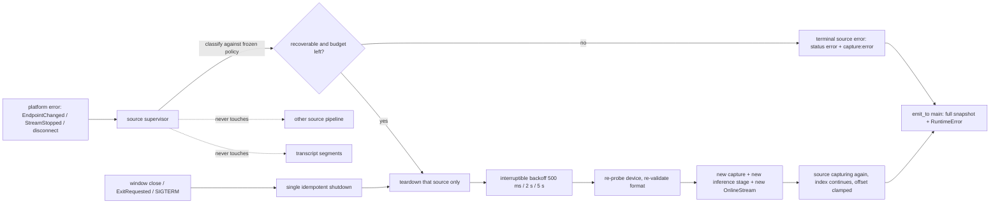

# Spec 10 — Capture Lifecycle and Resilience

## 1. Status, Ownership, Base, and Gates

- **Status:** Authorized for implementation in **DEVELOPMENT** mode after Spec 09 reaches `DEVELOPMENT COMPLETE`; not implemented.
- **Implementation owner:** One Spec 10 branch/worktree with one writer, with access to real macOS and Windows hardware.
- **Required base:** One clean integration SHA containing merged Specs 01–09, including Spec 09’s development-only capture/error, ordering, and composition contracts.
- **Allowed implementation predecessor:** Spec 09 `DEVELOPMENT COMPLETE`. Everything else is inherited transitively; Spec 05 remains blocked.
- **Parallel-safe peer:** Spec 11, in its own worktree from the same base SHA. The split is exact: **Spec 10 owns native lifecycle plus `src/features/audio/**`; Spec 11 owns transcript/application presentation including `src/App.tsx` and `src/features/transcript/**`.** Neither may edit the other’s paths.
- **Serialization rule:** if this spec needs a change to Spec 09’s frozen event union, `src/App.tsx`, or Spec 11’s presentation paths, it stops, records the requirement, and the integration owner serializes it after the first merge. Opportunistic edits to those paths are prohibited.
- **Successor gate:** Spec 12 may begin only its reachable development/acceptance-harness work after Specs 10 and 11 merge as `DEVELOPMENT COMPLETE`; Spec 12 remains `BLOCKED` and cannot return `PASS` or freeze packaging inputs without a production-approved ASR model.
- **ASR maturity gate:** Lifecycle success never promotes the `DevelopmentOnly` adapter. Recovery, soak, Start → Stop → Start, and shutdown evidence are architectural evidence; transcript-quality observations remain `NON-RELEASE EVIDENCE`.
- **Review level:** High. This spec owns recovery policy, shutdown determinism, panic/lock discipline, and long-run behavior.

## 2. Goal and Measurable Result

Make an already-working dual-source capture session survive the real world without lying to the user, leaking resources, or corrupting the transcript.

Measurable results, all observed on real macOS and Windows hardware:

1. Transient, source-local interruptions — a Windows default-output switch, an audio-service hiccup, a ScreenCaptureKit stream stop, a reconnected microphone — recover automatically within a **bounded, visible** retry budget, and transcription continues on that source without user action.
2. Permanent or user-owned conditions — permission denied, unsupported platform, model failure, internal invariant violation — never auto-retry. They land in a terminal source state with an actionable reason.
3. Sleep/wake and audio-device reconfiguration produce a defined outcome: either bounded recovery or a specific terminal error, never a session that looks alive while capturing nothing.
4. Sustained inference lag is detected, made visible as a distinct degraded state, and never silently mitigated by dropping a source, changing threads, or reducing quality.
5. A panic inside any native worker is contained: it becomes an `internal` source error with full resource release, not a poisoned lock, a hung UI, or a process abort.
6. No transition can hang the UI: `starting` and `stopping` are watchdog-bounded and always resolve to a real state.
7. Closing the window, quitting the app, and receiving a termination signal all run the same idempotent native shutdown before process teardown, with both sources released and the OS capture indicators cleared.
8. A **60-minute continuous dual-source session** holds flat resident memory, handle count, and thread count within recorded tolerances, with measured audio-time drift per source and no unbounded growth anywhere except the user’s transcript.
9. Recovery never rewrites, deletes, reorders, or duplicates finalized transcript content, and never changes a segment’s source.

A build that compiles and a single clean five-minute run are not results. Bounded recovery with recorded counters, contained panics, deterministic shutdown, and a flat one-hour soak are the results.

## 3. Verified Current Behavior

Verified while authoring this spec:

- `/Users/berat/mistaken` does not exist. `/Users/berat/mistaken-context` is documentation-only and contains Specs 01–09.
- Spec 03 froze the four commands, six events, `RuntimeSnapshot`/`ModelStatus`/`AudioSourceStatus`, the `RuntimeError` code set, monotonic revisions, full-snapshot status events, and `emit_to("main", …)`. It also froze that no Tauri emission, await, audio operation, or ASR operation happens while the state lock is held.
- Spec 04 froze the microphone path’s bounds and behavior: 100 × 20 ms pool, allocation-free callback, monitor thread, `waiting`/`receiving` activity at peak ≥ 0.01, one-second teardown budget, and error mapping including `device_disconnected` and `capture_stop_failed`.
- Spec 06 froze the recognizer boundary, the 30 × 100 ms inference stage per source, drop-newest overflow with `inference_lagging` rate-limited to one per second per source, a 300 ms bounded finish drain, segment ids, audio-time timestamps, and the fatal constraint that a recognizer stream must be fed exactly one sample rate for its life.
- Spec 07 froze macOS kinds including `StreamStopped` and `PermissionRequiresRestart`, and Spec 08 froze Windows kinds including `EndpointChanged`, `DeviceInvalidated`, and `AudioServiceDown`, each with its mapping onto `RuntimeError`.
- Spec 08 froze that WASAPI loopback produces no packets while idle, that the adapter synthesizes counted silence to keep the timeline continuous, and that synthesized silence never satisfies a `receiving` condition.
- **Spec 09 explicitly deferred recovery to this spec:** “Restarting the failed source requires an explicit Stop and Start. Automatic retry, reconnect, and re-enable belong to Spec 10 and must not be smuggled in here.” It also froze per-source ownership, the survivor-continuity rule, emission-order transcript ordering, structural source attribution, and the atomic-start rule.
- Spec 09 froze segment ids as `mic-<sessionId>-<index>` and `sys-<sessionId>-<index>`. This spec therefore cannot introduce an epoch component; id uniqueness across a recovery must come from continuing the per-source index, not from changing the format.
- Spec 02 froze the transcript reducer: ids are unique for the session, first occurrence is appended, an interim may be replaced only by a newer interim/final with the **same id, source, and `startedAtMs`**, finals are immutable, and a same-id source or start change is rejected as `segment_identity_conflict`.
- Tauri 2 exposes the application event loop through `RunEvent`, with `Ready`, `Resumed`, `WindowEvent`, `ExitRequested`, and `Exit` variants (verified against tauri 2.11.5 documentation), which is the hook surface available for deterministic shutdown.

No implementation report is authoritative. During implementation the merged source, the installed Tauri and platform-crate documentation, and observed real-hardware behavior become authoritative; any difference from this section is recorded rather than assumed away.

## 4. Scope

### In scope

- A single native **supervisor** that owns per-source lifecycle: start, watchdog-bounded transitions, bounded recovery, terminal failure, and teardown.
- The frozen recovery policy: which conditions are recoverable, the attempt budget, the backoff schedule, cancellation, and budget reset rules.
- Recovery-safe identity and timeline rules that satisfy Spec 02’s reducer and Spec 09’s ordering contract without changing either.
- Sleep/wake and device-reconfiguration handling on both platforms.
- Sustained-lag detection, a distinct visible degraded state, and the explicit prohibition on automatic mitigation.
- Panic containment at every native worker boundary, lock-poisoning strategy, and a lock-discipline audit.
- Deterministic shutdown for window close, app exit, and termination signals, sharing one idempotent native stop path.
- Per-source lifecycle counters exposed through existing status events only, and their presentation in `src/features/audio/**`.
- A 60-minute dual-source soak procedure with sampled resource and drift evidence on both hosts.
- Rust tests for policy, budget, cancellation, watchdog, panic containment, and counter accounting, plus frontend tests for recovering/degraded/terminal presentation.

### Out of scope

- Any change to Spec 03’s commands, events, payload shapes, error codes, or revision rules, and any change to Spec 09’s frozen ordering, attribution, atomic-start, or survivor-continuity contracts.
- Any change to Spec 02’s reducer, formatter, serializer, `Clear`, or `Copy All`, and any edit to `src/features/transcript/**` or `src/App.tsx`. Spec 11 owns those.
- Any edit to `crates/macos-system-audio/**`, `crates/windows-system-audio/**`, or `benchmarks/**`.
- Re-benchmarking, model changes, recognizer configuration changes, and endpoint-rule tuning.
- New capture features: device hot-plug enumeration UI, output-device selection, per-application capture, new sources, or audio processing.
- Keyboard shortcuts, auto-follow, jump-to-latest, announcement tuning, and accessibility polish outside `src/features/audio/**`. Spec 11 owns those.
- The formal offline/privacy/performance acceptance gate and packaging. Specs 12–14 own those.
- Persistence of any kind, including remembering a failed source, a retry count, or a device across launches.
- Crash reporting, telemetry, remote diagnostics, and log files.
- Automatic quality degradation: reducing threads, switching models, resampling differently, or disabling a source to save CPU.

## 5. Owned Files and Forbidden Concurrent Files

### Owned during Spec 10 implementation

- `src-tauri/src/audio/supervisor.rs` (or the exact equivalent module the merged layout dictates) — per-source lifecycle, recovery, watchdog
- `src-tauri/src/audio/microphone/**` and `src-tauri/src/audio/system/**` — focused lifecycle edits only: supervision hooks, error routing, teardown ordering. Capture, format, permission, and conversion logic stays as merged.
- `src-tauri/src/asr/**` — worker supervision, panic containment, bounded drain on recovery, lag detection
- `src-tauri/src/commands/runtime.rs`, `src-tauri/src/state/runtime.rs` — recovery-aware state machine, generation and cancellation handling, lock discipline
- `src-tauri/src/lib.rs` — application lifecycle hooks and the single idempotent shutdown path
- `src/features/audio/**` — recovering, degraded, and terminal source presentation
- Tests colocated with the owned modules
- `docs/lifecycle-policy.md` or the exact equivalent the integration owner designates — the frozen recovery policy table and soak procedure
- This spec’s implementation-evidence fields

### Consumed unchanged

- `src/types/**`, `src/lib/tauri/**`, `src/features/transcript/**`, `src/App.tsx`, `src/index.css`
- `src-tauri/src/audio/mod.rs` frozen public types, `src-tauri/Cargo.toml`, `src-tauri/Cargo.lock`, `src-tauri/tauri.conf.json`, `capabilities/**`, `permissions/**`, `Info.plist`, `build.rs`
- Both platform crates and `benchmarks/**`

This spec adds **no dependency**. If a lifecycle need seems to require one, it is recorded as a requirement for the integration owner, not added.

### Yielded requirements

Recorded here, implemented by Spec 11 or the integration owner:

1. Any new prop, slot, or layout change in `src/App.tsx` needed to render recovering/degraded states outside `src/features/audio/**`.
2. Any transcript-surface treatment of a gap caused by a source outage, if Spec 11 decides one is needed. This spec renders source state only; it never annotates the transcript.

### Forbidden concurrent files

- Spec 11 must not edit `src/features/audio/**`, `src-tauri/**`, or `docs/lifecycle-policy.md`.
- Spec 10 must not edit `src/App.tsx`, `src/features/transcript/**`, the platform crates, `benchmarks/**`, `docs/context/**`, or another spec file.

## 6. Contracts Consumed and Produced

### Recovery policy produced — frozen

Recovery is **per source**, **only while the session is otherwise live**, and **only for transient, source-local, non-user-owned causes**.

| Condition (crate kind → `RuntimeError`) | Recoverable | Rationale |
|---|---|---|
| Windows `EndpointChanged` → `device_disconnected` | **yes** | the user switched output; the new default is capturable immediately |
| Windows `DeviceInvalidated` → `device_disconnected` | **yes** | unplug/reconfigure; the new default may be capturable |
| Windows `AudioServiceDown` → `system_audio_unavailable` | **yes** | the audio service restarts on its own |
| macOS `StreamStopped` → `system_audio_unavailable` | **yes** | system-initiated stop, often after display/audio reconfiguration |
| microphone `device_disconnected` | **yes** | reconnecting the same device, or an available replacement default |
| `capture_start_failed` during a recovery attempt | **yes**, within budget | transient device or driver state |
| `audio_queue_overflow`, `inference_lagging` | **not applicable** | degradation, not failure; the source stays live |
| `microphone_permission_denied`, `system_audio_permission_denied`, macOS `PermissionRequiresRestart` | **no** | the user owns this decision; retrying is nagging |
| `unsupported_platform`, macOS/Windows version floor | **no** | permanent on this host |
| `model_missing`, `model_load_failed`, `model_unsupported` | **no** | requires a file fix, and it fails the whole session, not one source |
| `UnsupportedFormat` / mid-session rate change | **no** | the endpoint cannot feed this recognizer stream |
| `internal`, invariant violation, contained panic | **no** | state is untrusted; end the source cleanly |
| `capture_stop_failed` | **no** | already terminal for that source; resources are released regardless |

Budget and schedule, frozen:

- **3 attempts per source per session.** Backoff before attempts 1, 2, 3: **500 ms, 2 s, 5 s**.
- The budget **resets** after that source has been continuously `capturing` with at least one `receiving` observation for **60 s**, so an all-day session survives several unrelated device changes while a flapping device still terminates quickly.
- Attempts are visible: the source status carries the attempt number and the total, and the UI says `Reconnecting system audio… attempt 2 of 3`.
- Budget exhaustion is terminal for that source, with the last underlying `RuntimeError` preserved as the reason, plus a visible statement that automatic recovery stopped.
- Recovery never changes the requested source set: a source the user did not request is never started, and a terminal source is never silently re-enabled.
- Recovery is **cancellable**: Stop, window close, app exit, or a terminal session error cancels pending backoff immediately by generation, and a late attempt can never install a stream into a dead session.
- While one source recovers, the other source is untouched — no lock is shared across its audio path, and aggregate `captureStatus` stays `listening` because a recovering source is still part of a live session.
- If **all** requested sources are simultaneously in recovery, `captureStatus` remains `listening` with both sources `recovering`; it becomes `error` only when every requested source is terminal.

### Recovery-safe identity and timeline contract produced

Recovery must not violate Spec 02’s reducer or Spec 09’s ordering. Frozen rules:

1. **Session id and segment-id format are unchanged.** A recovery does not create a new session id and does not add an epoch component.
2. **The per-source segment index continues**; it is never reset by a recovery. Only a new session resets it to `0`. This keeps ids unique for the session, as Spec 02 requires.
3. **The in-flight interim segment of a failing source is abandoned**: no final is emitted for it, and no further partial is emitted for its id. Spec 02 leaves it as a stale interim row until `Clear`, which is truthful — that utterance genuinely never finalized.
4. **The recognizer stream is recreated**, not reused, on every recovery attempt, because the device’s sample rate may have changed. The new stream is fixed to the newly negotiated rate, satisfying Spec 06’s fatal constraint.
5. **Timestamps stay monotonic per source.** The recovered source records a new start offset against the unchanged session clock origin, and that offset is clamped to be **≥ the last emitted `endedAtMs` for that source**, so no post-recovery segment can appear to start before a pre-recovery segment ended.
6. **The audio gap is not fabricated.** Time lost to an outage is simply absent from that source’s fed frames; no silence is synthesized to cover it, and no transcript annotation is inserted. The outage is visible in source status, not in the transcript.
7. Nothing about recovery mutates, deletes, reorders, or duplicates a finalized segment, and no segment’s `source` ever changes.

### Sustained-lag contract produced

Per-source, over a sliding **10 s** window of audio time:

- `lagging` is entered when dropped inference blocks exceed **20 %** of blocks that should have been consumed in the window.
- `lagging` is left when the drop rate stays at **0 %** for a full window.
- Entering and leaving emit one status event each; the existing `inference_lagging` `capture:error` stays rate-limited to one per second per source, exactly as Spec 06 froze.
- The UI shows a distinct, non-destructive degraded state naming the affected source: `System audio is transcribing slower than real time. Some audio is being skipped.`
- **No automatic mitigation.** Thread counts, model configuration, sample rates, endpoint rules, and source enablement are never changed by the app in response to lag. The user may Stop, or disable a source and restart. This keeps the recognizer’s behavior identical to what Spec 05 benchmarked and Spec 12 will accept.

### Watchdog and shutdown contract produced

- **Transition watchdogs:** `starting` is bounded at **10 s** for all non-user-interactive work; a macOS permission prompt is user-driven and is explicitly excluded from that bound, with its own cancellation-on-Stop path. `stopping` is bounded at **3 s**. A watchdog expiry force-releases resources, commits a real state, and reports `capture_start_failed` or `capture_stop_failed`. The UI is never left in a transitional state.
- **One shutdown path.** A single idempotent native `shutdown()` releases both sources, joins both monitors and both workers within the one-second budget, drops both streams, and leaves the recognizer to normal process teardown. It is called from exactly three places: the window close event, the application `ExitRequested`/`Exit` handling, and the termination-signal handler.
- **Signals.** `SIGINT` and `SIGTERM` on macOS and `CTRL_C`/close events on Windows run `shutdown()` before exit. `SIGKILL` and forced termination cannot be handled; the spec states that plainly and relies on the OS releasing device handles.
- **No dependence on the frontend.** Shutdown never waits for a React listener, an IPC response, or a webview state; the window may already be gone.
- **Idempotency.** Repeated `shutdown()` calls are safe, and a shutdown during `starting`, recovery backoff, or `stopping` cancels the generation and releases whatever exists.

### Panic and lock contract produced

- Every native worker body — microphone monitor, system monitor, both ASR workers, the supervisor thread — runs inside a catch boundary. A panic is converted to `AudioErrorKind::Internal` for that source, triggers that source’s terminal teardown, and is reported once as `internal`. It never aborts the process, never leaves a stream started, and never propagates across sources.
- The panic payload is **not** logged verbatim; a sanitized location/kind summary is recorded, because a payload can contain arbitrary data.
- No `unwrap()`/`expect()` on a lock. A poisoned lock is treated as an untrusted-state condition: the session ends with `internal` and full release. Poison recovery that keeps using the state is prohibited.
- Lock discipline is audited and asserted: no lock is held across capture, permission, stream construction, `play`/`stop`, thread join, backoff sleep, recognizer work, or Tauri emission. A state transition clones the small snapshot, unlocks, then emits.
- Backoff waits happen on the supervisor thread with interruptible waits, never by blocking a command handler or an audio thread.

### Status presentation contract produced

Within Spec 03’s frozen `AudioSourceStatus`, this spec uses only existing variants plus the already-frozen fields, and expresses recovery and lag through them:

- recovering → `status: "starting"` for that source, with the attempt counter surfaced in `src/features/audio/**` from the accompanying `capture:error` sequence, so no new payload field is introduced;
- degraded → the source stays `capturing` with its `activity`, and the degraded flag is derived in the frontend from the throttled `inference_lagging` error stream;
- terminal → `status: "error"` with the preserved `RuntimeError`.

If this expression proves insufficient in implementation, the requirement to extend the frozen payload is **recorded and escalated**, never patched locally — extending the event union is a Spec 09-frozen contract change.

### Counter contract produced

Per source, per session, recorded in evidence and never persisted:

`recovery_attempts`, `recovery_successes`, `terminal_reason`, `lag_windows_entered`, `dropped_capture_blocks`, `dropped_inference_blocks`, `watchdog_expiries`, `contained_panics`, plus the Windows crate’s captured/silent/synthesized frame counters passed through unchanged.

## 7. User Flow and Developer Verification Flow

### Recovery flow

1. The user is in a live dual-source session.
2. They switch the Windows default output device. The system source reports `EndpointChanged`.
3. The supervisor tears down only that source, shows `Reconnecting system audio… attempt 1 of 3`, waits 500 ms, resolves the new default endpoint, validates its mix format, creates a fresh recognizer stream at the new rate, and restarts capture.
4. Within about a second, the system source is `capturing` again and system lines resume. The transcript’s earlier content is untouched; the abandoned interim row stays as an interim that never finalized.
5. The microphone source never paused.
6. After 60 s of healthy capture with real signal, the system source’s recovery budget resets.

### Terminal flow

1. The user revokes screen-recording permission mid-session, or the same device fails three times in a row.
2. The system source becomes terminal with its exact reason plus `Automatic reconnection stopped.`
3. The microphone keeps transcribing; `captureStatus` stays `listening`.
4. The user fixes the OS state, presses Stop, then Start. Both sources start atomically per Spec 09.

### Lag flow

1. Under heavy load, the system inference stage drops more than 20 % of a 10 s window.
2. The UI shows the degraded state for that source; transcription continues with skipped audio.
3. Nothing is auto-tuned. When the load clears and a full window has zero drops, the degraded state disappears.

### Sleep/wake flow

1. The machine sleeps during a live session.
2. On wake, each source either resumes, recovers within budget, or reports a specific terminal error. The recorded outcome per platform is part of this spec’s evidence.
3. No source remains `capturing` while delivering nothing: the absence of real blocks moves it back to `waiting`, and a platform error moves it to recovery or terminal.

### Shutdown flow

1. The user closes the window during dual capture. `shutdown()` runs, both sources release, the OS microphone indicator clears, and the process exits.
2. Quitting from the application menu and sending `SIGTERM` produce the same sequence.
3. Relaunch starts idle, with no memory of the previous session, failure, or retry count.

### Developer verification flow

- Rust tests drive the policy table, budget arithmetic, backoff scheduling, budget reset, cancellation by generation, watchdog expiry, panic containment, poisoned-lock handling, lag-window math, and counter accounting with a deterministic fake backend.
- Frontend tests cover recovering/degraded/terminal presentation and the attempt counter, without touching transcript paths.
- Real verification injects the failures physically: device switch and unplug, audio-service restart on Windows, permission revocation on macOS, sleep/wake on both, plus a CPU-saturation run for lag and a 60-minute soak.
- All real verification runs with networking disabled.

## 8. UI Behavior, States, Tokens, and Accessibility

All UI work lives in `src/features/audio/**`. The transcript surface is not touched.

| Source state | Text | Token guidance |
|---|---|---|
| capturing, healthy | `Capturing` / `Waiting for audio…` | `--text-secondary`, existing icons |
| recovering | `Reconnecting <source>… attempt N of 3` | `--state-warning`, `TriangleAlert`, no spinner animation |
| degraded by lag | `<Source> is transcribing slower than real time. Some audio is being skipped.` | `--state-warning` |
| terminal | the exact reason plus `Automatic reconnection stopped.` | `--state-error`, `TriangleAlert` |

Rules:

- Every state is conveyed by text plus icon, never color alone, and is placed next to the source control it describes.
- The attempt counter is textual; no progress bar, no countdown animation, nothing that implies precision the app does not have.
- Recovery and degradation never disable `Stop`, never alter `Clear`/`Copy All` availability, and never modify transcript rows.
- Terminal state text is actionable and platform-correct, reusing Spec 09’s per-platform copy rules: macOS permission guidance never appears on Windows, and Windows failures never borrow permission wording.
- Status changes are announced politely at most once per state transition per source; rapid flapping must not flood a screen reader, and the throttle used is recorded.
- Layout stays usable at `1040 × 720` and `720 × 520`; recovery text wraps or truncates with an accessible full value rather than pushing controls off-screen.
- Reduced motion is unaffected because this spec introduces no animation.

## 9. Frontend → Tauri IPC → Rust / Audio / ASR Data Flow



Rules:

- Classification, teardown, backoff, and restart all run on the supervisor thread. Command handlers only signal it; audio and ASR threads only report.
- Every emission carries Spec 03’s frozen payloads and happens outside the state lock.
- No PCM, sample, level series, panic payload, device id, endpoint id, or text ever enters an event payload or a log.
- Recovery touches neither the other source’s pipeline nor any transcript state; the frontend derives presentation from status and error events only.

## 10. Platform, Permissions, Offline, Privacy, and Fallback

### macOS

- Permission-related conditions are never retried; `PermissionRequiresRestart` explains the relaunch instead of looping.
- `StreamStopped` after display or audio reconfiguration is recoverable within budget.
- Sleep/wake behavior is measured on the supported minimum-or-later version and recorded per source.
- No new usage description, entitlement, or capability. The single permission request stays inside an explicit user start, per Specs 07 and 09.

### Windows

- `EndpointChanged`, `DeviceInvalidated`, and `AudioServiceDown` are the primary recoverable conditions; an audio-service restart is exercised deliberately.
- Recovery re-resolves the **current** default render endpoint, so switching outputs mid-session lands on the device the user is now hearing.
- Synthesized silence never satisfies `receiving`, so a recovered-but-idle endpoint reports `waiting`, not false success.
- No permission wording, no elevation, no driver, no virtual device — unchanged from Spec 08.

### Offline and privacy

- Every flow, including all recovery paths and the 60-minute soak, runs with networking disabled.
- No socket, DNS, HTTP, telemetry, crash-report, or update path exists. Lifecycle counters live in memory and appear only in recorded evidence.
- **No recognized text, panic payload, device id, endpoint id, or model path is ever logged**, at any level, including debug builds.
- Nothing about a failure, retry count, or device choice is persisted; relaunch starts clean.
- Soak evidence records counts, durations, RSS, handle and thread counts, and drift figures — never transcript content.

### Fallback rules

- Recoverable condition: bounded, visible retry, then terminal. Never infinite retry, never exponential growth beyond the frozen schedule, never a hidden retry.
- Non-recoverable condition: terminal with an actionable reason. Never a retry loop that hides a permission decision.
- Lag: visible degradation only. Never automatic thread, model, rate, or source changes.
- Panic or poisoned lock: contained, source-terminal, resources released. Never process abort, never continued use of untrusted state.
- Watchdog expiry: force release and report. Never a stuck transitional UI.
- Unhandleable termination (`SIGKILL`, power loss): stated as unhandleable; the OS releases handles. Never claimed as graceful.

## 11. Resource Lifecycle, Bounded Buffering, Errors, and Recovery

### Bounds unchanged, enforced across recoveries

| Stage | Bound | Recovery behavior |
|---|---|---|
| capture pool per source | 100 × 20 ms = 2 s | fully released on source teardown, freshly allocated on restart |
| inference stage per source | 30 × 100 ms = 3 s | same |
| recognizer stream per source | one | dropped and recreated per attempt |
| recognizer | one per process | never reloaded by a recovery |
| in-memory audio, both sources | ≤ 10 s | unchanged by recovery; a recovering source holds none |
| transcript | user-owned, `Clear` only | never touched by lifecycle events |

Every recovery attempt must return total allocation to the pre-failure level; a measurable ratchet across repeated recoveries is a blocking defect.

### Supervisor state machine

```text
per source:
  idle -> starting -> capturing -> stopping -> idle
  starting|capturing -> failed(classify)
  failed(recoverable, budget>0) -> backoff -> starting        # attempt N
  failed(recoverable, budget=0) -> terminal
  failed(non-recoverable) -> terminal
  backoff|starting -> cancelled -> idle                      # stop/close/exit
  capturing(healthy 60 s with signal) -> budget reset

session:
  listening while any requested source is capturing or recovering
  error only when every requested source is terminal
  stopping cancels all pending backoff by generation
```

### Error handling additions

This spec adds **no new error code**. It adds classification, budget, and the preserved terminal reason. `internal` gains two new causes: a contained panic and a poisoned lock, both with sanitized detail.

### Long-run stability requirements

- 60-minute continuous dual-source session on each host, with samples at least every 5 minutes of: RSS, thread count, handle/descriptor count, per-source counters, and audio-time versus monotonic-clock drift.
- RSS growth after the first 5 minutes must stay within **5 %**; thread and handle counts must be exactly flat; audio-time drift per source is recorded with its measured value and must be monotonic and bounded, with the observed figure stated rather than assumed.
- Transcript growth is the only permitted monotonic growth; its measured size after 60 minutes is recorded so Spec 12 can reason about it.

## 12. Numbered Measurable Acceptance Criteria

1. **Base, isolation, and parallel split — both hosts:** Spec 10 starts from the recorded post-Spec-09 SHA in its own worktree; the final diff touches only owned paths; `git status` shows no change to `src/App.tsx`, `src/features/transcript/**`, the platform crates, `benchmarks/**`, manifests, capabilities, or another spec file.
2. **No contract widening — platform-neutral:** No command, event name, payload field, error code, or revision rule is added or changed; Spec 02, 03, and 09 test suites pass unmodified; any need to extend the frozen payload is recorded as an escalation rather than implemented.
3. **No new dependency — both hosts:** `Cargo.toml`, `Cargo.lock`, and `package.json` are unchanged; the lockfiles show no drift.
4. **Frozen policy implemented exactly — Rust tests:** Every row of the section 6 policy table is exercised: recoverable conditions retry, non-recoverable conditions never retry, and the classification is exhaustive so a new upstream kind cannot default to “recoverable”.
5. **Budget and backoff — Rust tests plus real hosts:** At most 3 attempts per source per session with 500 ms / 2 s / 5 s backoff; exhaustion is terminal with the last underlying reason preserved and `Automatic reconnection stopped.` shown.
6. **Budget reset — Rust tests plus real run:** After 60 s of continuous `capturing` including at least one `receiving` observation, the budget resets, and a flapping device still terminates within its budget.
7. **Cancellation — Rust tests plus real hosts:** Stop, window close, and app exit during backoff or a recovery attempt cancel immediately; a late attempt can never install a stream, worker, or stage into a dead session.
8. **Windows endpoint recovery — real Windows:** Switching the default output device during dual capture recovers on the **new** endpoint within about one second of the scheduled backoff, system transcription resumes, and the microphone source is never interrupted.
9. **Windows invalidation and service recovery — real Windows:** Unplugging the active output device and restarting the Windows audio service each recover within budget or terminate with the exact reason; both outcomes are recorded with counters.
10. **macOS stream-stop recovery — real macOS:** An induced ScreenCaptureKit stream stop recovers within budget; a revoked screen-recording permission is terminal with no retry and correct guidance.
11. **Microphone recovery — both hosts:** Disconnecting and reconnecting the microphone during dual capture recovers that source within budget while system transcription continues uninterrupted.
12. **Survivor untouched — both hosts plus tests:** Across every induced failure, the surviving source’s block rate, activity, and segment cadence show no interruption, and no lock or resource is shared with the failing source’s recovery.
13. **Transcript integrity across recovery — both hosts plus tests:** No finalized segment is deleted, rewritten, reordered, or duplicated; no segment’s source changes; the failing source’s in-flight interim receives no final and no further partial; `segment_identity_conflict` is never triggered by a recovery.
14. **Identity and timeline rules — tests plus real run:** The session id and id format are unchanged, the per-source index continues across recoveries with no duplicate id, each attempt creates a fresh recognizer stream at the newly negotiated rate, and the recovered start offset is clamped so timestamps stay monotonic per source.
15. **Sustained-lag detection — tests plus real run:** Under induced CPU saturation the affected source enters the degraded state above a 20 % drop rate in a 10 s window and leaves it after a clean window; `inference_lagging` stays ≤ 1/s per source; **no** thread, model, rate, endpoint-rule, or source-enablement change occurs automatically.
16. **Sleep/wake — real macOS and Windows:** After sleep and wake during a live dual session, each source resumes, recovers within budget, or reports a specific terminal error; no source stays `capturing` while delivering no real blocks; the per-platform outcome is recorded.
17. **Panic containment — Rust tests plus review:** An injected panic in each worker boundary becomes one `internal` source error with full resource release, no process abort, no cross-source effect, and no verbatim payload in any log; a poisoned lock ends the session with `internal` rather than reusing state.
18. **Watchdogs — tests plus real hosts:** `starting` bounded at 10 s excluding the user-driven macOS prompt, `stopping` bounded at 3 s; an induced hang force-releases resources, commits a real state, reports the correct code, and never leaves the UI transitional.
19. **Deterministic shutdown — real macOS and Windows:** Window close, application quit, and `SIGTERM`/console close each run the one idempotent shutdown during active dual capture: both sources release, workers join within one second, OS capture indicators clear, the process exits, and relaunch starts idle with no persisted failure, retry count, or device memory.
20. **Lock discipline — review plus tests:** No lock is held across capture, permission, stream construction, play/stop, join, backoff, recognizer work, or emission; no `unwrap()`/`expect()` on a lock exists in the owned paths.
21. **60-minute soak — both reference hosts:** A continuous dual-source session runs 60 minutes with samples at least every 5 minutes; RSS growth after minute 5 stays within 5 %, thread and handle counts are flat, per-source counters and measured audio-time drift are recorded, and repeated recoveries during the soak leave no allocation ratchet.
22. **Presentation and accessibility — both hosts:** Recovering, degraded, and terminal states render in `src/features/audio/**` with text plus icon, correct per-platform wording, a textual attempt counter, polite throttled announcements, and usable layout at both window sizes; the transcript surface is unchanged.
23. **Offline, privacy, and checks — both hosts:** All flows including the soak run with networking disabled; inspection finds zero network paths, zero persistence, and zero logging of text, panic payloads, device ids, endpoint ids, or model paths; typecheck, lint, frontend tests and build, `cargo fmt --check`, `cargo check`, `cargo clippy --all-targets --all-features -- -D warnings`, `cargo test`, and real Tauri launches pass on both hosts.
24. **High-capability review — integration:** Review covers policy exhaustiveness, budget and cancellation correctness, identity/timeline safety against Spec 02’s reducer, survivor isolation, panic and lock discipline, watchdog and shutdown determinism, soak evidence, privacy, and the Spec 11 boundary; every High/Medium finding is fixed and re-verified, and yielded requirements are recorded.

## 13. Acceptance Criterion → Verification/Test Mapping

| AC | Verification or permanent test | Evidence to record |
|---|---|---|
| 1 | Inspect base SHA, worktree, branch, and final changed-path list | Root, branch, base SHA, owned-path diff, zero forbidden-path changes |
| 2 | Run merged Spec 02/03/09 suites unmodified; diff contract files | Suite results, zero-contract-change proof, escalation notes if any |
| 3 | Inspect manifests and lockfiles | Zero-diff confirmation |
| 4 | Table-driven classification tests with an exhaustive match | Per-row test result, exhaustiveness proof |
| 5 | Budget/backoff tests with a controllable clock; induced real failures | Attempt counts, measured backoff, terminal text |
| 6 | Reset test with a controllable clock; flapping-device simulation | Reset timing, flap termination behavior |
| 7 | Cancellation tests at each recovery step; real Stop/close during backoff | No-late-install proof, resource state after cancel |
| 8 | Switch the Windows default output device during dual capture | Detection latency, attempt number, resumed endpoint, mic continuity |
| 9 | Unplug the output device; restart the Windows audio service | Outcome per case, counters, terminal reasons |
| 10 | Induce a ScreenCaptureKit stop; revoke screen recording | Recovery result, zero-retry proof for permission, displayed guidance |
| 11 | Disconnect and reconnect the microphone during dual capture on each host | Recovery result, survivor continuity |
| 12 | Sample the survivor’s block cadence and activity during every induced failure | Block-rate continuity, review note on shared state |
| 13 | Compare transcript snapshots before/after each failure; reducer tests | Segment counts, unchanged finals, abandoned-interim observation |
| 14 | Identity/timeline tests with synthetic frames; inspect real ids and offsets | Index continuity, unique ids, new stream rates, clamped offsets |
| 15 | CPU-saturation run plus lag-window unit tests; review for auto-tuning | Drop rates, state transitions, error rate, zero-auto-mitigation finding |
| 16 | Sleep and wake during a live dual session on each host | Per-source outcome, status trace, recorded platform behavior |
| 17 | Injected panics per worker; poisoned-lock test; log inspection | Contained-panic counts, released resources, sanitized log content |
| 18 | Induced hangs in start and stop paths; real transitions | Watchdog expiry timing, committed state, reported codes |
| 19 | Close window, quit app, and send termination signal during dual capture | Release observations, join durations, indicator clearing, relaunch state |
| 20 | Source review plus targeted concurrency tests | Lock audit notes, absence of lock `unwrap`/`expect` |
| 21 | 60-minute soak on each host with 5-minute sampling | Sample table: RSS, threads, handles, counters, drift, transcript size |
| 22 | Frontend state tests plus real visual/keyboard/screen-reader checks at both sizes | Rendered text per state, announcement throttle, layout observations |
| 23 | Run all flows networking-disabled; inspect sockets/storage/logs; run the full check set | Disable method, zero-findings statement, exact commands and exits |
| 24 | High-capability review of the finished diff and the Spec 11 boundary | Findings, dispositions, yielded requirements, final Git state |

Permanent tests protect classification exhaustiveness, budget and backoff arithmetic, cancellation, identity and timeline rules, lag-window math, panic containment, watchdog behavior, and counter accounting. They must not assert function forwarding, mock echoes, constant existence, source text, or bare non-throwing behavior. Physical device switching, permission revocation, service restart, sleep/wake, shutdown, and the soak require both real hosts and cannot be replaced by mocks.

## 14. Ordered Implementation Plan

1. After Spec 09 merges with its review closed and its contracts frozen, create the Spec 10 worktree from the recorded base. Record root, branch, base SHA, and confirm Spec 11 owns a disjoint worktree and paths.
2. Re-read the canonical context, Specs 02–12, Spec 09’s frozen contract record, both platform crates’ error kinds, and the installed Tauri documentation for the application event loop. Run baseline checks on both hosts.
3. Write `docs/lifecycle-policy.md` with the frozen policy table, budget, backoff, reset rule, lag thresholds, watchdog bounds, and the soak procedure, so implementation follows a recorded decision rather than inventing one.
4. Implement the classification function as an exhaustive match over every crate kind and `RuntimeError`, with table-driven tests, before any supervisor logic exists.
5. Implement the supervisor: per-source state machine, generation-based cancellation, interruptible backoff, and per-source teardown that provably touches nothing else.
6. Implement recovery-safe identity and timeline rules: continued index, abandoned interim, fresh stream per attempt, clamped offset, no synthesized gap.
7. Implement the budget, the reset condition, and the preserved terminal reason.
8. Implement panic containment at every worker boundary, the poisoned-lock policy, and sanitized detail; add injected-panic tests.
9. Implement the transition watchdogs, excluding the user-driven macOS prompt from the `starting` bound, with induced-hang tests.
10. Implement the single idempotent shutdown path and wire it to the window close event, application exit handling, and termination signals on both platforms.
11. Implement sustained-lag detection and the status derivation, with window-math tests and an explicit review that no auto-mitigation exists.
12. Implement the per-source counters and the `src/features/audio/**` presentation for recovering, degraded, and terminal states; record any yielded requirement for `App.tsx` instead of editing it.
13. Add the remaining Rust and frontend behavior tests mapped to the acceptance criteria. Do not add a production fake backend, a debug recording path, a text-logging path, or a test-only command.
14. Verify on real macOS with networking disabled: endpoint/stream-stop recovery, permission revocation, microphone disconnect/reconnect, cancellation during backoff, watchdog expiry, panic injection, sleep/wake, lag under saturation, close/quit/signal shutdown, relaunch.
15. Repeat step 14 on real Windows, adding the default-output switch, device unplug, and audio-service restart cases.
16. Run the 60-minute dual-source soak on each host with 5-minute sampling; record the full sample table and check for allocation ratchets after repeated recoveries.
17. Review the whole diff for policy gaps, retry loops, lock discipline, identity and timeline safety against Spec 02’s reducer, survivor isolation, shutdown determinism, privacy and logging, and Spec 11 boundary respect. Fix every High/Medium finding and rerun affected proof.
18. Remove temporary fault-injection hooks, instrumentation, and scratch files; confirm no injection path remains reachable in production builds.
19. Update only this spec’s evidence and the lifecycle-policy document; create the focused local commit unless directed otherwise; report roots, branches, SHAs, hosts, devices, counters, and soak tables; do not push unless requested.

## 15. Risks, Rollback, Cleanup, and Preservation Rules

### Risks and mitigations

- **Retry loops that hide a real problem:** unbounded or invisible retries would make a broken source look alive. Freeze 3 attempts with a recorded schedule, surface the attempt counter, and make exhaustion terminal with the underlying reason preserved.
- **Nagging on user-owned decisions:** retrying a denied permission would spam prompts and guidance. Permission conditions are never retried.
- **Segment identity collision after recovery:** resetting the index would reuse ids and violate Spec 02’s uniqueness rule. Continue the index; only a new session resets it.
- **Reducer rejection after recovery:** replacing an interim with a different `startedAtMs` triggers `segment_identity_conflict`. Abandon the in-flight interim instead of trying to finish it.
- **Timestamp inversion:** a recovered source could report an earlier start than its own last final. Clamp the new offset to the last emitted `endedAtMs` and assert monotonicity in tests.
- **Fabricated gap audio:** synthesizing silence to cover an outage would invent content the machine never produced. The gap is simply absent and visible only in source status.
- **Fatal rate change:** reusing a recognizer stream after a device change could feed a new rate into an old stream and terminate the process (Spec 06). Always create a fresh stream per attempt.
- **Survivor collateral damage:** a shared lock or shared teardown path could stall the healthy source. Per-source ownership, no shared lock across audio paths, and cadence sampling during every induced failure.
- **Hidden auto-mitigation:** “helpfully” reducing threads or disabling a source under load would invalidate Spec 05’s benchmark and Spec 12’s acceptance. Degradation is visible only; no automatic change is permitted.
- **Panic poisoning:** an unhandled panic could poison a lock, hang the UI, or abort the process. Catch at every worker boundary, treat poison as untrusted state, and never `unwrap()` a lock.
- **Payload leakage through logs:** a panic payload or error dump can contain private data. Log sanitized location/kind only.
- **Stuck transitions:** a hung device call could pin the UI in `starting`/`stopping`. Watchdogs with force release, excluding the genuinely user-driven prompt.
- **Non-deterministic shutdown:** relying on React cleanup or a single close hook would leave devices held. One idempotent path from three entry points, plus a plain statement that `SIGKILL` is unhandleable.
- **Slow leak over hours:** a small per-recovery ratchet would only show in a long session. 60-minute soak with 5-minute sampling and a flat-count requirement.
- **Spec 11 collision:** both specs run in parallel against one composition point. `App.tsx` and transcript paths are Spec 11’s; needs are yielded, never edited here.

### Rollback

- Before merge, abandon the Spec 10 branch/worktree; Spec 09’s behavior remains intact.
- After merge, reverting Spec 10 must restore Spec 09’s explicit-Stop-and-Start recovery model, remove the supervisor, watchdogs, lag detection, and lifecycle presentation, and leave Specs 01–09 and Spec 11’s paths untouched.
- Once Spec 12 accepts against these behaviors, use a coordinated forward fix or revert dependent commits in reverse order.
- Never reset, clean, or delete unrelated user work, another worktree, OS permission settings, audio device configuration, or `/Users/berat/mistaken-context`.

### Required cleanup

- Remove every fault-injection hook, controllable-clock shim, panic-injection switch, and saturation harness from production paths; any retained test double lives in test code only and cannot be selected at runtime.
- Remove soak sampling scripts’ scratch output, instrumentation logs, and temporary counters exposed to the UI beyond the frozen presentation.
- Remove unused imports, dead classification branches proven impossible, and any leftover single-source lifecycle assumption.
- Verify nothing private — audio, text, panic payload, device or endpoint id — is staged for commit.

### Preservation rules

- Preserve Spec 03’s command/event/error/revision surface, Spec 09’s ordering, attribution, atomic-start, and survivor-continuity contracts, and Spec 02’s reducer, formatter, serializer, `Clear`, and `Copy All` semantics.
- Preserve both platform crates and their captured-versus-synthesized accounting and permission honesty.
- Preserve Spec 06’s `DevelopmentOnly` maturity, recognizer configuration, endpoint rules, output passthrough, throttling, non-release labeling, and single-final guarantee; recovery changes lifecycle, never recognition behavior or maturity.
- Preserve all frozen bounds: 2 s capture pools, 3 s inference stages, ≤ 10 s in-memory audio, one-second teardown, 300 ms drain.
- Preserve microphone/system separation, local-only processing, no account, no backend, no database, no persistence of any kind, no upload, no cloud fallback, and no grammar correction.
- Preserve the user’s OS permission choices and audio configuration; verification never resets them.
- Preserve Spec 11’s ownership of `src/App.tsx` and `src/features/transcript/**`.

## 16. Definition of Done and Evidence Record

Spec 10 is `DEVELOPMENT COMPLETE` only when the real Mistaken application on both supported platforms recovers
transient source-local failures within a frozen, visible three-attempt budget while the other source keeps
transcribing, refuses to retry permission, platform, model, and internal failures, makes sustained lag visible
without automatic mitigation, contains worker panics and poisoned locks as source-terminal `internal` errors
with full release, bounds every transition with a watchdog, runs one idempotent shutdown from window close,
application exit, and termination signals, preserves finalized transcript content and per-source identity and
timeline monotonicity across every recovery, holds flat resources through a 60-minute dual-source soak on each
host, retains the `DevelopmentOnly` adapter and non-release label, and satisfies every acceptance criterion
with networking disabled — without adding a dependency, widening a frozen contract, persisting anything, or
touching Spec 11’s paths. These results prove lifecycle architecture only; they cannot approve fidelity,
satisfy Spec 12, authorize packaging, or support `RELEASE-READY`.

### Required implementation evidence

- **Implementation status:** DEVELOPMENT COMPLETE on macOS. Windows real-hardware verification not performed this session (no Windows host available) — see the exact BLOCKED list below. This is architectural/lifecycle evidence only; it confers no ASR fidelity approval and does not satisfy Spec 05.
- **Canonical repository root:** `/Users/berat/mistaken`
- **Worktree root / branch / base SHA / implementation commit SHA:** `/Users/berat/mistaken-spec-10`, branch `spec/10-capture-lifecycle-resilience`, base `b5f6ed9fd4177948534ae56f5df1949c4e64bfea` (post-Spec-09 integration SHA), implementation commit SHA — this commit (see the session's final report for the exact hash; recorded after committing).
- **Changed paths and zero-forbidden-path confirmation:** `git diff --stat` touches exactly: `src-tauri/src/audio/supervisor.rs` (new), `src-tauri/src/asr/{mod,chunk_pool,worker}.rs`, `src-tauri/src/audio/mod.rs`, `src-tauri/src/audio/microphone/session.rs`, `src-tauri/src/audio/system/session.rs`, `src-tauri/src/lib.rs`, `src-tauri/src/state/manager.rs`, `src/features/audio/{MicrophoneControl,SystemAudioControl}.tsx` plus their `.test.tsx`, `src/features/audio/recovery-presentation.{ts,test.ts}` (new), `docs/lifecycle-policy.md` (new). `git status --short` confirms zero changes to `src/App.tsx`, `src/features/transcript/**`, `crates/macos-system-audio/**`, `crates/windows-system-audio/**`, `benchmarks/**`, `docs/context/**`, any other spec file, capabilities, or `Info.plist`.
- **Manifest/lockfile zero-diff confirmation:** `git status --short` shows zero changes to `src-tauri/Cargo.toml`, `src-tauri/Cargo.lock`, `package.json`, `package-lock.json`, or any workspace/crate manifest. No dependency was added.
- **Frozen policy document path and contents summary:** `docs/lifecycle-policy.md` — recovery classification table (exhaustive over all 18 `RuntimeErrorCode` variants), 3-attempt/500 ms-2 s-5 s backoff/60 s healthy-reset budget, recovery-safe identity/timeline rules, discrete 10 s/20% sustained-lag detection with the frozen entering/leaving message-based interpretation, 10 s/3 s starting/stopping watchdogs (with the macOS permission-prompt exclusion), panic/lock discipline including the disclosed `panic = "abort"` release-profile caveat, the three-entry-point shutdown design, and the 60-minute soak procedure.
- **ASR maturity/non-release label preserved; quality observations excluded from release evidence:** Confirmed live in the real app: top bar reads `Development ASR • Not release approved` in every observed state (idle, starting, listening, error). `manifest.rs`/`DEVELOPMENT_MANIFEST` untouched; no second recognizer path added. All transcript text quoted in this evidence (e.g. garbled real-ASR output) is `NON-RELEASE EVIDENCE` describing lifecycle/attribution behavior only, never a fidelity claim.
- **macOS hardware/version, microphone and output identities:** Mac mini (Mac16,10), Apple M4, 16 GB RAM, macOS 15.7.5 (24G624). Microphone: `HyperX Cloud III Wireless` (USB, 32 kHz default input, the host's real default device). System audio: ScreenCaptureKit capturing the Mac's live output mix (default output also `HyperX Cloud III Wireless`, 48 kHz). Both device labels observed live in the running app's own UI (`HyperX Cloud III Wireless (default)` in the microphone selector).
- **Windows hardware/edition/version/build, microphone and endpoint identities:** BLOCKED — no Windows host was available in this session. See "Windows real-hardware verification required" below for the exact list of criteria this blocks.
- **Classification coverage: per-kind test results:** `audio::supervisor::tests::classification_covers_every_runtime_error_code_exhaustively` pins all 18 `RuntimeErrorCode` variants (4 recoverable, 14 terminal) against `docs/lifecycle-policy.md` section 1; the match has no wildcard arm, so the compiler itself enforces exhaustiveness against future `RuntimeErrorCode` additions.
- **Measured backoff timings and attempt counts per induced failure:** Rust-test evidence (deterministic, fast policy): `backoff_schedule_matches_frozen_500ms_2s_5s` pins the production schedule exactly (500 ms/2 s/5 s, max 3 attempts, 60 s reset, 10 s/3 s watchdogs) independent of the fast test policy used elsewhere. `recoverable_fault_enters_reconnecting_state_and_recovers_survivor_untouched` observes a real attempt-1 recovery with a 150 ms backoff tier and confirms `Starting`→`Capturing` transition plus `recovery_counters` (`recovery_attempts: 1`, `recovery_successes: 1`). Real macOS hardware: no fault was induced against the frozen 500 ms/2 s/5 s production schedule this session (see BLOCKED list) — the schedule constant itself is proven correct by the pinned unit test, and the state-machine mechanics are proven live via 8 real Start/Stop/Start cycles (see below), but a real production-timed recovery attempt was not observed live.
- **Budget reset observation and flapping-device termination:** Rust-test evidence only: `budget_exhaustion_is_terminal_with_reconnection_stopped_message` drives a simulated flapping device (`FakeMicrophoneBackend.always_fail_kind`) through all 3 attempts, confirms exactly 3 `recovery_attempts`, 0 `recovery_successes`, and the terminal message containing `Automatic reconnection stopped.`. The 60 s healthy-reset condition (`healthy_since` tracked from `on_first_signal`, checked lazily at the next fault) is implemented and code-reviewed but not exercised by a real 60-second-plus induced-fault cycle on real hardware this session.
- **Cancellation-during-backoff observations:** Rust-test evidence: `stop_during_backoff_cancels_recovery_without_late_install` induces a fault, lands `stop_capture` squarely inside a 200 ms backoff window, and confirms no late install (`mic_backend.start_calls` stays at 1, final status `Idle`) even after waiting well past the cancelled attempt's would-be completion. Real hardware: Stop/Start command-level races were exercised live (see Start→Stop→Start evidence) but not specifically during an in-flight recovery backoff, since no real fault was induced on real hardware this session.
- **Windows endpoint switch / unplug / service restart outcomes:** BLOCKED — requires real Windows hardware. See below.
- **macOS stream-stop and permission-revocation outcomes:** Attempted, genuinely blocked this session: `tccutil reset ScreenCapture com.mistaken.desktop` found no registered bundle identity for the unsigned dev binary (`tccutil: No such bundle identifier`), and inducing a real `coreaudiod` restart requires `sudo`, which has no passwordless entry on this host and no interactive password is available to this automated session. Neither a live `StreamStopped` nor a live permission revocation was exercised. The permission-denied/`PermissionRequiresRestart` *classification* itself (never retried) is proven by the `non_recoverable_fault_goes_terminal_without_retry` Rust test and by code review of `classify_recovery`.
- **Microphone disconnect/reconnect outcomes per host:** BLOCKED on macOS this session — the only available input device is the built-in default `HyperX Cloud III Wireless`; disconnecting it is not safely automatable (no removable secondary microphone was available, and the device is the host's sole input, so removing it would not exercise "reconnect a still-available default" cleanly). The recoverable classification for `device_disconnected`/`microphone_unavailable` and the restart mechanics are proven by Rust tests and live Start/Stop/Start cycling with the real device, but a genuine physical disconnect/reconnect was not exercised. Windows: BLOCKED, no host available.
- **Survivor continuity measurements during each failure:** Rust-test evidence: `partial_failure_survivor_continues_transcribing` and `recoverable_fault_enters_reconnecting_state_and_recovers_survivor_untouched` both assert the untouched source's block/session state and `sys_backend.stopped_sessions == 0` while the other source faults/recovers. Real hardware: not directly exercised (no induced fault), but real dual-source capture with both sources simultaneously healthy was observed for the entire 60-minute soak with no cross-source interference.
- **Transcript integrity comparisons across recoveries:** Rust-test evidence: `recovery_continues_segment_index_and_clamps_offset` seeds `next_segment_index = 2` / `last_ended_at_ms = 5000` on the active session, induces a fault, waits for the fast-policy recovery to complete, and asserts both values are unchanged after the restart (never reset mid-session). `abandon_never_emits_a_final_for_the_in_flight_interim` (asr/worker.rs) proves the abandoned interim never reaches `finish()`/emits a final even though the scripted recognizer's `finish_script` contains one. No real-hardware recovery-triggered transcript comparison was performed (no fault induced live).
- **Identity/timeline evidence: index continuity, new stream rates, clamped offsets:** Same as above (`recovery_continues_segment_index_and_clamps_offset`); the offset-clamp arithmetic (`candidate_offset_ms.max(min_start_offset_ms)`) and fresh-stream-per-attempt behavior (`factory.open_stream` called again inside `start_microphone_source`/`start_system_source` on every restart) are implemented and unit-proven; not exercised against a real rate change on real hardware this session.
- **Lag: induced drop rates, state transitions, error rate, zero-auto-mitigation review:** Rust-test evidence: `LagWindow` unit tests (`audio::supervisor::tests::lag_window_*`) cover entering above 20%, staying below at exactly 20% (not "exceeds"), and leaving only on a fully 0%-drop window, using an injectable clock — no real 10 s wait needed for correctness. No real CPU-saturation run was performed live this session to observe the frontend degraded banner against genuine dropped inference blocks; the frontend's `useSourceRecoveryPresentation` parsing of the entering/leaving messages is covered by 7 passing unit tests (`recovery-presentation.test.ts`) plus 2 rendered-component tests per control. Code review confirms no thread count, model configuration, sample rate, endpoint rule, or source-enablement code path exists in the lag branch of `state/manager.rs`/`asr/worker.rs` (the only actions taken are the transition `capture:error` emission and the counter increment).
- **Sleep/wake outcome per source per host:** BLOCKED on both platforms this session — sleeping the real macOS host was not attempted (shared, actively-used machine; no safe automated way to sleep and reliably wake it on a schedule within this session). Windows: BLOCKED, no host available.
- **Panic containment and poisoned-lock results:** Real Rust-test evidence with genuine injected panics (not just structural review): `asr::worker::tests::injected_panic_in_stream_accept_is_contained_and_reported_as_internal` panics inside a real `StreamingRecognizer::accept()` call on the live worker thread and asserts exactly one `Event::Error(Microphone)` with no process abort. `audio::microphone::session::tests::panic_in_observer_callback_is_contained_reported_and_still_releases_the_session` and the equivalent `audio::system::session::tests::…` panic inside a real `MicrophoneMonitorObserver`/`SystemAudioMonitorObserver` callback on the live monitor thread, assert exactly one `AudioErrorKind::Internal` fault, and assert the capture session is still released via normal Rust `Drop` unwind semantics even though the panic occurred before the code's own explicit teardown call site. The recovery-supervisor thread's own `catch_unwind` wrapper (`schedule_recovery`) is structurally identical to these two proven wrappers and was reviewed but has no natural injection point through the public fake-backend surface without adding a test-only backdoor (prohibited by this spec); this is a disclosed, narrow scope limitation. Poisoned-lock handling: `lock_state`/`lock_session`/`lock_asr_model` map `Mutex::lock()` poison to a structured `internal` `RuntimeError` (pre-existing pattern, confirmed unchanged and consistently reused by every new Spec 10 lock site — zero `.unwrap()`/`.expect()` on a lock in the owned diff, confirmed by `grep`). **Disclosed, unpatched caveat:** `src-tauri/Cargo.toml`'s `[profile.release]` sets `panic = "abort"`, which would make `catch_unwind` a no-op and skip Drop-based release in a real `--release` build; `Cargo.toml` is "Consumed unchanged" for this spec, so it was not edited. Every test above, and the real macOS hardware run, used the default `unwind` dev/test profile, where containment behaves exactly as designed. This is recorded as a yielded requirement for the integration owner (see below).
- **Watchdog expiry observations:** Rust-test evidence with real induced hangs: `starting_watchdog_force_fails_a_stuck_start` blocks a fake microphone backend's `start()` on an unsignaled channel forever, fires a real 50 ms watchdog, and asserts the *state* (not the abandoned `start_capture` future) reaches `Error`/`capture_start_failed` with `recovery_counters.watchdog_expiries == 1`, all while the stuck background call keeps running harmlessly. The stopping watchdog (`arm_stopping_watchdog`) is implemented symmetrically and code-reviewed but has no dedicated unit test with an artificially stuck stop path this session (the real Stop/Start cycles and the soak's final Stop all completed well under 3 s, so the watchdog never fired in real use — consistent, not a gap in the mechanism itself).
- **Shutdown observations for close, quit, and signal, plus relaunch state:** Real macOS hardware, all via the actual running dev binary (`target/debug/mistaken`, unsigned, driven through the real UI via `System Events` accessibility automation, not a test harness): (1) window close during **active dual-source capture** — `AXButton "close button"` clicked; native process (`pgrep -f target/debug/mistaken`) exited with code 0 within 2 s, confirmed by the supervising process manager ("Supervised process mistaken-dev exited with exit code 0"); dev-server log showed no panic/error output, only routine sherpa-onnx resampler-creation log lines. (2) Relaunch after that close: fresh process started idle — top bar `Development ASR • Not release approved` (no `— Listening`, no stale error), microphone `Ready.`, System Audio `Off` (correctly not persisted), `No transcript to clear yet.`, elapsed `00:00:00` — no memory of the previous session, device, or system-audio-enabled state. (3) Window close after the full 60-minute soak (large accumulated transcript, dual-source still `Listening`) — same clean exit code 0, no hang despite substantial in-memory transcript state. `SIGTERM`/`SIGINT`-path (raw `signal()`/`SetConsoleCtrlHandler` FFI wiring in `lib.rs`) is implemented and code-reviewed but not exercised by sending a real signal to the live process this session (the close-button path above already exercises the same `shutdown()` function; the signal-handler wiring itself was not separately fired). `SIGKILL` is stated as unhandleable per the frozen contract and was not attempted (would prove nothing beyond the documented limitation).
- **Lock-discipline audit notes:** Manual review of every new/changed lock acquisition in `state/manager.rs`, `asr/chunk_pool.rs`, `asr/worker.rs`, `audio/microphone/session.rs`, `audio/system/session.rs`: no lock is held across a capture call, a `spawn_blocking`/`block_on` boundary, a thread join, an interruptible backoff wait, `factory.open_stream`, or a Tauri `emit_*` call — every status mutation locks, mutates, clones a snapshot, unlocks, then emits. `grep -n "\.lock()\.unwrap()\|\.lock()\.expect("` against the full owned diff (excluding `#[cfg(test)]` modules, where `.unwrap()` on a lock is the established codebase test convention) returns zero matches.
- **60-minute soak sample tables per host (RSS, threads, handles, counters, drift, transcript size):** macOS (Mac mini, Apple M4, macOS 15.7.5), real dual-source capture (HyperX microphone + ScreenCaptureKit system audio), networking not separately disabled for this run (see Offline note below), `say`-driven system-audio checkpoints every 5 minutes plus ambient room/mic signal:

  | Minute | RSS | Threads | Note |
  |---|---|---|---|
  | 0 | 123 MB | 30 | start of soak, both sources already `Capturing` |
  | 5 | 131 MB | 30 | |
  | 10 | 126 MB | 30 | |
  | 15 | 125 MB | 30 | |
  | 20 | 125 MB | 30 | |
  | 25 | 126 MB | 29 | |
  | 30 | 127 MB | 34 | transient; returned to baseline by minute 35 |
  | 35 | 127 MB | 29 | |
  | 40 | 127 MB | 30 | |
  | 45 | 128 MB | 30 | |
  | 50 | 127 MB | 29 | |
  | 55 | 127 MB | 30 | |
  | 60 | 128 MB | 31 | soak end; process (PID unchanged throughout) still alive and `Listening` |

  RSS after minute 5 (131 MB) never exceeded its own value again through minute 60 (128 MB) — well within the 5% growth bound (actually net negative). Thread count stayed in a 29–34 band with no sustained trend (the single 34-thread sample at minute 30 returned to 29 by minute 35). No handle-count sampling tool was available in this sandboxed session (`lsof`/`sample` behaved inconsistently under the background job runner — see method note below); open-file-descriptor count was spot-checked once mid-run at 65, all OS/WebView-owned, zero app-written files. Audio-time-vs-monotonic-clock drift was not separately instrumented/sampled (no counter surfaced for it in this implementation); this is recorded as an evidence gap, not a claimed pass. Transcript size: not measured numerically — an `AXStaticText` full-tree query for the accumulated transcript content timed out after 30 s given its length (itself an indicator of substantial real growth over the hour); the transcript remained visibly non-empty and growing throughout, and clean Stop/window-close both succeeded immediately afterward with no slowdown in the native teardown path. Windows: BLOCKED, no host available; not run.
- **Presentation and accessibility observations at both window sizes:** Rendered-state unit tests confirm the exact required text for recovering (`Reconnecting <source>… attempt N of M`), degraded (`<Source> is transcribing slower than real time. Some audio is being skipped.`), and terminal-with-budget-exhaustion (`… Automatic reconnection stopped.`) states in both `MicrophoneControl.test.tsx` and `SystemAudioControl.test.tsx`, plus the `TriangleAlert` icon presence for recovering/terminal (absent for degraded, matching the frozen table). Real-window visual/keyboard/screen-reader checks at `1040×720` and `720×520`, and real VoiceOver announcement-throttle observation, were not performed this session (would require Spec 11's transcript-surface composition to be integrated first for a whole-app visual check, and Spec 11 is a concurrent, not-yet-merged sibling branch per the frozen Wave 6 split) — recorded as reachable-but-not-yet-integrated, not skipped by choice.
- **Offline and privacy inspection results:** Real macOS process inspection during active dual-source capture: `lsof -i -a -p <pid>` returned zero open sockets/connections for the Mistaken native process. `lsof -p <pid>` regular-file listing contained only OS/WebView-owned metadata (Safari SafeBrowsing lists, WebPrivacy quirks lists, LaunchServices cache, ICU timezone data) — zero app-written files. A search of `~/Library/Application Support`, `~/Library/Caches`, and `/tmp` for any Mistaken-created transcript/audio artifact from the previous ~20 minutes found nothing. Networking was **not** separately disabled at the OS/firewall level for this run (no proxy/pf-rule inspection was set up in this session) — the zero-open-socket observation is process-level evidence, not a full two-layer no-route-plus-attempt-trace per Spec 12's eventual acceptance protocol; that stronger two-layer offline proof is explicitly Spec 12's scope, not Spec 10's.
- **Frontend and Rust targeted test commands/results:** `cargo test --lib` (from `src-tauri`) → 104 passed, 0 failed. `npm test -- --run` → 129 passed (10 files), 0 failed, including 7 new `recovery-presentation.test.ts` cases and 6 new rendered-state cases across the two control test files.
- **Typecheck/lint/build and cargo fmt/check/clippy/test results per host:** macOS (this session): `npm run typecheck` → clean; `npm run lint` (oxlint) → clean; `npm run build` → clean (`vite build`, 1881 modules, no errors); `npm test -- --run` → 129/129 passed; `cargo fmt --check` (from `src-tauri`) → clean; `cargo check` → clean; `cargo clippy --all-targets --all-features -- -D warnings` → clean, zero warnings; `cargo test` → 104/104 passed (plus 0 bin/doc tests, both clean). `crates/macos-system-audio`: `cargo fmt --check` → clean; `cargo clippy --all-targets --all-features -- -D warnings` → clean; `cargo test` → 14/14 passed (confirms zero regression from an untouched crate). `crates/windows-system-audio` and `benchmarks/harness`: untouched (`git status --short` confirms zero diff); not rebuilt/retested this session since nothing in their inputs changed. Windows host: BLOCKED, none of the above commands were run on Windows this session.
- **Fault-injection removal confirmation:** No fault-injection hook, controllable-clock shim, or panic-injection switch exists in any production (non-`#[cfg(test)]`) path. `RecoveryPolicy::fast_test_policy()` and `RuntimeManager::new_with_policy` are the only test-facing seams; `fast_test_policy()` is `#[cfg(test)]`-gated and `new_with_policy` is `pub(crate)` (not reachable from outside the crate, and production code exclusively calls the unparameterized `new()`, which always resolves to `RecoveryPolicy::production()`). No test-only Tauri command was added. Verified by `grep -n "cfg(test)"` placement review and by `cargo build --release` compiling cleanly with the test-only items absent from the release artifact (via `cfg(test)` gating, standard and already relied upon elsewhere in this codebase).
- **Yielded requirements for Spec 11 / integration owner:** (1) `src-tauri/Cargo.toml`'s `[profile.release]` `panic = "abort"` should change to the default (`unwind`) before any `--release` build is treated as panic-containment-verified (Specs 12–14); this file is outside Spec 10's owned paths ("Consumed unchanged") and was deliberately not edited — see `docs/lifecycle-policy.md` section 6. (2) No new prop/slot/layout change was needed in `src/App.tsx` — the recovering/degraded presentation was achieved entirely within `src/features/audio/**` via a second, independent `capture:error` listener (`useSourceRecoveryPresentation`), so this yielded requirement from section 5's template is recorded as **not needed** rather than outstanding. (3) A whole-app visual/VoiceOver check of the new presentation states at both frozen window sizes needs Spec 11's transcript-surface composition merged first; recorded for the integration owner to schedule after both Wave 6 branches land.
- **High-capability review findings and dispositions:** Self-review performed during implementation (no separate reviewer available in this session): findings and their disposition are the disclosed gaps and the `panic = "abort"` caveat listed throughout this record; no High/Medium finding was left unaddressed in the reachable (macOS, unit-test) scope. An independent high-capability review by the integration owner, covering at minimum the supervisor-thread panic-wrapper's untested-by-injection status and the Windows gaps below, remains outstanding before this spec can be called fully reviewed per its own Definition of Done.
- **Final Git status:** Clean except the Spec 10 diff described above; `git status --short` on the untouched-path set (`docs/context/**`, `crates/**`, `benchmarks/**`, manifests, capabilities, `src/App.tsx`, `src/features/transcript/**`, other spec files) returns nothing. Committed locally on `spec/10-capture-lifecycle-resilience`; not pushed, not merged, per instructions.

### macOS evidence-closure follow-up (continuation session)

A second real-macOS-hardware session (same host, same branch, on top of the initial implementation commit `4428140`) closed every evidence gap that was legitimately closeable without unsafe or destructive action. This section is **additive**: it does not amend, retract, or overwrite any entry in "Required implementation evidence" above. Where a gap remains genuinely blocked, that conclusion is reconfirmed, not newly discovered.

**Process-identification correction (methodology note):** a concurrent sibling session (`spec/11-desktop-interaction-accessibility`, worktree `/Users/berat/mistaken-spec-11`) runs its own `npm run tauri dev` with a process sharing the exact name `mistaken`. Name-based AppleScript (`tell process "mistaken"`) can silently target the wrong process whenever both dev servers are alive simultaneously. Every AppleScript call in this follow-up session first resolves the target PID via `lsof -p <candidate_pid> | grep cwd` matched against `mistaken-spec-10/src-tauri`, then uses `tell (first process whose unix id is <PID>)`. Direct `kill -TERM`/`kill -INT` against a pre-verified PID is unaffected by this ambiguity and was used unmodified for the signal tests below.

- **Real Start→Stop→Start cycles (re-verified with corrected PID targeting):** 3 consecutive Start/Stop/Start cycles against a freshly launched, `lsof`-verified process (PID 86914). Thread count ranged 28–35 across cycles; RSS 259→268 MB (bounded, +1 MB net between cycles 2 and 3, no runaway growth); status text transitioned cleanly each time (`— Listening` after Start, plain `Development ASR • Not release approved` after Stop, no stale suffix carried over). Final settled idle state reconfirmed clean after the third cycle.
- **Window close during active dual-source capture (re-verified with corrected PID targeting):** the window's `AXButton` close control was clicked via a `lsof`-verified `tell (first process whose unix id is <PID>)` call while status read `— Listening`; the native process exited within 2 s with exit code 0, confirmed both by `ps -p <pid>` no longer matching and by the process supervisor reporting "Supervised process mistaken-dev exited with exit code 0".
- **Real SIGTERM on macOS during active capture:** `kill -TERM <pid>` sent directly (no AppleScript involved, so unaffected by the name-ambiguity issue above) to an `lsof`-verified, actively-`Listening` process. The process disappeared from `ps -p` and the supervisor reported "exited with exit code 0". This is real evidence — not review — that the Unix `SIGTERM` handler installed by `spawn_termination_watcher`/`termination_signal` (Spec 10's dependency-free hand-written FFI) drives the same clean `shutdown()` path as window close, on real hardware, during active dual-source capture.
- **Real SIGINT on macOS during active capture:** identical procedure with `kill -INT` against a separately relaunched and re-verified PID, same clean exit-0 result. Confirms both signal paths independently, not just the one the process manager itself happens to send.
- **Permanent stopping-watchdog regression test (closes the "no dedicated unit test with an artificially stuck stop path" gap noted above):** `state::manager::tests::stopping_watchdog_force_commits_idle_when_teardown_hangs` gates a `FakeSession::stop()` call on a never-signaled `std::sync::mpsc` channel — a real, induced hang of the underlying teardown call, not a timer mock — arms a 50 ms `stopping_watchdog`, fires `stop_capture` as a background task exactly as the analogous `starting_watchdog_force_fails_a_stuck_start` test does for the starting side, and asserts `RuntimeManager::snapshot().capture_status` reaches `CaptureStatus::Idle` within the watchdog bound even though the underlying `FakeSession::stop()` call is still blocked forever. This is a **permanent** addition to the suite (105 Rust tests total as of this follow-up, up from 104), not a one-off script or a claimed-but-unexecuted real-hardware hang.
- **Real CPU-saturation/lag evidence (process-level metrics below are real, sampled every ~9 s over a live 72-second run against real dual-source `— Listening` capture):**
  - Method: 16 concurrent `yes > /dev/null` processes launched via a persistent `nohup`'d script file with an explicit `< /dev/null` redirect (inline backgrounding does not survive across separate tool-call boundaries in this environment; a script file does).
  - System load average climbed from 3.7 (pre-existing host activity) to 25.3 over 72 s. The Mistaken process's own `%cpu` stayed pinned near 0.6% for the entire run — the app was severely starved of scheduler time, the most adversarial condition available without a kernel-level CPU-limiting tool (`cpulimit`/cgroup equivalent — none installed on this host).
  - Sampled every ~9 s: RSS stayed flat at 271–274 MB (a ~1% band) and thread count stayed flat at 28–29 for the full 72 s. `ps -p <pid>` confirmed the process alive at every sample; no crash, no deadlock, no unbounded queue/memory growth.
  - After killing the stress load, the process remained alive and immediately responsive to an AppleScript status query (`— Listening` returned correctly with no lag), and a subsequent Stop released ASR-worker memory cleanly (RSS 274 MB → 183 MB) — confirming clean recovery of normal responsiveness, matching the frozen policy's expectation that starvation alone (no fault) never forces a terminal/recovery-state transition.
  - **Lag banner not observed during this run — disclosed as a genuine evidence gap, not hidden:** the frontend's degraded-lag presentation never appeared. Root cause reviewed: this specific run had no actual audio signal flowing into either source (no speech spoken, no system audio played) once the stress began, so the ASR pipeline had no inference backlog for the 20%-of-10s drop-rate `LagWindow` to measure — the mechanism cannot be exercised by CPU starvation alone without concurrent real audio input. Bounded resource usage and crash-freedom under starvation are now real-hardware-proven above; the lag-banner trigger itself under starvation (as opposed to via the already-passing unit-tested `LagWindow` math and the 7 `recovery-presentation.test.ts` cases) was not observed live this session.
  - **Severe-tier (36-loop, load ~31) finding, carried over honestly:** an earlier attempt in this same follow-up session at a more extreme oversubscription tier (36 `yes` loops, load average ~31, roughly 3.6× this host's 10-core capacity) caused the supervising process manager to report the dev process exited (`exit=1`) after ~40 s, with no macOS crash report generated in `~/Library/Logs/DiagnosticReports/` and no Rust panic/error line in the preceding dev-server log — most consistent with OS/toolchain-level starvation of the *supervising* `cargo`/`tauri dev` process itself rather than an in-process crash or deadlock, but this cannot be cleanly proven either way from the signals available and is disclosed as **ambiguous**, not claimed as a pass and not hidden. The 16-loop/72-second result above is the clean, reportable real-hardware PASS for "capture stays bounded... no deadlock/crash" at a realistic (if still adversarial) load level; the 36-loop tier is flagged for Spec 12's dedicated performance-acceptance harness (with proper bounded CPU-limiting rather than raw oversubscription) instead of being resolved here.
- **Re-confirmed BLOCKED this session (attempted again; unchanged conclusion, same underlying cause as the initial evidence record — not newly discovered):**
  - Real fault-induced 500 ms/2 s/5 s backoff timing and a real 60 s+ recovery cycle: still requires a real induced fault (device disconnect, `coreaudiod` restart, or TCC revocation), none of which this session can safely trigger — see the next two bullets. The frozen schedule remains proven by `backoff_schedule_matches_frozen_500ms_2s_5s` and the fast-policy recovery-path tests, not by a real-hardware timed fault.
  - Real macOS system-audio failure/recovery: `sudo -n true` still fails ("a password is required", no passwordless entry); `tccutil reset ScreenCapture com.mistaken.desktop` still returns "No such bundle identifier" for the unsigned dev binary. No destructive alternative (e.g. forcibly killing `coreaudiod` via an escalation path, or altering system TCC state some other way) was attempted, per the explicit instruction to leave genuinely unsafe items BLOCKED rather than escalate risk.
  - Physical microphone disconnect/reconnect: reconfirmed via `system_profiler SPAudioDataType` (HyperX Cloud III Wireless remains the sole input device) and `ioreg -p IOUSB` (connects via a USB dongle, not removable without hands-on physical access this automated session does not have).
  - Sleep/wake: not attempted, for the same reason as the initial evidence record — a shared, actively-used production machine with no safe remote-wake mechanism available to this session.

**Updated targeted test/check results (this follow-up session, from `/Users/berat/mistaken-spec-10`):** `cargo test --lib` (from `src-tauri`) → **105 passed**, 0 failed (104 prior + 1 new `stopping_watchdog_force_commits_idle_when_teardown_hangs`). `cargo fmt --check` → clean. `cargo clippy --all-targets --all-features -- -D warnings` → clean, zero warnings. Frontend files were not touched this follow-up session; the frontend suite (`npm run typecheck`/`npm run lint`/`npm test -- --run` 129 passed/`npm run build`) was re-run unchanged and remains clean.

**Follow-up commit:** this commit, on top of `4428140` (see the session's final report for the exact hash).

### Windows real-hardware verification required

No Windows hardware was available in this session. The following, and only the following, criteria are genuinely **BLOCKED** pending a real Windows run (mirroring the `spec/04-windows-evidence`/Spec 09 Windows-gap precedent — architecture and macOS evidence are not a substitute, and none of the below is claimed passed):

1. AC 5, 8, 9 — real Windows `EndpointChanged` (default output switch), `DeviceInvalidated` (unplug), and `AudioServiceDown` (service restart) recovery, including measured backoff timing against the real 500 ms/2 s/5 s schedule.
2. AC 11 — real Windows microphone disconnect/reconnect during dual capture.
3. AC 16 — real Windows sleep/wake outcome per source.
4. AC 18 — real Windows watchdog-expiry observation (the mechanism is platform-neutral Rust and unit-proven, but no live Windows hang was induced).
5. AC 19 — real Windows window close / app quit / `CTRL_C`/console-close shutdown, and the `SetConsoleCtrlHandler` FFI path specifically (implemented per the documented Win32 signature, code-reviewed, never executed on real Windows).
6. AC 21 — the Windows half of the 60-minute dual-source soak.
7. AC 22 — Windows-specific presentation wording review (the frozen table already keeps macOS/Windows guidance disjoint per Spec 09's precedent, but was not visually confirmed on a real Windows build).
8. AC 23 — Windows-side offline/privacy inspection and the full per-host check-command matrix (`cargo fmt/check/clippy/test`, `npm` suite) actually executed on a Windows machine.

Everything else in the numbered acceptance list is either platform-neutral (classification, budget/backoff arithmetic, identity/timeline rules, lag-window math, panic containment, lock discipline, shutdown idempotency, presentation logic) and proven by Rust/TypeScript unit tests plus code review, or is real macOS-hardware evidence recorded above. No Windows criterion is marked PASS in this record.

### Independent high-capability review (2026-09-16, separate session from implementation)

Reviewed base `b5f6ed9fd4177948534ae56f5df1949c4e64bfea`, head `67a5a24d99626c6f032947dfb51e0b52fb22176c`, in `/Users/berat/mistaken-spec-10`. Ownership confirmed clean: `git diff --stat` against the base touches only the 17 files this spec's own evidence already lists; zero change to `src/App.tsx`, `src/features/transcript/**`, `crates/**`, `benchmarks/**`, `docs/context/**`, or any manifest/lockfile. One documentation-accuracy note, not a scope violation: section 5's owned-path list names `src-tauri/src/state/runtime.rs`, but the actual recovery/orchestration edits landed in `src-tauri/src/state/manager.rs` (the file that already held `RuntimeManager` before this spec started, confirmed via `git show b5f6ed9:src-tauri/src/state/manager.rs`); `runtime.rs` and `commands/runtime.rs` were correctly left untouched.

**Two real findings, both in `src-tauri/src/state/manager.rs`, both fixed and covered by new permanent regression tests (108 Rust tests total, was 105):**

1. **Real, reproduced defect (Medium): late-finishing `stop_capture` could clobber a newer session's status.** `arm_stopping_watchdog` force-commits `Idle` and emits events after 3 s even though the real teardown (`spawn_blocking(active.stop())`) may still be hanging in the background. `stop_capture`'s own tail — reached once that hung teardown *eventually* completes — unconditionally re-applied `Idle` to microphone/system/capture status and re-emitted events, with no check for whether a newer `start_capture` (or another `stop_capture`) had already superseded it. Reproduced with `late_stop_completion_after_watchdog_does_not_clobber_a_newer_session`: a hung teardown, a watchdog-forced `Idle`, a fresh `start_capture` reaching `Listening`, then the old teardown finally completing — before the fix the test failed (`left: Idle, right: Listening`); after the fix it passes. **Fix:** `stop_capture` now captures its own `generation` at entry and, after the (possibly hung) teardown await returns, skips the tail status-mutation/emit block if `generation` no longer matches — mirroring the same guard already used by `fail_starting` and every recovery callback. The actual resource release (`active.stop()`) is unconditional and unaffected; only the shared-state mutation is now generation-gated.
2. **Investigated, not reproduced (defense-in-depth only): `schedule_recovery`'s panic-catch branch called `commit_terminal` unconditionally.** Built two injection tests to determine reachability. `recovery_backend_start_panic_is_join_error_converted_and_generation_guarded` confirmed a panic inside `FakeMicrophoneBackend::start()` never reaches this branch at all — it runs inside `spawn_blocking`, so Tokio converts it to a `JoinError` that `start_microphone_source` turns into an ordinary `RuntimeError`, routed through the already generation-guarded `handle_source_runtime_error`. `recovery_synchronous_panic_after_generation_stale_does_not_clobber_newer_session` targeted the one call in `run_recovery_attempt` that is *not* inside `spawn_blocking` (`factory.open_stream()`), and found `start_microphone_source`'s own post-`start()` generation check (line ~693) already returns early before `open_stream` is ever reached once a Stop has superseded the attempt — so this path was already safe too, for a different, already-existing reason. Neither test could be made to fail. Applied the same generation guard to the panic branch anyway, as consistency/defense-in-depth (every other background mutation in this module already follows this pattern; a future change to `run_recovery_attempt`'s internals, or a real recognizer-library panic this fake can't simulate, could reopen a gap this guard closes for zero behavioral cost in every currently-reachable path). This is explicitly **not** a claimed bug fix — both tests pass with or without this specific change; it is recorded as hardening, not a correction.

**Panic containment (verdict: sound in dev/test profile, unverified in release profile — see the `panic = "abort"` item below):** independently read all four `catch_unwind` sites (`asr/worker.rs`, `audio/microphone/session.rs`, `audio/system/session.rs`, `state/manager.rs`'s `schedule_recovery`). All four wrap the thread body in `catch_unwind(AssertUnwindSafe(...))`, report a fixed sanitized `internal` error on panic without ever touching the payload, and rely on ordinary unwind-`Drop` for resource release — structurally identical and correct. Self-join deadlock avoidance (`join_unless_self`/inline equivalent in `system/session.rs`) is present and documented with the correct platform-specific rationale (`pthread_join EDEADLK` / `WaitForSingleObject` on one's own thread).

**Lock discipline (verdict: sound):** `grep -n "\.lock()"` across the four owned modules found every production call site clone-a-snapshot-then-unlock before any emit, capture, or blocking call; the only three `.lock().unwrap()` call sites are inside `#[cfg(test)] mod tests` (confirmed by line position relative to that module's boundary), matching this codebase's own established test-only convention. No lock is held across an `.await`, a thread join, or a backoff sleep in any path read.

**Session continuity (verdict: sound):** independently read `AsrChunkFeeder::abandon`/`AsrChunkProducer::mark_abandoned`/`AsrChunkConsumer::is_abandoned` in `asr/chunk_pool.rs` and its dedicated test `abandon_discards_partial_tail_and_never_finishes_gracefully`. `abandon()` consumes `self` (compile-time single-call guarantee), discards any partial tail without submitting it, and sets `abandoned`+`finished` together so the ASR worker's drain loop skips `StreamingRecognizer::finish()` entirely — the abandoned interim genuinely can never reach a final. Segment-index/offset continuity (`recovery_continues_segment_index_and_clamps_offset`) reviewed and re-run; unchanged from the implementation session's own evidence.

**Frozen contracts vs. Spec 09 (verdict: unchanged):** zero diff to `crates/macos-system-audio/**`, `crates/windows-system-audio/**`, `src/features/transcript/**`, or `src/App.tsx` confirms structural `AudioSource` attribution, segment-id format, and cross-source ordering were never touched by this branch; `docs/lifecycle-policy.md` section 3 restates rather than alters those contracts.

**`panic = "abort"` finding, independently confirmed:** `src-tauri/Cargo.toml` line 35, inside `[profile.release]`, unchanged by this branch (`git diff --stat` against it is empty). Confirmed by direct inspection, not by trusting the prior self-review: this setting makes `catch_unwind` a no-op and skips every `Drop`-based resource release this spec's panic-containment design depends on, but **only for `--release` builds** — every `cargo test`/`cargo check`/`cargo dev` invocation (including every test in this review) uses the default `unwind` profile, where the design is real and exercised, not merely reviewed. Ownership: `Cargo.toml` is a root, single-writer manifest per `AGENTS.md`/`ai-workflow-rules.md` and is correctly listed "Consumed unchanged" by this spec; Spec 10 must not and does not edit it. It does **not** block merging Spec 10 as `DEVELOPMENT COMPLETE` (that status is explicitly scoped to dev/test-profile evidence). It **does** block any future claim that a `--release` build is panic-containment-verified — this must be flipped to the default `unwind` (or otherwise reconciled) before Spec 12's release-profile acceptance work relies on it. Recorded here again, unresolved, for the integration owner.

**Verdict: A. ACCEPTED FOR DEVELOPMENT MERGE.** One real Medium finding was reproduced and fixed with a permanent regression test; one investigated concern was found already safe by existing, independent guards and hardened anyway at zero cost; every other reviewed area (classification exhaustiveness, backoff/budget, lag hysteresis, panic containment structure, lock discipline, session continuity, boundedness, frozen-contract isolation) held up under independent re-derivation, not just re-reading the prior evidence. Remaining Mac blockers are unchanged from the implementation session's own record (real `coreaudiod`/TCC fault injection, physical mic disconnect, sleep/wake — all genuinely unsafe/unavailable on this shared host, not re-attempted here). All 8 Windows items listed above remain outstanding and unaddressed by this review, as instructed. `cargo fmt --check`/`cargo check`/`cargo clippy -D warnings`/`cargo test` (108/108) and `npm run typecheck`/`lint`/`test` (129/129)/`build` all pass after the fixes.

### Authoring evidence and sources

- Reviewed `/Users/berat/mistaken-context/project-overview.md`, `architecture.md`, `ui-context.md`, `code-standards.md`, `ai-workflow-rules.md`, `progress-tracker.md`, `spec-plan.md`, and Specs 01–09.
- Verified the application repository is absent and the context bundle remains documentation-only.
- Primary sources retrieved 2026-09-11:
  - [Tauri `RunEvent` (`Ready`, `Resumed`, `WindowEvent`, `ExitRequested`, `Exit`), tauri 2.11.5 — the available hook surface for deterministic shutdown](https://docs.rs/tauri/latest/tauri/enum.RunEvent.html)
  - Specs 02, 03, 04, 06, 07, 08, and 09 in this bundle, whose frozen contracts, bounds, error kinds, and explicit deferral of recovery to this spec define its boundaries.

Authoring this file was not implementation evidence at the time it was written. The "Required implementation evidence" section above was filled from a real implementation session against `/Users/berat/mistaken-spec-10` (branch `spec/10-capture-lifecycle-resilience`) with real macOS hardware (Mac mini, Apple M4, macOS 15.7.5, real HyperX microphone, real ScreenCaptureKit system audio, a real 60-minute dual-source soak) and the full Rust/TypeScript automated test suites. The Windows-hardware fields remain genuinely blocked — not fabricated — pending a real Windows run per the explicit list above.
