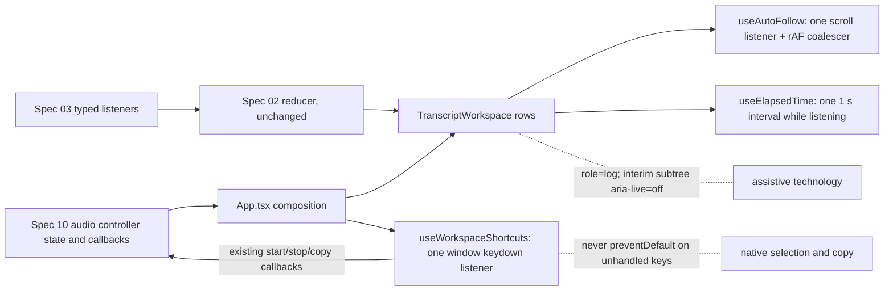

# Spec 11 — Desktop Interaction and Accessibility

## 1. Status, Ownership, Base, and Gates

- **Status:** Authorized for implementation in **DEVELOPMENT** mode after Spec 09 reaches `DEVELOPMENT COMPLETE`; not implemented.
- **Implementation owner:** One Spec 11 branch/worktree with one writer. Medium implementation is acceptable; high-capability review before merge is mandatory.
- **Required base:** One clean integration SHA containing merged Specs 01–09, including Spec 09’s development-only capture/error, ordering, and composition contracts.
- **Allowed implementation predecessor:** Spec 09 `DEVELOPMENT COMPLETE`. Everything else is inherited transitively; Spec 05 remains blocked.
- **Parallel-safe peer:** Spec 10, in its own worktree from the same base SHA. The split is exact: **Spec 11 owns `src/App.tsx` and `src/features/transcript/**`; Spec 10 owns native lifecycle and `src/features/audio/**`.** Neither may edit the other’s paths.
- **Serialization rule:** if this spec needs a change inside `src/features/audio/**`, `src-tauri/**`, or Spec 09’s frozen event union, it stops, records the requirement, and the integration owner serializes it after the first merge.
- **Consumed yielded requirements:** Spec 10 yields any `App.tsx` prop/slot/layout change needed to render recovering/degraded/terminal states and the transcript-annotation decision; this spec does not annotate outages in transcript content.
- **Successor gate:** Spec 12 may begin only reachable development/acceptance-harness work after Specs 10 and 11 merge as `DEVELOPMENT COMPLETE`; it cannot return `PASS` or freeze packaging inputs without a production-approved ASR model.
- **ASR maturity gate:** The active adapter remains `DevelopmentOnly`; `Development ASR • Not release approved` is a required accessible state, announced without flooding and never hidden by responsive layouts. Interaction/accessibility success cannot promote it; transcript-quality observations remain `NON-RELEASE EVIDENCE`.
- **Review level:** Medium implementation, high review. The spec touches no native code but owns every remaining `ui-context.md` promise and the non-release maturity presentation.

## 2. Goal and User-Visible Result

Turn the working dual-source workspace into a desktop app that behaves correctly under real use: long sessions, scrolling, keyboard-only operation, screen readers, small windows, and large text.

- `Cmd/Ctrl + Enter` starts and stops capture. `Cmd/Ctrl + Shift + C` copies the whole transcript. No single key, and specifically not `Space`, ever toggles recording.
- Native text selection and the platform copy shortcut keep working inside the transcript; the app never hijacks them.
- While listening, the transcript follows new lines **only if the user is already near the bottom**. Scrolling up stops the follow immediately and the view is never yanked back.
- While detached, a `Jump to latest` control appears; activating it, or scrolling back near the bottom, restores following.
- Elapsed capture time counts real session time, freezes on stop, and resets on the next start.
- `Clear` keeps its confirmation whenever finalized content exists, with correct focus handling and `Escape` to cancel.
- `Copy All` reports `Copied` without blocking, and a failure stays visible and retryable without touching the transcript.
- A screen reader hears finalized lines once, in order, and is **not** flooded by interim revisions from two sources.
- Everything is reachable and operable by keyboard with visible focus, at `720 × 520`, and at increased OS text scale, with no clipped control and no horizontal transcript scrolling.
- A one-hour transcript stays responsive: an interim update re-renders one row, not the whole list.
- Reduced-motion users get instant scrolling and no animation anywhere.

Observed in the real Tauri application on macOS and Windows, with a real screen reader on each platform.

## 3. Verified Current Behavior

Verified while authoring this spec:

- `/Users/berat/mistaken` does not exist. `/Users/berat/mistaken-context` is documentation-only and contains Specs 01–10.
- `ui-context.md` fixes the remaining interaction contract this spec implements: `Space` must not globally toggle recording; Start/Stop is `Cmd/Ctrl + Enter`; Copy All is `Cmd/Ctrl + Shift + C`; `Clear` has no dangerous single-key shortcut; auto-scroll happens **only if the user is already near the bottom**; scrolling upward must not forcibly pull the user back; auto-follow is restored on returning near the bottom or via a small `Jump to latest` control; minimum width target is about 720 px; source labels collapse before critical controls are hidden; reduced-motion preferences are respected and decorative animation avoided; status must not rely on color alone; all interactive controls need visible keyboard focus and accessible names; interim text must remain readable despite being muted.
- Spec 02 delivered and froze the transcript domain and its presentation baseline: the pure reducer with first-seen ordering, interim replacement in place, immutable finals, `segment_identity_conflict` rejection, `formatTranscriptSegment`/`serializeFinalTranscript` with the structural `- ` prefix and `\n\n` joining, the four-region layout, the interim textual marker, `Clear` inline confirmation with `Cancel`/`Escape` and focus restoration, `Copy All` pending/success/failure states in a polite live region, stable object identity so memoized rows do not rerender on unrelated interim updates, and a static `00:00:00` elapsed display.
- Spec 02 also recorded two explicit hand-offs to this spec: “Live announcements must be polite and must not duplicate the same final segment. Spec 11 may tune high-frequency announcement behavior after real events exist,” and “Spec 11 may add a bounded feedback timeout with explicit cleanup.” Spec 02 introduced no interval, timeout, global listener, or observer.
- Spec 06 throttles partials to at most one per 150 ms **per source**, and Spec 09 runs two sources concurrently, so up to roughly 13 interim mutations per second can reach the transcript container.
- Spec 09 froze the transcript order as emission order through Spec 02’s first-seen ordering, structural source attribution, and the rule that native payloads never contain a `- `.
- Spec 10 owns `src/features/audio/**` and native lifecycle, introduces recovering/degraded/terminal source states rendered there, and explicitly leaves to this spec whether a source outage receives any transcript-surface treatment.
- ARIA: `role="log"` has an implicit `aria-live="polite"` and implicit `aria-atomic="false"`, requires an accessible name, and is defined for content where new items are appended in a meaningful order — with the consequence that **mutations inside the region, including interim replacements, are also announced** unless a subtree overrides the live value (verified against MDN’s `log` role reference, 2026-09-11).
- No keyboard shortcut, scroll-follow behavior, elapsed timer, `Jump to latest` control, announcement policy, or large-transcript performance measurement exists yet.

No implementation report is authoritative. During implementation the merged source, real screen-reader behavior on each platform, and measured render behavior become authoritative; any difference from this section is recorded rather than assumed away.

## 4. Scope

### In scope

- A window-level keyboard-shortcut hook: `Cmd/Ctrl + Enter` for Start/Stop, `Cmd/Ctrl + Shift + C` for Copy All, with explicit guards, cleanup, and no interference with native selection/copy.
- Near-bottom auto-follow with a frozen threshold, detach on user scroll, restore on return, and a `Jump to latest` control.
- A real elapsed-time display driven by capture status, with one bounded interval and explicit cleanup.
- The frozen announcement policy: finals announced once through the log region, interim mutations excluded from announcements, error and feedback status announced in their own polite regions.
- Focus management for the `Clear` confirmation, `Jump to latest` appearance/disappearance, and shortcut-triggered actions.
- Bounded, cleaned-up `Copy All` feedback timing, and failure persistence.
- Responsive behavior at `1040 × 720` and `720 × 520`, with label collapsing, at 100 %, 150 %, and 200 % text scale.
- Reduced-motion handling for the only motion this app has: programmatic scrolling.
- Large-transcript render measurement: per-row rerender isolation under interim churn with roughly 1 000 finalized segments, and a recorded decision that virtualization stays out of scope unless the measurement fails.
- Consuming Spec 10’s yielded `App.tsx` requirement so its source states render, without editing its files.
- Durable interaction and accessibility tests plus real macOS/Windows keyboard and screen-reader verification.

### Out of scope

- Any change to Spec 02’s reducer, `formatTranscriptSegment`, `serializeFinalTranscript`, clipboard transport, source prefix rule, ordering, or final immutability. Presentation only.
- Any change to Spec 03’s commands, events, payloads, error codes, or revisions, and any change to Spec 09’s frozen contracts.
- Any edit to `src/features/audio/**`, `src-tauri/**`, the platform crates, `benchmarks/**`, tokens in `src/index.css`, or another spec file.
- Native lifecycle, recovery policy, lag detection, shutdown, and their presentation inside the audio feature. Spec 10 owns those.
- New visual design: theming, light mode, new tokens, icon set changes, layout redesign, chat bubbles, avatars, per-source colors.
- Transcript editing, search, filtering, per-source filtering, timestamps in the UI, export formats, selection toolbars, and context menus.
- A global/system-wide hotkey, tray icon, menu bar items, window management, or multi-window support.
- Virtualization, incremental rendering, or a second transcript store, unless the recorded measurement proves it necessary — in which case it becomes a recorded requirement, not an improvised change.
- Persistence of scroll position, follow state, elapsed time, or any preference.
- Animation, transitions, sound feedback, and haptics.
- Localization and copy rewrites beyond the exact strings this spec introduces.

## 5. Owned Files and Forbidden Concurrent Files

### Owned during Spec 11 implementation

- `src/App.tsx` — composition, shortcut wiring, and rendering Spec 10’s yielded source-state surface
- `src/features/transcript/TranscriptWorkspace.tsx` and the presentation components it owns
- `src/features/transcript/use-auto-follow.ts`, `use-elapsed-time.ts`, `use-workspace-shortcuts.ts` (or the exact equivalents the merged layout dictates)
- `src/features/transcript/**` tests for interaction and accessibility
- This spec’s implementation-evidence fields

### Consumed unchanged

- `src/features/transcript/transcript-domain.ts`, the reducer/session hook, and the clipboard serializer — **behavior frozen**; this spec may read them but must not alter their semantics, signatures, or outputs.
- `src/features/audio/**`, `src/lib/tauri/**`, `src/types/**`, `src/index.css`, `src/main.tsx`
- All of `src-tauri/**`, both platform crates, `benchmarks/**`
- `package.json` and `package-lock.json` — this spec adds **no dependency**. No hotkey library, virtualization library, animation library, or utility package.

### Yielded requirements

Recorded here, implemented by Spec 10 or the integration owner:

1. If the merged audio controller does not already expose Start/Stop and Copy-availability state through props or context reachable from `App.tsx`, exposing them is a Spec 10 change. This spec wires existing callbacks; it does not reach into the audio feature to create them.
2. Any per-source status text change needed for accessibility inside `src/features/audio/**`.

### Forbidden concurrent files

- Spec 10 must not edit `src/App.tsx` or `src/features/transcript/**`.
- Spec 11 must not edit `src/features/audio/**`, `src-tauri/**`, `docs/lifecycle-policy.md`, `benchmarks/**`, `docs/context/**`, or another spec file.

## 6. Contracts Consumed and Produced

### Keyboard contract produced — frozen

| Shortcut | Action | Guards |
|---|---|---|
| `Cmd + Enter` (macOS) / `Ctrl + Enter` (Windows) | toggle Start/Stop | ignored when the corresponding action is disabled or a transition is pending; ignored on `event.repeat`; ignored during IME composition |
| `Cmd + Shift + C` / `Ctrl + Shift + C` | Copy All | ignored when Copy All is disabled or a copy is already pending |
| `Escape` | cancel the `Clear` confirmation | only while the confirmation is open; never cancels capture |
| everything else | untouched | no `Space` toggle, no single-letter shortcut, no `Clear` shortcut |

Rules:

- Exactly **one** window-level `keydown` listener is registered, in one hook, with matching removal on unmount. No per-component global listener.
- The modifier is platform-correct: `metaKey` on macOS, `ctrlKey` on Windows, detected once from the platform rather than accepting either modifier on both systems.
- `preventDefault()` is called **only** when the event was actually handled. An unhandled combination passes through untouched, so native selection, `Cmd/Ctrl + C`, `Cmd/Ctrl + A`, and platform text navigation keep working inside the transcript.
- The shortcut layer never steals focus, never moves focus, and never changes scroll position beyond what the invoked action already does.
- `Cmd/Ctrl + Shift + C` collides with the browser devtools inspector shortcut in development webviews. The spec requires verifying both a development launch and a `--no-bundle` release-profile launch, and recording the observed behavior in each; the production behavior is the contract, and no workaround is added if development steals the key.
- Shortcut-invoked actions are identical to their button actions — the same callback, same disabled rules, same feedback — with no alternate code path.

### Auto-follow contract produced — frozen

- **Near-bottom threshold: 64 px.** `distanceFromBottom = scrollHeight - scrollTop - clientHeight`; the view is “near bottom” when that value is `≤ 64`.
- Follow is **on** at session start and whenever the user is near bottom.
- A user scroll that leaves the threshold detaches follow immediately and shows `Jump to latest`. Wheel, trackpad, touch, keyboard scrolling, and scrollbar dragging all count.
- While detached, no new segment, interim update, row-height change, or status change may alter `scrollTop`. This includes the common failure mode where an interim row grows and the browser adjusts scroll: the implementation must verify the scroll offset is stable across interim growth while detached.
- Follow is restored when the user scrolls back within the threshold, or activates `Jump to latest`, which scrolls to the bottom and restores following.
- Scroll handling is throttled with one `requestAnimationFrame` coalescer and one listener, both cleaned up on unmount. No polling interval, no `ResizeObserver` chain, no scroll library.
- Programmatic scrolling uses smooth behavior only when `prefers-reduced-motion` is not `reduce`; otherwise it jumps instantly. The preference is read live, so changing it mid-session takes effect without a relaunch.
- `Jump to latest` is a real button with an accessible name, reachable in tab order while visible, removed from the accessibility tree when hidden, and never the only way to reach the latest content — scrolling always works.

### Elapsed-time contract produced — frozen

- The display shows `HH:MM:SS`, zero-padded, derived from a session start instant captured when `captureStatus` becomes `listening`.
- It advances while `listening`, **including while a source is recovering or degraded**, because the session is still live per Spec 10.
- It freezes on `stopping`/`idle`/`error`, holding the final value until the next start, which resets it to `00:00:00`.
- Exactly **one** interval at 1 s exists, created on entering `listening` and cleared on leaving it and on unmount. No per-render timer, no drift accumulation from counting ticks: the value is recomputed from the start instant on each tick, so a throttled background tab or a skipped tick cannot desynchronize it.
- The element is a plain text region with an accessible name; it is **not** an ARIA `timer`/live region, because a per-second announcement would be intolerable.

### Announcement contract produced — frozen

This is the decision Spec 02 deferred, and it is grounded in `role="log"` semantics: the role implies `aria-live="polite"` and `aria-atomic="false"`, and **all** mutations inside it — including an interim row being replaced roughly 13 times per second across two sources — would otherwise be queued for announcement.

1. The transcript container keeps `role="log"` with a required accessible name (`Transcript`).
2. **Interim rows carry `aria-live="off"` on their own subtree**, overriding the inherited polite value, so revisions are not announced. The interim row remains fully readable by normal screen-reader navigation and keeps its visible textual marker.
3. When a segment finalizes, its row leaves the interim subtree and its content is announced once by the log’s polite semantics, in transcript order. No separate mirrored region duplicates it.
4. A finalized row is never re-announced: its content and object identity are stable per Spec 02, and no re-keying is introduced.
5. `Copied` / copy-failure feedback stays in its existing dedicated polite status region, separate from the log.
6. Per-source runtime errors are announced by Spec 10’s audio-feature regions; this spec does not duplicate them in the transcript region.
7. This policy is **verified with real assistive technology** — VoiceOver on macOS and Narrator on Windows — because ARIA semantics alone do not prove what a screen reader actually says. The observed behavior, including any platform deviation, is recorded, and a deviation is fixed or recorded as a known limitation rather than hidden.

### Interaction detail contracts produced

- **Clear:** keeps Spec 02’s behavior. Additionally frozen: `Clear` never stops capture; confirming clears everything present **at confirmation time**, including segments that arrived while the confirmation was open; `Escape` cancels and returns focus to the `Clear` button; confirming returns focus to a stable workspace target that exists in every state.
- **Copy All:** copies the finalized snapshot at activation. `Copied` appears in the polite region and clears after **2 s** via one bounded timeout that is cleared on unmount, on a new copy, and on `Clear`. A failure message persists until the next attempt, and neither outcome mutates the transcript.
- **Focus visibility:** every interactive control has a visible focus indicator meeting contrast requirements against `--bg-base` and `--bg-surface`, and focus is never removed by a transcript update, an interim revision, a status change, or a recovery event.
- **Disabled reasons:** every disabled primary control exposes its reason as text programmatically associated with the control, so a keyboard-only user learns why `Start Listening` or `Copy All` is unavailable without hovering.

### Responsive and performance contracts produced

- Layouts verified at `1040 × 720` and `720 × 520`, each at 100 %, 150 %, and 200 % OS text scale.
- Source labels collapse before any control is hidden; no critical control is ever unreachable; the transcript never scrolls horizontally; long unbroken recognizer output wraps rather than widening the layout.
- **Render isolation:** with roughly 1 000 finalized segments in memory, a single interim update must rerender only its own row plus the container, measured with render counters in a test, not asserted by inspection. Scrolling and typing-free interaction stay smooth on both reference hosts.
- Virtualization stays out of scope. If the measurement fails the criterion, that is recorded as a requirement for a follow-up decision by the integration owner, never improvised in this spec.

## 7. User Flow and Developer Verification Flow

### Keyboard-only flow

1. The user tabs from the microphone selector through the system-audio control to the primary action, seeing a visible focus ring at each stop.
2. `Cmd/Ctrl + Enter` starts capture; status and elapsed time update; focus stays where it was.
3. Text appears; the user presses `Cmd/Ctrl + Enter` again to stop.
4. `Cmd/Ctrl + Shift + C` copies; `Copied` is announced once and disappears after two seconds.
5. The user tabs to `Clear`, activates it, hears the confirmation, presses `Escape`, and focus returns to `Clear`.
6. `Space` is pressed with the transcript focused: nothing toggles.

### Long-session scrolling flow

1. A 40-minute session has scrolled far; the user is near the bottom and new lines keep arriving in view.
2. The user scrolls up to re-read an earlier exchange. Follow detaches; `Jump to latest` appears.
3. New finals and interim revisions keep arriving. The scroll position does not move, including while an interim row grows.
4. The user selects text and copies it with the platform shortcut; selection is unaffected by arriving updates elsewhere in the list.
5. The user activates `Jump to latest`: the view moves to the bottom — instantly if reduced motion is requested — and following resumes.

### Screen-reader flow

1. With VoiceOver or Narrator running, the user starts capture.
2. Interim revisions produce no announcements.
3. Each finalized line is announced once, in transcript order, with system lines read including their `- ` prefix.
4. `Copied` and copy failures are announced from the status region; per-source errors are announced from the audio feature.

### Developer verification flow

- Automated tests cover shortcut handling and guards, pass-through of unhandled keys, auto-follow attach/detach/restore including the interim-growth case, elapsed-time computation and interval cleanup, feedback timeout cleanup, focus behavior, disabled-reason association, and render isolation with a large transcript.
- Real verification runs the actual app on macOS and Windows: keyboard-only walkthrough, screen-reader session, both window sizes at three text scales, reduced-motion toggle, development versus release-profile shortcut behavior, and a long-session scroll exercise using a session driven by real capture.
- Automated accessibility assertions use role/name queries and computed contrast; they do not replace the real screen-reader session.

## 8. UI Behavior, States, Tokens, and Accessibility

### New and changed surfaces

| Element | Behavior | Tokens |
|---|---|---|
| Elapsed time | `HH:MM:SS`, advances while listening, freezes on stop, resets on start | `--text-secondary`, `--font-mono` |
| `Jump to latest` | appears only while detached; scrolls to bottom and restores follow | `--bg-elevated`, `--border-strong`, `--text-secondary`; `rounded-lg` |
| Interim rows | unchanged appearance; gain `aria-live="off"` | `--text-interim` plus the existing textual marker |
| Transcript container | `role="log"`, accessible name `Transcript` | unchanged |
| Disabled reasons | short sentence associated with its control | `--text-muted` |

Rules:

- No new token, color, radius, font, or icon is introduced; only the existing set from `ui-context.md` is used.
- `Jump to latest` is text-plus-icon, not icon-only, per the V1 rule that critical actions are not icon-only.
- No animation anywhere; the only motion is programmatic scrolling, which is instant under reduced motion.
- Status, degradation, and error remain distinguishable without color, since the transcript itself carries no color-coded state.
- The transcript stays the dominant surface: the new control is compact, does not overlay transcript text permanently, and never covers the last line while active.

### Accessibility requirements

- Landmark/region structure and accessible names for the four regions established by Spec 02 remain intact and are verified, not assumed.
- Tab order is visual order: source bar → transcript (focusable container for scrolling) → bottom actions.
- The transcript container is keyboard-scrollable and focusable, so a keyboard-only user can read a long session without a mouse.
- Every control has a visible focus indicator with sufficient contrast in both surface contexts; focus is never lost to a re-render.
- Contrast is computed, not eyeballed: primary, secondary, muted, interim, warning, error, and accent text are each checked against their real backgrounds, and any failure is fixed by choosing an existing token, never by inventing a new color.
- Text scaling to 200 % keeps every control reachable and the transcript readable; no fixed height clips content.

## 9. Frontend → Tauri IPC → Rust / Audio / ASR Data Flow

This spec adds **no** IPC, command, event, native code, or data-flow stage. It consumes existing frontend state only.

Rules:

- Shortcuts call the same callbacks the buttons call; no new command path, no direct `invoke`, no second clipboard call site.
- The reducer, formatter, and serializer are invoked exactly as merged; this spec adds no transformation, sort, filter, or derived copy of transcript text.
- No transcript text is copied into a second store, a ref cache, a DOM attribute, or a log.

## 10. Platform, Permissions, Offline, Privacy, and Fallback

### Platform

- The modifier mapping is platform-detected once: `metaKey` on macOS, `ctrlKey` on Windows. A macOS build must not accept `Ctrl + Enter` as an alias, and a Windows build must not accept `Meta + Enter`, so the shortcuts match platform convention exactly.
- Scroll behavior, momentum, and scrollbar presence differ between platforms; the 64 px threshold and the detach rule are verified on both rather than tuned on one.
- Screen-reader verification uses VoiceOver on macOS and Narrator on Windows; a platform-specific deviation is recorded with its exact observed behavior.
- The development-webview conflict on `Cmd/Ctrl + Shift + C` is verified separately from the release-profile launch, and the production behavior is what the contract asserts.

### Permissions

- No new permission, capability, command, event, or CSP change. This spec cannot request anything: it has no native surface.
- No global/system-wide hotkey registration, which would require a new capability and would capture keys outside the app.

### Offline and privacy

- Rendering, scrolling, shortcuts, elapsed time, confirmation, and copy require no network; verification runs with networking disabled.
- No transcript text, segment id, or status is persisted, logged, or sent anywhere. Scroll position, follow state, and elapsed time are volatile React state.
- Accessibility evidence records roles, names, announcement counts, focus targets, and contrast ratios — **never transcript content beyond the short scripted lines already used in earlier specs**.
- No storage API, no analytics, no error reporting, no screenshot upload.

### Fallback rules

- A disabled action invoked by shortcut does nothing visible and reports nothing; it never queues, never retries, and never partially executes.
- A copy failure keeps the transcript intact and stays retryable.
- If `prefers-reduced-motion` cannot be read, the implementation defaults to **instant** scrolling, because the accessible default is the conservative one.
- If the render-isolation measurement fails, the result is recorded as a requirement for a follow-up decision; no virtualization, throttling of finals, or transcript truncation is introduced to make a number look better.
- If a screen reader deviates from the announcement contract, the deviation is recorded as a known limitation with its platform and version; announcements are never made assertive to force the issue, because that would interrupt the user constantly.

## 11. Resource Lifecycle, Bounded Buffering, Errors, and Recovery

This spec owns no audio, so its bounds are DOM and timer bounds.

### Subscriptions and timers — exhaustive

| Resource | Count | Created | Cleaned up |
|---|---|---|---|
| window `keydown` listener | 1 | on mount of the shortcut hook | on unmount |
| transcript `scroll` listener | 1 | on mount of the auto-follow hook | on unmount |
| `requestAnimationFrame` coalescer | ≤ 1 outstanding | on scroll | cancelled on unmount and before each new frame |
| elapsed interval | 1 | on entering `listening` | on leaving `listening` and on unmount |
| copy-feedback timeout | ≤ 1 | on copy success | cleared on unmount, new copy, and `Clear` |
| reduced-motion media query listener | 1 | on mount | on unmount |

No other interval, timeout, observer, subscription, worker, or global listener may exist in owned code. A test asserts that mounting and unmounting the workspace leaves zero outstanding timers and listeners.

### Memory and rendering

- No second copy of transcript text is retained; rows read from the reducer state.
- `Jump to latest` visibility derives from scroll state only; it holds no segment references.
- Clipboard serialization still allocates once per explicit copy, per Spec 02, and the string is released after the promise settles.
- A one-hour transcript is expected to hold thousands of segments; the render-isolation criterion and the recorded measurement are how that is kept honest.

### Error handling

- A shortcut handler that throws must not break the listener: the handler wraps action invocation so one failure cannot unregister the listener or leave the app unresponsive, and the failure surfaces through the existing feedback path.
- A scroll-metric read on a detached node is a no-op, not a crash, during unmount races.
- Nothing in this spec can produce a `RuntimeError`; it only presents ones produced elsewhere.

## 12. Numbered Measurable Acceptance Criteria

1. **Base, isolation, and parallel split — both hosts:** Spec 11 starts from the recorded post-Spec-09 SHA in its own worktree; the final diff touches only `src/App.tsx` and `src/features/transcript/**`; `git status` shows no change to `src/features/audio/**`, `src-tauri/**`, the platform crates, `benchmarks/**`, `src/index.css`, manifests, or another spec file.
2. **No contract or dependency change — platform-neutral:** Spec 02’s domain tests and Spec 03/09’s suites pass unmodified; the reducer, formatter, serializer, prefix rule, and ordering are untouched; `package.json` and `package-lock.json` show zero diff.
3. **Start/Stop shortcut — real macOS and Windows:** The platform-correct modifier with `Enter` toggles capture exactly like the button, is ignored while disabled or pending and on key repeat, and the wrong-platform modifier does nothing.
4. **Copy shortcut — real macOS and Windows:** The platform-correct modifier with `Shift + C` copies exactly like the button, is ignored while disabled or a copy is pending, and the development-versus-release-profile behavior of the combination is recorded for each host.
5. **No hijacking — real macOS and Windows plus tests:** `Space` never toggles capture; native selection, platform copy, select-all, and text navigation work inside the transcript; `preventDefault` is called only for handled combinations, proven by a test over a matrix of unhandled keys.
6. **Single listener discipline — tests:** Exactly one window `keydown` listener, one scroll listener, one reduced-motion listener, at most one outstanding animation frame, one elapsed interval, and at most one feedback timeout exist; mount/unmount cycles leave zero outstanding timers or listeners.
7. **Near-bottom follow — real hosts plus tests:** With `distanceFromBottom ≤ 64` new content stays in view during live dual-source capture; the threshold behaves identically on both platforms.
8. **Detach on user scroll — real hosts plus tests:** Scrolling up beyond the threshold detaches follow immediately and reveals `Jump to latest`; wheel, keyboard, and scrollbar interaction all detach.
9. **Detached stability including interim growth — tests plus real run:** While detached, `scrollTop` does not change across new finals, interim replacements, a growing interim row, status changes, or a Spec 10 recovery event.
10. **Restore follow — real hosts plus tests:** Scrolling back within the threshold restores follow; `Jump to latest` scrolls to bottom, restores follow, and disappears; the control is keyboard-reachable with an accessible name and leaves the accessibility tree when hidden.
11. **Reduced motion — real hosts:** With `prefers-reduced-motion: reduce`, all programmatic scrolling is instant and no animation occurs; toggling the preference mid-session changes behavior without relaunch; an unreadable preference defaults to instant.
12. **Elapsed time — real hosts plus tests:** Shows `HH:MM:SS`, advances while listening including while a source is recovering or degraded, freezes on stop, resets on the next start, is recomputed from the start instant rather than accumulated ticks, and is not an ARIA live region.
13. **Interim revisions are not announced — real VoiceOver and Narrator:** During live dual-source capture with roughly 13 interim mutations per second, the screen reader announces no interim revisions, and interim text remains reachable by normal navigation.
14. **Finals announced once, in order — real VoiceOver and Narrator:** Each finalized line is announced exactly once, in transcript order, with system lines including their `- ` prefix; no finalized line is re-announced; the observed behavior per platform and version is recorded, and any deviation is recorded rather than forced with `assertive`.
15. **Feedback and error announcements — real hosts:** `Copied` and copy-failure announce from the existing polite status region and are not duplicated by the log; per-source errors announce only from the audio feature.
16. **Clear behavior — real hosts plus tests:** `Clear` never stops capture; confirmation appears whenever finalized content exists; `Escape`/`Cancel` preserves everything and returns focus to `Clear`; confirming clears everything present at confirmation time, including segments that arrived during the confirmation, and returns focus to a stable target.
17. **Copy feedback lifecycle — tests plus real hosts:** `Copied` clears after 2 s; the timeout is cleared on unmount, on a new copy, and on `Clear`; a failure message persists until the next attempt; neither outcome mutates the transcript.
18. **Focus integrity — real hosts plus tests:** Every control has a visible, sufficiently contrasting focus indicator; focus is never lost or moved by a transcript update, interim revision, status change, `Jump to latest` appearing/disappearing, or a shortcut-invoked action.
19. **Disabled reasons — tests plus real hosts:** Each disabled primary control exposes its reason as text programmatically associated with the control, discoverable without pointer hover.
20. **Responsive and text scaling — real macOS and Windows:** At `1040 × 720` and `720 × 520`, each at 100 %, 150 %, and 200 % text scale, every control is reachable, source labels collapse before controls are hidden, the transcript never scrolls horizontally, long unbroken output wraps, and nothing is clipped by a fixed height.
21. **Contrast — computed evidence:** Primary, secondary, muted, interim, warning, error, and accent text plus focus indicators meet WCAG AA against their actual backgrounds, with computed ratios recorded; any fix uses an existing token.
22. **Render isolation at scale — measured:** With roughly 1 000 finalized segments, one interim update rerenders only its own row plus the container, proven by render counters; interaction stays smooth on both hosts; if the criterion fails, the measurement and a follow-up requirement are recorded and no virtualization or truncation is improvised.
23. **Spec 10 boundary — integration:** Spec 10’s recovering/degraded/terminal source states render correctly through this spec’s composition; the transcript surface adds **no** outage annotation, gap marker, or placeholder row; every cross-boundary need is a recorded yielded requirement rather than an edit.
24. **Offline, privacy, and checks — both hosts:** All flows run with networking disabled; inspection finds no storage, network, logging of transcript text, or second transcript copy; typecheck, lint, frontend tests, and build pass; the real Tauri app launches and is exercised on both hosts; `cargo check` still passes with no native change.
25. **High-capability review — integration:** Review covers shortcut safety and pass-through, follow-state correctness including the interim-growth case, timer and listener discipline, the announcement policy against real assistive-technology evidence, focus integrity, contrast, scaling, render isolation, and respect for Spec 02’s frozen domain and Spec 10’s paths; every High/Medium finding is fixed and re-verified.

## 13. Acceptance Criterion → Verification/Test Mapping

| AC | Verification or permanent test | Evidence to record |
|---|---|---|
| 1 | Inspect base SHA, worktree, branch, and final changed-path list | Root, branch, base SHA, owned-path diff, zero forbidden-path changes |
| 2 | Run merged Spec 02/03/09 suites unmodified; diff domain files and manifests | Suite results, zero-diff confirmation |
| 3 | Keyboard tests with platform modifier matrix; real toggling on each host | Handled/ignored cases, real toggle observations |
| 4 | Copy-shortcut tests; real copy on each host in dev and release-profile launches | Clipboard result, per-launch behavior record |
| 5 | Unhandled-key matrix test; real selection/copy/select-all in the transcript | Pass-through results, selection observations |
| 6 | Mount/unmount assertions on timers and listeners | Counts before/after, zero-leak result |
| 7 | Scroll-metric tests at the threshold; live dual-source session on each host | Threshold behavior, in-view observations |
| 8 | Detach tests per input method; real scroll-up during capture | Detach observations, control appearance |
| 9 | Stability test with growing interim content while detached; real long session | `scrollTop` before/after each event class |
| 10 | Restore tests plus real `Jump to latest` activation and keyboard reach | Restore behavior, accessible name, hidden-state tree check |
| 11 | Toggle the OS reduced-motion setting during a session on each host | Scroll behavior per setting, mid-session change, default-on-unreadable |
| 12 | Elapsed-time unit tests with a controllable clock; real long run through recovery | Displayed values, freeze/reset behavior, non-live-region check |
| 13 | Real VoiceOver and Narrator sessions during dual-source capture | Announcement counts for interim, navigation reachability |
| 14 | Same sessions, counting finalized-line announcements | Per-line announcement counts, order, prefix reading, platform/version |
| 15 | Trigger copy success and failure with a screen reader running | Announcement source and count, no duplication |
| 16 | user-event tests for all confirmation paths; real keyboard exercise | Segment counts, focus targets, arrival-during-confirmation case |
| 17 | Timeout tests plus real copy success/failure | Feedback duration, cleanup proof, transcript integrity |
| 18 | Focus tests across update classes; real keyboard walkthrough | Focus targets, indicator contrast, no-loss proof |
| 19 | Role/name/description tests; screen-reader read of each disabled control | Exposed reason text per control |
| 20 | Visual and keyboard checks at both sizes × three text scales on each host | Observations per combination, collapse behavior, wrap behavior |
| 21 | Computed contrast for each token/background pair, including focus rings | Ratio table with pass/fail and any fix applied |
| 22 | Render-counter test with ~1 000 finals; interaction smoothness on each host | Rerender counts, timing observations, follow-up requirement if failed |
| 23 | Render Spec 10’s source states through the composition; inspect transcript surface | State rendering evidence, zero-annotation proof, yielded-requirement list |
| 24 | Run all flows networking-disabled; inspect storage/network/logs; run the check set | Disable method, zero-findings statement, exact commands and exits |
| 25 | High-capability review of the finished diff and both boundaries | Findings, dispositions, final Git state |

Permanent tests protect shortcut handling and pass-through, follow-state transitions including interim growth, timer/listener cleanup, elapsed-time computation, focus behavior, disabled-reason association, and render isolation. They must not assert function forwarding, mock echoes, constant existence, source text, or bare non-throwing behavior. Real screen-reader announcement behavior, reduced-motion behavior, text scaling, and interaction smoothness require the real hosts and cannot be replaced by automated queries.

## 14. Ordered Implementation Plan

1. After Spec 09 merges with its contracts frozen, create the Spec 11 worktree from the recorded base. Record root, branch, base SHA, and confirm Spec 10 owns a disjoint worktree and paths.
2. Re-read the canonical context, `ui-context.md`’s interaction and accessibility sections, Specs 02, 03, 06, 09, and 10, and the merged workspace source. Run baseline checks.
3. Inspect the merged audio controller’s public surface. If Start/Stop or Copy availability is not reachable from `App.tsx`, record the yielded requirement and proceed with the rest rather than editing `src/features/audio/**`.
4. Implement the shortcut hook with one listener, platform-detected modifier, guards, handled-only `preventDefault`, and throw isolation; add the unhandled-key matrix test first.
5. Implement the elapsed-time hook with one interval, recomputation from the start instant, and status-driven lifecycle; test with a controllable clock.
6. Implement the auto-follow hook: one scroll listener, one rAF coalescer, the 64 px threshold, detach/restore rules, and detached scroll stability; test the interim-growth case explicitly before wiring the UI.
7. Add the `Jump to latest` control with its accessible name, tab reachability, and hidden-state removal.
8. Apply the announcement policy: `role="log"` with its name, `aria-live="off"` on the interim subtree, and no mirrored region.
9. Refine `Clear` confirmation focus handling and the arrival-during-confirmation rule, and the bounded copy-feedback timeout with all three cleanup paths.
10. Add disabled-reason associations and audit focus indicators against both surface tokens.
11. Compose everything in `App.tsx`, including Spec 10’s yielded source-state surface, without touching its files.
12. Add the render-isolation test with roughly 1 000 finalized segments and render counters.
13. Add the remaining interaction and accessibility tests mapped to the acceptance criteria; delete any Spec 02 test that this spec’s behavior supersedes rather than re-pinning obsolete copy.
14. Verify on real macOS with networking disabled: keyboard-only walkthrough, both shortcuts in development and release-profile launches, scroll detach/restore during real dual-source capture, reduced-motion toggle, both window sizes at three text scales, computed contrast, and a full VoiceOver session.
15. Repeat step 14 on real Windows with Narrator, recording any platform deviation exactly.
16. Review the whole diff for extra listeners or timers, hijacked keys, follow-state edge cases, announcement flooding, focus loss, contrast failures, clipped layouts, and any drift in Spec 02’s frozen domain or Spec 10’s paths. Fix every High/Medium finding and rerun affected verification.
17. Remove temporary seeding fixtures, render-counter instrumentation from production paths, and scratch artifacts.
18. Update only this spec’s evidence; create the focused local commit unless directed otherwise; report roots, branches, SHAs, hosts, assistive-technology versions, contrast ratios, and measurements; do not push unless requested.

## 15. Risks, Rollback, Cleanup, and Preservation Rules

### Risks and mitigations

- **Announcement flooding:** `role="log"` announces every mutation politely, and two sources revise interim text roughly 13 times per second, which would make a screen reader useless. Override the interim subtree with `aria-live="off"` and verify with real assistive technology instead of trusting the markup.
- **Forced assertive escalation:** making announcements assertive to “make sure” they are heard would interrupt the user constantly. Prohibited; a platform deviation is recorded as a limitation.
- **Scroll yanking:** the classic live-log bug is pulling the reader back to the bottom. Detach on any user scroll past the threshold and prove `scrollTop` stability across new finals, interim growth, status changes, and recovery events.
- **Key hijacking:** a broad `preventDefault` would break native selection and copy inside the transcript, which is how the user gets text into Obsidian. Handle only the two combinations and prove pass-through over a key matrix.
- **Wrong-platform modifier:** accepting both `Meta` and `Ctrl` everywhere feels convenient but breaks platform convention and can collide with system shortcuts. Detect the platform once.
- **Devtools collision:** `Cmd/Ctrl + Shift + C` is the inspector shortcut in development webviews. Verify development and release-profile launches separately and record both instead of adding a workaround that changes production behavior.
- **Timer and listener leaks:** hooks that register globals are the most common leak source in a long-lived desktop app. Enumerate every subscription in the spec, cap each count, and assert zero outstanding after unmount.
- **Elapsed-time drift:** counting ticks drifts under throttling. Recompute from the start instant.
- **Focus loss on update:** re-keying rows or conditionally unmounting a focused control would drop focus during live transcription. Keep Spec 02’s stable identity and test focus across every update class.
- **Layout collapse at 200 % text:** growing text can hide the primary action, which is the one control the user must reach. Verify all six size/scale combinations and collapse labels before controls.
- **Performance cliff on long sessions:** a one-hour transcript with 13 interim updates per second can rerender thousands of rows. Measure render isolation with counters; if it fails, record a requirement instead of improvising virtualization that could break ordering or selection.
- **Scope creep into Spec 10 or Spec 02:** adding an outage marker to the transcript or “improving” the serializer would violate two frozen contracts. The transcript surface carries no lifecycle annotation, and the domain is read-only here.
- **Accessibility theater:** passing automated role queries while a real screen reader is unusable. Automated assertions are necessary but never sufficient; real VoiceOver and Narrator sessions are acceptance criteria.

### Rollback

- Before merge, abandon the Spec 11 branch/worktree; Spec 09’s behavior and Spec 10’s work remain intact.
- After merge, reverting Spec 11 must restore Spec 02’s presentation baseline plus Spec 09’s composition, removing shortcuts, auto-follow, `Jump to latest`, the elapsed timer, and the announcement overrides, while leaving `src/features/audio/**` and all native code untouched.
- Once Spec 12 accepts against these behaviors, use a coordinated forward fix or revert dependent commits in reverse order.
- Never reset, clean, or delete unrelated user work, another worktree, OS accessibility or motion settings, or `/Users/berat/mistaken-context`.

### Required cleanup

- Remove transcript seeding fixtures, render-counter instrumentation, and any temporary large-transcript generator from production paths; retained versions live in tests only.
- Remove any experimental virtualization, animation, scroll library trial, or hotkey library trial; the lockfile must show zero diff.
- Delete Spec 02 tests that this spec’s behavior genuinely supersedes instead of re-pinning obsolete copy, and record which ones and why.
- Remove unused imports, dead branches, and any leftover `00:00:00` placeholder logic replaced by the real timer.

### Preservation rules

- Preserve Spec 02’s reducer, first-seen ordering, interim replacement, final immutability, `segment_identity_conflict` behavior, formatter, serializer, structural `- ` prefix, and clipboard transport exactly.
- Preserve Spec 03’s command/event/error/revision surface and Spec 09’s ordering, attribution, and composition contracts.
- Preserve Spec 10’s ownership of `src/features/audio/**` and native lifecycle, and its recovering/degraded/terminal presentation semantics.
- Preserve `Development ASR • Not release approved` as persistent visible and accessible text; no control state, screen size, or success color may obscure or contradict it.
- Preserve the `ui-context.md` visual language: no chat bubbles, avatars, gradients, per-source colors, new tokens, or decorative animation; the transcript stays dominant.
- Preserve local-only, volatile behavior: no persistence of scroll, follow state, elapsed time, or preferences, and no logging of transcript text.
- Preserve the zero-dependency constraint; a genuine need becomes a recorded requirement for the integration owner.

## 16. Definition of Done and Evidence Record

Spec 11 is `DEVELOPMENT COMPLETE` only when the real Mistaken application on macOS and Windows toggles capture
with platform-correct `Cmd/Ctrl + Enter`, copies with `Cmd/Ctrl + Shift + C`, never hijacks native selection or
copy, never toggles on `Space`, follows new transcript lines only near the bottom, holds its scroll position
while detached including across interim growth, restores following by scroll or a keyboard-reachable
`Jump to latest`, shows an elapsed timer that advances through recovery and resets per session, announces each
final exactly once through a named `role="log"` while announcing no interim revision — verified with VoiceOver
and Narrator — keeps focus visible and stable, exposes disabled reasons as text, remains usable at both window
sizes across three text scales with computed AA contrast, rerenders only one row per interim update with a
thousand finals, keeps `Development ASR • Not release approved` visible and accessible, adds no dependency,
timer/listener leak, persistence, or transcript annotation, and satisfies every acceptance criterion with
networking disabled — without touching Spec 02’s domain, Spec 10’s paths, or native code. These results prove
interaction architecture only; they cannot approve fidelity, satisfy Spec 12, authorize packaging, or support
`RELEASE-READY`.

### Required implementation evidence

Fill during implementation; do not predeclare success:

- **Implementation status:** Not implemented
- **Canonical repository root:** Pending Spec 01
- **Worktree root / branch / base SHA / implementation commit SHA:** Pending
- **Changed paths and zero-forbidden-path confirmation:** Pending
- **Manifest/lockfile zero-diff confirmation:** Pending
- **Yielded requirements recorded for Spec 10 / integration owner:** Pending
- **Development-ASR label visibility/announcement across states, sizes, and text scales:** Pending
- **macOS hardware/version; Windows hardware/edition/version/build:** Pending
- **Shortcut behavior per host, development launch versus release-profile launch:** Pending
- **Unhandled-key pass-through matrix result:** Pending
- **Listener/timer inventory and mount–unmount zero-leak result:** Pending
- **Follow threshold behavior, detach inputs exercised, restore observations per host:** Pending
- **Detached `scrollTop` stability results per event class, including interim growth:** Pending
- **Reduced-motion observations per host, including mid-session toggle:** Pending
- **Elapsed-time observations across start, recovery, stop, and restart:** Pending
- **VoiceOver session: interim announcement count, finalized-line counts and order, prefix reading, version:** Pending
- **Narrator session: same measurements and version, plus any deviation:** Pending
- **Copy feedback and error announcement observations:** Pending
- **Clear confirmation paths, focus targets, arrival-during-confirmation result:** Pending
- **Focus integrity results across update classes:** Pending
- **Disabled-reason exposure per control:** Pending
- **Size × text-scale observation matrix (2 × 3) per host:** Pending
- **Computed contrast ratio table with pass/fail and applied fixes:** Pending
- **Render-isolation measurement with ~1 000 finals and interaction smoothness:** Pending
- **Spec 10 source-state rendering evidence and zero-transcript-annotation proof:** Pending
- **Superseded Spec 02 tests removed, with reasons:** Pending
- **Offline and privacy inspection results:** Pending
- **Typecheck/lint/test/build results and `cargo check`:** Pending
- **Temporary fixture and instrumentation removal confirmation:** Pending
- **High-capability review findings and dispositions:** Pending
- **Final Git status:** Pending

### Authoring evidence and sources

- Reviewed `/Users/berat/mistaken-context/project-overview.md`, `architecture.md`, `ui-context.md`, `code-standards.md`, `ai-workflow-rules.md`, `progress-tracker.md`, `spec-plan.md`, and Specs 01–10.
- Verified the application repository is absent and the context bundle remains documentation-only.
- Primary sources retrieved 2026-09-11:
  - [MDN, ARIA `log` role — implicit `aria-live="polite"`, implicit `aria-atomic="false"`, required accessible name, and announcement of changes within the region](https://developer.mozilla.org/en-US/docs/Web/Accessibility/ARIA/Reference/Roles/log_role)
  - [WAI-ARIA 1.2 Recommendation, the normative source for the `log` role and live-region semantics](https://www.w3.org/TR/wai-aria-1.2/)
  - `ui-context.md`’s interaction, responsive, and accessibility sections, and Specs 02, 06, 09, and 10 in this bundle, whose frozen contracts, throttles, and ownership boundaries define this spec’s limits.

Authoring this file is not implementation evidence. Every pending field remains pending until Spec 11 is applied in the real repository and the keyboard, scrolling, screen-reader, scaling, and render-isolation evidence is observed on both hosts.
