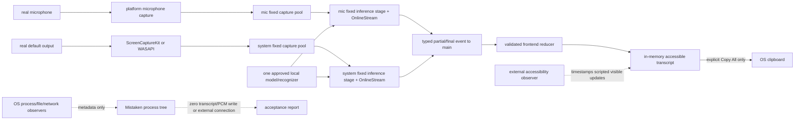

# Spec 12 — Offline, Privacy, and Performance Acceptance

## 1. Status, Ownership, Base, and Gates

- **Status:** Authorized only for reachable acceptance-harness and development-diagnostic work after Specs 10/11; **BLOCKED for `PASS` and packaging authorization** until Spec 05 approves a production model.
- **Implementation owner:** One Spec 12 branch/worktree with one high-capability writer. A mandatory independent high-capability review closes reachable work.
- **Required base:** One clean integration SHA containing Specs 01–11 merged and reviewed for their applicable development maturity, including Specs 10/11 `DEVELOPMENT COMPLETE` evidence.
- **Allowed implementation predecessors:** Specs 10 and 11. Everything else is inherited transitively.
- **Parallel safety:** No other writer may use the Spec 12 checkout. Acceptance can expose defects anywhere, and this spec is serialized for source-level fixes tied to measured failures.
- **Production model gate:** Spec 05 must name exactly one `ProductionApproved` candidate with complete runtime/model/configuration, both-host measurements, license, provenance, redistribution, and delivery records before Spec 12 may return `PASS`, freeze release inputs, or authorize Specs 13/14. The temporary `DevelopmentOnly` adapter may exercise reachable harness, privacy, lifecycle, source-separation, and resource scenarios, but every transcript-quality result is `NON-RELEASE EVIDENCE` and the cross-host verdict remains `BLOCKED`.
- **Host gate:** Both `mac-arm64` and `win-x64` reference hosts are mandatory for eventual `PASS`. One host never stands in for the other.
- **Successor gate:** Specs 13 and 14 cannot start until this spec has a production-approved model and returns reviewed cross-host `PASS` from one final SHA. No temporary-adapter run may produce a successor freeze manifest or packaging authorization.
- **Review level:** High implementation and high review. A `PASS` claim affects offline trust, private user content, native resource safety, and release inputs.

## 2. Goal and User-Visible / Measurable Result

Prove the complete Mistaken core flow as one coherent product rather than as a set of previously passing components.

With the temporary adapter, the same scenarios may be run to validate architecture, but the application must retain `Development ASR • Not release approved`, reports must return `BLOCKED`, and no packaging freeze is produced.

On each supported reference host, the user launches a release-profile native app with every non-loopback network interface disabled, selects a real microphone, optionally enables system audio, starts capture, receives live partials and stable finals from both isolated sources, scrolls and copies or clears the transcript, stops, starts again, closes the app, and relaunches into a clean idle state.

The result is accepted only when all of the following are observed against the exact final SHA and a `ProductionApproved` artifact:

- The complete core flow works without an account, API key, backend, database, cloud session, runtime download, or required internet connection.
- Microphone and system audio remain isolated; only formatted system lines receive `- ` and native text is never prefixed or rewritten.
- No transcript or PCM content is written by Mistaken to application storage, browser storage, a database, a log, a crash-report sink, or a network destination. `Copy All` is the one explicit user-owned persistence boundary and writes only final formatted text to the OS clipboard.
- The approved model/runtime/configuration still passes Spec 05’s fidelity, accuracy, hallucination, latency, RTF, CPU, RSS, stability, size, and license gates on both hosts.
- End-to-end visible partial/final latency in the real app meets the same approved latency thresholds, not a relaxed “UI allowance.”
- A normal 60-minute dual-source session has no drops, leak, allocation ratchet, source crossover, or hidden degradation. Deliberate saturation proves fixed bounds and visible drop-newest behavior without growth, auto-tuning, cloud fallback, or loss of control.
- Spec 10 lifecycle/recovery behavior and Spec 11 keyboard, scrolling, focus, screen-reader, responsive, and render-isolation behavior still work while both sources are active.
- The exact version, model resource mapping, attribution resource, binary/model identities, and dependency locks are frozen for Specs 13 and 14.

A passing build, component test, benchmark-only result, source audit, or single-platform run is insufficient.

## 3. Verified Current Behavior

Verified while authoring this spec:

- `/Users/berat/mistaken` does not exist. `/Users/berat/mistaken-context` is a documentation-only staging bundle containing context, the delivery plan, and Specs 01–11. There is no application source, Git branch, build, runtime trace, model approval, or native acceptance result to inspect yet.
- `architecture.md` requires local-only core transcription, two isolated sources, bounded transient PCM, in-memory transcript state, no database, no cloud storage, no correction layer, no cloud fallback, and local model redistribution only after explicit weight-license verification.
- Spec 05 keeps every quality/performance gate unchanged. Its payload policy now permits either an installer-bundled model under the recorded bundled ceiling or a separately provisioned checksum-pinned local resource; no replacement numeric ceiling exists until a concrete production-approved candidate justifies and records one.
- Spec 06 freezes a `DevelopmentOnly` adapter/configuration copied from the exact temporary candidate descriptor, verifies every file by size/SHA-256, loads once, uses one replaceable recognizer boundary, provides no cloud/alternate fallback, and visibly labels the app non-release.
- Spec 09 freezes atomic requested-source start, one shared recognizer with two isolated streams/workers/pools/stages, emission-order aggregation, structural attribution, ≤ 10 seconds total queued audio, and `decode_multiple_streams` unused absent a later measured/reviewed decision.
- Spec 10 freezes bounded per-source recovery, visible degradation, shutdown, watchdogs, counters, and a 60-minute dual-source soak. Its gate requires RSS growth after minute 5 ≤ 5%, flat native thread and handle/descriptor counts, and no allocation ratchet after recovery.
- Spec 11 freezes keyboard shortcuts, a 64 px near-bottom threshold, detached-scroll stability, reduced-motion behavior, one-time final announcements, bounded frontend resources, two minimum window sizes, 100%/150%/200% text scale, and single-row rerender isolation at roughly 1,000 finalized segments.
- Tauri’s official security model says Rust core/plugin code has full access to available system resources while WebView access is constrained by the IPC/capability boundary. Therefore capability inspection alone cannot prove privacy; native source review and dynamic process-tree observation are also mandatory.
- Tauri’s official resource documentation supports a `bundle.resources` entry that preserves the relative directory tree and resolves through `BaseDirectory::Resource`; this matches Spec 06’s required `resources/models/<model_id>/` runtime path.
- Apple documents Instruments templates for Time Profiler, Allocations, File Activity, and Network inspection, and recommends measuring the actual app on the real target device.
- Microsoft documents `GetProcessTimes` user/kernel time, `GetProcessMemoryInfo`, Process Monitor’s file/process/thread trace and process tree, Windows Performance Recorder’s ETW-based system/application tracing on Windows 8+, and Windows Filtering Platform Security events 5156/5157 with process id, executable path, direction, address, port, and protocol.

No staged implementation report is authoritative. During implementation, the merged source, effective Tauri configuration, exact binaries/resources, real OS traces, real native UI, and measured values become authoritative. A discrepancy is fixed or recorded as a blocker; it is never assumed away.

## 4. Scope

### In scope

- A deterministic, cross-platform acceptance protocol under `acceptance/**` with platform-native scripts, scenario manifests, report schemas, ignored raw-run locations, and redacted committed summaries.
- Static privacy/security inspection of source, effective Tauri capabilities, CSP, dependency manifests/trees, update/telemetry/crash-report paths, file/storage APIs, browser-storage use, logs, IPC payloads, model discovery, and runtime downloads.
- Dynamic process-tree inspection for network attempts, file writes, browser storage, application-owned storage, logs, clipboard behavior, and post-relaunch residue.
- A real development-profile or release-profile no-bundle native application build on each host from locally available, checksum-verified dependencies/runtime/model files with network access disabled; temporary-adapter builds remain visibly non-release and cannot become packaging inputs.
- Full microphone-only, system-only, and simultaneous dual-source flows on real hardware with local scripted audio and real capture APIs.
- Diagnostic reruns of unchanged Spec 05 gates against the temporary adapter as `NON-RELEASE EVIDENCE`; final-SHA acceptance reruns against a future `ProductionApproved` candidate are required for `PASS`.
- One 60-minute active dual-source soak on each host, sampled once per second for CPU/RSS and at least every five minutes for the durable evidence table.
- A normal-load zero-drop check and a separate externally induced overload check proving fixed queue capacities, drop-newest accounting, visible degradation, recovery, and continued Stop control.
- Spec 10 recovery/shutdown and Spec 11 interaction/accessibility checks while the integrated app is carrying a real dual-source workload.
- Root-cause fixes anywhere in the application needed to make acceptance pass, followed by all affected predecessor checks and a complete acceptance rerun on the final SHA.
- Freezing version `0.1.0`, the production-approved model delivery/layout, attribution notice, Tauri resource mapping, and lockfiles for Specs 13/14 only after the production model gate passes.
- A high-capability review of the entire final diff and evidence set.

### Out of scope

- Selecting a model, promoting the temporary adapter, relaxing a Spec 05 quality gate, changing the benchmark corpus after failure, substituting published third-party numbers, or approving unclear provenance.
- macOS `.app`/DMG signing, notarization, entitlements for distribution, Windows installer generation/signing, upgrade behavior, and public artifact publication. Specs 13 and 14 own those.
- Final release declaration, cross-installer parity, public release notes, and release rollback rehearsal. Spec 15 owns those.
- A telemetry, analytics, crash-reporting, update-checking, account, backend, database, sync, transcript-history, audio-recording, export, or cloud-ASR feature.
- A second model location, first-run download, optional online enhancement, runtime package manager, or model picker.
- New application UI, settings, routes/windows, visual redesign, tokens, animation, diagnostics page, performance overlay, or user-visible acceptance mode.
- A production test command, hidden debug route, runtime fault-injection switch, transcript logger, PCM dumper, network proxy, or acceptance-only bypass.
- Persisting device selection, source toggle, session time, scroll state, retry state, or acceptance data in the application.
- Claiming absolute operating-system privacy outside Mistaken’s boundary. OS permission databases, the explicitly invoked clipboard, and operator-owned acceptance tooling are classified separately and never misrepresented as application persistence.

## 5. Owned Files and Forbidden Concurrent Files

### Primary owned paths

The merged repository determines exact filenames, but the implementation owns these categories:

- `acceptance/README.md` — one operator entry point with prerequisites, exact scenario order, result semantics, and cleanup.
- `acceptance/scenarios/**` — machine-readable scenario and measurement definitions; no private recordings.
- `acceptance/scripts/macos/**` and `acceptance/scripts/windows/**` — platform-native preflight, process sampling, trace collection, storage inspection, and cleanup.
- `acceptance/evidence/schema.json`, `acceptance/evidence/<host-profile>.json`, `acceptance/evidence/summary.md`, and `acceptance/evidence/artifacts.sha256` — redacted committed evidence.
- `acceptance/runs/**` — ignored raw Instruments traces, Process Monitor or Windows Performance Recorder logs, Windows event exports, screenshots, local hypotheses, temporary inventories, and other scratch output.
- `src-tauri/resources/licenses/THIRD_PARTY_NOTICES.txt` — committed cross-platform notice content copied verbatim from the approved Spec 05 license record.
- `src-tauri/tauri.conf.json`, root/application package manifests, and committed lockfiles only for the version/resource/dependency freeze defined here.
- This spec’s implementation-evidence fields.

### Serialized cross-cutting fixes

After Specs 10 and 11 merge, Spec 12 may edit `src/**`, `src-tauri/**`, either platform crate, root manifests, or tests only when a measured acceptance failure identifies a root cause there. Every such edit must:

1. name the failed acceptance criterion and measured symptom;
2. fix the source rather than suppressing the trace, excluding the sample, enlarging an unbounded structure, or weakening the gate;
3. preserve all frozen command/event/error/revision, transcript, source-attribution, recovery, and accessibility contracts;
4. rerun the directly affected predecessor tests and the entire affected real-host acceptance scenario;
5. appear in the final changed-path and review record.

### Consumed unchanged unless a measured defect requires a serialized fix

- `benchmarks/**` corpus, scorer, gate definitions, approval record, and license record. The harness is rerun; its gates and references are not edited to obtain a pass.
- Spec 02 transcript reducer/formatter/serializer semantics.
- Spec 03 four commands, six events, DTOs, revisions, and main-window capability boundary.
- Spec 04/06/09 fixed pool/stage dimensions, drop-newest behavior, recognizer configuration, and source isolation.
- Spec 10 recovery budgets, backoff, watchdogs, counters, and shutdown semantics.
- Spec 11 shortcut, scroll, focus, accessibility, timing, and render-isolation semantics.
- Platform minimums and adapter-specific permission/error truth from Specs 07 and 08.

### Forbidden concurrent files

There are no parallel writing peers in Wave 7. While Spec 12 is active:

- no other spec, integration owner, or packaging worker may edit the checkout;
- no Spec 13 or 14 worktree may be created from a pre-Spec-12 SHA and later “catch up” by copying shared files;
- no packaging work may pre-edit root version, `tauri.conf.json`, shared resources, notices, manifests, or lockfiles.

After Spec 12 merges, Specs 13 and 14 own only their declared platform packaging paths. Any shared change they discover is queued to the integration owner and serialized; they do not modify the freeze opportunistically.

## 6. Contracts Consumed and Produced

### Consumed acceptance gates

| Contract | Consumed requirement |
|---|---|
| Spec 02 | In-memory reducer, immutable finals, first-seen/emission order, final-only Copy All, exact `- ` formatter, Clear semantics |
| Spec 03 | Four commands, six events, closed DTO validation, complete snapshot revisions, main-only events, exact least-privilege application permission set |
| Spec 04 | Real CPAL microphone, 100 × 20 ms reusable capture blocks per source contract, non-blocking drop-newest overflow |
| Spec 05 | Approved candidate identity, benchmark corpus/scorer, every numeric quality/performance/size gate, license/provenance/attribution record |
| Spec 06 | One approved local sherpa runtime/configuration, compiled-in file manifest, first-load hash verification, 30 × 100 ms inference stage, no rewrite features |
| Specs 07–08 | Real ScreenCaptureKit/WASAPI paths, platform minimums, permission truth, no virtual driver, platform counters/limitations |
| Spec 09 | Atomic source combinations, isolated pipelines, shared recognizer, structural attribution, emission order, ≤ 10 s total PCM queues |
| Spec 10 | Bounded recovery/degradation/watchdogs/shutdown, per-source counters, 60-minute stability contract |
| Spec 11 | Complete keyboard/scroll/focus/screen-reader/responsive/reduced-motion/render-isolation contract |

No consumed threshold is rounded upward or reinterpreted as advisory.

### Result-state contract produced

Every host report and the cross-host summary has exactly one result:

- `PASS`: every applicable criterion ran against the recorded final SHA/artifacts and passed; no High/Medium review finding remains.
- `FAIL`: a runnable product behavior or metric breached a criterion. Failure is not converted to `BLOCKED` because fixing it is inconvenient.
- `BLOCKED`: an external prerequisite makes the criterion impossible to run — for example, no approved model, no qualifying Windows host, or unavailable required permission/credential controlled outside the repository. The report names the missing prerequisite, attempted checks, reachable work completed, and exact next action.

A host may not be `PASS` with a skipped applicable criterion. The cross-host result is `PASS` only when both host reports are `PASS`; otherwise it is `FAIL` if either failed, else `BLOCKED`.

### Evidence schema produced

Each committed host report contains, without transcript/audio payload:

```jsonc
{
  "schemaVersion": 1,
  "runId": "<opaque UTC id>",
  "result": "PASS | FAIL | BLOCKED",
  "repository": {
    "root": "<canonical path redacted in committed report>",
    "branch": "<name>",
    "baseSha": "<40 hex>",
    "finalSha": "<40 hex>",
    "dirty": false
  },
  "host": {
    "profile": "mac-arm64 | win-x64",
    "hardware": "<CPU/core/RAM facts>",
    "os": "<edition/version/build>",
    "power": "AC",
    "thermalOrPowerMode": "<recorded>"
  },
  "artifacts": {
    "appVersion": "0.1.0",
    "binarySha256": "<64 hex>",
    "modelId": "<approved id>",
    "modelManifestSha256": "<64 hex>",
    "runtimeTag": "<approved tag>",
    "resourceFilesVerified": 0
  },
  "offline": {
    "disableMethod": "<platform method>",
    "noDefaultRoute": true,
    "nonLoopbackAllowedAttempts": 0,
    "nonLoopbackBlockedAttempts": 0,
    "unexpectedLoopbackAttempts": 0
  },
  "privacy": {
    "processTouchedFilesClassified": 0,
    "transcriptSentinelMatches": 0,
    "audioWrites": 0,
    "browserStorageEntries": 0,
    "sensitiveLogFindings": 0
  },
  "metrics": {
    "latency": {},
    "rtf": {},
    "cpu": {},
    "rss": {},
    "drops": {},
    "threadsHandles": {},
    "drift": {}
  },
  "scenarios": [],
  "checks": [],
  "findings": [],
  "rawArtifactDigests": []
}
```

The schema is closed: unknown top-level fields fail validation. Numeric fields include units in their field names or adjacent metadata. `summary.md` renders every gate as `PASS`/`FAIL`/`BLOCKED`, measured value, threshold, host, run id, and final SHA.

### Measurement contract produced

- **Latency sample:** The acceptance controller marks speech onset and end-of-speech from the local scripted fixture timeline, then observes the accessible transcript tree at ≤ 25 ms polling resolution. First partial is the first non-empty visible interim for that utterance; final is the matching stable final. Observer delay is included, not subtracted.
- **Sample set:** At least 30 valid microphone utterances and 30 valid system utterances per host, with at least 10 deliberately overlapping pairs in the dual phase. An invalid fixture/control run is rerun and explained; a slow valid result is never discarded as an outlier.
- **Percentiles:** Median uses the conventional midpoint of the sorted set; p95 uses nearest rank `ceil(0.95 × N)`, one-indexed. Per-source and combined values are reported.
- **CPU:** Sample once per second. For the Mistaken process tree, `coreEquivalentPercent = 100 × Δ(user + kernel CPU seconds) / Δwall seconds`; 100% means one fully occupied logical core. The gate is applied to each continuous scored 60-second active window after model warm-up: ≤ 60% single-source, ≤ 120% dual-source. Short startup spikes are reported separately, not hidden inside the sustained number.
- **RSS:** Sum resident/working-set bytes for the Mistaken process and its identified descendants once per second. Do not subtract shared pages or selectively omit WebView helpers. Peak must be ≤ 700 MB single-source and ≤ 1.4 GB dual-source.
- **Long-run growth:** For the 60-minute dual run, minute 5 is the frozen post-warm-up baseline. Every later five-minute evidence sample must be ≤ baseline × 1.05; native thread and handle/descriptor counts must return to the exact baseline after each planned interaction/recovery and at finish.
- **RTF:** Reuse Spec 05’s exact `wallMs / audioMs` scorer and three-repetition rule against the final approved runtime/model/config.
- **Drops:** Normal-load phases require zero `dropped_capture_blocks`, zero `dropped_inference_blocks`, zero `audio_queue_overflow`, and zero `inference_lagging`. The separate overload phase requires non-zero attributed drops while capacities remain unchanged and memory stays bounded.
- **Privacy sentinel:** Use deliberately scripted non-private phrases. Record only a SHA-256 digest and byte length of the exact visible final text. Search exact text bytes and stable token subsets across every application-owned storage location and every process-touched file; committed evidence contains counts/digests, never the text.

### Version, resource, notice, and lock freeze produced

Spec 12 makes these shared inputs final only after Spec 05 records a `ProductionApproved` candidate:

1. Application version is exactly **`0.1.0`** in `package.json`, `src-tauri/Cargo.toml`, and `src-tauri/tauri.conf.json`; a permanent check fails on mismatch.
2. The approved delivery mechanism is copied from the future Spec 05 decision: either installer-bundled under its recorded bundled-payload policy or a separately provisioned, checksum-pinned local resource installed before offline core use. Spec 12 invents no ceiling, download flow, optional cloud path, or fallback.
3. The one runtime path and resource/install layout are frozen for both packaging specs. No wildcard over unrelated resources, absolute developer path, unverified location, or second active model mapping is allowed.
4. Model file set, paths, byte sizes, SHA-256 values, model id, runtime tag, decoding method, thread count, provider, and `ProductionApproved` maturity exactly match Spec 05 approval and the reviewed replacement manifest.
5. `src-tauri/resources/licenses/THIRD_PARTY_NOTICES.txt` contains every runtime, inference-runtime, model-weight, upstream-provenance, and training-data notice/attribution required by the approval.
6. Model weights remain ignored and uncommitted. Acceptance verifies the exact locally staged production files.
7. Every committed npm/Cargo lockfile is clean and frozen at the final Spec 12 SHA. Specs 13/14 add no dependency and edit no lockfile.
8. `decode_multiple_streams` remains unused when independent workers pass all CPU/latency/isolation gates. Considering it requires a profiled CPU failure, source-isolation review, and complete Spec 05/12 rerun; no gate is weakened.

## 7. User Flow and Developer Verification Flow

### Operator preflight

1. Start from the merged post-Spec-10/11 SHA in the sole Spec 12 worktree. Record canonical root, branch, base SHA, host profile, OS/build, CPU/core/RAM, power state, thermal/power mode, microphone, output endpoint, permission state, and current ASR maturity.
2. Read Spec 05 approval/license evidence. If it remains blocked, verify the exact temporary descriptor/license/checksums, keep the non-release label, and force the report evaluator to `BLOCKED`; if a later production approval exists, recompute its digest and every staged file identity.
3. Run baseline checks. Inventory effective dependencies, Tauri permissions/capabilities, CSP, model resource mapping, app-owned data/cache/log/temp locations, process descendants, and network/file/storage APIs.
4. Prime only documented local package/compiler caches before the measured offline window. Record what was primed; never fetch during a measured build or runtime.
5. Prepare only consented scripted benchmark audio. No real conversation, name, address, credential, meeting, or third-party audio enters an acceptance fixture.

### Static privacy and reachability flow

1. Inspect the dependency tree and source for HTTP/socket/DNS clients, remote URLs, WebSocket/EventSource, update plugins, telemetry, analytics, crash reporting, remote logging, browser media capture, filesystem/database/browser-storage use, transcript/PCM logging, and environment/API-key reads.
2. Generate and inspect the effective main-window capability. It contains exactly the four application commands, event listen, and clipboard write; it contains no remote URL capability, filesystem, clipboard read, shell, process, HTTP, updater, dialog, opener, notification, frontend emit, wildcard command, or unrelated plugin permission.
3. Inspect the production CSP. `default-src` is local, and `connect-src` permits only Tauri’s exact internal IPC schemes/host required by the installed version. No `http:`, `https:`, `ws:`, `wss:`, wildcard, remote host, or development server survives in production.
4. Trace every Rust file open/write site. Model and resource access is read-only; no audio/transcript path reaches a writer. Trace every frontend storage/log call. No transcript/runtime payload reaches Local Storage, Session Storage, IndexedDB, Cache Storage, cookies, logs, or a database.
5. Record findings. An unexplained transitive networking or persistence capability is a failure even if the measured host happened not to exercise it.

### Offline release-profile build and launch flow

1. Disable every non-loopback Wi-Fi, Ethernet, VPN, cellular, virtual, and tethering interface; remove/unplug physical links where available; verify there is no non-loopback default route. Keep this state through build, launch, core flows, soak, relaunch, and trace export.
2. Build the release-profile native executable with the installed Tauri version’s documented no-bundle command, local npm/Cargo caches in offline mode, and the locally staged verified sherpa archive/model. A network-dependent build step fails acceptance.
3. Record the executable SHA-256, resource-tree manifest digest, model-manifest digest, final SHA, and clean Git state. The same executable is used for every runtime scenario on that host.
4. Start process-tree network and file traces before launching. Launch the executable directly, not `tauri dev`, Vite, a browser-only page, a unit-test shell, or a mock harness.
5. Verify cold process launch reaches model-ready/microphone-ready state without a download or account UI. First Start performs the one required model verification/load and remains offline.

### Controlled source and latency flow

1. **Microphone only:** play at least 30 local corpus utterances from a separate physical speaker into the selected real microphone. System audio is disabled. Include incorrect forms, minimal pairs, fillers, repetitions, a long turn, and physical silence.
2. **System only:** disable microphone capture in the request, enable system audio, and play at least 30 local corpus utterances through the current default output endpoint. Confirm the platform adapter receives the real system path.
3. **Dual source:** enable both. Use distinct scripted sets: a separate external speaker supplies microphone phrases while the host plays system phrases. Include at least 10 intentional overlaps and periods where only one source speaks.
4. The external accessibility observer timestamps visible interims/finals without adding an application command/event or modifying production code. It holds matching text only in its own short-lived memory and writes aggregate timings, source, counts, and hashes.
5. Score source identity, final ordering, formatting, MPR/false correction, and latency. Any attributed crossover, native `- `, rewritten text stage, or relaxed threshold fails.

### Integrated user flow

1. Launch idle with system audio toggle off and no retained transcript/device/retry state.
2. Select the real microphone; start microphone-only capture with `Cmd/Ctrl + Enter`; receive interim and final text; stop with the same shortcut.
3. Enable system audio explicitly and start dual capture. Observe both source statuses, real system playback, real microphone speech, correct source lines, elapsed time, and finalization.
4. Scroll above the 64 px threshold while updates continue; verify the view stays detached. Use `Jump to latest`. Verify native selection and platform copy still work.
5. Invoke `Copy All`; compare clipboard bytes to Spec 02’s final-only serializer, then overwrite the clipboard with a fixed non-sensitive placeholder before the privacy residue scan. OS clipboard history/sync is disabled on the controlled host; the report states this boundary.
6. Open `Clear`, cancel with `Escape`, reopen, confirm, and verify current in-memory segments are removed without stopping capture. Create new text after Clear.
7. Stop, start again, and confirm a fresh session id/index/clock with no old content. Exercise one bounded source-local recovery while the other source continues.
8. Close during active dual capture, verify resources/indicators release, relaunch, and observe idle state with no prior transcript, toggle, device, error, or retry state.

### Long-run and overload flow

1. Run one continuous **60-minute** dual-source session per host using recurring local scripted microphone/system material with speech at least once every minute and at least ten overlaps across the run.
2. Sample process-tree CPU/RSS and native thread/handle counts once per second. Record evidence rows at minute 0, minute 5, and every five minutes through minute 60. Record per-source block/drop/recovery/lag/watchdog/panic counters and audio-time drift without transcript text.
3. At minutes 15, 30, and 45, perform controlled user actions: detach/restore follow, Copy All plus clipboard overwrite, and one source-local device recovery. Each action must return resources to the minute-5 baseline and preserve the surviving source.
4. Normal-load soak requires zero capture/inference drops and no degraded state.
5. In a separate two-minute run, create external CPU pressure without an app debug switch until one source crosses Spec 10’s >20% inference-drop threshold. Observe attributed `inference_lagging`, visible degradation, fixed capacities, drop-newest counters, responsive Stop, no auto-retuning, and return to healthy state after a clean window.
6. Stop and relaunch after both runs. No counter, transcript, model error, or UI state persists.

### Final verification flow

- Run diagnostic Spec 05 harness measurements against the temporary adapter as `NON-RELEASE EVIDENCE`; for eventual `PASS`, rerun the full approved corpus/config against the exact `ProductionApproved` runtime/model on both hosts, three repetitions per pace plus two-stream.
- Run all root, frontend, Rust workspace, standalone platform-crate, benchmark-harness, and Tauri release-build checks appropriate to each host.
- Validate both host JSON reports against the closed schema and regenerate the summary/artifact digests.
- Review every process-touched file and network event classification, every measured gate, final changed path, and every temporary tool/config change.
- Fix all High/Medium findings, rebuild, and rerun every affected scenario. Evidence from a pre-fix binary is superseded and cannot support `PASS`.

## 8. UI Behavior, States, Tokens, and Accessibility

Spec 12 adds no user-facing application UI. Acceptance observes and protects the merged Spec 11 surface.

### Required real-UI states

- Under `DevelopmentOnly`, the required visible states include the persistent `Development ASR • Not release approved` label; model/capture readiness must never use release-success language.
- `Start Listening`, `Stop`, `Clear`, `Copy All`, microphone selection, system-audio opt-in, source/model status, elapsed time, and transcript remain usable at `1040 × 720` and `720 × 520`.
- 100%, 150%, and 200% OS text scale keep every critical control reachable with no horizontal transcript scrolling.
- VoiceOver on macOS and Narrator on Windows announce each final once, ignore interim churn, announce source/recovery/error/copy state without duplicate flooding, and preserve keyboard focus during live dual updates.
- `Cmd/Ctrl + Enter`, `Cmd/Ctrl + Shift + C`, `Escape`, native selection/copy/select-all/navigation, reduced-motion instant scrolling, the 64 px follow threshold, and `Space` non-action remain exact.
- Roughly 1,000 finalized segments plus one interim update rerender only that row and the list container, and the 60-minute UI remains responsive during metric collection.

### Token and presentation rules

- Any acceptance-driven UI fix reuses `ui-context.md` tokens and Lucide icons. No raw hex, new token family, platform-inconsistent copy, color-only state, spinner, animation, toast system, or diagnostic panel is introduced.
- A privacy or performance failure is never hidden from the user by suppressing the existing warning/error/degraded state.

### Acceptance harness accessibility

- Scripts are non-interactive once started where possible and print line-based progress; no spinner, ANSI-color-only result, or silent failure.
- Every error names host, scenario, gate, measured value, threshold, and raw-artifact location.
- Reports use real tables/text rather than screenshots as the only evidence. Screenshots contain only scripted content and are kept in ignored raw runs unless a redacted image is specifically needed.

## 9. Frontend → Tauri IPC → Rust / Audio / ASR Data Flow



Rules:

- Acceptance tooling observes the production path from outside. It does not inject PCM after capture, call an alternate recognizer, add a Tauri command/event, read internal reducer state, or install a fake backend.
- PCM remains native and source-tagged. No PCM/sample/level series crosses IPC, reaches the WebView, is written to disk, or enters evidence.
- The only transcript-bearing native payloads are one validated partial/final segment at a time. No growing array, native prefix, correction layer, log, file writer, or network client exists.
- The external accessibility observer may compare deliberately scripted visible text for timing/source scoring. It discards text after computing aggregate measures/digests; committed evidence contains no hypothesis.
- File/network observers collect process metadata, paths, operation types, timing, addresses, and byte counts. Raw traces are ignored; summaries redact user paths and preserve classifications plus trace digests.
- Browser storage inspection queries Local Storage, Session Storage, IndexedDB, Cache Storage, and application cookies after the live flow and after relaunch. All must contain zero application transcript/session entries.
- `Copy All` is explicit and final-only. Clipboard content is outside application-owned storage after the action; the controlled test disables history/sync and overwrites it during cleanup.

## 10. Platform, Permissions, Offline, Privacy, and Fallback

### Common offline proof

Offline acceptance has two independent layers:

1. **Reachability prevention:** all non-loopback interfaces/links are disabled and no non-loopback default route exists before measured build and runtime.
2. **Attempt detection:** process-tree network activity is traced. Zero permitted **and** zero blocked non-loopback attempt is required. “The request failed because the host was offline” is not a pass; attempting DNS/HTTP/socket use is itself a defect.

Tauri’s internal IPC scheme/host is the only allowed connection-like path. Any unexpected loopback listener/connection, localhost HTTP server, development-server request, remote origin, DNS request, or updater/telemetry attempt fails.

### macOS

- Host meets `mac-arm64`: Apple Silicon, ≥ 8 cores, ≥ 16 GB RAM, AC power, supported macOS. Record chip, core counts, RAM, exact macOS version/build, power/thermal state, microphone, output device, and Screen Recording/Microphone permission state.
- Turn off Wi-Fi, disconnect/disable Ethernet, VPN, tethering, and virtual interfaces as applicable; record the command/UI evidence that no non-loopback default route remains.
- Use Apple Instruments’ Network and File Activity templates, plus Time Profiler/Allocations or equivalent documented process sampling, scoped to the Mistaken app and descendants. Record tool/Xcode versions and trace configuration.
- Use the macOS Accessibility API/VoiceOver for visible update timing and screen-reader behavior. Any operator-granted Accessibility permission belongs to the acceptance observer, not Mistaken, and is recorded/restored separately.
- Mistaken requests only microphone and Screen Recording access at the explicit user actions defined by Specs 04/07/09. No Full Disk Access, Accessibility, Automation, incoming-network, camera, location, contacts, or unrelated permission is added.
- System-capture limits and any verified Info.plist/entitlement fact from Spec 07 are consumed honestly. Packaging declaration belongs to Spec 13; Spec 12 does not guess it.

### Windows

- Host meets `win-x64`: Windows 10 22H2 build 19045 or Windows 11 x64, ≥ 8 cores, ≥ 16 GB RAM, AC power. Record CPU, cores, RAM, edition/version/build, power plan, microphone, default render endpoint, and microphone privacy state.
- Disable/disconnect every Wi-Fi, Ethernet, VPN, tethering, Hyper-V/virtual, and cellular adapter relevant to outbound routing; verify no non-loopback default route.
- Snapshot the current `Audit Filtering Platform Connection` policy, enable success/failure auditing for the measured window when needed, and correlate Security events 5156/5157 by executable path and current Mistaken/WebView descendant PIDs. Restore the exact prior audit policy afterward.
- Use Process Monitor for process-tree/file-system operations when its installed version supports the tested Windows build; otherwise use Windows Performance Recorder’s ETW file-I/O/process profiles. The selected tracer must cover the full process tree and is recorded rather than silently downgraded. Use `GetProcessTimes`/`GetProcessMemoryInfo` or a platform-native wrapper for one-second CPU/working-set samples. Record tool/OS versions and filters.
- Use Windows UI Automation/Narrator for visible update timing and accessibility. The observer runs outside Mistaken.
- Mistaken runs unelevated and requests no driver, virtual cable, firewall exception, loopback exemption, administrator privilege, or Windows permission dialog. The controlled observer may require elevation for auditing; that does not authorize the app.
- The observed effect of the Windows microphone privacy toggle on the real host is recorded without inventing a system-audio permission gate. WASAPI loopback remains platform-honest per Spec 08.

### Persistence and privacy inspection

The privacy claim is about user content, not a false claim that a system WebView never writes implementation metadata.

- Before launch, inventory Mistaken’s application data/cache/config/log paths, WebView profile paths, OS temp paths used by the process, and every existing file there. Trace all app/process-tree file opens and writes through close/relaunch.
- Every write is classified. Allowed only when it is OS/framework metadata with no transcript, PCM, device id, endpoint id, model path, retry state, or acceptance sentinel and is unavoidable without broadening app permissions. Unknown or broad allowlists fail.
- There is zero application-owned transcript/audio file, database/table, history, session cache, debug dump, rotating log, recovery journal, or crash upload.
- Search the exact visible transcript sentinel bytes plus stable subsets in all process-touched files and app-owned paths. Count must be zero before and after Clear, close, and relaunch.
- PCM proof combines source-flow review, write-operation trace, and file classification. A zero sentinel search alone cannot prove audio was not encoded or transformed before writing.
- Logs/stdout/stderr/OS log captures contain no transcript text, PCM values, arbitrary panic payload, environment variable, absolute model path, device id, or endpoint id. Sanitized error codes/source/kinds and numeric counters are allowed.
- Clipboard write is allowed only after explicit Copy All. Clipboard read, background copy, startup restore, history integration, and cloud clipboard integration are absent.

### Fallback rules

- Missing/invalid model: typed local error. No download, second directory, embedded toy model, cloud recognizer, or fake ready state.
- No network: normal operation. No “offline mode” branch with reduced behavior because the product is local by construction.
- Trace tool unavailable or auditing prohibited: record the exact host limitation and complete every reachable static/runtime check; the affected dynamic criterion is `BLOCKED`, never assumed `PASS`.
- Performance failure: profile and fix. Never change model/thread count/provider/endpoint rules, add auto-tuning, skip samples, lower a gate, or disable one source silently.
- Privacy finding: stop acceptance, preserve a redacted/digested trace, remove the data path at its source, delete only acceptance-created sensitive scratch data, rebuild, and repeat the entire privacy flow.

## 11. Resource Lifecycle, Bounded Buffering, Errors, and Recovery

### Frozen bounds

| Resource | Bound | Acceptance expectation |
|---|---:|---|
| capture pool | 100 × 20 ms per source = 2 s | fixed before Start; no growth; drop newest |
| inference stage | 30 × 100 ms per source = 3 s | fixed before Start; no growth; drop newest |
| total queued PCM | ≤ 5 s per source / ≤ 10 s dual | never exceeded under overload |
| recognizer | one per process | loaded once, shared, released on exit |
| online stream | one per active source | isolated; fresh after recovery/new session |
| transcript | current in-memory session | grows only with current session; Clear/relaunch removes it |
| process sampling | one sample/s | observer-owned, outside app |
| raw acceptance traces | one ignored run directory | never packaged or committed |

No acceptance fix may increase these dimensions, replace a fixed queue with a growing collection, block an audio callback, or keep PCM for diagnostics.

### Normal-load lifecycle

- One cold launch pays model verification/load once. Stop/Start reuses only the loaded model and creates fresh sessions/streams/pools/stages.
- At least five Start → Stop → Start cycles across the controlled and long-run scenarios release both source resources within Spec 09/10 bounds and reset session identity without retaining transcript.
- The 60-minute run has no dropped capture/inference block, watchdog expiry, contained panic, terminal source, or visible lag state under the reference workload.
- Minute-5 resource baselines recover exactly after Copy, Clear, follow detach/restore, and the planned source recovery. Transcript content is the only allowed live-session growth.
- Window close, app quit, and platform termination signal each use Spec 10’s one idempotent shutdown; capture indicators clear, workers join, resources release, and relaunch is clean.

### Overload lifecycle

- External CPU pressure, not an application switch, induces sustained inference lag.
- The affected source drops newest blocks within its own fixed stage and increments only its own counters. It cannot consume the other source’s pool or block its callback.
- `inference_lagging` remains ≤ 1/s per source, visible degradation starts above 20% drops in a 10-second window, and it clears after a clean zero-drop window.
- Stop remains responsive; CPU pressure never triggers model/provider/thread/rate/endpoint/source changes, restart loops, or cloud fallback.
- RSS stays within the approved peak and returns to the baseline envelope after pressure is removed; no backlog drains for unbounded time.

### Error and evidence handling

- Acceptance scripts fail closed on malformed report input, missing unit, unknown host, mismatched SHA/model/version, incomplete trace, clock discontinuity, insufficient samples, dropped observer event, or dirty final tree.
- A failed scenario leaves its raw local run immutable and starts a new run id after a fix. Reports never overwrite failed evidence to make a later pass look continuous.
- Operator interruption terminates observers and restores interfaces/audit policy/clipboard where possible. A cleanup failure is printed and recorded; it does not silently alter host security settings.
- No script kills an unverified PID. Process descendants are identified from the launched root and start time; PID reuse is guarded.
- High/Medium findings are blocking. Low findings may remain only with explicit impact, owner, and rationale in the final review record.

## 12. Numbered Measurable Acceptance Criteria

1. **Predecessors and base — integration:** Specs 10 and 11 are implemented, reviewed, merged, and evidenced; Spec 12 starts from their recorded clean integration SHA, and the report records canonical root, branch, base SHA, final SHA, and final clean Git state.
2. **Single-writer ownership — integration:** Exactly one writer owns the Spec 12 checkout; no Spec 13/14 work starts before merge; every changed path is either `acceptance/**`, the shared freeze/evidence paths, or tied to a named failed criterion and root-cause fix.
3. **Deterministic acceptance harness — both hosts:** The same committed scenarios and closed schema run on macOS/Windows; malformed/missing metrics, insufficient samples, SHA/model/maturity mismatch, unknown/skipped fields, cleanup failure, or `DevelopmentOnly` input cannot produce `PASS`; raw runs are ignored.
4. **Production-approved artifact identity — both hosts:** `PASS` requires exactly one Spec 05-approved candidate whose runtime tag, model id, files/digests, decoding, provider, thread count, approval digest, license/redistribution verdict, delivery decision, and `ProductionApproved` maturity match staged resources. With the temporary adapter this criterion is `BLOCKED`, never failed away or waived.
5. **Version/resource/lock freeze — repository:** Only after AC4 passes, version resolves to `0.1.0`, the approved model has one frozen delivery/runtime layout, notices are included, no weight is committed, and locks are clean/frozen for Specs 13/14. Under `DevelopmentOnly`, no successor freeze or packaging authorization is emitted.
6. **Offline release-profile build — macOS and Windows:** With no non-loopback route and npm/Cargo offline mode active, the exact no-bundle release build succeeds from documented local caches and checksum-verified sherpa/model artifacts; no build step attempts network access; binary/resource SHA-256 values are recorded.
7. **Complete native core flow — real macOS and Windows:** The recorded release executable completes idle → mic-only Start/Stop → system-only Start/Stop → dual Start → Copy/Clear/scroll/recovery → Stop → Start → active close → relaunch, using real devices and local ASR, with no account/key/backend/database/internet and no mock/browser-only substitute.
8. **Source isolation, order, and formatting — both hosts:** At least 30 utterances per source including 10 overlap pairs produce zero cross-attribution, non-decreasing per-source timestamps, emission-order finals, no duplicate/reordered final, no native `- `, and exactly one formatter-added `- ` on each system final in the UI/Copy output and none on microphone finals.
9. **Fidelity and accuracy remain approved — both hosts:** Eventual `PASS` requires the full production runtime/model/config rerun to pass every unchanged Spec 05 MPR, false-correction, per-condition MPR, full-WER, and fluent-WER gate in three repetitions; the integrated mistake subsets also require MPR ≥ 0.90 and false-correction ≤ 0.05 without rewriting. Temporary-adapter values remain failed `NON-RELEASE EVIDENCE` and this criterion stays `BLOCKED`.
10. **Silence and hallucination — both hosts:** Eventual `PASS` requires the production rerun to pass zero non-empty finals on physical silence and noise insertion ≤ 0.02 tokens/s, plus 120 s per-source controlled silence in app. Temporary results are recorded without changing thresholds and cannot satisfy this criterion.
11. **Network physically unavailable — both hosts:** Before build, launch, every measured flow, soak, and relaunch, all non-loopback interfaces/links are disabled and the host has no non-loopback default route; exact disable/verification/restore methods and timestamps are recorded.
12. **No network-capable product path — source/config/dependencies:** Review finds no HTTP/socket/DNS/WebSocket/update/telemetry/analytics/crash-upload/remote-log/API-key/account/backend dependency or code path; all frontend assets/fonts are bundled; model/runtime discovery has no download or remote fallback.
13. **Zero runtime network attempt — both hosts:** Process-tree network traces across launch, first model load, every source combination, recovery, 60-minute soak, Stop/Start, close, and relaunch show zero permitted and zero blocked non-loopback attempt and zero unexpected loopback attempt; only the exact Tauri internal IPC path is classified allowed.
14. **Transcript lifetime — both hosts:** Clear removes all current segments without a file/database deletion path, the next session has fresh identity and no old content, close/relaunch returns empty idle state, and no transcript/device/source-toggle/error/retry/scroll/elapsed state is restored.
15. **Zero transcript persistence — both hosts:** After a sentinel-bearing dual session, Copy/Clear, active close, and relaunch, Local Storage, Session Storage, IndexedDB, Cache Storage, cookies, app-owned data/cache/config/log/temp paths, and every process-touched file contain zero exact or stable-subset sentinel match; every observed write is classified.
16. **Zero audio persistence — both hosts:** Source-flow review and file traces show zero PCM/sample/encoded-audio write or dump from either source during normal, overload, recovery, Stop, crash-free close, or evidence collection; no audio/model/runtime artifact is committed or included in evidence beyond the locally staged approved resource.
17. **Logging and error privacy — both hosts:** Captured stdout/stderr/OS logs and every structured error contain zero transcript text, PCM values, environment values, secret, arbitrary panic payload, absolute model path, device id, or endpoint id; reports contain only sanitized codes, source, counts, timings, units, hashes, and redacted paths.
18. **Least privilege and CSP — repository plus both native hosts:** Generated Tauri configuration grants exactly four application commands, event listen, and clipboard write; it grants no remote capability, filesystem, clipboard read, shell/process/HTTP/updater/dialog/opener/notification/frontend emit/wildcard; CSP is non-null and remote-free; runtime IPC stays main-window-only and contains no PCM or growing transcript array.
19. **End-to-end visible latency — both hosts:** With observer resolution ≤ 25 ms and at least 30 valid utterances per source, median first visible non-empty partial is ≤ 900 ms from speech onset and p95 visible final is ≤ 1500 ms after the fixture end-of-speech marker, per source and combined, including app/IPC/render/observer overhead.
20. **Throughput — both hosts:** The final approved benchmark rerun reports RTF ≤ 0.6 single-stream and ≤ 0.9 for two concurrent streams, three repetitions with the approved manifest/config, and the real dual app completes every scripted utterance without backlog after playback ends.
21. **CPU — both hosts:** One-second process-tree samples show every scored 60-second active window after warm-up at ≤ 60 core-equivalent percent for a single source and ≤ 120 for dual source; no hidden auto-tuning or excluded child process is used to obtain the result.
22. **Memory and long-run stability — both hosts:** Process-tree peak RSS is ≤ 700 MB single and ≤ 1.4 GB dual; during the 60-minute dual soak every five-minute sample after minute 5 is ≤ minute-5 RSS × 1.05; native thread and handle/descriptor counts return exactly to baseline after planned actions/recovery and finish; no allocation ratchet remains.
23. **Normal bounded flow — both hosts:** Fixed pools remain 100 × 20 ms capture plus 30 × 100 ms inference per source, total queued PCM ≤ 10 s, and the controlled source phases plus 60-minute normal soak record zero capture/inference drops, zero overflow/lag error, zero watchdog, and zero degraded state.
24. **Induced overflow behavior — both hosts:** External CPU saturation produces >20% inference drops in one 10-second window and non-zero attributed drop-newest counters without changing any capacity; degradation is visible, errors stay ≤1/s/source, the other source remains independent, Stop works, a clean window restores health, RSS returns to its envelope, and no model/thread/rate/source/network fallback changes.
25. **Recovery and shutdown regression — both hosts:** At least one real source-local recovery during dual capture preserves the survivor and transcript invariants; five total Start/Stop cycles, window close, app quit, and platform termination signal release workers/devices within Spec 10 bounds, clear OS indicators, leave no process, and relaunch cleanly.
26. **Integrated interaction and accessibility — both hosts:** During live dual workload, shortcuts, native selection/copy, Clear focus/Escape, 64 px follow detach/restore, reduced motion, elapsed time, Copy feedback, both window sizes, three text scales, VoiceOver/Narrator one-time finals, interim silence, visible focus, and approximately 1,000-segment single-row rerender isolation all satisfy Spec 11.
27. **Production model delivery and notices ready for packaging — both hosts/repository:** A `ProductionApproved` model uses the single Spec 05/12-frozen bundled or separately provisioned local-resource mechanism, resolves without a development override, passes exact checksum/license/notice checks, and supports offline core flow after installation/provisioning. A `DevelopmentOnly` adapter makes this criterion `BLOCKED`; it is never packaged or copied to release-candidate storage.
28. **Complete checks — macOS and Windows:** Typecheck, lint, frontend tests/build, Rust format/check/clippy/tests, platform adapter checks, benchmark harness checks, Tauri native build, and real launch pass with exact commands/versions/exits recorded.
29. **Evidence hygiene and high-capability review — integration:** Both host reports validate, contain no transcript/audio/private path, reference immutable raw digests, and render every gate/value/threshold/maturity; review covers measurement math, traces, privacy boundary, isolation, bounds, lifecycle, accessibility, model maturity, license/delivery, and successor ownership; every High/Medium finding is fixed.
30. **Successor handoff — integration:** Only a reviewed Spec 12 `PASS` with `ProductionApproved` maturity may identify the final SHA/version/model/runtime/delivery/notice/lock digests and authorize Specs 13/14. A blocked development run emits an explicit no-authorization record instead.

## 13. Acceptance Criterion → Verification / Test Mapping

| AC | Verification or permanent test | Evidence to record |
|---:|---|---|
| 1 | Inspect merged predecessor evidence, branch/worktree/base/final metadata, final status | Spec 10/11 SHAs, root, branch, base/final SHA, clean-state result |
| 2 | Inspect active worktrees/writers and final changed-path classification | One-writer record, zero early packaging work, path-to-failure mapping |
| 3 | Validate good and deliberately malformed host reports; inspect ignore rules | Schema test results, rejected cases, ignored raw-run proof |
| 4 | Recompute approval/model/runtime/config/license identities before build and first Start | Approval digest, file counts/sizes/hashes, config values, first-load result |
| 5 | Permanent manifest consistency test; inspect Tauri resource mapping, notices, locks, Git contents | Three version values, resource destination, notice digest, no weights, lock digests |
| 6 | Build no-bundle release with interfaces disabled and package managers offline; trace build | Exact command/env/exits, binary/resource hashes, zero build network event |
| 7 | Run the complete real native scenario on each host | Device/source/permission facts, ordered step result, no substitute path |
| 8 | Score scripted single/dual source fixtures and compare UI/clipboard formatting | Sample counts, overlap count, attribution errors, order/id/prefix results |
| 9 | Full Spec 05 rerun plus integrated annotated mistake subset and source review | Per-host MPR/false-correction/condition/WER numbers, integrated subset metrics, zero rewriter |
| 10 | Benchmark silence/noise scoring plus two 120 s real-app silence phases | Final/token counts, duration, activity-state observations |
| 11 | Preflight route/interface inventory before and after measured window | Interface states, route table fact, timestamps, exact restoration |
| 12 | Dependency/source/config reachability audit | Reviewed dependency tree/APIs/assets, zero forbidden path or exact finding |
| 13 | macOS Network trace; Windows WFP 5156/5157 correlation across process tree | Allowed/blocked/unexpected counts, PID tree, trace digest, classifications |
| 14 | Clear/Stop/Start/close/relaunch with snapshots and state observations | Segment/session counts, fresh ids, empty relaunch, zero restored settings/state |
| 15 | Browser-storage query, app-path inventory, process-touched file scan with sentinel | Store entry counts, touched/write counts, classifications, zero match, digests |
| 16 | Source data-flow audit plus macOS File Activity and Windows Process Monitor/WPR trace | Write callsite audit, audio-write count, committed-file scan |
| 17 | Capture and scan stdout/stderr/OS logs/errors with scripted sentinel and forbidden metadata | Finding counts/categories, redacted trace digest, sanitized examples only |
| 18 | Generate/validate effective Tauri schema, capabilities, CSP, event/payload inventory | Exact permissions/directives/events, zero forbidden permission/payload path |
| 19 | External accessibility observer over ≥30 utterances/source at ≤25 ms resolution | Per-source/combined N, median, p95, resolution, invalid-rerun reasons |
| 20 | Spec 05 three-repeat single/dual `asap` runs plus integrated backlog observation | Per-run/median RTF and spread, backlog drain observation |
| 21 | One-second process-tree user/kernel CPU sampling and 60 s window evaluator | Sampling method, PID membership, per-window/max single/dual values |
| 22 | One-second RSS/thread/handle sampling through single phases and 60-minute soak | Peaks, minute-5 baseline, five-minute table, growth %, counts, ratchet result |
| 23 | Inspect capacity constants/construction plus normal-run counters | Pool/stage math, total bound, all zero counters/states |
| 24 | External saturation scenario and clean-window recovery | Drop/window rates, error frequency, source continuity, Stop latency, RSS return, zero auto-change |
| 25 | Real source recovery, five cycles, close/quit/signal, process/indicator/relaunch inspection | Attempt/outcome, survivor cadence, teardown/join timing, process exit, clean state |
| 26 | Real keyboard/scroll/scale/screen-reader runs plus render-counter test under active events | Per-host interaction matrix, announcements, focus/layout observations, render counts |
| 27 | Inspect production delivery/resource tree without development override; verify maturity/license/notices | `ProductionApproved` or explicit blocker, files/digests, delivery mode, notice digest |
| 28 | Run exact root/frontend/Rust/platform/benchmark/Tauri commands on both hosts | Tool versions, commands, exit codes, target-specific exceptions with reason |
| 29 | Schema validation, evidence-content scan, raw digest check, independent high review | Report validation, maturity/privacy scan, findings/dispositions, regenerated run ids |
| 30 | Produce successor freeze only for production `PASS`; otherwise produce no-authorization record | Final inputs and authorization, or exact production-ASR blocker |

Permanent tests are required for report-schema/result semantics, version/resource consistency, measurement arithmetic/percentile/window evaluation, process-tree membership/PID-reuse handling, sentinel scanning/classification input, and frozen capability/resource contracts. They must assert observable rejection or computed outcomes, not source text or mock forwarding.

Real network, privacy, capture, latency, CPU, RSS, overflow, lifecycle, and accessibility proof cannot be replaced by mocks or permanent tests.

## 14. Ordered Implementation Plan

1. Wait until Specs 10/11 merge as `DEVELOPMENT COMPLETE`. Create one Spec 12 worktree from that integration SHA; record root/branch/base and confirm no concurrent writer or packaging worktree.
2. Re-read canonical context, plan, Specs 01–14, current source/tests/manifests/locks, installed packages, generated Tauri schemas, and version-matched docs. Run baseline checks on both hosts.
3. Inspect Spec 05 approval/license/maturity. If no production candidate exists, record the hard blocker and complete every reachable harness/static/privacy/lifecycle/source-separation diagnostic with the temporary adapter; force all quality output to `NON-RELEASE EVIDENCE` and never authorize packaging.
4. Add the acceptance directory, closed evidence schema, maturity-aware `PASS`/`FAIL`/`BLOCKED` evaluator, ignored raw-run structure, deterministic scenarios, and focused result-semantics/measurement tests.
5. Implement platform preflight/cleanup scripts that snapshot and restore interface/audit/clipboard/tool state, prove no non-loopback route, identify the launched process tree safely, and fail closed on partial tracing or cleanup errors.
6. Implement one-second process sampling and common normalization for CPU, RSS, thread/handle counts, percentiles, five-minute samples, growth, and gate rendering. Validate with synthetic fixed metrics before trusting real runs.
7. Implement privacy inspection: app-owned path inventory, process-touched file classification, browser-storage query procedure, sentinel digest/search, stdout/stderr/OS-log scanning, committed-artifact scan, and raw trace digesting. Store no transcript/audio in committed evidence.
8. Perform the static reachability and least-privilege audit before changing production code. Remove any unneeded network/storage/update/telemetry path at its source; generate and validate the effective Tauri capability and CSP.
9. Freeze version/model delivery/notices/locks and add successor consistency checks only after production approval. Under `DevelopmentOnly`, validate the temporary runtime path for diagnostics but emit no freeze manifest.
10. Disable networking and build the appropriate non-distributable diagnostic executable on macOS from local artifacts; only a future production-approved run may be called a release no-bundle executable.
11. Run macOS microphone-only, system-only, dual/overlap, fidelity, silence, integrated user, privacy, overflow, lifecycle, screen-reader, responsive, and render-isolation scenarios against that executable. Fix measured defects at source and rebuild.
12. Run the 60-minute macOS dual soak with one-second sampling and planned minute-15/30/45 actions. Any fix invalidates the prior soak; rerun from minute 0 against the new binary.
13. Repeat steps 10–12 on the qualifying Windows host, using WFP event correlation, Process Monitor or WPR according to tested-OS support, `GetProcessTimes`/`GetProcessMemoryInfo`, UI Automation, Narrator, and Windows-specific device/service behavior.
14. Run all unchanged Spec 05 metrics against the active adapter on both hosts; label temporary results `NON-RELEASE EVIDENCE`. A future production candidate requires the full three-repeat/two-stream acceptance rerun.
15. If CPU fails, profile first. Keep independent workers by default. Any decode scheduling change requires source-isolation review and complete applicable reruns; no gate changes.
16. Run all root/frontend/Rust/platform/benchmark/Tauri checks and repeat the complete native smoke after the final build.
17. Generate closed-schema host reports and raw digests. Generate a successor freeze manifest only for production `PASS`; otherwise generate an explicit blocked/no-authorization summary.
18. Conduct mandatory independent high-capability review. Fix every High/Medium finding and regenerate affected evidence from the final SHA/binary.
19. Remove temporary tools/probes/traces/private scratch data and restore host settings; verify cleanup.
20. Fill evidence and commit locally unless directed otherwise. Authorize Specs 13/14 only after production `PASS`; never from temporary-adapter evidence. Do not push unless requested.

## 15. Risks, Rollback, Cleanup, and Preservation Rules

### Risks and mitigations

- **False offline confidence:** disabling Wi-Fi proves only that requests fail. Combine no-route enforcement, static reachability review, and per-process permitted/blocked attempt tracing; any attempt fails.
- **Tauri capability blind spot:** capabilities constrain WebView access, while Rust core has system access. Audit both sides and run native dynamic traces.
- **WebView metadata mistaken for transcript persistence:** a system WebView can write internal metadata. Classify every write and search content sentinels/browser stores; do not claim “zero disk writes” or create a broad allowlist.
- **Clipboard boundary confusion:** Copy All intentionally writes text outside process memory. Test it separately, disable history/sync on controlled hosts, overwrite afterward, and never treat a user-triggered clipboard write as hidden app persistence.
- **Trace tools perturb performance:** privacy/network traces and performance sampling can add overhead. Use one-second low-overhead sampling for gated performance; run Instruments and Process Monitor/WPR trace-heavy privacy scenarios separately against the same binary, and report both run ids. Never subtract observed overhead without an untraced corroborating run.
- **Process-tree undercount:** WebView/helper work can be missed. Root descendants by parent/start time, guard PID reuse, and conservatively include all attributable children in CPU/RSS.
- **Shared-page RSS double counting:** summed process RSS can double-count shared pages. Use the same conservative method on both platforms/runs and do not subtract pages selectively; the approved ceiling remains unchanged.
- **Latency observer error:** UI polling can hide or invent milliseconds. Cap resolution at 25 ms, include it in the result, keep fixture markers monotonic, and reject incomplete samples rather than interpolating.
- **Acoustic cross-talk in dual tests:** host speakers can leak into the microphone. Use separate physical playback for microphone fixtures, distinct phrases, calibrated levels/placement, and deliberate overlaps; crossover remains a product failure, not a reason to reassign text heuristically.
- **Gate gaming after failure:** deleting slow samples, changing corpus, raising thresholds, reducing sources, tuning runtime automatically, or reporting adapter-only numbers would invalidate acceptance. The closed scenario/evidence rules fail these cases.
- **Acceptance hook shipping:** a hidden diagnostics command, logger, dumper, or mode can become a privacy backdoor. Observe externally and remove every temporary hook before the final build.
- **Private evidence leakage:** raw hypotheses, paths, traces, clipboard data, and recordings can be committed accidentally. Ignore raw runs, commit aggregates/digests only, and scan the final Git object set.
- **Model maturity or license confusion:** technical success cannot override failed fidelity or licensing. `DevelopmentOnly` is fail-closed in the evaluator; Spec 05 `ProductionApproved`, redistribution verdict, and required attribution are hard release gates.
- **Packaging drift:** two platform specs could package different inputs. Freeze one production version/model-delivery/notice/lock manifest only after `PASS` and require both successors to branch from that SHA.
- **Long-run false pass:** a short smoke misses leaks and counter ratchets. One uninterrupted 60-minute run per host on the final binary is mandatory; a rebuild invalidates it.

### Rollback

- Before merge, abandon only the Spec 12 branch/worktree; the reviewed post-Spec-10/11 integration SHA remains intact.
- After merge but before Specs 13/14, revert the focused Spec 12 commit only if doing so also revokes the packaging authorization. The app returns to an unaccepted state and cannot be called packaging-ready.
- After either packaging spec starts, prefer a coordinated forward fix from the post-Spec-12 base. If reverting is required, stop both packaging branches and revert dependent commits in reverse order so no artifact references a stale version/resource/lock manifest.
- Never reset/clean unrelated user work, delete model/corpus files outside the acceptance-created scratch scope, alter benchmark references to hide failure, or leave host network/audit settings changed.

### Required cleanup

- Remove every acceptance-only production source branch, command/event, debug route, feature flag, PCM/text dump, console payload log, temporary CSP relaxation, wildcard capability, fault injector, and embedded fixture.
- Remove local trace exports, screenshots, clipboard content, hypotheses, recordings, process inventories, and absolute-path reports from tracked/staged paths. Keep only ignored raw runs when operationally needed and their redacted SHA-256 records.
- Restore all network adapters/routes/VPN state, Windows WFP audit policy, accessibility/trace tool settings, power plan changes, and clipboard content to the recorded preflight state where possible; record any external setting that could not be restored.
- Keep only durable tests that protect result semantics, metric arithmetic, identity/freeze consistency, and plausible privacy/security regressions. Delete source-text checks, mock echoes, and one-off probes.
- Confirm no model weight, runtime archive, benchmark WAV, private transcript, device id, endpoint id, secret, absolute user path, `.trace`, `.pml`, `.etl`, or raw log is committed.

### Preservation rules

- Preserve every architecture invariant: local-only operation, separate sources, structural attribution, verbatim text, no grammar correction, no cloud fallback, bounded PCM, no transcript/audio persistence, no account/backend/database.
- Preserve Spec 02’s immutable-final/order/formatter/Copy/Clear semantics and Spec 03’s exact commands/events/DTOs/revisions/capability boundary.
- Preserve active ASR maturity exactly. `DevelopmentOnly` cannot be promoted locally; any model/runtime/config change or production promotion requires Spec 05 reapproval and a reviewed replacement.
- Preserve fixed queue dimensions, drop-newest behavior, one shared model, two isolated streams/workers, session clock, and no native prefix.
- Preserve Spec 10’s recovery budgets/backoff/watchdogs/shutdown and Spec 11’s keyboard/scroll/focus/accessibility/performance contracts.
- Preserve platform truth: macOS Screen Recording behavior is not copied to Windows; Windows loopback limits are not hidden; neither platform gains a virtual driver/elevation requirement.
- Preserve the one shared post-Spec-12 packaging input only after production `PASS`. A blocked development run produces no packaging input.

### Open product questions

Production ASR identity and its concrete bundled-versus-separately-provisioned payload ceiling/layout remain unresolved by Spec 05. Spec 12 records that blocker and cannot guess the answer.

## 16. Definition of Done and Evidence Record

Spec 12 reaches `PASS` only when the same reviewed final SHA produces a release-profile native Mistaken
executable on both reference hosts that builds and runs with all non-loopback networking disabled; completes
the real microphone-only, system-only, dual-source, Copy/Clear/scroll/recovery/Stop/Start/close/relaunch flow;
shows zero process-tree external network attempt; writes no transcript or audio to
application/browser/file/log storage; preserves exact structural source formatting and incorrect-English
behavior; passes every unchanged Spec 05 quality/latency/RTF/CPU/RSS/license and approved-delivery gate with a
`ProductionApproved` model; meets visible latency gates end to end; keeps fixed buffers, zero normal drops,
bounded visible overload, stable one-hour resources, deterministic shutdown, and complete Spec 11
accessibility; and freezes version/model delivery/resources/notices/locks for Specs 13/14.

With the temporary adapter, Spec 12 may complete every reachable harness, source audit, privacy, lifecycle,
source-separation, interaction, and resource check, but its cross-host result remains `BLOCKED`, all
transcript-quality results remain `NON-RELEASE EVIDENCE`, and it emits no packaging authorization. A blocker
does not excuse incomplete reachable or other-host work. Mistaken remains not release-ready; Specs 13–15 stay
hard blocked until production `PASS`.

### Required implementation evidence

Fill during implementation; do not predeclare success:

- **Implementation status:** Not implemented
- **Cross-host result:** Pending
- **Canonical repository root:** Pending Spec 01
- **Worktree root / branch / base SHA / final implementation commit SHA:** Pending
- **Spec 10 and Spec 11 merge/evidence SHAs:** Pending
- **Final clean Git state and changed-path classification:** Pending
- **Application version values and consistency-test result:** Pending
- **Active ASR maturity, Spec 05 approval digest/blocker, candidate id, and license verdict:** Pending
- **Runtime repository/tag/archive digest:** Pending
- **Model repository/revision/file-count/manifest digest:** Pending
- **Model payload bytes and production delivery decision, or exact unresolved blocker:** Pending
- **Shared production runtime/resource layout per host, or no-authorization result:** Pending
- **`THIRD_PARTY_NOTICES.txt` digest and inclusion proof:** Pending
- **Committed lockfile paths/digests:** Pending
- **macOS hardware/OS/build/power/thermal state:** Pending
- **macOS microphone/output/permission state:** Pending
- **Windows hardware/OS/build/power plan:** Pending
- **Windows microphone/output/privacy state:** Pending
- **Offline disable/no-default-route method and timestamps per host:** Pending
- **Release no-bundle build command, tool versions, exits, binary/resource digests per host:** Pending
- **Static network/storage/telemetry/update/dependency audit:** Pending
- **Effective capability/CSP/event/payload audit:** Pending
- **macOS Network/File Activity trace configuration and digests:** Pending
- **Windows WFP and Process Monitor/WPR configuration, prior/restored audit policy, and digests:** Pending
- **Permitted/blocked/unexpected connection counts per host:** Pending
- **Process-touched write inventory/classification per host:** Pending
- **Browser-storage entry counts before/after/relaunch:** Pending
- **Transcript sentinel digest/length and zero-match counts:** Pending
- **Audio-write audit/trace result:** Pending
- **Log/error privacy scan result:** Pending
- **Single/dual source fixture counts, overlaps, attribution/order/prefix results:** Pending
- **Full Spec 05 fidelity/accuracy/hallucination rerun tables per host:** Pending
- **Integrated mistake-subset MPR/false-correction results:** Pending
- **Real-app controlled-silence results:** Pending
- **Visible first-partial/final latency sample counts, resolution, median, p95 per source/host:** Pending
- **Single/dual RTF runs and three-repeat spreads per host:** Pending
- **CPU sampling method/PID membership/60-second window values per host:** Pending
- **Single/dual peak RSS per host:** Pending
- **60-minute minute-5/five-minute RSS-thread-handle-drift/counter tables per host:** Pending
- **Normal-load zero-drop result:** Pending
- **Induced-overflow rates, error throttle, source continuity, Stop, recovery, and RSS result:** Pending
- **Recovery/cycle/close/quit/signal/relaunch results:** Pending
- **Keyboard/scroll/focus/window/text-scale/reduced-motion matrix per host:** Pending
- **VoiceOver and Narrator observations:** Pending
- **Approximately 1,000-segment render counts and long-session responsiveness:** Pending
- **Exact verification commands/tool versions/exits on both hosts:** Pending
- **Acceptance report schema validation and committed evidence privacy scan:** Pending
- **Raw local artifact digests/retention locations:** Pending
- **`decode_multiple_streams` final decision and evidence:** Pending
- **High-capability reviewer / findings / dispositions / rerun ids:** Pending
- **Successor freeze manifest and authorized Spec 13/14 base SHA:** Pending
- **Cleanup and host-setting restoration:** Pending
- **Focused local commit:** Pending
- **Push status:** Not pushed unless explicitly requested

### Authoring evidence and sources

- Reviewed `/Users/berat/mistaken-context/project-overview.md`, `architecture.md`, `ui-context.md`, `code-standards.md`, `ai-workflow-rules.md`, `progress-tracker.md`, `spec-plan.md`, and Specs 01–11.
- Verified the application repository is absent and the context bundle remains documentation-only.
- Primary sources retrieved 2026-09-11:
  - [Tauri Security — Rust core/plugin code has system access; WebView access is constrained by the IPC and capabilities boundary](https://v2.tauri.app/security/)
  - [Tauri Capabilities — explicit window/WebView permissions, remote capability behavior, and configuration](https://v2.tauri.app/security/capabilities/)
  - [Tauri Content Security Policy — production CSP must be explicitly configured and restricted](https://v2.tauri.app/security/csp/)
  - [Tauri Embedding Additional Files — `bundle.resources`, preserved relative paths, and `BaseDirectory::Resource`](https://v2.tauri.app/develop/resources/)
  - [Apple, Improving your app’s performance — Time Profiler, Allocations, File Activity, and Network Instruments templates](https://developer.apple.com/documentation/xcode/improving-your-app-s-performance)
  - [Microsoft, GetProcessTimes — process user/kernel CPU time semantics](https://learn.microsoft.com/en-us/windows/win32/api/processthreadsapi/nf-processthreadsapi-getprocesstimes)
  - [Microsoft, GetProcessMemoryInfo — process working-set/memory counters](https://learn.microsoft.com/en-us/windows/win32/api/psapi/nf-psapi-getprocessmemoryinfo)
  - [Microsoft Sysinternals Process Monitor — file system, process/thread, filtering, process-tree, and trace capabilities](https://learn.microsoft.com/en-us/sysinternals/downloads/procmon)
  - [Microsoft, Windows Performance Recorder — ETW-based system/application performance tracing on Windows 8 and later](https://learn.microsoft.com/en-us/windows-hardware/test/wpt/windows-performance-recorder)
  - [Microsoft, Windows Filtering Platform event 5156 — allowed connection process/path/address fields](https://learn.microsoft.com/en-us/previous-versions/windows/it-pro/windows-10/security/threat-protection/auditing/event-5156)
  - [Microsoft, Windows Filtering Platform event 5157 — blocked connection process/path/address fields](https://learn.microsoft.com/en-us/previous-versions/windows/it-pro/windows-10/security/threat-protection/auditing/event-5157)

Authoring this file is not implementation evidence. Every pending field remains pending until Spec 12 is applied in the real repository and the exact final binary, both real hosts, full network/privacy traces, final benchmark, integrated latency/resource measurements, one-hour soaks, and native accessibility flows are observed.
