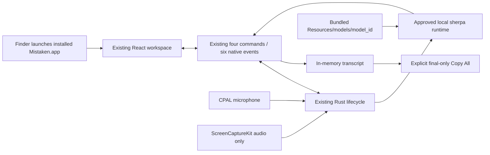

# Spec 13 — macOS Packaging and Distribution

## 1. Status, Ownership, Base, and Gates

- **Status:** Authored; ready for cross-spec integration review. Not implemented.
- **Implementation owner:** One Spec 13 branch/worktree with one writer. A mandatory independent high-capability review closes the spec.
- **Required base:** The exact clean, reviewed post-Spec-12 SHA named in Spec 12’s successor freeze manifest. Spec 12 must be implemented with cross-host result `PASS`—which includes macOS `PASS`; a pre-Spec-12 branch, copied artifact, or locally rebuilt substitute is not an acceptable base.
- **Allowed predecessor:** Spec 12 only. Specs 01–11 are inherited transitively and are not reopened here.
- **Parallel-safe peer:** Spec 14 may run in a separate Windows worktree from the same post-Spec-12 SHA. Spec 13 owns only the macOS paths in section 5; Spec 14 owns only Windows packaging paths. Neither branch may edit frozen shared manifests, lockfiles, resources, notices, application source, or the other platform’s packaging subtree.
- **Shared-input gate:** Application version `0.1.0`, product name `Mistaken`, bundle identifier `com.mistaken.desktop`, the approved runtime/model/configuration, `$RESOURCE/resources/models/<model_id>/` layout, `THIRD_PARTY_NOTICES.txt`, root Tauri resource mapping, root manifests, and every committed lockfile are consumed byte-for-byte from Spec 12.
- **Target gate:** V1 macOS distribution is **Apple Silicon only**, target triple `aarch64-apple-darwin`, with macOS `13.0` as the supported and declared minimum. Intel and universal binaries require separate benchmark, runtime-archive, size, and real-host evidence and are out of scope.
- **Distribution gate:** V1 is a direct-download Developer ID distribution outside the Mac App Store. The deliverables are `Mistaken.app` and a drag-to-Applications `Mistaken_0.1.0_aarch64.dmg`; `.pkg`, Mac App Store, Homebrew, Sparkle, Tauri Updater, differential update artifacts, and public upload are excluded.
- **Credential gate:** A valid `Developer ID Application` identity and Apple notarization credentials are external prerequisites. If present, signing, secure timestamping, notarization, stapling, Gatekeeper assessment, and offline installed launch are mandatory. If absent, all reachable ad-hoc/local packaging and verification work must finish and only the credential-dependent criteria may be `BLOCKED`; missing credentials never excuse a source, bundle, permission, payload, lifecycle, or evidence failure.
- **Successor gate:** Spec 15 may start only after Specs 13 and 14 are reviewed and merged. Spec 13 produces the immutable macOS artifact manifest and either a signed/notarized `PASS` artifact or an exact credential blocker; it does not declare Mistaken release-ready.
- **Review level:** Medium implementation is acceptable; high-capability review is mandatory because the deliverable carries native permissions, a bundled third-party model/runtime, Developer ID trust, hardened runtime, and an offline privacy claim.

## 2. Goal and User-Visible / Measurable Result

Produce a reproducible, installable macOS release candidate around the already accepted application without changing its product behavior.

The visible result on supported Apple Silicon hardware is:

1. The user opens a standard DMG containing `Mistaken.app` and an Applications-folder target, drags the app to `/Applications`, and launches it through Finder without bypassing Gatekeeper.
2. The installed app presents the same accepted single-window Mistaken UI and requests no permission at launch.
3. The first explicit microphone Start uses one truthful microphone purpose string. Screen Recording is requested only when the user explicitly enables system audio and starts capture; no undocumented screen-capture purpose key or broad entitlement is invented.
4. Microphone-only, system-only, and dual-source capture work from the installed bundle with networking disconnected, using the one embedded approved model/runtime and preserving all Spec 12 transcript, source-isolation, privacy, performance, and lifecycle behavior.
5. Stop → Start, active close, Finder relaunch, and removal of the app release native resources predictably and leave no Mistaken-owned transcript/audio data.
6. With release credentials, the app and DMG are Developer ID signed with hardened runtime and a secure timestamp, accepted by Apple’s notary service, stapled, assessed by Gatekeeper, and proven to launch offline from a quarantined install.
7. Without release credentials, an explicitly ad-hoc-signed `.app` and local DMG pass every non-credential check, while the report is `BLOCKED` only for Developer ID signing/notarization/stapling/Gatekeeper distribution trust.

A successful compile, an unmounted DMG, an ad-hoc signature presented as distributable, a `spctl` check without a real Finder install, or a notarization status without an installed offline core flow is insufficient.

## 3. Verified Current Behavior

Verified while authoring this spec:

- `/Users/berat/mistaken` does not exist. `/Users/berat/mistaken-context` is a documentation-only staging bundle containing context, the delivery plan, and Specs 01–12. There is no application source, Git SHA, approved model artifact, `.app`, DMG, Developer ID identity, notary credential, or packaging evidence to inspect yet.
- Spec 01 reserves final product iconography and distributable bundles for Specs 13 and 14. It freezes product name `Mistaken`, identifier `com.mistaken.desktop`, version `0.1.0`, one `main` window, and a remote-free production CSP.
- Spec 07 proves real ScreenCaptureKit behavior and hands the built-bundle permission result to this spec. It freezes macOS `13.0`, audio-only ScreenCaptureKit capture, truthful Screen Recording TCC behavior, and no pixels. Apple documents no Screen Recording usage-description Info.plist key.
- Spec 09 applies `bundle.macOS.minimumSystemVersion = "13.0"` in the shared Tauri configuration and wires microphone plus ScreenCaptureKit into the real application. Spec 13 verifies that frozen value in the effective bundle; it does not create a second source of truth.
- Spec 12 freezes version `0.1.0`, one approved model/runtime/configuration, every model file’s relative path/size/SHA-256, the one resource path `$RESOURCE/resources/models/<model_id>/`, `THIRD_PARTY_NOTICES.txt`, root/shared manifests, and every committed lockfile. Model weights remain local and ignored before packaging but must appear in each installer.
- Spec 12 also requires the release-profile application to pass the complete macOS core flow offline, with zero runtime network attempt and zero transcript/audio persistence, before this packaging work begins.
- Tauri 2’s macOS bundle documentation states that `tauri build --bundles app` creates an application bundle containing the executable, generated/merged `Info.plist`, resources, frameworks, plug-ins, and signature metadata. Tauri merges `src-tauri/Info.plist` into generated bundle metadata.
- Tauri 2’s DMG documentation states that `tauri build --bundles dmg` creates the standard outside-App-Store drag-to-Applications image. The default DMG presentation already provides the app and Applications icons; a custom background is optional and unnecessary here.
- Tauri’s configuration reference accepts `app` and `dmg` bundle targets, `bundle.macOS.entitlements`, `minimumSystemVersion`, and `signingIdentity`. Tauri supports a platform-specific `src-tauri/tauri.macos.conf.json`, avoiding concurrent edits to the shared root configuration.
- Tauri’s macOS signing guide requires `Developer ID Application` for distribution outside the App Store, supports `APPLE_SIGNING_IDENTITY`, and uses App Store Connect API credentials (`APPLE_API_ISSUER`, `APPLE_API_KEY`, `APPLE_API_KEY_PATH`) for notarization. Tauri’s `-` pseudo-identity is ad-hoc signing and is useful for Apple Silicon local verification, but is not a distributable Developer ID signature.
- Apple requires Developer ID signing, hardened runtime, a secure timestamp, valid XML entitlements, and notarization for newly distributed Developer ID software. Apple rejects `com.apple.security.get-task-allow` and recommends adding only entitlements that are absolutely necessary.
- Apple requires `NSMicrophoneUsageDescription` when an app accesses the microphone. The exact V1 purpose string is frozen here as: **`Mistaken uses your microphone to transcribe your speech locally on this Mac.`**
- Apple’s notarization workflow uses `notarytool`; `altool` is no longer accepted. Apple requires review of the notarization log even for an `Accepted` submission and recommends stapling so Gatekeeper can validate without network access.
- Apple documents `codesign -vvv --deep --strict` for signature verification, `codesign -dvv` for secure timestamp inspection, `spctl -vvv --assess --type exec` for policy assessment, `codesign -d --entitlements :-` for embedded-entitlement inspection, `plutil -lint` for plist validation, and `hdiutil verify` for disk-image integrity.

No authoring statement is implementation evidence. During application, the canonical repository, installed Tauri/Xcode documentation, generated effective configuration, actual bundle tree, signatures, notarization log, real Gatekeeper behavior, and installed native app are authoritative. A discrepancy is fixed or reported; it is never hidden by weakening a check.

## 4. Scope

### In scope

- A macOS-only packaging configuration that produces exactly an Apple Silicon `.app` and standard drag-to-Applications DMG while leaving shared Spec 12 configuration unchanged.
- A final macOS app icon: a restrained flat `M` mark using the existing `--bg-surface` and `--accent-primary` color values, no gradient/glow/AI motif, exported to a valid `icon.icns`. Its macOS source and export script live only under `distribution/macos/assets/**`.
- `src-tauri/Info.plist` with the one frozen microphone purpose string and no unrelated protected-resource key.
- Direct-download, non-sandboxed Developer ID packaging. Hardened runtime is enabled through signing; the initial and expected entitlement allowlist is empty.
- A minimal entitlement exception only if a real hardened-runtime build fails an accepted core flow and root-cause evidence proves the exact Apple-documented key necessary. Any such exception requires high-capability review, an updated allowlist test, and complete rerun; absence of credentials is not evidence for adding an entitlement.
- Deterministic packaging scripts and a closed evidence schema under `distribution/macos/**`, with ignored raw output and no secrets/private user content.
- Offline/ad-hoc local package creation from checksum-verified local dependencies/runtime/model files.
- Developer ID signing, hardened runtime, secure timestamp, notarization through `notarytool` or Tauri’s equivalent current integration, notary-log inspection, stapling, signature assessment, and DMG integrity checks when credentials exist.
- Bundle inventory, architecture/deployment-target, linked-library, resource, notice, permission, entitlement, updater/network, size, and forbidden-file inspection.
- A real Finder install from the final DMG, Gatekeeper launch, permission behavior, complete installed core flow, Start → Stop → Start, active close, relaunch, and uninstall check on real supported Apple Silicon hardware.
- A second real minimum-floor run on Apple Silicon capable of running macOS 13.x. If no qualifying macOS 13.x host is available, the minimum-OS real-run criterion is an external `BLOCKED` item; configuration inspection alone cannot produce `PASS` for the stated floor.
- A normalized reproducibility comparison across two clean local builds from the same SHA and frozen inputs, excluding only documented signature/notary/container metadata that is inherently timestamped.
- A redacted immutable manifest handed to Spec 15 with artifact hashes, bundle inventory, input digests, target/OS facts, signing/notarization state, permissions, entitlements, install result, and exact blocker if any.

### Out of scope

- Changing application behavior, frontend UI, transcript semantics, commands/events, audio/ASR code, recovery policy, performance gates, model choice, model configuration, resource layout, notices, version, bundle identifier, root Tauri configuration, manifests, or lockfiles.
- Intel (`x86_64-apple-darwin`) or universal macOS artifacts, Rosetta claims, a second runtime archive, or an unbenchmarked architecture.
- Mac App Store submission, App Sandbox, provisioning profiles, TestFlight, sandbox resource entitlements, receipts, or App Store metadata.
- `.pkg`, Homebrew cask, ZIP as the public artifact, auto-launch, login item, privileged helper, daemon, kernel/system extension, driver, virtual audio device, or administrator requirement.
- Tauri Updater, Sparkle, an update endpoint, update signing key, update artifact, background update check, telemetry, analytics, crash upload, remote logging, or release hosting.
- Public upload, CDN/domain setup, download page, release notes, cross-platform checksum publication, final release tag, or release-ready declaration. Spec 15 owns them.
- Custom DMG artwork, animation, marketing copy, EULA dialog, onboarding, additional app window, installer UI framework, or a second icon system.
- A new permission prompt, speculative Screen Recording plist key, accessibility permission, camera/location/filesystem permission, broad hardened-runtime exception, or App Sandbox entitlement.
- Persisting transcript, audio, device choice, permission state, update state, packaging evidence, or runtime settings from the application.
- Committing model weights, signing certificates, `.p12` files, App Store Connect private keys, passwords, Apple IDs, keychain exports, notary tokens, raw transcripts/audio, absolute private paths, or notarization credentials.

## 5. Owned Files and Forbidden Concurrent Files

### Primary owned paths

The implementation owns only macOS packaging files:

```text
src-tauri/tauri.macos.conf.json
src-tauri/Info.plist
src-tauri/Entitlements.plist                 # only if evidenced; expected absent
src-tauri/icons/icon.icns

distribution/macos/README.md
distribution/macos/build.sh
distribution/macos/verify.sh
distribution/macos/report.schema.json
distribution/macos/assets/**
distribution/macos/tests/**
distribution/macos/evidence/report.json
distribution/macos/evidence/summary.md
distribution/macos/evidence/artifacts.sha256
distribution/macos/runs/.gitignore
```

Exact script subdivision may follow established repository conventions, but all macOS packaging implementation/evidence remains inside `distribution/macos/**`. Generated `.app`, `.dmg`, mounted images, notary logs, temporary keychains, normalized bundle copies, and raw traces live only under ignored `distribution/macos/runs/**` or an operator-owned temporary directory.

`src-tauri/tauri.macos.conf.json` may add only platform bundle targets and an entitlement-file reference if the reviewed entitlement exception path is actually used. It must not duplicate or override version, identifier, product name, shared resources, model mapping, notices, application windows, capabilities, CSP, or updater settings.

### Consumed unchanged

- `package.json`, `package-lock.json`, Node/toolchain pins, npm scripts, and root frontend build configuration.
- `src-tauri/Cargo.toml`, `src-tauri/Cargo.lock`, `rust-toolchain.toml`, build script, application entrypoint, capabilities, permissions, and shared Tauri configuration.
- All application code and tests under `src/**`, `src-tauri/src/**`, and `crates/**`.
- Spec 12’s approved model/runtime/config manifest, local staged model file set, resource mapping, third-party notices, version values, application identity, and lockfile digests.
- Acceptance harness and committed reports under `acceptance/**`; Spec 13 may invoke them but not change a gate or repair a product failure from its packaging worktree.
- The Windows packaging subtree and Windows icon/configuration produced by Spec 14.

### Forbidden concurrent and shared edits

Spec 13 must not create, edit, move, or delete:

- root/shared manifests or locks, including `package.json`, `package-lock.json`, `src-tauri/Cargo.toml`, `src-tauri/Cargo.lock`, and standalone-crate locks;
- `src-tauri/tauri.conf.json`, `src-tauri/capabilities/**`, application permissions, root `.gitignore`, shared resource manifests, model files, or `THIRD_PARTY_NOTICES.txt`;
- frontend/native product source, transcript/audio/ASR implementation, benchmark corpus/gates, or Spec 12 acceptance semantics;
- `distribution/windows/**`, `.ico` files, Windows installer configuration, or Spec 14 evidence;
- canonical context/tracker files from the feature worktree. The integration owner updates shared documentation after merge.

If packaging reveals that a frozen shared file is wrong, stop the affected packaging step, record the exact generated/effective discrepancy, and hand it to the integration owner. Specs 13 and 14 then restart from one newly reviewed common SHA. Copying a fix into both branches or silently overriding it in platform config is prohibited.

## 6. Contracts Consumed and Produced

### Consumed freeze contract

| Input | Required value or evidence |
|---|---|
| Repository base | Exact clean post-Spec-12 SHA authorized for both packaging branches |
| Product | `Mistaken` |
| Version | `0.1.0` in every frozen shared source |
| Bundle identifier | `com.mistaken.desktop` |
| Target | `aarch64-apple-darwin` only |
| Minimum macOS | `13.0` |
| Model/runtime | Exactly one Spec 05/06/12-approved candidate, runtime tag/archive, decoding config, provider, and thread count |
| Model path | `$RESOURCE/resources/models/<model_id>/` from one frozen shared mapping |
| Model integrity | Exact relative paths, sizes, and SHA-256 values from the compiled-in/freeze manifest |
| Notices | Frozen `src-tauri/resources/licenses/THIRD_PARTY_NOTICES.txt` digest |
| Offline/privacy | Spec 12 cross-host `PASS`, including macOS `PASS`, zero runtime external network attempt, no transcript/audio persistence |
| Lifecycle | Spec 10 shutdown/restart contract and Spec 12 integrated evidence |
| Locks | Every committed npm/Cargo lock digest frozen at Spec 12 |

A mismatch is a failed precondition, not an invitation to repair or repin from this branch.

### Packaging configuration produced

The effective macOS package must resolve to:

- bundle targets exactly `app` and `dmg`;
- target architecture exactly `arm64` / `aarch64-apple-darwin`;
- minimum system version exactly `13.0` in generated `Info.plist`, matching the shared Tauri freeze;
- app name `Mistaken`, version `0.1.0`, identifier `com.mistaken.desktop`;
- standard Tauri DMG layout with `Mistaken.app` and Applications-folder link;
- updater artifacts disabled and no updater public key, endpoint, plugin, or runtime check;
- no Mac App Store/App Sandbox/provisioning configuration;
- no committed signing identity or notarization credential;
- hardened runtime enabled only for the Developer ID distribution build;
- entitlement allowlist empty unless section 10’s evidence process approves one exact exception;
- `NSMicrophoneUsageDescription` exactly `Mistaken uses your microphone to transcribe your speech locally on this Mac.`;
- no Screen Recording purpose key, because Apple publishes none, and no unrelated protected-resource purpose string.

### Result-state contract produced

The macOS report has exactly one overall result:

- `PASS`: all criteria ran on the recorded artifact and hosts; the DMG is Developer ID signed, securely timestamped, notarized `Accepted`, stapled, Gatekeeper-approved, and the installed offline core flow passes; no High/Medium finding remains.
- `FAIL`: any runnable build, package, payload, permission, entitlement, signature, notarization, install, offline, privacy, lifecycle, minimum-OS, schema, or review criterion fails. A product defect is never relabeled as a credential blocker.
- `BLOCKED`: every reachable non-credential criterion passes, and the only unavailable prerequisite is either (a) a valid Developer ID/notary credential or Apple notary availability, or (b) a qualifying real macOS 13.x Apple Silicon host for the floor run. Each blocked item names what is missing, how availability was checked, all completed evidence, and the exact next action. Multiple unrelated missing prerequisites are listed separately.

An ad-hoc build can support `BLOCKED`; it can never support `PASS`. Skipped applicable work, unavailable ordinary development tools, a dirty tree, an unapproved model, or a failing artifact is `FAIL`, not `BLOCKED`.

### Evidence schema produced

`distribution/macos/evidence/report.json` is closed to unknown fields and contains no transcript/audio/secret:

```jsonc
{
  "schemaVersion": 1,
  "result": "PASS | FAIL | BLOCKED",
  "repository": {
    "root": "<redacted canonical root>",
    "branch": "<name>",
    "baseSha": "<40 hex post-Spec-12 SHA>",
    "finalSha": "<40 hex>",
    "dirty": false
  },
  "host": {
    "build": { "hardware": "<chip/cores/RAM>", "os": "<version/build>", "arch": "arm64" },
    "floor": { "hardware": "<chip/cores/RAM>", "os": "13.x/build", "arch": "arm64", "result": "PASS | BLOCKED" },
    "microphone": "<sanitized make/model or built-in>",
    "output": "<sanitized class/name>",
    "permissionsBefore": { "microphone": "<state>", "screenRecording": "<state>" }
  },
  "inputs": {
    "version": "0.1.0",
    "bundleId": "com.mistaken.desktop",
    "target": "aarch64-apple-darwin",
    "minimumSystemVersion": "13.0",
    "modelId": "<approved id>",
    "modelManifestSha256": "<64 hex>",
    "runtimeTag": "<approved tag>",
    "runtimeArchiveSha256": "<64 hex>",
    "noticeSha256": "<64 hex>",
    "lockfileDigests": [{ "path": "<relative>", "sha256": "<64 hex>" }]
  },
  "artifacts": {
    "app": { "name": "Mistaken.app", "sha256Normalized": "<64 hex>", "sizeBytes": 0 },
    "dmg": { "name": "Mistaken_0.1.0_aarch64.dmg", "sha256": "<64 hex>", "sizeBytes": 0 },
    "bundleManifestSha256": "<64 hex>",
    "files": 0,
    "modelPayloadBytes": 0,
    "modelFilesVerified": 0
  },
  "security": {
    "infoPlistKeys": ["<sorted added protected-resource keys>"],
    "entitlements": ["<sorted enabled keys; expected empty>"],
    "hardenedRuntime": true,
    "signature": "developer-id | ad-hoc",
    "secureTimestamp": true,
    "teamIdentifier": "<public team id or null>",
    "notarization": "accepted | blocked",
    "notarySubmissionId": "<id or null>",
    "notaryIssueCounts": { "error": 0, "warning": 0 },
    "stapled": true,
    "gatekeeper": "accepted | blocked"
  },
  "runtime": {
    "networkDisconnected": true,
    "externalNetworkAttempts": 0,
    "finderInstall": "PASS",
    "launchPermissionPrompts": 0,
    "micOnly": "PASS",
    "systemOnly": "PASS",
    "dual": "PASS",
    "startStopStart": "PASS",
    "activeCloseRelaunch": "PASS",
    "uninstallResidue": "PASS"
  },
  "reproducibility": {
    "cleanBuilds": 2,
    "normalizedManifestMatch": true,
    "excludedMetadata": ["<closed documented exclusion>"],
    "toolVersions": { "xcode": "<value>", "tauri": "<value>", "rust": "<value>", "node": "<value>", "npm": "<value>" }
  },
  "blockers": [{ "criterion": 0, "missing": "<external prerequisite>", "checked": "<method>", "nextAction": "<exact action>" }],
  "review": { "reviewer": "<identity>", "highOpen": 0, "mediumOpen": 0 }
}
```

For a credential-blocked result, `hardenedRuntime`, `secureTimestamp`, `stapled`, and Gatekeeper distribution fields use schema-approved `null`/`blocked` values rather than fabricated booleans. The implementation finalizes exact nullable types in the schema and tests rejection of contradictory combinations such as `PASS` plus ad-hoc signing, `accepted` notarization plus no submission id, or `BLOCKED` plus a runnable product failure.

### Handoff produced for Spec 15

Spec 15 receives:

- final Spec 13 commit SHA and exact Spec 12 base SHA;
- final `.app` and DMG name, byte size, SHA-256/normalized digest, and local immutable location;
- complete mounted bundle manifest and approved-model verification result;
- target, minimum OS, effective Info.plist keys, embedded entitlements, linked dependencies, architecture, and icon result;
- Developer ID certificate class/Team ID, secure timestamp, notary submission id/status/log digest, stapler result, and Gatekeeper result, or the exact external blocker;
- real-host install/runtime/permission/lifecycle/offline results;
- complete toolchain and build command/environment record without credentials;
- High/Medium review disposition and cleanup state.

## 7. User Flow and Developer Verification Flow

### Operator preflight

1. Create the Spec 13 worktree from the exact reviewed post-Spec-12 SHA and record canonical root, worktree root, branch, base SHA, clean state, and concurrent Spec 14 worktree. Confirm the two writers have disjoint paths.
2. Re-read canonical context, `spec-plan.md`, Specs 01–15, current source/tests, Prisma absence, manifests/locks, Spec 12 freeze/evidence, and installed Tauri 2 documentation under `node_modules`. Installed version-matched documentation overrides general examples.
3. Verify Spec 12’s cross-host report is `PASS`, including its macOS host result, recompute the successor freeze manifest, and compare all root/shared files and lockfile digests. Refuse packaging on mismatch.
4. Record Xcode/Command Line Tools, Tauri CLI, Node/npm, Rust/Cargo, target triple, host chip/core/RAM, macOS version/build, power state, microphone, output source, and current TCC permission states.
5. Verify the local approved model/runtime artifacts by exact file count/path/size/SHA-256 and notice digest. Confirm no network download or development-only `MISTAKEN_MODEL_DIR` is needed by the packaged app.
6. Check the keychain for a valid non-expired `Developer ID Application` identity without printing private key material. Check only presence of one supported notary authentication route. Do not prompt for or record secrets in logs.

### Deterministic local package flow

1. Build from a clean tree with `MACOSX_DEPLOYMENT_TARGET=13.0`, target `aarch64-apple-darwin`, npm/Cargo offline/locked behavior, notary variables unset, and `APPLE_SIGNING_IDENTITY=-` for the explicitly local ad-hoc build.
2. Use the installed Tauri CLI’s version-matched command to produce only `app` and `dmg` targets. A build step that downloads a dependency, runtime, model, frontend asset, or tool is a failure.
3. Repeat the build from the same SHA and inputs into an independent generated-output location. Produce normalized app-bundle manifests and compare them exactly.
4. Verify each DMG with `hdiutil verify`, mount read-only/no-browse, confirm exactly one `Mistaken.app` plus the Applications target at the volume root, inventory the mounted app, then detach cleanly.
5. Treat ad-hoc artifacts as local evidence only. Their filenames and evidence carry `adhoc` or an equivalent unmistakable marker and cannot be copied to the release-candidate location.

### Bundle/security inspection flow

1. Validate source and generated plist files with `plutil`; inspect generated `Info.plist` for name/version/id/minimum OS and the exact microphone purpose string.
2. Enumerate every purpose-description key and embedded entitlement. Reject unknown keys, false-valued entitlements, App Sandbox, `get-task-allow`, JIT/unsigned-memory/debugger/dyld/library-validation exceptions, audio-input sandbox access, automation, camera, location, contacts, photos, accessibility, or file/network capability unless the one reviewed exception process has produced direct evidence.
3. Use `file` and `lipo -archs` on all bundled Mach-O code; every application-owned executable is arm64 only. Inspect Mach-O build metadata and generated minimum-system declaration for the macOS 13.0 floor.
4. Use `otool -L` and bundle inventory to prove the approved runtime is linked/embedded exactly as frozen, no missing dependency exists, and no unexpected third-party framework/dylib/plugin/helper is shipped.
5. Recompute every model file and notice digest from inside `Mistaken.app/Contents/Resources`. Reject missing, duplicate, renamed, flattened, extra, or modified model files.
6. Search the bundle and mounted DMG for `.env`, credentials, absolute developer paths, source maps, source/test files, benchmark recordings, transcripts, PCM/audio dumps, raw acceptance traces, `node_modules`, Cargo target intermediates, model duplicates, updater metadata, URL endpoints, and debug symbols not intentionally retained. Any finding is classified and removed at source before rebuilding.

### Signed/notarized distribution flow

When credentials exist:

1. Make a fresh clean build from the final source SHA using the valid `Developer ID Application` identity via environment/keychain and one supported notary authentication route. Do not commit `signingIdentity`, credential values, private-key paths, or temporary keychain data.
2. Keep npm/Cargo/dependency resolution in locked offline mode. Permit outbound network only for Apple’s secure timestamp, notary submission, and stapler services; trace the build process tree and fail on every unrelated destination or protocol.
3. Verify nested code and the app with `codesign -vvv --deep --strict`, and verify the DMG’s Developer ID signature with the installed toolchain’s appropriate `codesign --verify` invocation; inspect `codesign -dvv` for Developer ID authority, expected Team ID, hardened-runtime flag on executable code, and secure `Timestamp` rather than local `Signed Time`.
4. Submit the final signed DMG with current Tauri/notarytool integration and wait for terminal status. Require `Accepted`; fetch and inspect the JSON log even on success. Zero errors are mandatory; every warning is fixed or given a high-review disposition before release handoff.
5. Staple the returned ticket to the final distributed DMG and validate it. If the build flow separately staples the app, validate that too. Re-run `hdiutil verify`, mount the final DMG, and repeat signature, entitlement, resource, and inventory checks against the app actually inside it.
6. Compute final artifact SHA-256 only after every signature/notary/staple mutation. Never alter or repackage the DMG after its recorded digest.

When credentials are absent, record `BLOCKED` for exactly the signed/notarized steps after completing the ad-hoc package, bundle inspection, reproducibility, installed local flow, and every check independent of Developer ID trust.

### Real installed user flow

Run against the exact final DMG on real Apple Silicon hardware; use the signed/stapled artifact for `PASS`, or the clearly marked ad-hoc artifact only for reachable behavioral evidence in a credential-blocked run.

1. Begin in a fresh standard-user test profile with Mistaken absent from `/Applications`, no Mistaken TCC entries, and networking disconnected. For signed release validation, apply/retain realistic quarantine metadata and open the DMG through Finder.
2. Inspect the DMG window visually at standard display scaling: final Mistaken icon, readable name, Applications target, no clipped/overlapping item, no custom marketing surface. Drag `Mistaken.app` to Applications and eject the image.
3. Launch `/Applications/Mistaken.app` through Finder. For a signed build, Gatekeeper accepts without `xattr` removal, Control-click bypass, `spctl --master-disable`, or System Settings override. No microphone or Screen Recording prompt appears on launch.
4. With system audio off, explicitly Start microphone capture. Observe the OS prompt containing the exact local-transcription purpose string, grant it, receive real microphone transcript, Stop, and confirm the capture indicator clears.
5. Enable system audio and explicitly Start. Observe Screen Recording permission behavior frozen by Specs 07/09: no invented app-owned usage string, actionable restart state if macOS requires it, and real system transcript after the required OS grant/relaunch sequence.
6. Run microphone-only, system-only, then simultaneous dual source with distinct local phrases. Confirm embedded-model startup with no development override/download; microphone lines stay unprefixed, system lines receive one formatter-owned `- `, and no transcript/audio persists.
7. Perform at least five Start → Stop → Start cycles, then close while dual capture is active, confirm OS indicators and process disappear within Spec 10 bounds, and relaunch through Finder to an empty idle state.
8. Disconnect networking throughout first launch/model load/core flow/relaunch and trace the process tree. There are zero non-loopback network attempts; notarization traffic belongs only to the build operator flow, never the installed app.
9. Remove `/Applications/Mistaken.app`. Confirm the executable, embedded model, notices, and app-owned files are gone and there is no Mistaken-owned transcript/audio residue. OS-owned TCC records may remain and are reported as OS state, not falsely claimed as removed.
10. Repeat the install, first launch, permission sequence, a real microphone/system dual flow, Stop → Start, active close, and relaunch on a real Apple Silicon Mac running macOS 13.x. Record hardware, exact OS/build, permissions, microphone, and output source. Newer-host success does not substitute for the floor run.

### Final verification flow

- Validate the closed report schema, artifact checksum file, summary, normalized bundle manifests, and all raw-artifact digests.
- Run root frontend/Rust/application checks inherited from Spec 12 without changing frozen files, then run macOS packaging tests and the final package command.
- Run the complete real installed flow after the final build; any source or artifact mutation invalidates signature, checksum, install, and runtime evidence and requires rerun.
- Conduct the mandatory high-capability review of changed paths, effective configuration, mounted artifact, signatures, permissions/entitlements, evidence, and Spec 15 handoff.
- Fill this spec’s implementation evidence, create one focused local commit unless directed otherwise, verify clean status, and report branch/base/final SHA. Do not push.

## 8. UI Behavior, States, Tokens, and Accessibility

Spec 13 adds no application window, route, component, control, copy, onboarding, dialog, toast, settings screen, or visual state. The installed bundle must render the exact Spec 12-accepted UI.

### App icon

- The macOS icon is a flat, high-contrast `M` mark using the values of existing `--bg-surface` and `--accent-primary` tokens as its only brand colors. No raw third color, gradient, glow, glass, waveform, microphone illustration, brain/sparkle, chat bubble, tiny text, transparency artifact, or AI branding is introduced.
- Source master is square and exports all icon representations required by the installed Tauri version into one valid `icon.icns`. The OS, not a custom asset hack, owns masking and system presentation.
- Verify Finder list/icon views, Dock, app switcher, permission lists, and DMG at standard and Retina scales. The mark remains recognizable, has no clipped edge, and does not resemble a system/security alert badge.
- The same product concept must inform Spec 14’s Windows icon, but the files are not shared during Wave 8. Any post-merge visual reconciliation is owned by the integration owner before Spec 15.

### DMG surface

- Use Tauri’s standard drag-to-Applications layout and native Finder labels. No custom background is added.
- App and Applications targets are visible, keyboard/Finder navigable, non-overlapping, and correctly named at the default DMG window size.
- The installer adds no unreadable image-only instruction, custom font, animation, or color-only meaning.

### Permission and runtime UI

- Launch remains prompt-free.
- Microphone permission appears only after explicit Start and uses the exact section 3 purpose string.
- Screen Recording appears only after explicit system-audio opt-in plus Start and follows the actionable denied/restart states already accepted in Specs 07, 09, 10, and 12.
- Packaging does not change focus order, keyboard shortcuts, VoiceOver behavior, text scale, window sizes, contrast, reduced motion, or source status copy.
- Gatekeeper/Finder/macOS permission dialogs are OS-owned surfaces. Evidence records their result and relevant non-private text; implementation does not attempt to restyle, suppress, or bypass them.

### Language, routes, and SEO

- V1 bundle/permission strings remain English, matching the current English application. No localization resource is added.
- There is one native application window and no web route, deep link, custom URL scheme, file association, document type, protocol handler, browser page, or SEO surface.

## 9. Frontend → Tauri IPC → Rust / Audio / ASR Data Flow

Packaging wraps the accepted data flow; it does not add a new runtime layer:



Package-time flow is separate:


Runtime invariants:

- The frontend still invokes only Spec 03’s frozen application commands and listens to its frozen events. No packaging/update/install command or event crosses IPC.
- PCM remains native and bounded; no sample, file path, model path, signature data, notary state, or packaging metadata enters the WebView.
- Model discovery resolves only the embedded resource path in a packaged build. `MISTAKEN_MODEL_DIR` is a development-only override and is absent from installed-flow environments.
- Transcript state remains in React memory; only final formatted text crosses the explicit write-only clipboard boundary.
- No installer, updater, launch-agent, helper, daemon, or background process survives after Mistaken exits.

## 10. Platform, Permissions, Offline, Privacy, and Fallback

### Platform and architecture

- Supported distribution target: Apple Silicon `aarch64-apple-darwin` only.
- Supported minimum: macOS `13.0`; verify generated `LSMinimumSystemVersion`/effective equivalent and run the installed artifact on macOS 13.x real hardware.
- Build host and floor host evidence records chip, physical/logical cores, RAM, exact macOS version/build, architecture, power state, display scale, microphone, output source, and TCC states.
- Every bundled application-owned Mach-O is arm64. No x86_64 slice, universal wrapper, Rosetta dependency, or second model/runtime payload exists.

### Permission manifest

The permitted protected-resource declaration is exactly:

```text
NSMicrophoneUsageDescription =
  Mistaken uses your microphone to transcribe your speech locally on this Mac.
```

The bundle contains no camera, location, contacts, calendar, photos, Bluetooth, speech-recognition cloud service, Apple Events automation, accessibility, removable-volume, desktop/documents/downloads-folder, network-server/client, or unrelated usage-description key.

There is no `NSScreenCaptureUsageDescription` or guessed equivalent. Screen Recording authorization is an OS TCC service exercised through ScreenCaptureKit and verified behaviorally from the built app.

### Hardened runtime and entitlement posture

- Distribution signing enables hardened runtime.
- Mistaken is not App Sandbox constrained for this direct-download V1. `com.apple.security.app-sandbox` and sandbox resource entitlements, including `com.apple.security.device.audio-input`, are absent.
- The expected entitlement allowlist is empty. `NSMicrophoneUsageDescription` is an Info.plist purpose string, not an entitlement.
- Always forbidden: `com.apple.security.get-task-allow`, debugger entitlement, `allow-dyld-environment-variables`, `disable-library-validation`, `disable-executable-page-protection`, and unrelated personal-information/device entitlements.
- `allow-jit` and `allow-unsigned-executable-memory` are also absent by default. Tauri’s WKWebView architecture and the statically linked ASR runtime do not justify disabling hardened-runtime protections without observed failure.
- If a signed hardened build terminates or loses an accepted core function, capture the exact OS/code-signing diagnostic, reproduce it with the unchanged accepted app, identify one Apple-documented protection, add at most the minimal needed entitlement, and rerun the entire signed/notarized/install/offline/core-flow matrix. A speculative or “common Tauri” entitlement is prohibited.
- Any entitlement plist is ASCII XML, `plutil -lint` clean, and its embedded output exactly matches the reviewed allowlist. False-valued keys are omitted rather than written.

### Signing and notarization secrets

- Certificates/private keys live only in the operator keychain or ephemeral CI keychain. Notary credentials live only in keychain/environment secret storage.
- Committed configuration never contains a signing identity, Team private material, Apple ID, password, key id/issuer paired with private key, `.p8` path, `.p12`, base64 certificate, token, or keychain password.
- Logs/evidence may record certificate class, public Team ID, certificate SHA-1 fingerprint, expiry, notary submission id/status, and sanitized issue counts. They must not record environment values, Apple ID, private-key path, or secret-bearing command lines.

### Offline boundary

- Dependency/runtime/model build inputs are local and checksum verified. Package managers/build scripts stay locked/offline.
- Developer ID secure timestamp, notary submission/log retrieval, and stapler ticket retrieval are the only packaging-time network exceptions. They run in a separately traced phase with unrelated destinations blocked.
- The installed app runs with no non-loopback route and makes zero network attempt. There is no updater, telemetry, crash upload, remote asset, license check, model download, or notarization call from the app.
- A stapled ticket is required for `PASS` so offline Gatekeeper validation does not depend on fetching the ticket.

### Privacy

- The bundle contains product code, approved model/runtime files, icon, generated metadata, and required notices only. It contains no transcript/audio or private acceptance data.
- Install/run/uninstall evidence uses deliberately scripted non-private phrases and stores only hashes/counts/statuses. Raw screenshots must not show private transcript content.
- The app creates no transcript/audio persistence. TCC databases, quarantine metadata, Gatekeeper caches, Finder metadata, WebView implementation metadata, and OS logs are OS-owned and classified honestly; they are not represented as Mistaken content storage.

### Fallback

- Missing model/runtime/resource, unsupported architecture/OS, invalid signature, rejected notarization, unstapled ticket, failed Gatekeeper assessment, or core-flow failure produces `FAIL` with exact evidence. No download, alternate model, cloud ASR, Rosetta-only fallback, unsigned public artifact, or Gatekeeper-bypass instruction is offered.
- Missing Developer ID/notary credential produces only the exact external `BLOCKED` result after all ad-hoc/reachable checks pass.
- Apple notary service unavailability is `BLOCKED` only when a valid signed artifact and credential preflight exist, the service failure is externally evidenced, and retry policy is bounded/documented. A notary rejection is `FAIL`.
- Missing macOS 13.x Apple Silicon test hardware blocks only the floor-run claim; it does not excuse newer-host package/runtime work.

## 11. Resource Lifecycle, Bounds, Errors, and Recovery

### Build/package lifecycle

- Packaging scripts are fail-fast, non-interactive after credential preflight where possible, quote paths, use temporary directories with deterministic cleanup, and never print secrets.
- Every build starts from the same recorded clean SHA and frozen input digests. Generated output is isolated from source. A stale artifact cannot satisfy a later run.
- Mounted DMGs are always detached. Temporary normalized app copies, extracted entitlements, quarantine copies, keychains, and raw logs are removed or retained only in ignored raw-run storage with digests.
- A failure after signing/notarization never mutates the accepted artifact in place. Rebuild into a new run id; preserve failed raw evidence until disposition.

### Runtime lifecycle

- Launch allocates no audio/model resource and prompts for no permission.
- First explicit Start verifies/loads the embedded model and allocates only the requested source pipelines according to Specs 06/09/10.
- Stop finishes within inherited bounds, releases streams/workers/pools/stages, clears OS capture indicators, and leaves only the approved loaded model cached for the process lifetime.
- At least five Start → Stop → Start cycles use fresh source sessions/recognizer streams, preserve transcript invariants, and show no handle/thread/RSS ratchet.
- Window close, app Quit, `SIGINT`, and `SIGTERM` use Spec 10’s one idempotent shutdown. Forced termination/power loss remains OS-owned and is not claimed graceful.
- Relaunch is empty idle with no persisted transcript/device/source toggle/retry state.

### Artifact bounds

- Exactly one model payload exists and remains ≤ Spec 05’s frozen 120 MB uncompressed limit.
- App and DMG total sizes are measured and recorded, not assigned a new arbitrary gate. A >5% increase over the normalized pre-package Spec 12 executable/resources payload must be explained file-by-file; unexplained packaging growth is `FAIL`.
- No duplicate model/runtime, debug symbol bundle, source map, benchmark corpus, raw trace, test fixture, or package-manager/build cache is shipped.
- The DMG root has exactly the app plus Applications target and required filesystem metadata; no second installer, readme marketing file, license popup, or hidden executable is added.

### Error and evidence handling

- `build.sh`, `verify.sh`, and schema validation return non-zero on every failed applicable check. No warning-only path can produce `PASS` for a signature, entitlement, resource, architecture, notarization, Gatekeeper, install, or runtime failure.
- Evidence is immutable per run id. A fix creates a new build and run; reports do not overwrite failed raw evidence.
- The closed schema rejects unknown fields, missing hashes/units/host facts, inconsistent result combinations, stale SHA, wrong target/version/model, skipped applicable criteria, and unresolved High/Medium findings.
- Signing/notary transient retries are bounded to three attempts with recorded timestamps and unchanged artifact SHA. A rejection is not retried until its cause is fixed and the artifact rebuilt if any signed content changes.
- High/Medium findings block merge. Low findings may remain only with explicit impact, owner, and rationale in the final review record.

## 12. Numbered Measurable Acceptance Criteria

1. **Predecessor and base — integration:** Spec 12 is implemented, reviewed, merged, and reports cross-host `PASS`, including macOS `PASS`; Spec 13 starts from its exact authorized clean SHA and records canonical root, worktree, branch, base SHA, final SHA, and clean final state.
2. **Parallel ownership — integration:** Spec 14, if active, starts from the same base in a separate worktree; every Spec 13 changed path is within section 5’s macOS ownership, and no frozen shared, Windows, product-source, model, notice, manifest, or lockfile path changes.
3. **Frozen input identity — macOS/repository:** Version `0.1.0`, product/bundle identity, target, minimum OS, approved runtime/model/config, resource mapping, notice digest, and every lockfile digest exactly match the Spec 12 freeze before each build and in the final report.
4. **Target and distribution shape — macOS:** The package produces exactly arm64 `Mistaken.app` and `Mistaken_0.1.0_aarch64.dmg` for direct distribution; there is no Intel/universal slice, `.pkg`, App Store/sandbox/provisioning setup, updater artifact/config/key/endpoint/plugin, auto-launch helper, daemon, extension, or additional installer.
5. **Deterministic offline local build — macOS:** Two clean ad-hoc builds from the same SHA, frozen inputs, toolchain, `MACOSX_DEPLOYMENT_TARGET=13.0`, locked npm/Cargo state, and no non-loopback route both succeed without any dependency/runtime/model download; normalized app manifests match exactly.
6. **Valid DMG layout and integrity — macOS:** `hdiutil verify` succeeds; a read-only mounted image contains exactly one `Mistaken.app` and the Applications target at the root, presents the final icon/name without overlap, and detaches cleanly.
7. **Bundle identity and deployment floor — macOS:** Generated `Info.plist` is valid and resolves `Mistaken`, `0.1.0`, `com.mistaken.desktop`, and minimum macOS `13.0`; all application-owned Mach-O code is arm64, linked dependencies resolve, and no unexpected third-party framework/dylib/plugin/helper exists.
8. **Approved payload integrity — macOS:** Inside the mounted final app, every approved model/runtime/notice file appears once at the frozen resource path with exact size/SHA-256; no file is missing, extra, flattened, renamed, duplicated, development-overridden, or downloaded; uncompressed model payload remains ≤120 MB.
9. **Forbidden payload absence — macOS:** Bundle/DMG inspection finds no `.env`, credential/key/certificate, absolute developer path, source map, source/test file, benchmark recording, transcript, PCM/audio dump, raw acceptance trace, `node_modules`, Cargo intermediate, duplicate model/runtime, updater metadata, remote URL, or unintended debug symbol.
10. **Final icon and installer accessibility — macOS:** `icon.icns` is valid and displays the reviewed flat token-derived `M` mark recognizably in Finder, Dock, app switcher, permission lists, and DMG at standard/Retina sizes; the standard DMG is Finder/keyboard navigable and introduces no image-only instruction or color-only meaning.
11. **Exact purpose declarations — macOS:** The bundle contains exactly the microphone string `Mistaken uses your microphone to transcribe your speech locally on this Mac.` and no unrelated protected-resource purpose string or guessed Screen Recording key; launch produces zero permission prompt.
12. **Least-privilege hardened runtime — macOS:** A Developer ID distribution build has hardened runtime enabled; embedded entitlements exactly match the reviewed allowlist, expected empty, with no App Sandbox, `get-task-allow`, JIT/unsigned-memory/dyld/library-validation/debugger exception, sandbox audio-input, or unrelated entitlement; any approved exception has direct failure evidence and a complete rerun.
13. **Developer ID signature — macOS, credential-dependent:** The final app and all nested code pass `codesign -vvv --deep --strict`, the DMG passes the installed toolchain’s appropriate `codesign --verify` check, and `codesign -dvv` shows a valid `Developer ID Application` authority, expected Team ID, hardened runtime on executable code, and secure timestamp, with no content mutation afterward.
14. **Notarization and stapling — macOS, credential/service-dependent:** The exact final signed DMG receives terminal `Accepted` status through current `notarytool`/Tauri integration; its log has zero errors and every warning is resolved/reviewed; the ticket is stapled and validates; final DMG SHA-256 is computed only afterward.
15. **Gatekeeper and Finder install — real macOS:** From the final quarantined signed/stapled DMG in a fresh standard-user profile, Finder drag-to-Applications succeeds and `/Applications/Mistaken.app` launches with Gatekeeper acceptance and no xattr removal, Control-click bypass, policy disable, security override, administrator requirement, or internet connection.
16. **Installed offline core flow — real macOS:** With no non-loopback route and no development model override, the installed app completes microphone-only, system-only, and simultaneous dual-source transcription using real devices and the embedded approved model; structural prefixing, immutable finals, Copy/Clear, and zero runtime network attempt/persistence remain exactly as Spec 12 accepted.
17. **Permission timing and truth — real macOS:** Launch is prompt-free; first explicit microphone Start shows the exact local-transcription purpose string; Screen Recording is reached only by system-audio opt-in plus explicit Start, follows the Spec 07/09 denial/restart behavior, captures no pixels, and requests no unrelated OS permission.
18. **Start/stop/shutdown/uninstall — real macOS:** Five Start → Stop → Start cycles, active window close, app Quit, `SIGINT`, and `SIGTERM` release capture resources within Spec 10 bounds, clear OS indicators, leave no process/ratchet, and relaunch empty idle; removing the app removes executable/model/notices and leaves no Mistaken-owned transcript/audio data.
19. **Minimum-floor behavior — real macOS 13.x Apple Silicon:** The exact final artifact installs, launches, obtains microphone/Screen Recording permission through explicit actions, completes a real dual-source flow, Stop → Start, active close, and relaunch on recorded macOS 13.x Apple Silicon hardware; absence of that host is explicit `BLOCKED`, never inferred `PASS`.
20. **Packaging network boundary — macOS:** Local builds and installed runtime show zero non-loopback attempt; the signed build trace permits only Apple secure-timestamp, notarization, log, and stapler traffic, with zero unrelated destination; no updater/telemetry/model/license/runtime request exists.
21. **Credential blocker semantics — integration:** If signing/notary credentials or Apple service are unavailable, every non-credential criterion passes with clearly marked ad-hoc artifacts, overall result is `BLOCKED`, each blocked field is null/blocked rather than fabricated, and the report names the check, missing external prerequisite, completed work, and exact next action. Ad-hoc output is never named or handed off as distributable.
22. **Evidence and reproducibility — integration:** The closed report and checksum/summary files validate, reject contradictory or incomplete fixtures in permanent tests, contain two-build normalized comparison plus exact artifact/input/tool/host/security/runtime facts, reference immutable raw digests, and contain no transcript/audio/secret/private path.
23. **Complete checks — macOS:** Existing typecheck, ESLint, frontend tests/build, Rust format/check/clippy/tests, macOS adapter checks, Spec 12 frozen consistency checks, macOS packaging tests, both package builds, mounted-artifact verification, and final real installed smoke all pass with exact commands/tool versions/exits recorded; no changed lockfile or shared source remains.
24. **High review and Spec 15 handoff — integration:** Independent high-capability review covers ownership, effective configuration, payload/license integrity, architecture/floor, plist/entitlements, hardened runtime, signature/notary/staple/Gatekeeper, offline/privacy/lifecycle, evidence, and artifact immutability; every High/Medium finding is fixed and rerun, and Spec 15 receives the final artifact manifest or precise external blocker from the focused clean commit.

## 13. Acceptance Criterion → Verification / Test Mapping

| AC | Verification or permanent test | Evidence to record |
|---:|---|---|
| 1 | Inspect Spec 12 successor authorization and Git root/worktree/branch/status | Spec 12 report/SHA, canonical/worktree roots, branch, base/final SHA, clean state |
| 2 | Compare active worktrees and classify every changed path against section 5 | Peer base SHA, changed-path list, zero forbidden overlap |
| 3 | Recompute freeze manifest before both builds and from final bundle | Version/id/target/minimum, model/runtime/config/notice/lock digests, mismatch count |
| 4 | Inspect effective Tauri config, output directory, bundle Mach-O slices, and update/plugin configuration | Artifact list, target/slices, excluded target/update/helper checklist |
| 5 | Run two isolated ad-hoc builds with locked/offline controls; generate/compare normalized manifests; trace network attempts | Commands/env/tool versions, run ids, manifest digests/diff, connection count |
| 6 | `hdiutil verify`; read-only mount/inventory; Finder visual and keyboard inspection; detach | Verify exit, root entries, screenshot without private content, detach result |
| 7 | `plutil`, `file`, `lipo -archs`, Mach-O deployment inspection, `otool -L`, bundle code inventory | Plist values, architectures, deployment metadata, dependency resolution/list |
| 8 | Recompute file count/path/size/SHA-256 inside mounted app and compare Spec 12 manifest; run packaged app without override | Resource path, file/digest diff, payload bytes, first-load result |
| 9 | Recursive classified bundle/DMG inventory and binary/string/path scan | Forbidden-category counts and zero unresolved finding |
| 10 | Validate `.icns`; inspect Finder/Dock/app switcher/TCC/DMG at standard and Retina scales; keyboard navigate DMG | Icon representations, visual observations, navigation result |
| 11 | Enumerate generated Info.plist protected-resource keys; fresh-profile launch and first mic prompt | Exact key/value list, launch prompt count, observed mic prompt text |
| 12 | `codesign -d --entitlements :-`, `plutil -lint` if file exists, hardened-runtime/signing display, denylist test | Sorted embedded allowlist, runtime flag, zero forbidden keys, exception evidence if any |
| 13 | `codesign -vvv --deep --strict` and `codesign -dvv` on mounted final app/nested code, plus the appropriate `codesign --verify` check on the DMG | App/DMG authority, Team ID, timestamp, runtime flag, commands/exits |
| 14 | Submit/wait with current notarytool/Tauri flow; fetch/parse log; staple/validate; rehash final DMG | Submission id/status, log digest/issue counts, stapler output, final SHA-256 |
| 15 | Quarantined signed-DMG Finder install in fresh standard account; `spctl` assessment; offline Finder launch | Quarantine method, Gatekeeper/spctl result, install path, bypass count zero |
| 16 | Run installed mic-only/system-only/dual/Copy/Clear flow under Spec 12 network/privacy observers | Host/devices, model path/load, source/prefix/final results, attempts/writes counts |
| 17 | Reset app TCC entries in controlled account; observe launch, mic Start, system opt-in/Start, grant/restart sequence | Before/after TCC state, prompts/actions, exact copy, pixel-output count zero |
| 18 | Five cycles plus close/Quit/signals; sample processes/indicators/resources; relaunch; remove app and scan owned paths | Transition/release timings, thread/handle/RSS deltas, residue classifications |
| 19 | Repeat install/permission/dual/cycle/close/relaunch on real macOS 13.x Apple Silicon | Floor hardware/OS/build/devices/TCC, flow results or exact host blocker |
| 20 | Trace process tree during local build, signed network phase, and installed offline flow; static updater/network audit | Destination classifications, allowed Apple calls, unrelated/runtime counts zero |
| 21 | Validate credential-present and credential-absent schema fixtures; inspect actual preflight/blocker record and artifact names | Credential availability method, reachable pass list, blocked fields/action, no distributable ad-hoc handoff |
| 22 | Schema tests for unknown/missing/contradictory/private data; verify raw digests and two-build result | Test cases/exits, report/checksum/summary digests, privacy scan |
| 23 | Execute exact inherited and packaging command matrix, then final installed smoke | Commands, versions, exits, unchanged lock/shared-source checks |
| 24 | Independent high review of diff, mounted artifact, raw/committed evidence, and handoff | Reviewer, findings/dispositions, rerun ids, final manifest and commit SHA |

Permanent tests are required for report-schema/result-state contradictions, freeze-manifest comparison, normalized-manifest construction/comparison, forbidden bundle entries, exact protected-resource key/entitlement allowlists, artifact-name/target rules, and final checksum consistency. They must assert rejection or consumer-visible output, not source text or mock forwarding.

Real signing, notarization, stapling, Gatekeeper, Finder installation, TCC prompts, embedded-model load, audio capture, lifecycle, floor-OS behavior, and network/privacy observations cannot be replaced by mocks or permanent tests.

## 14. Ordered Implementation Plan

1. Wait for implemented/reviewed Spec 12 and create the Spec 13 worktree from its exact authorized SHA. Record the concurrent Spec 14 boundary.
2. Re-read canonical context/specs, source, tests, manifests, locks, Prisma absence, Spec 12 freeze/evidence, installed packages, generated Tauri schema, and installed Tauri/Xcode documentation. Run baseline checks without editing.
3. Recompute the complete freeze manifest and validate Spec 12’s cross-host `PASS`, including macOS. If any shared input differs, stop packaging and hand the mismatch to the integration owner.
4. Add `distribution/macos/**`: operator guide, deterministic build/verify scripts, closed schema, focused schema/manifest tests, ignored raw-run path, evidence templates, and exact cleanup rules. Add no dependency.
5. Create the restrained token-derived `M` source asset/export process and `src-tauri/icons/icon.icns`; visually validate all required representations.
6. Add/validate `src-tauri/Info.plist` with only the exact microphone purpose string. Add `src-tauri/tauri.macos.conf.json` only for macOS `app`/`dmg` targets and, only if evidenced later, the entitlement-file reference. Do not duplicate frozen shared values.
7. Implement preflight/freeze verification, offline/locked environment enforcement, target/deployment environment, output isolation, normalized-manifest generation, payload/forbidden-file inspection, plist/architecture/dependency checks, and DMG mount/detach cleanup.
8. Run two clean ad-hoc Apple Silicon builds with no non-loopback route. Compare normalized manifests, inspect both bundles, validate/mount both DMGs, and fix packaging source rather than widening exclusions.
9. Install the ad-hoc artifact for reachable native-flow verification. Exercise permission timing, embedded model, all source combinations, five Start/Stop cycles, close/Quit/signals, relaunch, uninstall, offline attempts, and persistence. Never present this artifact as distributable.
10. Inspect the hardened-runtime entitlement baseline. Keep it empty unless a real Developer ID hardened build demonstrates an exact failure attributable to one Apple-documented restriction; if so, follow section 10’s exception process.
11. If a valid Developer ID identity and notary credentials exist, make one fresh final build with locked dependency resolution and Apple-only signing/notary network. Verify signature, runtime, timestamp, entitlement allowlist, target, dependencies, resources, and forbidden content before submission.
12. Submit the signed DMG, wait for `Accepted`, retrieve/review the log, fix every error/actionable warning, staple/validate, re-verify/mount/inspect, and compute the immutable final digest only after the last mutation.
13. In a fresh standard-user profile, perform the real quarantined Finder install and Gatekeeper launch from the exact final DMG while offline. Run the complete installed flow and cleanup.
14. Repeat the required floor flow on real macOS 13.x Apple Silicon hardware. If unavailable, record only this exact external blocker after completing newer-host evidence.
15. If credentials or Apple service are unavailable, finalize a schema-valid `BLOCKED` report only after all reachable steps pass. Keep ad-hoc artifacts clearly marked and outside the release-candidate handoff location.
16. Run all inherited application checks and focused packaging tests, then rebuild/re-run every artifact-dependent check after the final source change. Confirm shared files and lock digests remain frozen.
17. Generate the report, summary, checksum file, normalized manifest digest, raw-run digests, and Spec 15 handoff. Scan committed content and Git objects for model weights, secrets, private paths, transcripts/audio, and raw artifacts.
18. Conduct independent high-capability review across source, effective config, mounted final artifact, signatures, permissions, entitlements, offline/privacy/lifecycle evidence, and blocker semantics. Fix High/Medium findings and regenerate affected evidence.
19. Remove temporary keychains, mounted images, extracted apps, quarantine copies, clipboard content, TCC test state where practical, temporary scripts, and unneeded raw output; restore host network/settings and record any OS state that remains.
20. Fill section 16 with observed facts, create one focused local Spec 13 commit unless instructed otherwise, verify clean status, and report branch/base/final SHA and push status. Do not publish or push unless explicitly requested.

## 15. Risks, Rollback, Cleanup, and Preservation Rules

### Risks and mitigations

- **Ad-hoc artifact mistaken for release:** Apple Silicon can run ad-hoc-signed code, but that is not Developer ID trust. Mark local filenames/evidence, forbid release handoff, and require `PASS` to prove Developer ID/notary/staple/Gatekeeper.
- **Shared freeze drift:** A platform worker could override a wrong shared value locally. Compare all digests before every build and return discrepancies to the integration owner; no platform override masks drift.
- **Timestamped output called byte-reproducible:** Signatures, secure timestamps, notary tickets, and DMG filesystem metadata can vary. Compare closed normalized payload manifests across clean local builds and record the immutable final signed artifact hash; never claim signed-byte identity.
- **Missing model in installed bundle:** Development override can hide a packaging omission. Unset it, hash files inside the mounted app, and run first model load from `/Applications` offline.
- **Over-broad entitlements:** Copying a generic Tauri plist weakens hardened runtime. Default to no entitlements and add one only from reproduced failure plus Apple documentation and high review.
- **App Sandbox confusion:** `com.apple.security.device.audio-input` is a sandbox resource entitlement, not a substitute for the required microphone purpose string. V1 is direct Developer ID and non-sandboxed.
- **Screen Recording key invention:** Apple documents no purpose string. Preserve Spec 07’s real TCC flow and reject guessed keys.
- **Signature invalidated after inspection:** Any bundle mutation breaks the signature and any post-staple DMG mutation invalidates the recorded checksum. Inspect mounted final content and make no later change.
- **Notary `Accepted` with warnings:** Apple says to inspect the log even on success. Fetch it, fail on errors, and review every warning before handoff.
- **Online build contaminates offline claim:** Secure timestamp/notary require network. Separate local offline build from Apple-only signing network, trace both, and rerun installed app with no route.
- **Gatekeeper false pass without quarantine:** A locally created file may skip first-download policy. Use realistic quarantine in a fresh standard account plus `spctl`, then launch through Finder without bypass.
- **Minimum-version overclaim:** A newer M4 host cannot prove macOS 13 behavior. Require a real macOS 13.x Apple Silicon run or record the exact blocker.
- **Icon divergence between platforms:** Specs 13/14 own disjoint formats in parallel. Use the same token-derived concept contract and let the integration owner reconcile only after both merge.
- **Secret leakage:** Shell tracing, process arguments, reports, or raw logs can expose credentials. Disable secret echo, use keychain/environment injection, redact command records, and scan committed/raw handoff content.
- **Private transcript in screenshots/logs:** Use scripted non-private phrases, commit aggregate/digest evidence only, and inspect every screenshot/log before retention.
- **Unmounted/stale resources:** Failed scripts can leave volumes, temporary apps, or keychains. Trap cleanup, use run-scoped names, and verify cleanup before success.

### Rollback

- Before merge, abandon only the Spec 13 branch/worktree; the reviewed post-Spec-12 SHA and Spec 14 branch remain intact.
- A failed package/sign/notary run is never repaired in place. Keep its ignored raw evidence, fix source/config, and create a new run/artifact identity.
- After merge but before Spec 15, revert the focused Spec 13 commit to revoke the macOS packaging handoff. Do not leave the artifact manifest pointing at reverted configuration.
- If a shared freeze defect is found, stop both Specs 13/14, serialize the integration-owner fix, rerun affected Spec 12 gates, then recreate/rebase both packaging branches from one reviewed SHA.
- If a Developer ID certificate or artifact is compromised, stop distribution, preserve hashes/submission ids, revoke through Apple’s supported process, and let Spec 15 own public rollback/release response.
- Never reset/clean unrelated user work, delete operator credentials, remove model/runtime files outside the run-scoped packaging scratch area, or modify the context staging bundle after the repository becomes canonical.

### Required cleanup

- Remove generated `.app`/DMG copies outside the one immutable local handoff and ignored run area, mounted volumes, temporary normalized/extracted bundles, scratch manifests, and quarantine test copies.
- Delete ephemeral keychains and certificate/private-key exports created for the run; restore prior default keychain/search list without deleting user-owned identities.
- Restore network interfaces/routes/VPN, TCC entries changed only for testing where practical, Finder settings, clipboard placeholder, and any security/audit setting. Record OS-owned state that cannot be reverted safely.
- Remove experimental entitlements, custom DMG backgrounds, alternate icons, local signing identities in config, updater prototypes, packaging dependencies, and one-off test hooks that did not make the reviewed design.
- Confirm no model weight, runtime archive, certificate, `.p8`, `.p12`, password, Apple ID, notary token, private path, transcript, audio, screenshot with private content, raw notary credential log, or generated bundle is staged/committed.
- Keep only durable schema/manifest/allowlist tests that catch plausible packaging/security regressions. Delete source-text tests, mock echoes, and one-off probes.

### Preservation rules

- Preserve all Spec 12 product behavior and evidence: local-only processing, separate sources, structural attribution, verbatim finals, no grammar correction/cloud fallback, bounded PCM, in-memory transcript, explicit final-only Copy All, and no account/backend/database.
- Preserve the exact four commands, six events, typed errors/revisions, main-only capability boundary, remote-free CSP, recovery policy, shutdown, accessibility, and performance gates.
- Preserve version `0.1.0`, bundle identifier, approved model/runtime/configuration/license/provenance, one resource path, notice content, and lockfile digests.
- Preserve macOS 13.0 and ScreenCaptureKit’s permission truth; packaging must not replace it with another capture API, virtual device, elevated helper, or silent permission bypass.
- Preserve artifact immutability after signing/notarization/stapling and one-to-one traceability from final DMG to source SHA and freeze manifest.
- Preserve Spec 14’s disjoint ownership and Spec 15’s exclusive authority to declare release readiness or publish artifacts.

### Open product questions

None. V1 distribution is resolved here as Apple Silicon-only, direct-download DMG, non-App-Store, non-sandboxed, no updater, with an empty entitlement baseline and one exact microphone purpose string. Actual Developer ID/notary credential availability and the identity of qualifying build/floor hosts are external implementation evidence, not product choices to guess.

## 16. Definition of Done and Evidence Record

Spec 13 is done when the exact reviewed post-Spec-12 application is packaged without shared-input drift into a verified Apple Silicon `.app` and standard DMG; the approved model/runtime/notices are present once and exact; identity, architecture, macOS 13 floor, permissions, empty-or-evidenced entitlement allowlist, payload exclusions, deterministic normalized builds, offline installed core flow, Start → Stop → Start, shutdown, relaunch, and uninstall all satisfy this spec; and high-capability review leaves no High/Medium finding.

A full `PASS` additionally requires valid Developer ID signing, hardened runtime, secure timestamp, `Accepted` notarization with reviewed log, stapling, Gatekeeper assessment, quarantined Finder installation, offline launch, and the real macOS 13.x floor run. If the only unavailable inputs are release credentials/Apple service or the floor host, the spec may close as precisely `BLOCKED` after every reachable criterion passes. An ad-hoc artifact is never release-ready. Spec 15 remains the only cross-platform release gate.

### Required implementation evidence

Fill during implementation; do not predeclare success:

- **Implementation status:** Not implemented
- **Overall result:** Pending
- **Canonical repository root:** Pending Spec 01
- **Worktree root / branch / base SHA / final implementation commit SHA:** Pending
- **Spec 12 authorization SHA / cross-host and macOS results / freeze-manifest digest:** Pending
- **Concurrent Spec 14 base and path-overlap check:** Pending
- **Final clean Git state and changed-path classification:** Pending
- **Product/version/bundle id/target/minimum OS effective values:** Pending
- **Node/npm/Rust/Cargo/Tauri/Xcode/SDK/tool versions:** Pending
- **Build host hardware/macOS/build/power/display facts:** Pending
- **macOS 13.x floor host hardware/OS/build facts or exact blocker:** Pending
- **Microphone/output source and before/after TCC states per host:** Pending
- **Approved model id/manifest/file-count/payload bytes/digest result:** Pending Spec 12 implementation
- **Runtime tag/archive digest/linkage result:** Pending
- **Third-party notice path/digest/inclusion result:** Pending
- **Frozen lockfile path/digest comparison:** Pending
- **Effective macOS Tauri configuration:** Pending
- **Info.plist source/generated validation and protected-resource key list:** Pending
- **Exact microphone prompt text observation:** Pending
- **Entitlement source/embedded allowlist and hardened-runtime result:** Pending
- **App Sandbox and forbidden-entitlement absence:** Pending
- **Icon source/export digest and Finder/Dock/TCC/DMG observations:** Pending
- **Ad-hoc build commands/environment/network state/run ids:** Pending
- **Two-build normalized manifest digests/diff/exclusion list:** Pending
- **`.app` name/normalized digest/size/file count:** Pending
- **DMG name/final SHA-256/size/`hdiutil verify` result:** Pending
- **Mounted root/bundle inventory and detach result:** Pending
- **Mach-O architecture/deployment/dependency inventory:** Pending
- **Forbidden payload scan categories/counts:** Pending
- **Developer ID credential availability check:** Pending
- **Developer ID authority/Team ID/fingerprint/expiry:** Pending
- **Nested/app `codesign` verification and secure timestamp:** Pending
- **Signing/notary/stapler network destination classification:** Pending
- **Notary authentication route without secret values:** Pending
- **Notary submission id/status/log digest/issue counts:** Pending
- **Staple and validation result:** Pending
- **Gatekeeper `spctl` and quarantined Finder install result:** Pending
- **Fresh-profile launch prompt count:** Pending
- **Installed embedded-model load with development override absent:** Pending
- **Microphone-only/system-only/dual-source installed flow:** Pending
- **Source attribution/prefix/final/Copy/Clear observations:** Pending
- **Installed runtime network attempt count:** Pending
- **Transcript/audio persistence scan result:** Pending
- **Five Start → Stop → Start cycle timing/resource result:** Pending
- **Active close/Quit/signal/indicator/process/relaunch result:** Pending
- **Uninstall residue classification:** Pending
- **macOS 13.x complete flow result or exact blocker:** Pending
- **Credential/service blockers, checked methods, completed work, next actions:** Pending
- **Report schema and negative-fixture test results:** Pending
- **Exact inherited/packaging verification commands and exits:** Pending
- **Committed evidence/report/checksum/summary/raw-digest privacy scan:** Pending
- **Independent high-capability reviewer/findings/dispositions/rerun ids:** Pending
- **Spec 15 artifact manifest/handoff location and digest:** Pending
- **Cleanup and host-setting restoration:** Pending
- **Focused local commit:** Pending
- **Push status:** Not pushed unless explicitly requested

### Authoring evidence and sources

- Reviewed `/Users/berat/mistaken-context/project-overview.md`, `architecture.md`, `ui-context.md`, `code-standards.md`, `ai-workflow-rules.md`, `progress-tracker.md`, `spec-plan.md`, and Specs 01, 07, and 12, plus packaging references across the staged spec set.
- Verified the application repository is absent and the context bundle remains documentation-only.
- Primary sources retrieved 2026-09-11:
  - [Tauri macOS Application Bundle — `.app` build command, bundle structure, Info.plist merge, resources, entitlements, and minimum system version](https://v2.tauri.app/distribute/macos-application-bundle/)
  - [Tauri DMG — direct-distribution drag-to-Applications format and standard layout](https://v2.tauri.app/distribute/dmg/)
  - [Tauri macOS Code Signing — Developer ID identity, environment configuration, notarization credentials, and ad-hoc identity](https://v2.tauri.app/distribute/sign/macos/)
  - [Tauri Configuration — `app`/`dmg` targets and macOS signing/entitlement/minimum-version fields](https://v2.tauri.app/reference/config/)
  - [Apple, Notarizing macOS software before distribution — Developer ID, hardened runtime, secure timestamp, entitlement, and ticket requirements](https://developer.apple.com/documentation/security/notarizing-macos-software-before-distribution)
  - [Apple, Customizing the notarization workflow — `notarytool`, log inspection, stapling, offline ticket value, and `hdiutil verify`](https://developer.apple.com/documentation/security/customizing-the-notarization-workflow)
  - [Apple, Resolving common notarization issues — `codesign`, `spctl`, secure timestamp, `get-task-allow`, hardened runtime, and entitlement validation](https://developer.apple.com/documentation/security/resolving-common-notarization-issues)
  - [Apple, Hardened Runtime — exceptions disabled by default and only absolutely necessary entitlements should be enabled](https://developer.apple.com/documentation/security/hardened-runtime)
  - [Apple, `NSMicrophoneUsageDescription` — required purpose string for microphone access](https://developer.apple.com/documentation/bundleresources/information-property-list/nsmicrophoneusagedescription)

Authoring this file is not implementation evidence. Every pending field remains pending until Spec 13 is applied in the canonical repository and the exact app/DMG, signatures, notary/stapler/Gatekeeper state, real installed flows, floor host, offline/network/privacy observations, and final review are observed.