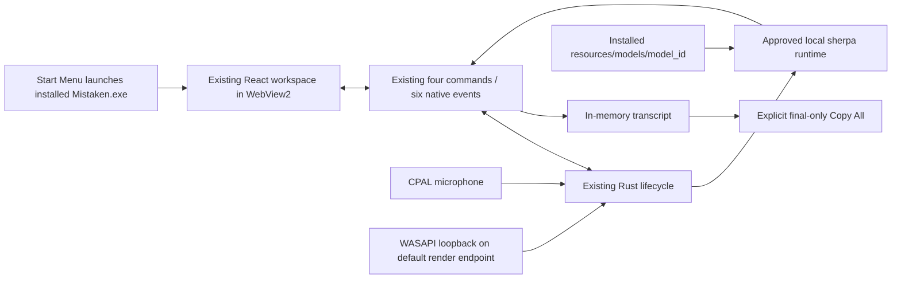

# Spec 14 — Windows Packaging and Distribution

## 1. Status, Ownership, Base, and Gates

- **Status:** Authored; **HARD BLOCKED** until Spec 12 returns production `PASS`. Not implemented.
- **Implementation owner:** One Spec 14 branch/worktree with one writer, on real Windows hardware. A mandatory independent high-capability review closes the spec.
- **Required base:** The exact clean, reviewed post-Spec-12 SHA named in Spec 12’s production successor freeze manifest. Spec 12 must have cross-host `PASS`, including `win-x64`, with `ProductionApproved` ASR maturity; a development run, no-authorization record, pre-Spec-12 branch, copied artifact, or local substitute is invalid.
- **Allowed predecessor:** Spec 12 production `PASS` only. Specs 01–11 are inherited transitively and are not reopened here.
- **Parallel-safe peer:** Spec 13 may run in a separate macOS worktree from the same post-Spec-12 SHA. Spec 14 owns only the Windows paths in section 5; Spec 13 owns only macOS packaging paths. Neither branch may edit frozen shared manifests, lockfiles, resources, notices, application source, or the other platform’s packaging subtree.
- **Shared-input gate:** Application version `0.1.0`, product name `Mistaken`, bundle identifier `com.mistaken.desktop`, the `ProductionApproved` runtime/model/configuration and Spec 05 approval digest, Spec 12-frozen delivery/layout, `THIRD_PARTY_NOTICES.txt`, root resource mapping/manifests, and every lockfile are consumed byte-for-byte. The temporary adapter is prohibited from executables, setup artifacts, staging manifests, and release-candidate paths.
- **Payload-contract gate:** Existing embedded-model steps apply only if Spec 12 freezes bundled delivery. If it freezes a separately provisioned checksum-pinned local resource, the integration owner must reconcile this spec before its worktree opens; the implementer may not improvise a downloader, package split, or ceiling.
- **Target gate:** V1 Windows distribution is **x64 only**, target triple `x86_64-pc-windows-msvc`. ARM64 and 32-bit builds are out of scope because Spec 05 approved neither their benchmark evidence nor a matching runtime archive.
- **Platform floor gate:** The supported and tested floor is **Windows 10 22H2 (build 19045) x64 and Windows 11**, exactly as Spec 08 recorded and Spec 09 declared. The Windows 10 1703 API floor remains recorded and explicitly untested; the installer must not claim unmeasured support.
- **Distribution gate:** V1 is a direct-download, per-user **NSIS setup executable** (`Mistaken_0.1.0_x64-setup.exe`). MSI/WiX, MSIX, Microsoft Store, winget, Chocolatey, portable ZIP, Tauri Updater, differential artifacts, and public upload are excluded.
- **WebView2 gate:** The installer embeds the Microsoft Evergreen WebView2 **offline installer** so installation needs no internet. `downloadBootstrapper`, `embedBootstrapper`, `fixedVersion`, and `skip` remain rejected.
- **Credential gate:** An Authenticode identity and reachable RFC 3161 timestamp service are external prerequisites. If present, signing/timestamping/verifying both executables and a real signed-download install are mandatory. If absent, all reachable unsigned/local packaging and verification must finish and only signature-dependent criteria may be `BLOCKED`; missing credentials never override the production-ASR gate or excuse a source, installer, payload, permission, lifecycle, or evidence failure.
- **Successor gate:** Spec 15 may start only after Specs 13 and 14 are reviewed and merged from the same production-approved Spec 12 base. Spec 14 produces an immutable Windows manifest and either signed `PASS` or an exact credential blocker; it never hands off a temporary-adapter artifact or declares release readiness.
- **Review level:** Medium implementation is acceptable; high-capability review is mandatory because the deliverable carries a production-approved third-party model/runtime, embedded Microsoft runtime installer, Authenticode trust, per-user install/uninstall state, and offline privacy claim.

## 2. Goal and User-Visible / Measurable Result

Produce a reproducible, installable Windows release candidate around the already accepted application without changing its product behavior.

The visible result on supported Windows x64 hardware is:

1. The user runs `Mistaken_0.1.0_x64-setup.exe`, completes an English installer with no administrator prompt, and gets a Start Menu entry for `Mistaken`.
2. Installation succeeds with networking disconnected, including on a host where the WebView2 runtime is absent, because the runtime installer is embedded.
3. The installed app presents the same accepted single-window Mistaken UI and requests no permission at launch. No Windows prompt exists for render-endpoint loopback, exactly as Spec 08 proved.
4. Microphone-only, system-only, and dual-source capture work offline from the installed product using the one `ProductionApproved` model/runtime through the delivery mechanism frozen by Spec 12; no temporary adapter or development override is present.
5. Stop → Start, window close, application exit, relaunch, and uninstall release native resources predictably and leave no Mistaken-owned transcript or audio data.
6. With a code-signing identity, the application executable and the setup executable carry a valid SHA-256 Authenticode signature with an RFC 3161 timestamp that `signtool verify /pa /all` accepts, and the real downloaded-installer experience is recorded honestly, including any SmartScreen reputation prompt.
7. Without a code-signing identity, an explicitly marked unsigned setup executable passes every non-signature check while the report is `BLOCKED` only for signing, timestamping, and signed-download trust.

A successful compile, an installer that was never executed, an unsigned build presented as distributable, or a launch without the real offline dual-source flow is insufficient.

## 3. Verified Current Behavior

Verified while authoring this spec:

- `/Users/berat/mistaken` does not exist. `/Users/berat/mistaken-context` is a documentation-only staging bundle containing context, the delivery plan, and Specs 01–13. There is no application source, Git SHA, approved model artifact, installer, signing certificate, or packaging evidence to inspect yet.
- Spec 01 reserves final product iconography and distributable bundles for Specs 13 and 14, and freezes product name `Mistaken`, identifier `com.mistaken.desktop`, version `0.1.0`, one `main` window, and a remote-free production CSP.
- Spec 08 froze the Windows platform truth this spec consumes: event-driven WASAPI loopback on the default render endpoint, API floor build 15063 with tested floor 19045/Windows 11, **no permission prompt, no elevation, no driver, no virtual cable, and no redistributable added by the adapter**, plus the DRM and Remote Desktop limitations that must be stated rather than hidden.
- Spec 09 declared the Windows floors in the designated platform-support document and wired the adapter into the real application. Spec 14 consumes those numbers and does not create a second source of truth.
- Spec 12 froze version `0.1.0`, one approved model/runtime/configuration, every model file’s relative path/size/SHA-256, the one resource path `$RESOURCE/resources/models/<model_id>/`, `THIRD_PARTY_NOTICES.txt`, root/shared manifests, and every committed lockfile, and requires the release-profile application to pass the complete Windows core flow offline with zero runtime network attempt and zero transcript/audio persistence before packaging begins.
- Spec 13 froze the sibling macOS packaging contract: disjoint ownership, no shared-input edits, an evidence schema with closed `PASS`/`FAIL`/`BLOCKED` semantics, normalized two-build reproducibility, and credential blockers that never cover a product defect. This spec mirrors that shape deliberately so Spec 15 compares two symmetric artifact manifests.
- Tauri 2 builds Windows artifacts either as WiX v3 `.msi` or as NSIS `-setup.exe`, and `.msi` can only be produced on Windows. The NSIS installer is a single multi-language artifact whose language set, compression, installer/uninstaller icons, Start Menu folder, install mode, template, and optional `.nsh` hooks are configurable.
- Tauri’s NSIS install modes are `currentUser` (default; installs under `%LOCALAPPDATA%`, no administrator privileges), `perMachine` (requires administrator), and `both` (also requires administrator).
- Tauri’s `webviewInstallMode` options are `downloadBootstrapper` (default, needs internet), `embedBootstrapper` (~1.8 MB, still needs internet), `offlineInstaller` (~127 MB, embeds Microsoft’s standalone installer, installs without an internet connection), `fixedVersion` (~180 MB or more, app-private runtime), and `skip` (app will not work without a preinstalled runtime).
- Microsoft documents that the Evergreen WebView2 runtime is part of Windows 11 and is present on the vast majority of Windows 10 devices but not all, recommends checking for the runtime and deploying it, and states that the **Evergreen Standalone Installer** is the supported way to install it in offline environments. Microsoft also documents that Fixed Version binaries exceed 250 MB, are not automatically patched, cannot run from a network/UNC path, and on Windows 10 require extra `icacls` grants since version 120. Fixed Version is therefore rejected: it would ship an unpatched browser engine inside a privacy-sensitive local app.
- Microsoft documents that the runtime installer performs a per-machine install when run elevated and a per-user install otherwise; a per-user install can be replaced by a per-machine install when a per-machine Microsoft Edge updater is present. The real observed behavior on each verification host is recorded, not assumed.
- Tauri’s `build > windows > staticVCRuntime` defaults to `true`, so the Visual C++ runtime is statically linked and `bundle > windows > bundleVCRuntime` stays `false`; combined with Spec 06’s `win-x64-static-MT-Release-lib` sherpa archive, no Visual C++ Redistributable, driver, or additional system dependency is required. This is verified against the real installed app rather than assumed.
- Tauri’s Windows signing support covers a `certificateThumbprint` + `digestAlgorithm` + `timestampUrl` configuration that invokes the Windows SDK `signtool`, an Azure Key Vault flow through `relic`, an Azure Artifact Signing flow, and a generic `bundle > windows > signCommand` escape hatch for any other signing tool.
- Microsoft documents that recent Windows SDK `signtool` builds require `/fd` for the file digest and `/td` for the timestamp digest, recommends SHA-256, and provides `signtool verify` for validating that a signature chains to a trusted authority.
- Tauri states plainly that Windows code signing prevents a SmartScreen “untrusted application” warning; it is not required to execute the app. Reputation effects differ between OV and EV/Trusted Signing identities, so the real first-download behavior is recorded from observation and never predicted in this document.
- The Tauri bundler fetches its own NSIS tooling, and in `offlineInstaller` mode the Microsoft WebView2 standalone installer, into a tools cache the first time they are needed, with `bundle > useLocalToolsDir` selecting a project-local `target/.tauri` cache instead of the user cache directory. A cold-cache Windows bundle build therefore cannot be fully offline; this spec resolves that with an explicit, checksum-pinned staging phase in section 7 instead of pretending otherwise.

No authoring statement is implementation evidence. During application, the canonical repository, installed Tauri/Windows SDK documentation, generated effective configuration, the real installer, signature verification output, real installed behavior, and observed OS prompts are authoritative. A discrepancy is fixed or reported; it is never hidden by weakening a check.

## 4. Scope

### In scope

- A Windows-only packaging configuration that produces exactly one x64 NSIS setup executable while leaving shared Spec 12 configuration unchanged.
- A final Windows app icon: the same restrained flat `M` mark concept frozen by Spec 13, built from the existing `--bg-surface` and `--accent-primary` values, exported to a valid multi-resolution `icon.ico` and reused as the installer and uninstaller icon.
- Frozen NSIS presentation: per-user install mode, English-only language set, no language selector, no custom header/sidebar artwork, template default compression, and a `Mistaken` Start Menu entry.
- Embedded Evergreen WebView2 offline installation, including the pinned installer version and SHA-256 recorded at staging time and the real behavior observed on a host with and without the runtime preinstalled.
- A pinned, checksum-verified staging phase for bundler tooling (NSIS and the WebView2 offline installer) followed by a network-traced offline packaging build from that cache.
- Deterministic packaging scripts and a closed evidence schema under `distribution/windows/**`, with ignored raw output and no secrets or private user content.
- Authenticode signing of both the application executable and the setup executable with SHA-256 digests and an RFC 3161 timestamp, verification with `signtool verify /pa /all` and PowerShell signature inspection, and honest recording of the real downloaded-installer/SmartScreen/Defender experience when an identity exists.
- Installer/payload inspection: architecture, version resource metadata, absence of an elevation manifest, linked dependencies, approved model/runtime/notice integrity, forbidden-file scan, and measured artifact sizes with the WebView2 share stated separately.
- A real per-user install, Start Menu launch, complete offline core flow, permission-behavior check, five Start → Stop → Start cycles, window close, application exit, termination signal, relaunch, and uninstall on the real `win-x64` Windows 11 reference host.
- A second real run on Windows 10 22H2 (build 19045) x64 to substantiate the declared floor. If no qualifying host is available, the floor criterion is an external `BLOCKED` item; configuration inspection alone cannot produce `PASS` for it.
- A normalized reproducibility comparison across two clean local builds from the same SHA and frozen inputs, excluding only documented signature/timestamp/installer-container metadata.
- A redacted immutable manifest handed to Spec 15 with artifact hashes, payload inventory, input digests, target/OS facts, WebView2 mode/version, signing state, install/uninstall results, and the exact blocker if any.

### Out of scope

- Changing application behavior, frontend UI, transcript semantics, commands/events, audio/ASR code, recovery policy, performance gates, model choice, model configuration, resource layout, notices, version, bundle identifier, root Tauri configuration, manifests, or lockfiles.
- ARM64 or 32-bit Windows artifacts, a second runtime archive, an unbenchmarked architecture, or an emulation claim.
- MSI/WiX packaging, MSIX, Microsoft Store submission, App Installer dependencies, winget/Chocolatey manifests, portable ZIP distribution, or a second installer artifact.
- Tauri Updater, an update endpoint, update signing key, update artifact, background update check, telemetry, analytics, crash upload, remote logging, or release hosting.
- Public upload, CDN/domain setup, download page, release notes, cross-platform checksum publication, final release tag, or release-ready declaration. Spec 15 owns them.
- A Windows service, scheduled task, `Run`/startup registry entry, driver, audio filter, virtual audio device, COM registration for third parties, elevation manifest, firewall rule, or administrator requirement.
- Bundling a Visual C++ Redistributable, .NET runtime, Python, ffmpeg, or any additional system dependency.
- Installer-driven configuration screens, EULA dialogs, marketing artwork, onboarding, additional app windows, file associations, custom URL schemes, or a second icon system.
- Persisting transcript, audio, device choice, permission state, update state, packaging evidence, or runtime settings from the application.
- Attempting to influence, bypass, or suppress SmartScreen, Defender, Controlled Folder Access, or any Windows security decision, or instructing users to disable them.
- Committing model weights, certificates, `.pfx`/`.p12` files, passwords, Azure client secrets, thumbprint-bearing signing configuration, raw transcripts/audio, absolute private paths, or installer binaries.

## 5. Owned Files and Forbidden Concurrent Files

### Primary owned paths

The implementation owns only Windows packaging files:

```text
src-tauri/tauri.windows.conf.json
src-tauri/icons/icon.ico
src-tauri/windows/hooks.nsh              # only if evidenced; expected absent

distribution/windows/.gitignore
distribution/windows/README.md
distribution/windows/stage-tools.ps1
distribution/windows/build.ps1
distribution/windows/verify.ps1
distribution/windows/report.schema.json
distribution/windows/assets/**
distribution/windows/tests/**
distribution/windows/evidence/report.json
distribution/windows/evidence/summary.md
distribution/windows/evidence/artifacts.sha256
distribution/windows/runs/.gitignore
```

Exact script subdivision may follow established repository conventions, but all Windows packaging implementation and evidence remains inside `distribution/windows/**`. Generated setup executables, extracted installer contents, staged tool caches, installed copies, registry exports, traces, and normalized manifests live only under ignored `distribution/windows/runs/**` or an operator-owned temporary directory. The nested `distribution/windows/.gitignore` is the only ignore file this spec may add, and it must cover raw runs plus the uncommitted local signing configuration.

`src-tauri/tauri.windows.conf.json` may set only Windows-affecting bundle fields: `bundle.targets` (`nsis`), `bundle.windows.webviewInstallMode`, `bundle.windows.nsis.*`, `bundle.windows.minimumWebview2Version` if evidence requires it, and `bundle.useLocalToolsDir` for an auditable project-local tool cache. It must not duplicate or override version, identifier, product name, shared resources, model mapping, notices, application windows, capabilities, CSP, updater settings, or `build.windows.staticVCRuntime`, and it must contain no signing identity.

### Consumed unchanged

- `package.json`, `package-lock.json`, Node/toolchain pins, npm scripts, and root frontend build configuration.
- `src-tauri/Cargo.toml`, `src-tauri/Cargo.lock`, `rust-toolchain.toml`, build script, application entrypoint, capabilities, permissions, shared Tauri configuration, and `build.windows.staticVCRuntime`.
- All application code and tests under `src/**`, `src-tauri/src/**`, and `crates/**`, including the Windows system-audio crate.
- Spec 12’s approved model/runtime/config manifest, locally staged model file set, resource mapping, third-party notices, version values, application identity, and lockfile digests.
- The designated platform-support document that carries Spec 08/09’s Windows floors.
- Acceptance harness and committed reports under `acceptance/**`; Spec 14 may invoke them but not change a gate or repair a product failure from its packaging worktree.
- The macOS packaging subtree, `Info.plist`, entitlements, and `icon.icns` produced by Spec 13.

### Forbidden concurrent and shared edits

Spec 14 must not create, edit, move, or delete:

- root/shared manifests or locks, including `package.json`, `package-lock.json`, `src-tauri/Cargo.toml`, `src-tauri/Cargo.lock`, and standalone-crate locks;
- `src-tauri/tauri.conf.json`, `src-tauri/capabilities/**`, application permissions, root `.gitignore`, shared resource manifests, model files, or `THIRD_PARTY_NOTICES.txt`;
- frontend/native product source, transcript/audio/ASR implementation, benchmark corpus/gates, the platform-support document, or Spec 12 acceptance semantics;
- `distribution/macos/**`, `src-tauri/Info.plist`, `src-tauri/Entitlements.plist`, `src-tauri/tauri.macos.conf.json`, `icon.icns`, or Spec 13 evidence;
- canonical context/tracker files from the feature worktree. The integration owner updates shared documentation after merge.

If packaging reveals that a frozen shared file is wrong, stop the affected packaging step, record the exact generated/effective discrepancy, and hand it to the integration owner. Specs 13 and 14 then restart from one newly reviewed common SHA. Copying a fix into both branches or silently overriding it in platform config is prohibited.

## 6. Contracts Consumed and Produced

### Consumed freeze contract

| Input | Required value or evidence |
|---|---|
| Repository base | Exact clean post-Spec-12 SHA authorized for both packaging branches |
| Product | `Mistaken` |
| Version | `0.1.0` in every frozen shared source |
| Bundle identifier | `com.mistaken.desktop` |
| Target | `x86_64-pc-windows-msvc` only |
| Supported floor | Windows 10 22H2 build 19045 x64 and Windows 11; API floor 15063 recorded untested |
| Model/runtime | Exactly one Spec 05/06/12-approved candidate, runtime tag/archive, decoding config, provider, and thread count |
| Model path | `$RESOURCE/resources/models/<model_id>/` from one frozen shared mapping |
| Model integrity | Exact relative paths, sizes, and SHA-256 values from the compiled-in/freeze manifest |
| Notices | Frozen `src-tauri/resources/licenses/THIRD_PARTY_NOTICES.txt` digest |
| System dependencies | None: static VC runtime, no redistributable, no driver, no virtual device, no elevation |
| Permission truth | No Windows prompt for render loopback; microphone governed by the OS desktop-app privacy setting |
| Offline/privacy | Spec 12 cross-host `PASS`, including `win-x64`, zero runtime external network attempt, no transcript/audio persistence |
| Lifecycle | Spec 10 recovery/shutdown contract and Spec 12 integrated evidence |
| Locks | Every committed npm/Cargo lock digest frozen at Spec 12 |

A mismatch is a failed precondition, not an invitation to repair or repin from this branch.

### Packaging configuration produced

The effective Windows package must resolve to:

- bundle target exactly `nsis`, producing exactly one `Mistaken_0.1.0_x64-setup.exe`;
- target architecture exactly `x86_64-pc-windows-msvc`;
- `webviewInstallMode` exactly `offlineInstaller`;
- `nsis.installMode` exactly `currentUser`, with no elevation manifest and no administrator requirement;
- `nsis.languages` exactly `["English"]` and `displayLanguageSelector` disabled;
- `nsis.installerIcon` and `nsis.uninstallerIcon` pointing at the one frozen `icon.ico`; no header or sidebar artwork;
- installer hooks absent unless section 10’s evidence process approves an exact need;
- `build.windows.staticVCRuntime` still `true` and `bundle.windows.bundleVCRuntime` still `false`;
- updater artifacts disabled and no updater public key, endpoint, plugin, or runtime check;
- no MSI/MSIX/Store/App-Installer configuration, no file association, no deep link, no `Run`/startup entry, no service, and no driver;
- no committed `certificateThumbprint`, `signCommand`, credential, or signing-tool path;
- the installed application directory containing the approved model under the one frozen resource path plus the shared third-party notices.

### Result-state contract produced

The Windows report has exactly one overall result:

- `PASS`: all criteria ran on the recorded artifact and hosts; the setup executable and application executable carry valid timestamped Authenticode signatures; the real per-user install, offline core flow, lifecycle, and uninstall checks passed; no High/Medium finding remains.
- `FAIL`: any runnable build, installer, payload, permission, signature-verification, install, offline, privacy, lifecycle, uninstall, floor, schema, or review criterion fails. A product defect is never relabeled as a credential blocker.
- `BLOCKED`: every reachable non-credential criterion passes, and the only unavailable prerequisite is either (a) an Authenticode identity or a reachable timestamp service, or (b) a qualifying real Windows 10 22H2 x64 host for the floor run. Each blocked item names what is missing, how availability was checked, all completed evidence, and the exact next action. Multiple unrelated missing prerequisites are listed separately.

An unsigned build can support `BLOCKED`; it can never support `PASS`. Skipped applicable work, unavailable ordinary development tools, a dirty tree, an unapproved model, or a failing artifact is `FAIL`, not `BLOCKED`. A SmartScreen reputation prompt on a validly signed artifact is recorded as an observation, not converted into `FAIL` or hidden.

### Evidence schema produced

`distribution/windows/evidence/report.json` is closed to unknown fields and contains no transcript/audio/secret:

```jsonc
{
  "schemaVersion": 1,
  "result": "PASS | FAIL | BLOCKED",
  "repository": {
    "root": "<redacted canonical root>",
    "branch": "<name>",
    "baseSha": "<40 hex post-Spec-12 SHA>",
    "finalSha": "<40 hex>",
    "dirty": false
  },
  "host": {
    "build": { "cpu": "<model/cores>", "ram": "<GB>", "os": "<edition/version/build>", "arch": "x64", "power": "AC" },
    "floor": { "os": "Windows 10 22H2 build 19045", "arch": "x64", "result": "PASS | BLOCKED" },
    "microphone": "<sanitized make/model or built-in>",
    "renderEndpoint": "<sanitized class/name>",
    "micPrivacySetting": "<enabled | disabled>",
    "webview2Before": { "present": true, "version": "<pv value or null>", "scope": "per-machine | per-user | none" }
  },
  "inputs": {
    "version": "0.1.0",
    "bundleId": "com.mistaken.desktop",
    "target": "x86_64-pc-windows-msvc",
    "modelId": "<approved id>",
    "modelManifestSha256": "<64 hex>",
    "runtimeTag": "<approved tag>",
    "runtimeArchiveSha256": "<64 hex>",
    "noticeSha256": "<64 hex>",
    "lockfileDigests": [{ "path": "<relative>", "sha256": "<64 hex>" }],
    "stagedTools": [{ "name": "nsis | webview2-offline-installer", "version": "<value>", "sha256": "<64 hex>", "sizeBytes": 0 }]
  },
  "artifacts": {
    "setup": { "name": "Mistaken_0.1.0_x64-setup.exe", "sha256": "<64 hex>", "sizeBytes": 0 },
    "installedPayloadManifestSha256": "<64 hex>",
    "installedFiles": 0,
    "installedBytes": 0,
    "webview2PayloadBytes": 0,
    "modelPayloadBytes": 0,
    "modelFilesVerified": 0
  },
  "security": {
    "signature": "authenticode | unsigned",
    "signedFiles": ["<relative path>"],
    "fileDigestAlgorithm": "sha256",
    "timestamp": "rfc3161 | null",
    "timestampAuthority": "<public name or null>",
    "certificateSubject": "<public subject or null>",
    "certificateThumbprint": "<public thumbprint or null>",
    "certificateNotAfter": "<date or null>",
    "signtoolVerify": "pass | blocked",
    "smartScreenObservation": "<observed behavior text>",
    "defenderScan": "clean | <finding>",
    "elevationManifest": false,
    "adminRequired": false
  },
  "runtime": {
    "networkDisconnected": true,
    "externalNetworkAttempts": 0,
    "installResult": "PASS",
    "installPath": "<redacted per-user path>",
    "registryWrites": ["HKCU\\<redacted>"],
    "shortcuts": ["<start menu | desktop>"],
    "webview2AfterInstall": { "present": true, "version": "<pv value>", "scope": "per-machine | per-user" },
    "launchPermissionPrompts": 0,
    "micOnly": "PASS",
    "systemOnly": "PASS",
    "dual": "PASS",
    "startStopStart": "PASS",
    "closeExitSignal": "PASS",
    "relaunch": "PASS",
    "uninstallResidue": "PASS"
  },
  "reproducibility": {
    "cleanBuilds": 2,
    "normalizedManifestMatch": true,
    "excludedMetadata": ["<closed documented exclusion>"],
    "toolVersions": { "windowsSdk": "<value>", "msvc": "<value>", "tauri": "<value>", "rust": "<value>", "node": "<value>", "npm": "<value>" }
  },
  "blockers": [{ "criterion": 0, "missing": "<external prerequisite>", "checked": "<method>", "nextAction": "<exact action>" }],
  "review": { "reviewer": "<identity>", "highOpen": 0, "mediumOpen": 0 }
}
```

For an unsigned result, the signature, timestamp, certificate, and `signtoolVerify` fields use schema-approved `null`/`blocked` values rather than fabricated ones. The implementation finalizes exact nullable types in the schema and tests rejection of contradictory combinations such as `PASS` plus `unsigned`, `authenticode` plus a null timestamp, `PASS` plus `adminRequired: true`, or `BLOCKED` plus a runnable product failure.

### Handoff produced for Spec 15

Spec 15 receives:

- final Spec 14 commit SHA and the exact Spec 12 base SHA;
- setup executable name, byte size, SHA-256, and local immutable location;
- installed payload manifest, `ProductionApproved` model/maturity/Spec 05 approval verification, and measured model/WebView2/total byte shares;
- target, floors, version metadata, linked dependencies, install mode/path, registry/shortcut inventory, icon, and frozen model-delivery result;
- Authenticode certificate subject/thumbprint/expiry, digest and timestamp facts, `signtool verify` result, observed SmartScreen/Defender behavior, or the exact external blocker;
- real-host install/launch/offline-flow/permission/lifecycle/uninstall results for Windows 11 and, when available, Windows 10 22H2;
- complete toolchain, staging-digest, and build command/environment record without credentials;
- High/Medium review disposition and cleanup state.

## 7. User Flow and Developer Verification Flow

### Operator preflight

1. Create the Spec 14 worktree from the exact reviewed post-Spec-12 SHA on the real Windows build host and record canonical root, worktree root, branch, base SHA, clean state, and the concurrent Spec 13 worktree. Confirm the two writers have disjoint paths.
2. Re-read canonical context, `spec-plan.md`, Specs 01–15, current source/tests, Prisma absence, manifests/locks, Spec 12 freeze/evidence, the platform-support document, and the installed Tauri 2 documentation under `node_modules`. Installed version-matched documentation overrides general examples.
3. Verify Spec 12 cross-host `PASS`, `ProductionApproved` maturity, Spec 05 approval digest, and `win-x64` result; recompute the successor freeze manifest and refuse packaging on mismatch or development maturity.
4. Record Windows host/toolchain/power/device/privacy/WebView2 state.
5. Verify exact production model/runtime/delivery artifacts, files/digests, and notice digest. Confirm no temporary adapter or `MISTAKEN_MODEL_DIR` enters the packaged product.
6. Check signing/timestamp prerequisites without printing secrets.

### Pinned staging flow (the one allowed online phase)

1. With networking enabled and traced, populate the project-local bundler tool cache: NSIS tooling and the Microsoft Evergreen WebView2 **offline installer** required by `offlineInstaller` mode.
2. Record every staged artifact’s source URL host, file name, version, byte size, and SHA-256 in the evidence report. A staged artifact whose digest cannot be recorded is unusable.
3. Restrict this phase to the documented Tauri/Microsoft distribution hosts. Any other destination observed in the trace is a failure, not a warning.
4. If the installed bundler version documents a way to consume a locally staged WebView2 installer directly, use it and record the mechanism. Otherwise record that the bundler fetched it during this staging phase.
5. Never commit staged installers or tool binaries. They live only in the ignored cache/run locations with their digests recorded.

### Deterministic offline packaging flow

1. Disconnect every non-loopback interface and verify there is no non-loopback default route. Keep this state through the measured builds, installs, core flows, relaunches, and uninstall checks.
2. Build from a clean tree with the frozen inputs, locked npm/Cargo behavior, the warm staged tool cache, the target triple, and no signing identity configured, producing only the `nsis` target.
3. Trace the build process tree. A dependency, runtime, model, frontend asset, or tool download attempt during the measured build is a failure; the staged cache must satisfy every need.
4. Repeat the build from the same SHA and inputs into an independent generated-output location. Produce normalized installed-payload manifests from both setup executables and compare them exactly.
5. Treat unsigned artifacts as local evidence only. Their filenames and evidence carry `unsigned` or an equivalent unmistakable marker and cannot be copied to the release-candidate location.

### Installer/payload inspection flow

1. Inspect the setup executable’s version resource for product name `Mistaken`, version `0.1.0`, company/copyright as frozen, and the correct icon; confirm no `requireAdministrator`/`highestAvailable` elevation manifest is present.
2. Extract or install the payload into an inspection location and enumerate every file. Confirm the application executable is x64 PE, all bundled binaries match the target architecture, and imports resolve without a Visual C++ Redistributable, .NET, or other absent system dependency.
3. Recompute every model file and notice digest from the installed application directory. Reject missing, duplicate, renamed, flattened, extra, or modified model files.
4. Measure total setup size, installed size, model payload bytes, and the WebView2 payload share, and record them as separate numbers so no single figure hides the embedded runtime.
5. Search the payload for `.env`, credentials, certificates, absolute developer paths, source maps, source/test files, benchmark recordings, transcripts, PCM/audio dumps, raw acceptance traces, `node_modules`, Cargo intermediates, duplicate model/runtime copies, updater metadata, remote URLs, and debug symbols not intentionally retained. Any finding is classified and removed at source before rebuilding.

### Signed distribution flow

When a code-signing identity exists:

1. Make one fresh clean build from the final source SHA with the identity supplied through an uncommitted local configuration, environment, or `signCommand`. Never commit thumbprints, credentials, private-key paths, or provider secrets.
2. Keep dependency resolution locked and the tool cache warm. Permit outbound network only for the timestamp service and, where the chosen provider requires it, that provider’s signing endpoint; trace the process tree and fail on every unrelated destination.
3. Require SHA-256 file digests and an RFC 3161 timestamp on both the application executable inside the payload and the setup executable itself.
4. Verify with `signtool verify /pa /all /v` on the setup executable and the installed application executable, and inspect the signature, certificate subject/thumbprint/expiry, digest algorithm, and timestamp through the Windows SDK and PowerShell signature inspection.
5. Compute the final artifact SHA-256 only after the last signing mutation. Never re-sign, patch, or repackage the setup executable after its digest is recorded.
6. Simulate the real download path: copy the final setup executable through a browser download or apply the equivalent zone/mark-of-the-web metadata, then run it as a standard user and record the exact SmartScreen and Defender behavior observed, including a reputation prompt if one appears. Do not remove the zone marker, disable SmartScreen/Defender, or instruct a user to do so.

When no identity or timestamp service is available, record `BLOCKED` for exactly the signature-dependent steps after completing the unsigned package, payload inspection, reproducibility, installed local flow, and every check independent of Authenticode trust.

### Real installed user flow

Run against the exact final setup executable on real Windows x64 hardware; use the signed artifact for `PASS`, or the clearly marked unsigned artifact only for reachable behavioral evidence in a credential-blocked run.

1. Begin in a fresh standard (non-administrator) Windows user profile with Mistaken absent, no prior install state, and networking disconnected. Record whether the WebView2 runtime is present before installation.
2. Run the setup executable as that standard user. Confirm no UAC elevation prompt appears, the installer is English and keyboard navigable, and installation completes offline. On a host without WebView2, confirm the embedded offline installer provisions the runtime and record the resulting scope and version.
3. Record the resolved install path, Start Menu entry, any desktop shortcut, and the `HKCU` registry keys the installer wrote. Confirm nothing was written to `Program Files`, `HKLM`, a service, a scheduled task, or a `Run`/startup key.
4. Launch Mistaken from the Start Menu. No microphone or system-audio prompt appears at launch.
5. With system audio off, explicitly Start microphone capture. With the Windows desktop-microphone privacy setting enabled, real microphone transcript appears; with it disabled in a controlled test account, the exact Spec 04/09 error code and Windows-specific guidance appear, with no macOS Screen Recording wording anywhere.
6. Enable system audio and explicitly Start. Confirm no prompt, no elevation, no driver, and no virtual device is required, and that known playback through the default render endpoint produces system transcript lines.
7. Run microphone-only, system-only, then simultaneous dual source with distinct local phrases. Confirm embedded-model startup with no development override or download; microphone lines stay unprefixed, system lines receive one formatter-owned `- `, and no transcript/audio persists.
8. Perform at least five Start → Stop → Start cycles, then close the window while dual capture is active, confirm the process tree and audio indicators disappear within Spec 10 bounds, exercise application exit and the platform termination path Spec 10 implemented, and relaunch to an empty idle state.
9. Keep networking disconnected across first launch, model load, core flow, and relaunch while tracing the process tree. There are zero non-loopback network attempts; signing and timestamp traffic belongs only to the build operator flow, never to the installed app.
10. Switch the default output device mid-session once to confirm Spec 08/10 endpoint-change behavior still holds in the packaged build.
11. Uninstall through Windows Settings → Apps and through the generated uninstaller. Confirm the application directory, embedded model, notices, shortcuts, and uninstall registry entry are gone, and that no Mistaken-owned transcript or audio data remains. Classify the WebView2 user-data folder and the WebView2 runtime itself honestly as Microsoft-owned state that uninstall may intentionally leave; do not claim removal that did not happen.
12. Repeat install, launch, permission behavior, a real dual-source flow, Stop → Start, close, relaunch, and uninstall on real Windows 10 22H2 build 19045 x64 hardware. Record edition/version/build, CPU/RAM, devices, privacy setting, and WebView2 state. A Windows 11 result never substitutes for the declared floor.

### Final verification flow

- Validate the closed report schema, artifact checksum file, summary, normalized payload manifests, and all raw-artifact digests.
- Run the root frontend/Rust/application checks inherited from Spec 12 without changing frozen files, then run the Windows packaging tests and the final package build.
- Run the complete real installed flow after the final build; any source or artifact mutation invalidates signature, checksum, install, and runtime evidence and requires a rerun.
- Conduct the mandatory high-capability review of changed paths, effective configuration, installer payload, signatures, install/uninstall state, evidence, and the Spec 15 handoff.
- Fill this spec’s implementation evidence, create one focused local commit unless directed otherwise, verify clean status, and report branch/base/final SHA. Do not push.

## 8. UI Behavior, States, Tokens, and Accessibility

Spec 14 adds no application window, route, component, control, copy, onboarding, dialog, toast, settings screen, or visual state. The installed app must render the exact Spec 12-accepted UI.

### App icon

- The Windows icon uses the same flat, high-contrast `M` mark concept as Spec 13, built from the values of the existing `--bg-surface` and `--accent-primary` tokens as its only brand colors. No raw third color, gradient, glow, glass, waveform, microphone illustration, brain/sparkle, chat bubble, tiny text, or AI branding is introduced.
- `icon.ico` contains the standard multi-resolution set required by Windows (including 16, 24, 32, 48, 64, 128, and 256 px) so Explorer, taskbar, Start Menu, Alt-Tab, and the installer render crisply at 100 %, 150 %, and 200 % scaling.
- The same file is the installer and uninstaller icon. Verify it in Explorer detail/tile views, the taskbar, the Start Menu, Alt-Tab, Settings → Apps, and the setup executable itself; the mark must remain recognizable, unclipped, and clearly distinct from a system or security warning icon.
- Spec 13 owns `icon.icns`. The shared concept is reconciled only by the integration owner after both packaging specs merge, before Spec 15.

### Installer surface

- Use the Tauri NSIS template with English only, no language selector, no custom header/sidebar bitmaps, and no added configuration pages.
- Every installer screen is operable by keyboard, has visible focus, and conveys state with text rather than color alone. Progress and completion text come from the template; no image-only instruction is added.
- The installer must not present marketing copy, a EULA dialog, a bundled offer, a newsletter checkbox, or a telemetry consent screen, because none exists in the product.
- Windows UAC, SmartScreen, Defender, and Settings → Apps are OS-owned surfaces. Evidence records their observed result and relevant non-private text; implementation never restyles, suppresses, or bypasses them.

### Permission and runtime UI

- Launch remains prompt-free.
- Windows shows no permission prompt for render-endpoint loopback; the app must not imply one exists.
- Microphone denial is reported exactly as Specs 04/09/10 implemented it, with Windows-specific settings guidance and no borrowed macOS wording.
- Packaging does not change focus order, keyboard shortcuts, Narrator behavior, text scaling, window sizes, contrast, reduced motion, or source status copy.

### Language, routes, and SEO

- V1 installer and app strings remain English, matching the current English application. No localization resource is added.
- There is one native application window and no web route, deep link, custom URL scheme, file association, protocol handler, browser page, or SEO surface.

## 9. Frontend → Tauri IPC → Rust / Audio / ASR Data Flow

Packaging wraps the accepted data flow; it does not add a new runtime layer:



Package-time flow is separate:

```mermaid
flowchart LR
  Freeze[Post-Spec-12 SHA and freeze manifest]
  Stage[Pinned online tool and WebView2 staging with digests]
  Local[Locked offline NSIS build]
  Inspect[Payload/architecture/size/forbidden-file checks]
  Sign[Authenticode + SHA-256 + RFC 3161 timestamp]
  Verify[signtool verify and signature inspection]
  Final[Immutable setup executable + manifest]
  Install[Per-user install and offline native flow]

  Freeze --> Stage --> Local --> Inspect --> Sign --> Verify --> Final --> Install
```



Runtime invariants:

- The frontend still invokes only Spec 03’s frozen application commands and listens to its frozen events. No packaging, install, or update command or event crosses IPC.
- PCM remains native and bounded; no sample, file path, model path, signature data, or installer metadata enters the WebView.
- Model discovery resolves only the installed resource path in a packaged build. `MISTAKEN_MODEL_DIR` is a development-only override and is absent from installed-flow environments.
- Transcript state remains in React memory; only final formatted text crosses the explicit write-only clipboard boundary.
- No installer, updater, helper, service, scheduled task, or background process survives after Mistaken exits.

## 10. Platform, Permissions, Offline, Privacy, and Fallback

### Platform and architecture

- Supported distribution target: `x86_64-pc-windows-msvc` only.
- Supported and tested floor: Windows 10 22H2 build 19045 x64 and Windows 11. Builds between 15063 and 19045 run the same code and remain explicitly untested; the installer and evidence say so rather than implying support.
- Build host and floor host evidence records CPU, cores, RAM, edition/version/build, architecture, power plan, display scaling, microphone, default render endpoint, microphone privacy setting, and WebView2 state.
- Every bundled application-owned binary is x64 PE. No 32-bit or ARM64 payload, emulation claim, or second model/runtime copy exists.

### WebView2 policy

- `offlineInstaller` is frozen because installation must work with no internet connection and the product promises no required network dependency. The embedded Microsoft Evergreen standalone installer adds roughly 127 MB and is recorded as a distinct payload share.
- `downloadBootstrapper` and `embedBootstrapper` are rejected: both require internet access at install time on a host lacking the runtime.
- `fixedVersion` is rejected: Microsoft documents payloads over 250 MB, no automatic security patching, no network/UNC execution, and extra `icacls` grants on Windows 10 since version 120. Shipping an unpatched browser engine inside a privacy-sensitive local app is a worse outcome than depending on the evergreen runtime.
- `skip` is rejected: the app would silently fail to launch on a host without the runtime.
- The installer must not reinstall or downgrade an already-present runtime. The pre-install and post-install `pv` values and install scope are both recorded from the real registry, and the per-user versus per-machine outcome is reported as observed rather than predicted.
- `minimumWebview2Version` stays unset unless a measured failure proves the application needs a newer runtime; adding it is a recorded decision with the exact failing behavior attached.

### Permission and privilege posture

- Install mode is `currentUser`, so no administrator privilege, UAC elevation, elevation manifest, or Windows policy exception is required for installation, launch, capture, or uninstall.
- The bundle declares no capability, service, driver, filter, firewall rule, or COM registration. Spec 08 recorded that render-endpoint loopback needs none of these, and that fact is verified against the installed app rather than re-derived.
- The only OS access boundary is the Windows desktop-app microphone privacy setting, whose observed effect on both microphone capture and render loopback is recorded per host.
- No Windows prompt is expected for system audio. Any prompt observed is a finding that must be explained, not smoothed over in copy.

### Signing and secrets

- Certificates and private keys live only in the operator certificate store, a hardware/HSM token, or the configured cloud signing provider. Credentials live only in environment or secret storage.
- Committed configuration contains no thumbprint, `signCommand` with embedded secrets, certificate path, password, PFX, Azure client secret, tenant/client identifier pair with a secret, or signing-tool absolute path. The local signing configuration file is ignored by the nested `.gitignore` and passed to the build explicitly.
- Logs and evidence may record certificate subject, public thumbprint, issuer, expiry, digest algorithm, timestamp authority, and `signtool` exit codes. They must not record secrets, credential-bearing command lines, or private paths.

### Offline boundary

- Dependency, runtime, model, and bundler-tool inputs are local and checksum verified before the measured build. The one permitted online phase is the pinned staging step, which is traced and restricted to documented Tauri/Microsoft hosts.
- Timestamping and, when required, a cloud signing provider are the only permitted network exceptions during the signed build phase. They run in a separately traced phase with unrelated destinations blocked.
- Installation and the installed app run with no non-loopback route and make zero network attempts. There is no updater, telemetry, crash upload, remote asset, license check, or model download.

### Privacy

- The payload contains product code, the approved model/runtime files, the icon, generated installer metadata, the Microsoft WebView2 offline installer, and the required notices only. It contains no transcript/audio or private acceptance data.
- Install/run/uninstall evidence uses deliberately scripted non-private phrases and stores only hashes, counts, and statuses. Screenshots must not show private transcript content, user names, or absolute private paths.
- The app creates no transcript or audio persistence. The WebView2 user-data folder, WebView2 runtime files, Windows installer/uninstall registry entries, Defender/SmartScreen caches, prefetch data, and OS logs are OS- or Microsoft-owned state; each is classified honestly and scanned for transcript sentinels rather than declared absent.

### Fallback

- Missing model/runtime/resource, wrong architecture, unsupported OS build, failed WebView2 provisioning, failed signature verification, install failure, or core-flow failure produces `FAIL` with exact evidence. No download, alternate model, cloud ASR, elevation workaround, virtual audio device, or security-bypass instruction is offered.
- Missing signing identity or unavailable timestamp service produces only the exact external `BLOCKED` result after all unsigned/reachable checks pass.
- A SmartScreen reputation prompt on a validly signed artifact is an observation recorded for Spec 15, not a packaging failure and not grounds for disabling a protection.
- Missing Windows 10 22H2 x64 test hardware blocks only the floor-run claim; it does not excuse Windows 11 package or runtime work.

## 11. Resource Lifecycle, Bounds, Errors, and Recovery

### Build/package lifecycle

- Packaging scripts are fail-fast, non-interactive after credential preflight where possible, quote paths, use run-scoped temporary directories with deterministic cleanup, and never print secrets.
- Every build starts from the same recorded clean SHA, frozen input digests, and verified staged tool digests. Generated output is isolated from source, and a stale artifact cannot satisfy a later run.
- Installed copies, extracted payloads, registry exports, and traces are removed or retained only in ignored raw-run storage with digests.
- A failure after signing never mutates the accepted artifact in place. Rebuild into a new run id; preserve failed raw evidence until disposition.

### Runtime lifecycle

- Launch allocates no audio/model resource and prompts for no permission.
- First explicit Start verifies/loads the embedded model and allocates only the requested source pipelines according to Specs 06/09/10.
- Stop finishes within inherited bounds, releases streams/workers/pools/stages and COM state on the adapter’s own thread, clears the OS microphone indicator, and leaves only the approved loaded model cached for the process lifetime.
- At least five Start → Stop → Start cycles use fresh source sessions/recognizer streams, preserve transcript invariants, and show no handle, thread, or working-set ratchet.
- Window close, application exit, and the Windows termination path Spec 10 implemented use the one idempotent shutdown. Forced termination and power loss remain OS-owned and are not claimed graceful.
- Relaunch is an empty idle state with no persisted transcript, device, source toggle, or retry state.

### Artifact bounds

- Exactly one model payload exists and remains within Spec 05’s frozen 120 MB uncompressed limit.
- Setup size, installed size, model share, and WebView2 share are measured and recorded separately. No new arbitrary gate is invented, but any unexplained growth beyond the sum of frozen payloads plus the recorded WebView2 installer must be explained file-by-file; unexplained packaging growth is `FAIL`.
- No duplicate model/runtime copy, debug symbol file, source map, benchmark corpus, raw trace, test fixture, package-manager cache, or second installer is shipped.
- The installed directory contains only the application, its resources, the notices, and generated uninstall metadata.

### Error and evidence handling

- `stage-tools.ps1`, `build.ps1`, `verify.ps1`, and schema validation return non-zero on every failed applicable check. No warning-only path can produce `PASS` for a signature, payload, architecture, install, uninstall, permission, or runtime failure.
- Evidence is immutable per run id. A fix creates a new build and run; reports never overwrite failed raw evidence.
- The closed schema rejects unknown fields, missing hashes/units/host facts, inconsistent result combinations, stale SHA, wrong target/version/model, skipped applicable criteria, and unresolved High/Medium findings.
- Signing and timestamp transient retries are bounded to three attempts with recorded timestamps and unchanged payload content. A verification failure is not retried until its cause is fixed and the artifact rebuilt if any signed content changed.
- High/Medium findings block merge. Low findings may remain only with explicit impact, owner, and rationale in the final review record.

## 12. Numbered Measurable Acceptance Criteria

1. **Predecessor and base — integration:** Spec 12 is implemented, reviewed, merged, and reports cross-host `PASS`, including the `win-x64` host; Spec 14 starts from its exact authorized clean SHA and records canonical root, worktree, branch, base SHA, final SHA, and clean final state.
2. **Parallel ownership — integration:** Spec 13, if active, starts from the same base in a separate worktree; every Spec 14 changed path is within section 5’s Windows ownership, and no frozen shared, macOS, product-source, model, notice, manifest, platform-support, or lockfile path changes.
3. **Frozen input identity — Windows/repository:** Version `0.1.0`, product/bundle identity, target, declared floors, approved runtime/model/config, resource mapping, notice digest, and every lockfile digest exactly match the Spec 12 freeze before each build and in the final report.
4. **Target and distribution shape — Windows:** The package produces exactly one x64 `Mistaken_0.1.0_x64-setup.exe`; there is no ARM64/32-bit payload, `.msi`, MSIX/Store/App-Installer configuration, winget/Chocolatey manifest, portable ZIP, updater artifact/config/key/endpoint/plugin, service, scheduled task, driver, `Run`/startup entry, file association, or second installer.
5. **Pinned staging — Windows:** Bundler tooling and the Microsoft WebView2 offline installer are staged in one traced online phase restricted to documented Tauri/Microsoft hosts, each recorded with name, version, byte size, and SHA-256; no staged binary is committed, and an unrecorded artifact cannot be used.
6. **Deterministic offline packaging build — Windows:** With no non-loopback route, locked npm/Cargo state, and the warm staged cache, two clean unsigned builds from the same SHA both succeed with zero network attempt and produce byte-identical normalized installed-payload manifests.
7. **Installer identity and privilege — Windows:** The setup executable’s version resource resolves `Mistaken`, `0.1.0`, the frozen company/copyright values, and the frozen icon; it contains no `requireAdministrator`/`highestAvailable` elevation manifest and triggers no UAC prompt.
8. **Approved payload integrity — Windows:** In the installed application directory, every approved model/runtime/notice file appears once at the frozen resource path with exact size/SHA-256; no file is missing, extra, flattened, renamed, duplicated, development-overridden, or downloaded; uncompressed model payload stays within 120 MB.
9. **Forbidden payload absence and dependency closure — Windows:** Payload inspection finds no `.env`, credential/certificate, absolute developer path, source map, source/test file, benchmark recording, transcript, PCM/audio dump, raw acceptance trace, `node_modules`, Cargo intermediate, duplicate model/runtime, updater metadata, remote URL, or unintended debug symbol; imports resolve with `staticVCRuntime` true and no Visual C++ Redistributable, .NET, driver, or virtual device required.
10. **Icon and installer accessibility — Windows:** `icon.ico` carries the reviewed flat token-derived `M` mark at every required resolution and displays recognizably in Explorer, taskbar, Start Menu, Alt-Tab, Settings → Apps, and the setup executable at 100 %, 150 %, and 200 % scaling; the English installer is keyboard operable with visible focus, no language selector, no marketing/EULA/bundled-offer screen, and no color-only or image-only meaning.
11. **Offline WebView2 provisioning — real Windows:** On a host without the runtime, the embedded offline installer provisions WebView2 with networking disconnected and the app launches; on a host that already has it, no reinstall or downgrade occurs; pre-install and post-install `pv` values and install scope are recorded from the real registry.
12. **Per-user install state — real Windows:** A standard non-administrator user installs successfully; the resolved install path is the recorded per-user location, `Program Files` and `HKLM` are untouched by the app installer, the Start Menu entry exists, and every registry write is the expected `HKCU` uninstall/app metadata with no startup, service, or policy key.
13. **Authenticode signature — Windows, credential-dependent:** Both the setup executable and the installed application executable carry a SHA-256 Authenticode signature with an RFC 3161 timestamp; `signtool verify /pa /all /v` succeeds, certificate subject/thumbprint/expiry and timestamp authority are recorded, and the final SHA-256 is computed only after the last signing mutation with no later content change.
14. **Download-path trust behavior — real Windows, credential-dependent:** Running the signed artifact with real download/zone metadata as a standard user records the exact observed SmartScreen and Defender behavior, a clean Defender scan, and no use of unblocking, SmartScreen/Defender disabling, policy override, or elevation; no guarantee of a prompt-free first run is claimed.
15. **Real install and launch — real Windows 11 reference host:** From the exact final artifact the app installs offline, appears in the Start Menu with the correct name and icon, launches without elevation or internet, and shows the accepted Mistaken UI with zero permission prompt at launch.
16. **Installed offline core flow — real Windows:** With no non-loopback route and no development model override, the installed app completes microphone-only, system-only, and simultaneous dual-source transcription using the real microphone and default render endpoint plus the embedded approved model; structural prefixing, immutable finals, Copy/Clear, and zero runtime network attempt or persistence remain exactly as Spec 12 accepted.
17. **Permission and platform truth — real Windows:** No prompt, elevation, driver, virtual device, or "Stereo Mix" device is required for loopback; with the desktop-microphone privacy setting disabled, the exact Spec 04/09 code and Windows-specific guidance appear; no macOS Screen Recording wording exists anywhere in the shipped build; the default-output-switch path still behaves per Specs 08/10.
18. **Start/stop/shutdown/uninstall — real Windows:** Five Start → Stop → Start cycles, active window close, application exit, and the platform termination path release capture resources within Spec 10 bounds, clear OS indicators, leave no process/handle/thread/working-set ratchet, and relaunch empty idle; uninstall through Settings → Apps and through the uninstaller removes the application directory, embedded model, notices, shortcuts, and uninstall registry entry, leaves no Mistaken-owned transcript/audio data, and classifies remaining Microsoft-owned WebView2 state honestly.
19. **Declared floor behavior — real Windows 10 22H2 x64:** The exact final artifact installs, launches, obtains microphone access through the OS privacy setting, completes a real dual-source flow, Stop → Start, close, relaunch, and uninstall on recorded build 19045 hardware; absence of that host is explicit `BLOCKED`, never inferred `PASS`, and the untested 15063–19044 range is stated as untested.
20. **Packaging network boundary — Windows:** The staging phase trace shows only documented Tauri/Microsoft destinations; the measured builds, the installation, and the installed runtime show zero non-loopback attempt; the signed phase permits only timestamp and, if required, provider signing traffic with zero unrelated destination; no updater/telemetry/model/license request exists anywhere.
21. **Credential blocker semantics — integration:** If a signing identity or timestamp service is unavailable, every non-signature criterion passes with clearly marked unsigned artifacts, the overall result is `BLOCKED`, each blocked field is null/blocked rather than fabricated, and the report names the check, missing external prerequisite, completed work, and exact next action. Unsigned output is never named or handed off as distributable.
22. **Evidence and reproducibility — integration:** The closed report and checksum/summary files validate, reject contradictory or incomplete fixtures in permanent tests, contain the two-build normalized comparison plus exact artifact/input/staging/tool/host/security/runtime facts including separate model and WebView2 byte shares, reference immutable raw digests, and contain no transcript/audio/secret/private path.
23. **Complete checks — Windows:** Existing typecheck, ESLint, frontend tests/build, Rust format/check/clippy/tests, the Windows adapter crate checks, Spec 12 frozen consistency checks, Windows packaging tests, both package builds, payload verification, and the final real installed smoke all pass with exact commands/tool versions/exits recorded; no changed lockfile or shared source remains.
24. **High review and Spec 15 handoff — integration:** Independent high-capability review covers ownership, effective configuration, staging provenance, payload/license integrity, architecture/floor claims, privilege and registry posture, WebView2 policy, signature/timestamp/verification, offline/privacy/lifecycle/uninstall evidence, and artifact immutability; every High/Medium finding is fixed and rerun, and Spec 15 receives the final artifact manifest or precise external blocker from the focused clean commit.

## 13. Acceptance Criterion → Verification / Test Mapping

| AC | Verification or permanent test | Evidence to record |
|---:|---|---|
| 1 | Inspect Spec 12 successor authorization and Git root/worktree/branch/status | Spec 12 report/SHA, canonical/worktree roots, branch, base/final SHA, clean state |
| 2 | Compare active worktrees and classify every changed path against section 5 | Peer base SHA, changed-path list, zero forbidden overlap |
| 3 | Recompute freeze manifest before both builds and from the installed payload | Version/id/target/floors, model/runtime/config/notice/lock digests, mismatch count |
| 4 | Inspect effective Tauri config, bundler output directory, PE architecture, and update/plugin/service configuration | Artifact list, target/arch, excluded-format and excluded-mechanism checklist |
| 5 | Run the traced staging phase; hash every staged artifact; inspect ignore rules and Git contents | Destination hosts, tool/runtime names, versions, sizes, SHA-256, zero committed binaries |
| 6 | Run two isolated unsigned builds offline; generate/compare normalized payload manifests; trace network attempts | Commands/env/tool versions, run ids, manifest digests/diff, connection count |
| 7 | Inspect version resource and embedded manifest; run setup as standard user | Product/version/company/icon values, manifest requestedExecutionLevel, UAC observation |
| 8 | Recompute file count/path/size/SHA-256 in the installed directory and compare the Spec 12 manifest; launch without override | Resource path, file/digest diff, payload bytes, first-load result |
| 9 | Recursive classified payload inventory, string/path scan, and dependency/import inspection | Forbidden-category counts, dependency list, zero unresolved import or missing redistributable |
| 10 | Validate `.ico` resolutions; inspect Explorer/taskbar/Start Menu/Alt-Tab/Settings/setup at three scalings; keyboard-drive the installer | Resolution list, visual observations, focus/navigation result |
| 11 | Install offline on a host without WebView2 and on a host with it; read `pv` keys before and after | Pre/post version and scope per host, provisioning result, zero reinstall/downgrade on the equipped host |
| 12 | Standard-user install; record install path, shortcuts, and registry diff; inspect `Program Files`/`HKLM`/startup keys | Install path, shortcut list, `HKCU` keys, zero machine-scope or startup writes |
| 13 | `signtool verify /pa /all /v` plus signature/certificate inspection on setup and installed executable; rehash after signing | Verify exits, subject/thumbprint/expiry, digest/timestamp facts, final SHA-256 |
| 14 | Apply real download/zone metadata; run as standard user; run a Defender scan | SmartScreen/Defender observations, scan result, zero bypass action |
| 15 | Run the full install/launch sequence on the Windows 11 reference host | Host facts, install/launch result, prompt count, UI observation |
| 16 | Run installed mic-only/system-only/dual/Copy/Clear flow under Spec 12 network/privacy observers | Devices, model path/load, source/prefix/final results, attempt/write counts |
| 17 | Toggle the desktop-microphone privacy setting in a controlled account; switch default output mid-session; inspect shipped copy for macOS wording | Privacy-state results, displayed codes/guidance, endpoint-change behavior, zero macOS wording finding |
| 18 | Five cycles plus close/exit/termination; sample processes/handles/threads/working set; relaunch; uninstall both ways and scan owned paths and registry | Transition/release timings, resource deltas, uninstall inventory, residue classifications |
| 19 | Repeat install/permission/dual/cycle/close/relaunch/uninstall on real Windows 10 22H2 x64 | Floor host facts, flow results or exact host blocker, untested-range statement |
| 20 | Trace process tree during staging, both measured builds, the signed phase, installation, and installed runtime | Destination classifications, permitted-call list, unrelated/runtime counts zero |
| 21 | Validate credential-present and credential-absent schema fixtures; inspect the real preflight/blocker record and artifact names | Identity/timestamp availability method, reachable pass list, blocked fields/action, no distributable unsigned handoff |
| 22 | Schema tests for unknown/missing/contradictory/private data; verify raw digests, size shares, and the two-build result | Test cases/exits, report/checksum/summary digests, size breakdown, privacy scan |
| 23 | Execute the exact inherited and packaging command matrix, then the final installed smoke | Commands, versions, exits, unchanged lock/shared-source checks |
| 24 | Independent high review of diff, installer payload, raw/committed evidence, and handoff | Reviewer, findings/dispositions, rerun ids, final manifest and commit SHA |

Permanent tests are required for report-schema/result-state contradictions, freeze-manifest comparison, normalized-payload-manifest construction/comparison, staged-tool digest verification, forbidden payload entries, the frozen installer configuration allowlist (target, install mode, WebView2 mode, languages, absence of updater/service/startup keys), artifact-name/target rules, size-share arithmetic, and final checksum consistency. They must assert rejection or consumer-visible output, not source text or mock forwarding.

Real signing, signature verification, SmartScreen/Defender behavior, per-user installation, WebView2 provisioning, embedded-model load, audio capture, lifecycle, uninstall, floor-OS behavior, and network/privacy observations cannot be replaced by mocks or permanent tests.

## 14. Ordered Implementation Plan

1. Wait for implemented/reviewed Spec 12 and create the Spec 14 worktree from its exact authorized SHA on the real Windows build host. Record the concurrent Spec 13 boundary.
2. Re-read canonical context/specs, source, tests, manifests, locks, Prisma absence, Spec 12 freeze/evidence, the platform-support document, installed packages, generated Tauri schema, and installed Tauri/Windows SDK documentation. Run baseline checks without editing.
3. Recompute the complete freeze manifest and validate Spec 12’s cross-host `PASS`, including `win-x64`. If any shared input differs, stop packaging and hand the mismatch to the integration owner.
4. Add `distribution/windows/**`: operator guide, staging/build/verify scripts, closed schema, focused schema/manifest/allowlist tests, nested ignore rules, ignored raw-run path, evidence templates, and exact cleanup rules. Add no dependency.
5. Produce `src-tauri/icons/icon.ico` from the shared token-derived `M` concept with every required resolution and validate it visually across Explorer, taskbar, Start Menu, Alt-Tab, Settings, and the setup executable.
6. Add `src-tauri/tauri.windows.conf.json` with only the frozen Windows fields: `nsis` target, `offlineInstaller`, `currentUser`, English-only languages, no language selector, the installer/uninstaller icon, and the auditable project-local tool cache. Do not duplicate frozen shared values and do not add a signing identity.
7. Implement preflight/freeze verification, the traced pinned staging phase with digest recording, offline/locked build enforcement, output isolation, normalized payload manifest generation, payload/forbidden-file/dependency inspection, version-resource and manifest inspection, size-share measurement, and run-scoped cleanup.
8. Run two clean unsigned builds with no non-loopback route. Compare normalized manifests, inspect both payloads, and fix packaging source rather than widening exclusions.
9. Install the unsigned artifact in a fresh standard-user profile for reachable native-flow verification. Exercise WebView2 provisioning, permission behavior, the embedded model, all source combinations, five Start/Stop cycles, close/exit/termination, relaunch, uninstall, offline attempts, and persistence scans. Never present this artifact as distributable.
10. Review the privilege, registry, shortcut, and dependency posture. Keep installer hooks absent unless a real measured need appears; if one does, add the minimum hook, document exactly what it does and why, and rerun the complete install/uninstall matrix.
11. If a signing identity and timestamp service exist, make one fresh final build with the identity supplied out of tree, then verify signatures on both executables before distribution testing.
12. Apply real download/zone metadata, run the signed artifact as a standard user, record SmartScreen/Defender behavior and a Defender scan, and compute the immutable final digest only after the last signing mutation.
13. Run the complete installed flow offline on the Windows 11 reference host from the exact final artifact, including uninstall and residue classification.
14. Repeat the required floor flow on real Windows 10 22H2 build 19045 x64 hardware. If unavailable, record only this exact external blocker after completing Windows 11 evidence.
15. If a signing identity or timestamp service is unavailable, finalize a schema-valid `BLOCKED` report only after all reachable steps pass. Keep unsigned artifacts clearly marked and outside the release-candidate handoff location.
16. Run all inherited application checks and focused packaging tests, then rebuild and re-run every artifact-dependent check after the final source change. Confirm shared files and lock digests remain frozen.
17. Generate the report, summary, checksum file, normalized manifest digest, raw-run digests, and Spec 15 handoff. Scan committed content and Git objects for model weights, staged installers, secrets, private paths, transcripts/audio, and raw artifacts.
18. Conduct independent high-capability review across source, effective config, installer payload, signatures, install/uninstall state, offline/privacy/lifecycle evidence, and blocker semantics. Fix High/Medium findings and regenerate affected evidence.
19. Remove installed test copies, extracted payloads, registry exports, staged caches no longer needed, traces, clipboard content, and temporary scripts; restore host network state, default audio device, microphone privacy setting, and security settings; record any state that cannot be restored.
20. Fill section 16 with observed facts, create one focused local Spec 14 commit unless instructed otherwise, verify clean status, and report branch/base/final SHA and push status. Do not publish or push unless explicitly requested.

## 15. Risks, Rollback, Cleanup, and Preservation Rules

### Risks and mitigations

- **Unsigned artifact mistaken for release:** Windows runs unsigned executables after a SmartScreen warning, so an unsigned build can look finished. Mark filenames/evidence, forbid release handoff, and require `PASS` to prove a verified timestamped signature.
- **False offline-install claim:** `downloadBootstrapper` would silently require internet on a host lacking WebView2. `offlineInstaller` is frozen and proven on a host with the runtime absent, with networking disconnected.
- **Cold-cache build needs network:** the bundler fetches NSIS and the WebView2 installer on first use. Separate a traced, digest-pinned staging phase from the measured offline build instead of claiming a fully offline cold build.
- **Unpinned Microsoft payload:** an unrecorded WebView2 installer version would make the artifact untraceable. Record version, size, and SHA-256 at staging and carry them into the manifest.
- **Fixed Version temptation:** it removes the download but ships an unpatched engine, exceeds 250 MB, breaks on UNC paths, and needs `icacls` on Windows 10. Rejected with the reason recorded.
- **Elevation creep:** switching to `perMachine` or adding a hook that needs admin would change the threat model and the user promise. Install mode is frozen at `currentUser` and verified by a real standard-user install with no UAC prompt.
- **Registry or startup residue:** an installer can leave keys, shortcuts, or `Run` entries. Diff the registry, enumerate shortcuts, and verify uninstall removes everything the installer created.
- **Uninstall overclaim:** the WebView2 runtime and its user-data folder are Microsoft-owned and may remain. Classify them honestly instead of claiming a clean machine.
- **Shared freeze drift:** a platform worker could override a wrong shared value locally. Compare all digests before every build and return discrepancies to the integration owner.
- **Timestamped output called byte-reproducible:** signatures, timestamps, and NSIS container metadata vary. Compare closed normalized payload manifests across clean builds and record the immutable final signed artifact hash; never claim signed-byte identity.
- **Missing model in installed app:** a development override can hide a packaging omission. Unset it, hash files in the installed directory, and load the model offline from the installed path.
- **Missing runtime dependency:** a dynamically linked CRT or DLL would fail only on a clean machine. Keep `staticVCRuntime` true, inspect imports, and verify on a host that never hosted the toolchain.
- **Architecture mismatch:** an accidental host-arch or 32-bit build would break the floor claim. Verify PE architecture for every bundled binary.
- **Security-control interference:** disabling SmartScreen/Defender or stripping the zone marker would fake the download experience. Observe and record the real behavior; never bypass it.
- **Secret leakage:** thumbprints in committed config, transcript logging of signing commands, or a committed PFX would expose signing identity. Keep identity out of tree, redact command records, and scan committed and raw handoff content.
- **Private transcript in screenshots/logs:** use scripted non-private phrases, commit aggregate/digest evidence only, and inspect every screenshot/log before retention.
- **Host contamination:** verification changes default devices, privacy settings, and network state. Snapshot, restore, and record anything that could not be restored.

### Rollback

- Before merge, abandon only the Spec 14 branch/worktree; the reviewed post-Spec-12 SHA and the Spec 13 branch remain intact.
- A failed package or signing run is never repaired in place. Keep its ignored raw evidence, fix source/config, and create a new run and artifact identity.
- After merge but before Spec 15, revert the focused Spec 14 commit to revoke the Windows packaging handoff. Do not leave the artifact manifest pointing at reverted configuration.
- If a shared freeze defect is found, stop both Specs 13/14, serialize the integration-owner fix, rerun affected Spec 12 gates, then recreate or rebase both packaging branches from one reviewed SHA.
- If a signing certificate or artifact is compromised, stop distribution, preserve hashes and signature metadata, revoke through the issuer’s process, and let Spec 15 own public rollback and release response.
- Never reset/clean unrelated user work, delete operator certificates, remove model/runtime files outside the run-scoped packaging scratch area, or modify the context staging bundle after the repository becomes canonical.

### Required cleanup

- Uninstall every test installation, remove extracted payloads, installed copies outside the one immutable local handoff, registry exports, traces, and temporary scripts.
- Remove staged tool caches that are no longer needed, and never leave a staged Microsoft or NSIS binary in a tracked path.
- Restore network interfaces and routes, default output device, microphone privacy setting, SmartScreen/Defender configuration, power plan, clipboard placeholder, and any audit setting; record OS-owned state that cannot be reverted safely.
- Remove experimental installer hooks, `perMachine`/`both` experiments, MSI/WiX or MSIX prototypes, custom NSIS templates or artwork, alternate icons, local signing identities in tracked config, updater prototypes, packaging dependencies, and one-off test hooks that did not make the reviewed design.
- Confirm no model weight, runtime archive, WebView2 installer, NSIS binary, certificate, PFX, password, Azure secret, private path, transcript, audio, screenshot with private content, or generated installer is staged or committed.
- Keep only durable schema/manifest/allowlist tests that catch plausible packaging or security regressions. Delete source-text tests, mock echoes, and one-off probes.

### Preservation rules

- Preserve all Spec 12 product behavior and evidence: local-only processing, separate sources, structural attribution, verbatim finals, no grammar correction or cloud fallback, bounded PCM, in-memory transcript, explicit final-only Copy All, and no account/backend/database.
- Preserve the exact four commands, six events, typed errors/revisions, main-only capability boundary, remote-free CSP, recovery policy, shutdown, accessibility, and performance gates.
- Preserve version `0.1.0`, bundle identifier, approved model/runtime/configuration/license/provenance, one resource path, notice content, and lockfile digests.
- Preserve Spec 08’s Windows truth: no permission prompt for loopback, no elevation, no driver, no virtual cable, no redistributable, and the documented DRM/Remote Desktop/session-mix limitations stated rather than hidden.
- Preserve the declared floor semantics: tested 19045/Windows 11, untested 15063–19044, and no support claim beyond measured evidence.
- Preserve artifact immutability after signing and one-to-one traceability from the final setup executable to the source SHA, freeze manifest, and staged tool digests.
- Preserve Spec 13’s disjoint ownership and Spec 15’s exclusive authority to declare release readiness or publish artifacts.

### Open product questions

None. V1 Windows distribution is resolved here as x64-only, a single per-user NSIS setup executable, embedded Evergreen WebView2 offline installation, English-only installer UI, no updater, no elevation, and no additional system dependency. Actual signing-identity and timestamp-service availability, the identity of qualifying build and floor hosts, the staged WebView2 version, and observed SmartScreen behavior are external implementation evidence, not product choices to guess.

## 16. Definition of Done and Evidence Record

Spec 14 is done when the exact reviewed post-Spec-12 application is packaged without shared-input drift into one verified x64 per-user NSIS setup executable; the approved model/runtime/notices are present once and exact; identity, architecture, declared floors, privilege posture, registry and shortcut inventory, WebView2 offline provisioning, payload exclusions, dependency closure, deterministic normalized builds, offline installed core flow, permission truth, Start → Stop → Start, shutdown, relaunch, and uninstall all satisfy this spec; and high-capability review leaves no High/Medium finding.

A full `PASS` additionally requires a valid SHA-256 Authenticode signature with an RFC 3161 timestamp on both the setup and application executables, successful `signtool verify /pa /all`, a recorded real download-path install as a standard user, and the real Windows 10 22H2 floor run. If the only unavailable inputs are a signing identity/timestamp service or the floor host, the spec may close as precisely `BLOCKED` after every reachable criterion passes. An unsigned artifact is never release-ready. Spec 15 remains the only cross-platform release gate.

### Required implementation evidence

Fill during implementation; do not predeclare success:

- **Implementation status:** Not implemented
- **Overall result:** Pending
- **Canonical repository root:** Pending Spec 01
- **Worktree root / branch / base SHA / final implementation commit SHA:** Pending
- **Spec 12 authorization SHA / cross-host and `win-x64` results / freeze-manifest digest:** Pending
- **Concurrent Spec 13 base and path-overlap check:** Pending
- **Final clean Git state and changed-path classification:** Pending
- **Product/version/bundle id/target/declared floor effective values:** Pending
- **Node/npm/Rust/Cargo/Tauri/MSVC/Windows SDK/`signtool` versions:** Pending
- **Build host CPU/RAM/edition/version/build/power facts:** Pending
- **Windows 10 22H2 floor host facts or exact blocker:** Pending
- **Microphone/default render endpoint and microphone privacy state per host:** Pending
- **WebView2 `pv` state before and after install per host, with scope:** Pending
- **Approved model id/manifest/file-count/payload bytes/digest result:** Pending Spec 12 implementation
- **Runtime tag/archive digest/linkage result:** Pending
- **Third-party notice path/digest/inclusion result:** Pending
- **Frozen lockfile path/digest comparison:** Pending
- **Staged tool and WebView2 installer names/versions/sizes/SHA-256 and traced destinations:** Pending
- **Effective Windows Tauri configuration:** Pending
- **Version resource values and embedded manifest inspection:** Pending
- **Elevation/UAC observation and install mode result:** Pending
- **Icon source/export digest and Explorer/taskbar/Start Menu/Settings/setup observations:** Pending
- **Unsigned build commands/environment/network state/run ids:** Pending
- **Two-build normalized manifest digests/diff/exclusion list:** Pending
- **Setup executable name/final SHA-256/size:** Pending
- **Installed payload manifest digest/file count/installed bytes:** Pending
- **Model and WebView2 payload byte shares:** Pending
- **PE architecture and dependency/import inventory:** Pending
- **Forbidden payload scan categories/counts:** Pending
- **Signing identity and timestamp-service availability check:** Pending
- **Certificate subject/thumbprint/issuer/expiry:** Pending
- **Signed files, digest algorithm, timestamp authority, `signtool verify` exits:** Pending
- **Signing/timestamp network destination classification:** Pending
- **Download/zone metadata method, SmartScreen observation, Defender scan result:** Pending
- **Standard-user install path, shortcuts, and `HKCU` registry inventory:** Pending
- **Machine-scope/startup/service/driver absence check:** Pending
- **Launch prompt count:** Pending
- **Installed embedded-model load with development override absent:** Pending
- **Microphone-only/system-only/dual-source installed flow:** Pending
- **Source attribution/prefix/final/Copy/Clear observations:** Pending
- **Microphone privacy-setting enabled/disabled behavior and displayed guidance:** Pending
- **Default-output-switch behavior in the packaged build:** Pending
- **Installed runtime network attempt count:** Pending
- **Transcript/audio persistence scan result including WebView2 user-data folder:** Pending
- **Five Start → Stop → Start cycle timing/resource result:** Pending
- **Window close/exit/termination/indicator/process/relaunch result:** Pending
- **Uninstall inventory and residue classification:** Pending
- **Windows 10 22H2 complete flow result or exact blocker:** Pending
- **Credential/host blockers, checked methods, completed work, next actions:** Pending
- **Report schema and negative-fixture test results:** Pending
- **Exact inherited/packaging verification commands and exits:** Pending
- **Committed evidence/report/checksum/summary/raw-digest privacy scan:** Pending
- **Independent high-capability reviewer/findings/dispositions/rerun ids:** Pending
- **Spec 15 artifact manifest/handoff location and digest:** Pending
- **Cleanup and host-setting restoration:** Pending
- **Focused local commit:** Pending
- **Push status:** Not pushed unless explicitly requested

### Authoring evidence and sources

- Reviewed `/Users/berat/mistaken-context/project-overview.md`, `architecture.md`, `ui-context.md`, `code-standards.md`, `ai-workflow-rules.md`, `progress-tracker.md`, `spec-plan.md`, and Specs 01, 08, 12, and 13, plus packaging references across the staged spec set.
- Verified the application repository is absent and the context bundle remains documentation-only.
- Primary sources retrieved 2026-09-11:
  - [Tauri Windows Installer — NSIS vs WiX, install modes, WebView2 install modes and sizes, languages, hooks, and tool caching](https://v2.tauri.app/distribute/windows-installer/)
  - [Tauri Windows Code Signing — OV certificate/`signtool` configuration, Azure Key Vault via relic, Azure Artifact Signing, and `signCommand`](https://v2.tauri.app/distribute/sign/windows/)
  - [Tauri Configuration — `nsis` target/config, `webviewInstallMode`, `installMode`, `staticVCRuntime`, `bundleVCRuntime`, `signCommand`, `useLocalToolsDir`](https://v2.tauri.app/reference/config/)
  - [Microsoft, Distribute your app and the WebView2 Runtime — Evergreen availability, standalone offline installer, per-machine vs per-user install, runtime detection registry keys, Fixed Version size and constraints](https://learn.microsoft.com/en-us/microsoft-edge/webview2/concepts/distribution)
  - [Microsoft, SignTool — `/fd` and `/td` digest requirements, SHA-256 recommendation, and `verify` semantics](https://learn.microsoft.com/en-us/dotnet/framework/tools/signtool-exe)

Authoring this file is not implementation evidence. Every pending field remains pending until Spec 14 is applied in the canonical repository and the exact setup executable, signatures, real per-user installs, WebView2 provisioning, floor host, offline/network/privacy observations, uninstall results, and final review are observed.
