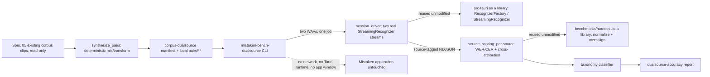

# Spec 16 — ASR Dual-Source, Accent, and Condition Accuracy Benchmark

## 1. Status, Ownership, Base, and Gates

- **Status:** Authored; not implemented. This spec did not exist in the original 15-spec plan (`docs/context/spec-plan.md`); it is a new, additional spec requested after Spec 05's remediation round exhausted every original candidate. `12`, `13`, `14`, and `15` are already assigned to unrelated specs (offline/privacy/performance acceptance, macOS packaging, Windows packaging, cross-platform release), and `01`–`11` are implemented or in flight. `16` is the next unused number.
- **Implementation owner:** One Spec 16 branch/worktree with one writer.
- **Required base:** One clean SHA on `main` containing merged Specs 01–09 (Spec 09 `DEVELOPMENT COMPLETE`, merge commit `0a25613d6b82adad0c01bfcfd3ab11fded6cd9c7`, is the architectural dependency; the recorded base for this spec's own worktree is the tip of `main` at authoring time).
- **Allowed implementation predecessors:** Spec 05 (`BLOCKED — no production candidate approved`, but its corpus/harness/scoring/license infrastructure is implemented and consumed unchanged), Spec 06 (`DEVELOPMENT COMPLETE`, frozen recognizer trait boundary), Spec 09 (`DEVELOPMENT COMPLETE` on macOS, frozen dual-source architecture and structural attribution contract).
- **Not required:** Spec 10 (capture lifecycle/resilience) and Spec 11 (desktop interaction/accessibility). Both are UI/native-lifecycle work; this spec drives the ASR/dual-source pipeline directly and never renders or depends on the Tauri window, so it may proceed while Specs 10/11 are still unmerged.
- **Parallel-safe peers:** None declared. If Spec 10 or 11 is active in a concurrent worktree, this spec touches none of their owned paths (`src/**`, `src-tauri/src/audio/**`, `src-tauri/src/state/**`, `src-tauri/src/commands/**`) and is safe to run alongside them.
- **Zero-edit gate (hard constraint):** This spec makes **zero** changes to any file owned or frozen by Spec 05, Spec 06, Spec 07, Spec 08, or Spec 09. It consumes their code and data as read-only dependencies (Cargo path dependencies and read-only manifest/report inspection), never as edited files. Section 5 states the exact mechanism.
- **Successor gate:** This spec cannot itself approve a production ASR candidate — Spec 05's frozen fidelity gate (`MPR ≥ 0.90`) is unchanged and unaffected by anything here. This spec produces additional evidence (dual-source, accent, and condition accuracy) that feeds a future accuracy-remediation spec (tentatively **Spec 17**, number and exact title **not fixed by this document** — see section 2 and the Open Questions in section 3). Specs 12–15 remain gated on Spec 05 exactly as before; nothing here changes that gate.
- **Session constraint (binding for the first implementation pass):** No new live microphone recording and no live simultaneous mic+system-audio capture occur in the first implementation pass. Every corpus item and every benchmark run in this pass is built from Spec 05's existing, already-consented, already-committed corpus plus deterministic synthetic transformation (digital mixing, codec re-encoding, gain scaling) of that existing audio. Acceptance criteria that require a live human speaker or live hardware capture are explicitly split out and marked `BLOCKED — requires a dedicated future recording/hardware session`, never silently skipped or marked passing. Section 4 and section 12 mark every such criterion individually.
- **Open product-owner question (blocking one condition category only, not the whole spec):** Whether Mistaken's target scope includes transcribing spoken Turkish, or only recognizing Turkish-accented spoken English. Section 3 records this as an explicit open question; section 4 fixes the default scope until it is answered.
- **Review level:** High. This spec extends the accuracy-evidence base for the product's core promise and touches the frozen dual-source and recognizer contracts as a read-only dependency; an incorrect reuse could misrepresent Spec 09's isolation guarantees.

## 2. Goal and Measurable Result

Extend Mistaken's ASR accuracy evidence beyond Spec 05's single-source, unaccented, English-only corpus, without repeating work Spec 05 already did and without weakening any frozen gate, so that:

1. A reproducible **dual-source** corpus exists — pairs of already-recorded Spec 05 clips deterministically mixed on a shared timeline with recorded overlap windows — letting the benchmark measure **per-source** word/character error rate and **cross-attribution correctness** on a real word-level scale, not Spec 09's existing binary "no foreign word leaked" check alone.
2. A reproducible **condition-extension** corpus exists covering system-audio codec degradation, low volume, and Turkish-accented English as explicit **clip-level condition tags** — never as speaker demographic metadata — built from synthetic transformation of existing consented audio wherever possible, with any condition that requires a genuinely new human speaker (Turkish-accented English) recorded as a corpus-schema-ready but **not-yet-recorded** condition pending a dedicated future session.
3. The existing Spec 05 harness (`benchmarks/harness/**`) is **reused as a library dependency**, not edited, not forked, not rewritten. A new, disjoint crate adds exactly the three missing capabilities: source-aware simultaneous scoring, cross-attribution scoring at word granularity, and an extended error taxonomy (proper noun, number, technical term, accent-related confusion, overlapping-speech, low-volume) layered on top of Spec 05's existing substitution/deletion/insertion alignment.
4. At least the three most viable Spec-05-vetted candidates (chosen from the eight already benchmarked, not newly sourced — see section 6) run against this new corpus, offline, and produce per-source WER/CER tables plus the error taxonomy — never a single blended average.
5. A written, evidence-based finding states whether any existing candidate's accuracy gap is uniform across conditions or concentrated in specific ones (dual-source overlap, accent, low volume, codec degradation), and recommends which of **fine-tuning, domain adaptation, or sourcing a new candidate** is the appropriate next step — without pre-committing to one before the evidence exists.
6. Every acceptance criterion that requires live hardware or a new human speaker is completed or is recorded `BLOCKED` with the exact missing prerequisite; none is marked passing on synthetic-only evidence.

The result is measurable from committed manifests, a committed new crate, scored run artifacts, and one report. Reusing Spec 05's already-passing/failing numbers as a citation is not a result; new measurements on the new corpus are.

## 3. Verified Current Behavior

Verified while authoring this spec (2026-09-16, in `/Users/berat/mistaken`, `main` at `b5f6ed9fd4177948534ae56f5df1949c4e64bfea` plus Spec 10 unmerged in its own worktree):

- `docs/context/spec-plan.md` lists Specs 01–15 with fixed titles; `12` is `docs/specs/spec-12-offline-privacy-performance-acceptance.md` (a different spec: the whole-product offline/privacy/performance acceptance gate run after Specs 10–11 merge). No number in `01`–`15` is free; `16` is the next unused number.
- Spec 05 (`docs/specs/spec-05-asr-benchmark-license-gate.md`) is implemented and `BLOCKED — no production candidate approved`. Its corpus (`benchmarks/corpus/manifest.json`) has 130 entries (122 primary 16 kHz clips + 8 duplicate 48 kHz clips), two opaque consented speaker profiles (`sp-01`, `sp-02`), and 12 conditions: `mistake-tense`, `mistake-agreement`, `mistake-article`, `mistake-preposition`, `mistake-order`, `mistake-minimal-pair`, `fillers-repetition`, `fluent-control`, `fast-speech`, `system-playback`, `noise-silence`, `long-turn`. `system-playback` clips are `sp-02`'s voice, distinct from `sp-01`'s, already usable as a second, independent voice track.
- `benchmarks/corpus/manifest.schema.json` forbids any demographic/accent/gender/age field on `speakerProfiles` (`"description": "Opaque speaker profile ledger. No name, gender, age, nationality, accent label, or other personal attribute is permitted here."`) and constrains `id` to `^sp-[0-9]{2}$`. `condition` is a per-**clip** enum, not a per-speaker field.
- 8 candidates across 3 architectures were fully benchmarked on real human speech on `mac-arm64` (`benchmarks/reports/approval.md`, `2026-09-15-mac-arm64.md`). All fail the fidelity gate (`MPR ≥ 0.90`; measured range 0.32–0.67). Root causes are diagnosed per architecture and proven not fixable by decoding-side tuning: Whisper (base/small/q8) performs trained-in silent grammar correction; Sherpa Zipformer variants lose tokens at chunk boundaries on short utterances (export-specific); Vosk's raw acoustic ceiling did not move when the model was scaled 68 MB → 204 MB. Two Sherpa 2023-06-26 variants are additionally license-blocked (unclear upstream provenance). No `win-x64` host exists in any session to date.
- Spec 09 (`docs/specs/spec-09-dual-source-transcription-aggregation.md`) is `DEVELOPMENT COMPLETE` on macOS only, merged into `main`. Its frozen contract (section 6): two fully independent pipelines sharing one `Arc<OnlineRecognizer>`; `AudioSource` travels structurally from platform capture through the pool, inference stage, and worker into `TranscriptSegment.source`, **never inferred** from text/energy/timing/order; segment ids are `mic-<sessionId>-<index>` / `sys-<sessionId>-<index>` with independent per-source indices; one monotonic session clock origin with per-source fed-frame timestamps; cross-source visible order is finalization order, with **no reorder buffer and no timestamp sort anywhere**. Its own real-hardware evidence is 20 utterances (10 astronomy/system, 10 cooking/mic, 3 deliberate overlaps) with **zero cross-attribution mismatches** — a binary "no foreign word leaked" check, not a word-level WER/CER measurement, and not run on Windows.
- Spec 06 (`docs/specs/spec-06-local-asr-microphone-transcription.md`) froze `src-tauri/src/asr/recognizer.rs`: `pub trait StreamingRecognizer: Send { fn accept(&mut self, samples: &[f32]) -> Result<(), AsrError>; fn poll(&mut self, out: &mut Vec<RecognizedSegment>) -> Result<(), AsrError>; fn finish(&mut self, out: &mut Vec<RecognizedSegment>) -> Result<(), AsrError>; }` and `pub trait RecognizerFactory: Send + Sync { fn open_stream(&self, format: crate::audio::PcmFormat) -> Result<Box<dyn StreamingRecognizer>, AsrError>; }`, re-exported from `src-tauri/src/asr/mod.rs`, implemented by `SherpaRecognizerFactory`/`SherpaStreamingRecognizer` in `src-tauri/src/asr/sherpa_adapter.rs`.
- `src-tauri/Cargo.toml` declares `[lib] name = "mistaken_lib" crate-type = ["staticlib", "cdylib", "rlib"]`, and `src-tauri/src/lib.rs` declares `pub mod asr;` and `pub mod audio;` at crate root. The `rlib` crate type and public module tree mean an external, disjoint Cargo crate **can** take `mistaken = { path = "../../src-tauri" }` as a normal Rust library dependency and reuse `RecognizerFactory`/`StreamingRecognizer`/`RecognizedSegment`/`AsrError` **without editing any `src-tauri` file** — verified by reading the manifest and library entrypoint directly, not assumed.
- `benchmarks/harness/Cargo.toml` declares only a `[[bin]]` target, but `benchmarks/harness/src/lib.rs` exists and publicly exports `pub mod adapter; pub mod candidate; pub mod manifest; pub mod normalize; pub mod report; pub mod run_record; pub mod scoring;`, and `benchmarks/harness/src/scoring/mod.rs` publicly exports `pub mod gates; pub mod insertion; pub mod mpr; pub mod wer;`. Cargo's default-target inference therefore also builds an implicit library crate (`mistaken_bench`) alongside the `mistaken-bench` binary, which an external crate can depend on by path to reuse `normalize::normalize_tokens`, `scoring::wer::align`, and related scoring code **without editing any `benchmarks/harness` file** — verified by reading the manifest and module tree directly.
- `benchmarks/harness`'s existing `--concurrency N` flag (`main.rs`, `aggregate_two_stream`) runs N single-file clips in parallel adapter **processes** purely to sum peak-RSS for a resource gate; it does not drive two sources through one session on a shared timeline and does not compute a per-source or cross-attribution accuracy number. This is the exact, verified gap this spec closes — not a misunderstanding of an existing feature.
- No existing corpus, schema, or report anywhere in the repository contains speaker gender, age, nationality, or accent as a stored attribute. This spec must not become the first place that appears.

No implementation report is authoritative. During implementation, the merged source, the real harness/library build, and measured runs become authoritative; any difference from this section is recorded rather than assumed away.

### Open Questions (recorded here per `ai-workflow-rules.md`; must be resolved, or defaulted as stated, before the affected condition is built)

1. **Turkish transcription scope.** Default until explicitly changed: Mistaken's ASR target remains **spoken English, including Turkish-accented English speech**. Full Turkish-language transcription (recognizing and outputting Turkish words) is **out of scope** for this spec and is not benchmarked, modeled, or dataset-designed here. A product-owner decision that explicitly approves full Turkish transcription is required before any future spec expands model or dataset scope to Turkish-language content; this spec does not make or assume that decision.
2. **Whether `sp-03` (the Turkish-accented English speaker) can be recorded in this implementation pass.** Default: no — recording a new human speaker requires a live microphone session with a new consenting participant, which section 1's session constraint defers to a dedicated future session. This spec ships the schema, protocol, and prompts ready for that session, and marks the corresponding acceptance criteria `BLOCKED` until it happens.

## 4. Scope

### In scope — Phase A (buildable now, no live microphone, no new human speaker)

- A new, disjoint corpus namespace `benchmarks/corpus-dualsource/` with its own protocol, schema, manifest, and prompts, additive to (never editing) Spec 05's `benchmarks/corpus/`.
- **Dual-source pairs built by deterministic digital mixing of two already-recorded, already-checksummed Spec 05 clips** (one as the "microphone" track, one as the "system" track — reusing `sp-01` clips as mic-role and `sp-02`'s existing `system-playback` clips as system-role, since they are already two distinct voices) on a shared timeline with recorded overlap windows. No live simultaneous capture; the mixing is deterministic, scripted, and reproducible from the two input clips' existing checksums plus recorded offsets.
- **Synthetic condition transformation** of existing clips: codec degradation (re-encode through a low-bitrate lossy codec and back to PCM, simulating Bluetooth/VoIP quality loss), gain reduction (simulating low-volume capture), and background-noise mixing (reusing Spec 05's own `noise-silence` recordings as the noise bed, not new noise capture). Every transformation is a pure deterministic function of existing committed audio identities plus recorded parameters — reproducible without re-recording anything.
- A new, disjoint Cargo crate `benchmarks/dualsource-driver/` that:
  - depends on `src-tauri` (`mistaken` / `mistaken_lib`) by path, read-only, to reuse `RecognizerFactory`/`StreamingRecognizer`/`RecognizedSegment`/`AsrError` and reproduce Spec 09's segment-id and structural-attribution rules exactly;
  - depends on `benchmarks/harness` (`mistaken-bench` implicit library) by path, read-only, to reuse `normalize::normalize_tokens` and `scoring::wer::align` rather than re-implementing alignment;
  - adds the three genuinely missing capabilities: (a) a session driver that feeds two WAV files through two real recognizer streams on one shared clock, mirroring Spec 09's architecture exactly; (b) per-source WER/CER plus a word-level cross-attribution scorer; (c) an extended error-taxonomy classifier layered on Spec 05's existing alignment output.
  - exposes its own CLI (`mistaken-bench-dualsource`), following Spec 05's exact adapter-process protocol shape (JSON job in, NDJSON events out) so the design pattern is reused, not reinvented.
- Benchmarking the three Spec-05-vetted, license-clean candidates with the best size/latency/streaming balance (`sherpa-zipformer-en-20M-2023-02-17-int8`, `whisper-base-en-q8-ggml`, `vosk-small-en-us` — see section 6 for the selection rationale) against every Phase-A corpus item, on `mac-arm64` only (no `win-x64` host exists in this session, exactly as Spec 05 recorded).
- A written report with per-source WER/CER tables, cross-attribution error counts, and the extended error taxonomy, kept separate from Spec 05's `reports/approval.md` (never edited).
- A corpus-consent, retention, redaction, **export, and delete** protocol for `benchmarks/corpus-dualsource/`, extending Spec 05's already-strong consent/retention/redaction model with the export/delete lifecycle Spec 05 left implicit.
- Recording (in this spec's evidence, not by inventing new benchmarking) that Spec 05's candidate search already exhausted decoding-side remediation across three architecture families, so this spec's job is to characterize **where** the accuracy gap concentrates (source, accent, condition), not to re-run that exhausted search.

### Explicitly out of scope — Phase B (recorded as `BLOCKED`, not attempted, not silently dropped)

- Recording `sp-03` (Turkish-accented English speaker) or any other new human speaker. Requires a dedicated future live-recording session with informed consent obtained first.
- Live, simultaneous, real-microphone-plus-real-system-audio capture through the actual running Tauri application (i.e., an end-to-end hardware validation that ScreenCaptureKit and CPAL truly stay isolated in real time, beyond Spec 09's existing 20-utterance evidence). Requires a dedicated future hardware session; this spec's synthetic mixing proves the **scoring and pipeline-reuse correctness**, not new live-hardware isolation evidence.
- Any `win-x64` measurement (no Windows host exists in any session to date; identical structural blocker to Spec 05).
- Model fine-tuning, training, quantization authoring, distillation, or sourcing a brand-new (not-yet-benchmarked-by-Spec-05) candidate model. Section 6 explains why the existing eight-candidate search is reused rather than repeated, and section 2 explicitly defers the fine-tuning/domain-adaptation/new-candidate decision to a future spec.
- Full Turkish-language transcription (recognition or output of Turkish words) — see Open Question 1.
- Any change to Spec 02's reducer, formatter, serializer, or source-prefix rule; any change to Spec 03's commands/events/errors; any change to Spec 09's frozen ordering/attribution contract; any change to Spec 06's recognizer trait signatures.
- Any UI, `src/**`, or `src-tauri/**` file. This spec never renders anything and never edits the application; its only relationship to `src-tauri` is a read-only library dependency declared in the new crate's own `Cargo.toml`.
- Speaker diarization, voice-identity analysis, emotion classification, or any biometric profiling — identical exclusion to Spec 05, extended to the new corpus.
- CI automation, scheduled re-benchmarking, dashboards, telemetry, or result upload.

## 5. Owned Files and Forbidden Concurrent Files

### Owned during Spec 16 implementation

```text
benchmarks/corpus-dualsource/README.md
benchmarks/corpus-dualsource/protocol.md
benchmarks/corpus-dualsource/manifest.schema.json
benchmarks/corpus-dualsource/manifest.json
benchmarks/corpus-dualsource/prompts/accent-tr-en-<nn>.md      # schema-ready prompts; recording is Phase B
benchmarks/corpus-dualsource/.gitignore
benchmarks/corpus-dualsource/pairs/**                          # local only, Git-ignored: synthesized mixed WAVs
benchmarks/dualsource-driver/Cargo.toml
benchmarks/dualsource-driver/Cargo.lock
benchmarks/dualsource-driver/src/**
benchmarks/dualsource-driver/tests/**
benchmarks/dualsource-driver/fixtures/**
benchmarks/dualsource-driver/scripts/synthesize_pairs.rs        # deterministic WAV mixer/transformer, committed source
benchmarks/reports/<date>-dualsource-accuracy.md
docs/specs/spec-16-asr-dualsource-accuracy-benchmark.md          # this file's own evidence section
```

`benchmarks/corpus-dualsource/.gitignore` is the only new ignore file; it ignores `pairs/**` (the synthesized mixed/transformed WAVs) exactly as Spec 05 ignores `corpus/clips/**`. The **inputs** to synthesis (Spec 05's existing clip ids and checksums) are already committed by Spec 05 and are read, never copied or re-committed.

### Consumed unchanged (read-only; zero edits; zero new files inside these trees)

- `benchmarks/corpus/**` (Spec 05) — read `manifest.json` for existing clip ids, checksums, references, and speaker-profile ids used as dual-source mixing inputs. No new file is added here and no existing file is edited.
- `benchmarks/harness/**` (Spec 05) — consumed as a Cargo path library dependency (`mistaken-bench`) for `normalize` and `scoring::wer`. No file inside `benchmarks/harness/` is created, edited, or deleted by this spec.
- `benchmarks/candidates/**`, `benchmarks/licenses/license-record.md`, `benchmarks/reports/approval.md` (Spec 05) — read for candidate identity, license verdict, and prior gate results. Never edited.
- `src-tauri/**` (Specs 04/06/07/08/09/10) — consumed as a Cargo path library dependency (`mistaken` / `mistaken_lib`) for `RecognizerFactory`, `StreamingRecognizer`, `RecognizedSegment`, `AsrError`, and the segment-id/attribution pattern to reproduce. No file inside `src-tauri/` is created, edited, or deleted by this spec.
- `docs/specs/spec-05-*.md`, `docs/specs/spec-06-*.md`, `docs/specs/spec-09-*.md` — read for their frozen contracts; never edited.
- Product invariants in `docs/context/project-overview.md`, `architecture.md`, `code-standards.md`, `ai-workflow-rules.md`.

### Forbidden concurrent files

- This spec must not create, edit, move, or delete anything under `benchmarks/corpus/**`, `benchmarks/harness/**`, `benchmarks/candidates/**`, `benchmarks/licenses/**`, `benchmarks/adapters/**`, `benchmarks/reports/approval.md`, or any existing dated report under `benchmarks/reports/`.
- This spec must not create, edit, move, or delete anything under `src/**` or `src-tauri/**`, including `Cargo.toml`/`Cargo.lock` — the new crate's dependency on `src-tauri` is a **path dependency declared only in the new crate's own `Cargo.toml`**, which never requires touching `src-tauri/Cargo.toml`.
- This spec must not edit `docs/context/**` (including `progress-tracker.md` and `spec-plan.md`) or any other spec file. Registering Spec 16 in `spec-plan.md`'s dependency table is integration-owner work after this file is reviewed; this spec only records the requirement here.
- This spec must not edit `package.json`, `package-lock.json`, `crates/**`, or any root-level file.
- If a future peer spec needs a Spec-16 number, it reads the committed report; it does not modify `benchmarks/dualsource-driver/**` or `benchmarks/corpus-dualsource/**`.

## 6. Contracts Consumed and Produced

### Consumed — recognizer trait boundary (Spec 06, frozen, unchanged)

```rust
pub trait StreamingRecognizer: Send {
    fn accept(&mut self, samples: &[f32]) -> Result<(), AsrError>;
    fn poll(&mut self, out: &mut Vec<RecognizedSegment>) -> Result<(), AsrError>;
    fn finish(&mut self, out: &mut Vec<RecognizedSegment>) -> Result<(), AsrError>;
}
pub trait RecognizerFactory: Send + Sync {
    fn open_stream(&self, format: crate::audio::PcmFormat) -> Result<Box<dyn StreamingRecognizer>, AsrError>;
}
```

`benchmarks/dualsource-driver` instantiates `SherpaRecognizerFactory` (or a future approved factory) exactly as `src-tauri` does, via its path dependency. It does not fork, wrap with new trait methods, or change this signature.

### Consumed — dual-source architecture pattern (Spec 09, frozen, reproduced not altered)

The session driver reproduces, at the level of a benchmark process rather than the live application, the exact rules Spec 09 froze: one shared `Arc<dyn RecognizerFactory>`; two independent `StreamingRecognizer` streams, one per source; `AudioSource` (`Microphone` | `System`) carried structurally on every emitted segment, never inferred; segment ids `mic-<runId>-<index>` / `sys-<runId>-<index>` with independent per-source indices; one shared clock origin (here: the synthesized pair's timeline origin) with per-source timestamps derived from each source's own fed-frame count; no reorder buffer, no timestamp sort. Where the live application feeds real device callbacks, this driver feeds pre-mixed WAV samples at the pair's recorded pacing — the recognizer-facing contract is identical.

### Consumed — scoring primitives (Spec 05, frozen, reused as a library)

- `mistaken_bench::normalize::normalize_tokens(&str) -> Vec<String>` — the exact four-step normalizer (NFC, lowercase, punctuation strip except inter-letter apostrophe, whitespace collapse). Applied identically to every new reference and hypothesis; not reimplemented.
- `mistaken_bench::scoring::wer::align(..)` — the exact Levenshtein alignment producing `EditOp::{Match, Substitute, Delete, Insert}`. Reused for both per-source WER and as the substrate the new taxonomy classifier reads spans from.

### Produced — dual-source corpus manifest (new schema, additive to Spec 05's)

`benchmarks/corpus-dualsource/manifest.json`, validated against a new `manifest.schema.json` that is a sibling of, and structurally consistent with, Spec 05's — but adds no demographic field anywhere:

```jsonc
{
  "manifestVersion": 1,
  "pairs": [
    {
      "id": "dual-overlap-01",
      "micSourceClipId": "fluent-control-03",       // existing Spec 05 clip id, read-only reference
      "systemSourceClipId": "system-playback-05",   // existing Spec 05 clip id, read-only reference
      "mixedFile": "pairs/dual-overlap-01.wav",     // local only, git-ignored, deterministically generated
      "sha256": "<64 hex, of the generated mix>",
      "condition": "overlap-dual-speaker",
      "overlapWindows": [ { "startMs": 4200, "endMs": 6100 } ],
      "micReference": "the meeting starts at nine tomorrow morning",
      "systemReference": "so the quarterly numbers came in ahead of plan"
    }
  ],
  "soloClips": [
    {
      "id": "system-codec-lowbitrate-01",
      "sourceClipId": "system-playback-02",
      "file": "pairs/system-codec-lowbitrate-01.wav",
      "sha256": "<64 hex>",
      "condition": "system-codec-lowbitrate",
      "transform": { "kind": "codec-roundtrip", "codec": "opus", "bitrateKbps": 16 },
      "reference": "the reference text is inherited verbatim from sourceClipId; never edited"
    }
  ]
}
```

Manifest rules:

- `micSourceClipId` / `systemSourceClipId` / `sourceClipId` reference **existing, already-committed, already-checksummed** Spec 05 clip ids by id only. This manifest never duplicates or re-commits Spec 05's `reference` text or audio; it inherits the reference verbatim and states so.
- `mixedFile` / `file` are the **only** new audio artifacts, generated deterministically by `synthesize_pairs`, git-ignored, and reproducible byte-for-byte from the two input clip ids plus the recorded transform/overlap parameters — never manually edited.
- `condition` enum for this manifest: `overlap-dual-speaker`, `speaker-change`, `system-codec-lowbitrate`, `system-low-volume`, `bluetooth-codec`, `noise-background-dual` (reuses Spec 05's existing `noise-silence` recordings as the noise bed), and `accent-tr-en` (schema-ready; Phase B, no clips populated in this pass — see section 3 Open Question 2).
- No `speakerProfileId`, gender, age, or accent field exists anywhere in this schema. A pair's two voices are identified only by the existing opaque Spec 05 clip ids they came from; this document reuses that opacity rather than inventing new demographic metadata to describe the mix.

### Produced — extended error-taxonomy classification (new)

Layered on Spec 05's existing `EditOp` alignment output, a new classifier assigns each non-`Match` edit and each annotated span one taxonomy tag from: `substitution`, `deletion`, `insertion` (Spec 05's existing three, reused, not renamed), plus new tags `proper-noun`, `number`, `technical-term`, `accent-confusion` (Phase B only, requires `accent-tr-en` clips), `overlapping-speech` (dual-source pairs, inside an `overlapWindows` range), `low-volume` (`system-low-volume` / gain-reduced clips). Tagging a token as `proper-noun`/`number`/`technical-term` is a lightweight, deterministic, dictionary-and-pattern-based classification recorded per token in the corpus manifest's `reference` alongside the existing `errorSpans` mechanism — not a machine-learned classifier, keeping the scorer deterministic per Spec 05's own precedent.

### Produced — dual-source adapter process protocol (new, mirrors Spec 05's shape exactly)

```jsonc
// Job (stdin)
{
  "pairId": "dual-overlap-01",
  "micWavPath": "/abs/path/pairs/dual-overlap-01.wav",   // channel-separated or two files; see impl note below
  "systemWavPath": "/abs/path/...",
  "model": { "...": "identical candidate descriptor fields Spec 05 already defines" },
  "pace": "realtime"
}
```

```jsonc
// Events (stdout, NDJSON)
{ "type": "partial", "atMs": 640,  "source": "mic",    "text": "the meeting starts" }
{ "type": "final",   "atMs": 7710, "source": "system", "text": "so the quarterly numbers came in ahead of plan", "segmentIndex": 0 }
{ "type": "metrics", "atMs": 8200, "audioMs": 8000, "wallMs": 8200, "cpuTimeMs": 3100, "peakRssBytes": 512000000 }
```

The only structural addition over Spec 05's existing protocol is the `source` field on every `partial`/`final` event, carried exactly as Spec 09 carries `AudioSource` — structurally, from the recognizer stream that produced it, never inferred from text.

## 7. User Flow and Developer Verification Flow

There is no end-user flow; this is operator/benchmark tooling exactly like Spec 05.

### Corpus-preparation flow (Phase A, no live recording)

1. Operator confirms Spec 05's `benchmarks/corpus/manifest.json` is present and validated (`mistaken-bench validate-corpus` still passes, unedited).
2. Operator runs `synthesize_pairs` against a small, committed pairing table (which existing clip ids combine into which new pair, with which overlap window and which transform), producing `benchmarks/corpus-dualsource/pairs/**` locally.
3. Operator runs a new `validate-dualsource-corpus` command (part of `benchmarks/dualsource-driver`'s own CLI) that checks presence, checksum, referenced-clip-id existence in Spec 05's manifest, and overlap-window bounds.

### Benchmark flow (Phase A)

1. Operator runs the three selected candidates (already fetched and checksum-verified per Spec 05; not re-fetched) against every dual-source pair and solo-condition clip, offline, on `mac-arm64`.
2. The driver scores per-source WER/CER, cross-attribution error count, and the extended taxonomy; a report is rendered to `benchmarks/reports/<date>-dualsource-accuracy.md`.
3. Operator writes the evidence-based recommendation (fine-tuning vs. domain adaptation vs. new-candidate sourcing vs. "gap is uniform, no single fix indicated") into this spec's section 16 evidence record.

### Phase B flow (recorded here for continuity; not executed in this pass)

1. A dedicated future session obtains informed consent from a Turkish-accented English speaker (`sp-03`), records the already-written `accent-tr-en` prompts, and registers the clips in `benchmarks/corpus-dualsource/manifest.json`.
2. A dedicated future hardware session runs the real Tauri application with real simultaneous microphone and system-audio capture to add live-hardware isolation evidence alongside this spec's synthetic-mixing evidence.

### Developer verification flow

- `cargo test` inside `benchmarks/dualsource-driver` exercises: the mixing/transform determinism (same inputs and parameters byte-reproduce the same output checksum), the session driver against committed synthetic PCM fixtures (not real speech), per-source WER computation reusing `mistaken_bench::scoring::wer`, cross-attribution detection on a fixture with a deliberately swapped word, and taxonomy classification on fixture spans.
- Real inference on the real (synthetically mixed, but really-recorded-source) audio on `mac-arm64` is mandatory evidence for the accuracy claims; fixtures prove the scorer, not a model.

## 8. UI Behavior, States, Tokens, and Accessibility

None. This spec adds no user interface, no component, no token, and no accessibility surface; `src/**` is untouched, identical to Spec 05's section 8 declaration.

## 9. Frontend → Tauri IPC → Rust / Audio / ASR Data Flow

This spec defines **no** frontend, IPC, Tauri command, event, capability, or in-application code path. `benchmarks/dualsource-driver` depends on `src-tauri`'s library crate for its recognizer types only; it never runs inside, links into, or is invoked by the Mistaken application binary.



Data-flow rules:

- Audio flows existing-clip → synthesized-pair-file → driver only. No PCM enters the report artifacts.
- Recognizer text flows the reused `RecognizerFactory` → driver verbatim; normalization happens once, via the reused Spec 05 normalizer, applied symmetrically to references and hypotheses.
- No stage may consult a grammar checker, spell checker, rewriter, or LLM — identical prohibition to Spec 05.
- This spec's evidence is consumed as data by a future accuracy-remediation spec; it does not itself alter `benchmarks/reports/approval.md` or Spec 05's approval status.

## 10. Platform, Permissions, Offline, Privacy, and Fallback

### Reference hosts

- `mac-arm64` only in this pass, identical structural limitation to Spec 05: no `win-x64` host exists. Every dual-source/accuracy number in this pass is `mac-arm64`-only and is recorded as such, never presented as cross-platform evidence.

### Permissions

- No microphone, screen-recording, or accessibility permission is requested by anything in this spec. `synthesize_pairs` reads existing WAV files and writes new ones; the driver reads WAV files and calls the recognizer library directly. No capture device is opened by any process this spec introduces.

### Offline and privacy

- Every measured run executes with networking disabled, identical to Spec 05.
- No new personal data is collected. `micSourceClipId`/`systemSourceClipId` reference already-consented Spec 05 clips; no new consent artifact is required for Phase A because no new human subject is recorded in Phase A.
- **Phase B consent, extended beyond Spec 05's model:** before `sp-03` is recorded, `benchmarks/corpus-dualsource/protocol.md` requires written confirmation of: (1) purpose (local ASR benchmark development), (2) local-only processing, never uploaded, (3) the exact condition tag (`accent-tr-en`) the recording will be used to name — disclosed to the speaker as a description of the *benchmark scenario*, not a biometric classification of them, and (4) the following four rights, which Spec 05's protocol did not spell out and this spec adds:
  - **Export:** the speaker may request the exact prompt list and reference transcripts (never third-party audio) associated with their profile at any time; the opaque profile id and consent record are retrievable by that id.
  - **Delete:** the speaker may withdraw consent at any time; on withdrawal, the profile's `consentGiven` is set `false`, every clip whose `speakerProfileId` matches is removed from `benchmarks/corpus-dualsource/pairs/**` and the manifest, and any already-published report is annotated (not silently altered) noting which numbers depended on the withdrawn profile.
  - **Retention:** local audio is retained only as long as needed to keep the manifest reproducible; a speaker's withdrawal triggers deletion within the same working session it is requested, not a scheduled future purge.
  - **No re-identification:** the opaque id is never mapped back to a name in any committed file, log, or report; the mapping (if it exists at all, e.g. to contact the speaker for consent) lives outside the repository entirely.
- No speaker identity, demographic attribute, or accent label is recorded anywhere. Condition tags describe **clips**, never speakers. This is identical to Spec 05's rule, and this spec's schema (section 6) enforces it structurally by never adding a demographic field.
- `benchmarks/corpus-dualsource/.gitignore` ignores `pairs/**`; the implementation verifies with `git status`/`git check-ignore` that no audio is staged, identical to Spec 05's verification method.

### Fallback rules

- A condition that cannot be built synthetically without a new human speaker (`accent-tr-en`) is recorded as `BLOCKED — Phase B, requires dedicated recording session`, never faked with a text-to-speech accent simulation presented as real accented speech.
- A candidate that cannot run against the new corpus is recorded `blocked` with its exact error, identical to Spec 05's rule; never silently excluded from the report.
- If the evidence shows the accuracy gap is not concentrated in any one new condition (i.e., dual-source/accent/noise numbers track the existing Spec 05 mic-only numbers within a small margin), that is itself the reported finding — "the gap is general, not source- or condition-specific" — not treated as a null result to be hidden.

## 11. Resource Lifecycle, Bounded Buffering, Errors, and Recovery

### Process lifecycle

- `synthesize_pairs` is a one-shot batch tool; it processes one pair/transform at a time, writes one output file, and exits. No long-running process, no daemon.
- `mistaken-bench-dualsource` spawns recognizer streams in-process (via the `mistaken_lib` dependency), not as subprocesses — unlike Spec 05's adapters, which are separate executables. This is a deliberate difference: reusing the real `RecognizerFactory` in-process is what lets this driver reproduce Spec 09's exact architecture; a subprocess boundary would require re-serializing PCM across a pipe for no benefit. The CLI process itself has the same wall-clock timeout discipline as Spec 05 (`max(30 s, 10× pair duration)`), and is terminated and the pair marked `timeout` on breach.
- Every spawned recognizer stream is dropped (freeing the `Box<dyn StreamingRecognizer>`) before the process reports its `metrics` event, so reported peak RSS covers the real session.

### Bounded buffering

- The driver reads each WAV pair in bounded frames (≤ 1 s) and feeds each recognizer stream in fixed chunks, mirroring Spec 09's `100×20ms` pool / `30×100ms` inference-stage bounds rather than loading a whole clip into one buffer.
- NDJSON output lines are capped at 64 KiB, identical to Spec 05's protocol rule.

### Error taxonomy (additive to Spec 05's; identical codes reused where they apply)

| Code | Cause | Driver behavior |
|---|---|---|
| `corpus_invalid` | Missing pair file, checksum mismatch, referenced Spec 05 clip id not found | Refuse to run; name pair and rule (reused from Spec 05) |
| `mix_nondeterministic` | Re-running `synthesize_pairs` on the same inputs/parameters produces a different checksum | Refuse; record as a High finding — mixing must be a pure function |
| `cross_attribution_violation` | A reference token unique to one source appears in the other source's finalized hypothesis outside any tolerance | Record as a scored finding, not a crash — this is a measured outcome, not an error |
| `model_load_failed` / `protocol_error` / `timeout` | Identical meaning to Spec 05 | Identical handling: record and continue remaining pairs |

### Recovery

- Re-running a candidate creates a new `runs/<timestamp>/` directory under `benchmarks/dualsource-driver/`, mirroring Spec 05's immutable-run-directory rule; prior runs are never overwritten in place.

## 12. Numbered Measurable Acceptance Criteria

Each criterion is tagged `[PHASE A]` (achievable now, synthetic/reuse-only, no live microphone) or `[PHASE B — BLOCKED]` (requires a dedicated future live-recording or live-hardware session; explicitly not attempted, not marked passing, in this implementation pass).

1. **[PHASE A] Isolation and zero-edit base:** Spec 16 runs in its own worktree from a recorded base SHA on `main`; the final diff touches only the paths listed in section 5's "Owned during Spec 16 implementation"; `git status` and `git diff --stat` show **zero** changes to `benchmarks/corpus/**`, `benchmarks/harness/**`, `benchmarks/candidates/**`, `benchmarks/licenses/**`, `benchmarks/adapters/**`, `benchmarks/reports/approval.md`, any existing dated report, `src/**`, `src-tauri/**`, `crates/**`, `docs/context/**`, `package.json`, `package-lock.json`, or any other spec file.
2. **[PHASE A] Reuse, not reinvention, verified by inspection:** `benchmarks/dualsource-driver/Cargo.toml` declares path dependencies on `src-tauri` and `benchmarks/harness`; inspection confirms `RecognizerFactory`/`StreamingRecognizer`/`AsrError`/`RecognizedSegment` and `normalize::normalize_tokens`/`scoring::wer::align` are imported from those dependencies, not redefined in the new crate.
3. **[PHASE A] Dual-source corpus exists and validates:** `benchmarks/corpus-dualsource/manifest.json` references only existing Spec 05 clip ids for its mixing inputs; every `pairs[].sha256` and `soloClips[].sha256` matches the locally generated file; a `validate-dualsource-corpus` command exits zero; re-running `synthesize_pairs` on the same inputs reproduces byte-identical checksums (determinism proof).
4. **[PHASE A] No demographic metadata anywhere:** inspection of `benchmarks/corpus-dualsource/**` finds no gender, age, nationality, or accent field on any speaker/profile object; `condition` values are the only place `accent-tr-en`/etc. appear, and only as a per-clip tag.
5. **[PHASE A] No new committed audio:** `git check-ignore` confirms `benchmarks/corpus-dualsource/pairs/**` is ignored; the commit contains no `.wav` file.
6. **[PHASE A] Per-source WER/CER, not one blended average:** the dualsource-accuracy report publishes `mic_wer`, `system_wer`, `dualsource_mic_wer` (overlap windows only), and `dualsource_system_wer` (overlap windows only) as four distinct numbers per candidate, never collapsed into a single figure.
7. **[PHASE A] Cross-attribution scored at word level:** for every dual-source pair, the driver reports a numeric cross-attribution error count (reference tokens from one source appearing in the other source's hypothesis), not merely a binary pass/fail; at least 20 pairs with at least 5 overlap windows are scored.
8. **[PHASE A] Extended error taxonomy reported per candidate:** substitution/deletion/insertion (reused) plus proper-noun/number/technical-term/overlapping-speech/low-volume counts are reported per candidate and per condition; `accent-confusion` is reported as `NOT MEASURED — Phase B` rather than a fabricated zero.
9. **[PHASE A] At least three Spec-05-vetted candidates benchmarked on the new corpus:** `sherpa-zipformer-en-20M-2023-02-17-int8`, `whisper-base-en-q8-ggml`, `vosk-small-en-us` (or a documented substitution with the same rationale) each run the full Phase-A corpus offline on `mac-arm64`; ≥ 98% of items contribute to any published aggregate, mirroring Spec 05's coverage gate.
10. **[PHASE A] Evidence-based next-step finding, not a predetermined conclusion:** the report states, per candidate, whether the accuracy gap in dual-source/noisy/low-volume conditions is (a) statistically indistinguishable from Spec 05's existing mic-only gap, or (b) meaningfully worse in a named condition, and recommends fine-tuning, domain adaptation, new-candidate sourcing, or "insufficient signal to recommend" accordingly — never asserting fine-tuning is required without this comparison.
11. **[PHASE A] Privacy lifecycle documented:** `benchmarks/corpus-dualsource/protocol.md` states consent, retention, redaction, export, and delete rules explicitly, including the Phase-B `sp-03` procedure; a reviewer confirms no existing Spec 05 consent record is altered.
12. **[PHASE B — BLOCKED] Turkish-accented English corpus recorded:** `sp-03` consented and recorded, `accent-tr-en` clips registered in the manifest, `accent-confusion` taxonomy populated. Recorded here as explicitly not run in this pass; the exact missing prerequisite (a consenting Turkish-accented English speaker and a live microphone session) is stated in the evidence record, not silently omitted.
13. **[PHASE B — BLOCKED] Live simultaneous hardware capture evidence:** a real Tauri application session with real, live, simultaneous microphone and system-audio capture, beyond Spec 09's existing 20-utterance evidence, exercising this spec's scoring against genuinely live-captured (not synthetically mixed) dual-source audio. Recorded as not run in this pass; requires a dedicated future hardware session.
14. **[PHASE B — BLOCKED] `win-x64` evidence:** identical structural blocker to Spec 05; no measurement exists without a Windows host.
15. **[PHASE A] Offline proof:** every measured run executes with networking disabled; inspection finds no socket, DNS, HTTP, or update-check code path in the new crate.
16. **[PHASE A] Checks and cleanup:** `cargo fmt --check`, `cargo clippy --all-targets --all-features -- -D warnings`, and `cargo test` pass in `benchmarks/dualsource-driver`; no change to `cargo fmt`/`clippy`/`test` results in `src-tauri` or `benchmarks/harness` (proving the zero-edit constraint held); temporary probes and scratch artifacts are removed.
17. **[PHASE A] High-capability review:** covers reuse correctness (no accidental fork of Spec 06/09 contracts), mixing determinism, cross-attribution scoring correctness, taxonomy classification correctness, privacy compliance (no demographic leakage), and honest Phase A/B labeling; every High/Medium finding is fixed and re-verified.

## 13. Acceptance Criterion → Verification/Test Mapping

| AC | Verification or permanent test | Evidence to record |
|---|---|---|
| 1 | Inspect base SHA, worktree, branch, and final `git status`/diff path list | Root, branch, base SHA, changed paths, zero out-of-scope changes |
| 2 | Inspect `Cargo.toml` dependency declarations and import statements | Dependency lines, import sites, confirmation of zero redefinition |
| 3 | Run `validate-dualsource-corpus`; re-run `synthesize_pairs` twice and diff checksums | Command output, checksum equality across two runs |
| 4 | Grep `benchmarks/corpus-dualsource/**` for demographic field names | Zero-match confirmation |
| 5 | `git check-ignore` on `pairs/**`; inspect commit contents | Ignore result, staged-file list |
| 6 | Report generation; manual inspection of the four published numbers per candidate | Per-candidate mic/system/dual-mic/dual-system WER table |
| 7 | Cross-attribution scorer output across ≥ 20 pairs, ≥ 5 overlap windows | Per-pair cross-attribution counts, aggregate rate |
| 8 | Taxonomy classifier output per candidate/condition | Per-tag counts table, explicit `NOT MEASURED` for `accent-confusion` |
| 9 | Full Phase-A corpus runs per candidate on `mac-arm64` | Run directories, contribution percentage, blocked candidates with errors |
| 10 | Comparative analysis: new-corpus numbers vs. Spec 05's existing mic-only numbers | Written finding with recommendation and its evidentiary basis |
| 11 | Review `protocol.md` against the five listed clauses | Clause-by-clause confirmation |
| 12 | N/A this pass | `BLOCKED` status plus exact missing prerequisite |
| 13 | N/A this pass | `BLOCKED` status plus exact missing prerequisite |
| 14 | N/A this pass | `BLOCKED` status, identical to Spec 05's own recorded blocker |
| 15 | Network-disabled runs plus code inspection | Disable method, inspection notes, zero network findings |
| 16 | `cargo fmt --check`/`clippy`/`test` in the new crate; re-run Spec 05/06/09's own checks unchanged | Exact commands/exits; confirmation prior specs' checks are unaffected |
| 17 | High-capability review of the finished diff | Findings, dispositions, final Git state |

Permanent tests protect mixing determinism, driver correctness against fixtures, per-source scoring, cross-attribution detection, and taxonomy classification. They must not assert that a function forwards a value or that a report contains a specific sentence. Accuracy claims can only be proven by real measured runs on the real (existing, consented) recorded speech; Phase B claims cannot be satisfied by any test or synthetic substitute.

## 14. Ordered Implementation Plan

1. Create the Spec 16 worktree from the recorded base SHA on `main`; confirm no peer spec owns any path this spec will touch.
2. Re-read Spec 05, Spec 06 section 6, Spec 09 section 6, and this spec in full; confirm `benchmarks/harness/src/lib.rs` and `src-tauri/src/lib.rs` still expose the modules cited in section 3 exactly as read; if either has changed, record the drift before proceeding.
3. Scaffold `benchmarks/dualsource-driver/Cargo.toml` with path dependencies on `../../src-tauri` and `../harness`, an empty `[workspace]` table (so it never joins the application workspace, mirroring Spec 05's own rule), and a committed `Cargo.lock`.
4. Write `benchmarks/corpus-dualsource/protocol.md` (consent/retention/redaction/export/delete) and `manifest.schema.json` first; write the `accent-tr-en` prompts as schema-ready but unrecorded.
5. Implement `synthesize_pairs` (deterministic WAV mixing/transform) with a fixture test proving byte-identical reproduction from the same inputs/parameters.
6. Choose and record the mixing pairing table (which existing Spec 05 clip ids combine into which pairs, with which overlap windows), run `synthesize_pairs`, and populate `manifest.json`.
7. Implement `session_driver` reusing `RecognizerFactory`/`StreamingRecognizer` from the `src-tauri` dependency, reproducing Spec 09's segment-id/attribution/ordering rules; test against synthetic PCM fixtures first, never real speech in unit tests.
8. Implement `source_scoring` reusing `normalize`/`scoring::wer` from the `benchmarks/harness` dependency; add the cross-attribution scorer and taxonomy classifier with fixture tests, including a fixture with a deliberately swapped word to prove cross-attribution detection actually fires.
9. Run the three selected candidates against the full Phase-A corpus, networking disabled, on `mac-arm64`; render the dualsource-accuracy report.
10. Write the comparative finding (AC 10) and the explicit Phase B blocker statements (AC 12–14) into this file's evidence record.
11. Run `cargo fmt --check`, `cargo clippy --all-targets --all-features -- -D warnings`, `cargo test` in the new crate; separately re-run Spec 05's and Spec 09's own existing checks unmodified to prove zero regression from the read-only dependency.
12. High-capability review of the full diff for accidental edits to any frozen file, mixing determinism, scoring correctness, and privacy compliance; fix every High/Medium finding.
13. Remove scratch artifacts and temporary probes; create the focused local commit; report roots, branches, base and final SHAs, and evidence; do not push unless requested.

## 15. Risks, Rollback, Cleanup, and Preservation Rules

### Risks and mitigations

- **Accidentally editing a frozen file while wiring the path dependency:** the temptation to add a `[lib]` stanza or a re-export to `src-tauri` or `benchmarks/harness` "just to make the import cleaner." Both already expose everything needed (section 3); AC 1/2 verify zero edits.
- **Presenting Phase-B-blocked criteria as passing:** the single most important risk this spec's own author (this document) exists to prevent. Every Phase B item is enumerated with its exact missing prerequisite, and the Definition of Done in section 16 refuses to call the spec fully done while any Phase B item is open.
- **Demographic metadata creeping in through a "helpful" field:** a future implementer adding `"gender": "male"` next to a system-speaker clip because "it's useful for the report." The schema in section 6 has no such field by design, and AC 4 greps for it.
- **Mixing nondeterminism silently producing different scores across runs:** guarded by `mix_nondeterministic` in section 11's error taxonomy and the determinism proof in AC 3.
- **Treating a null result as a failure to hide:** if dual-source/noisy conditions do not meaningfully worsen accuracy versus Spec 05's existing numbers, that is reported as the finding (AC 10), not omitted because it is less dramatic.
- **Scope creep into fine-tuning:** the temptation to "just try a quick LoRA pass since the gap is clear." Out of scope by section 4; section 2 explicitly defers this to a future spec whose scope this spec's evidence determines, not predetermines.
- **Reusing Spec 05's harness incorrectly (e.g., re-normalizing already-normalized text):** guarded by fixture tests in AC 3/8 and by importing the function directly rather than re-transcribing its logic.

### Rollback

- Before merge, abandon the Spec 16 branch/worktree; nothing in Spec 05, Spec 06, Spec 09, or the application is affected, because nothing there was edited.
- After merge, reverting Spec 16 removes `benchmarks/corpus-dualsource/**`, `benchmarks/dualsource-driver/**`, and the new dated report only.
- Local ignored directories (`benchmarks/corpus-dualsource/pairs/**`) are regenerable data; rollback never needs to "restore" them since they are reproducible from committed inputs.
- Never reset, clean, or delete unrelated user work, another worktree, or any Spec 05/06/09-owned file.

### Required cleanup

- Remove scratch mixing experiments, ad hoc scoring notebooks, partial run directories, and verbose logs.
- Retain only the committed protocol, schema, manifest, prompts, driver source, fixtures, and reports.
- Ensure no synthesized WAV, real speech excerpt beyond already-committed Spec 05 reference text, or absolute operator path is staged in a committed file.

### Preservation rules

- Preserve every Spec 05/06/09 frozen contract exactly as read in section 3; this spec's own tests fail if a future edit to this crate silently forks one of them.
- Preserve Spec 05's opaque-speaker-id and no-demographic-metadata rule, extended rather than relaxed.
- Preserve the zero-dependency-creep discipline: the new crate's only path dependencies are `src-tauri` and `benchmarks/harness`; no new external crate is added without checking it solves a requirement in this spec and carries a compatible license.
- Preserve every prior run directory as immutable evidence, mirroring Spec 05.

## 16. Definition of Done and Evidence Record

Spec 16's Phase A is done only when the new dual-source and condition-extension corpus validates cleanly from existing Spec 05 audio and recorded synthesis parameters with no new recording, the new crate reuses Spec 06's recognizer trait and Spec 05's scoring library with zero edits to either, at least three Spec-05-vetted candidates run the full Phase-A corpus offline on `mac-arm64` with per-source WER/CER, word-level cross-attribution, and the extended error taxonomy all reported separately, a written evidence-based finding recommends (or explicitly declines to recommend, citing insufficient signal) fine-tuning, domain adaptation, or new-candidate sourcing, the privacy protocol adds consent/export/delete rules without ever recording demographic metadata, and every Phase B criterion is recorded `BLOCKED` with its exact missing prerequisite rather than silently passed or dropped. Phase A completion does **not** constitute Phase B completion, does not approve a production candidate, and does not alter Spec 05's `BLOCKED` status.

### Required implementation evidence

Fill during implementation; do not predeclare success:

- **Implementation status:** Pending.
- **Canonical repository root:** `/Users/berat/mistaken`.
- **Worktree root / branch / base SHA / implementation commit SHA:** Pending.
- **Changed paths and zero-forbidden-path confirmation:** Pending.
- **Dual-source pairing table and determinism proof:** Pending.
- **Per-source WER/CER table (mic / system / dual-mic / dual-system) per candidate:** Pending.
- **Cross-attribution error counts across all scored pairs and overlap windows:** Pending.
- **Extended error taxonomy table per candidate/condition, with `accent-confusion` marked `NOT MEASURED — Phase B`:** Pending.
- **Comparative finding: is the accuracy gap general or condition-concentrated, and which of fine-tuning/domain-adaptation/new-candidate-sourcing is recommended:** Pending.
- **Privacy protocol review confirmation (no demographic metadata found):** Pending.
- **Phase B blockers, restated with exact missing prerequisite:** Pending.
- **Typecheck/lint/test results for the new crate, and confirmation Spec 05/06/09's own checks are unaffected:** Pending.
- **High-capability review findings and dispositions:** Pending.
- **Final Git status:** Pending.

### Authoring evidence and sources

- Audited via four parallel read-only reviews of: `docs/specs/spec-05-asr-benchmark-license-gate.md` and its full corpus/harness/report/license tree; `docs/specs/spec-09-dual-source-transcription-aggregation.md` and `docs/specs/spec-06-local-asr-microphone-transcription.md` plus `src-tauri/src/asr/**`; `benchmarks/harness/src/**` in full; `docs/context/spec-plan.md`, `docs/specs/spec-12-offline-privacy-performance-acceptance.md`'s title/goal, `docs/context/architecture.md`, `docs/context/ai-workflow-rules.md`, and `benchmarks/corpus/protocol.md`'s privacy clauses.
- Directly verified (not delegated) on 2026-09-16: `benchmarks/corpus/manifest.schema.json`'s exact `condition`/`kind`/`speakerProfiles` enums and the "no demographic attribute" clause; `src-tauri/Cargo.toml`'s `[lib] crate-type = ["staticlib", "cdylib", "rlib"]` and `src-tauri/src/lib.rs`'s `pub mod asr;`/`pub mod audio;`; `benchmarks/harness/Cargo.toml`'s `[[bin]]`-only manifest plus the physically present `benchmarks/harness/src/lib.rs` and its public module re-exports, confirming the path-dependency reuse design is buildable without editing either crate.

Authoring this file is not implementation evidence. Every pending field remains pending until Spec 16 is applied in the real repository and real measured runs on the new corpus are observed.
